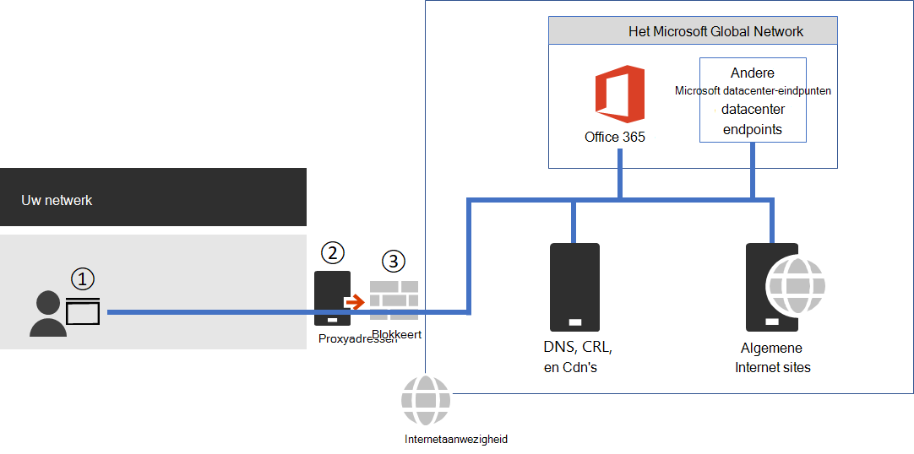

# <a name="managing-office-365-endpoints"></a><span data-ttu-id="844a1-103">Office 365-eindpunten beheren</span><span class="sxs-lookup"><span data-stu-id="844a1-103">Managing Office 365 endpoints</span></span>

<span data-ttu-id="844a1-104">Voor de meeste ondernemingen met meerdere Office-locaties en een verbinding met een WAN-verbinding is de configuratie voor Office 365-netwerkconnectiviteit nodig.</span><span class="sxs-lookup"><span data-stu-id="844a1-104">Most enterprise organizations that have multiple office locations and a connecting WAN will need configuration for Office 365 network connectivity.</span></span> <span data-ttu-id="844a1-105">U kunt uw netwerk optimaliseren door alle vertrouwde Office 365-netwerkaanvragen rechtstreeks via uw firewall te verzenden, zodat alle extra inspectie of verwerking van pakketniveau wordt genegeerd.</span><span class="sxs-lookup"><span data-stu-id="844a1-105">You can optimize your network by sending all trusted Office 365 network requests directly through your firewall, bypassing all additional packet level inspection or processing.</span></span> <span data-ttu-id="844a1-106">Dit vermindert de latentie en de vereisten voor de capaciteit van de verbinding.</span><span class="sxs-lookup"><span data-stu-id="844a1-106">This reduces latency and your perimeter capacity requirements.</span></span> <span data-ttu-id="844a1-107">Het identificeren van het netwerkverkeer van Office 365 is de eerste stap bij het leveren van optimale prestaties voor uw gebruikers.</span><span class="sxs-lookup"><span data-stu-id="844a1-107">Identifying Office 365 network traffic is the first step in providing optimal performance for your users.</span></span> <span data-ttu-id="844a1-108">Zie voor meer informatie de [beginselen voor de netwerkverbindingen van Office 365](microsoft-365-network-connectivity-principles.md).</span><span class="sxs-lookup"><span data-stu-id="844a1-108">For more information, see [Office 365 Network Connectivity Principles](microsoft-365-network-connectivity-principles.md).</span></span>

<span data-ttu-id="844a1-109">Microsoft raadt u aan toegang te krijgen tot de netwerkeindpunten van Office 365 en de voortdurende wijzigingen door te voeren met behulp van de [IP-adressen en URL-webservice van office 365](microsoft-365-ip-web-service.md).</span><span class="sxs-lookup"><span data-stu-id="844a1-109">Microsoft recommends you access the Office 365 network endpoints and ongoing changes to them using the [Office 365 IP Address and URL Web Service](microsoft-365-ip-web-service.md).</span></span>

<span data-ttu-id="844a1-110">Ongeacht de manier waarop u belangrijk netwerkverkeer van Office 365 beheert, is voor Office 365 een Internet verbinding vereist.</span><span class="sxs-lookup"><span data-stu-id="844a1-110">Regardless of how you manage vital Office 365 network traffic, Office 365 requires Internet connectivity.</span></span> <span data-ttu-id="844a1-111">Andere netwerkeindpunten waarbij de verbinding is vereist, worden weergegeven op [extra eindpunten die niet zijn opgenomen in het Office 365 IP Address en URL web service](additional-office365-ip-addresses-and-urls.md).</span><span class="sxs-lookup"><span data-stu-id="844a1-111">Other network endpoints where connectivity is required are listed at [Additional endpoints not included in the Office 365 IP Address and URL Web service](additional-office365-ip-addresses-and-urls.md).</span></span>

<span data-ttu-id="844a1-112">Hoe u de netwerkeindpunten van Office 365 gebruikt, is afhankelijk van de netwerkarchitectuur van uw organisatie.</span><span class="sxs-lookup"><span data-stu-id="844a1-112">How you use the Office 365 network endpoints will depend on your enterprise organization network architecture.</span></span> <span data-ttu-id="844a1-113">Dit artikel bevat een overzicht van de manieren waarop netwerk architecturen van het bedrijf kunnen worden geïntegreerd met Office 365 IP-adressen en Url's.</span><span class="sxs-lookup"><span data-stu-id="844a1-113">This article outlines several ways that enterprise network architectures can integrate with Office 365 IP addresses and URLs.</span></span> <span data-ttu-id="844a1-114">De eenvoudigste manier om te bepalen welke netwerkaanvragen u wilt vertrouwen, is door gebruik te kunnen maakt van een SD-WAN-apparaat dat op elk van uw Office-locaties ondersteuning biedt voor automatische configuratie van Office 365.</span><span class="sxs-lookup"><span data-stu-id="844a1-114">The easiest way to choose which network requests to trust is to use SD-WAN devices that support automated Office 365 configuration at each of your office locations.</span></span>

## <a name="sd-wan-for-local-branch-egress-of-vital-office-365-network-traffic"></a><span data-ttu-id="844a1-115">SD-WAN voor lokale branch-uitgebrachte cruciale Office 365-netwerkverkeer</span><span class="sxs-lookup"><span data-stu-id="844a1-115">SD-WAN for local branch egress of vital Office 365 network traffic</span></span>

<span data-ttu-id="844a1-116">U kunt op elke filiaallocatie een SD-WAN-apparaat maken dat is geconfigureerd voor het routeren van gegevens van Office 365, de categorie eindpunten optimaliseren of categorieën optimaliseren en toestaan rechtstreeks naar het netwerk van Microsoft.</span><span class="sxs-lookup"><span data-stu-id="844a1-116">At each branch office location, you can provide an SD-WAN device that is configured to route traffic for Office 365 Optimize category of endpoints, or Optimize and Allow categories, directly to Microsoft's network.</span></span> <span data-ttu-id="844a1-117">Het andere netwerkverkeer, waaronder on-premises datacenter verkeer, algemeen verkeer van Internet sites en verkeer naar Office 365 Standaardeindpunten voor de eindpunten van de netwerkverbinding.</span><span class="sxs-lookup"><span data-stu-id="844a1-117">Other network traffic including on-premises datacenter traffic, general Internet web sites traffic, and traffic to Office 365 Default category endpoints is sent to another location where you have a more substantial network perimeter.</span></span>

<span data-ttu-id="844a1-118">Microsoft werkt met SD-WAN-providers om geautomatiseerde configuratie mogelijk te maken.</span><span class="sxs-lookup"><span data-stu-id="844a1-118">Microsoft is working with SD-WAN providers to enable automated configuration.</span></span> <span data-ttu-id="844a1-119">Zie voor meer informatie [Office 365 Networking partner programma](microsoft-365-networking-partner-program.md).</span><span class="sxs-lookup"><span data-stu-id="844a1-119">For more information, see [Office 365 Networking Partner Program](microsoft-365-networking-partner-program.md).</span></span>

<span data-ttu-id="844a1-120"><a name="pacfiles"> </a></span><span class="sxs-lookup"><span data-stu-id="844a1-120"><a name="pacfiles"> </a></span></span>
## <a name="use-a-pac-file-for-direct-routing-of-vital-office-365-traffic"></a><span data-ttu-id="844a1-121">Een PAC-bestand gebruiken voor de directe routering van cruciale Office 365-verkeer</span><span class="sxs-lookup"><span data-stu-id="844a1-121">Use a PAC file for direct routing of vital Office 365 traffic</span></span>

<span data-ttu-id="844a1-122">Gebruik PAC-of WPAD-bestanden om netwerkaanvragen te beheren die zijn gekoppeld aan Office 365, maar geen IP-adres.</span><span class="sxs-lookup"><span data-stu-id="844a1-122">Use PAC or WPAD files to manage network requests that are associated with Office 365 but don't have an IP address.</span></span> <span data-ttu-id="844a1-123">Typische netwerkaanvragen die worden verzonden via een proxy of een verbindingsapparaat zorgen voor een langere latentie.</span><span class="sxs-lookup"><span data-stu-id="844a1-123">Typical network requests that are sent through a proxy or perimeter device increase latency.</span></span> <span data-ttu-id="844a1-124">Met SSL-onderbreking en-inspectie wordt de grootste latentie gemaakt, andere services, zoals proxyverificatie en reputatie zoeken, kunnen leiden tot verminderde prestaties en een onjuiste gebruikerservaring.</span><span class="sxs-lookup"><span data-stu-id="844a1-124">While SSL Break and Inspect creates the largest latency, other services such as proxy authentication and reputation lookup can cause poor performance and a bad user experience.</span></span> <span data-ttu-id="844a1-125">Daarnaast zijn deze perimeternetwerk apparaten voldoende capaciteit om alle netwerk verbindingsaanvragen te kunnen verwerken.</span><span class="sxs-lookup"><span data-stu-id="844a1-125">Additionally, these perimeter network devices need enough capacity to process all of the network connection requests.</span></span> <span data-ttu-id="844a1-126">U wordt aangeraden uw proxy of controleapparatuur te negeren voor direct Office 365-netwerkaanvragen.</span><span class="sxs-lookup"><span data-stu-id="844a1-126">We recommend bypassing your proxy or inspection devices for direct Office 365 network requests.</span></span>
  
<span data-ttu-id="844a1-127">[PowerShell Gallery Get-PacFile](https://www.powershellgallery.com/packages/Get-PacFile) is een PowerShell-script dat de laatste netwerkeindpunten leest van de IP-adressen en URL-webservice van Office 365 en een voorbeeld van een PAC-bestand maken.</span><span class="sxs-lookup"><span data-stu-id="844a1-127">[PowerShell Gallery Get-PacFile](https://www.powershellgallery.com/packages/Get-PacFile) is a PowerShell script that reads the latest network endpoints from the Office 365 IP Address and URL Web service and creates a sample PAC file.</span></span> <span data-ttu-id="844a1-128">U kunt het script zodanig wijzigen dat het wordt geïntegreerd met uw bestaande PAC-bestandsbeheer.</span><span class="sxs-lookup"><span data-stu-id="844a1-128">You can modify the script so that it integrates with your existing PAC file management.</span></span>



<span data-ttu-id="844a1-130">**Afbeelding 1: eenvoudige netwerkverbinding met bedrijfsnetwerk**</span><span class="sxs-lookup"><span data-stu-id="844a1-130">**Figure 1 - Simple enterprise network perimeter**</span></span>

<span data-ttu-id="844a1-131">Het PAC-bestand wordt geïmplementeerd op webbrowsers, punt 1, in afbeelding 1.</span><span class="sxs-lookup"><span data-stu-id="844a1-131">The PAC file is deployed to web browsers at point 1 in Figure 1.</span></span> <span data-ttu-id="844a1-132">Wanneer u een PAC-bestand gebruikt voor de directe uituitgang van belangrijk netwerkverkeer van Office 365, moet u ook connectiviteit met IP-adressen achter deze Url's toestaan op de firewall van uw netwerk perimeternetwerk.</span><span class="sxs-lookup"><span data-stu-id="844a1-132">When using a PAC file for direct egress of vital Office 365 network traffic, you also need to allow connectivity to the IP addresses behind these URLs on your network perimeter firewall.</span></span> <span data-ttu-id="844a1-133">Dit doet u door de IP-adressen voor dezelfde Office 365-eindpunten op te halen, zoals beschreven in het PAC-bestand en het maken van Firewall-Acl's op basis van deze adressen.</span><span class="sxs-lookup"><span data-stu-id="844a1-133">This is done by fetching the IP addresses for the same Office 365 endpoint categories as specified in the PAC file and creating firewall ACLs based on those addresses.</span></span> <span data-ttu-id="844a1-134">De firewall is punt 3 in afbeelding 1.</span><span class="sxs-lookup"><span data-stu-id="844a1-134">The firewall is point 3 in Figure 1.</span></span>

<span data-ttu-id="844a1-135">Als u ervoor kiest om directe routering voor de eindpunten van de categorie te optimaliseren, moet u toestaan dat categorie eindpunten die u naar de proxyserver verzendt, worden weergegeven in de proxyserver om verdere verwerking te negeren.</span><span class="sxs-lookup"><span data-stu-id="844a1-135">Separately if you choose to only do direct routing for the Optimize category endpoints, any required Allow category endpoints that you send to the proxy server will need to be listed in the proxy server to bypass further processing.</span></span> <span data-ttu-id="844a1-136">De SSL-onderbreking en-verificatie en verificatie van proxy zijn incompatibel met de eindpunten voor de categorie optimaliseren en toestaan.</span><span class="sxs-lookup"><span data-stu-id="844a1-136">For example, SSL break and Inspect and Proxy Authentication are incompatible with both the Optimize and Allow category endpoints.</span></span> <span data-ttu-id="844a1-137">De proxyserver is punt 2 in afbeelding 1.</span><span class="sxs-lookup"><span data-stu-id="844a1-137">The proxy server is point 2 in Figure 1.</span></span>

<span data-ttu-id="844a1-138">De gemeenschappelijke configuratie is toegestaan zonder te verwerken al het uitgaande verkeer van de proxyserver voor de IP-adressen van Office 365 die de proxyserver betrefferen.</span><span class="sxs-lookup"><span data-stu-id="844a1-138">The common configuration is to permit without processing all outbound traffic from the proxy server for the destination IP addresses for Office 365 network traffic that hits the proxy server.</span></span> <span data-ttu-id="844a1-139">Zie [netwerkapparaten of oplossingen van derden gebruiken voor Office 365-verkeer](https://support.microsoft.com/help/2690045/using-third-party-network-devices-or-solutions-with-office-365)voor informatie over problemen met de SSL-onderbreking en de inspectie.</span><span class="sxs-lookup"><span data-stu-id="844a1-139">For information about issues with SSL Break and Inspect, see [Using third-party network devices or solutions on Office 365 traffic](https://support.microsoft.com/help/2690045/using-third-party-network-devices-or-solutions-with-office-365).</span></span>

<span data-ttu-id="844a1-140">Er zijn twee typen PAC-bestanden die door het Get-PacFile script worden gegenereerd.</span><span class="sxs-lookup"><span data-stu-id="844a1-140">There are two types of PAC files that the Get-PacFile script will generate.</span></span>

| <span data-ttu-id="844a1-141">Type</span><span class="sxs-lookup"><span data-stu-id="844a1-141">Type</span></span> | <span data-ttu-id="844a1-142">Beschrijving</span><span class="sxs-lookup"><span data-stu-id="844a1-142">Description</span></span> |
|:-----|:-----|
|<span data-ttu-id="844a1-143">**1**</span><span class="sxs-lookup"><span data-stu-id="844a1-143">**1**</span></span> <br/> |<span data-ttu-id="844a1-144">Verstuur verkeer direct naar het eindpunt en alles naar de proxyserver.</span><span class="sxs-lookup"><span data-stu-id="844a1-144">Send Optimize endpoint traffic direct and everything else to the proxy server.</span></span> <br/> |
|<span data-ttu-id="844a1-145">**3**</span><span class="sxs-lookup"><span data-stu-id="844a1-145">**2**</span></span> <br/> |<span data-ttu-id="844a1-146">Verstuur het verkeer naar het eind en alles wat naar de proxyserver gaat en alles.</span><span class="sxs-lookup"><span data-stu-id="844a1-146">Send Optimize and Allow endpoint traffic direct and everything else to the proxy server.</span></span> <span data-ttu-id="844a1-147">Dit type kan ook worden gebruikt voor het verzenden van alle ondersteunde ExpressRoute voor Office 365-verkeer naar ExpressRoute-netwerksegmenten en alles wat ook is voor de proxyserver.</span><span class="sxs-lookup"><span data-stu-id="844a1-147">This type can also be used to send all supported ExpressRoute for Office 365 traffic to ExpressRoute network segments and everything else to the proxy server.</span></span> <br/> |

<span data-ttu-id="844a1-148">Hier volgt een eenvoudig voorbeeld van het bellen van het PowerShell-script:</span><span class="sxs-lookup"><span data-stu-id="844a1-148">Here's a simple example of calling the PowerShell script:</span></span>

```powershell
Get-PacFile -ClientRequestId b10c5ed1-bad1-445f-b386-b919946339a7
```

<span data-ttu-id="844a1-149">U kunt een groot aantal parameters aan het script doorgeven:</span><span class="sxs-lookup"><span data-stu-id="844a1-149">There are many parameters you can pass to the script:</span></span>

| <span data-ttu-id="844a1-150">Tabelwaardeparameter</span><span class="sxs-lookup"><span data-stu-id="844a1-150">Parameter</span></span> | <span data-ttu-id="844a1-151">Beschrijving</span><span class="sxs-lookup"><span data-stu-id="844a1-151">Description</span></span> |
|:-----|:-----|
|<span data-ttu-id="844a1-152">**ClientRequestId**</span><span class="sxs-lookup"><span data-stu-id="844a1-152">**ClientRequestId**</span></span> <br/> |<span data-ttu-id="844a1-153">Dit is vereist en is een GUID die wordt doorgegeven aan de webservice waarmee de clientcomputer wordt gebeld.</span><span class="sxs-lookup"><span data-stu-id="844a1-153">This is required and is a GUID passed to the web service that represents the client machine making the call.</span></span> <br/> |
|<span data-ttu-id="844a1-154">**Versie**</span><span class="sxs-lookup"><span data-stu-id="844a1-154">**Instance**</span></span> <br/> |<span data-ttu-id="844a1-155">Het service-exemplaar van Office 365, dat standaard wordt gebruikt voor wereldwijd.</span><span class="sxs-lookup"><span data-stu-id="844a1-155">The Office 365 service instance, which defaults to Worldwide.</span></span> <span data-ttu-id="844a1-156">Dit wordt ook doorgegeven aan de webservice.</span><span class="sxs-lookup"><span data-stu-id="844a1-156">This is also passed to the web service.</span></span> <br/> |
|<span data-ttu-id="844a1-157">**Tenantname vervangt**</span><span class="sxs-lookup"><span data-stu-id="844a1-157">**TenantName**</span></span> <br/> |<span data-ttu-id="844a1-158">De naam van de Tenant van Office 365.</span><span class="sxs-lookup"><span data-stu-id="844a1-158">Your Office 365 tenant name.</span></span> <span data-ttu-id="844a1-159">Wordt doorgegeven aan de webservice en gebruikt als een vervangbare parameter in sommige Office 365-Url's.</span><span class="sxs-lookup"><span data-stu-id="844a1-159">Passed to the web service and used as a replaceable parameter in some Office 365 URLs.</span></span> <br/> |
|<span data-ttu-id="844a1-160">**Type**</span><span class="sxs-lookup"><span data-stu-id="844a1-160">**Type**</span></span> <br/> |<span data-ttu-id="844a1-161">Het type proxy PAC-bestand dat u wilt genereren.</span><span class="sxs-lookup"><span data-stu-id="844a1-161">The type of the proxy PAC file that you want to generate.</span></span> <br/> |

<span data-ttu-id="844a1-162">Hier is nog een voorbeeld van het aanroepen van het PowerShell-script met aanvullende parameters:</span><span class="sxs-lookup"><span data-stu-id="844a1-162">Here's another example of calling the PowerShell script with additional parameters:</span></span>

```powershell
Get-PacFile -Type 2 -Instance Worldwide -TenantName Contoso -ClientRequestId b10c5ed1-bad1-445f-b386-b919946339a7
```

## <a name="proxy-server-bypass-processing-of-office-365-network-traffic"></a><span data-ttu-id="844a1-163">De verwerking van de proxy server omzeilen van Office 365 netwerkverkeer</span><span class="sxs-lookup"><span data-stu-id="844a1-163">Proxy server bypass processing of Office 365 network traffic</span></span>

<span data-ttu-id="844a1-164">Wanneer PAC-bestanden niet worden gebruikt voor direct uitgaand verkeer, moet u de verwerking van uw netwerk netwerk omzeilen door de proxyserver te configureren.</span><span class="sxs-lookup"><span data-stu-id="844a1-164">Where PAC files are not used for direct outbound traffic, you still want to bypass processing on your network perimeter by configuring your proxy server.</span></span> <span data-ttu-id="844a1-165">Sommige proxyserver leveranciers hebben een geautomatiseerde configuratie ingeschakeld, zoals beschreven in het [Office 365-programma voor de netwerk partner](microsoft-365-networking-partner-program.md).</span><span class="sxs-lookup"><span data-stu-id="844a1-165">Some proxy server vendors have enabled automated configuration of this as described in the [Office 365 Networking Partner Program](microsoft-365-networking-partner-program.md).</span></span>

<span data-ttu-id="844a1-166">Als u dit handmatig doet, moet u de gegevens van de eindpunten voor de einddatum en-URL van het Office 365 IP-adres en de webservice van de client configureren en de proxyserver configureren om de verwerking voor deze services te omzeilen.</span><span class="sxs-lookup"><span data-stu-id="844a1-166">If you are doing this manually, you will need to get the Optimize and Allow endpoint category data from the Office 365 IP Address and URL Web Service and configure your proxy server to bypass processing for these.</span></span> <span data-ttu-id="844a1-167">Het is belangrijk dat u de SSL-onderbreking vermijdt en inspecteert en proxy verificatie voor de eindpunten van de categorie optimaliseert en toestaat.</span><span class="sxs-lookup"><span data-stu-id="844a1-167">It is important to avoid SSL Break and Inspect and Proxy Authentication for the Optimize and Allow category endpoints.</span></span>
  
<span data-ttu-id="844a1-168"><a name="bkmk_changes"> </a></span><span class="sxs-lookup"><span data-stu-id="844a1-168"><a name="bkmk_changes"> </a></span></span>
## <a name="change-management-for-office-365-ip-addresses-and-urls"></a><span data-ttu-id="844a1-169">Wijzigingsbeheer voor Office 365 IP-adressen en Url's</span><span class="sxs-lookup"><span data-stu-id="844a1-169">Change management for Office 365 IP addresses and URLs</span></span>

<span data-ttu-id="844a1-170">Naast het selecteren van de juiste configuratie voor uw netwerk netwerk, is het essentieel dat u een proces voor het wijzigen van het wijzigingsbeheer voor Office 365-eindpunten aanneemt.</span><span class="sxs-lookup"><span data-stu-id="844a1-170">In addition to selecting appropriate configuration for your network perimeter, it is critical that you adopt a change management process for Office 365 endpoints.</span></span> <span data-ttu-id="844a1-171">Deze eindpunten worden regelmatig gewijzigd en als u de wijzigingen niet beheert, kunt u beëindigen met geblokkeerde gebruikers of met slechte prestaties nadat een nieuw IP-adres of een nieuwe URL is toegevoegd.</span><span class="sxs-lookup"><span data-stu-id="844a1-171">These endpoints change regularly and if you do not manage the changes, you can end up with users blocked or with poor performance after a new IP address or URL is added.</span></span>

<span data-ttu-id="844a1-172">Wijzigingen in de IP-adressen en Url's van Office 365 worden meestal bij de laatste dag van elke maand gepubliceerd.</span><span class="sxs-lookup"><span data-stu-id="844a1-172">Changes to the Office 365 IP addresses and URLs are usually published near the last day of each month.</span></span> <span data-ttu-id="844a1-173">Soms wordt een wijziging buiten dat schema gepubliceerd vanwege operationele, ondersteunings-en beveiligingsvereisten.</span><span class="sxs-lookup"><span data-stu-id="844a1-173">Sometimes a change will be published outside of that schedule due to operational, support, or security requirements.</span></span>

<span data-ttu-id="844a1-174">Wanneer een wijziging wordt gepubliceerd waarbij u moet reageren omdat een IP-adres of URL is toegevoegd, kunt u het beste 30 dagen van de wijziging ontvangen, vanaf de tijd dat de wijziging wordt gepubliceerd totdat er een Office 365-service op dit eindpunt wordt weergegeven.</span><span class="sxs-lookup"><span data-stu-id="844a1-174">When a change is published that requires you to act because an IP address or URL was added, you should expect to receive 30 days notice from the time we publish the change until there is an Office 365 service on that endpoint.</span></span> <span data-ttu-id="844a1-175">Hoewel we voor deze meldings periode streven, is het mogelijk dat het niet altijd mogelijk is om te voldoen aan de operationele, ondersteunings-en beveiligingsvereisten.</span><span class="sxs-lookup"><span data-stu-id="844a1-175">Although we aim for this notification period, it may not always be possible due to operational, support, or security requirements.</span></span> <span data-ttu-id="844a1-176">Wijzigingen waarvoor geen directe actie moet worden ondernomen om de connectiviteit te behouden, zoals verwijderde IP-adressen of Url's of minder significante wijzigingen, bevatten geen meldingen voor voorafgaande meldingen.</span><span class="sxs-lookup"><span data-stu-id="844a1-176">Changes that do not require immediate action to maintain connectivity, such as removed IP addresses or URLs or less significant changes, do not include advance notification.</span></span> <span data-ttu-id="844a1-177">Ongeacht welke melding wordt gegeven, vermelden we de verwachte service actieve datum voor elke wijziging.</span><span class="sxs-lookup"><span data-stu-id="844a1-177">Regardless of what notification is provided, we list the expected service active date for each change.</span></span>

### <a name="change-notification-using-the-web-service"></a><span data-ttu-id="844a1-178">Bericht wijzigen met de webservice</span><span class="sxs-lookup"><span data-stu-id="844a1-178">Change notification using the Web Service</span></span>

<span data-ttu-id="844a1-179">U kunt de Office 365 IP Address en URL-webservice gebruiken om meldingen te ontvangen.</span><span class="sxs-lookup"><span data-stu-id="844a1-179">You can use the Office 365 IP Address and URL Web Service to get change notification.</span></span> <span data-ttu-id="844a1-180">U wordt aangeraden de **/Version** -webmethode eenmaal per uur te bellen om de versie van de eindpunten te controleren die u gebruikt om verbinding te maken met Office 365.</span><span class="sxs-lookup"><span data-stu-id="844a1-180">We recommend you call the **/version** web method once an hour to check the version of the endpoints that you are using to connect to Office 365.</span></span> <span data-ttu-id="844a1-181">Als deze versie wordt gewijzigd als deze wordt vergeleken met de versie die u gebruikt, moet u de meest recente gegevens van het eindpunt krijgen van de webmethode **/endpoints** en eventueel de verschillen van de **/Changes** -webmethode achterhalen.</span><span class="sxs-lookup"><span data-stu-id="844a1-181">If this version changes when compared to the version that you have in use, then you should get the latest endpoint data from the **/endpoints** web method and optionally get the differences from the **/changes** web method.</span></span> <span data-ttu-id="844a1-182">U hoeft de **/endpoints** -of **/Changes** -webmethode niet te bellen als de versie die u hebt gevonden, niet is gewijzigd.</span><span class="sxs-lookup"><span data-stu-id="844a1-182">It is not necessary to call the **/endpoints** or **/changes** web methods if there has not been any change to the version you found.</span></span>

<span data-ttu-id="844a1-183">Zie voor meer informatie [Office 365 IP Address en URL web service](microsoft-365-ip-web-service.md).</span><span class="sxs-lookup"><span data-stu-id="844a1-183">For more information, see [Office 365 IP Address and URL Web Service](microsoft-365-ip-web-service.md).</span></span>

### <a name="change-notification-using-rss-feeds"></a><span data-ttu-id="844a1-184">Kennisgeving wijzigen via RSS-feeds</span><span class="sxs-lookup"><span data-stu-id="844a1-184">Change notification using RSS feeds</span></span>

<span data-ttu-id="844a1-185">Het IP-adres en de URL van Office 365 bieden een RSS-feed waarop u zich kunt abonneren in Outlook.</span><span class="sxs-lookup"><span data-stu-id="844a1-185">The Office 365 IP Address and URL Web Service provides an RSS feed that you can subscribe to in Outlook.</span></span> <span data-ttu-id="844a1-186">Er zijn koppelingen naar de RSS-Url's op elk van de Office 365-service-specifieke pagina's voor de IP-adressen en Url's.</span><span class="sxs-lookup"><span data-stu-id="844a1-186">There are links to the RSS URLs on each of the Office 365 service instance-specific pages for the IP addresses and URLs.</span></span> <span data-ttu-id="844a1-187">Zie voor meer informatie [Office 365 IP Address en URL web service](microsoft-365-ip-web-service.md).</span><span class="sxs-lookup"><span data-stu-id="844a1-187">For more information, see [Office 365 IP Address and URL Web Service](microsoft-365-ip-web-service.md).</span></span>

### <a name="change-notification-and-approval-review-using-microsoft-flow"></a><span data-ttu-id="844a1-188">Wijziging van meldingen en goedkeuren in Microsoft flow</span><span class="sxs-lookup"><span data-stu-id="844a1-188">Change notification and approval review using Microsoft Flow</span></span>

<span data-ttu-id="844a1-189">We begrijpen dat u mogelijk nog steeds handmatige verwerking nodig hebt voor wijzigingen van netwerkeindpunten die per maand worden verzonden.</span><span class="sxs-lookup"><span data-stu-id="844a1-189">We understand that you might still require manual processing for network endpoint changes that come through each month.</span></span> <span data-ttu-id="844a1-190">U kunt Microsoft flow gebruiken om een stroom te creëren waarmee u per e-mail op de hoogte wordt gesteld van een goedkeuringsproces voor wijzigingen wanneer Office 365-netwerkeindpunten worden gewijzigd.</span><span class="sxs-lookup"><span data-stu-id="844a1-190">You can use Microsoft Flow to create a flow that notifies you by email and optionally runs an approval process for changes when Office 365 network endpoints have changes.</span></span> <span data-ttu-id="844a1-191">Wanneer de beoordeling is voltooid, kunt u de stroom automatisch een e-mailbericht sturen met de wijzigingen in uw firewall-en proxyserver management-team.</span><span class="sxs-lookup"><span data-stu-id="844a1-191">Once review is completed, you can have the flow automatically email the changes to your firewall and proxy server management team.</span></span>

<span data-ttu-id="844a1-192">Zie [Microsoft flow gebruiken voor het ontvangen van een e-mailbericht voor wijzigingen in Office 365 IP-adressen en url's](https://techcommunity.microsoft.com/t5/Office-365-Networking/Use-Microsoft-Flow-to-receive-an-email-for-changes-to-Office-365/td-p/240651)voor informatie over de Microsoft-stroom voorbeelden en-sjablonen.</span><span class="sxs-lookup"><span data-stu-id="844a1-192">For information about a Microsoft Flow sample and template, see [Use Microsoft Flow to receive an email for changes to Office 365 IP addresses and URLs](https://techcommunity.microsoft.com/t5/Office-365-Networking/Use-Microsoft-Flow-to-receive-an-email-for-changes-to-Office-365/td-p/240651).</span></span>
  
<span data-ttu-id="844a1-193"><a name="FAQ"> </a></span><span class="sxs-lookup"><span data-stu-id="844a1-193"><a name="FAQ"> </a></span></span>
## <a name="office-365-network-endpoints-faq"></a><span data-ttu-id="844a1-194">Office 365 netwerkeindpunten Veelgestelde vragen</span><span class="sxs-lookup"><span data-stu-id="844a1-194">Office 365 network endpoints FAQ</span></span>

<span data-ttu-id="844a1-195">Zie de volgende veelgestelde vragen over de netwerkverbinding van Office 365.</span><span class="sxs-lookup"><span data-stu-id="844a1-195">See these frequently asked questions about Office 365 network connectivity.</span></span>
  
### <a name="how-do-i-submit-a-question"></a><span data-ttu-id="844a1-196">Hoe kan ik een vraag stellen?</span><span class="sxs-lookup"><span data-stu-id="844a1-196">How do I submit a question?</span></span>

<span data-ttu-id="844a1-197">Klik op de koppeling onder aan het scherm om aan te geven of het artikel handig of niet is en dien eventuele aanvullende vragen in.</span><span class="sxs-lookup"><span data-stu-id="844a1-197">Click the link at the bottom to indicate if the article was helpful or not and submit any additional questions.</span></span> <span data-ttu-id="844a1-198">We volgen de feedback en werken de vragen hier bij, met het meest Veelgestelde vragen.</span><span class="sxs-lookup"><span data-stu-id="844a1-198">We monitor the feedback and update the questions here with the most frequently asked.</span></span>
  
### <a name="how-do-i-determine-the-location-of-my-tenant"></a><span data-ttu-id="844a1-199">Hoe bepaal ik de locatie van mijn Tenant?</span><span class="sxs-lookup"><span data-stu-id="844a1-199">How do I determine the location of my tenant?</span></span>

 <span data-ttu-id="844a1-200">**Tenant locatie** kan het beste worden bepaald via onze [datacenter kaart](https://aka.ms/datamaps).</span><span class="sxs-lookup"><span data-stu-id="844a1-200">**Tenant location** is best determined using our [datacenter map](https://aka.ms/datamaps).</span></span>
  
### <a name="am-i-peering-appropriately-with-microsoft"></a><span data-ttu-id="844a1-201">Is de peering geschikt voor Microsoft?</span><span class="sxs-lookup"><span data-stu-id="844a1-201">Am I peering appropriately with Microsoft?</span></span>

 <span data-ttu-id="844a1-202">**Peering-locaties** worden uitvoerig beschreven in de [peering met Microsoft](https://www.microsoft.com/peering).</span><span class="sxs-lookup"><span data-stu-id="844a1-202">**Peering locations** are described in more detail in [peering with Microsoft](https://www.microsoft.com/peering).</span></span>
  
<span data-ttu-id="844a1-203">Met een relatie tussen de peer-en 70-locaties van meer dan 2500, is het belangrijk dat u van uw netwerk naar uw familie beschikt.</span><span class="sxs-lookup"><span data-stu-id="844a1-203">With over 2500 ISP peering relationships globally and 70 points of presence, getting from your network to ours should be seamless.</span></span> <span data-ttu-id="844a1-204">U kunt er niet zeker van zijn dat u een paar minuten besteedt dat de peering-relatie van uw INTERNETPROVIDER het meest optimaal is, maar [hier volgen enkele voorbeelden](https://blogs.technet.microsoft.com/onthewire/2017/03/22/__guidance/) van goed en geen goede peering met ons netwerk.</span><span class="sxs-lookup"><span data-stu-id="844a1-204">It can't hurt to spend a few minutes making sure your ISP's peering relationship is the most optimal, [here's a few examples](https://blogs.technet.microsoft.com/onthewire/2017/03/22/__guidance/) of good and not so good peering hand-offs to our network.</span></span>
  
<span data-ttu-id="844a1-205"><a name="bkmk_MissingIP"> </a></span><span class="sxs-lookup"><span data-stu-id="844a1-205"><a name="bkmk_MissingIP"> </a></span></span>
### <a name="i-see-network-requests-to-ip-addresses-not-on-the-published-list-do-i-need-to-provide-access-to-them"></a><span data-ttu-id="844a1-206">Ik zie netwerkaanvragen voor IP-adressen die niet voorkomen in de gepubliceerde lijst, moet ik er toegang toe bieden?</span><span class="sxs-lookup"><span data-stu-id="844a1-206">I see network requests to IP addresses not on the published list, do I need to provide access to them?</span></span>

<span data-ttu-id="844a1-207">We bieden alleen IP-adressen voor de Office 365-servers waarnaar u rechtstreeks moet routeren.</span><span class="sxs-lookup"><span data-stu-id="844a1-207">We only provide IP addresses for the Office 365 servers you should route directly to.</span></span> <span data-ttu-id="844a1-208">Dit is geen uitgebreide lijst met alle IP-adressen waarop u netwerkaanvragen ziet.</span><span class="sxs-lookup"><span data-stu-id="844a1-208">This isn't a comprehensive list of all IP addresses you'll see network requests for.</span></span> <span data-ttu-id="844a1-209">U ziet netwerkaanvragen voor Microsoft en van derden met de eigenaar, niet gepubliceerd, IP-adressen.</span><span class="sxs-lookup"><span data-stu-id="844a1-209">You will see network requests to Microsoft and third-party owned, unpublished, IP addresses.</span></span> <span data-ttu-id="844a1-210">Deze IP-adressen worden dynamisch gegenereerd of worden beheerd op basis van een manier die een tijdige kennisgeving voorkomt wanneer ze worden gewijzigd.</span><span class="sxs-lookup"><span data-stu-id="844a1-210">These IP addresses are dynamically generated or managed in a way that prevents timely notice when they change.</span></span> <span data-ttu-id="844a1-211">Als uw firewall geen toegang mag hebben op basis van de FQDN-namen voor deze netwerkaanvragen, gebruikt u een PAC-of WPAD-bestand om de verzoeken te beheren.</span><span class="sxs-lookup"><span data-stu-id="844a1-211">If your firewall can't allow access based on the FQDNs for these network requests, use a PAC or WPAD file to manage the requests.</span></span>
  
<span data-ttu-id="844a1-212">Zie een IP-adres dat is gekoppeld aan Office 365 waarover u meer informatie wilt?</span><span class="sxs-lookup"><span data-stu-id="844a1-212">See an IP associated with Office 365 that you want more information on?</span></span>
  
1. <span data-ttu-id="844a1-213">Controleer of het IP-adres deel uitmaakt van een groter gepubliceerd bereik met behulp van een CIDR-rekenmachine, zoals deze voor [IPv4](https://www.ipaddressguide.com/cidr) of [IPv6](https://www.ipaddressguide.com/ipv6-cidr).</span><span class="sxs-lookup"><span data-stu-id="844a1-213">Check if the IP address is included in a larger published range using a CIDR calculator, such as these for [IPv4](https://www.ipaddressguide.com/cidr) or [IPv6](https://www.ipaddressguide.com/ipv6-cidr).</span></span> <span data-ttu-id="844a1-214">40.96.0.0/13 bevat bijvoorbeeld het IP-adres 40.103.0.1, ondanks 40,96 niet-overeenkomend 40,103.</span><span class="sxs-lookup"><span data-stu-id="844a1-214">For example, 40.96.0.0/13 includes the IP Address 40.103.0.1 despite 40.96 not matching 40.103.</span></span>
2. <span data-ttu-id="844a1-215">Kijk of een partner de eigenaar is van het IP-adres met een [WHOIS-query](https://dnsquery.org/).</span><span class="sxs-lookup"><span data-stu-id="844a1-215">See if a partner owns the IP with a [whois query](https://dnsquery.org/).</span></span> <span data-ttu-id="844a1-216">Als dit Microsoft de eigenaar is, is dit een interne partner.</span><span class="sxs-lookup"><span data-stu-id="844a1-216">If it's Microsoft owned, it may be an internal partner.</span></span> <span data-ttu-id="844a1-217">Veel netwerkeindpunten voor partners worden weergegeven als de _standaard_ categorie, waarvan de IP-adressen niet worden gepubliceerd.</span><span class="sxs-lookup"><span data-stu-id="844a1-217">Many partner network endpoints are listed as belonging to the _default_ category, for which IP addresses are not published.</span></span>
3. <span data-ttu-id="844a1-218">Het IP-adres mag geen deel uitmaken van Office 365 of een afhankelijkheid.</span><span class="sxs-lookup"><span data-stu-id="844a1-218">The IP address may not be part of Office 365 or a dependency.</span></span> <span data-ttu-id="844a1-219">De publicatie van Office 365 Network endpoint biedt geen gehele Microsoft-netwerkeindpunten.</span><span class="sxs-lookup"><span data-stu-id="844a1-219">Office 365 network endpoint publishing does not include all of Microsoft network endpoints.</span></span>
4. <span data-ttu-id="844a1-220">Controleer het certificaat.</span><span class="sxs-lookup"><span data-stu-id="844a1-220">Check the certificate.</span></span> <span data-ttu-id="844a1-221">Met een browser maakt u verbinding met het IP-adres met behulp van *https:// \<IP_ADDRESS\>* en schakelt u het selectievakje in van de domeinen die zijn gekoppeld aan het IP-adres.</span><span class="sxs-lookup"><span data-stu-id="844a1-221">With a browser, connect to the IP address using  *HTTPS://\<IP_ADDRESS\>* and check the domains listed on the certificate to understand what domains are associated with the IP address.</span></span> <span data-ttu-id="844a1-222">Als dit een Microsoft-to-IP-adres is en niet in de lijst met IP-adressen van Office 365, is het waarschijnlijk dat het IP-adres is gekoppeld aan een Microsoft CDN, zoals  *MSOCDN.net*  of een ander Microsoft-domein zonder dat er een IP-informatie is gepubliceerd.</span><span class="sxs-lookup"><span data-stu-id="844a1-222">If it's a Microsoft-owned IP address and not on the list of Office 365 IP addresses, it's likely the IP address is associated with a Microsoft CDN such as  *MSOCDN.NET*  or another Microsoft domain without published IP information.</span></span> <span data-ttu-id="844a1-223">Als u het domein voor het certificaat vindt, kunt u het op de hoogte stellen van de naam van het IP-adres.</span><span class="sxs-lookup"><span data-stu-id="844a1-223">If you do find the domain on the certificate is one where we claim to list the IP address, please let us know.</span></span>

<span data-ttu-id="844a1-224"><a name="bkmk_cname"> </a></span><span class="sxs-lookup"><span data-stu-id="844a1-224"><a name="bkmk_cname"> </a></span></span>
### <a name="some-office-365-urls-point-to-cname-records-instead-of-a-records-in-the-dns-what-do-i-have-to-do-with-the-cname-records"></a><span data-ttu-id="844a1-225">Sommige Office 365-Url's verwijzen naar CNAME-records in plaats van in een record in de DNS.</span><span class="sxs-lookup"><span data-stu-id="844a1-225">Some Office 365 URLs point to CNAME records instead of A records in the DNS.</span></span> <span data-ttu-id="844a1-226">Wat moet ik doen met de CNAME-records?</span><span class="sxs-lookup"><span data-stu-id="844a1-226">What do I have to do with the CNAME records?</span></span>

<span data-ttu-id="844a1-227">Client computers moeten een of meer IP-adressen hebben om verbinding te kunnen maken met een cloudservice.</span><span class="sxs-lookup"><span data-stu-id="844a1-227">Client computers need a DNS A or AAAA record t)hat includes one or more IP address(es) to connect to a cloud service.</span></span> <span data-ttu-id="844a1-228">Voor sommige Url's in Office 365 worden CNAME-records weergegeven in plaats van een of AAAA-record.</span><span class="sxs-lookup"><span data-stu-id="844a1-228">Some URLs included in Office 365 show CNAME records instead of A or AAAA records.</span></span> <span data-ttu-id="844a1-229">Deze CNAME-records zijn in tussen beide gevallen en er kunnen meerdere in een keten staan.</span><span class="sxs-lookup"><span data-stu-id="844a1-229">These CNAME records are intermediary and there may be several in a chain.</span></span> <span data-ttu-id="844a1-230">Ze worden altijd omgezet in een A-of AAAA-record voor een IP-adres.</span><span class="sxs-lookup"><span data-stu-id="844a1-230">They will always eventually resolve to an A or AAAA record for an IP Address.</span></span> <span data-ttu-id="844a1-231">Kijk bijvoorbeeld naar de volgende reeks DNS-records die uiteindelijk worden omgezet in het IP-adres _IP_1_:</span><span class="sxs-lookup"><span data-stu-id="844a1-231">For example, consider the following series of DNS records, which ultimately resolves to the IP address _IP_1_:</span></span>

```console
serviceA.office.com -> CNAME: serviceA.domainA.com -> CNAME: serviceA.domainB.com -> A: IP_1
```

<span data-ttu-id="844a1-232">Deze CNAME-omleiding is een normaal onderdeel van de DNS en transparant voor de clientcomputer en transparant voor proxyservers.</span><span class="sxs-lookup"><span data-stu-id="844a1-232">These CNAME redirects are a normal part of the DNS and are transparent to the client computer and transparent to proxy servers.</span></span> <span data-ttu-id="844a1-233">Ze worden gebruikt voor werklast distributie, netwerken voor content levering, hoge beschikbaarheid en risicobeperking voor een service-incident.</span><span class="sxs-lookup"><span data-stu-id="844a1-233">They are used for load balancing, content delivery networks, high availability, and service incident mitigation.</span></span> <span data-ttu-id="844a1-234">De intermediaire CNAME-records worden niet gepubliceerd, ze kunnen op elk moment worden gewijzigd en u hoeft ze niet te configureren zoals toegestaan in uw proxyserver.</span><span class="sxs-lookup"><span data-stu-id="844a1-234">Microsoft does not publish the intermediary CNAME records, they are subject to change at any time, and you should not need to configure them as allowed in your proxy server.</span></span>

<span data-ttu-id="844a1-235">Een proxyserver valideert de oorspronkelijke URL, die in het bovenstaande voorbeeld is serviceA.office.com, en deze URL werd opgenomen in de publicatie van Office 365.</span><span class="sxs-lookup"><span data-stu-id="844a1-235">A proxy server validates the initial URL, which in the above example is serviceA.office.com, and this URL would be included in Office 365 publishing.</span></span> <span data-ttu-id="844a1-236">De proxyserver vraagt een DNS-omzetting van die URL naar een IP-adres en ontvangt weer IP_1.</span><span class="sxs-lookup"><span data-stu-id="844a1-236">The proxy server requests DNS resolution of that URL to an IP Address and will receive back IP_1.</span></span> <span data-ttu-id="844a1-237">De tussenliggende CNAME-omleidings records worden niet gevalideerd.</span><span class="sxs-lookup"><span data-stu-id="844a1-237">It does not validate the intermediary CNAME redirection records.</span></span>

<span data-ttu-id="844a1-238">Configuraties met vaste code of het verkeer op basis van indirecte Office 365 FQDN wordt niet aanbevolen, niet ondersteund door Microsoft, en bekend is dat er problemen met de verbinding met de klant zijn.</span><span class="sxs-lookup"><span data-stu-id="844a1-238">Hard-coded configurations or allowing traffic based on indirect Office 365 FQDNs is not recommended, not supported by Microsoft, and is known to cause customer connectivity issues.</span></span> <span data-ttu-id="844a1-239">DNS-oplossingen die op CNAME-omleiding of op andere wijze de DNS-vermeldingen van Office 365 op een andere manier op te lossen, kunnen worden verholpen via DNS Conditional forwarding (scoped to direct used Office 365 FQDN) met DNS-herhalingen ingeschakeld.</span><span class="sxs-lookup"><span data-stu-id="844a1-239">DNS solutions that block on CNAME redirection, or that otherwise incorrectly resolve Office 365 DNS entries, can be solved via DNS conditional forwarding (scoped to directly used Office 365 FQDNs) with DNS recursion enabled.</span></span> <span data-ttu-id="844a1-240">Tal van producten van derden die door Microsoft worden gebruikt, worden door de configuratie van de [IP-adressen en URL van office 365](microsoft-365-ip-web-service.md)365 aanbevolen.</span><span class="sxs-lookup"><span data-stu-id="844a1-240">Many third-party network perimeter products natively integrate recommended Office 365 endpoint traffic bypass in their configuration using the [Office 365 IP Address and URL Web service](microsoft-365-ip-web-service.md).</span></span>

<span data-ttu-id="844a1-241"><a name="bkmk_akamai"> </a></span><span class="sxs-lookup"><span data-stu-id="844a1-241"><a name="bkmk_akamai"> </a></span></span>
### <a name="why-do-i-see-names-such-as-nsatcnet-or-akadnsnet-in-the-microsoft-domain-names"></a><span data-ttu-id="844a1-242">Waarom zie ik namen zoals nsatc.net of akadns.net in de Microsoft-domeinnamen?</span><span class="sxs-lookup"><span data-stu-id="844a1-242">Why do I see names such as nsatc.net or akadns.net in the Microsoft domain names?</span></span>

<span data-ttu-id="844a1-243">Office 365 en andere Microsoft-services gebruikmaken van diverse services van derden, zoals Akamai en MarkMonitor, om uw Office 365-ervaring te verbeteren.</span><span class="sxs-lookup"><span data-stu-id="844a1-243">Office 365 and other Microsoft services use several third-party services such as Akamai and MarkMonitor to improve your Office 365 experience.</span></span> <span data-ttu-id="844a1-244">Om de beste ervaring mogelijk te houden, kunnen we deze services in de toekomst wijzigen.</span><span class="sxs-lookup"><span data-stu-id="844a1-244">To keep giving you the best experience possible, we may change these services in the future.</span></span> <span data-ttu-id="844a1-245">Domeinen van derden kunnen host zijn voor inhoud, zoals een CDN, of ze kunnen host zijn voor een service, zoals een service voor het beheer van de geografische gegevens.</span><span class="sxs-lookup"><span data-stu-id="844a1-245">Third-party domains may host content, such as a CDN, or they may host a service, such as a geographical traffic management service.</span></span> <span data-ttu-id="844a1-246">Enkele van de services die momenteel worden gebruikt, zijn:</span><span class="sxs-lookup"><span data-stu-id="844a1-246">Some of the services currently in use include:</span></span>
  
<span data-ttu-id="844a1-247">[MarkMonitor](https://www.markmonitor.com/) wordt gebruikt wanneer u aanvragen met de operator *\* . nsatc.net* ziet.</span><span class="sxs-lookup"><span data-stu-id="844a1-247">[MarkMonitor](https://www.markmonitor.com/) is in use when you see requests that include  *\*.nsatc.net*.</span></span> <span data-ttu-id="844a1-248">Deze service biedt bescherming van domeinnamen en beveiliging tegen schadelijk gedrag.</span><span class="sxs-lookup"><span data-stu-id="844a1-248">This service provides domain name protection and monitoring to protect against malicious behavior.</span></span>
  
<span data-ttu-id="844a1-249">[ExactTarget](https://www.marketingcloud.com/) wordt gebruikt wanneer u verzoeken om *\* . ExactTarget.com* ziet.</span><span class="sxs-lookup"><span data-stu-id="844a1-249">[ExactTarget](https://www.marketingcloud.com/) is in use when you see requests to  *\*.exacttarget.com*.</span></span> <span data-ttu-id="844a1-250">Met deze service kunt u het beheer van e-mail koppelingen tegen kwaadaardige gedrag controleren.</span><span class="sxs-lookup"><span data-stu-id="844a1-250">This service provides email link management and monitoring against malicious behavior.</span></span>
  
<span data-ttu-id="844a1-251">[Akamai](https://www.akamai.com/) wordt gebruikt wanneer u aanvragen met een of meer van de volgende FQDN-namen ziet.</span><span class="sxs-lookup"><span data-stu-id="844a1-251">[Akamai](https://www.akamai.com/) is in use when you see requests that include one of the following FQDNs.</span></span> <span data-ttu-id="844a1-252">Deze service biedt geo-DNS en netwerkservices voor content levering.</span><span class="sxs-lookup"><span data-stu-id="844a1-252">This service offers geo-DNS and content delivery network services.</span></span>
  
```console
*.akadns.net
*.akam.net
*.akamai.com
*.akamai.net
*.akamaiedge.net
*.akamaihd.net
*.akamaized.net
*.edgekey.net
*.edgesuite.net
```

<span data-ttu-id="844a1-253"><a name="bkmk_thirdparty"> </a></span><span class="sxs-lookup"><span data-stu-id="844a1-253"><a name="bkmk_thirdparty"> </a></span></span>
### <a name="i-have-to-have-the-minimum-connectivity-possible-for-office-365"></a><span data-ttu-id="844a1-254">Ik moet de minimaal mogelijke verbindingen voor Office 365</span><span class="sxs-lookup"><span data-stu-id="844a1-254">I have to have the minimum connectivity possible for Office 365</span></span>

<span data-ttu-id="844a1-255">Aangezien Office 365 een groep services is die op hun computer is gebouwd via internet, zijn de belofte betrouwbaarheid en beschikbaarheid gebaseerd op een groot aantal standaard Internet Services.</span><span class="sxs-lookup"><span data-stu-id="844a1-255">As Office 365 is a suite of services built to function over the internet, the reliability and availability promises are based on many standard internet services being available.</span></span> <span data-ttu-id="844a1-256">Voorbeeld van een standaard Internet service zoals DNS, CRL en Cdn's moet bereikbaar zijn voor het gebruik van Office 365, net zoals ze moet bereikbaar zijn voor het gebruik van de moderne Internet Services.</span><span class="sxs-lookup"><span data-stu-id="844a1-256">For example, standard internet services such as DNS, CRL, and CDNs must be reachable to use Office 365 just as they must be reachable to use most modern internet services.</span></span>

<span data-ttu-id="844a1-257">De Office 365-Suite is opgesplitst in grote serviceregio's.</span><span class="sxs-lookup"><span data-stu-id="844a1-257">The Office 365 suite is broken down into major service areas.</span></span> <span data-ttu-id="844a1-258">Dit kan selectief worden ingeschakeld voor verbindingen en er is een gemeenschappelijk gebied, wat een afhankelijkheid is en altijd vereist.</span><span class="sxs-lookup"><span data-stu-id="844a1-258">These can be selectively enabled for connectivity and there is a Common area, which is a dependency for all and is always required.</span></span>

| <span data-ttu-id="844a1-259">Service gebied</span><span class="sxs-lookup"><span data-stu-id="844a1-259">Service Area</span></span> | <span data-ttu-id="844a1-260">Beschrijving</span><span class="sxs-lookup"><span data-stu-id="844a1-260">Description</span></span> |
|:-----|:-----|
|<span data-ttu-id="844a1-261">**Exchange**</span><span class="sxs-lookup"><span data-stu-id="844a1-261">**Exchange**</span></span> <br/> |<span data-ttu-id="844a1-262">Exchange Online en Exchange Online Protection</span><span class="sxs-lookup"><span data-stu-id="844a1-262">Exchange Online and Exchange Online Protection</span></span> <br/> |
|<span data-ttu-id="844a1-263">**SharePoint**</span><span class="sxs-lookup"><span data-stu-id="844a1-263">**SharePoint**</span></span> <br/> |<span data-ttu-id="844a1-264">SharePoint Online en OneDrive voor Bedrijven</span><span class="sxs-lookup"><span data-stu-id="844a1-264">SharePoint Online and OneDrive for Business</span></span> <br/> |
|<span data-ttu-id="844a1-265">**Skype voor Bedrijven Online en Microsoft Teams**</span><span class="sxs-lookup"><span data-stu-id="844a1-265">**Skype for Business Online and Microsoft Teams**</span></span> <br/> |<span data-ttu-id="844a1-266">Skype voor bedrijven en Microsoft teams</span><span class="sxs-lookup"><span data-stu-id="844a1-266">Skype for Business and Microsoft Teams</span></span> <br/> |
|<span data-ttu-id="844a1-267">**Eigenschapnamen**</span><span class="sxs-lookup"><span data-stu-id="844a1-267">**Common**</span></span> <br/> |<span data-ttu-id="844a1-268">Office 365 Pro Plus, Office in een browser, Azure AD en andere veelgebruikte netwerkeindpunten</span><span class="sxs-lookup"><span data-stu-id="844a1-268">Office 365 Pro Plus, Office in a browser, Azure AD, and other common network endpoints</span></span> <br/> |

<span data-ttu-id="844a1-269">Naast basis Internet Services zijn er ook andere services van derden die uitsluitend voor de integratie van functies gelden.</span><span class="sxs-lookup"><span data-stu-id="844a1-269">In addition to basic internet services, there are third-party services that are only used to integrate functionality.</span></span> <span data-ttu-id="844a1-270">Hoewel deze gegevens nodig zijn voor integratie, worden deze als optioneel gemarkeerd in het artikel Office 365-eindpunten, wat betekent dat de kernfunctionaliteit van de service blijft werken als het eindpunt niet toegankelijk is.</span><span class="sxs-lookup"><span data-stu-id="844a1-270">While these are needed for integration, they're marked as optional in the Office 365 endpoints article, which means core functionality of the service will continue to function if the endpoint isn't accessible.</span></span> <span data-ttu-id="844a1-271">Het vereiste kenmerk van een eindpunt voor een netwerk moet zijn ingesteld op waar.</span><span class="sxs-lookup"><span data-stu-id="844a1-271">Any network endpoint that is required will have the required attribute set to true.</span></span> <span data-ttu-id="844a1-272">Voor elk netwerkeindpunt dat optioneel is, moet het vereiste kenmerk zijn ingesteld op ONWAAR en wordt in het notitie kenmerk de ontbrekende functionaliteit weergegeven, zodat u kunt verwachten dat de verbinding wordt geblokkeerd.</span><span class="sxs-lookup"><span data-stu-id="844a1-272">Any network endpoint that is optional will have the required attribute set to false and the notes attribute will detail the missing functionality you should expect if connectivity is blocked.</span></span>
  
<span data-ttu-id="844a1-273">Als u Office 365 probeert te gebruiken en de services van derden niet toegankelijk zijn, moet u [ervoor zorgen dat alle FQDN-records die zijn gemarkeerd met vereist of optioneel in dit artikel, worden toegestaan via de proxy en firewall](urls-and-ip-address-ranges.md).</span><span class="sxs-lookup"><span data-stu-id="844a1-273">If you're trying to use Office 365 and are finding third-party services aren't accessible, you'll want to [ensure all FQDNs marked required or optional in this article are allowed through the proxy and firewall](urls-and-ip-address-ranges.md).</span></span>
  
<span data-ttu-id="844a1-274"><a name="bkmk_consumer"> </a></span><span class="sxs-lookup"><span data-stu-id="844a1-274"><a name="bkmk_consumer"> </a></span></span>
### <a name="how-do-i-block-access-to-microsofts-consumer-services"></a><span data-ttu-id="844a1-275">Hoe blokkeer ik de toegang tot consumenten services van Microsoft?</span><span class="sxs-lookup"><span data-stu-id="844a1-275">How do I block access to Microsoft's consumer services?</span></span>

<span data-ttu-id="844a1-276">Het beperken van de toegang tot onze consumenten Services moet op eigen risico geschieden.</span><span class="sxs-lookup"><span data-stu-id="844a1-276">Restricting access to our consumer services should be done at your own risk.</span></span> <span data-ttu-id="844a1-277">De enige betrouwbare manier om de consumenten service te blokkeren is de toegang tot de  *login.live.com*  -FQDN te beperken.</span><span class="sxs-lookup"><span data-stu-id="844a1-277">The only reliable way to block consumer services is to restrict access to the  *login.live.com*  FQDN.</span></span> <span data-ttu-id="844a1-278">Deze FQDN wordt gebruikt door een uitgebreide set services, waaronder niet-consumenten services zoals MSDN, TechNet en andere.</span><span class="sxs-lookup"><span data-stu-id="844a1-278">This FQDN is used by a broad set of services including non-consumer services such as MSDN, TechNet, and others.</span></span> <span data-ttu-id="844a1-279">Deze FQDN wordt ook gebruikt door het Secure File Exchange-programma van de Microsoft-ondersteuning en is vereist voor het overbrengen van bestanden om het oplossen van problemen met Microsoft-producten te vereenvoudigen.</span><span class="sxs-lookup"><span data-stu-id="844a1-279">This FQDN is also used by Microsoft Support's Secure File Exchange program and is necessary to transfer files to facilitate troubleshooting for Microsoft products.</span></span>  <span data-ttu-id="844a1-280">Wanneer u de toegang tot deze FQDN beperkt, kan dit ertoe leiden dat ook uitzonderingen moeten worden opgenomen in de regel voor netwerkaanvragen die aan deze services zijn gekoppeld.</span><span class="sxs-lookup"><span data-stu-id="844a1-280">Restricting access to this FQDN may result in the need to also include exceptions to the rule for network requests associated with these services.</span></span>
  
<span data-ttu-id="844a1-281">Houd er rekening mee dat het blokkeren van toegang tot de Microsoft consumenten Services niet voorkomt dat iemand in uw netwerk informatie kan exfiltrate met behulp van een Office 365-Tenant of een andere service.</span><span class="sxs-lookup"><span data-stu-id="844a1-281">Keep in mind that blocking access to the Microsoft consumer services alone won't prevent the ability for someone on your network to exfiltrate information using an Office 365 tenant or other service.</span></span>

<span data-ttu-id="844a1-282"><a name="bkmk_IPOnlyFirewall"> </a></span><span class="sxs-lookup"><span data-stu-id="844a1-282"><a name="bkmk_IPOnlyFirewall"> </a></span></span>
### <a name="my-firewall-requires-ip-addresses-and-cannot-process-urls-how-do-i-configure-it-for-office-365"></a><span data-ttu-id="844a1-283">Voor de firewall is een IP-adres vereist en de Url's kunnen niet worden verwerkt.</span><span class="sxs-lookup"><span data-stu-id="844a1-283">My firewall requires IP Addresses and cannot process URLs.</span></span> <span data-ttu-id="844a1-284">Hoe configureer ik Office voor Office 365?</span><span class="sxs-lookup"><span data-stu-id="844a1-284">How do I configure it for Office 365?</span></span>

<span data-ttu-id="844a1-285">Office 365 biedt geen IP-adressen van alle vereiste netwerkeindpunten.</span><span class="sxs-lookup"><span data-stu-id="844a1-285">Office 365 does not provide IP addresses of all required network endpoints.</span></span> <span data-ttu-id="844a1-286">Sommige worden alleen verstrekt als Url's en zijn gecategoriseerd als standaard.</span><span class="sxs-lookup"><span data-stu-id="844a1-286">Some are provided as URLs only and are categorized as default.</span></span> <span data-ttu-id="844a1-287">Url's in de standaardcategorie die nodig zijn, moeten worden toegestaan via een proxyserver.</span><span class="sxs-lookup"><span data-stu-id="844a1-287">URLs in the default category that are required should be allowed through a proxy server.</span></span> <span data-ttu-id="844a1-288">Als u geen proxyserver hebt, bekijkt u hoe u webaanvragen hebt geconfigureerd voor Url's die gebruikerstypen in de adresbalk van een webbrowser. de gebruiker biedt geen IP-adres.</span><span class="sxs-lookup"><span data-stu-id="844a1-288">If you don't have a proxy server, look at how you have configured web requests for URLs that users type into the address bar of a web browser; the user doesn’t provide an IP address either.</span></span> <span data-ttu-id="844a1-289">De standaard Url's van de categorie Office 365 waarbij geen IP-adressen worden opgegeven, worden op dezelfde manier geconfigureerd.</span><span class="sxs-lookup"><span data-stu-id="844a1-289">The Office 365 default category URLs that do not provide IP addresses should be configured in the same way.</span></span>

## <a name="related-topics"></a><span data-ttu-id="844a1-290">Verwante onderwerpen</span><span class="sxs-lookup"><span data-stu-id="844a1-290">Related topics</span></span>

[<span data-ttu-id="844a1-291">IP-adres en URL-webservice van Office 365</span><span class="sxs-lookup"><span data-stu-id="844a1-291">Office 365 IP Address and URL Web service</span></span>](microsoft-365-ip-web-service.md)

[<span data-ttu-id="844a1-292">IP-bereiken van Microsoft Azure Datacenter</span><span class="sxs-lookup"><span data-stu-id="844a1-292">Microsoft Azure Datacenter IP Ranges</span></span>](https://www.microsoft.com/download/details.aspx?id=41653)
  
[<span data-ttu-id="844a1-293">Microsoft Public IP Space</span><span class="sxs-lookup"><span data-stu-id="844a1-293">Microsoft Public IP Space</span></span>](https://www.microsoft.com/download/details.aspx?id=53602)
  
[<span data-ttu-id="844a1-294">Vereisten voor de netwerkinfrastructuur voor Microsoft intune</span><span class="sxs-lookup"><span data-stu-id="844a1-294">Network infrastructure requirements for Microsoft Intune</span></span>](https://docs.microsoft.com/intune/get-started/network-infrastructure-requirements-for-microsoft-intune)
  
[<span data-ttu-id="844a1-295">ExpressRoute en Power BI</span><span class="sxs-lookup"><span data-stu-id="844a1-295">ExpressRoute and Power BI</span></span>](https://powerbi.microsoft.com/documentation/powerbi-admin-power-bi-expressroute/)
  
[<span data-ttu-id="844a1-296">URL's en IP-adresbereiken voor Office 365</span><span class="sxs-lookup"><span data-stu-id="844a1-296">Office 365 URLs and IP address ranges</span></span>](urls-and-ip-address-ranges.md)
  
[<span data-ttu-id="844a1-297">ExpressRoute voor Office 365-connectiviteit beheren</span><span class="sxs-lookup"><span data-stu-id="844a1-297">Managing ExpressRoute for Office 365 connectivity</span></span>](managing-expressroute-for-connectivity.md)
  
[<span data-ttu-id="844a1-298">Beginselen voor Office 365-netwerkverbinding</span><span class="sxs-lookup"><span data-stu-id="844a1-298">Office 365 Network Connectivity Principles</span></span>](microsoft-365-network-connectivity-principles.md)
