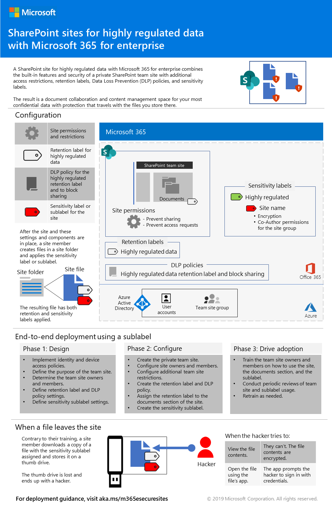
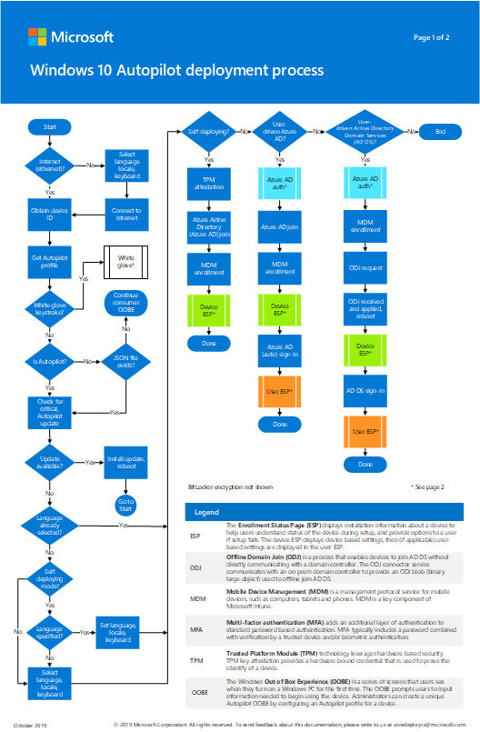
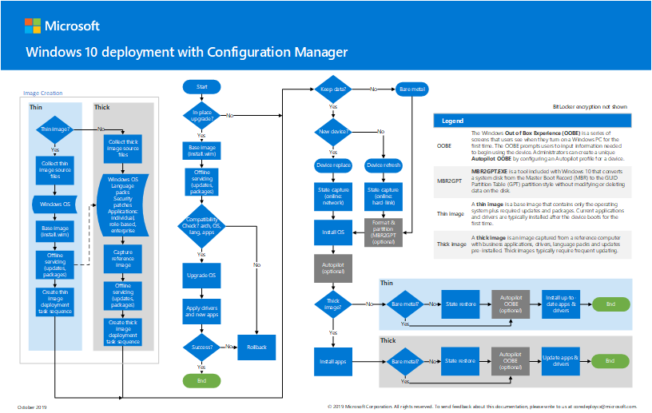
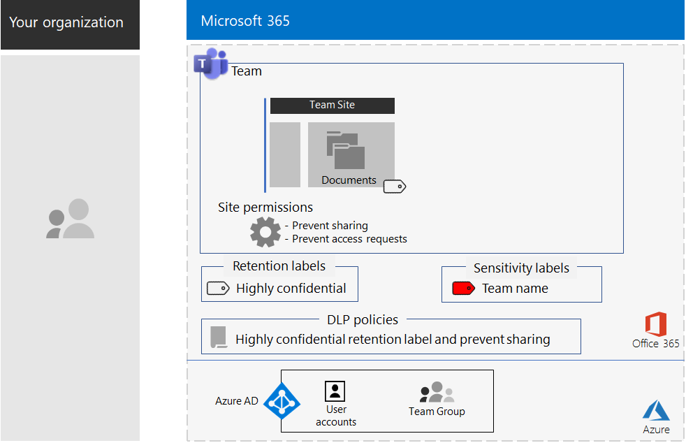
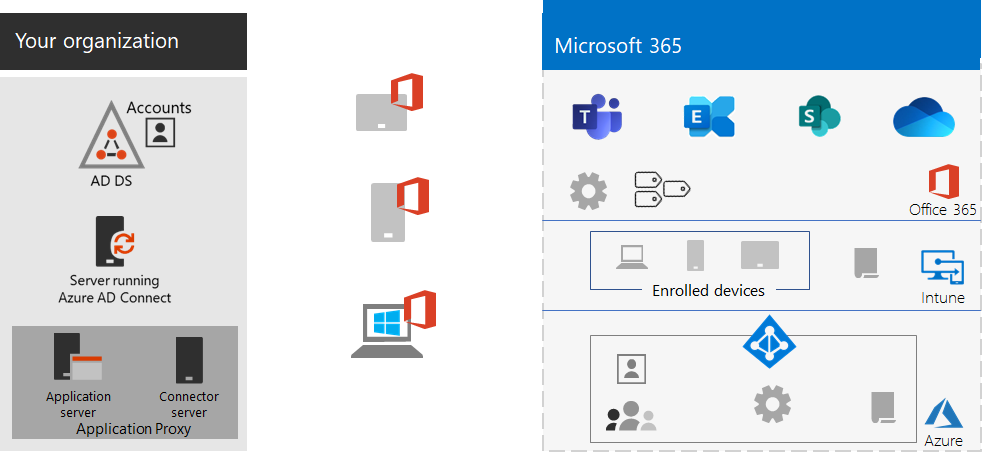
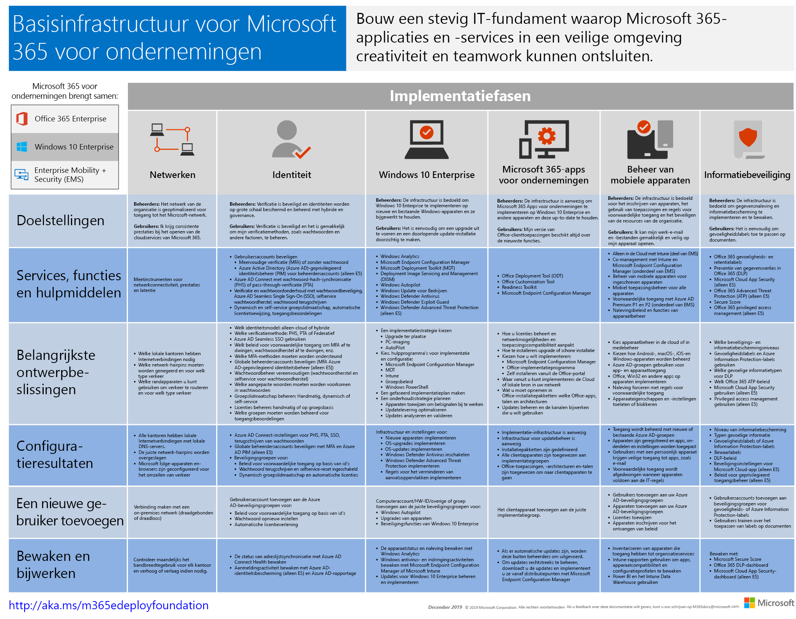

# Wijzigingen aan implementatie-inhoud voor Microsoft 365 voor bedrijven

## December 2019

### Nieuwe inhoud 

- [Test Lab Guide voor Secure Teams voor bestanden](https://docs.microsoft.com/microsoft-365/security/office-365-security/secure-team-for-files-in-a-dev-test-environment)

### Updates en verbeteringen

-  Vernieuwing van de set [Test Lab Guides](m365-enterprise-test-lab-guides.md) 

## November 2019

### Nieuwe inhoud 

- [Migreren van Microsoft 365 Business naar Microsoft 365 E3](https://docs.microsoft.com/microsoft-365/business/migrate-from-microsoft-365-business-to-microsoft-365-enterprise)

- [Team voor een zeer geheim project van Contoso Corporation](contoso-team-for-top-secret-project.md)

  

## Oktober 2019

### Nieuwe inhoud 

- [Teams voor poster voor sterk gereglementeerde gegevens](secure-teams-highly-regulated-data-scenario.md#poster)

  

  U kunt deze poster ook downloaden in [PDF-](https://github.com/MicrosoftDocs/microsoft-365-docs/raw/public/microsoft-365/media/secure-teams-highly-regulated-data-scenario/TeamsHighlyRegulatedData.pdf) of [PowerPoint-](https://github.com/MicrosoftDocs/microsoft-365-docs/raw/public/microsoft-365/media/secure-teams-highly-regulated-data-scenario/Teams-Highly-Regulated-Data-Poster.pptx) indeling en deze afdrukken op papier met een formaat Letter, Legal of Tabloid (27,9 x 43,2 cm).

- [SharePoint-sites voor poster voor sterk gereglementeerde gegevens](teams-sharepoint-online-sites-highly-regulated-data.md#poster)

  

  U kunt deze poster ook downloaden in [PDF-](https://github.com/MicrosoftDocs/microsoft-365-docs/raw/public/microsoft-365/media/teams-sharepoint-online-sites-highly-regulated-data/SharePointSitesHighlyRegulatedData.pdf) of [PowerPoint-](https://github.com/MicrosoftDocs/microsoft-365-docs/raw/public/microsoft-365/media/teams-sharepoint-online-sites-highly-regulated-data/SharePoint-Sites-Highly-Regulated-Data.pptx) indeling en deze afdrukken op papier met een formaat Letter, Legal of Tabloid (27,9 x 43,2 cm).

- [De poster Windows 10 met AutoPilot implementeren](windows10-deploy-autopilot.md) 

  

  U kunt deze poster ook downloaden in [PDF-](https://github.com/MicrosoftDocs/windows-itpro-docs/raw/public/windows/deployment/media/Windows10AutopilotFlowchart.pdf) of [Visio](https://github.com/MicrosoftDocs/windows-itpro-docs/raw/public/windows/deployment/media/Windows10Autopilotflowchart.vsdx)-indeling.

- [De poster Windows 10-implementatie met Configuration Manager](windows10-deploy-inplaceupgrade.md)

  

  U kunt deze poster ook downloaden in [PDF-](https://github.com/MicrosoftDocs/windows-itpro-docs/raw/public/windows/deployment/media/Windows10DeploymentConfigManager.pdf) of [Visio](https://github.com/MicrosoftDocs/windows-itpro-docs/raw/public/windows/deployment/media/Windows10DeploymentConfigManager.vsdx)-indeling.

- [Teams voor scenario met sterk gereglementeerde gegevens](secure-teams-highly-regulated-data-scenario.md)

  

  Aankondigingen: [Microsoft 365 Technical Community-blog](https://techcommunity.microsoft.com/t5/Microsoft-365-Blog/Protect-your-highly-regulated-files-in-Teams-with-Microsoft-365/ba-p/962985)  |  [LinkedIn](https://www.linkedin.com/pulse/how-can-i-lock-down-team-sensitive-top-secret-joe-davies/?published=t)

- [Poster Externe werknemers mogelijkheden bieden](empower-people-to-work-remotely.md#poster)

   

  U kunt deze poster ook downloaden in [PDF-](https://github.com/MicrosoftDocs/microsoft-365-docs/raw/public/microsoft-365/media/empower-people-to-work-remotely/empower-remote-workers-scenario.pdf) of [PowerPoint-](https://github.com/MicrosoftDocs/microsoft-365-docs/raw/public/microsoft-365/media/empower-people-to-work-remotely/Empower-Remote-Workers-Poster.pptx) indeling en deze afdrukken op papier met een formaat Letter, Legal of Tabloid (27,9 x 43,2 cm).

### Updates en verbeteringen

- Vernieuwing van [Fase 4: Office 365 ProPlus](office365proplus-infrastructure.md)
- Vernieuwing van de [Contoso-casestudy](contoso-case-study.md)
- Vernieuwing van de [Microsoft Teams-](teams-workload.md), [Exchange Online-](exchangeonline-workload.md) en [SharePoint Online-](sharepoint-online-onedrive-workload.md)workloads
- Vernieuwing van het [scenario SharePoint-sites voor sterk gereglementeerde gegevens](teams-sharepoint-online-sites-highly-regulated-data.md)
 
  

- [Poster Microsoft 365 voor bedrijven](microsoft-365-overview.md#get-the-big-picture) voor nieuwe scenario's 

  

## September 2019

### Nieuwe inhoud 

- [Scenario Externe werknemers](empower-people-to-work-remotely.md)

   
 
  Aankondigingen: [Microsoft 365 Technical Community-blog](https://techcommunity.microsoft.com/t5/Microsoft-365-Blog/Empower-your-remote-workers-with-Microsoft-365-Enterprise/ba-p/935196#M236)  |  [LinkedIn](https://www.linkedin.com/pulse/how-do-i-configure-microsoft-365-enterprise-empower-my-joe-davies/)

- [Stap voor het versleutelen van e-mail](infoprotect-email-encryption.md) voor [Fase 6: Gegevensbeveiliging](infoprotect-infrastructure.md)

### Updates en verbeteringen

- Reorganisatie en vernieuwing van [Fase 2: Identiteit](identity-infrastructure.md)
- Vernieuwing van [Fase 1: Netwerk](networking-infrastructure.md) en [Fase 6: Gegevensbeveiliging](infoprotect-infrastructure.md)

## Augustus 2019

### Nieuwe inhoud 

- [Poster Uw organisatie overbrengen naar Microsoft 365 voor bedrijven](migration-microsoft-365-enterprise-workload.md#transition-your-entire-organization)

   
 
- [Poster Identiteitsinfrastructuur voor Microsoft 365 voor bedrijven](identity-infrastructure.md)

  

  Aankondigingen: [Microsoft 365 Technical Community-blog](https://techcommunity.microsoft.com/t5/Microsoft-365-Blog/Get-the-new-Identity-infrastructure-for-Microsoft-365-Enterprise/ba-p/874941)  |  [LinkedIn](https://www.linkedin.com/pulse/how-can-i-quickly-ramp-up-key-concepts-features-identity-joe-davies/?published=t)

- [Poster Eindgebruikersondersteuning van Windows 7 en Office 10](migration-microsoft-365-enterprise-workload.md#summary-of-options-for-office-2010-clients-and-servers-and-windows-7)
  
  

  Aankondigingen: [Microsoft 365 Technical Community-blog](https://techcommunity.microsoft.com/t5/Microsoft-365-Blog/Move-from-Office-2010-clients-and-servers-and-Windows-7-to/ba-p/846994)  |  [LinkedIn](https://www.linkedin.com/pulse/how-can-microsoft-365-enterprise-help-me-end-support-products-davies/)

### Updates en verbeteringen

- [Poster Microsoft 365 voor bedrijven](microsoft-365-overview.md#get-the-big-picture) voor nieuwe productiviteitsscenario's

   

## Juli 2019

### Nieuwe inhoud

- Excel-werkmap voor [het artikel Microsoft 365 voor bedrijven voor andere organisaties dan bedrijven](deploy-foundation-infrastructure-non-enterprises.md#onboarding)

## Mei 2019

### Nieuwe inhoud

- [De poster Foundation-infrastructuur](deploy-foundation-infrastructure.md#at-a-glance)

  

  Aankondigingen: [LinkedIn](https://www.linkedin.com/pulse/how-can-i-get-big-picture-microsoft-365-enterprise-joe-davies/)

 
- [Artikel Microsoft 365 voor bedrijven voor andere organisaties dan bedrijven](deploy-foundation-infrastructure-non-enterprises.md)

  

  Aankondigingen: [Microsoft 365 Technical Community-blog](https://techcommunity.microsoft.com/t5/Microsoft-365-Blog/Deploy-Microsoft-365-Enterprise-infrastructure-even-if-you-re/ba-p/900012)  |  [LinkedIn](https://www.linkedin.com/pulse/how-do-i-deploy-microsoft-365-enterprise-without-joe-davies/)

## April 2019

### Nieuwe inhoud 

- [Identiteit en apparaattoegang](identity-device-access-m365-test-environment.md): vereiste Test Lab Guides
- [Windows Information Protection](infoprotect-deploy-windows-information-protection.md)- en [Office 365 Data Loss Prevention](infoprotect-data-loss-prevention.md)-stappen voor [Fase 6: Gegevensbeveiliging](infoprotect-infrastructure.md)

## Zie ook

[Implementatiehandleiding](deploy-microsoft-365-enterprise.md)
