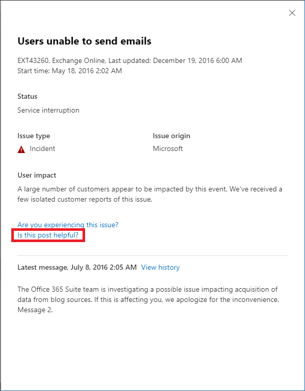

# Exchange Online-bewaking voor Microsoft 365Exchange Online monitoring for Microsoft 365

Je kunt Exchange Online-bewaking in het Microsoft 365-beheercentrum gebruiken het controleren van de status van de Exchange Online-service voor het Microsoft 365-abonnement van je organisatie.You can use Exchange Online monitoring in the Microsoft 365 admin center to monitor the health of the Exchange service for your organization’s Microsoft 365 subscription. Exchange Online-bewaking biedt informatie over incidenten en adviezen die worden verzameld in deze categorieën:Exchange Online monitoring provides you with information about incidents and advisories that are collected in these categories:

- **Infrastructuur**: Probleem wordt gedetecteerd in de Microsoft 365-infrastructuur die Microsoft bezit voor regelmatige updates en het probleem op te lossen.**Infrastructure**: Issue is detected in the Microsoft 365 infrastructure that Microsoft owns for providing regular updates and resolving the issue. Gebruikers kunnen bijvoorbeeld geen toegang tot Exchange Online krijgen vanwege problemen met Exchange of andere Microsoft 365-cloudinfrastructuur.For example, users cannot access Exchange Online because of issues with Exchange or other Microsoft 365 cloud infrastructure.
- **Infrastructuur van derden**: Probleem wordt gedetecteerd in infrastructuur van derden waarvan uw organisatie afhankelijk is en vereist actie van uw organisatie voor een oplossing.**Third-party infrastructure**: Issue is detected in third-party infrastructure on which your organization has taken a dependency and requires action from your organization for resolution. Gebruikersverificatietransacties worden bijvoorbeeld beperkt door een externe beveiligingstokenservice (STS)-provider die voorkomt dat gebruikers verbinding maken met Exchange Online.For example, user authentication transactions are getting throttled by a third-party security token service (STS) provider that prevents users from connecting to Exchange Online.
- **Infrastructuur van klant**: Probleem wordt gedetecteerd in je organisatie-infrastructuur en vereist actie van je organisatie voor een oplossing.**Customer infrastructure**: Issue is detected in your organization's infrastructure and requires action from your organization for resolution. Gebruikers kunnen bijvoorbeeld geen toegang tot Exchange Online krijgen omdat ze geen verificatietoken kunnen verkrijgen van de STS-provider die door je organisatie wordt gehost, vanwege een verlopen certificaat.For example, users cannot access Exchange Online because they are unable to obtain an authentication token from STS provider hosted by your organization because of an expired certificate.

Hier volgt een voorbeeld van de pagina **Servicestatus** in het Microsoft 365-beheercentrum, beschikbaar via **Status > Servicestatus**.Here is an example of the **Service health** page in the Microsoft 365 admin center, available from **Health > Service health**.

De waarde van de kolom **Status** geeft aan of de service in orde is of adviezen of incidenten heeft op basis van de cloudservices die Microsoft onderhoudt.The value of the **Status** column indicates whether the service is healthy or has advisories or incidents based on the cloud services that Microsoft maintains. 

De waarde van de kolom **Problemen van uw organisatie en derden** geeft aan dat de infrastructuur van uw organisatie of de software van derden de servicestatuservaring van uw gebruikers met Exchange Online beïnvloedt.The value of the **Your org and 3rd party issues** column indicates that your organization's infrastructure or third-party software affects your users service health experience with Exchange Online. Adviezen of incidenten vereisten *uw* acties om te worden opgelost.Advisories or incidents require *your* actions to resolve.

Hier volgt een voorbeeld van de **Exchange Online**-bewakingspagina in het Microsoft 365-beheercentrum, beschikbaar via **Status > Servicestatus > Exchange Online**.Here is an example of the **Exchange Online** monitoring page in the Microsoft 365 admin center, available from **Health > Service health > Exchange Online**.

Met de **Exchange Online**-bewakingspagina kan je zien of de Exchange-service in orde is en of er gerelateerde incidenten of adviezen zijn.With the **Exchange Online** monitoring page, you can see whether the Exchange Online service is healthy or not and whether there are any associated incidents or advisories. Met Exchange Online-bewaking kan je de servicestatus voor specifieke e-mailscenario's bekijken en signalen in bijna realtime bekijken zodat je de impact per scenario kan bepalen.With Exchange Online monitoring, you can look at the service health for specific email scenarios and view near real-time signals to determine the impact by scenario. 

## VereistenRequirements

Deze preview is ingeschakeld voor klanten die aan deze vereisten voldoen:This preview is enabled for customers who meet these requirements: 

- De organisatie heeft een licentie nodig voor ten minste 5000 stuks van een van de volgende producten of een combinatie ervan: Office 365 E3, Microsoft 365 E3, Office 365 E5, Microsoft 365 E5.Your organization needs to have a license count of at least 5,000, from one or a combination of these products: Office 365 E3, Microsoft 365 E3, Office 365 E5, Microsoft 365 E5. 

  Uw organisatie heeft bijvoorbeeld 3000 Office 365 E3-licenties en 2500 Microsoft 365 E5-licenties, op een totaal van 5500 licenties van in aanmerking komende producten.For example, your organization can have 3,000 Office 365 E3 licenses and 2,500 Microsoft 365 E5, for a total of 5,500 licenses from the qualifying products.

- Je organisatie heeft ten minste 50 maandelijks actieve Exchange Online-gebruikers nodig.Your organization needs to have at least 50 monthly active Exchange Online users.

Met Exchange-bewaking kan je de status voor de volgende e-mailclients bekijken op basis van de leesactiviteit voor e-mail:With Exchange Online monitoring you can view the health for the following email clients based on email read activity:

- Outlook BureaubladOutlook Desktop
- Webversie van OutlookOutlook on the Web
- Systeemeigen e-mailclients van iOS en AndroidNative mail clients of iOS and Android 
- Mobiele Outlook-app in iOS en AndroidOutlook Mobile app in iOS and Android 
- Outlook Mac-clientOutlook Mac client

Voor deze clients kunt u het aantal actieve gebruikers in de afgelopen 30 minuten zien op basis van gebruikers die een e-mail lezen, evenals het aantal incidenten en adviezen in het dashboard.For these clients, you can see the number of active users in the last 30 minutes based on users reading an email, along with number of incidents and advisories in the dashboard. Deze gegevens worden vergeleken met hetzelfde interval van de vorige week om te zien of er een probleem is.This data is compared to the same interval for the previous week to see if there’s an issue. 

>[!Note]
> Het aantal actieve gebruikers wordt gemeten voor één activiteit, bijvoorbeeld een gebruiker leest een e-mail.Active user count is measured by a single activity, for example, when a user reads an email. Het geldt alleen voor de afgelopen 30 minuten van activiteit.It only accounts for the last 30 minutes of activity.
>

Je kunt de Exchange Online-status ook bewaken voor de volgende scenario's:You can also monitor Exchange Online health for the following scenarios:

- **E-mailstroom**: Het aantal berichten dat zonder vertraging in een postvak is bezorgd nadat het bericht het Microsoft 365-netwerk heeft bereikt.**Mail flow**: The number of messages successfully delivered to a mailbox without any delay after the message reached the Microsoft 365 network. 
- **Basisverificatie en Moderne verificatie**: Het aantal gebruikers dat is gevalideerd in de Exchange Online-service.**Basic Authentication and Modern Authentication**: The number of users successfully validated in the Exchange Online service.

Voor al deze scenario's zijn de belangrijkste getallen voor de afgelopen 30 minuten in het hoofddashboard.For all these scenarios, the key numbers are for the last 30 minutes in the main dashboard. Gedetailleerde weergaven voor elk van deze scenario's tonen de trend in bijna realtime voor zeven dagen met aggregatie van 30 minuten vergeleken met de vorige week.Detailed views for each of these scenarios shows the near real-time trend for seven days with the 30-minute aggregate compared with the previous week. 

## Geef ons feedbackSend us feedback

U kunt op twee manieren feedback geven:There are two ways you can provide feedback:

- Gebruik de optie **Feedback geven** die beschikbaar is op elke pagina van het Microsoft 365-beheercentrum.Use the **Give feedback** option available on every page of the Microsoft 365 admin center.
- Verzend feedback met behulp van de koppeling **Is deze post nuttig?** voor een specifiek incident of advies.Submit feedback using the **Is this post helpful?** link for a specific incident or advisory.

## Veelgestelde vragenFrequently asked questions

#### 1. Waarom zie ik 'Exchange Online-bewaking' niet onder Status in het Microsoft 365-beheercentrum?1. Why don’t I see “Exchange Online monitoring” under Health in the Microsoft 365 admin center? 

Controleer eerst of je het nieuwe beheercentrum hebt ingeschakeld op de **Startpagina** van het Microsoft 365-beheercentrum.First, make sure you’ve enabled the new admin center on the **Home** page of the Microsoft 365 admin center. 

Controleer vervolgens of je aan beide van de volgende vereisten voldoet:Then make sure you meet both of the following requirements: 

- De organisatie heeft een licentie nodig voor ten minste 5000 stuks van een van de volgende producten of een combinatie ervan: Office 365 E3, Microsoft 365 E3, Office 365 E5, Microsoft 365 E5.Your organization needs to have a license count of at least 5,000, from one or a combination of these products: Office 365 E3, Microsoft 365 E3, Office 365 E5, Microsoft 365 E5. 
- Uw organisatie heeft ten minste vijftig maandelijks actieve Exchange Online-gebruikers nodig.Your organization needs to have at least 50 monthly active Exchange Online users.

Als het aantal licenties voor uw organisatie minder dan 5000 gebruikers telt en het aantal maandelijks actieve gebruikers minder dan 50 gebruikers telt, wordt Exchange Online-bewaking pas ingeschakeld zodra aan deze vereisten wordt voldaan.If the license count for your organization goes below 5,000 users and the monthly active users goes below 50 users, Exchange Online monitoring won’t be enabled until these requirements are met.

#### 2. Het aantal actieve gebruikers in het dashboard voor elke client lijkt laag te zijn.2. The active user count in the dashboard for each client appears to be low. We hebben veel actieve licenties aan gebruikers toegewezen.We have a lot of active licenses assigned to users. Wat betekent dit?What does this mean? 

Het aantal actieve gebruikers dat in de bewaking wordt weergegeven is gebaseerd op een periode van 30 minuten waarin gebruikers de activiteit hebben uitgevoerd die in de functie is uitgelicht.The active user count shown in monitoring is based on a 30-minute window where users have performed the activity called out in the feature. Dit mag niet worden verward met het gebruiksaantal.This shouldn’t be confused with usage numbers. Bekijk het gebruiksaantal door activiteitsrapporten te gebruiken in het Microsoft 365-beheercentrum (**Rapporten > Gebruik**).To view usage numbers, use activity reports in the Microsoft 365 admin center (**Reports > Usage**).

#### 3. Zullen er andere bewakingsscenario's zijn voor andere services zoals Teams en SharePoint?3. Will there be other monitoring scenarios for other services such as Teams and SharePoint? 

Microsoft heeft deze ervaring rechtstreeks geïntegreerd in het dashboard Servicestatus in het Microsoft 365-beheercentrum.Microsoft is integrating this experience directly inside the Service Health dashboard in the Microsoft 365 admin center. Dit zal Microsoft mogelijkheden geven voor het uitbreiden van bewakingsscenario's naar andere services. Dit zal worden aangekondigd wanneer er nieuws over is.This will provide opportunities for Microsoft to extend monitoring scenarios for other services, which will be announced when there is news to share. 

#### 4. Wat is het plan voor algemene beschikbaarheid van deze ervaring?4. What is the plan for general availability of this experience? 

Microsoft heeft Exchange Online-bewaking rechtstreeks geïntegreerd in het dashboard **Servicestatus** in het Microsoft 365-beheercentrum.Microsoft has integrated Exchange Online monitoring directly on the **Service Health** dashboard in the Microsoft 365 admin center. 

Met deze nieuwe geïntegreerde ervaring is Microsoft van plan om uw feedback te verzamelen en vervolgens ons plan voor algemene beschikbaarheid te definiëren.With this new integrated experience, Microsoft's plan is to collect your feedback and then define our plan for general availability.

#### 5. Is dit een gratis (inbegrepen) of betaalde (extra) functie?5. Is this a free (included) or paid (extra) feature? 

Deze functie is in openbare preview en alleen beschikbaar voor klanten die voldoen aan de vereisten in vraag 1.This feature is in Public preview and only available for customers that meet the requirements in question 1.

<!--
>[!Note]
>INTERNAL: That decision is pending
>
--> 

#### 6. Hoe kan ik feedback geven?6. How do I provide feedback? 

Voor algemene feedback gebruik je het pictogram **Feedback geven** in de rechterbenedenhoek van de **Exchange Online**-bewakingspagina.For general feedback, use the **Give feedback** icon on the bottom-right corner of the **Exchange Online** monitoring page. 

Voor feedback over incidenten of adviezen gebruik je de koppeling **Is deze post nuttig?**.For feedback on incidents or advisories, use the **Is this post helpful?** link.

#### 7. Waar zijn de gegevens voor de scenario‘s die activiteitentrends weergeven geïnstrumenteerd?7. Where is the data instrumented for the scenarios that show activity trends?

De gegevens worden in de Exchange Online-service ondergebracht. Als er een fout optreedt voordat de aanvraag Exchange Online bereikt of als er een fout in Exchange Online optreedt, krijgt u een daling van de activiteit te zien.The data is instrumented in the Exchange Online service. If there is a failure that happens before the request reaches Exchange Online or there is a failure in Exchange Online, you will see a drop in the activity signal.
