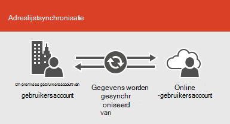

# Microsoft 365-integratie met on-premises omgevingen

*Dit artikel is van toepassing op Microsoft 365 Enterprise en Office 365 Enterprise.*

U kunt Microsoft 365 integreren met uw bestaande adreslijstservices en met een lokale installatie van Exchange Server, Skype voor bedrijven server 2015 of SharePoint Server.
  
 - Als u integratie met adreslijstservices, kunt u gebruikersaccounts synchroniseren en beheren voor beide omgevingen. U kunt ook hash-synchronisatie voor wachtwoord of eenmalige aanmelding (SSO) toevoegen, zodat gebruikers zich kunnen aanmelden bij beide omgevingen met hun on-premises referenties.
 - Als u integratie met lokale server producten uitvoert, maakt u een hybride omgeving. Een hybride omgeving kan u helpen bij het migreren van gebruikers of gegevens naar Microsoft 365, of u kunt in de Cloud bepaalde gebruikers of bepaalde informatie on-premises blijven hebben. Zie voor meer informatie over hybride omgevingen [hybride Cloud Overview](https://docs.microsoft.com/Office365/Enterprise/hybrid-cloud-overview).

U kunt ook de Azure Active Directory (Azure AD) adviseurs gebruiken voor aangepaste instel richtlijnen (u moet zijn aangemeld bij Microsoft 365):

- [Gebruikers synchroniseren vanuit de adreslijst van uw organisatie](https://aka.ms/aadconnectpwsync)
- [AD FS-implementatie adviseur](https://aka.ms/adfsguidance)
- [Installatiehandleiding voor Azure AD](https://aka.ms/aadpguidance)
   
## Voordat u begint

Voordat u Microsoft 365 en een lokale omgeving integreert, moet u ook een [netwerk planning en prestaties afstemmen](network-planning-and-performance.md). U kunt ook inzicht krijgen in de beschikbare [identiteits modellen](about-microsoft-365-identity.md). 

Zie [waar kunt u Microsoft 365-accounts beheren](manage-microsoft-365-accounts.md) voor een lijst met hulpmiddelen die u kunt gebruiken voor het beheren van gebruikers en accounts van microsoft 365. 
  
## Microsoft 365 integreren met adreslijstservices
Als u bestaande gebruikersaccounts hebt in een on-premises adreslijst, kunt u niet al deze accounts opnieuw maken in Microsoft 365 en risico, waarbij de verschillen of fouten tussen de omgevingen worden geïntroduceerd. Met adreslijstsynchronisatie kunt u de accounts van uw online en on-premises omgevingen spiegelen. Met adreslijstsynchronisatie hoeven gebruikers geen nieuwe informatie voor elke omgeving te onthouden en hoeft u niet twee keer accounts te maken of bij te werken. U moet [uw on-premises adreslijst voorbereiden](prepare-for-directory-synchronization.md) op adreslijstsynchronisatie.
  

  
Als u wilt dat gebruikers zich kunnen aanmelden bij Microsoft 365 met hun on-premises referenties, kunt u ook eenmalige aanmelding configureren. Met eenmalige aanmelding is Microsoft 365 geconfigureerd voor het vertrouwen van de on-premises omgeving voor gebruikersauthenticatie.
  

  
Verschillende technieken voor Gebruikersaccountbeheer maken een afwijkende ervaring voor uw gebruikers, zoals wordt weergegeven in de volgende tabel.
 
### Adreslijstsynchronisatie met of zonder wachtwoord-hash synchronisatie of Pass Through-verificatie

Een gebruiker meldt zich aan bij hun on-premises omgeving met hun gebruikersaccount (DOMEIN\gebruikersnaam). Wanneer ze naar Microsoft 365 gaan, moeten ze zich opnieuw aanmelden met hun werk-of schoolaccount (user@domain.com). De gebruikersnaam is hetzelfde in beide omgevingen. Wanneer u een hash-synchronisatie via een wachtwoord toevoegt of een Pass-Through-verificatie toevoegt, heeft de gebruiker hetzelfde wachtwoord voor beide omgevingen, maar deze referenties moeten opnieuw worden opgegeven bij het aanmelden bij Microsoft 365. Adreslijstsynchronisatie met wachtwoord hash is het meestgebruikte scenario voor Directory synchronisatie.

Als u adreslijstsynchronisatie wilt instellen, maakt u gebruik van Azure Active Directory Connect. Zie [adreslijstsynchronisatie instellen voor Microsoft 365](set-up-directory-synchronization.md)en [Azure AD Connect met expres instellingen](https://go.microsoft.com/fwlink/p/?LinkId=698537)voor instructies.

Meer informatie over het [voorbereiden van adreslijstsynchronisatie met Microsoft 365](prepare-for-directory-synchronization.md) en [het integreren van uw on-premises identificaties met Azure Active Directory](https://go.microsoft.com/fwlink/?LinkId=518101).

### Adreslijstsynchronisatie met SSO

Een gebruiker meldt zich aan bij hun on-premises omgeving met hun gebruikersaccount. Wanneer de persoon naar Microsoft 365 gaat, meldt u zich automatisch aan of worden ze aangemeld met de referenties die ze voor hun on-premises omgeving gebruiken.

Voor het instellen van eenmalige aanmelding gebruikt u ook Azure AD Connect. Voor instructies raadpleegt u [aangepaste installatie van Azure AD Connect](https://go.microsoft.com/fwlink/p/?LinkID=698430).

Meer informatie over [eenmalige aanmelding bij toepassingen in azure Active Directory](https://go.microsoft.com/fwlink/p/?LinkId=698604).

## Azure AD Connect

Azure AD Connect vervangt oudere versies van hulpmiddelen voor identiteits integratie, zoals DirSync en Azure AD-synchronisatie. Zie [Wat is hybride identiteit met Azure Active Directory?](https://go.microsoft.com/fwlink/p/?LinkId=527969)voor meer informatie. Als u wilt bijwerken van Azure Active Directory-synchronisatie met Azure AD Connect, raadpleegt u [de upgrade-instructies](https://go.microsoft.com/fwlink/p/?LinkId=733240). 

Zie ook [Microsoft 365 Directory-synchronisatie implementeren in Microsoft Azure](https://go.microsoft.com/fwlink/?LinkId=517887).

## Zie ook

[Overzicht van Microsoft 365 Enterprise](microsoft-365-overview.md)
