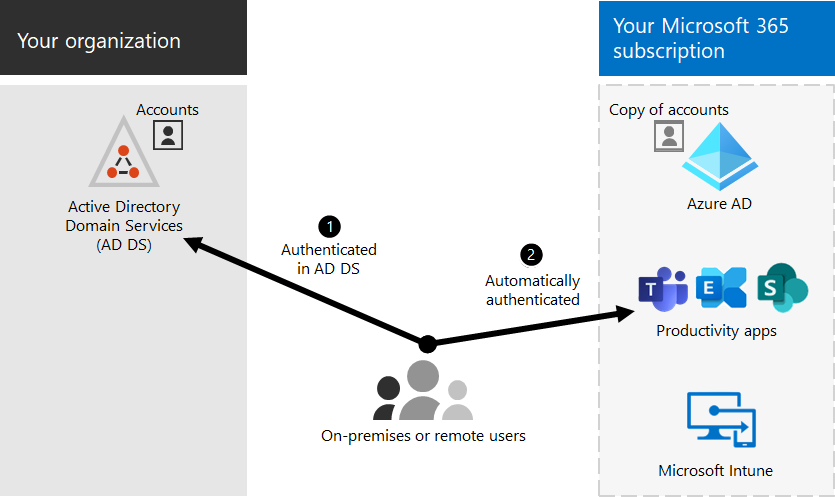

# Microsoft 365 integratie met on-premises omgevingen

*Dit artikel is van toepassing op Microsoft 365 Enterprise en Office 365 Enterprise.*

U kunt Microsoft 365 integreren met uw bestaande on-premises Active Directory Domain Services (AD DS) en met on-premises installaties van Exchange Server, Skype voor Bedrijven Server 2015 of SharePoint Server.
  
 - Wanneer u AD DS integreert, kunt u gebruikersaccounts voor beide omgevingen synchroniseren en beheren. U kunt ook wachtwoordhashsynchronisatie (PHS) of eenmalige aanmelding (SSO) toevoegen, zodat gebruikers zich kunnen aanmelden bij beide omgevingen met hun on-premises referenties.
 - Wanneer u integreert met on-premises serverproducten, maakt u een hybride omgeving. Een hybride omgeving kan u helpen wanneer u gebruikers of informatie migreert naar Microsoft 365, of u kunt bepaalde gebruikers of bepaalde informatie on-premises en sommige informatie in de cloud blijven gebruiken. Zie hybride cloud voor meer informatie over [hybride omgevingen.](../solutions/cloud-architecture-models.md#hybrid)

U kunt ook de adviseurs Azure Active Directory (Azure AD) gebruiken voor aangepaste installatie-richtlijnen in het Microsoft 365-beheercentrum (u moet zijn aangemeld bij Microsoft 365):

- [Installatiehandleiding voor Azure AD](https://aka.ms/aadpguidance)
- [Gebruikers synchroniseren vanuit de adreslijst van uw organisatie](https://aka.ms/aadconnectpwsync)
- [Ad FS-implementatieadviseur (Active Directory Federation Services)](https://aka.ms/adfsguidance)
   
## Voordat u begint

Voordat u een Microsoft 365 en een on-premises omgeving integreert, moet u ook netwerkplanning en [prestatieafstemming doen.](network-planning-and-performance.md) U wilt ook de beschikbare [identiteitsmodellen begrijpen.](about-microsoft-365-identity.md) 

Zie [Beheer Microsoft 365 accounts voor](manage-microsoft-365-accounts.md) een lijst met hulpprogramma's die u kunt gebruiken om uw gebruikersaccounts Microsoft 365 beheren. 
  
## Integratie Microsoft 365 met AD DS

Als u bestaande gebruikersaccounts hebt in AD DS, wilt u niet al deze accounts opnieuw maken in Microsoft 365 en kunt u verschillen of fouten tussen de omgevingen introduceren. Met adreslijstsynchronisatie kunt u deze accounts spiegelen tussen uw on-premises en onlineomgevingen. Met adreslijstsynchronisatie hoeven uw gebruikers geen nieuwe informatie voor elke omgeving te onthouden en hoeft u geen accounts tweemaal te maken of bij te werken. U moet uw [on-premises adreslijst voorbereiden](prepare-for-directory-synchronization.md) op adreslijstsynchronisatie.
  

  
Als u wilt dat gebruikers zich kunnen aanmelden bij Microsoft 365 on-premises referenties, kunt u ook eenmalige aanmelding configureren. Met SSO is Microsoft 365 geconfigureerd om de on-premises omgeving voor gebruikersverificatie te vertrouwen.
  

### Adreslijstsynchronisatie met of zonder wachtwoordhashsynchronisatie of pass-throughverificatie (PTA)

Een gebruiker meldt zich aan bij de on-premises omgeving met zijn of haar gebruikersaccount (domein\gebruikersnaam). Wanneer ze naar Microsoft 365 gaan, moeten ze zich opnieuw aanmelden met hun werk- of schoolaccount (user@domain.com). De gebruikersnaam is in beide omgevingen hetzelfde. Wanneer u PHS of PTA toevoegt, heeft de gebruiker hetzelfde wachtwoord voor beide omgevingen, maar moet deze referenties opnieuw opgeven wanneer ze zich aanmelden bij Microsoft 365. Adreslijstsynchronisatie met PHS is de meestgebruikte adreslijstsynchronisatie.

Als u adreslijstsynchronisatie wilt instellen, gebruikt u Azure AD-Verbinding maken. Zie Adreslijstsynchronisatie instellen voor Microsoft 365 en [Azure AD-Verbinding maken met express-instellingen voor instructies.](/azure/active-directory/hybrid/how-to-connect-install-express) 

Meer informatie over [het voorbereiden van adreslijstsynchronisatie om Microsoft 365.](prepare-for-directory-synchronization.md)

### Adreslijstsynchronisatie met SSO

Een gebruiker meldt zich aan bij zijn of haar on-premises omgeving met zijn of haar gebruikersaccount. Wanneer ze naar Microsoft 365, worden ze automatisch aangemeld of melden ze zich aan met dezelfde referenties die ze gebruiken voor hun on-premises omgeving (domein\gebruikersnaam).

Als u SSO wilt instellen, gebruikt u ook Azure AD-Verbinding maken. Zie Aangepaste installatie [van Azure AD-Verbinding maken.](/azure/active-directory/hybrid/how-to-connect-install-custom)

Zie een enkele aanmelding voor [meer informatie.](/azure/active-directory/manage-apps/what-is-single-sign-on)

## Azure AD Verbinding maken

Azure AD Verbinding maken vervangt oudere versies van hulpprogramma's voor identiteitsintegratie, zoals DirSync en Azure AD Sync. Als u wilt bijwerken van Azure Active Directory Synchroniseren met Azure AD-Verbinding maken, bekijkt u [de upgrade-instructies.](/azure/active-directory/hybrid/how-to-dirsync-upgrade-get-started) 

## Zie ook

[Microsoft 365 Enterprise overzicht](microsoft-365-overview.md)