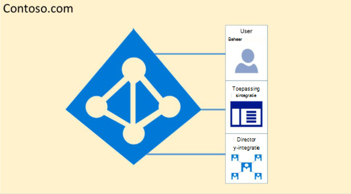
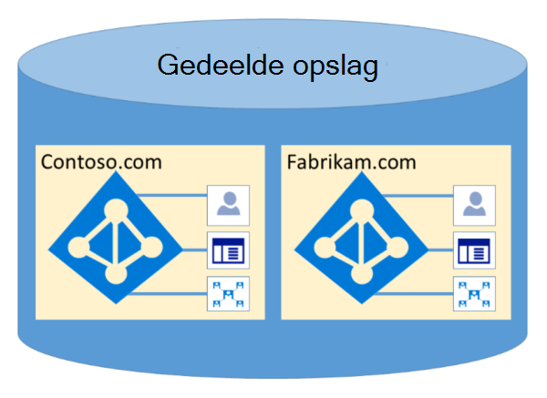

# Microsoft 365 Isolatie en Toegangsbeheer in Azure Active DirectoryMicrosoft 365 Isolation and Access Control in Azure Active Directory

Azure Active Directory (Azure AD) is ontworpen om meerdere tenants op een zeer veilige manier te hosten via logische gegevensisolatie.Azure Active Directory (Azure AD) was designed to host multiple tenants in a highly secure way through logical data isolation. Toegang tot Azure AD wordt afgesloten door een autorisatielaag.Access to Azure AD is gated by an authorization layer. Azure AD isoleert klanten die tenantcontainers gebruiken als beveiligingsgrenzen om de inhoud van een klant te beschermen, zodat de inhoud niet kan worden toegankelijk of gecompromitteerd door co-tenants.Azure AD isolates customers using tenant containers as security boundaries to safeguard a customer's content so that the content cannot be accessed or compromised by co-tenants. Drie controles worden uitgevoerd door de autorisatielaag van Azure AD:Three checks are performed by Azure AD's authorization layer:

- Is de principal ingeschakeld voor toegang tot Azure AD-tenant?Is the principal enabled for access to Azure AD tenant?
- Is de principal ingeschakeld voor toegang tot gegevens in deze tenant?Is the principal enabled for access to data in this tenant?
- Is de rol van de principal in deze tenant geautoriseerd voor het type gegevenstoegang dat wordt aangevraagd?Is the principal's role in this tenant authorized for the type of data access requested?

Geen enkele toepassing, gebruiker, server of service heeft toegang tot Azure AD zonder de juiste verificatie en token of certificaat.No application, user, server, or service can access Azure AD without the proper authentication and token or certificate. Aanvragen worden geweigerd als ze niet vergezeld gaan van de juiste referenties.Requests are rejected if they are not accompanied by proper credentials.

In azure AD wordt elke tenant in een eigen beveiligde container host, met beleidsregels en machtigingen voor en binnen de container die alleen eigendom is van en wordt beheerd door de tenant.Effectively, Azure AD hosts each tenant in its own protected container, with policies and permissions to and within the container solely owned and managed by the tenant.
 

Het concept tenantcontainers is diep ingebakken in de adreslijstservice op alle lagen, van portals tot permanente opslag.The concept of tenant containers is deeply ingrained in the directory service at all layers, from portals all the way to persistent storage. Zelfs wanneer meerdere Azure AD-tenantmetagegevens zijn opgeslagen op dezelfde fysieke schijf, is er geen relatie tussen de containers anders dan wat is gedefinieerd door de adreslijstservice, die op zijn beurt wordt gedicteerd door de tenantbeheerder.Even when multiple Azure AD tenant metadata is stored on the same physical disk, there is no relationship between the containers other than what is defined by the directory service, which in turn is dictated by the tenant administrator. Er kunnen geen directe verbindingen met Azure AD-opslag zijn vanuit een aanvraag voor toepassingen of service zonder eerst door de autorisatielaag te gaan.There can be no direct connections to Azure AD storage from any requesting application or service without first going through the authorization layer.

In het onderstaande voorbeeld hebben Contoso en Fabrikam beide afzonderlijke, speciale containers. Hoewel deze containers mogelijk dezelfde onderliggende infrastructuur delen, zoals servers en opslag, blijven ze gescheiden en geïsoleerd van elkaar en worden ze afgesloten door lagen van autorisatie en toegangsbeheer.In the example below, Contoso and Fabrikam both have separate, dedicated containers, and even though those containers may share some of the same underlying infrastructure, such as servers and storage, they remain separate and isolated from each other, and gated by layers of authorization and access control.
 

Bovendien zijn er geen toepassingsonderdelen die kunnen worden uitgevoerd vanuit Azure AD en is het niet mogelijk dat een tenant met geweld de integriteit van een andere tenant schendt, versleutelingssleutels van een andere tenant kan openen of onbewerkte gegevens van de server kan lezen.In addition, there are no application components that can execute from within Azure AD, and it is not possible for one tenant to forcibly breach the integrity of another tenant, access encryption keys of another tenant, or read raw data from the server.

In Azure AD worden standaard alle bewerkingen die zijn uitgegeven door identiteiten in andere tenants, afgekeurd.By default, Azure AD disallows all operations issued by identities in other tenants. Elke tenant is logisch geïsoleerd in Azure AD via toegangsbesturingselementen op basis van claims.Each tenant is logically isolated within Azure AD through claims-based access controls. Lees- en schrijfgegevens van adreslijstgegevens zijn beperkt tot tenantcontainers en worden gegated door een interne abstractielaag en een RBAC-laag (Role-Based Access Control), die samen de tenant afdwingen als beveiligingsgrens.Reads and writes of directory data are scoped to tenant containers, and gated by an internal abstraction layer and a role-based access control (RBAC) layer, which together enforce the tenant as the security boundary. Elke aanvraag voor toegang tot adreslijstgegevens wordt door deze lagen verwerkt en elke toegangsaanvraag in Microsoft 365 wordt volgens de bovenstaande logica gemonitord.Every directory data access request is processed by these layers and every access request in Microsoft 365 is policed by the logic above.

Azure AD heeft Noord-Amerika, de Amerikaanse overheid, de Europese Unie, Duitsland en world wide partitions.Azure AD has North America, U.S. Government, European Union, Germany, and World Wide partitions. Een tenant bestaat in één partitie en partities kunnen meerdere tenants bevatten.A tenant exists in a single partition, and partitions can contain multiple tenants. Partitiegegevens worden verwijderd van gebruikers.Partition information is abstracted away from users. Een bepaalde partitie (inclusief alle tenants daarin) wordt gerepliceerd naar meerdere datacenters.A given partition (including all the tenants within it) is replicated to multiple datacenters. De partitie voor een tenant wordt gekozen op basis van eigenschappen van de tenant (bijvoorbeeld de landcode).The partition for a tenant is chosen based on properties of the tenant (e.g., the country code). Geheimen en andere gevoelige informatie in elke partitie worden versleuteld met een speciale sleutel.Secrets and other sensitive information in each partition is encrypted with a dedicated key. De toetsen worden automatisch gegenereerd wanneer er een nieuwe partitie wordt gemaakt.The keys are generated automatically when a new partition is created.

Azure AD-systeemfunctionaliteiten zijn een uniek exemplaar voor elke gebruikerssessie.Azure AD system functionalities are a unique instance to each user session. Daarnaast gebruikt Azure AD versleutelingstechnologieën om gedeelde systeembronnen op netwerkniveau te isoleren om ongeautoriseerde en onbedoelde overdracht van gegevens te voorkomen.In addition, Azure AD uses encryption technologies to provide isolation of shared system resources at the network level to prevent unauthorized and unintended transfer of information.
