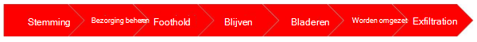

# Tenant grenzen controleren en testenMonitoring and Testing Tenant Boundaries

Microsoft continu wordt gecontroleerd en expliciet getest op zwakke plekken en kwetsbaarheden in Tenant grenzen, waaronder toezicht voor indringers, machtigings pogingen en bronnen Starvation.Microsoft continuously monitors and explicitly tests for weaknesses and vulnerabilities in tenant boundaries, including monitoring for intrusion, permission violation attempts, and resource starvation. We gebruiken ook meerdere interne systemen voor voortdurend monitor voor ongeschikt Resourcegebruik, dat wil zeggen, een ingebouwde beperking.We also use multiple internal systems to continuously monitor for inappropriate resource utilization, which if detected, triggers built-in throttling.

Microsoft 365 heeft interne monitoring systemen die continu controleren op fouten en geautomatiseerde herstel problemen wanneer de fout wordt gedetecteerd.Microsoft 365 has internal monitoring systems that continuously monitor for any failure and drive automated recovery when failure is detected. Microsoft 365-systemen analyseren van afwijkingen in het servicegedrag en initiëren automatisch herstelprocessen die in het systeem zijn ingebouwd.Microsoft 365 systems analyze deviations in service behavior and initiate self-healing processes that are built into the system. In Microsoft 365 wordt ook buiten gebruik gebruikgemaakt van de bewaking van de bewaking vanaf meerdere locaties van vertrouwde services van derden (voor onafhankelijke SLA-verificatie) en onze eigen datacenters voor het verhogen van waarschuwingen.Microsoft 365 also uses outside-in monitoring in which monitoring is performed from multiple locations both from trusted third-party services (for independent SLA verification) and our own datacenters to raise alerts. Voor diagnostische gegevens hebben we uitgebreid logboekregistratie, controle en tracering.For diagnostics, we have extensive logging, auditing, and tracing. Met granulaire tracering en controle kunt u problemen isoleren en de analyse van basis oorzaken versnellen en effectief uitvoeren.Granular tracing and monitoring helps us isolate issues and perform fast and effective root cause analysis.

Hoewel Microsoft 365 geautomatiseerde herstelacties bevat, zijn Microsoft-aanbieders van technici van Microsoft niet altijd beschikbaar om alle beveiligings-en kwaliteits verbeteringen te onderzoeken, en achteraf beoordelingen te ondernemen.While Microsoft 365 has automated recovery actions where possible, Microsoft on-call engineers are available 24x7 to investigate all Severity 1 security escalations, and post-mortem reviews of every service incident contributes to continuous learning and improvement. Dit team omvat ondersteuningstechnici, productontwikkelaars, programma managers, product beheerders en senior leiderschap.This team includes support engineers, product developers, program managers, product managers, and senior leadership. Onze on-call-medewerkers zorgen voor een juiste back-up en kunnen vaak herstelacties automatiseren, zodat u de volgende keer een gebeurtenis kunt herstellen.Our on-call professionals provide timely backup and often can automate recovery actions, so that next time an event occurs, it can be self-healed.

Microsoft voert een uitgebreide bespreking van de nabespreking uit telkens wanneer een Microsoft 365-beveiligingsincident zich voordoet, ongeacht de omvang van de invloed.Microsoft performs a thorough post-incident review each time a Microsoft 365 security incident occurs regardless of the magnitude of impact. Een beoordeling na de bespreking omvat een analyse van wat er is gebeurd, wat we hebben gereageerd en wat we in de toekomst tegen soortgelijke incidenten kunnen voorkomen.A post-incident review consists of an analysis of what happened, how we responded and how we prevent similar incidents in the future. Met het oog op transparantie en verantwoording delen we de bespreking van het post-incident voor alle belangrijke service-incidenten met betrokken klanten.In the interest of transparency and accountability, we share post-incident review for any major service incidents with affected customers. Zie [Office 365 Security Incident Management](https://aka.ms/Office365SIM)voor specifieke informatie.For specific details, see [Office 365 Security Incident Management](https://aka.ms/Office365SIM).

## De methodologie van de overtreding aannemenAssume Breach Methodology

Op basis van gedetailleerde analyses van beveiligings trends is Microsoft in Microsoft geïnvesteerd en markeert u de noodzaak van extra investeringen voor heractieve beveiligings processen en technologieën die aandacht vestigen op de detectie en respons van de opkomende bedreigingen, en niet alleen voor het voorkomen van deze bedreigingen.Based on detailed analysis of security trends, Microsoft advocates and highlights the need for additional investments in reactive security processes and technologies that focus on detection and response to emerging threats, rather than solely the prevention of those threats. Vanwege wijzigingen in de instellingen voor de scherpte en de grondige beveiliging, heeft Microsoft de beveiligingsstrategie verfijnd buiten de gang van een betere bescherming tegen een betere uittreding van de schending wanneer ze zich voordoen: een strategie waarbij belangrijke beveiligingsgebeurtenissen worden beschouwd als belangrijk, maar wanneer.Because of changes in the threat landscape and in-depth analysis, Microsoft refined its security strategy beyond just preventing security breaches to one better equipped to deal with breaches when they do occur – a strategy which considers major security events not as a matter of if, but when.

Hoewel Microsoft [ervan uitgaat dat de overtreding](https://www.microsoft.com/TrustCenter/Security/default.aspx) van Microsoft niet voldoende is, zijn veel klanten niet op de hoogte van het werk dat achter de schermen wordt uitgevoerd om de Microsoft-Cloud te versterken.While Microsoft's [Assume Breach](https://www.microsoft.com/TrustCenter/Security/default.aspx) practices have been in place for many years, many customers are unaware of the work being done behind the scenes to harden the Microsoft cloud. Ervan uitgaan dat schending een Mindset is dat beveiligings investeringen, ontwerpbeslissingen en functionele beveiligingsmaatregelen begeleidt.Assume Breach is a mindset that guides security investments, design decisions and operational security practices. Verstel de limieten voor de vertrouwensrelaties in toepassingen, services, identiteiten en netwerken ervan uit dat deze allemaal, intern en extern, als onveilig en extern zijn besmet.Assume Breach limits the trust placed in applications, services, identities, and networks by treating them all—internal and external—as insecure and already compromised. Hoewel de strategie voor de schending ervan niet is geboren tegen een daadwerkelijke schending van een Microsoft Enterprise-of cloudservice, was het een verantwoording dat veel organisaties, in de branche, al proberen te voorkomen.Although the Assume Breach strategy was not borne from an actual breach of any Microsoft enterprise or cloud services, it was a recognition that many organizations, across the industry, were being breached despite all attempts to prevent it. Aangezien het voorkomen van schending een essentieel onderdeel is van de activiteiten van een organisatie, moeten deze werkwijzen continu worden getest en uitgebreid om moderne adversaries en geavanceerde duurzame bedreigingen te bevorderen.While preventing breaches is a critical part of any organization's operations, those practices must be continuously tested and augmented to effectively address modern adversaries and advanced persistent threats. Een organisatie die een schending voorbereidt, moet eerst krachtig, herhaalbare en uitvoerig geteste beveiligingsprocedures maken en onderhouden.For any organization to prepare for a breach, they must first build and maintain robust, repeatable, and thoroughly-tested security response procedures.

Bij het voorkomen dat beveiligings processen van schending, zoals bedreigings modellering, code beoordelingen en beveiliging van beveiligings tests zeer nuttig zijn in een deel van de [levenscyclus](https://www.microsoft.com/securityengineering/sdl/)van de veiligheid, wordt uitgegaan van schending van talrijke voordelen voor het uitoefenen van een overtreding en het meten van nieuwe functies in het geval van een schending.While Prevent Breach security processes, such as threat modeling, code reviews, and security testing are very useful as part of the [Security Development Lifecycle](https://www.microsoft.com/securityengineering/sdl/), Assume Breach provides numerous advantages that help account for overall security by exercising and measuring reactive capabilities in the event of a breach.

Bij Microsoft hebben we ons opgezet voor het uitvoeren van IT-begeleidende oorlogs games en het testen van live site penetratie voor ons beveiligingsantwoord, met het doel om de detectie en de antwoord mogelijkheden te verbeteren.At Microsoft, we set out to accomplish this through ongoing war-games exercises and live site penetration testing of our security response plans with the goal of improving our detection and response capability. Microsoft simuleert regelmatig de schendingen van onze wereld, voert voortdurende beveiligings monitoring uit en oefent toezicht beveiliging van beveiligingsincidenten om de beveiliging van Microsoft 365, Azure en andere Microsoft-cloudservices te valideren en te verbeteren.Microsoft regularly simulates real-world breaches, conducts continuous security monitoring, and practices security incident management to validate and improve the security of Microsoft 365, Azure, and other Microsoft cloud services.

Microsoft voert een overtredings beveiligingsstrategie uit van twee kern groepen:Microsoft executes its Assume Breach security strategy using two core groups:
- Rode teams (hackers)Red Teams (attackers)
- Blauwe teams (verdedigingers)Blue Teams (defenders)

Microsoft Azure en Microsoft 365-medewerkers afzonderlijke fulltime teams en blauw teams.Both Microsoft Azure and Microsoft 365 staff separate full-time red teams and blue teams.

De aanpak van de zogenaamde '[rode teams](https://go.microsoft.com/fwlink/?linkid=518599)' is de aanpak voor het testen van Azure-en microsoft 365-systemen en-activiteiten met behulp van dezelfde tactiek, technieken en procedures als echte adversaries, op basis van de live productie-infrastructuur, zonder de Foreknowledge van de engineering-of bewerkings teams.Referred to as "[Red Teaming](https://go.microsoft.com/fwlink/?linkid=518599)", the approach is to test Azure and Microsoft 365 systems and operations using the same tactics, techniques and procedures as real adversaries, against the live production infrastructure, without the foreknowledge of the Engineering or Operations teams. Hiermee kunt u de detectie en antwoord mogelijkheden van Microsoft testen en helpt u bij het identificeren van beveiligingsproblemen, configuratiefouten, ongeldige hypothesen en andere beveiligingskwesties op een gecontroleerde manier.This tests Microsoft's security detection and response capabilities, and helps identify production vulnerabilities, configuration errors, invalid assumptions, and other security issues in a controlled manner. Elke rode schending van het team wordt gevolgd door volledige informatie tussen teams om hiaten, informatie over de resultaten te identificeren en de reactie op een schending te verbeteren.Every red team breach is followed by full disclosure between both teams to identify gaps, address findings, and improve breach response.

**Opmerking**: er worden geen klantgegevens op de proef gericht tijdens een rode team of live site penetratie tests.**NOTE**: No customer data is deliberately targeted during Red Teaming or live site penetration testing. De tests bevinden zich in Microsoft 365 en Azure-infrastructuur en-platforms, evenals de eigen tenants, toepassingen en gegevens van Microsoft.The tests are against Microsoft 365 and Azure infrastructure and platforms, as well as Microsoft's own tenants, applications, and data. Klant tenants, toepassingen en inhoud die worden gehost in Microsoft 365 of Azure zijn nooit bedoeld.Customer tenants, applications, and content hosted in Microsoft 365 or Azure are never targeted.

## Rode teamsRed Teams

Het rode team is een groep fulltime personeel in Microsoft die de infrastructuur van Microsoft, platform en eigen tenants en toepassingen van Microsoft schendt.The red team is a group of full-time staff within Microsoft that focuses on breaching Microsoft's infrastructure, platform and Microsoft's own tenants and applications. Ze zijn de gespecialiseerde Adversary (een groep ethische hackers) met gerichte en permanente aanvallen van Online Services (infrastructuur, platforms en toepassingen van de Microsoft-app, maar geen klanten of inhoud van het einde van de klant).They are the dedicated adversary (a group of ethical hackers) performing targeted and persistent attacks against Online Services (Microsoft infrastructure, platforms, and applications but not end-customers' applications or content).

De rol van het rode team is een aanval en een penetratie omgeving met dezelfde stappen als een Adversary:The role of the red team is to attack and penetrate environments using the same steps as an adversary:
 

Met andere functies proberen de rode teams nadrukkelijk te overgaan op de isolatie grenzen van de Tenant om fouten of hiaten te vinden in onze isolatie-ontwerp.Among other functions, red teams specifically attempt to breach tenant isolation boundaries to find bugs or gaps in our isolation design.

## Blauwe teamsBlue Teams

Het blauwe team is samengesteld uit een gespecialiseerde reeks beveiligings beantwoorders of-leden van gedurende het antwoord op de beveiligingsincident, de technische dienst en de operationele organisatie.The blue team is comprised of either a dedicated set of security responders or members from across the security incident response, Engineering, and Operations organizations. Ongeacht hun opvullen zijn ze onafhankelijk en werken ze los van het rode team.Regardless of their make-up, they are independent and operate separately from the red team. Het blauwe team volgt de opgezette beveiligings processen en gebruikt de nieuwste hulpprogramma's en technologieën voor het detecteren en beantwoorden van aanvallen en penetratie.The blue team follows established security processes and uses the latest tools and technologies to detect and respond to attacks and penetration. Net als bij een aanval via de wereld, dan is het blauwe team niet bekend wanneer of de manier waarop de werking van het rode team plaatsvindt of welke methoden kunnen worden gebruikt.Just like real-world attacks, the blue team does not know when or how the red team's attacks will occur or what methods may be used. Hun taak, of het nu een rode team aanval is of een echte Assault, is het detecteren en beantwoorden van alle beveiligingsincidenten.Their job, whether it is a red team attack or an actual assault, is to detect and respond to all security incidents. Om die reden is het blauwe team continu voortdurend on-call en moet reageren op een rood team, op dezelfde manier als voor elke andere schending.For this reason, the blue team is continuously on-call and must react to red team breaches the same way they would for any other breach.

Wanneer een Adversary, zoals een rood team, een omgeving heeft geschonden, moet het blauwe team:When an adversary, such as a red team, has breached an environment, the blue team must:

- Gegevens van de Adversary verzamelenGather evidence left by the adversary
- Detectie van de bewijzen als aanwijzing van de compromissenDetect the evidence as an indication of compromise
- Waarschuwen voor de juiste technische en bewerkings team (en)Alert the appropriate Engineering and Operation team(s)
- Sortering de waarschuwingen om na te gaan of de persoon nader onderzoek rechtvaardigtTriage the alerts to determine whether they warrant further investigation
- De context van de omgeving verzamelen om de schending te bereikenGather context from the environment to scope the breach
- Een herstelabonnement maken om de Adversary te kunnen bevatten of verwijderenForm a remediation plan to contain or evict the adversary
- Voer het herstelplan uit en herstel de schending van de schendingExecute the remediation plan and recover from breach

Deze stappen vormen de reactie van beveiligingsincidenten die parallel worden uitgevoerd met de Adversary, zoals hieronder wordt weergegeven:These steps form the security incident response that runs parallel to the adversary's, as shown below:
 

Met een rode team aanval kan de mogelijkheid van het blauwe team de mogelijkheid bieden te bieden de mogelijkheid van end-to-end aanvallen te ontdekken en erop te reageren.Red team breaches allow for exercising the blue team's ability to detect and respond to real-world attacks end-to-end. Het belangrijkste is dat u het antwoord op een geoefend beveiligingsincident moet beantwoorden voordat u een echte schending krijgt.Most importantly, it allows for practiced security incident response prior to a genuine breach. Daarnaast is het blauw team, aangezien het rode team niet schendt, de situatie bemoeilijkt te verbeteren, wat waardevol kan zijn bij het werken met toekomstige overtredingen (zowel van het rode team als een andere Adversary).Additionally, because of red team breaches, the blue team enhances their situational awareness which can be valuable when dealing with future breaches (whether from the red team or another adversary). Tijdens het detecteren en beantwoorden wordt het blauwe team veroorzaakte informatie over een actie en een verhoging van de beschikbaarheid in de werkelijke voorwaarden van de omgeving (en) die ze proberen te verdedigen.Throughout the detection and response process, the blue team produces actionable intelligence and gains visibility into the actual conditions of the environment(s) they are trying to defend. Dit gebeurt meestal via gegevensanalyse en Forensics, uitgevoerd door het blauwe team, wanneer ze reageren op rode team aanvallen en door risico indicatoren te creëren, zoals indicatoren van compromissen.Frequently this is accomplished via data analysis and forensics, performed by the blue team, when responding to red team attacks and by establishing threat indicators, such as indicators of compromise. Wanneer het rode team hiaten in het beveiligings verhaal identificeert, kunt u met blauwe teams hiaten identificeren in hun vermogen om te ontdekken en te reageren.Much like how the red team identifies gaps in the security story, blue teams identify gaps in their ability to detect and respond. Daarnaast kan het blauwe team, aangezien de rode aanvallen van de professionele teams, nauwkeurig op hun vermogen, of tegen de mogelijkheid, voor het afhandelen van vastgestelde en permanente adversaries.Furthermore, since the red teams model real-world attacks, the blue team can be accurately assessed on their ability, or inability, to deal with determined and persistent adversaries. Tot slot is het rode team overtredingen de enige voorbereiding en impact van ons schendende antwoord meet.Finally, red team breaches measure both readiness and impact of our breach response.
