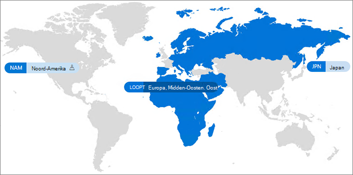

# Microsoft 365 Multi-Geo

Met Microsoft 365 multi-geo kan uw organisatie zijn Microsoft 365-aanwezigheid uitbreiden naar meerdere geografische regio's en/of landen binnen de bestaande Tenant. Neem contact op met uw Microsoft-account team om u aan te melden bij uw Microsoft-account team voor Microsoft 365-multi-geo.
  
Met Microsoft 365 in Microsoft kunt u gegevens inrichten en bewaren op de geografische locaties die u hebt gekozen om te voldoen aan de vereisten voor gegevens woonplaats, en tegelijk de wereldwijde samenvatting van de moderne productiviteitsfuncties voor uw werknemers ontgrendelen.

Voor een video-inleiding tot Microsoft 365 multi-geo raadpleegt [u SharePoint Online en OneDrive meerdere geografische locaties om te bepalen waar uw gegevens zich bevinden](https://www.youtube.com/watch?v=Do9U3JuROhk).

## Meerdere geo-architecturen

In een omgeving met meerdere geografische gebieden bevat uw Microsoft 365-Tenant een centrale locatie (waarbij uw Microsoft 365-abonnement oorspronkelijk is ingericht) en een of meer satelliet locaties. In een Tenant met meerdere geo-gebruikers wordt de informatie over geo-locaties, groepen en gebruikers informatie gemastereerd in azure Active Directory (Azure AD). Omdat uw Tenant gegevens centraal zijn gemastereerd en worden gesynchroniseerd in elke geografische locatie, delen en ervaring waarbij iedereen van uw bedrijf wereldwijde informatie bevat.

Houd er rekening mee dat Microsoft 365 multi-geo niet is ontworpen voor prestatieoptimalisatie, zodat het voldoet aan de vereisten voor data woonplaats. Zie [netwerk planning en prestaties optimaliseren voor Microsoft 365](https://support.office.com/article/e5f1228c-da3c-4654-bf16-d163daee8848) of neem contact op met de ondersteuningsgroep voor informatie over de prestaties optimaliseren voor microsoft 365.

## Terminologie

Dit zijn de belangrijkste voorwaarden die worden gebruikt in de basis van Microsoft 365 multi-geo:

- **Centrale locatie** : de geografische locatie waar de Tenant oorspronkelijk werd ingericht.
- **Geo-beheerder** : een beheerder die een of meer van de opgegeven satelliet locaties kan beheren.
- **Geo code** : een code van drie letters voor een bepaalde geografische locatie.
- **Geo-locatie** : een geografische locatie die kan worden gebruikt in een Tenant met meerdere geo-hosting voor het hosten van gegevens, inclusief Exchange-postvakken en OneDrive-en SharePoint-sites.
- **Voorkeurs gegevenslocatie (PDL)** : een gebruikerseigenschap die is ingesteld door de beheerder, die aangeeft waar de geografische locatie zich bevindt waar de gebruikers van het Exchange-postvak en de OneDrive moeten worden ingericht. Met de PDL wordt ook bepaald waar SharePoint-sites die zijn gemaakt door de gebruiker, worden ingericht.
- **Locatie van satelliet** : de geografische locaties waar het microsoft 365-werkbelasting van microsoft (SharePoint, OneDrive en Exchange) is ingeschakeld in een Tenant van meerdere geo.
- **Tenant** : de representatie van een organisatie in microsoft 365 waaraan meestal een of meer domeinen zijn gekoppeld (bijvoorbeeld contoso.com).

## Licenties

Microsoft 365 multi-geo is beschikbaar als een invoegtoepassing voor de volgende Microsoft 365-abonnementen voor EA-klanten met een minimum van 250 Microsoft 365 seats in hun Tenant, en minimaal 5% van deze stoelen met meerdere geografische versies. Neem contact op met uw Microsoft-accountteam voor meer informatie.

- Microsoft 365 F1, F3, E3 of E5
- Office 365 F3, E1, E3 of E5
- Exchange Online abonnement 1 of abonnement 2
- OneDrive voor bedrijven abonnement 1 of abonnement 2
- SharePoint Online, abonnement 1 of abonnement 2

## Microsoft 365 multi-geografische beschikbaarheid

Microsoft 365 multi-geo wordt momenteel aangeboden in deze regio's en landen:

[!INCLUDE [Microsoft 365 Multi-Geo locations](../includes/microsoft-365-multi-geo-locations.md)]

## Aan de slag

Voer de volgende stappen uit om aan de slag te gaan met meerdere geo:

1. Werk samen met uw accountteam om de mogelijkheden voor meervoudige geo toe te voegen _in Microsoft 365_ serviceplan. U kunt nu het aantal benodigde licenties toevoegen. Meervoudige geo-functie is beschikbaar voor EA-klanten met een minimum van een 250 Microsoft 365-abonnement.

   Voordat u Microsoft 365 multi-geo kunt gaan gebruiken, moet Microsoft uw Exchange Online-Tenant configureren voor ondersteuning via meerdere geo. Dit eenmalige configuratieproces wordt geactiveerd wanneer u de *mogelijkheden voor meerdere geografische locaties in Microsoft 365* serviceplan hebt gesorteerd en de licenties worden weergegeven in de Tenant. U ontvangt specifieke meldingen van de werkbelasting in het [Microsoft 365-berichtencentrum](https://support.office.com/article/38FB3333-BFCC-4340-A37B-DEDA509C2093) wanneer uw Tenant het configuratieproces voor elke werkbelasting heeft voltooid en u vervolgens de mogelijkheden van microsoft 365 multi-geo kunt configureren en gebruiken. De tijd die nodig is voor het configureren van een Tenant voor ondersteuning met meerdere Geografischen verschilt per Tenant naar Tenant, maar de meeste tenants voltooien binnen een maand na ontvangst van de functie licenties. Voor grotere of complexere tenants is meer tijd nodig om het configuratieproces te voltooien. Neem contact op met uw accountteam voor meer informatie over uw specifieke Tenant.

2. Lees [de omgeving voor meerdere geografische omgevingen plannen](plan-for-multi-geo.md).

3. Meer informatie over het [beheren van een omgeving met meerdere geografische omgevingen](administering-a-multi-geo-environment.md) en [de manier waarop gebruikers de omgeving kunnen ervaren](multi-geo-user-experience.md).

4. Wanneer u klaar bent om Microsoft 365 multi-geo in te stellen, [configureert u uw Tenant voor meervoudige geo](multi-geo-tenant-configuration.md).

5. [Zoekopdracht instellen](configure-search-for-multi-geo.md).

## Zie ook

[Meerdere geografische locaties in Exchange Online en OneDrive](https://Aka.ms/GoMultiGeo)

[Mogelijkheden voor meervoudige geo in OneDrive en SharePoint Online](multi-geo-capabilities-in-onedrive-and-sharepoint-online-in-microsoft-365.md)

[Mogelijkheden voor meervoudige geo in Exchange Online](multi-geo-capabilities-in-exchange-online.md)

[Teams-ervaring in een omgeving met meerdere geografische locaties](https://docs.microsoft.com/microsoftteams/teams-experience-o365odb-spo-multi-geo)
