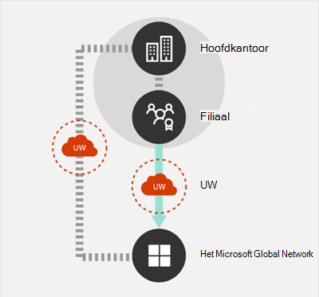
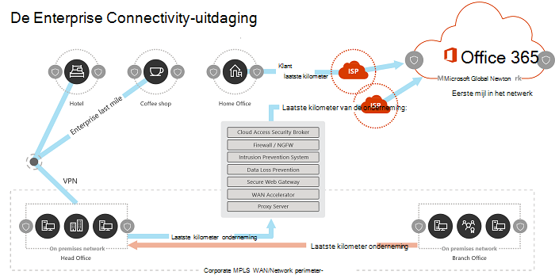
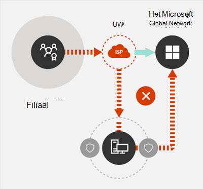
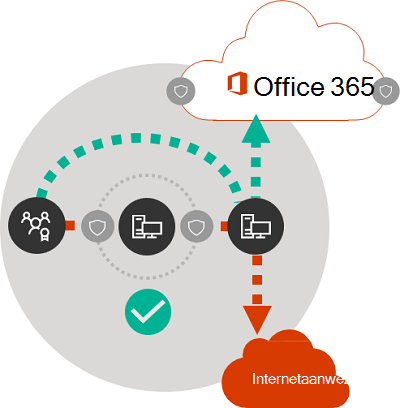

# Beginselen voor Microsoft 365-netwerkverbindingen

*Dit artikel is van toepassing op Microsoft 365 Enterprise en Office 365 Enterprise.*

Voordat u begint met het plannen van uw netwerk voor Microsoft 365-netwerkverbindingen, is het belangrijk om de verbindingsprincipes te begrijpen voor het veilig beheren van Microsoft 365-verkeer en het verkrijgen van de best mogelijke prestaties. Dit artikel helpt u met de meest recente richtlijnen om de Microsoft 365-netwerkverbindingen veilig te optimaliseren.
  
Traditionele bedrijfsnetwerken zijn primair ontworpen om gebruikers toegang te bieden tot applicaties en gegevens die worden gehost in door het bedrijf geëxploiteerde datacentra met een sterke perimeterbeveiliging. In het traditionele model wordt ervan uitgegaan dat gebruikers toegang hebben tot toepassingen en gegevens vanuit het bedrijfsnetwerk, via WAN-koppelingen van filialen of extern via VPN-verbindingen.
  
Door het gebruik van SaaS-applicaties zoals Microsoft 365 wordt een combinatie van services en gegevens buiten de netwerkperimeter verplaatst. Zonder optimalisering is het verkeer tussen gebruikers en SaaS-applicaties onderhevig aan latentie die wordt geïntroduceerd door pakketinspectie, netwerk-hairpins, onbedoelde verbindingen met geografisch verre eindpunten en andere factoren. U kunt de beste prestaties en betrouwbaarheid van Microsoft 365 garanderen door de belangrijkste optimaliseringsrichtlijnen te begrijpen en te implementeren.
  
In dit artikel vindt u meer informatie over:
  
- [Microsoft 365-architectuur](microsoft-365-network-connectivity-principles.md#BKMK_Architecture) zoals deze van toepassing is op klantconnectiviteit met de cloud
- Bijgewerkte [Microsoft 365-verbindingsprincipes](microsoft-365-network-connectivity-principles.md#BKMK_Principles) en strategieën voor het optimaliseren van netwerkverkeer en de eindgebruikerservaring
- De [Office 365 Endpoints-webservice](microsoft-365-network-connectivity-principles.md#BKMK_WebSvc), waarmee netwerkbeheerders een gestructureerde lijst met eindpunten kunnen gebruiken voor gebruik bij netwerkoptimalisering
- [Nieuwe Office 365-eindpuntcategorieën](microsoft-365-network-connectivity-principles.md#BKMK_Categories) en optimaliseringsbegeleiding
- [Netwerkperimeterbeveiliging in vergelijking met eindpuntbeveiliging](microsoft-365-network-connectivity-principles.md#BKMK_SecurityComparison)
- [Incrementele optimaliserings](microsoft-365-network-connectivity-principles.md#BKMK_IncOpt) opties voor Microsoft 365-verkeer
- De [Microsoft 365-connectiviteitstest](https://aka.ms/netonboard), een nieuw hulpmiddel om de basisverbindingen met Microsoft 365 te testen

## Microsoft 365-architectuur

Microsoft 365 is een gedistribueerde Software-as-a-Service (SaaS)-cloud die productiviteits- en samenwerkingsscenario's biedt via een diverse reeks microservices en -toepassingen, zoals Exchange Online, SharePoint Online, Skype voor Bedrijven Online, Microsoft Teams, Exchange Online Protection, Office in een browser en vele anderen. Hoewel specifieke Microsoft 365-applicaties hun unieke kenmerken hebben zoals deze van toepassing is op het netwerk van de klant en de connectiviteit met de cloud, delen ze allemaal enkele belangrijke principes, doelen en architectuurpatronen. Deze principes en architectuurpatronen voor connectiviteit zijn typisch voor veel andere SaaS-clouds en verschillen tegelijkertijd van de typische implementatiemodellen van Platform-as-a-Service en Infrastructure-as-a-Service-clouds, zoals Microsoft Azure.
  
Een van de belangrijkste architectonische kenmerken van Microsoft 365 (die vaak wordt gemist of verkeerd geïnterpreteerd door netwerkarchitecten) is dat het een echt wereldwijd gedistribueerde service is, binnen de context van de manier waarop gebruikers er verbinding mee maken. De locatie van de beoogde Microsoft 365-tenant is belangrijk om te begrijpen waar klantgegevens in de cloud zijn opgeslagen, maar de gebruikerservaring met Microsoft 365 houdt niet in dat u rechtstreeks verbinding maakt met schijven die de gegevens bevatten. De gebruikerservaring met Microsoft 365 (inclusief prestaties, betrouwbaarheid en andere belangrijke kwaliteitskenmerken) omvat verbindingen via sterk gedistribueerde service-frontdoors die zijn opgeschaald over honderden Microsoft-locaties wereldwijd. In de meeste gevallen wordt de beste gebruikerservaring bereikt door het netwerk van de klant in staat te stellen gebruikersverzoeken naar het dichtstbijzijnde Microsoft 365-service-ingangspunt te leiden, in plaats van verbinding te maken met Microsoft 365 via een uitgangspunt op een centrale locatie of regio.
  
Voor de meeste klanten zijn Microsoft 365-gebruikers verspreid over verschillende locaties. Om de beste resultaten te bereiken, moeten de principes die in dit document worden beschreven, worden bekeken vanuit het oogpunt van scale-out (niet scale-up), waarbij de nadruk ligt op het optimaliseren van de connectiviteit naar het dichtstbijzijnde point of presence in het Microsoft Global Network, niet naar het geografische locatie van de Microsoft 365-tenant. In wezen betekent dit dat, hoewel Microsoft 365-tenantgegevens mogelijk zijn opgeslagen op een specifieke geografische locatie, de Microsoft 365-ervaring voor die tenant gedistribueerd blijft en aanwezig kan zijn in zeer dichte (netwerk-)nabijheid van elke eindgebruikerslocatie die de tenant heeft.
  
## Microsoft 365-connectiviteitsprincipes

Microsoft raadt de volgende principes aan om optimale Microsoft 365-connectiviteit en -prestaties te bereiken. Gebruik deze Microsoft 365-connectiviteitsprincipes om uw verkeer te beheren en de beste prestaties te krijgen wanneer u verbinding maakt met Microsoft 365.
  
Het primaire doel van het netwerkontwerp moet zijn om de latentie te minimaliseren door de round-trip time (RTT) van uw netwerk naar het Microsoft Global Network te verminderen. Dit is de openbare netwerk-backbone van Microsoft die alle datacentra van Microsoft met elkaar verbindt met een lage latentie en spreiding van de toegangspunten voor cloudtoepassingen rond de wereld. U kunt meer lezen over het Microsoft Global Network op [Hoe Microsoft zijn snelle en betrouwbare wereldwijde netwerk opbouwt](https://azure.microsoft.com/blog/how-microsoft-builds-its-fast-and-reliable-global-network/).
  

### Microsoft 365-verkeer identificeren en onderscheiden

  
Het identificeren van Microsoft 365-netwerkverkeer is de eerste stap om dat verkeer te kunnen onderscheiden van generiek internetgebonden netwerkverkeer. Microsoft 365-connectiviteit kan worden geoptimaliseerd door een combinatie van benaderingen te implementeren, zoals netwerkroute-optimalisering, firewallregels, browserproxy-instellingen en omzeilen van netwerkinspectie-apparaten voor bepaalde eindpunten.
  
Eerdere richtlijnen voor Microsoft 365-optimalisering verdeelden Microsoft 365-eindpunten in twee categorieën, **Vereist** en **Optioneel**. Aangezien er eindpunten zijn toegevoegd om nieuwe Microsoft 365-services en -functies te ondersteunen, hebben we Microsoft 365-eindpunten in drie categorieën gereorganiseerd: **Optimaliseren**, **Toestaan** en **Standaard**. Richtlijnen voor elke categorie zijn van toepassing op alle eindpunten in de categorie, waardoor optimalisering gemakkelijker te begrijpen en te implementeren is.
  
Zie voor meer informatie over Microsoft 365-eindpuntcategorieën en optimaliseringsmethoden de sectie [Nieuwe Office 365-eindpuntcategorieën](microsoft-365-network-connectivity-principles.md#BKMK_Categories).
  
Microsoft publiceert nu alle Microsoft 365-eindpunten als een webservice en biedt richtlijnen voor het gebruik van deze gegevens. Zie het artikel [Office 365-Url's en IP-adresbereiken](https://support.office.com/article/office-365-urls-and-ip-address-ranges-8548a211-3fe7-47cb-abb1-355ea5aa88a2?ui=en-US&amp;rs=en-US&amp;ad=US) voor meer informatie over het ophalen van en werken met Microsoft 365-eindpunten.
  

### Lokale uitgangen van netwerkverbindingen regelen

  
Lokale DNS en uitgaand internetverkeer zijn van cruciaal belang om de verbindingslatentie te verminderen en ervoor te zorgen dat gebruikersverbindingen worden gemaakt met het dichtstbijzijnde toegangspunt voor Microsoft 365-services. In een complexe netwerktopologie is het belangrijk om zowel lokale DNS als lokaal uitgaand internetverkeer samen te implementeren. Zie het artikel [Clientconnectiviteit](https://support.office.com/article/client-connectivity-4232abcf-4ae5-43aa-bfa1-9a078a99c78b) voor meer informatie over hoe Microsoft 365 clientverbindingen naar het dichtstbijzijnde punt van binnenkomst leidt.
  
Voorafgaand aan de komst van clouddiensten zoals Microsoft 365 was internetconnectiviteit voor eindgebruikers als ontwerpfactor in netwerkarchitectuur relatief eenvoudig. Wanneer internetservices en websites over de hele wereld zijn verspreid, is de latentie tussen de uitgangspunten van het bedrijf en een bepaald eindpunt als bestemming grotendeels een functie van de geografische afstand.
  
In een traditionele netwerkarchitectuur lopen alle uitgaande internetverbindingen door het bedrijfsnetwerk en verlaten ze een centrale locatie. Naarmate het cloudaanbod van Microsoft volwassener is geworden, is een gedistribueerde internetgerichte netwerkarchitectuur van cruciaal belang voor het ondersteunen van latentiegevoelige cloudservices. Het Microsoft Global Network is ontworpen om tegemoet te komen aan latentievereisten met behulp van de Distributed Service Front Door-infrastructuur. Dit is een dynamische structuur van wereldwijde toegangspunten die inkomende cloudservice-verbindingen naar het dichtstbijzijnde toegangspunt leidt. Dit is bedoeld om de lengte van de 'last mile' voor Microsoft-cloudklanten te verkleinen, door de route tussen de klant en de cloud effectief te verkorten.
  
Enterprise-WAN's zijn vaak zo ontworpen dat ze netwerkverkeer terug leiden naar een centraal hoofdkantoor voor inspectie voordat het naar het internet gaat, meestal via een of meer proxyservers. Het onderstaande diagram illustreert een dergelijke netwerktopologie.
  

  
Aangezien Microsoft 365 draait op het Microsoft Global Network, dat front-end servers over de hele wereld omvat, zal er vaak een front-end server zijn dichtbij de locatie van de gebruiker. Door lokaal internetverkeer te bieden en door interne DNS-servers te configureren om lokale naamomzetting te bieden voor Microsoft 365-eindpunten, kan netwerkverkeer dat is bestemd voor Microsoft 365 verbinding maken met Microsoft 365-front-end-servers die zich zo dicht mogelijk bij de gebruiker bevinden. Het onderstaande diagram toont een voorbeeld van een netwerktopologie waarmee gebruikers verbinding kunnen maken vanaf het hoofdkantoor, het filiaal en externe locaties, om de kortste route te volgen naar het dichtstbijzijnde Microsoft 365-toegangspunt.
  

  
Het op deze manier verkorten van het netwerkpad naar de toegangspunten van Microsoft 365 kan de connectiviteitsprestaties en de eindgebruikerservaring in Microsoft 365 verbeteren. Ook kan het helpen om de impact van toekomstige wijzigingen in de netwerkarchitectuur op de prestaties en betrouwbaarheid van Microsoft 365 te verminderen.
  
DNS-verzoeken kunnen ook latentie veroorzaken als de reagerende DNS-server ver weg of bezet is. U kunt de latentie van naamomzetting minimaliseren door lokale DNS-servers in filialen in te richten en ervoor te zorgen dat ze zijn geconfigureerd om DNS-records op de juiste manier te cachen.
  
Hoewel regionaal uitgaand verkeer goed kan werken voor Microsoft 365, zou het optimale connectiviteitsmodel altijd een netwerkuitgang bieden op de locatie van de gebruiker, ongeacht of dit op het bedrijfsnetwerk is of op afgelegen locaties zoals huizen, hotels, cafés en luchthavens. Dit lokale directe uitgangsmodel wordt weergegeven in het onderstaande diagram.
  

  
Bedrijven die Microsoft 365 hebben geadopteerd, kunnen profiteren van de Distributed Service Front Door-architectuur van Microsoft Global Network door ervoor te zorgen dat gebruikersverbindingen met Microsoft 365 de kortst mogelijke route naar het dichtstbijzijnde Microsoft Global Network-toegangspunt nemen. De netwerkarchitectuur voor lokaal uitgaand verkeer doet dit door toe te staan dat Microsoft 365-verkeer wordt gerouteerd via de dichtstbijzijnde uitgang, ongeacht de locatie van de gebruiker.
  
De architectuur voor lokaal uitgaand verkeer heeft de volgende voordelen ten opzichte van het traditionele model:
  
- Biedt optimale Microsoft 365-prestaties door de lengte van de route te optimaliseren. Verbindingen met eindgebruikers worden dynamisch gerouteerd naar het dichtstbijzijnde Microsoft 365-toegangspunt door de Distributed Service Front Door-infrastructuur.
- Vermindert de belasting van de bedrijfsnetwerkinfrastructuur door lokale uitgaand verkeer toe te staan.
- Beveiligt verbindingen aan beide kanten door gebruik te maken van client-endpoint-beveiliging en cloudbeveiligingsfuncties.

### Netwerk-hairpins vermijden

  
Als algemene vuistregel geldt dat de kortste, meest directe route tussen de gebruiker en het dichtstbijzijnde Microsoft 365-eindpunt de beste prestaties biedt. Een netwerk-hairpin treedt op wanneer WAN- of VPN-verkeer dat bestemd is voor een bepaalde bestemming, eerst naar een andere tussenliggende locatie wordt geleid (zoals een beveiligings-stack, Cloud Access Broker of een cloudgebaseerde webgateway), hetgeen kan leiden tot latentie en mogelijke omleiding naar een geografisch ver verwijderd eindpunt. Netwerk-hairpins kunnen ook worden veroorzaakt door inefficiëntie van routering/peering of suboptimale (externe) DNS-lookups.
  
Om ervoor te zorgen dat de Microsoft 365-connectiviteit niet onderhevig is aan netwerk-hairpins, zelfs niet in het geval van lokaal uitgaand verkeer, controleert u of de ISP die wordt gebruikt om uitgaand internetverkeer voor de gebruikerslocatie te bieden, een directe peering-relatie heeft met het Microsoft Global Network in de buurt van die locatie. Mogelijk wilt u ook uitgaande routering configureren om vertrouwd Microsoft 365-verkeer rechtstreeks te verzenden, in tegenstelling tot proxy of tunneling via een externe cloud- of cloudgebaseerde netwerkbeveiligingsleverancier die uw internetgebonden verkeer verwerkt. Lokale DNS-naamomzetting van Microsoft 365-eindpunten helpt ervoor te zorgen dat naast directe routering ook de dichtstbijzijnde Microsoft 365-toegangspunten worden gebruikt voor gebruikersverbindingen.
  
Als u cloudgebaseerde netwerk- of beveiligingsservices gebruikt voor uw Microsoft 365-verkeer, zorg er dan voor dat het resultaat van de hairpin wordt geëvalueerd en dat de impact op de prestaties van Microsoft 365 wordt begrepen. Dit kan worden gedaan door het aantal en de locaties van de serviceproviderlocaties te onderzoeken waardoor het verkeer wordt doorgestuurd in relatie tot het aantal filialen en Microsoft Global Network-peering-punten, de kwaliteit van de netwerkpeering-relatie van de serviceprovider met uw ISP en Microsoft en de impact op de prestaties van backhauling in de infrastructuur van de serviceprovider.
  
Vanwege het grote aantal gedistribueerde locaties met Microsoft 365-toegangspunten en hun nabijheid tot eindgebruikers, kan het routeren van Microsoft 365-verkeer naar een externe netwerk- of beveiligingsprovider een negatieve invloed hebben op Microsoft 365-verbindingen als het providernetwerk niet is geconfigureerd voor optimale Microsoft 365-peering.
  

### Het omzeilen van proxy's, inspectie apparaten voor netwerkverkeer en gedupliceerde beveiligingstechnologieën beoordelen

  
Enterprise-klanten moeten hun methoden voor netwerkbeveiliging en risicobeperking specifiek voor Microsoft 365-gebonden verkeer herzien en Microsoft 365-beveiligingsfuncties gebruiken om hun afhankelijkheid van opdringerige, prestatie-beïnvloedende en dure netwerkbeveiligingstechnologieën voor Microsoft 365-netwerkverkeer te verminderen.
  
De meeste bedrijfsnetwerken dwingen netwerkbeveiliging voor internetverkeer af met behulp van technologieën zoals proxy's, SSL-inspectie, pakketinspectie en systemen om gegevensverlies te voorkomen. Deze technologieën bieden belangrijke risicobeperkingen voor algemene internetverzoeken, maar kunnen de prestaties, schaalbaarheid en kwaliteit van de eindgebruikerservaring drastisch verminderen wanneer ze worden toegepast op Microsoft 365-eindpunten.
  

#### Webservice voor Office 365-eindpunten

Microsoft 365-beheerders kunnen een script of REST-aanroep gebruiken om een gestructureerde lijst met eindpunten van de Office 365 Endpoints-webservice aan te roepen en de configuraties van perimeterfirewalls en andere netwerkapparaten bij te werken. Dit zorgt ervoor dat verkeer dat bestemd is voor Microsoft 365 wordt geïdentificeerd, op de juiste manier wordt behandeld en anders wordt beheerd dan netwerkverkeer dat is bestemd voor algemene en vaak onbekende internetwebsites. Zie het artikel [Office 365-URL's en IP-adresbereiken](https://support.office.com/article/office-365-urls-and-ip-address-ranges-8548a211-3fe7-47cb-abb1-355ea5aa88a2?ui=en-US&amp;rs=en-US&amp;ad=US) voor meer informatie over het gebruik van de webservice Office 365 Endpoints.
  
#### PAC-scripts (Proxy Automatic-Configuration)

Microsoft 365-beheerders kunnen PAC-scripts (Proxy Automatic Configuration) maken die via WPAD of GPO aan gebruikerscomputers kunnen worden geleverd. PAC-scripts kunnen worden gebruikt om proxy's voor Microsoft 365-verzoeken van WAN- of VPN-gebruikers te omzeilen, waardoor Microsoft 365-verkeer directe internetverbindingen kan gebruiken in plaats van het bedrijfsnetwerk te doorkruisen.
  
#### Beveiligingsfuncties in Microsoft 365

Microsoft is transparant over datacenterbeveiliging, operationele beveiliging en risicovermindering rond Microsoft 365-servers en de netwerkeindpunten die ze vertegenwoordigen. De ingebouwde beveiligingsfuncties van Microsoft 365 zijn beschikbaar om netwerkbeveiligingsrisico's te verminderen, zoals preventie van gegevensverlies, anti-virus, meervoudige verificatie, Customer Lock Box, Defender voor Office 365, Microsoft 365 Threat Intelligence, Microsoft 365 Secure Score, Exchange Online Protection en netwerk-DDOS-beveiliging.
  
Zie het [Microsoft Vertrouwenscentrum](https://www.microsoft.com/trustcenter/security) voor meer informatie over het datacenter van Microsoft en Global Network Security.
  
## Nieuwe categorieën met Office 365-eindpunten

Office 365-eindpunten vertegenwoordigen een gevarieerde reeks netwerkadressen en subnetten. Eindpunten kunnen URL's, IP-adressen of IP-bereiken zijn en sommige eindpunten worden weergegeven met specifieke TCP/UDP-poorten. URL's kunnen een FQDN zijn, zoals *account.office.net*, of een wildcard-URL zoals *\*.office365.com*.
  
> [!NOTE]
> De locaties van Office 365-eindpunten binnen het netwerk zijn niet rechtstreeks gerelateerd aan de locatie van de Microsoft 365-Tenantgegevens. Om deze reden moeten klanten Microsoft 365 beschouwen als een gedistribueerde en wereldwijde service en mogen ze niet proberen netwerkverbindingen met Office 365-eindpunten te blokkeren op basis van geografische criteria.
  
In onze vorige richtlijnen voor het beheren van Microsoft 365-verkeer waren eindpunten onderverdeeld in twee categorieën, **vereist** en **optioneel**. Eindpunten binnen elke categorie vereisten verschillende optimalisaties, afhankelijk van de ernst van de service. Veel klanten kwamen voor uitdagingen te staan bij het rechtvaardigen van de toepassing van dezelfde netwerkoptimalisaties op de volledige lijst met Office 365-URL's en IP-adressen.
  
In het nieuwe model worden eindpunten onderverdeeld in drie categorieën,**Optimaliseren**, **Toestaan** en **Standaard**, waardoor een op prioriteiten gebaseerd eindpunt wordt geboden waarop netwerkoptimaliseringsinspanningen moeten worden gericht om de beste prestatieverbeteringen en het beste rendement te realiseren. De eindpunten zijn geconsolideerd in de bovenstaande categorieën op basis van de gevoeligheid van de effectieve gebruikerservaring voor netwerkkwaliteit, volume, de prestaties van scenario's en het implementatiegemak. Aanbevolen optimalisaties kunnen op dezelfde manier worden toegepast op alle eindpunten in een bepaalde categorie.
  
- Het **optimaliseren**-eindpunten zijn vereist voor connectiviteit met elke Office 365 service en vertegenwoordigen meer dan 75% van de Office 365-bandbreedte, verbindingen en datavolume. Deze eindpunten vertegenwoordigen Office 365-scenario's die het gevoeligst zijn voor netwerkprestaties, latentie en beschikbaarheid. Alle eindpunten worden gehost in Microsoft-datacenters. De mate van verandering van de eindpunten in deze categorie zal naar verwachting veel lager zijn dan voor de eindpunten in de andere twee categorieën. Deze categorie bevat een klein aantal (een stuk of 10) sleutel-URL's en een gedefinieerde reeks IP-subnetten die zijn bedoeld voor de belangrijkste Office 365-workloads, zoals Exchange Online, SharePoint Online, Skype voor Bedrijven Online en Microsoft Teams.

    Een beknopte lijst met goed gedefinieerde kritieke eindpunten zou u moeten helpen om hoogwaardige netwerkoptimalisering voor deze bestemmingen sneller en gemakkelijker te plannen en te implementeren.

    Voorbeelden van *optimaliseren*-eindpunten zijn *https://outlook.office365.com*, *https://\<tenant\>.sharepoint.com* en *https://\<tenant\>-my.sharepoint.com*.

    Optimaliseringsmethoden zijn:

  - *Optimaliseren*-eindpunten omzeilen op netwerkapparaten en services die verkeersinterceptie, SSL-decodering, deep packet-inspectie en inhoudsfiltering uitvoeren.
  - Omzeil lokale proxy-apparaten en cloudgebaseerde proxyservices die vaak worden gebruikt voor algemeen surfen op internet.
  - Geef prioriteit aan de evaluatie van deze eindpunten als volledig vertrouwd door uw netwerkinfrastructuur en perimetersystemen.
  - Geef prioriteit aan het verminderen of elimineren van WAN-backhauling, en faciliteer direct gedistribueerd uitgaand verkeer via internet voor deze eindpunten, zo dicht mogelijk bij gebruikers/filialen.
  - Vergemakkelijk directe connectiviteit met deze cloud-eindpunten voor VPN-gebruikers door split-tunneling te implementeren.
  - Zorg ervoor dat IP-adressen die worden geretourneerd door DNS-naamomzetting overeenkomen met het uitgaande pad voor routering voor deze eindpunten.
  - Geef prioriteit aan deze eindpunten voor SD-WAN-integratie voor directe routering met minimale latentie naar het dichtstbijzijnde internetpeering-punt van het wereldwijde Microsoft-netwerk.

- **Toestaan**-eindpunten zijn vereist voor verbindingen met specifieke services en functies van Office 365, maar zijn niet zo gevoelig voor netwerkprestaties en latentie als in de categorie *Optimaliseren*. De totale netwerkvoetafdruk van deze eindpunten vanuit het oogpunt van bandbreedte en aantal verbindingen is ook kleiner. Deze eindpunten zijn specifiek voor Office 365 en worden gehost in Microsoft-datacenters. Ze vertegenwoordigen een brede reeks Office 365-microservices en hun afhankelijkheden (een stuk of 100 URL's) en zullen naar verwachting sneller veranderen dan die in de categorie *Optimaliseren*. Niet alle eindpunten in deze categorie zijn gekoppeld aan gedefinieerde toegewezen IP-subnetten.

    Netwerkoptimalisering voor *Toestaan*-eindpunten kunnen de Office 365-gebruikerservaring verbeteren, maar sommige klanten kunnen ervoor kiezen om die optimalisaties nauwkeuriger te beperken, om wijzigingen in hun netwerk te minimaliseren.

    Voorbeelden van *Toestaan*-eindpunten zijn *https://\*.protection.outlook.com* en *https://accounts.accesscontrol.windows.net*.

    Optimaliseringsmethoden zijn:

  - *Toestaan*-eindpunten omzeilen op netwerkapparaten en services die verkeersinterceptie, SSL-decodering, deep packet-inspectie en inhoudsfiltering uitvoeren.
  - Geef prioriteit aan de evaluatie van deze eindpunten als volledig vertrouwd door uw netwerkinfrastructuur en perimetersystemen.
  - Geef prioriteit aan het verminderen of elimineren van WAN-backhauling, en faciliteer direct gedistribueerd uitgaand verkeer via internet voor deze eindpunten, zo dicht mogelijk bij gebruikers/filialen.
  - Zorg ervoor dat IP-adressen die worden geretourneerd door DNS-naamomzetting overeenkomen met het uitgaande pad voor routering voor deze eindpunten.
  - Geef prioriteit aan deze eindpunten voor SD-WAN-integratie voor directe routering met minimale latentie naar het dichtstbijzijnde internetpeering-punt van het wereldwijde Microsoft-netwerk.

- **Standaard**-eindpunten vertegenwoordigen Office 365-services en -afhankelijkheden die niet hoeven te worden geoptimaliseerd en die door klantnetwerken kunnen worden behandeld als normaal internetverkeer. Sommige eindpunten in deze categorie worden mogelijk niet gehost in Microsoft-datacenters. Voorbeelden hiervan zijn *https://odc.officeapps.live.com* en *https://appexsin.stb.s-msn.com*.

Zie het artikel [Office 365-eindpunten beheren](managing-office-365-endpoints.md) voor meer informatie over de methoden voor netwerkoptimalisering in Office 365.
  
## Netwerkperimeterbeveiliging in vergelijking met eindpuntbeveiliging

Het doel van traditionele netwerkbeveiliging is om de perimeter van het bedrijfsnetwerk te beschermen tegen indringing en kwaadwillende exploits. Terwijl organisaties Microsoft 365 gaan gebruiken, worden sommige netwerkdiensten en gegevens gedeeltelijk of volledig naar de cloud gemigreerd. Zoals voor elke fundamentele wijziging in de netwerkarchitectuur, vereist dit proces een herevaluatie van de netwerkbeveiliging waarbij rekening wordt gehouden met nieuwe factoren:
  
- Naarmate cloudservices in gebruik worden genomen, worden netwerkservices en gegevens gedistribueerd tussen lokale datacentra en de cloud en is de perimeterbeveiliging op zichzelf niet langer toereikend.
- Externe gebruikers maken verbinding met bedrijfsbronnen, zowel in lokale datacentra als in de cloud vanaf ongecontroleerde locaties zoals huizen, hotels en cafés.
- Speciaal gebouwde beveiligingsfuncties worden steeds vaker in cloudservices ingebouwd en kunnen mogelijk bestaande beveiligingssystemen aanvullen of vervangen.

Microsoft biedt een breed scala aan Microsoft 365-beveiligingsfuncties en biedt voorgeschreven richtlijnen voor het toepassen van best practices op het gebied van beveiliging die u kunnen helpen de gegevens- en netwerkbeveiliging voor Microsoft 365 te waarborgen. Aanbevolen best practices zijn onder meer:
  
- **Meervoudige verificatie (MFA) gebruiken** MFA voegt een extra beveiligingslaag toe aan een strategie met sterke wachtwoorden. Het komt erop neer dat gebruikers een telefoongesprek, sms-bericht of app-melding op hun smartphone moeten bevestigen nadat ze hun wachtwoord hebben ingevoerd.

- **Microsoft Cloud App Security gebruiken** Beleid configureren om afwijkende activiteiten bij te houden en ernaar te handelen. Stel waarschuwingen in met behulp Microsoft Cloud App Security, zodat beheerders ongebruikelijke of risicovolle gebruikersactiviteiten kunnen bekijken. Denk hierbij aan het downloaden van grote hoeveelheden gegevens, meerdere mislukte aanmeldingspogingen of aanmeldingen vanaf onbekende of gevaarlijke IP-adressen.

- **Preventie van gegevensverlies (DLP) configureren** Met DLP kunt u gevoelige gegevens identificeren en beleidsregels opstellen die helpen voorkomen dat gebruikers per ongeluk of opzettelijk de gegevens delen. DLP werkt overal binnen Microsoft 365, inclusief Exchange Online, SharePoint Online en OneDrive, zodat uw gebruikers zich aan de regels kunnen houden zonder dat ze hun werkstroom hoeven te onderbreken.

- **Customer Lockbox gebruiken** Als beheerder van Microsoft 365 kunt u met Customer Lockbox bepalen hoe een ondersteuningstechnicus van Microsoft op afstand toegang krijgt tot uw gegevens. In gevallen waarin de technicus toegang nodig heeft tot uw gegevens om een probleem op te sporen en op te lossen, kunt u via Customer Lockbox de aanvraag voor toegang goedkeuren of weigeren.

- **Office 365 Secure Score gebruiken** Dit is een programma waarmee u de huidige beveiliging kunt analyseren. Op basis hiervan krijgt u aanbevelingen om het risico nog verder te beperken. Secure Score analyseert uw Microsoft 365-instellingen en -activiteiten en vergelijkt deze met een basislijn die is vastgesteld door Microsoft. Hier rolt een score uit die aangeeft in welke mate de aanbevolen beveiligingsprocedures worden nageleefd.

Een holistische aanpak voor een betere beveiliging moet rekening houden met het volgende:
  
- Verplaats de nadruk van perimeterbeveiliging naar eindpuntbeveiliging door cloudgebaseerde en beveiligingsfuncties voor Office-clients toe te passen.
  - De beveiligingsperimeter naar het datacenter verkleinen
  - Gelijkwaardig vertrouwen inschakelen voor gebruikersapparaten op kantoor of op externe locaties
  - Focus op het beveiligen van de gegevenslocatie en de gebruikerslocatie
  - Beheerde gebruikersmachines hebben een betere vertrouwensrelatie met eindpuntbeveiliging
- Beheer alle informatiebeveiliging holistisch, niet alleen gericht op de perimeter
  - Herdefinieer WAN en bouw perimeternetwerkbeveiliging door vertrouwd verkeer toe te staan beveiligingsapparaten te omzeilen en onbeheerde apparaten te scheiden van Wi-Fi-gastnetwerken
  - Verlaag de netwerkbeveiligingsvereisten van de zakelijke WAN-rand
  - Sommige apparaten voor netwerkperimeterbeveiliging, zoals firewalls, zijn nog steeds vereist, maar de belasting wordt verminderd
  - Zorgt voor lokaal uitgaand verkeer voor Microsoft 365-verkeer
- Verbeteringen kunnen incrementeel worden aangepakt, zoals beschreven in de sectie [Incrementele optimalisering](microsoft-365-network-connectivity-principles.md#BKMK_IncOpt). Sommige optimaliseringstechnieken bieden een betere kosten-batenratio, afhankelijk van uw netwerkarchitectuur. U moet optimalisaties kiezen die het meest geschikt zijn voor uw organisatie.

Zie het artikel [Microsoft 365-beveiliging](https://docs.microsoft.com/microsoft-365/security) en [Microsoft 365-compliance](https://docs.microsoft.com/microsoft-365/compliance) voor meer informatie over beveiliging en compliance in Microsoft 365.
  
## Incrementele optimalisering

We hebben eerder in dit artikel het ideale netwerkconnectiviteitsmodel voor SaaS geïntroduceerd, maar voor veel grote organisaties met historisch complexe netwerkarchitecturen zal het niet praktisch zijn om al deze wijzigingen direct door te voeren. In deze sectie bespreken we een aantal incrementele wijzigingen die kunnen helpen om de prestaties en betrouwbaarheid van Microsoft 365 te verbeteren.
  
De methoden die u gebruikt voor het optimaliseren van het Microsoft 365-verkeer zijn afhankelijk van uw netwerktopologie en de netwerkapparaten die u hebt geïmplementeerd. Grote ondernemingen met veel locaties en complexe netwerkbeveiligingspraktijken zullen een strategie moeten ontwikkelen die de meeste of alle principes omvat die worden vermeld in de sectie [Microsoft 365-connectiviteitsprincipes](microsoft-365-network-connectivity-principles.md#BKMK_Principles), terwijl kleinere organisaties misschien maar een of twee principes hoeven te overwegen.
  
U kunt optimalisering benaderen als een incrementeel proces, waarbij u elke methode achtereenvolgens toepast. De volgende tabel bevat de belangrijkste optimalisatiemethoden in volgorde van hun impact op latentie en betrouwbaarheid voor het grootste aantal gebruikers.
  
|**Optimaliseringsmethode**|**Beschrijving**|**Gevolg**|
|:-----|:-----|:-----|
|Lokale DNS-resolutie en Internet-uitgang    |Stel lokale DNS-servers in op elke locatie en zorg ervoor dat Microsoft 365-verbindingen zo dicht mogelijk bij de locatie van de gebruiker worden afgeleverd op internet.    | Latentie minimaliseren     Betrouwbare verbindingen met het dichtstbijzijnde Microsoft 365-toegangspunt verbeteren    |
|Regionale uitgangspunten toevoegen    |Als uw bedrijfsnetwerk meerdere locaties heeft, maar slechts één uitgangspunt, kunt u regionale uitgangspunten toevoegen om gebruikers in staat te stellen verbinding te maken met het dichtstbijzijnde Microsoft 365-toegangspunt.    | Latentie minimaliseren     Betrouwbare verbindingen met het dichtstbijzijnde Microsoft 365-toegangspunt verbeteren    |
|Proxy's en inspectieapparaten omzeilen    |Browsers met PAC-bestanden configureren die Microsoft 365-verzoeken rechtstreeks naar uitgaande punten sturen.    Edge-routers en firewalls configureren om het verkeer van Microsoft 365 zonder controle mogelijk te maken.    | Latentie minimaliseren     Belasting verminderen op netwerkapparaten    |
|Directe verbinding voor VPN-gebruikers inschakelen    |Voor VPN-gebruikers: schakel Microsoft 365-verbindingen in om rechtstreeks verbinding te maken vanaf het netwerk van de gebruiker in plaats van via de VPN-tunnel, door split-tunneling te implementeren.    | Latentie minimaliseren     Betrouwbare verbindingen met het dichtstbijzijnde Microsoft 365-toegangspunt verbeteren    |
|Migreren van traditioneel WAN naar SD-WAN    |SD-WAN's (Software Defined Wide Area Networks) vereenvoudigen WAN-beheer en verbeteren de prestaties door traditionele WAN-routers te vervangen door virtuele apparaten, vergelijkbaar met de virtualisatie van rekenresources met behulp van virtuele machines (VM's).    | De prestaties en beheerbaarheid van WAN-verkeer verbeteren     Belasting verminderen op netwerkapparaten    |

## Verwante onderwerpen

[Overzicht van netwerkverbindingen voor Microsoft 365](microsoft-365-networking-overview.md)

[Office 365-eindpunten beheren](managing-office-365-endpoints.md)

[URL's en IP-adresbereiken voor Office 365](urls-and-ip-address-ranges.md)

[IP-adres en URL-webservice van Office 365](microsoft-365-ip-web-service.md)

[Microsoft 365-netwerkverbindingen evalueren](assessing-network-connectivity.md)

[Netwerkplanning en prestaties optimaliseren voor Microsoft 365](network-planning-and-performance.md)

[Office 365-prestatieafstemming met behulp van basislijnen en prestatiegeschiedenis](performance-tuning-using-baselines-and-history.md)

[Prestatieproblemen met Office 365 oplossen: planning](performance-troubleshooting-plan.md)

[Netwerken voor contentlevering](content-delivery-networks.md)

[Microsoft 365-connectiviteitstest](https://aka.ms/netonboard)

[Hoe Microsoft zijn snelle en betrouwbare wereldwijde netwerk opbouwt](https://azure.microsoft.com/blog/how-microsoft-builds-its-fast-and-reliable-global-network/)

[Office 365-netwerkblog](https://techcommunity.microsoft.com/t5/Office-365-Networking/bd-p/Office365Networking)
