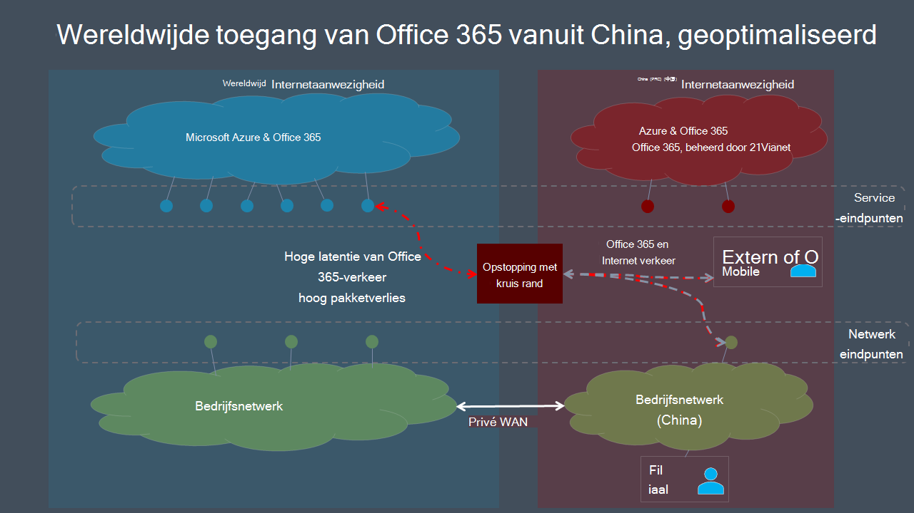

# Wereldwijd optimaliseren van Microsoft 365 voor gebruikers van China

>[!IMPORTANT]
>Deze instructies zijn specifiek voor gebruiksscenario's waarin **Microsoft 365-gebruikers in China in China** verbinding maken met een **globale Microsoft 365-Tenant**. Deze richtlijnen gelden **niet** voor tenants in Office 365, beheerd door 21vianet.

Voor ondernemingen met een wereldwijde Microsoft 365-Tenant en een bedrijfs aanwezigheid in China kunnen de client prestaties van Microsoft 365 voor gebruikers met China ingewikkeld zijn met unieke factoren voor de Internet architectuur van China telco.

China-aanbieders hebben gereglementeerde verbindingen met het wereldwijde openbare Internet doorlopen via verbindings systemen die gevoelig zijn voor zeer grote hoeveelheden netwerkcongestie. Met deze congestie wordt pakketverlies en latentie gemaakt voor alle Internet verkeer dat naar en uit China overgaat.

Pakketverlies en latentie zijn nadelig voor de prestaties van netwerkservices, met name services waarvoor grote Data Exchange (zoals grote bestandsoverdracht) of de nabije realtime-prestaties (audio-en videotoepassingen) is vereist.

Het doel van dit onderwerp is het verschaffen van aanbevolen procedures voor het beperken van de impact van het grensoverschrijdende netwerk van China met congestie van Microsoft 365-Services. Dit onderwerp verhelpt niet bij veelvoorkomende problemen met de laatste kilometer, zoals problemen met een hoge pakket latentie vanwege ingewikkelde routering binnen China-vervoerders.

## Best practices voor bedrijfsnetwerk

In het algemeen is een groot aantal ondernemingen met algemene Microsoft 365-tenants en gebruikers in China in China persoonlijke netwerken met een zakelijk netwerkverkeer tussen de kantoorruimten en offshore-locaties in China ter wereld. Deze ondernemingen kunnen de netwerkinfrastructuur benutten om te voorkomen dat er grensoverschrijdende netwerkcongestie overgaat en de prestaties van de Microsoft 365-service in China optimaliseren.

>[!IMPORTANT]
>Net als met alle persoonlijke WAN-implementaties moet u altijd de wettelijke vereisten voor uw land en/of regio raadplegen om ervoor te zorgen dat uw netwerkconfiguratie wordt nageleefd.

Als eerste stap is het van essentieel belang dat u de richtlijnen [voor netwerk planning en prestaties optimaliseren voor Microsoft 365](https://aka.ms/tune). Het belangrijkste doel is om te voorkomen dat u toegang krijgt tot de wereldwijde Microsoft 365-services van Internet in China, indien mogelijk.

- Gebruik uw bestaande, persoonlijke netwerk voor het gebruik van Microsoft 365-netwerkverkeer tussen Office-netwerken en offshore-locaties die worden uitgevoerd op het openbare Internet buiten China. Bijna elke locatie buiten China biedt een duidelijk voordeel. Netwerkbeheerders kunnen egressing in gebieden met een lage latentie-verbinding met het [Microsoft Global-netwerk](https://docs.microsoft.com/azure/networking/microsoft-global-network)verder optimaliseren. Hong Kong, Japan en Zuid-Korea zijn voorbeelden.
- Configureer gebruikers apparaten om toegang te krijgen tot het bedrijfsnetwerk via een VPN-verbinding om Microsoft 365-verkeer toe te staan voor het doorgeven van de privé offshore-koppeling van het bedrijfsnetwerk. Zorg ervoor dat VPN-clients niet zijn geconfigureerd voor het gebruik van gesplitste tunneling of dat gebruikers apparaten zodanig zijn geconfigureerd dat gesplitste tunneling voor Microsoft 365-verkeer wordt genegeerd.
- Configureer uw netwerk voor het routeren van alle Microsoft 365-verkeer via de persoonlijke offshore-koppeling. Als u het volume van het verkeer op uw persoonlijke koppeling moet minimaliseren, kunt u ervoor kiezen om eindpunten alleen te routeren in de categorie **optimaliseren** , zodat aanvragen en **standaard** eindpunten alleen op **Internet kunnen worden** getransporteerd. Hiermee kunt u de prestaties verbeteren en het bandbreedteverbruik minimaliseren door geoptimaliseerd verkeer te beperken tot kritieke services die het meest gevoelig zijn voor hoge latentie en pakketverlies.
- Gebruik, indien mogelijk, UDP in plaats van TCP voor Live Media Streaming Traffic, zoals voor teams. UDP biedt betere prestaties voor de mediastreaming van live media dan TCP.

Zie [Office 365-eindpunten beheren](managing-office-365-endpoints.md)voor informatie over het selectief routeren van microsoft 365. Zie [url's en IP-](urls-and-ip-address-ranges.md)adresbereiken voor Office 365 voor een lijst met alle wereldwijde Office 365-url's en IP-adressen.

## Aanbevolen procedures voor gebruikers

Gebruikers in China die via externe locaties, zoals woningen, cafés, hotels, hotels en filialen, geen verbinding kunnen 365 maken met Enterprise-netwerken, kunnen de prestaties van het netwerk nadelig beïnvloeden omdat verkeer tussen hun apparaten en Microsoft 365 de getransporteerde cross-border van China mag passeren.

Als u geen gebruik kunt maken van persoonlijke netwerken van het soort VPN en/of VPN-verbinding in het bedrijfsnetwerk, kunt u nog steeds problemen met de prestaties van de gebruikers op basis van uw op China gebaseerde gebruikers ondervinden om deze aanbevolen procedures te volgen.

- Gebruik uitgebreide Office-clients die ondersteuning bieden voor cache (zoals Outlook, teams, OneDrive, etc.), en Vermijd het gebruik van webclients. Functies voor het in-en uitschakelen van Office-clients kunnen de gevolgen van netwerkcongestie en latentie enorm verminderen.
- Als uw Microsoft 365-Tenant is geconfigureerd met de functie voor _Audio vergaderingen_ , kunnen teams-gebruikers deelnemen aan vergaderingen via het PSTN (Public Switched Telephone Network). Zie [Audio vergaderingen in Office 365](https://docs.microsoft.com/microsoftteams/audio-conferencing-in-office-365)voor meer informatie.
- Als gebruikers problemen ondervinden met de prestaties van het netwerk, moeten ze hun IT-afdeling rapporteren voor het oplossen van problemen, en naar Microsoft-ondersteuning overkomen als er problemen zijn met Microsoft 365-Services. Niet alle problemen worden veroorzaakt door grensoverschrijdende netwerkprestaties.

Microsoft doet voortdurend aan de werking van de Microsoft 365-gebruikerservaring en de prestaties van clients met een groot aantal mogelijke netwerk architecturen en-kenmerken. Ga naar de [tech Office 365 tech Community](https://techcommunity.microsoft.com/t5/office-365/bd-p/Office365General) om een gesprek te starten of hieraan deel te nemen, resources te zoeken en functie aanvragen en suggesties in te dienen.

## Verwante onderwerpen

[Netwerkplanning en prestaties optimaliseren voor Microsoft 365](https://aka.ms/tune)

[Beginselen voor Microsoft 365-netwerkverbindingen](microsoft-365-network-connectivity-principles.md)

[Office 365-eindpunten beheren](managing-office-365-endpoints.md)

[URL's en IP-adresbereiken voor Office 365](urls-and-ip-address-ranges.md)

[Globaal Microsoft-netwerk](https://docs.microsoft.com/azure/networking/microsoft-global-network)
