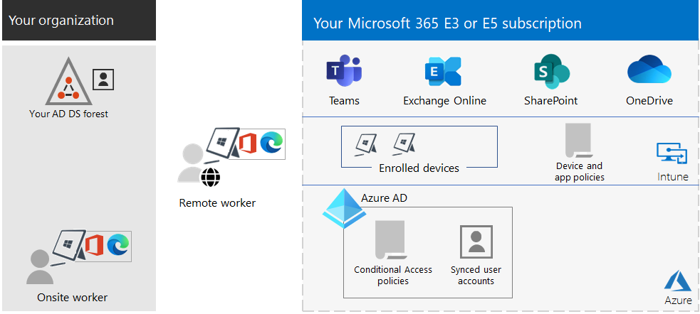

# Overzicht van Microsoft 365 voor ondernemingen

Microsoft 365 voor bedrijven is een complete, intelligente oplossing die iedereen in staat stelt creatief te zijn en veilig samen te werken.

Microsoft 365 voor ondernemingen is ontworpen voor grote organisaties, maar kan ook worden gebruikt voor middelgrote en kleine bedrijven die de meest geavanceerde beveiligings- en productiviteitsmogelijkheden nodig hebben.

## Onderdelen

Microsoft 365 voor bedrijven bestaat uit:

|Services|Beschrijving|
|---|---|
|Lokale apps en cloud-apps en productiviteitsservices|Bevat zowel Microsoft 365-apps voor bedrijven, de nieuwste Office-apps voor uw PC en Mac (zoals Word, Excel, PowerPoint, Outlook en anderen), en een volledige suite Online Services voor e-mail, bestandsopslag en samenwerking, vergaderingen en meer.|
|Windows 10 Enterprise|Voldoet aan de behoeften van grote en middelgrote organisaties. Dit is de meest productieve en veilige versie van Windows voor gebruikers. Voor IT-professionals, biedt ook uitgebreid implementatie-, apparaat- en app-beheer.|
|Beheer van apparaten en geavanceerde beveiligingsservices|Maakt deel uit van Microsoft Intune. Dit is een cloudservice voor Enterprise Mobility Management waarmee uw werknemers productief kunnen zijn tijdens het beveiligen van uw organisatiegegevens.|
|||

## Plannen

Microsoft 365 voor bedrijven is beschikbaar in drie abonnementen.

|Naam van abonnement|Mogelijkheden|
|---|---|
|E3|Toegang tot de kernproducten en -functies van Microsoft 365, om de productiviteit op de werkplek te verbeteren en innovatie te stimuleren.|
|E5|Open de meest recente producten en functies van Microsoft 365. Deze omvatten Defender voor Office 365 en beveiligings- en samenwerkingshulpmiddelen. Dit plan bevat alle mogelijkheden van E3 plus geavanceerde functies voor beveiliging, spraak en gegevensanalyse.|
|F3|Kom in contact met uw eerstelijnsmedewerkers via speciaal ontworpen hulpmiddelen en bronnen waarmee ze hun beste werk kunnen doen.|
|||

Als u Microsoft 365 E3 hebt, kunt u ook de volgende invoegtoepassingen downloaden:

- Bescherming tegen bedreigingen en identiteitsdiefstal
- Gegevensbeveiliging (Compliance)
- [Microsoft 365 E5 Compliance](https://www.microsoft.com/microsoft-365/business/e5-compliance)
- Microsoft 365 E5 Insider Risk

Gebruikers van Microsoft 365 E3 kunnen de volgende invoegtoepassingen gebruiken om te profiteren van een aantal van de aanvullende functies van Microsoft 365 E5.

Zie [functies en-voorzieningen](https://www.microsoft.com/microsoft-365/compare-all-microsoft-365-plans)voor elk abonnement voor meer informatie.

## Overzicht

De [poster voor Microsoft 365 voor ondernemingen](../downloads/Microsoft365Enterprise.pdf) is een centrale locatie die u kunt bekijken:

- De voordelen van Microsoft 365 voor ondernemingen, en hoe apps en services toegevoegde waarde bieden.
- Abonnementen voor Microsoft 365 voor ondernemingen en de onderdelen die ze bevatten.
- De belangrijkste componenten van de moderne Microsoft-werkplek, die Microsoft 365 voor ondernemingen mogelijk maakt.
- De [Microsoft 365 Productiviteitsbibliotheek](https://www.microsoft.com/microsoft-365/success/) en representatieve scenario's voor enkele gemeenschappelijke afdelingen in de organisatie.

U kunt ook [een kopie van de poster](https://github.com/MicrosoftDocs/microsoft-365-docs/raw/public/microsoft-365/downloads/Microsoft365Enterprise.pdf)downloaden.

## Uw hele organisatie overzetten

Voor een beter beeld over het migreren naar producten en services in Microsoft 365 voor ondernemingen, zie de [overgangsposter](https://download.microsoft.com/download/2/c/7/2c7bcc04-aae3-4604-9707-1ffff66b9851/transition-org-to-m365.pdf).

Deze poster van twee pagina‘s is een snelle manier om de bestaande infrastructuur te inventariseren. Het helpt u om hulp te vinden en over te stappen naar het corresponderende product of dienst in Microsoft 365 voor ondernemingen. De poster bevat Windows- en Office-producten en andere infrastructuur- en beveiligingselementen, zoals apparaat- en identiteitsbeheer, informatiebeveiliging en beveiliging tegen bedreigingen.

## Beëindiging ondersteuning voor Windows 7 en Office 2010-clients en -servers

[Windows 7](https://aka.ms/win7upgrade) heeft het einde van de ondersteuning bereikt op **14 januari 2020**.

Voor deze producten wordt de ondersteuning beëindigd op **13 oktober 2020**:

- [Office 2010](/DeployOffice/office-2010-end-support-roadmap)
- [Exchange Server 2010](exchange-2010-end-of-support.md)

[SharePoint Server 2010](upgrade-from-sharepoint-2010.md) bereikt het einde van ondersteuning op **13 april 2021**.

Voor een visueel overzicht van de opties voor het upgraden, migreren en overstappen naar de cloud voor deze producten, raadpleegt u de [poster met de einddatums voor ondersteuning](../downloads/Office2010Windows7EndOfSupport.pdf).

Deze poster van één pagina is een snelle manier om een beeld te krijgen van de verschillende trajecten die u kunt volgen om te voorkomen dat er geen ondersteuning meer wordt geboden voor client- en serverproducten van Windows 7 en voor Office 2010. De geadviseerde trajecten en ondersteuning in Microsoft 365 Enterprise zijn gemarkeerd.

U kunt [deze poster ook downloaden](https://github.com/MicrosoftDocs/microsoft-365-docs/raw/public/microsoft-365/downloads/Office2010Windows7EndOfSupport.pdf) en afdrukken in het formaat Letter, Legal of Tabloid (11 x 17).

## Plannen en implementeren

Er zijn drie manieren om producten, functies en onderdelen van Microsoft 365 voor ondernemingen te plannen en te implementeren:

- In samenwerking met FastTrack

   Met FastTrack kunnen Microsoft-technici u op uw eigen tempo laten overstappen naar de Cloud. Zie [FastTrack voor Microsoft 365](https://fasttrack.microsoft.com/microsoft365).

- Met de hulp van Microsoft Consulting Services of een [Microsoft-partner](https://partner.microsoft.com/)

   Consultants kunnen uw huidige infrastructuur analyseren en u helpen bij het ontwikkelen van een plan om alle software en services van Microsoft 365 voor ondernemingen te gaan gebruiken.

- Doe het zelf

   Begin met de [Netwerkroutekaart](networking-roadmap-microsoft-365.md) om uw bestaande infrastructuur en productiviteitsbelastingen op te bouwen of te verifiëren.

Bekijk als voorbeeld hoe de [Contoso Corporation](contoso-overview.md), een fictieve maar representatieve multinational, Microsoft 365-apps voor ondernemingen heeft geïmplementeerd.

## Meer Microsoft 365-producten

- [Microsoft 365 Business Premium](../business/index.yml)

  Breng de allerbeste productiviteits- en samenwerkingsmogelijkheden samen met apparaatbeheer- en beveiligingsoplossingen om bedrijfsgegevens voor kleine en middelgrote bedrijven te beschermen.

- [Microsoft 365 Education](/education)

  Ontworpen voor docenten voor meer creativiteit, het bevorderen van teamwork en het bieden van een eenvoudige en veilige ervaring in één betaalbare oplossing die is ontwikkeld voor het onderwijs.

- [Microsoft 365 Government](https://www.microsoft.com/microsoft-365/government)

  Biedt ambtenaren van de Verenigde Staten een veilige samenwerking.

## Het beste in combinatie met de Surface en de Edge-browser

Optimaliseer de geïntegreerde en veilige productiviteit van de gebruiker met de combinatie van Microsoft 365 voor ondernemingen, Microsoft Surface-apparaten en de Microsoft Edge-browser. Deze integratie van producten biedt:

- Een algemene beveiligingsinfrastructuur voor identiteiten en aanmeldingen.
- Geïntegreerde lokale en cloud-apps voor zoeken, samenwerking, productiviteit en compliance.
- Uitgebreide en geïntegreerde beveiliging voor hardware, browsers, lokale apps en cloud-apps.
- Een algemene infrastructuur voor IT-beheer van installaties en updates.

Hier is een voorbeeld voor een onderneming.

Voor meer informatie en een configuratievoorbeeld voor het MKB en onderwijsinstellingen downloadt u de poster [Best together](https://download.microsoft.com/download/2/8/d/28db0cf9-2f5a-4f63-91e2-46ff5c4d3baf/microsoft-best-together-poster.pdf).

## Training voor Microsoft 365

Om meer te weten te komen over Microsoft 365 en toe te werken naar een Microsoft 365-certificering, kunt u beginnen met [Microsoft 365 Certified: Fundamentals](/learn/paths/m365-fundamentals/).

## Zie ook

[Microsoft 365 voor bedrijven productpagina](https://www.microsoft.com/microsoft-365/enterprise)