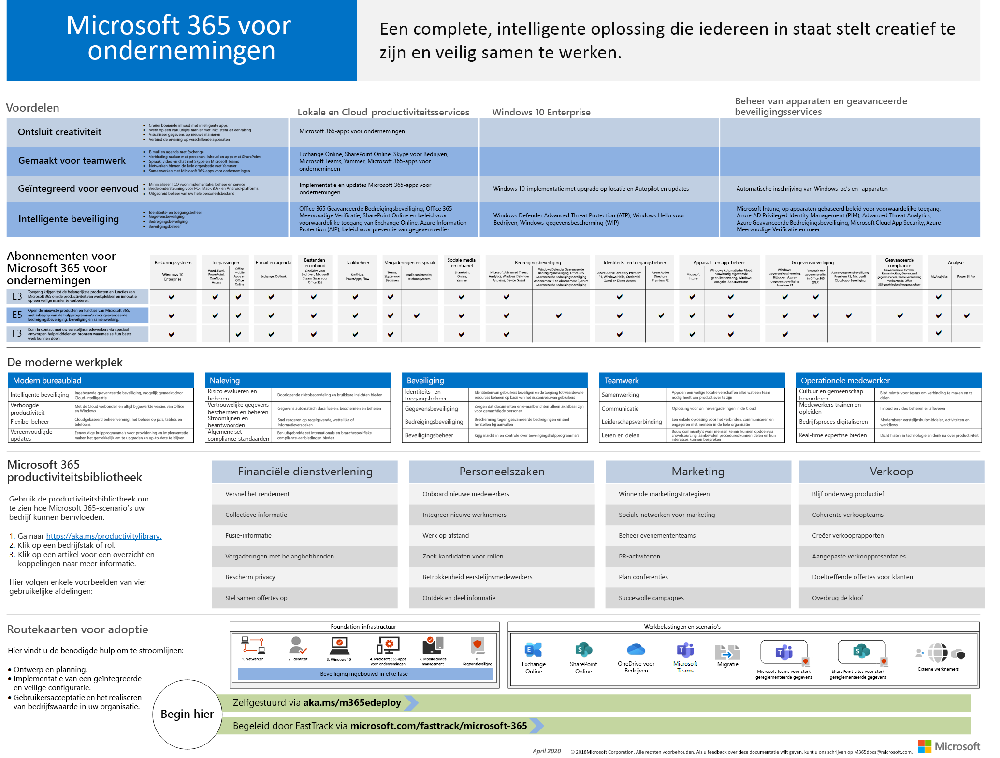
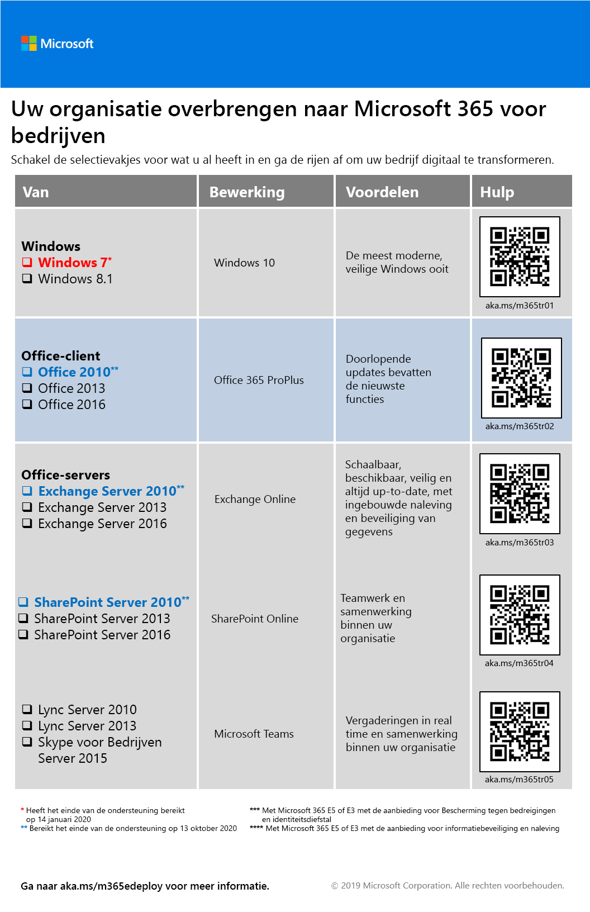
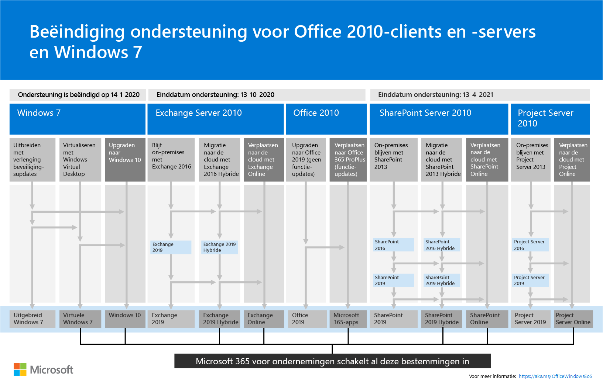

# Overzicht van Microsoft 365 voor ondernemingen

Microsoft 365 for Enterprise is een complete, intelligente oplossing die iedereen in staat stelt om creatief te zijn en veilig samen te werken. 

Hoewel ontworpen voor grote organisaties, kan Microsoft 365 voor ondernemingen ook worden gebruikt voor middelgrote en kleine bedrijven die de meest geavanceerde beveiligings- en productiviteitsmogelijkheden nodig hebben. 

## Onderdelen

Microsoft 365 voor ondernemingen bestaat uit:

|||
|:-------|:-----|
| Lokale en cloudgebaseerde apps en productiviteitsservices | Bevat zowel Microsoft 365 Apps voor bedrijven, de nieuwste Office-apps voor uw pc en Mac (zoals Word, Excel, PowerPoint, Outlook en anderen) en een volledige reeks onlineservices voor e-mail, bestandsopslag en samenwerking, vergaderingen en meer. |
| Windows 10 Enterprise | Voldoet aan de behoeften van zowel grote als middelgrote organisaties en biedt gebruikers de meest productieve en veilige versie van Windows- en IT-professionals met uitgebreide implementatie, apparaat- en app-beheer. |
| Apparaatbeheer en geavanceerde beveiligingsservices | Inclusief Microsoft Intune, een emm-service (Enterprise Mobility Management) in de cloud waarmee uw personeel productief kan zijn en tegelijkertijd uw bedrijfsgegevens beschermd houdt. |
|||

## Plannen

Microsoft 365 voor ondernemingen is beschikbaar in drie abonnementen.

|||
|:-------|:-----|
| E3 | Krijg toegang tot kernproducten en functies binnen Microsoft 365 om de productiviteit op de werkplek te verbeteren en innovatie te stimuleren, veilig. |
| E5 | Krijg toegang tot de nieuwste producten en functies binnen Microsoft 365, inclusief geavanceerde hulpprogramma's voor bescherming van bedreigingen, beveiliging en samenwerking.. Bevat alle mogelijkheden van E3 plus geavanceerde tools voor beveiliging, spraak en gegevensanalyse. |
| F3 | Maak contact met uw Firstline Workers via speciaal gebouwde tools en resources waarmee ze hun beste werk kunnen doen. |
|||

Als u Microsoft 365 E3 hebt, u deze [aanbiedingen](https://www.microsoft.com/microsoft-365/blog/2019/01/02/introducing-new-advanced-security-and-compliance-offerings-for-microsoft-365/)ook krijgen:

- Identiteits- & bescherming tegen bedreigingen
- Informatiebescherming & naleving

Deze aanbiedingen bevatten extra functies die zijn opgenomen in Microsoft 365 E5.

Zie [Functies en mogelijkheden voor elk plan voor](https://www.microsoft.com/microsoft-365/compare-all-microsoft-365-plans)meer informatie.

## Krijg het grote plaatje

De [Microsoft 365 voor bedrijfsposter](../media/m365-poster/Microsoft365Enterprise.pdf) is een centrale locatie die u bekijken:

- De voordelen van Microsoft 365 voor bedrijven en hoe apps en services in kaart worden brengen met de waardepijlers
- Microsoft 365 voor bedrijfsplannen en welke onderdelen ze bevatten 
- De belangrijkste onderdelen van de Moderne Werkplek, die Microsoft 365 voor ondernemingen mogelijk maakt
- De [Microsoft 365 Productivity Library](https://www.microsoft.com/microsoft-365/success/) en representatieve scenario's voor sommige algemene organisatieafdelingen
- De goedkeuringsroadmap die de Microsoft 365 for enterprise [Deployment Guide](deploy-microsoft-365-enterprise.md) belicht

Als u een kopie van de poster wilt downloaden, klikt u [hier](https://github.com/MicrosoftDocs/microsoft-365-docs/raw/public/microsoft-365/media/m365-poster/Microsoft365Enterprise.pdf).

## Uw hele organisatie overzetten

Zie de [overgangsposter](../media/deploy-microsoft-365-enterprise/transition-org-to-m365.pdf)om een beter beeld te krijgen van hoe u uw hele organisatie verplaatsen naar de producten en services in Microsoft 365 voor bedrijven.

Deze poster van twee pagina's is een snelle manier om de bestaande infrastructuur te inventariseren en de informatiebronnen te vinden die u kunnen helpen bij het overstappen naar het bijbehorende product of de bijbehorende service in Microsoft 365 voor ondernemingen. De poster bevat Windows- en Office-producten en andere infrastructuur- en beveiligingselementen, zoals apparaat- en identiteitsbeheer, informatiebeveiliging en beveiliging tegen bedreigingen.

U kunt ook [deze poster downloaden](https://github.com/MicrosoftDocs/microsoft-365-docs/raw/public/microsoft-365/media/deploy-microsoft-365-enterprise/transition-org-to-m365.pdf) en afdrukken in het formaat Letter, Legal of Tabloid (11 x 17).

## Einde ondersteuning voor Windows 7- en Office 2010-clients en -servers voorkomen

[Windows 7](https://aka.ms/win7upgrade) heeft op **14 januari 2020**het einde van de ondersteuning bereikt.

Op **13 oktober 2020**komen de volgende producten tot het einde van de steun:

- [Office 2010](https://docs.microsoft.com/DeployOffice/office-2010-end-support-roadmap)
- [Exchange Server 2010](https://docs.microsoft.com/office365/enterprise/exchange-2010-end-of-support)

[SharePoint Server 2010](https://docs.microsoft.com/office365/enterprise/upgrade-from-sharepoint-2010) bereikt het einde van de ondersteuning op **13 april 2021**.

Voor een visueel overzicht van de opties voor het upgraden, migreren en overstappen naar de cloud voor deze producten, raadpleegt u de [poster met de einddatums voor ondersteuning](../media/migration-microsoft-365-enterprise-workload/Office2010Windows7EndOfSupport.pdf).

Deze poster van één pagina is een snelle manier om inzicht te krijgen in de verschillende paden die u volgen om te voorkomen dat Windows 7- en Office 2010-client- en serverproducten het einde van de ondersteuning bereiken, met voorkeurspaden en ondersteuning in Microsoft 365 voor enterprise gemarkeerd.

U kunt ook [deze poster downloaden](https://github.com/MicrosoftDocs/microsoft-365-docs/raw/public/microsoft-365/media/migration-microsoft-365-enterprise-workload/Office2010Windows7EndOfSupport.pdf) en afdrukken in het formaat Letter, Legal of Tabloid (11 x 17).

## Implementeren

Er zijn drie manieren om de producten, functies en onderdelen van Microsoft 365 voor bedrijven te implementeren:

1. In samenwerking met FastTrack
  
   Met FastTrack helpen Microsoft-technici u om in uw eigen tempo naar de cloud te gaan. Zie [FastTrack voor Microsoft 365](https://fasttrack.microsoft.com/microsoft365).
  
2. Met behulp van Microsoft Consulting Services of een [Microsoft-partner.](https://partner.microsoft.com/)

   Consultants kunnen uw huidige infrastructuur analyseren en u helpen bij het ontwikkelen van een plan om alle software en services van Microsoft 365 voor bedrijven op te nemen.

3. Doe het zelf

   De [implementatiehandleiding voor Microsoft 365 voor ondernemingen](deploy-microsoft-365-enterprise.md) neemt u stap voor stap mee door de infrastructuur- en productiviteitsworkloads uit te bouwen. 

Zie voor meer implementatiegegevens hoe:

- [Klanten](deploy-microsoft-365-enterprise.md#how-customers-use-microsoft-365-for-enterprise) gebruiken Microsoft 365 voor bedrijven.
- [Microsoft](deploy-microsoft-365-enterprise.md#how-microsoft-uses-microsoft-365-for-enterprise) gebruikt Microsoft 365 voor ondernemingen.
- [De Contoso Corporation](contoso-overview.md), een fictieve maar representatieve multinationale organisatie, heeft Microsoft 365 ingezet voor ondernemingen.

## Aanvullende Microsoft 365-oplossingen

- [Microsoft 365 Business Premium](https://docs.microsoft.com/microsoft-365/business/)
 
  Breng de beste productiviteits- en samenwerkingsmogelijkheden van Office 365 samen met apparaatbeheer- en beveiligingsoplossingen om bedrijfsgegevens voor kleine en middelgrote bedrijven (MKB) te beveiligen.

- [Microsoft 365 Education](https://docs.microsoft.com/education)
 
  Geef docenten de mogelijkheid om creativiteit te ontsluiten, teamwork te promoten en een eenvoudige en veilige ervaring te bieden in één betaalbare oplossing die is gebouwd voor onderwijs.

- [Microsoft 365-regering](https://www.microsoft.com/microsoft-365/government)
 
  Geef werknemers in de Amerikaanse publieke sector de mogelijkheid om veilig samen te werken.

## Microsoft 365-training

|||
|:-------|:-----|
| Laat je trainen en werk toe naar een Microsoft 365-certificering.   Begin met [Microsoft 365 Fundamentals](https://docs.microsoft.com/learn/paths/m365-fundamentals/).
|||

## Volgende stap

Als u de implementatie zelf doet, start u uw [Microsoft 365 voor de implementatiereis van de onderneming.](deploy-microsoft-365-enterprise.md)

## Zie ook

[Microsoft 365 voor bedrijfsproductpagina](https://www.microsoft.com/microsoft-365/enterprise)
