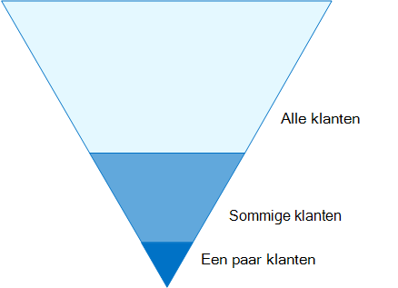

# Configuratie van identiteiten en apparaattoegang

De moderne beveiligings verbinding van uw organisatie breidt nu buiten het netwerk tot het gebruik van gebruikers van Cloud apps vanaf elke locatie met een groot aantal apparaten. Uw beveiligingsinfrastructuur moet bepalen of een bepaalde toegangsaanvraag moet worden toegewezen en onder welke voorwaarden. 

Deze bepaling moet gebaseerd zijn op de aanmelding van het gebruikersaccount, het apparaat dat wordt gebruikt, de apps die de gebruiker probeert te openen, de locatie van waaraf de toegangsaanvraag wordt ingediend en een beoordeling van het risico van de aanvraag. Met deze functie kunt u ervoor zorgen dat alleen goedgekeurde gebruikers en apparaten toegang hebben tot uw cruciale bronnen.

In deze reeks artikelen wordt beschreven welke configuraties van de vereisten voor identiteiten en toegang hebben tot uw apparaten en een set van Azure Active Directory (Azure AD) voorwaardelijke toegang, Microsoft intune en andere beleidsregels om de toegang tot Microsoft 365 te beveiligen voor Office 365-apps en-services, andere SaaS-Services en on-premises toepassingen die zijn gepubliceerd met Azure AD Application proxy.

De instellingen en het beleid voor identiteit en toegang worden in drie lagen geadviseerd: basisbescherming, gevoelige bescherming en bescherming voor omgevingen met zeer gereguleerde of geclassificeerde gegevens. Deze lagen en de bijbehorende configuraties zorgen voor een consistente bescherming van uw gegevens, identiteiten en apparaten.

Deze mogelijkheden en de bijbehorende aanbevelingen:

- Wordt ondersteund in Microsoft 365 E3 en Microsoft 365 E5.
- Worden afgestemd op de [Microsoft Secure Score](https://docs.microsoft.com/microsoft-365/security/mtp/microsoft-secure-score) en de [Score Score in azure AD](https://docs.microsoft.com/azure/active-directory/fundamentals/identity-secure-score), en zullen deze scores voor uw organisatie toenemen.
- U wordt aangeraden deze [vijf stappen uit te voeren om uw identiteits infrastructuur te beschermen](https://docs.microsoft.com/azure/security/azure-ad-secure-steps).

Als uw organisatie unieke omgevings eisen of complexe vereisten heeft, kunt u deze aanbevelingen als uitgangspunt gebruiken. De meeste organisaties kunnen deze aanbevelingen evenwel implementeren.

>[!Note]
>Microsoft verkoopt ook licenties voor Enterprise Mobility + Security (EMS) voor Office 365-abonnementen. EMS E3 en EMS E5 zijn gelijk aan de mogelijkheden van Microsoft 365 E3 en Microsoft 365 E5. Zie [EMS-abonnementen](https://www.microsoft.com/en-us/microsoft-365/enterprise-mobility-security/compare-plans-and-pricing) voor de details.
>

## Doelgroep

Deze aanbevelingen zijn bedoeld voor Enterprise Architects en IT-professionals die bekend zijn met de productiviteits-en beveiligingsservices van Microsoft 365 Cloud, waaronder Azure AD (Identity), Microsoft intune (Apparaatbeheer) en Azure Information Protection (gegevensbescherming).

### Klant omgeving

De aanbevolen beleidsregels gelden voor Enterprise-organisaties die zowel in de Microsoft-Cloud werken en voor klanten met een hybride identiteits infrastructuur, een on-premises AD DS-forest (Active Directory Domain Services) dat wordt gesynchroniseerd met een Azure AD-Tenant.

Tal van de geboden aanbevelingen zijn afhankelijk van de services die alleen beschikbaar zijn in Microsoft 365 E5, Microsoft 365 E3 met de identiteit & invoegtoepassing Threat Protection, EMS E5 of Azure Premium P2.

Voor organisaties die deze licenties niet hebben, adviseert Microsoft minimaal [beveiligingsstandaarden](https://docs.microsoft.com/azure/active-directory/fundamentals/concept-fundamentals-security-defaults)te implementeren, die deel uitmaken van alle microsoft 365-abonnementen. 

### Voorbehoud

Uw organisatie kan onderworpen zijn aan wettelijke of andere nalevingsvereisten, waaronder specifieke aanbevelingen waarbij u beleidsregels moet toepassen die afwijken van deze aanbevolen configuraties. Deze configuraties bevelen gebruiks besturingselementen voor voor gebruik die niet historisch beschikbaar waren. We raden u aan deze besturingselementen te onderscheiden omdat ze een evenwicht tussen beveiliging en productiviteit aangeven.  

We hebben ons de beste account voor een grote verscheidenheid aan de beschermings vereisten voor de organisatie, maar we kunnen niet op de hoogte worden gesteld van alle mogelijke eisen of voor alle unieke aspecten van uw organisatie.

## Drie niveaus van bescherming

De meeste organisaties hebben specifieke vereisten inzake beveiliging en gegevensbescherming. Deze vereisten hangen af van het sector segment en van functie functies binnen organisaties. Voor uw wettelijke afdeling en beheerders zijn mogelijk extra beveiligings-en informatie beschermingsfuncties nodig voor de e-mail correspondentie die niet is vereist voor andere business units. 

Elke bedrijfstak heeft ook een eigen set gespecialiseerde voorschriften. In plaats van een lijst te maken met alle mogelijke beveiligingsopties of een aanbevelingen per sector segment of functie, zijn er aanbevelingen voor drie verschillende niveaus van beveiliging en bescherming die kunnen worden toegepast op basis van de granulatie van uw behoeften.

- **Basislijn beveiliging**: u wordt aangeraden een minimum standaard te creëren voor het beschermen van gegevens, evenals de identiteiten en apparaten die toegang hebben tot uw gegevens. U kunt deze aanbevelingen volgen om krachtige standaardbeveiliging te bieden die voldoet aan de behoeften van vele organisaties.
- **Gevoelige beveiliging**: sommige klanten hebben een subset van gegevens die op een hoger niveau moeten worden beveiligd, of alle gegevens moeten worden beveiligd op een hoger niveau. U kunt betere beveiliging toepassen op alle of specifieke gegevenssets in uw Microsoft 365-omgeving. U wordt aangeraden identiteiten en apparaten te beschermen die toegang hebben tot gevoelige gegevens met vergelijkbare beveiligingsniveaus.  
- **Zeer gereguleerd**: sommige organisaties hebben mogelijk een kleine hoeveelheid gegevens die in hoge mate is geclassificeerd, dat wil zeggen handelsgeheimen of een gereguleerde gegevens. Microsoft biedt mogelijkheden om organisaties te helpen aan deze vereisten te voldoen, waaronder extra bescherming voor identiteiten en apparaten.

In deze richtlijnen wordt uitgelegd hoe u beveiliging voor identiteiten en apparaten kunt implementeren voor elk van deze beveiligingsniveaus. U kunt deze richtlijnen gebruiken als uitgangspunt voor uw organisatie en de beleidsregels aanpassen zodat ze voldoen aan de specifieke vereisten van uw organisatie.

Het is belangrijk dat u een consistent beveiligingsniveau gebruikt voor uw gegevens, identiteiten en apparaten. Als u bijvoorbeeld deze richtlijnen implementeert, moet u ervoor zorgen dat u uw gegevens beveiligt tegen vergelijkbare niveaus. 

Het model **identiteit en beveiliging voor Microsoft 365** Architecture laat u zien welke mogelijkheden vergelijkbaar zijn.

    [Weergeven als een PDF-bestand](../downloads/MSFT_cloud_architecture_identity&device_protection.pdf) \| [Downloaden als een PDF-bestand](https://github.com/MicrosoftDocs/microsoft-365-docs/raw/public/microsoft-365/downloads/MSFT_cloud_architecture_identity&device_protection.pdf) \| [Downloaden als een Visio](https://github.com/MicrosoftDocs/microsoft-365-docs/raw/public/microsoft-365/downloads/MSFT_cloud_architecture_identity&device_protection.vsdx)  

Zie ook de oplossing [gegevensbescherming implementeren voor data privacy Regulation](../solutions/information-protection-deploy.md) voor informatie over de bescherming van informatie die is opgeslagen in microsoft 365.

## Beveiliging en productiviteits commerciële commerciële afschrijving

Voor de implementatie van een beveiligingsstrategie zijn commerciële zaken tussen beveiliging en productiviteit vereist. Het is handig om te bepalen hoe elke beslissing van invloed is op het saldo van beveiliging, functionaliteit en gebruiksgemak.

De verstrekte aanbevelingen zijn gebaseerd op de volgende beginselen:

- Ken uw gebruikers en flexibiliteit toe aan de vereisten voor beveiliging en functionele.
- Pas een beveiligingsbeleid toe op tijd en zorg ervoor dat het zinvol is.

## Services en concepten voor de bescherming van identiteit en beveiliging van apparaten

Microsoft 365 voor Enterprise is ontworpen voor grote organisaties zodat iedereen creatieve advertenties kan maken en veilig kan samenwerken.

In deze sectie wordt een overzicht gegeven van de services en functies van Microsoft 365 die belangrijk zijn voor identiteits-en Apparaattoegang.

### Azure AD

Azure AD biedt een volledige suite met mogelijkheden voor identiteitsbeheer. We raden u aan gebruik te maken van deze mogelijkheden voor een veilige toegang.

| Functie | Beschrijving | Licenties |
|:-------|:-----|:-------|
| [Multi-factor Authentication (MFA)](/azure/active-directory/authentication/concept-mfa-howitworks) | Voor MFA moeten gebruikers twee soorten verificatie bieden, zoals een gebruikerswachtwoord plus een melding van de Microsoft Authenticator-app of een telefoongesprek. MFA reduceert sterk het risico dat gestolen referenties kunnen worden gebruikt om toegang te krijgen tot uw omgeving. Microsoft 365 maakt gebruik van de Azure multi-factor Authentication Service voor op MFA gebaseerde aanmeldinformatie. | Microsoft 365 E3 of E5 |
| [Voorwaardelijke toegang](/azure/active-directory/conditional-access/overview) | Azure AD evalueert de voorwaarden van de gebruikersaanmelding en gebruikt voorwaardelijke toegangsbeleid om te bepalen welke toegang is toegestaan. In deze richtlijnen wordt uitgelegd hoe u een voorwaardelijk toegangsbeleid moet maken om de naleving van een apparaat te vereisen voor toegang tot gevoelige gegevens. Hierdoor wordt het risico voor hackers met hun eigen apparaat en gestolen referenties sterk beperkt. De bescherming beschermt ook gevoelige informatie op de apparaten, aangezien de apparaten moeten voldoen aan specifieke vereisten voor de gezondheid en beveiliging. | Microsoft 365 E3 of E5 |
| [Azure AD-groepen](/azure/active-directory/fundamentals/active-directory-manage-groups) | Beleidsregels voor voorwaardelijke toegang en Apparaatbeheer met intune en zelfs machtigingen voor bestanden en sites in uw organisatie afhankelijk van de toewijzing aan gebruikersaccounts of Azure AD-groepen. We raden u aan om Azure AD-groepen te maken die overeenkomen met het niveau van bescherming dat u implementeert. Uw personeelsleden hebben bijvoorbeeld waarschijnlijk een hogere waarde voor de doelwit van hackers. Daarom is het verstandig om de gebruikersaccounts van deze werknemers toe te voegen aan een Azure AD-groep en deze groep toe te wijzen aan het beleid voor voorwaardelijke toegang en andere beleidsregels die een hoger beschermingsniveau voor Access afdwingen. | Microsoft 365 E3 of E5 |
| [Apparaatregistratie](/azure/active-directory/devices/overview) | U registreert een apparaat in azure AD om een identiteit voor het apparaat te maken. Deze identiteit wordt gebruikt om het apparaat te verifiëren wanneer een gebruiker zich aanmeldt en voorwaardelijke Access-beleidsregels toe te passen waarvoor domein-of compatibele Pc's zijn vereist. Voor deze richtlijnen gebruiken we de registratie van het apparaat voor het automatisch registreren van Windows-computers die lid zijn van het domein. Registratie van apparaten is een vereiste voor het beheren van apparaten met intune. | Microsoft 365 E3 of E5 |
| [Azure AD Identity Protection](/azure/active-directory/identity-protection/overview) | Hiermee kunt u mogelijke problemen detecteren die van invloed zijn op de identiteiten van uw organisatie en de geautomatiseerde herstel beleidsregels configureren voor slecht, gemiddeld en intensief aanmelden van Risico's en gebruikers risico. Deze richtlijnen zijn van toepassing op het toepassen van regels voor voorwaardelijke toegang voor verificatie met meerdere factoren. Deze richtlijnen bestaan ook uit een beleid voor voorwaardelijke toegang waarvoor gebruikers hun wachtwoord moeten wijzigen als er High Risk-activiteiten worden gedetecteerd voor hun account. | Microsoft 365 E5, Microsoft 365 E3 met de identiteit & invoegtoepassing Threat Protection, EMS E5 of Azure Premium P2 |
| [Selfservice voor wachtwoordherstel (SSPR)](/azure/active-directory/authentication/concept-sspr-howitworks) | Laat uw gebruikers hun wachtwoord veilig opnieuw instellen en zonder dat de beheerder van de helpdesk de mogelijkheid biedt te zijn om meerdere verificatiemethoden voor de beheerder te verifiëren. | Microsoft 365 E3 of E5 |
| [Azure AD-wachtwoordbeveiliging](https://docs.microsoft.com/azure/active-directory/authentication/concept-password-ban-bad) | Bekende zwakke wachtwoorden en hun varianten detecteren en blokkeren en extra zwakke termen die specifiek zijn voor uw organisatie. Standaardlijsten met globaal geblokkeerde wachtwoorden worden automatisch toegepast op alle gebruikers in een Azure AD-Tenant. U kunt aanvullende vermeldingen definiëren in een aangepaste lijst met geblokkeerde wachtwoorden. Wanneer gebruikers hun wachtwoord wijzigen of opnieuw instellen, zijn de geblokkeerde wachtwoorden lijsten ingeschakeld om het gebruik van sterke wachtwoorden af te dwingen. |  Microsoft 365 E3 of E5 |
||||

### Microsoft Intune

[Intune](https://docs.microsoft.com/intune/introduction-intune) is de service voor het beheer van mobiele apparaten met de cloud van Microsoft. Met deze richtlijnen wordt het Apparaatbeheer voor Windows-Pc's met intune aanbevolen en worden de configuraties voor nalevingsbeleid aanbevolen. InTune Hiermee bepaalt u of de apparaten compatibel zijn en worden deze gegevens naar Azure AD verzonden voor gebruik wanneer u voorwaardelijke toegangsbeleid toepast.

#### InTune-app-beveiliging

Met behulp van [intune-app-beveiligings](https://docs.microsoft.com/intune/app-protection-policy) beleid kunt u de gegevens van uw organisatie beschermen in mobiele apps, met of zonder dat u apparaten registreert bij beheer. InTune helpt de informatie te beschermen en te zorgen dat uw werknemers nog steeds productief zijn en gegevensverlies kunnen voorkomen. Als u beleidsregels op het niveau van de app implementeert, kunt u de toegang tot bedrijfsbronnen beperken en de gegevens in het beheer van uw IT-afdeling bewaren.

In deze richtlijnen wordt uitgelegd hoe u aanbevolen beleidsregels maakt om het gebruik van goedgekeurde apps af te dwingen en om te bepalen hoe deze apps kunnen worden gebruikt met uw zakelijke gegevens.

### Microsoft 365

In deze richtlijnen wordt uitgelegd hoe u een set beleidsregels implementeert ter bescherming van de toegang tot Microsoft 365-cloudservices, waaronder Microsoft teams, Exchange Online, SharePoint Online en OneDrive voor bedrijven. U wordt ook aangeraden om dit beleid te implementeren, maar u kunt ook het beschermingsniveau voor uw Tenant verhogen met behulp van de volgende bronnen:

- [Uw tenant configureren voor betere beveiliging](../security/office-365-security/tenant-wide-setup-for-increased-security.md)

  Aanbevelingen die van toepassing zijn op de basisbeveiliging van de Tenant.

- [Beveiligingsplan: de belangrijkste punten voor de eerste 30 dagen, 90 dagen en langer](../security/office-365-security/security-roadmap.md)

  Aanbevelingen voor logboekregistratie, Data Governance, beheerderstoegang en beveiliging van bedreigingen.

### Windows 10- en Microsoft 365-apps voor ondernemingen

Windows 10 met Microsoft 365-apps for Enterprise is de aanbevolen clientomgeving voor Pc's. U wordt aangeraden Windows 10 te maken omdat Azure zodanig is ontworpen dat dit de soepelste ervaring kan bieden voor zowel on-premises als Azure AD. Windows 10 omvat ook geavanceerde beveiligingsfuncties die kunnen worden beheerd via intune. Microsoft 365-apps voor Enterprise omvat de nieuwste versies van Office-toepassingen. Dit maakt gebruik van moderne verificatie, wat veiliger is en een vereiste voor voorwaardelijke toegang. Deze apps zijn ook uitgebreid met uitgebreide beveiligings-en compliance-tools.

## De mogelijkheden van deze functies op de drie niveaus van bescherming toepassen

De volgende tabel bevat een overzicht van de aanbevelingen voor het gebruik van deze mogelijkheden over de drie niveaus van bescherming.

|Beveiligingsmechanisme|Basislijn|Gevoelig|Sterk gereglementeerd|
|:-------------------|:-------|:--------|:---------------|
|**MFA afdwingen**|Bij normaal of hoger risico voor aanmelding|Met een laag of hoger aanmeldings risico|Voor alle nieuwe sessies|
|**Wachtwoordwijziging afdwingen**|Voor gebruikers met een hoog risico|Voor gebruikers met een hoog risico|Voor gebruikers met een hoog risico|
|**InTune-toepassingsbeveiliging afdwingen**|Ja|Ja|Ja|
|**InTune-inschrijving afdwingen voor een apparaat met een eigen organisatie**|U moet beschikken over een compatibele of domeincomputer, maar wel uw eigen apparaten (BYOD)-telefoons en-tablets toe te passen.|Een compatibel of domein bijgevoegd apparaat vereisen|Een compatibel of domein bijgevoegd apparaat vereisen|

## Eigendom van het apparaat

De bovenstaande tabel weerspiegelt de trend voor veel organisaties voor de ondersteuning van een combinatie van apparaten met de eigen organisatie, alsook persoonlijke of BYODs om mobiele productiviteit in het personeel in te schakelen. Beleidsregels voor het intune-app-beveiliging zorgen ervoor dat e-mailberichten in exfiltrating worden beveiligd vanuit de mobiele Outlook-app en andere Office Mobile-apps, zowel voor organisatie-als BYODs.  

U wordt aangeraden apparaten te beheren via intune of domein, zodat u extra bescherming en beheer kunt toepassen. Afhankelijk van de beschikbaarheid van gegevens kan uw organisatie er ook voor kiezen om BYODs niet toe te staan voor specifieke gebruikersnamen of bepaalde apps.

## Stappen voor het configureren van identiteit en Apparaattoegang

1. Configureer vereisten voor de identiteit en de instellingen hiervan.
2. Configureer de algemene identiteit en toegang tot regels voor voorwaardelijke toegang.
3. Beleidsregels voor voorwaardelijke toegang configureren voor gast en externe gebruikers.
4. Beleidsregels voor voorwaardelijke toegang configureren voor Microsoft 365 Cloud-apps zoals Microsoft teams, Exchange Online en SharePoint.

## Volgende stap

[Vereisten voor het implementeren van identiteits-en Apparaattoegang](identity-access-prerequisites.md)
