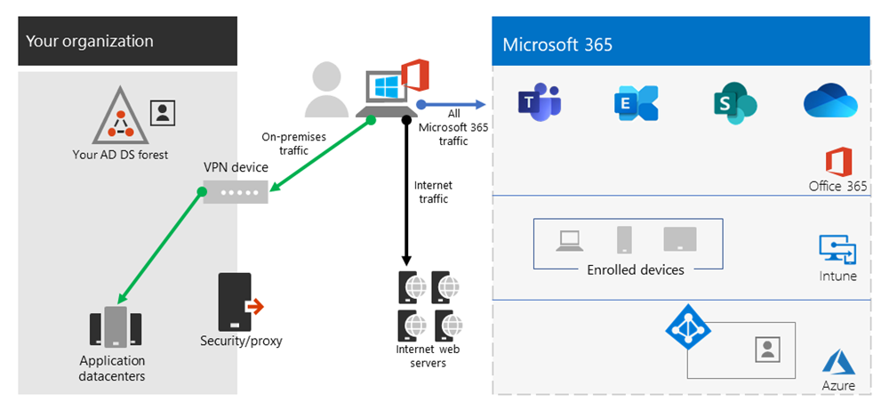

# <a name="implementing-vpn-split-tunneling-for-office-365"></a><span data-ttu-id="1ec67-103">Gesplitste VPN-tunneling implementeren voor Office 365</span><span class="sxs-lookup"><span data-stu-id="1ec67-103">Implementing VPN split tunneling for Office 365</span></span>

>[!NOTE]
><span data-ttu-id="1ec67-104">Dit onderwerp maakt deel uit van een reeks onderwerpen waarmee u Office 365 optimaliseren voor externe gebruikers.</span><span class="sxs-lookup"><span data-stu-id="1ec67-104">This topic is part of a set of topics that address Office 365 optimization for remote users.</span></span>
>- <span data-ttu-id="1ec67-105">Voor een overzicht van het gebruik van gesplitste tunneling via VPN voor het optimaliseren van Office 365-connectiviteit voor externe gebruikers raadpleegt u [overzicht: VPN-splitsings tunneling voor Office 365](microsoft-365-vpn-split-tunnel.md).</span><span class="sxs-lookup"><span data-stu-id="1ec67-105">For an overview of using VPN split tunneling to optimize Office 365 connectivity for remote users, see [Overview: VPN split tunneling for Office 365](microsoft-365-vpn-split-tunnel.md).</span></span>
>- <span data-ttu-id="1ec67-106">Voor informatie over het optimaliseren van de prestaties van Office 365 wereldwijd voor gebruikers in China, raadpleegt u [office 365 optimaliseren voor gebruikers van China](microsoft-365-networking-china.md).</span><span class="sxs-lookup"><span data-stu-id="1ec67-106">For information about optimizing Office 365 worldwide tenant performance for users in China, see [Office 365 performance optimization for China users](microsoft-365-networking-china.md).</span></span>

<span data-ttu-id="1ec67-107">Gedurende een groot aantal jaren hebben bedrijven een VPN gebruikt voor de ondersteuning van externe ervaringen voor hun gebruikers.</span><span class="sxs-lookup"><span data-stu-id="1ec67-107">For many years enterprises have been using VPNs to support remote experiences for their users.</span></span> <span data-ttu-id="1ec67-108">Hoewel kern lasten on-premises bleven, was een VPN van de externe client die via een datacenter op het bedrijfsnetwerk is gerouteerd de primaire methode voor externe gebruikers om toegang te krijgen tot de bedrijfsbronnen.</span><span class="sxs-lookup"><span data-stu-id="1ec67-108">Whilst core workloads remained on-premises, a VPN from the remote client routed through a datacenter on the corporate network was the primary method for remote users to access corporate resources.</span></span> <span data-ttu-id="1ec67-109">Om deze verbindingen te beschermen, bouwen ondernemingen lagen van netwerkbeveiligings oplossingen langs de VPN-paden.</span><span class="sxs-lookup"><span data-stu-id="1ec67-109">To safeguard these connections, enterprises build layers of network security solutions along the VPN paths.</span></span> <span data-ttu-id="1ec67-110">Dit is de bescherming van de interne infrastructuur en het veilig surfen van externe websites door verkeer om te leiden naar het VPN en vervolgens via het on-premises Internet perimeter.</span><span class="sxs-lookup"><span data-stu-id="1ec67-110">This was done to protect internal infrastructure as well as to safeguard mobile browsing of external web sites by rerouting traffic into the VPN and then out through the on-premises Internet perimeter.</span></span> <span data-ttu-id="1ec67-111">Vpn's, netwerkverkeer en bijbehorende beveiligingsinfrastructuur waren vaak gebouwd en geschaald voor een bepaald volume van het verkeer, meestal met het merendeel van de verbinding vanaf het bedrijfsnetwerk, en het grootste deel van de verbinding binnen de interne netwerk grenzen.</span><span class="sxs-lookup"><span data-stu-id="1ec67-111">VPNs, network perimeters, and associated security infrastructure were often purpose built and scaled for a defined volume of traffic, typically with the majority of connectivity being initiated from within the corporate network, and most of it staying within the internal network boundaries.</span></span>

<span data-ttu-id="1ec67-112">Voor zeer enige tijd worden VPN-modellen waarbij alle verbindingen van het externe gebruikersapparaat worden gerouteerd naar het on-premises netwerk (bekend als **geforceerde tunneling**), veel duurzaam, aangezien de gelijktijdig gebruikte schaal van de VPN-verbinding laag was.</span><span class="sxs-lookup"><span data-stu-id="1ec67-112">For quite some time, VPN models where all connections from the remote user device are routed back into the on-premises network (known as **forced tunneling**) were largely sustainable as long as the concurrent scale of remote users was modest and the traffic volumes traversing VPN were low.</span></span>  <span data-ttu-id="1ec67-113">Sommige klanten blijven gebruikmaken van VPN-geforceerde tunneling als status-quo, zelfs nadat hun toepassingen binnen het bedrijfsnetwerk zijn verplaatst naar openbare SaaS-wolken, Office 365 in een prime voorbeeld.</span><span class="sxs-lookup"><span data-stu-id="1ec67-113">Some customers continued to use VPN force tunneling as the status quo even after their applications moved from inside the corporate perimeter to public SaaS clouds, Office 365 being a prime example.</span></span>

<span data-ttu-id="1ec67-114">Het gebruik van geforceerde verbonden Vpn's voor het maken van een verbinding met de Distributed-en prestatie gevoelige Cloud toepassingen is zeer geschikt, maar de negatieve gevolgen van die van sommige ondernemingen zijn voor het behoud van de status quo van een beveiligings perspectief.</span><span class="sxs-lookup"><span data-stu-id="1ec67-114">The use of forced tunneled VPNs for connecting to distributed and performance sensitive cloud applications is extremely suboptimal, but the negative impact of that may have been accepted by some enterprises so as to maintain the status quo from a security perspective.</span></span> <span data-ttu-id="1ec67-115">Hieronder ziet u een voorbeeld van een diagram van dit scenario:</span><span class="sxs-lookup"><span data-stu-id="1ec67-115">An example diagram of this scenario can be seen below:</span></span>


<span data-ttu-id="1ec67-117">Dit probleem is opgetreden gedurende een groot aantal jaren, met veel klanten die een noemenswaardige ploeg van de netwerk verkeerspatronen rapporteren.</span><span class="sxs-lookup"><span data-stu-id="1ec67-117">This problem has been growing for a number of years, with many customers reporting a significant shift of network traffic patterns.</span></span> <span data-ttu-id="1ec67-118">Verkeer dat wordt gebruikt om on-premises te blijven, maakt nu verbinding met externe Cloud eindpunten.</span><span class="sxs-lookup"><span data-stu-id="1ec67-118">Traffic that used to stay on premises now connects to external cloud endpoints.</span></span> <span data-ttu-id="1ec67-119">Een groot aantal Microsoft-klanten rapporten is, rondom 80% van het netwerkverkeer tot een aantal interne bronnen (aangeduid met de stippellijn in het bovenstaande diagram).</span><span class="sxs-lookup"><span data-stu-id="1ec67-119">Numerous Microsoft customers report that previously, around 80% of their network traffic was to some internal source (represented by the dotted line in the above diagram).</span></span> <span data-ttu-id="1ec67-120">In 2020 is dit cijfer rondom 20% of lager, omdat ze grote belastingen op de Cloud hebben afgewerkt, dan zijn deze trends niet ongebruikelijk met andere ondernemingen.</span><span class="sxs-lookup"><span data-stu-id="1ec67-120">In 2020 that number is now around 20% or lower as they have shifted major workloads to the cloud, these trends are not uncommon with other enterprises.</span></span> <span data-ttu-id="1ec67-121">Na verloop van tijd, wanneer de Cloud reis vordert, wordt het bovenstaande model steeds lastig en onduurzaam geworden, zodat een organisatie geen Agile kan zijn omdat ze in een cloud van de eerste wereld overstappen.</span><span class="sxs-lookup"><span data-stu-id="1ec67-121">Over time, as the cloud journey progresses, the above model becomes increasingly cumbersome and unsustainable, preventing an organization from being agile as they move into a cloud first world.</span></span>

<span data-ttu-id="1ec67-122">De wereldwijde COVID-19 crisis heeft dit probleem al voorgedaan.</span><span class="sxs-lookup"><span data-stu-id="1ec67-122">The worldwide COVID-19 crisis has escalated this problem to require immediate remediation.</span></span> <span data-ttu-id="1ec67-123">U dient ervoor te zorgen dat de veiligheid van de werknemers ongeëvenaarde vragen voor Enterprise biedt om de productiviteit van de werkstroom te ondersteunen.</span><span class="sxs-lookup"><span data-stu-id="1ec67-123">The need to ensure employee safety has generated unprecedented demands on enterprise IT to support work-from-home productivity at a massive scale.</span></span> <span data-ttu-id="1ec67-124">Microsoft Office 365 is ook geschikt om klanten te helpen bij het afhandelen van die vraag, maar bij een hoge samen zetting van gebruikers die aan de gang werken, wordt een groot volume van Office 365-verkeer gegenereerd dat, wanneer routering via geforceerde tunnel VPN en on-premises netwerk perimeter verbindingen, geen ondersteuning biedt voor de VPN-infrastructuur.</span><span class="sxs-lookup"><span data-stu-id="1ec67-124">Microsoft Office 365 is well positioned to help customers fulfill that demand, but high concurrency of users working from home generates a large volume of Office 365 traffic which, if routed through forced tunnel VPN and on-premises network perimeters, causes rapid saturation and runs VPN infrastructure out of capacity.</span></span> <span data-ttu-id="1ec67-125">In deze nieuwe realiteit is het gebruik van VPN naar Office 365 niet langer slechts een betere prestaties, maar een harde muur die niet alleen van invloed is op de werking van Office 365 maar belangrijke zakelijke activiteiten die nog moeten vertrouwen op de VPN-verbinding.</span><span class="sxs-lookup"><span data-stu-id="1ec67-125">In this new reality, using VPN to access Office 365 is no longer just a performance impediment, but a hard wall that not only impacts Office 365 but critical business operations that still have to rely on the VPN to operate.</span></span>

<span data-ttu-id="1ec67-126">Microsoft werkte nauw samen met klanten en de bredere wereld gedurende een groot aantal jaren om effectieve, moderne oplossingen te leveren aan deze problemen in de eigen services en om te stemmen met de beste gewoonte voor de branche.</span><span class="sxs-lookup"><span data-stu-id="1ec67-126">Microsoft has been working closely with customers and the wider industry for many years to provide effective, modern solutions to these problems from within our own services, and to align with industry best practice.</span></span> <span data-ttu-id="1ec67-127">De mogelijkheden van de [verbinding](https://aka.ms/pnc) voor de Office 365-service zijn zodanig ontworpen dat ze efficiënt werken voor externe gebruikers, maar wel een organisatie in staat stellen om de beveiliging te behouden en door te gaan met het beheren van de verbinding.</span><span class="sxs-lookup"><span data-stu-id="1ec67-127">[Connectivity principles](https://aka.ms/pnc) for the Office 365 service have been designed to work efficiently for remote users whilst still allowing an organization to maintain security and control over their connectivity.</span></span> <span data-ttu-id="1ec67-128">Deze oplossingen kunnen ook zeer snel worden geïmplementeerd met een beperkt werk, maar het is een belangrijke positieve impact op de hierboven beschreven problemen.</span><span class="sxs-lookup"><span data-stu-id="1ec67-128">These solutions can also be implemented very quickly with limited work yet achieve a significant positive impact on the problems outlined above.</span></span>

<span data-ttu-id="1ec67-129">De aangeraden Microsoft-strategie voor het optimaliseren van de connectiviteit van een externe werknemer is geconcentreerd om snel de problemen met de traditionele aanpak te verhelpen en zo hoge prestaties te bieden met een paar eenvoudige stappen.</span><span class="sxs-lookup"><span data-stu-id="1ec67-129">Microsoft's recommended strategy for optimizing remote worker's connectivity is focused on rapidly alleviating the problems with the traditional approach and also providing high performance with a few simple steps.</span></span> <span data-ttu-id="1ec67-130">Met deze stappen kunt u de verouderde VPN-aanpak voor een klein aantal gedefinieerde eindpunten aanpassen waarmee u de begeleide VPN-servers kunt overslaan.</span><span class="sxs-lookup"><span data-stu-id="1ec67-130">These steps adjust the legacy VPN approach for a small number of defined endpoints that bypass bottlenecked VPN servers.</span></span> <span data-ttu-id="1ec67-131">U kunt een vergelijkbaar of zelfs naliggend beveiligingsmodel toepassen op verschillende lagen om te voorkomen dat u al het verkeer van het bedrijfsnetwerk moet beveiligen.</span><span class="sxs-lookup"><span data-stu-id="1ec67-131">An equivalent or even superior security model can be applied at different layers to remove the need to secure all traffic at the egress of the corporate network.</span></span> <span data-ttu-id="1ec67-132">In de meeste gevallen kan dit binnen uur in de meeste gevallen ook effectief worden verwezenlijkt, en dan ook schaalbaar voor andere werkbelastingen wanneer de vereisten en de time-outwaarde.</span><span class="sxs-lookup"><span data-stu-id="1ec67-132">In most cases this can be effectively achieved within hours and is then scalable to other workloads as requirements demand and time allows.</span></span>

## <a name="common-vpn-scenarios"></a><span data-ttu-id="1ec67-133">Veelgebruikte VPN-scenario's</span><span class="sxs-lookup"><span data-stu-id="1ec67-133">Common VPN scenarios</span></span>

<span data-ttu-id="1ec67-134">In de onderstaande lijst ziet u de meest voorkomende VPN-scenario's die worden weergegeven in Enterprise-omgevingen.</span><span class="sxs-lookup"><span data-stu-id="1ec67-134">In the list below you'll see the most common VPN scenarios seen in enterprise environments.</span></span> <span data-ttu-id="1ec67-135">Meeste klanten werken met model 1 (VPN geforceerd tunnel).</span><span class="sxs-lookup"><span data-stu-id="1ec67-135">Most customers traditionally operate model 1 (VPN Forced Tunnel).</span></span> <span data-ttu-id="1ec67-136">In deze sectie wordt u geholpen bij het snel en veilig overstappen naar **model 2**, wat niet voldoende is voor de prestaties en de gebruikservaring van uw netwerk.</span><span class="sxs-lookup"><span data-stu-id="1ec67-136">This section will help you to quickly and securely transition to **model 2**, which is achievable with relatively little effort, and has enormous benefits to network performance and user experience.</span></span>

| <span data-ttu-id="1ec67-137">**Model**</span><span class="sxs-lookup"><span data-stu-id="1ec67-137">**Model**</span></span> | <span data-ttu-id="1ec67-138">**Beschrijving**</span><span class="sxs-lookup"><span data-stu-id="1ec67-138">**Description**</span></span> |
| --- | --- |
| [<span data-ttu-id="1ec67-139">1. geforceerde VPN-tunnel</span><span class="sxs-lookup"><span data-stu-id="1ec67-139">1. VPN Forced Tunnel</span></span>](#1-vpn-forced-tunnel) | <span data-ttu-id="1ec67-140">100% van het verkeer gaat in VPN-tunnel, waaronder on-premises, Internet, en alle O365-M365</span><span class="sxs-lookup"><span data-stu-id="1ec67-140">100% of traffic goes into VPN tunnel, including on-premise, Internet, and all O365/M365</span></span> |
| [<span data-ttu-id="1ec67-141">2. VPN afgedwongen tunnel met een paar uitzonderingen</span><span class="sxs-lookup"><span data-stu-id="1ec67-141">2. VPN Forced Tunnel with few exceptions</span></span>](#2-vpn-forced-tunnel-with-a-small-number-of-trusted-exceptions) | <span data-ttu-id="1ec67-142">VPN-tunnel wordt standaard gebruikt (standaardroute punten voor VPN), met beperkte, belangrijkste vrijgestelde scenario's die rechtstreeks kunnen worden uitgevoerd</span><span class="sxs-lookup"><span data-stu-id="1ec67-142">VPN tunnel is used by default (default route points to VPN), with few, most important exempt scenarios that are allowed to go direct</span></span> |
| [<span data-ttu-id="1ec67-143">3. VPN-geforceerde tunnel met grote uitzonderingen</span><span class="sxs-lookup"><span data-stu-id="1ec67-143">3. VPN Forced Tunnel with broad exceptions</span></span>](#3-vpn-forced-tunnel-with-broad-exceptions) | <span data-ttu-id="1ec67-144">VPN-tunnel wordt standaard gebruikt (standaardroute punten voor VPN), met grote uitzonderingen die rechtstreeks kunnen worden gebruikt (zoals alle Office 365, alles in-en uitzoomen)</span><span class="sxs-lookup"><span data-stu-id="1ec67-144">VPN tunnel is used by default (default route points to VPN), with broad exceptions that are allowed to go direct (such as all Office 365, All Salesforce, All Zoom)</span></span> |
| [<span data-ttu-id="1ec67-145">4. selectieve tunnel van VPN</span><span class="sxs-lookup"><span data-stu-id="1ec67-145">4. VPN Selective Tunnel</span></span>](#4-vpn-selective-tunnel) | <span data-ttu-id="1ec67-146">VPN-tunnel wordt alleen gebruikt voor Corpnet-Services.</span><span class="sxs-lookup"><span data-stu-id="1ec67-146">VPN tunnel is used only for corpnet-based services.</span></span> <span data-ttu-id="1ec67-147">Standaardroute (Internet en alle op internet gebaseerde services) worden rechtstreeks verstuurd.</span><span class="sxs-lookup"><span data-stu-id="1ec67-147">Default route (Internet and all Internet-based services) goes direct.</span></span> |
| [<span data-ttu-id="1ec67-148">5. geen VPN</span><span class="sxs-lookup"><span data-stu-id="1ec67-148">5. No VPN</span></span>](#5-no-vpn) | <span data-ttu-id="1ec67-149">Een variatie van #2, in plaats van legacy VPN, is alle Corpnet-Services gepubliceerd via moderne beveiligingsmethoden (zoals Zscaler ZPA, Azure Active Directory (Azure AD) proxy/MCAS, enzovoort.)</span><span class="sxs-lookup"><span data-stu-id="1ec67-149">A variation of #2, where instead of legacy VPN, all corpnet services are published through modern security approaches (like Zscaler ZPA, Azure Active Directory (Azure AD) Proxy/MCAS, etc.)</span></span> |

### <a name="1-vpn-forced-tunnel"></a><span data-ttu-id="1ec67-150">1. geforceerde VPN-tunnel</span><span class="sxs-lookup"><span data-stu-id="1ec67-150">1. VPN Forced Tunnel</span></span>

<span data-ttu-id="1ec67-151">Dit is een veelvoorkomend begin scenario voor de meeste Enterprise-klanten.</span><span class="sxs-lookup"><span data-stu-id="1ec67-151">This is the most common starting scenario for most enterprise customers.</span></span> <span data-ttu-id="1ec67-152">Er wordt een geforceerde VPN-verbinding gebruikt, wat inhoudt dat 100% van verkeer in het bedrijfsnetwerk omgaat, ongeacht het feit dat het eindpunt zich in het bedrijfsnetwerk bevindt.</span><span class="sxs-lookup"><span data-stu-id="1ec67-152">A forced VPN is used, which means 100% of traffic is directed into the corporate network regardless of the fact the endpoint resides within the corporate network or not.</span></span> <span data-ttu-id="1ec67-153">Willekeurige verkeer van extern (Internet), zoals Office 365 of Internet Browse, is dan hairpinned u weer op de on-premises beveiligingsapparatuur, zoals proxy's.</span><span class="sxs-lookup"><span data-stu-id="1ec67-153">Any external (Internet) bound traffic such as Office 365 or Internet browsing is then hairpinned back out of the on premises security equipment such as proxies.</span></span> <span data-ttu-id="1ec67-154">In het huidige klimaat met bijna 100% van gebruikers die extern werken, zet dit model daarom zeer hoge belasting op de VPN-infrastructuur en kan de prestaties van het bedrijfs verkeer aanzienlijk beïnvloeden en zodat de onderneming efficiënt kan werken op een bepaald moment van crisis.</span><span class="sxs-lookup"><span data-stu-id="1ec67-154">In the current climate with nearly 100% of users working remotely, this model therefore puts extremely high load on the VPN infrastructure and is likely to significantly hinder performance of all corporate traffic and thus the enterprise to operate efficiently at a time of crisis.</span></span>


### <a name="2-vpn-forced-tunnel-with-a-small-number-of-trusted-exceptions"></a><span data-ttu-id="1ec67-156">2. VPN-afgedwongen tunnel met een klein aantal vertrouwde uitzonderingen</span><span class="sxs-lookup"><span data-stu-id="1ec67-156">2. VPN Forced Tunnel with a small number of trusted exceptions</span></span>

<span data-ttu-id="1ec67-157">Dit model is in het volgende voorbeeld zeer efficiënt voor een onderneming, zodat een klein aantal geplaatste en gedefinieerde eindpunten met zeer hoge belastingen en latentie gevoelige overeenkomsten kunnen worden gebruikt om de VPN-tunnel te omzeilen en direct naar de Office 365-service te gaan.</span><span class="sxs-lookup"><span data-stu-id="1ec67-157">This model is significantly more efficient for an enterprise to operate under as it allows a small number of controlled and defined endpoints that are very high load and latency sensitive to bypass the VPN tunnel and go direct to the Office 365 service in this example.</span></span> <span data-ttu-id="1ec67-158">Dit verbetert de prestaties van de verplaatste Services aanzienlijk en vermindert ook de belasting van de VPN-infrastructuur, zodat elementen die nog moeten worden uitgevoerd met minder inhoudsbronnen, kunnen worden gebruikt.</span><span class="sxs-lookup"><span data-stu-id="1ec67-158">This significantly improves the performance for the offloaded services, and also decreases the load on the VPN infrastructure, thus allowing elements that still require it to operate with lower contention for resources.</span></span> <span data-ttu-id="1ec67-159">Dit model wordt in dit artikel beschreven om u te helpen bij de overgang, zodat eenvoudige, gedefinieerde acties zeer snel worden uitgevoerd met talrijke positieve resultaten.</span><span class="sxs-lookup"><span data-stu-id="1ec67-159">It is this model that this article concentrates on assisting with the transition to as it allows for simple, defined actions to be taken very quickly with numerous positive outcomes.</span></span>


### <a name="3-vpn-forced-tunnel-with-broad-exceptions"></a><span data-ttu-id="1ec67-161">3. VPN-geforceerde tunnel met grote uitzonderingen</span><span class="sxs-lookup"><span data-stu-id="1ec67-161">3. VPN Forced Tunnel with broad exceptions</span></span>

<span data-ttu-id="1ec67-162">Het derde model vervalt binnen het bereik van model 2 als in plaats van een kleine groep met gedefinieerde eindpunten rechtstreeks te verzenden, en stuurt in plaats daarvan alle verkeer rechtstreeks naar vertrouwde services zoals Office 365 en SalesForce.</span><span class="sxs-lookup"><span data-stu-id="1ec67-162">The third model broadens the scope of model two as rather than just sending a small group of defined endpoints direct, it instead sends all traffic directly to trusted services such Office 365 and SalesForce.</span></span> <span data-ttu-id="1ec67-163">Zo vermindert u de belasting van de VPN-infrastructuur van het bedrijfsnetwerk en verbetert u de prestaties van de gedefinieerde services.</span><span class="sxs-lookup"><span data-stu-id="1ec67-163">This further reduces the load on the corporate VPN infrastructure and improves the performance of the services defined.</span></span> <span data-ttu-id="1ec67-164">Aangezien dit model waarschijnlijk meer tijd in beslag treft om de uitvoerbaarheid van en de implementatie te beoordelen, is het waarschijnlijk een stap die op een later tijdstip na de uitvoering van het model twee uitvalt.</span><span class="sxs-lookup"><span data-stu-id="1ec67-164">As this model is likely to take more time to assess the feasibility of and implement, it is likely a step that can be taken iteratively at a later date once model two is successfully in place.</span></span>


### <a name="4-vpn-selective-tunnel"></a><span data-ttu-id="1ec67-166">4. selectieve tunnel van VPN</span><span class="sxs-lookup"><span data-stu-id="1ec67-166">4. VPN selective Tunnel</span></span>

<span data-ttu-id="1ec67-167">Dit model verkeert het derde model waarin alleen verkeer wordt verzonden naar een zakelijk IP-adres dat wordt verstuurd naar de VPN-tunnel, en daarom is het Internet traject de standaardroute voor de rest.</span><span class="sxs-lookup"><span data-stu-id="1ec67-167">This model reverses the third model in that only traffic identified as having a corporate IP address is sent down the VPN tunnel and thus the Internet path is the default route for everything else.</span></span> <span data-ttu-id="1ec67-168">Voor dit model moet een organisatie het pad naar [0 vertrouwensrelaties](https://www.microsoft.com/security/zero-trust?rtc=1) goed hebben om dit model veilig te kunnen implementeren.</span><span class="sxs-lookup"><span data-stu-id="1ec67-168">This model requires an organization to be well on the path to [Zero Trust](https://www.microsoft.com/security/zero-trust?rtc=1) in able to safely implement this model.</span></span> <span data-ttu-id="1ec67-169">Dit model of enige variatie ervan valt waarschijnlijk in de loop van de tijd waarschijnlijk de noodzakelijke regel te zijn omdat meer en meer services van het bedrijfsnetwerk en de cloud worden verplaatst.</span><span class="sxs-lookup"><span data-stu-id="1ec67-169">It should be noted that this model or some variation thereof will likely become the necessary default over time as more and more services move away from the corporate network and into the cloud.</span></span> <span data-ttu-id="1ec67-170">Microsoft gebruikt dit model intern. u vindt meer informatie over de implementatie van de VPN-splitsing van Microsoft bij het [uitvoeren van een VPN-verbinding op het moment dat Microsoft verbinding maakt met de werknemers](https://www.microsoft.com/itshowcase/blog/running-on-vpn-how-microsoft-is-keeping-its-remote-workforce-connected/?elevate-lv).</span><span class="sxs-lookup"><span data-stu-id="1ec67-170">Microsoft uses this model internally; you can find more information on Microsoft's implementation of VPN split tunneling at [Running on VPN: How Microsoft is keeping its remote workforce connected](https://www.microsoft.com/itshowcase/blog/running-on-vpn-how-microsoft-is-keeping-its-remote-workforce-connected/?elevate-lv).</span></span>



### <a name="5-no-vpn"></a><span data-ttu-id="1ec67-172">5. geen VPN</span><span class="sxs-lookup"><span data-stu-id="1ec67-172">5. No VPN</span></span>

<span data-ttu-id="1ec67-173">Een geavanceerdere versie van het modelnummer twee, waarbij interne services worden gepubliceerd via een moderne beveiligingsoplossing of een SDWAN oplossing zoals Azure AD-, MCAS, Zscaler ZPA, enzovoort.</span><span class="sxs-lookup"><span data-stu-id="1ec67-173">A more advanced version of model number two, whereby any internal services are published through a modern security approach or SDWAN solution such as Azure AD Proxy, MCAS, Zscaler ZPA, etc.</span></span>


## <a name="implement-vpn-split-tunneling"></a><span data-ttu-id="1ec67-175">Gesplitste VPN-tunneling implementeren</span><span class="sxs-lookup"><span data-stu-id="1ec67-175">Implement VPN split tunneling</span></span>

<span data-ttu-id="1ec67-176">In deze sectie vindt u de eenvoudige stappen die nodig zijn voor het migreren van de architectuur van de VPN-client van een _geforceerde_ VPN-tunnel naar een _geforceerde VPN-tunnel met een klein aantal vertrouwde uitzonderingen_, [#2](#2-vpn-forced-tunnel-with-a-small-number-of-trusted-exceptions) in de sectie [veelvoorkomende VPN-scenario's](#common-vpn-scenarios) .</span><span class="sxs-lookup"><span data-stu-id="1ec67-176">In this section, you'll find the simple steps required to migrate your VPN client architecture from a _VPN forced tunnel_ to a _VPN forced tunnel with a small number of trusted exceptions_, [VPN split tunnel model #2](#2-vpn-forced-tunnel-with-a-small-number-of-trusted-exceptions) in the [Common VPN scenarios](#common-vpn-scenarios) section.</span></span>

<span data-ttu-id="1ec67-177">In het onderstaande diagram ziet u hoe de aanbevolen tunnel oplossing voor VPN werkt:</span><span class="sxs-lookup"><span data-stu-id="1ec67-177">The diagram below illustrates how the recommended VPN split tunnel solution works:</span></span>


### <a name="1-identify-the-endpoints-to-optimize"></a><span data-ttu-id="1ec67-179">1. bepalen welke eindpunten u wilt optimaliseren</span><span class="sxs-lookup"><span data-stu-id="1ec67-179">1. Identify the endpoints to optimize</span></span>

<span data-ttu-id="1ec67-180">In het onderwerp [Office 365-url's en IP-adresbereiken](urls-and-ip-address-ranges.md) identificeert Microsoft duidelijk de sleutel eindpunten **die u**nodig hebt om ze te optimaliseren en te categoriseren.</span><span class="sxs-lookup"><span data-stu-id="1ec67-180">In the [Office 365 URLs and IP address ranges](urls-and-ip-address-ranges.md) topic, Microsoft clearly identifies the key endpoints you need to optimize and categorizes them as **Optimize**.</span></span> <span data-ttu-id="1ec67-181">Op dit moment zijn er slechts vier URL'S en twintig IP-subnetten die moeten worden geoptimaliseerd.</span><span class="sxs-lookup"><span data-stu-id="1ec67-181">There are currently just four URLS and twenty IP subnets that need to be optimized.</span></span> <span data-ttu-id="1ec67-182">Deze kleine groepen met eindpunten voor ongeveer 70%-80% van het volume van het verkeer naar de Office 365-service, waaronder de bewaarde eindpunten zoals de eindpunten voor teams-media.</span><span class="sxs-lookup"><span data-stu-id="1ec67-182">This small group of endpoints accounts for around 70% - 80% of the volume of traffic to the Office 365 service including the latency sensitive endpoints such as those for Teams media.</span></span> <span data-ttu-id="1ec67-183">Dit is een zeer belangrijke hoeveelheid verkeer waarvan we u speciale aandacht moeten richten en ook het verkeer naar traditionele netwerkpaden en VPN-infrastructuur.</span><span class="sxs-lookup"><span data-stu-id="1ec67-183">Essentially this is the traffic that we need to take special care of and is also the traffic that will put incredible pressure on traditional network paths and VPN infrastructure.</span></span>

<span data-ttu-id="1ec67-184">Url's in deze categorie hebben de volgende kenmerken:</span><span class="sxs-lookup"><span data-stu-id="1ec67-184">URLs in this category have the following characteristics:</span></span>

- <span data-ttu-id="1ec67-185">Microsoft bezit en beheerde eindpunten, gehost op Microsoft-infrastructuur</span><span class="sxs-lookup"><span data-stu-id="1ec67-185">Are Microsoft owned and managed endpoints, hosted on Microsoft infrastructure</span></span>
- <span data-ttu-id="1ec67-186">Gebiedt IPs</span><span class="sxs-lookup"><span data-stu-id="1ec67-186">Have IPs provided</span></span>
- <span data-ttu-id="1ec67-187">Lage veranderings kosten en ze worden naar behoren genummerd (momenteel 20 IP-subnetten)</span><span class="sxs-lookup"><span data-stu-id="1ec67-187">Low rate of change and are expected to remain small in number (currently 20 IP subnets)</span></span>
- <span data-ttu-id="1ec67-188">Bandbreedte en/of latentie gevoelig</span><span class="sxs-lookup"><span data-stu-id="1ec67-188">Are bandwidth and/or latency sensitive</span></span>
- <span data-ttu-id="1ec67-189">Kan de vereiste beveiligingselementen in de service niet gebruiken in plaats van in de regel op het netwerk.</span><span class="sxs-lookup"><span data-stu-id="1ec67-189">Are able to have required security elements provided in the service rather than inline on the network</span></span>
- <span data-ttu-id="1ec67-190">Account rondom 70-80% van het volume verkeer naar de Office 365-service</span><span class="sxs-lookup"><span data-stu-id="1ec67-190">Account for around 70-80% of the volume of traffic to the Office 365 service</span></span>

<span data-ttu-id="1ec67-191">Zie het artikel [Office 365-eindpunten beheren](managing-office-365-endpoints.md)voor meer informatie over de eindpunten van Office 365 en de manier waarop ze worden gecategoriseerd en beheerd.</span><span class="sxs-lookup"><span data-stu-id="1ec67-191">For more information about Office 365 endpoints and how they are categorized and managed, see the article [Managing Office 365 endpoints](managing-office-365-endpoints.md).</span></span>

#### <a name="optimize-urls"></a><span data-ttu-id="1ec67-192">Url's optimaliseren</span><span class="sxs-lookup"><span data-stu-id="1ec67-192">Optimize URLs</span></span>

<span data-ttu-id="1ec67-193">De huidige Url's voor geoptimaliseerde Url's vindt u in de onderstaande tabel.</span><span class="sxs-lookup"><span data-stu-id="1ec67-193">The current Optimize URLs can be found in the table below.</span></span> <span data-ttu-id="1ec67-194">In de meeste gevallen moet u URL-eindpunten gebruiken in een browser- [PAC-bestand](managing-office-365-endpoints.md#use-a-pac-file-for-direct-routing-of-vital-office-365-traffic) waarbij de eindpunten zijn geconfigureerd voor direct verzenden, in plaats van naar de proxy.</span><span class="sxs-lookup"><span data-stu-id="1ec67-194">Under most circumstances, you should only need to use URL endpoints in a [browser PAC file](managing-office-365-endpoints.md#use-a-pac-file-for-direct-routing-of-vital-office-365-traffic) where the endpoints are configured to be sent direct, rather than to the proxy.</span></span>

| <span data-ttu-id="1ec67-195">Url's optimaliseren</span><span class="sxs-lookup"><span data-stu-id="1ec67-195">Optimize URLs</span></span> | <span data-ttu-id="1ec67-196">Poort/Protocol</span><span class="sxs-lookup"><span data-stu-id="1ec67-196">Port/Protocol</span></span> | <span data-ttu-id="1ec67-197">Doel</span><span class="sxs-lookup"><span data-stu-id="1ec67-197">Purpose</span></span> |
| --- | --- | --- |
| <https://outlook.office365.com> | <span data-ttu-id="1ec67-198">TCP 443</span><span class="sxs-lookup"><span data-stu-id="1ec67-198">TCP 443</span></span> | <span data-ttu-id="1ec67-199">Dit is een van de primaire Url's die in Outlook worden gebruikt om verbinding te maken met de Exchange Online-server, en er is een hoog volume bandbreedtegebruik en aantal verbindingen.</span><span class="sxs-lookup"><span data-stu-id="1ec67-199">This is one of the primary URLs Outlook uses to connect to its Exchange Online server and has a high volume of bandwidth usage and connection count.</span></span> <span data-ttu-id="1ec67-200">Lage netwerklatentie is vereist voor online functies, waaronder direct zoeken, andere postvak agenda's, beschikbaarheidsinfo, beheerregels en waarschuwingen, Exchange Online-archief, e-mailberichten die het postvak uit.</span><span class="sxs-lookup"><span data-stu-id="1ec67-200">Low network latency is required for online features including: instant search, other mailbox calendars, free / busy lookup, manage rules and alerts, Exchange online archive, emails departing the outbox.</span></span> |
| <https://outlook.office.com> | <span data-ttu-id="1ec67-201">TCP 443</span><span class="sxs-lookup"><span data-stu-id="1ec67-201">TCP 443</span></span> | <span data-ttu-id="1ec67-202">Deze URL wordt gebruikt voor Outlook online Web Access om verbinding te maken met Exchange Online-server en is afhankelijk van de netwerklatentie.</span><span class="sxs-lookup"><span data-stu-id="1ec67-202">This URL is used for Outlook Online Web Access to connect to Exchange Online server, and is sensitive to network latency.</span></span> <span data-ttu-id="1ec67-203">De verbinding is vooral vereist voor grote bestanden uploaden en downloaden met SharePoint Online.</span><span class="sxs-lookup"><span data-stu-id="1ec67-203">Connectivity is particularly required for large file upload and download with SharePoint Online.</span></span> |
| <span data-ttu-id="1ec67-204">https:// \<tenant\> . SharePoint.com</span><span class="sxs-lookup"><span data-stu-id="1ec67-204">https://\<tenant\>.sharepoint.com</span></span> | <span data-ttu-id="1ec67-205">TCP 443</span><span class="sxs-lookup"><span data-stu-id="1ec67-205">TCP 443</span></span> | <span data-ttu-id="1ec67-206">Dit is de primaire URL voor SharePoint Online en heeft een groot bandbreedtegebruik.</span><span class="sxs-lookup"><span data-stu-id="1ec67-206">This is the primary URL for SharePoint Online and has high bandwidth usage.</span></span> |
| <span data-ttu-id="1ec67-207">https:// \<tenant\> -My.SharePoint.com</span><span class="sxs-lookup"><span data-stu-id="1ec67-207">https://\<tenant\>-my.sharepoint.com</span></span> | <span data-ttu-id="1ec67-208">TCP 443</span><span class="sxs-lookup"><span data-stu-id="1ec67-208">TCP 443</span></span> | <span data-ttu-id="1ec67-209">Dit is de primaire URL voor OneDrive voor bedrijven met een groot bandbreedtegebruik en mogelijk een hoge hoeveelheid verbindingen via het OneDrive voor bedrijven-synchronisatieprogramma.</span><span class="sxs-lookup"><span data-stu-id="1ec67-209">This is the primary URL for OneDrive for Business and has high bandwidth usage and possibly high connection count from the OneDrive for Business Sync tool.</span></span> |
| <span data-ttu-id="1ec67-210">Teams-media IPs (geen URL)</span><span class="sxs-lookup"><span data-stu-id="1ec67-210">Teams Media IPs (no URL)</span></span> | <span data-ttu-id="1ec67-211">UDP 3478, 3479, 3480 en 3481</span><span class="sxs-lookup"><span data-stu-id="1ec67-211">UDP 3478, 3479, 3480, and 3481</span></span> | <span data-ttu-id="1ec67-212">Detectie van relay-toewijzing en real-time verkeer (3478), audio (3479), video (3480) en scherm delen van de video (3481).</span><span class="sxs-lookup"><span data-stu-id="1ec67-212">Relay Discovery allocation and real-time traffic (3478), Audio (3479), Video (3480), and Video Screen Sharing (3481).</span></span> <span data-ttu-id="1ec67-213">Dit zijn de eindpunten die worden gebruikt voor Skype voor bedrijven en Microsoft teams-media verkeer (oproepen, vergaderingen, enzovoort).</span><span class="sxs-lookup"><span data-stu-id="1ec67-213">These are the endpoints used for Skype for Business and Microsoft Teams Media traffic (calls, meetings, etc.).</span></span> <span data-ttu-id="1ec67-214">De meeste eindpunten worden weergegeven wanneer de Microsoft teams-client een oproep aanlevert (en deel uitmaakt van de vereiste IP-adressen die worden vermeld voor de service).</span><span class="sxs-lookup"><span data-stu-id="1ec67-214">Most endpoints are provided when the Microsoft Teams client establishes a call (and are contained within the required IPs listed for the service).</span></span> <span data-ttu-id="1ec67-215">Het gebruik van het UDP-protocol is vereist voor optimale mediakwaliteit.</span><span class="sxs-lookup"><span data-stu-id="1ec67-215">Use of the UDP protocol is required for optimal media quality.</span></span>   |

<span data-ttu-id="1ec67-216">In bovenstaande voorbeelden moet **Tenant** worden vervangen door de naam van de Tenant van Office 365.</span><span class="sxs-lookup"><span data-stu-id="1ec67-216">In the above examples, **tenant** should be replaced with your Office 365 tenant name.</span></span> <span data-ttu-id="1ec67-217">Met **contoso.onmicrosoft.com** kunt u bijvoorbeeld _contoso.SharePoint.com_ en _constoso-my.SharePoint.com_.</span><span class="sxs-lookup"><span data-stu-id="1ec67-217">For example, **contoso.onmicrosoft.com** would use _contoso.sharepoint.com_ and _constoso-my.sharepoint.com_.</span></span>

#### <a name="optimize-ip-address-ranges"></a><span data-ttu-id="1ec67-218">IP-adresbereiken optimaliseren</span><span class="sxs-lookup"><span data-stu-id="1ec67-218">Optimize IP address ranges</span></span>

<span data-ttu-id="1ec67-219">U kunt als volgt de IP-bereiken waarmee deze eindpunten overeenkomen, als volgt schrijven.</span><span class="sxs-lookup"><span data-stu-id="1ec67-219">At the time of writing the IP ranges that these endpoints correspond to are as follows.</span></span> <span data-ttu-id="1ec67-220">U wordt **ten zeerste** geadviseerd een [script, zoals dit](https://github.com/microsoft/Office365NetworkTools/tree/master/Scripts/Display%20URL-IPs-Ports%20per%20Category) voorbeeld, de [Office 365 IP-en URL-webservice](microsoft-365-ip-web-service.md) of de [URL/IP-pagina](urls-and-ip-address-ranges.md) te gebruiken om te controleren of er updates zijn wanneer u de configuratie toepast, en u kunt een beleid op regelmatige basis plaatsen.</span><span class="sxs-lookup"><span data-stu-id="1ec67-220">It is **very strongly** advised you use a [script such as this](https://github.com/microsoft/Office365NetworkTools/tree/master/Scripts/Display%20URL-IPs-Ports%20per%20Category) example, the [Office 365 IP and URL web service](microsoft-365-ip-web-service.md) or the [URL/IP page](urls-and-ip-address-ranges.md) to check for any updates when applying the configuration, and put a policy in place to do so on a regular basis.</span></span>

```
104.146.128.0/17
13.107.128.0/22
13.107.136.0/22
13.107.18.10/31
13.107.6.152/31
13.107.64.0/18
131.253.33.215/32
132.245.0.0/16
150.171.32.0/22
150.171.40.0/22
191.234.140.0/22
204.79.197.215/32
23.103.160.0/20
40.104.0.0/15
40.108.128.0/17
40.96.0.0/13
52.104.0.0/14
52.112.0.0/14
52.96.0.0/14
52.120.0.0/14
```

### <a name="2-optimize-access-to-these-endpoints-via-the-vpn"></a><span data-ttu-id="1ec67-221">2. toegang tot deze eindpunten via VPN optimaliseren</span><span class="sxs-lookup"><span data-stu-id="1ec67-221">2. Optimize access to these endpoints via the VPN</span></span>

<span data-ttu-id="1ec67-222">Nu we deze kritieke eindpunten hebben geïdentificeerd, moeten ze overstappen van de VPN-tunnel zodat ze de lokale Internet verbinding van de gebruiker kunnen gebruiken om rechtstreeks verbinding te maken met de service.</span><span class="sxs-lookup"><span data-stu-id="1ec67-222">Now that we have identified these critical endpoints, we need to divert them away from the VPN tunnel and allow them to use the user's local Internet connection to connect directly to the service.</span></span> <span data-ttu-id="1ec67-223">De manier waarop dit gebeurt, is afhankelijk van de gebruikte VPN-product-en computerplatform, maar de meeste VPN-oplossingen bieden een eenvoudige configuratie van het beleid om deze logica toe te passen.</span><span class="sxs-lookup"><span data-stu-id="1ec67-223">The manner in which this is accomplished will vary depending on the VPN product and machine platform used but most VPN solutions will allow some simple configuration of policy to apply this logic.</span></span> <span data-ttu-id="1ec67-224">Zie [handleidingen voor veelgebruikte VPN-platforms](#howto-guides-for-common-vpn-platforms)voor informatie over de ondersteuning van de gesplitste tunnel.</span><span class="sxs-lookup"><span data-stu-id="1ec67-224">For information VPN platform-specific split tunnel guidance, see [HOWTO guides for common VPN platforms](#howto-guides-for-common-vpn-platforms).</span></span>

<span data-ttu-id="1ec67-225">Als u de oplossing handmatig wilt testen, kunt u het volgende PowerShell-voorbeeld uitvoeren om de oplossing op het tabelniveau te emuleren.</span><span class="sxs-lookup"><span data-stu-id="1ec67-225">If you wish to test the solution manually, you can execute the following PowerShell example to emulate the solution at the route table level.</span></span> <span data-ttu-id="1ec67-226">In dit voorbeeld wordt een route voor elk van de subnetten media IP-subnetten in de tabel route toegevoegd.</span><span class="sxs-lookup"><span data-stu-id="1ec67-226">This example adds a route for each of the Teams Media IP subnets into the route table.</span></span> <span data-ttu-id="1ec67-227">U kunt de media prestaties van teams testen vóór en na, en het verschil nakijken in routes voor de opgegeven eindpunten.</span><span class="sxs-lookup"><span data-stu-id="1ec67-227">You can test Teams media performance before and after, and observe the difference in routes for the specified endpoints.</span></span>

#### <a name="example-add-teams-media-ip-subnets-into-the-route-table"></a><span data-ttu-id="1ec67-228">Voorbeeld: de IP-subnetten van teams-media toevoegen aan de routetabel</span><span class="sxs-lookup"><span data-stu-id="1ec67-228">Example: Add Teams Media IP subnets into the route table</span></span>

```powershell
$intIndex = "" # index of the interface connected to the internet
$gateway = "" # default gateway of that interface
$destPrefix = "52.120.0.0/14", "52.112.0.0/14", "13.107.64.0/18" # Teams Media endpoints
# Add routes to the route table
foreach ($prefix in $destPrefix) {New-NetRoute -DestinationPrefix $prefix -InterfaceIndex $intIndex -NextHop $gateway}
```

<span data-ttu-id="1ec67-229">In het bovenstaande script is _$intIndex_ de index van de interface die is verbonden met internet (zoeken door **Get-netadapter** in PowerShell uit **te voeren;** Zoek de waarde van _ifIndex_) en _$Gateway_ de standaardgateway van die interface (zoek **-NetIPConfiguration | Foreach-IPv4DefaultGateway). NextHop** in PowerShell).</span><span class="sxs-lookup"><span data-stu-id="1ec67-229">In the above script, _$intIndex_ is the index of the interface connected to the internet (find by running **get-netadapter** in PowerShell; look for the value of _ifIndex_) and _$gateway_ is the default gateway of that interface (find by running **ipconfig** in a command prompt or **(Get-NetIPConfiguration | Foreach IPv4DefaultGateway).NextHop** in PowerShell).</span></span>

<span data-ttu-id="1ec67-230">Wanneer u de routes hebt toegevoegd, kunt u controleren of de routetabel juist is door **route afdrukken** in een opdrachtprompt of PowerShell uit te voeren.</span><span class="sxs-lookup"><span data-stu-id="1ec67-230">Once you have added the routes, you can confirm that the route table is correct by running **route print** in a command prompt or PowerShell.</span></span> <span data-ttu-id="1ec67-231">De uitvoer moet de aangevoegde routes bevatten, met de interface-index (_22_ in dit voorbeeld) en de gateway voor de interface (_192.168.1.1_ in dit voorbeeld):</span><span class="sxs-lookup"><span data-stu-id="1ec67-231">The output should contain the routes you added, showing the interface index (_22_ in this example) and the gateway for that interface (_192.168.1.1_ in this example):</span></span>


<span data-ttu-id="1ec67-233">Als u routes wilt toevoegen voor **alle** huidige IP-adresbereiken in de categorie optimaliseren, kunt u de volgende script variant gebruiken voor het uitvoeren van een query op de [Office 365 IP-en URL web service](microsoft-365-ip-web-service.md) voor de huidige set IP-subnetten, en voegt u ze toe aan de tabel route.</span><span class="sxs-lookup"><span data-stu-id="1ec67-233">To add routes for **all** current IP address ranges in the Optimize category, you can use the following script variation to query the [Office 365 IP and URL web service](microsoft-365-ip-web-service.md) for the current set of Optimize IP subnets and add them to the route table.</span></span>

#### <a name="example-add-all-optimize-subnets-into-the-route-table"></a><span data-ttu-id="1ec67-234">Voorbeeld: alle subnetten met een tabel optimaliseren in de routetabel</span><span class="sxs-lookup"><span data-stu-id="1ec67-234">Example: Add all Optimize subnets into the route table</span></span>

```powershell
$intIndex = "" # index of the interface connected to the internet
$gateway = "" # default gateway of that interface
# Query the web service for IPs in the Optimize category
$ep = Invoke-RestMethod ("https://endpoints.office.com/endpoints/worldwide?clientrequestid=" + ([GUID]::NewGuid()).Guid)
# Output only IPv4 Optimize IPs to $optimizeIps
$destPrefix = $ep | where {$_.category -eq "Optimize"} | Select-Object -ExpandProperty ips | Where-Object { $_ -like '*.*' }
# Add routes to the route table
foreach ($prefix in $destPrefix) {New-NetRoute -DestinationPrefix $prefix -InterfaceIndex $intIndex -NextHop $gateway}
```

<span data-ttu-id="1ec67-235">Als u per ongeluk routes met onjuiste parameters hebt toegevoegd of als u de wijzigingen wilt herstellen, kunt u de routes die u zojuist hebt toegevoegd, verwijderen met de volgende opdracht:</span><span class="sxs-lookup"><span data-stu-id="1ec67-235">If you inadvertently added routes with incorrect parameters or simply wish to revert your changes, you can remove the routes you just added with the following command:</span></span>

```powershell
foreach ($prefix in $destPrefix) {Remove-NetRoute -DestinationPrefix $prefix -InterfaceIndex $intIndex -NextHop $gateway}
```

<!--- remmed until we add more reliable interface selection logic
#### Example script to add Teams Media subnets to the route table

```powershell
$adapter = get-netadapter | ? {$_.Status -eq "Up"}
$adapterIndex = $adapter.ifIndex
$gateway = (Get-NetIPConfiguration | Foreach IPv4DefaultGateway).NextHop

$destPrefix = "52.120.0.0/14", "52.112.0.0/14", "13.107.64.0/18"
foreach ($prefix in $destPrefix) {New-NetRoute -DestinationPrefix $prefix -InterfaceIndex $intIndex -NextHop $gateway}
```
-->

<span data-ttu-id="1ec67-236">De VPN-client moet zodanig zijn geconfigureerd dat verkeer naar de **Optimize** IPS op deze manier wordt gerouteerd.</span><span class="sxs-lookup"><span data-stu-id="1ec67-236">The VPN client should be configured so that traffic to the **Optimize** IPs are routed in this way.</span></span> <span data-ttu-id="1ec67-237">Hiermee kan het verkeer lokale Microsoft-bronnen gebruiken, zoals Office 365-service punten, [zoals de Azure-voor deur](https://azure.microsoft.com/blog/azure-front-door-service-is-now-generally-available/) , die Office 365-Services en connectiviteits eindpunten bewaart.</span><span class="sxs-lookup"><span data-stu-id="1ec67-237">This allows the traffic to utilize local Microsoft resources such as Office 365 Service Front Doors [such as the Azure Front Door](https://azure.microsoft.com/blog/azure-front-door-service-is-now-generally-available/) that deliver Office 365 services and connectivity endpoints as close to your users as possible.</span></span> <span data-ttu-id="1ec67-238">Dit biedt ons de mogelijkheid een zeer hoge prestatieniveau te bieden aan gebruikers waar ter wereld ze zich bevinden en optimaal te profiteren van [het wereldwijde netwerk van Microsoft van Microsoft](https://azure.microsoft.com/blog/how-microsoft-builds-its-fast-and-reliable-global-network/), dat zeer waarschijnlijk binnen een klein aantal milliseconden van uw gebruikers leidt.</span><span class="sxs-lookup"><span data-stu-id="1ec67-238">This allows us to deliver extremely high performance levels to users wherever they are in the world and takes full advantage of [Microsoft's world class global network](https://azure.microsoft.com/blog/how-microsoft-builds-its-fast-and-reliable-global-network/), which is very likely within a small number of milliseconds of your users' direct egress.</span></span>

## <a name="configuring-and-securing-teams-media-traffic"></a><span data-ttu-id="1ec67-239">Teams-media verkeer configureren en beveiligen</span><span class="sxs-lookup"><span data-stu-id="1ec67-239">Configuring and securing Teams media traffic</span></span>

<span data-ttu-id="1ec67-240">Sommige beheerders vragen mogelijk meer informatie over de manier waarop oproep stromen in teams werken met behulp van een gesplitste tunnel model en de manier waarop verbindingen worden beveiligd.</span><span class="sxs-lookup"><span data-stu-id="1ec67-240">Some administrators may require more detailed information on how call flows operate in Teams using a split tunneling model and how connections are secured.</span></span>

### <a name="configuration"></a><span data-ttu-id="1ec67-241">Configuratie</span><span class="sxs-lookup"><span data-stu-id="1ec67-241">Configuration</span></span>

<span data-ttu-id="1ec67-242">Voor gesprekken en vergaderingen, mits teams de functie [GetBestRoute](https://docs.microsoft.com/windows/win32/api/iphlpapi/nf-iphlpapi-getbestroute) om te bepalen welke lokale interface overeenkomt met de route die voor een bepaalde bestemming moet worden gebruikt, wordt de lokale interface geretourneerd voor Microsoft-bestemmingen in de hierboven vermelde Microsoft-IP-blokken......</span><span class="sxs-lookup"><span data-stu-id="1ec67-242">For both calls and meetings, as long as the required Optimize IP subnets for Teams media are correctly in place in the route table, when Teams calls the [GetBestRoute](https://docs.microsoft.com/windows/win32/api/iphlpapi/nf-iphlpapi-getbestroute) function to determine which local interface corresponds to the route it should use for a particular destination, the local interface will be returned for Microsoft destinations in the Microsoft IP blocks listed above.</span></span>

<span data-ttu-id="1ec67-243">Voor sommige VPN-clientsoftware is het mogelijk maken van routering op basis van URL.</span><span class="sxs-lookup"><span data-stu-id="1ec67-243">Some VPN client software allows routing manipulation based on URL.</span></span> <span data-ttu-id="1ec67-244">Er is echter geen URL gekoppeld aan teams, dus besturingselement van routering voor dit verkeer moet worden uitgevoerd met IP-subnetten.</span><span class="sxs-lookup"><span data-stu-id="1ec67-244">However, Teams media traffic has no URL associated with it, so control of routing for this traffic must be done using IP subnets.</span></span>

<span data-ttu-id="1ec67-245">In bepaalde scenario's, vaak niet in verband met de configuratie van de teams-client, is er nog steeds verbinding tussen de VPN-tunnel, zelfs met de juiste routes ter plaatse.</span><span class="sxs-lookup"><span data-stu-id="1ec67-245">In certain scenarios, often unrelated to Teams client configuration, media traffic still traverses the VPN tunnel even with the correct routes in place.</span></span> <span data-ttu-id="1ec67-246">Als u dit scenario tegenkomt, moet u een firewallregel gebruiken om te voorkomen dat de IPSec IP-subnetten of-poorten van het gebruik van het VPN, voldoende zijn.</span><span class="sxs-lookup"><span data-stu-id="1ec67-246">If you encounter this scenario then using a firewall rule to block the Teams IP subnets or ports from using the VPN should suffice.</span></span>

>[!IMPORTANT]
><span data-ttu-id="1ec67-247">Zorg ervoor dat gebruikers Microsoft teams-clientversie **1.3.00.13565** of hoger uitvoeren om ervoor te zorgen dat teams-media verkeer via de gewenste methode in alle VPN-scenario's wordt gerouteerd.</span><span class="sxs-lookup"><span data-stu-id="1ec67-247">To ensure Teams media traffic is routed via the desired method in all VPN scenarios, please ensure users are running Microsoft Teams client version **1.3.00.13565** or greater.</span></span> <span data-ttu-id="1ec67-248">Deze versie bevat verbeteringen voor het detecteren van beschikbare netwerkpaden in de client.</span><span class="sxs-lookup"><span data-stu-id="1ec67-248">This version includes improvements in how the client detects available network paths.</span></span>

<span data-ttu-id="1ec67-249">Signalering van verkeer wordt doorgevoerd via HTTPS en is niet de latentie gevoelig als het media verkeer en wordt gemarkeerd als **toegestaan** in de URL/IP-gegevens en kan zo nodig veilig worden gerouteerd via de VPN-client.</span><span class="sxs-lookup"><span data-stu-id="1ec67-249">Signaling traffic is performed over HTTPS and is not as latency sensitive as the media traffic and is marked as **Allow** in the URL/IP data and thus can safely be routed through the VPN client if desired.</span></span>

### <a name="security"></a><span data-ttu-id="1ec67-250">Beveiliging</span><span class="sxs-lookup"><span data-stu-id="1ec67-250">Security</span></span>

<span data-ttu-id="1ec67-251">Eén gemeenschappelijk argument voor het vermijden van gesplitste tunnels is dat het minder veilig is, d.w.z.</span><span class="sxs-lookup"><span data-stu-id="1ec67-251">One common argument for avoiding split tunnels is that it is less secure to do so, i.e</span></span> <span data-ttu-id="1ec67-252">verkeer dat niet via de VPN-tunnel gaat, is niet van toepassing op de VPN-tunnel, en is daarom minder veilig.</span><span class="sxs-lookup"><span data-stu-id="1ec67-252">any traffic that does not go through the VPN tunnel will not benefit from whatever encryption scheme is applied to the VPN tunnel, and is therefore less secure.</span></span>

<span data-ttu-id="1ec67-253">Het belangrijkste argument van Counter is dat media verkeer al versleuteld is via _Secure real-time Transport Protocol (srtp)_, een profiel van real-time Transport Protocol (RTP) waarmee u beveiliging van de bescherming van een RTP-verkeer kunt waarborgen.</span><span class="sxs-lookup"><span data-stu-id="1ec67-253">The main counter-argument to this is that media traffic is already encrypted via _Secure Real-Time Transport Protocol (SRTP)_, a profile of Real-Time Transport Protocol (RTP) that provides confidentiality, authentication, and replay attack protection to RTP traffic.</span></span> <span data-ttu-id="1ec67-254">SRTP zichzelf vertoont een willekeurig gegenereerde sessiesleutel, die wordt uitgewisseld via het TLS-kanaal voor beveiligde signalering.</span><span class="sxs-lookup"><span data-stu-id="1ec67-254">SRTP itself relies on a randomly generated session key, which is exchanged via the TLS secured signaling channel.</span></span> <span data-ttu-id="1ec67-255">Dit wordt in [deze beveiligingshandleiding](https://docs.microsoft.com/skypeforbusiness/optimizing-your-network/security-guide-for-skype-for-business-online)uitvoerig besproken, maar de belangrijkste belangrijke sectie is media versleuteling.</span><span class="sxs-lookup"><span data-stu-id="1ec67-255">This is covered in great detail within [this security guide](https://docs.microsoft.com/skypeforbusiness/optimizing-your-network/security-guide-for-skype-for-business-online), but the primary section of interest is media encryption.</span></span>

<span data-ttu-id="1ec67-256">Media verkeer wordt versleuteld met SRTP, dat gebruikmaakt van een sessiesleutel die wordt gegenereerd door een Secure Random Number Generator en Exchange via het TLS-kanaal signalering.</span><span class="sxs-lookup"><span data-stu-id="1ec67-256">Media traffic is encrypted using SRTP, which uses a session key generated by a secure random number generator and exchanged using the signaling TLS channel.</span></span> <span data-ttu-id="1ec67-257">Daarnaast kunt u ook mediastromen in beide richtingen tussen de bemiddelings server en de interne volgende hop versleutelen met behulp van SRTP.</span><span class="sxs-lookup"><span data-stu-id="1ec67-257">In addition, media flowing in both directions between the Mediation Server and its internal next hop is also encrypted using SRTP.</span></span>

<span data-ttu-id="1ec67-258">In Skype voor bedrijven online worden gebruikersnamen en wachtwoorden voor veilige toegang tot media relays via het _traversal via NETWERKADRESOMZETTING weer_gegeven.</span><span class="sxs-lookup"><span data-stu-id="1ec67-258">Skype for Business Online generates username/passwords for secure access to media relays over _Traversal Using Relays around NAT (TURN)_.</span></span> <span data-ttu-id="1ec67-259">Media relay Exchange de gebruikersnaam/het wachtwoord uitwisselen via een TLS-kanaal met SIP-beveiliging.</span><span class="sxs-lookup"><span data-stu-id="1ec67-259">Media relays exchange the username/password over a TLS-secured SIP channel.</span></span> <span data-ttu-id="1ec67-260">Het is ook mogelijk dat ook hoewel een VPN-tunnel kan worden gebruikt om de client te verbinden met het bedrijfsnetwerk, het verkeer nog steeds moet debiet in het SRTP-formulier wanneer het het bedrijfsnetwerk van de dienst verlaat.</span><span class="sxs-lookup"><span data-stu-id="1ec67-260">It is worth noting that even though a VPN tunnel may be used to connect the client to the corporate network, the traffic still needs to flow in its SRTP form when it leaves the corporate network to reach the service.</span></span>

<span data-ttu-id="1ec67-261">[In dit artikel](https://docs.microsoft.com/openspecs/office_protocols/ms-ice2/69525351-8c68-4864-b8a6-04bfbc87785c)vindt u informatie over de manier waarop teams veelvoorkomende beveiligingskwesties zoals spraak _-of sessie traversal Utilities voor NAT (stun)_ verhogen.</span><span class="sxs-lookup"><span data-stu-id="1ec67-261">Information on how Teams mitigates common security concerns such as voice or _Session Traversal Utilities for NAT (STUN)_ amplification attacks can be [found in this article](https://docs.microsoft.com/openspecs/office_protocols/ms-ice2/69525351-8c68-4864-b8a6-04bfbc87785c).</span></span>

<span data-ttu-id="1ec67-262">U kunt ook informatie weer bieden over moderne beveiligings besturingen in externe werk scenario's op een [afwijkende manier voor beveiligings professionals en een nieuwe manier om te profiteren van de meest unieke externe werk scenario's van vandaag (Microsoft Security team-blog)](https://www.microsoft.com/security/blog/2020/03/26/alternative-security-professionals-it-achieve-modern-security-controls-todays-unique-remote-work-scenarios/).</span><span class="sxs-lookup"><span data-stu-id="1ec67-262">You can also read about modern security controls in remote work scenarios at [Alternative ways for security professionals and IT to achieve modern security controls in today's unique remote work scenarios (Microsoft Security Team blog)](https://www.microsoft.com/security/blog/2020/03/26/alternative-security-professionals-it-achieve-modern-security-controls-todays-unique-remote-work-scenarios/).</span></span>

## <a name="testing"></a><span data-ttu-id="1ec67-263">Testen</span><span class="sxs-lookup"><span data-stu-id="1ec67-263">Testing</span></span>

<span data-ttu-id="1ec67-264">Als het beleid is ingevuld, dient u te controleren of het naar verwachting werkt.</span><span class="sxs-lookup"><span data-stu-id="1ec67-264">Once the policy is in place, you should confirm it is working as expected.</span></span> <span data-ttu-id="1ec67-265">U kunt op verschillende manieren testen of het pad juist is ingesteld op het gebruik van de lokale Internet verbinding:</span><span class="sxs-lookup"><span data-stu-id="1ec67-265">There are multiple ways of testing the path is correctly set to use the local Internet connection:</span></span>

- <span data-ttu-id="1ec67-266">Voer de [Microsoft 365-connectiviteitstest](https://aka.ms/netonboard) uit waarop verbindings tests worden uitgevoerd, waaronder tracerings routes.</span><span class="sxs-lookup"><span data-stu-id="1ec67-266">Run the [Microsoft 365 connectivity test](https://aka.ms/netonboard) that will run connectivity tests for you including trace routes as above.</span></span> <span data-ttu-id="1ec67-267">In dit hulpprogramma voegt u ook extra inzichten toe aan een VPN-test.</span><span class="sxs-lookup"><span data-stu-id="1ec67-267">We're also adding in VPN tests into this tooling that should also provide additional insights.</span></span>

- <span data-ttu-id="1ec67-268">Bij een eenvoudige tracering naar een eindpunt binnen de scope van de gesplitste tunnel moet het gebruikte pad worden weergegeven, bijvoorbeeld:</span><span class="sxs-lookup"><span data-stu-id="1ec67-268">A simple tracert to an endpoint within scope of the split tunnel should show the path taken, for example:</span></span>

  ```powershell
  tracert worldaz.tr.teams.microsoft.com
  ```

  <span data-ttu-id="1ec67-269">U dient vervolgens een pad te zien via de lokale provider van dit eindpunt dat moet worden omgezet in een IP-adres in de teams-bereiken die door de gesplitste tunneling zijn geconfigureerd.</span><span class="sxs-lookup"><span data-stu-id="1ec67-269">You should then see a path via the local ISP to this endpoint that should resolve to an IP in the Teams ranges we have configured for split tunneling.</span></span>

- <span data-ttu-id="1ec67-270">Maak een netwerk opname met behulp van een hulpprogramma zoals wireshark.</span><span class="sxs-lookup"><span data-stu-id="1ec67-270">Take a network capture using a tool such as Wireshark.</span></span> <span data-ttu-id="1ec67-271">U kunt tijdens een gesprek filteren op UDP en u moet verkeer doorlopen naar een IP-adres in het bereik voor **optimaliseren** van teams.</span><span class="sxs-lookup"><span data-stu-id="1ec67-271">Filter on UDP during a call and you should see traffic flowing to an IP in the Teams **Optimize** range.</span></span> <span data-ttu-id="1ec67-272">Als de VPN-tunnel wordt gebruikt voor dit verkeer, is het media verkeer niet zichtbaar in de tracering.</span><span class="sxs-lookup"><span data-stu-id="1ec67-272">If the VPN tunnel is being used for this traffic, then the media traffic will not be visible in the trace.</span></span>

### <a name="additional-support-logs"></a><span data-ttu-id="1ec67-273">Aanvullende ondersteunings logboeken</span><span class="sxs-lookup"><span data-stu-id="1ec67-273">Additional support logs</span></span>

<span data-ttu-id="1ec67-274">Als u meer informatie nodig hebt over het oplossen van problemen of als u hulp nodig hebt bij de ondersteuning van Microsoft, kunt u snel een oplossing vinden door de volgende informatie te vinden.</span><span class="sxs-lookup"><span data-stu-id="1ec67-274">If you need further data to troubleshoot, or are requesting assistance from Microsoft support, obtaining the following information should allow you to expedite finding a solution.</span></span> <span data-ttu-id="1ec67-275">Microsoft-ondersteuning **TSS Windows CMD-based Universal troubleshoote,** kan u helpen bij het verzamelen van de relevante logboeken op een eenvoudige manier.</span><span class="sxs-lookup"><span data-stu-id="1ec67-275">Microsoft support's **TSS Windows CMD-based universal TroubleShooting Script toolset** can help you to collect the relevant logs in a simple manner.</span></span> <span data-ttu-id="1ec67-276">U vindt meer informatie over de tool en de gebruiksaanwijzing op <https://aka.ms/TssTools.></span><span class="sxs-lookup"><span data-stu-id="1ec67-276">The tool and instructions on use can be found at <https://aka.ms/TssTools.></span></span>

## <a name="howto-guides-for-common-vpn-platforms"></a><span data-ttu-id="1ec67-277">Handleidingen voor veelgebruikte VPN-platforms</span><span class="sxs-lookup"><span data-stu-id="1ec67-277">HOWTO guides for common VPN platforms</span></span>

<span data-ttu-id="1ec67-278">Dit gedeelte bevat koppelingen naar gedetailleerde gidsen voor het implementeren van gesplitste tunneling voor Office 365-verkeer van de meest voorkomende partners in deze ruimte.</span><span class="sxs-lookup"><span data-stu-id="1ec67-278">This section provides links to detailed guides for implementing split tunneling for Office 365 traffic from the most common partners in this space.</span></span> <span data-ttu-id="1ec67-279">We toevoegen extra hulplijnen wanneer deze beschikbaar komen.</span><span class="sxs-lookup"><span data-stu-id="1ec67-279">We'll add additional guides as they become available.</span></span>

- <span data-ttu-id="1ec67-280">**Windows 10 VPN-client**: [Office 365-verkeer voor externe werknemers optimaliseren met de native Windows 10 VPN-client](https://docs.microsoft.com/windows/security/identity-protection/vpn/vpn-office-365-optimization)</span><span class="sxs-lookup"><span data-stu-id="1ec67-280">**Windows 10 VPN client**: [Optimizing Office 365 traffic for remote workers with the native Windows 10 VPN client](https://docs.microsoft.com/windows/security/identity-protection/vpn/vpn-office-365-optimization)</span></span>
- <span data-ttu-id="1ec67-281">**Cisco AnyConnect**: [AnyConnect Split-tunnel voor Office365 optimaliseren](https://www.cisco.com/c/en/us/support/docs/security/anyconnect-secure-mobility-client/215343-optimize-anyconnect-split-tunnel-for-off.html)</span><span class="sxs-lookup"><span data-stu-id="1ec67-281">**Cisco Anyconnect**: [Optimize Anyconnect Split Tunnel for Office365](https://www.cisco.com/c/en/us/support/docs/security/anyconnect-secure-mobility-client/215343-optimize-anyconnect-split-tunnel-for-off.html)</span></span>
- <span data-ttu-id="1ec67-282">**Palo Alto GlobalProtect**: [Office 365-verkeer optimaliseren via de gesplitste tunnel van een VPN-verbinding uitsluiten](https://live.paloaltonetworks.com/t5/Prisma-Access-Articles/GlobalProtect-Optimizing-Office-365-Traffic/ta-p/319669)</span><span class="sxs-lookup"><span data-stu-id="1ec67-282">**Palo Alto GlobalProtect**: [Optimizing Office 365 Traffic via VPN Split Tunnel Exclude Access Route](https://live.paloaltonetworks.com/t5/Prisma-Access-Articles/GlobalProtect-Optimizing-Office-365-Traffic/ta-p/319669)</span></span>
- <span data-ttu-id="1ec67-283">**F5 netwerken Big-IP apm**: [Office 365-verkeer optimaliseren voor externe toegang via vpn's wanneer u gebruikmaakt van grote IP-apm](https://devcentral.f5.com/s/articles/SSL-VPN-Split-Tunneling-and-Office-365)</span><span class="sxs-lookup"><span data-stu-id="1ec67-283">**F5 Networks BIG-IP APM**: [Optimizing Office 365 traffic on Remote Access through VPNs when using BIG-IP APM](https://devcentral.f5.com/s/articles/SSL-VPN-Split-Tunneling-and-Office-365)</span></span>
- <span data-ttu-id="1ec67-284">**Citrix gateway**: het [optimaliseren van een gesplitste tunnel voor VPN-gateway voor Office365](https://docs.citrix.com/en-us/citrix-gateway/13/optimizing-citrix-gateway-vpn-split-tunnel-for-office365.html)</span><span class="sxs-lookup"><span data-stu-id="1ec67-284">**Citrix Gateway**: [Optimizing Citrix Gateway VPN split tunnel for Office365](https://docs.citrix.com/en-us/citrix-gateway/13/optimizing-citrix-gateway-vpn-split-tunnel-for-office365.html)</span></span>
- <span data-ttu-id="1ec67-285">**Pulse veilig**: [VPN-tunneling: gesplitste tunneling configureren om Office365-toepassingen uit te sluiten](https://kb.pulsesecure.net/articles/Pulse_Secure_Article/KB44417)</span><span class="sxs-lookup"><span data-stu-id="1ec67-285">**Pulse Secure**: [VPN Tunneling: How to configure split tunneling to exclude Office365 applications](https://kb.pulsesecure.net/articles/Pulse_Secure_Article/KB44417)</span></span>
- <span data-ttu-id="1ec67-286">**Kijk punt VPN**: de [gesplitste Tunnel voor Office 365 en andere SaaS-toepassingen configureren](https://supportcenter.checkpoint.com/supportcenter/portal?eventSubmit_doGoviewsolutiondetails=&solutionid=sk167000)</span><span class="sxs-lookup"><span data-stu-id="1ec67-286">**Check Point VPN**: [How to configure Split Tunnel for Office 365 and other SaaS Applications](https://supportcenter.checkpoint.com/supportcenter/portal?eventSubmit_doGoviewsolutiondetails=&solutionid=sk167000)</span></span>

## <a name="faq"></a><span data-ttu-id="1ec67-287">Veelgestelde vragen</span><span class="sxs-lookup"><span data-stu-id="1ec67-287">FAQ</span></span>

<span data-ttu-id="1ec67-288">Het Microsoft-beveiligings team heeft [een artikel](https://www.microsoft.com/security/blog/2020/03/26/alternative-security-professionals-it-achieve-modern-security-controls-todays-unique-remote-work-scenarios/) gepubliceerd met een overzicht van de belangrijkste manieren van beveiligings professionals en kan in de unieke scenario's voor extern werken van vandaag de moderne beveiligings regeling bereiken.</span><span class="sxs-lookup"><span data-stu-id="1ec67-288">The Microsoft Security Team has published [an article](https://www.microsoft.com/security/blog/2020/03/26/alternative-security-professionals-it-achieve-modern-security-controls-todays-unique-remote-work-scenarios/) that outlines key ways for security professionals and IT can achieve modern security controls in today's unique remote work scenarios.</span></span> <span data-ttu-id="1ec67-289">Daarnaast volgen hieronder enkele veelvoorkomende vragen en antwoorden van klanten voor dit onderwerp.</span><span class="sxs-lookup"><span data-stu-id="1ec67-289">In addition, below are some of the common customer questions and answers on this subject.</span></span>

### <a name="how-do-i-stop-users-accessing-other-tenants-i-do-not-trust-where-they-could-exfiltrate-data"></a><span data-ttu-id="1ec67-290">Hoe kan ik voorkomen dat gebruikers toegang hebben tot andere tenants die ik niet vertrouwt, waar ze gegevens kunnen exfiltrateen?</span><span class="sxs-lookup"><span data-stu-id="1ec67-290">How do I stop users accessing other tenants I do not trust where they could exfiltrate data?</span></span>

<span data-ttu-id="1ec67-291">Het antwoord is een [functie met de naam Tenant beperkingen](https://docs.microsoft.com/azure/active-directory/manage-apps/tenant-restrictions).</span><span class="sxs-lookup"><span data-stu-id="1ec67-291">The answer is a [feature called tenant restrictions](https://docs.microsoft.com/azure/active-directory/manage-apps/tenant-restrictions).</span></span> <span data-ttu-id="1ec67-292">Verificatieverkeer is niet hoog volume en met name latentie gevoelig, zodat het via de VPN-oplossing kan worden verzonden naar de on-premises proxy waarop de functie wordt toegepast.</span><span class="sxs-lookup"><span data-stu-id="1ec67-292">Authentication traffic is not high volume nor especially latency sensitive so can be sent through the VPN solution to the on-premises proxy where the feature is applied.</span></span> <span data-ttu-id="1ec67-293">Hier wordt een lijst met vertrouwde tenants weergeven en wordt de client geprobeerd een token te verkrijgen aan een Tenant die niet wordt vertrouwd, dan heeft de proxy de aanvraag gewoon geweigerd.</span><span class="sxs-lookup"><span data-stu-id="1ec67-293">An allow list of trusted tenants is maintained here and if the client attempts to obtain a token to a tenant that is not trusted, the proxy simply denies the request.</span></span> <span data-ttu-id="1ec67-294">Als de Tenant wordt vertrouwd, is een token toegankelijk als de gebruiker over de juiste referenties en rechten beschikt.</span><span class="sxs-lookup"><span data-stu-id="1ec67-294">If the tenant is trusted, then a token is accessible if the user has the right credentials and rights.</span></span>

<span data-ttu-id="1ec67-295">Zelfs hoewel een gebruiker een TCP/UDP-verbinding kan maken met de hierboven gemarkeerde eindpunten, zonder een geldig token om toegang te krijgen tot de Tenant, kan hij of zij simpelweg geen gegevens meer raadplegen en verplaatsen.</span><span class="sxs-lookup"><span data-stu-id="1ec67-295">So even though a user can make a TCP/UDP connection to the Optimize marked endpoints above, without a valid token to access the tenant in question, they simply cannot login and access/move any data.</span></span>

### <a name="does-this-model-allow-access-to-consumer-services-such-as-personal-onedrive-accounts"></a><span data-ttu-id="1ec67-296">Is in dit model toegang tot consumenten services zoals persoonlijke OneDrive-accounts toegestaan?</span><span class="sxs-lookup"><span data-stu-id="1ec67-296">Does this model allow access to consumer services such as personal OneDrive accounts?</span></span>

<span data-ttu-id="1ec67-297">Nee, de eindpunten van Office 365 zijn niet hetzelfde als de consumenten Services (Onedrive.live.com als voorbeeld) zodat de gesplitste tunnel geen directe toegang heeft tot consumenten Services.</span><span class="sxs-lookup"><span data-stu-id="1ec67-297">No, it does not, the Office 365 endpoints are not the same as the consumer services (Onedrive.live.com as an example) so the split tunnel will not allow a user to directly access consumer services.</span></span> <span data-ttu-id="1ec67-298">Het verkeer naar eindpunten van de consument blijft gebruikmaken van de VPN-tunnel, en het bestaande beleid blijft van toepassing.</span><span class="sxs-lookup"><span data-stu-id="1ec67-298">Traffic to consumer endpoints will continue to use the VPN tunnel and existing policies will continue to apply.</span></span>

### <a name="how-do-i-apply-dlp-and-protect-my-sensitive-data-when-the-traffic-no-longer-flows-through-my-on-premises-solution"></a><span data-ttu-id="1ec67-299">Hoe kan ik DLP toepassen en mijn gevoelige gegevens beschermen wanneer het verkeer niet meer via mijn on-premises oplossing loopt?</span><span class="sxs-lookup"><span data-stu-id="1ec67-299">How do I apply DLP and protect my sensitive data when the traffic no longer flows through my on-premises solution?</span></span>

<span data-ttu-id="1ec67-300">Om te voorkomen dat vertrouwelijke informatie door onbedoeld wordt vrijgegeven, biedt Office 365 een uitgebreide set [ingebouwde hulpmiddelen](https://docs.microsoft.com/microsoft-365/compliance/data-loss-prevention-policies).</span><span class="sxs-lookup"><span data-stu-id="1ec67-300">To help you prevent the accidental disclosure of sensitive information, Office 365 has a rich set of [built-in tools](https://docs.microsoft.com/microsoft-365/compliance/data-loss-prevention-policies).</span></span> <span data-ttu-id="1ec67-301">U kunt de ingebouwde [DLP-functies](https://docs.microsoft.com/microsoft-365/compliance/data-loss-prevention-policies) van teams en SharePoint gebruiken om niet-opgeslagen of gedeelde gevoelige informatie te vinden.</span><span class="sxs-lookup"><span data-stu-id="1ec67-301">You can use the built-in [DLP capabilities](https://docs.microsoft.com/microsoft-365/compliance/data-loss-prevention-policies) of Teams and SharePoint to detect inappropriately stored or shared sensitive information.</span></span> <span data-ttu-id="1ec67-302">Als een onderdeel van uw strategie voor extern werken een bedrijf (BYOD) omvat, kunt u [voorwaardelijke toegang op basis van apps](https://docs.microsoft.com/azure/active-directory/conditional-access/app-based-conditional-access) gebruiken om te voorkomen dat vertrouwelijke gegevens worden gedownload naar persoonlijke apparaten van gebruikers</span><span class="sxs-lookup"><span data-stu-id="1ec67-302">If part of your remote work strategy involves a bring-your-own-device (BYOD) policy, you can use [app-based Conditional Access](https://docs.microsoft.com/azure/active-directory/conditional-access/app-based-conditional-access) to prevent sensitive data from being downloaded to users' personal devices</span></span>

### <a name="how-do-i-evaluate-and-maintain-control-of-the-users-authentication-when-they-are-connecting-directly"></a><span data-ttu-id="1ec67-303">Hoe kan ik de authenticatie van gebruikers evalueren en beheren wanneer ze rechtstreeks verbinding maken?</span><span class="sxs-lookup"><span data-stu-id="1ec67-303">How do I evaluate and maintain control of the user's authentication when they are connecting directly?</span></span>

<span data-ttu-id="1ec67-304">Naast de functie voor Tenant beperkingen die wordt vermeld in W1, kunnen [regels voor voorwaardelijke toegang](https://docs.microsoft.com/azure/active-directory/conditional-access/overview) worden toegepast om het risico van een authenticatieaanvraag dynamisch te beoordelen en de juiste manier te reageren.</span><span class="sxs-lookup"><span data-stu-id="1ec67-304">In addition to the tenant restrictions feature noted in Q1, [conditional access policies](https://docs.microsoft.com/azure/active-directory/conditional-access/overview) can be applied to dynamically assess the risk of an authentication request and react appropriately.</span></span> <span data-ttu-id="1ec67-305">Microsoft adviseert het [vertrouwensmodel nul](https://www.microsoft.com/security/zero-trust?rtc=1) in de loop van de tijd en we kunnen Azure AD Conditional Access-beleidsregels gebruiken voor het beheren van de besturing in een mobiele en de eerste wereld in de Cloud.</span><span class="sxs-lookup"><span data-stu-id="1ec67-305">Microsoft recommends the [Zero Trust model](https://www.microsoft.com/security/zero-trust?rtc=1) is implemented over time and we can use Azure AD conditional access policies to maintain control in a mobile and cloud first world.</span></span> <span data-ttu-id="1ec67-306">U kunt regels voor voorwaardelijke toegang gebruiken voor het maken van een realtime-beslissing voor het maken van een verificatieaanvraag op basis van een groot aantal factoren zoals:</span><span class="sxs-lookup"><span data-stu-id="1ec67-306">Conditional access policies can be used to make a real-time decision on whether an authentication request is successful based on numerous factors such as:</span></span>

- <span data-ttu-id="1ec67-307">Apparaat is het apparaat bekend/vertrouwd/domein geworden?</span><span class="sxs-lookup"><span data-stu-id="1ec67-307">Device, is the device known/trusted/Domain joined?</span></span>
- <span data-ttu-id="1ec67-308">IP – de authenticatieaanvraag komt van een bekend zakelijk IP-adres?</span><span class="sxs-lookup"><span data-stu-id="1ec67-308">IP – is the authentication request coming from a known corporate IP address?</span></span> <span data-ttu-id="1ec67-309">Of van een land dat we niet vertrouwen?</span><span class="sxs-lookup"><span data-stu-id="1ec67-309">Or from a country we do not trust?</span></span>
- <span data-ttu-id="1ec67-310">Application: de gebruiker die is geautoriseerd voor het gebruik van deze toepassing?</span><span class="sxs-lookup"><span data-stu-id="1ec67-310">Application – Is the user authorized to use this application?</span></span>

<span data-ttu-id="1ec67-311">We kunnen vervolgens het beleid activeren, zoals goedkeuren, een MFA activeren of verificatie blokkeren op basis van deze beleidsregels.</span><span class="sxs-lookup"><span data-stu-id="1ec67-311">We can then trigger policy such as approve, trigger MFA or block authentication based on these policies.</span></span>

### <a name="how-do-i-protect-against-viruses-and-malware"></a><span data-ttu-id="1ec67-312">Hoe kan ik de beveiliging tegen virussen en malware beschermen?</span><span class="sxs-lookup"><span data-stu-id="1ec67-312">How do I protect against viruses and malware?</span></span>

<span data-ttu-id="1ec67-313">Ook weer, Office 365 biedt bescherming voor de gemarkeerde eindpunten in verschillende lagen in de service zelf, [zoals beschreven in dit document](https://docs.microsoft.com/office365/Enterprise/office-365-malware-and-ransomware-protection).</span><span class="sxs-lookup"><span data-stu-id="1ec67-313">Again, Office 365 provides protection for the Optimize marked endpoints in various layers in the service itself, [outlined in this document](https://docs.microsoft.com/office365/Enterprise/office-365-malware-and-ransomware-protection).</span></span> <span data-ttu-id="1ec67-314">Zoals u ziet, is het zeer efficiënt om deze beveiligingselementen aan te bieden in de service zelf, in plaats van het te proberen en te doen in overeenstemming met apparaten die de protocollen/verkeer mogelijk niet volledig begrijpen. In SharePoint Online wordt het uploaden van bestanden op basis van bekende malware standaard [automatisch gecontroleerd](https://docs.microsoft.com/microsoft-365/security/office-365-security/virus-detection-in-spo) .</span><span class="sxs-lookup"><span data-stu-id="1ec67-314">As noted, it is vastly more efficient to provide these security elements in the service itself rather than try and do it in line with devices that may not fully understand the protocols/traffic.By default, SharePoint Online [automatically scans file uploads](https://docs.microsoft.com/microsoft-365/security/office-365-security/virus-detection-in-spo) for known malware</span></span>

<span data-ttu-id="1ec67-315">Voor de bovenstaande Exchange-eindpunten, [Exchange Online Protection](https://docs.microsoft.com/office365/servicedescriptions/exchange-online-protection-service-description/exchange-online-protection-service-description) en [Office 365 Advanced Threat Protection](https://docs.microsoft.com/office365/servicedescriptions/office-365-advanced-threat-protection-service-description) , bieden een uitstekend overzicht van de beveiliging van het verkeer naar de service.</span><span class="sxs-lookup"><span data-stu-id="1ec67-315">For the Exchange endpoints listed above, [Exchange Online Protection](https://docs.microsoft.com/office365/servicedescriptions/exchange-online-protection-service-description/exchange-online-protection-service-description) and [Office 365 Advanced Threat Protection](https://docs.microsoft.com/office365/servicedescriptions/office-365-advanced-threat-protection-service-description) do an excellent job of providing security of the traffic to the service.</span></span>

### <a name="can-i-send-more-than-just-the-optimize-traffic-direct"></a><span data-ttu-id="1ec67-316">Kan ik meer dan alleen het verkeer voor direct optimaliseren verzenden?</span><span class="sxs-lookup"><span data-stu-id="1ec67-316">Can I send more than just the Optimize traffic direct?</span></span>

<span data-ttu-id="1ec67-317">U **moet de prioriteit** geven aan de gemarkeerde eindpunten, aangezien deze de maximale voordelen bieden voor een laag werk niveau.</span><span class="sxs-lookup"><span data-stu-id="1ec67-317">Priority should be given to the **Optimize** marked endpoints as these will give maximum benefit for a low level of work.</span></span> <span data-ttu-id="1ec67-318">Als u wilt, kunt u echter de gemarkeerde eindpunten voor de service gebruiken en de Ip's opgeven voor de eindpunten die u indien nodig kunt gebruiken.</span><span class="sxs-lookup"><span data-stu-id="1ec67-318">However, if you wish, the Allow marked endpoints are required for the service to work and have IPs provided for the endpoints that can be used if required.</span></span>

<span data-ttu-id="1ec67-319">Er zijn ook verschillende leveranciers die Cloud/beveiligingsoplossingen met de Cloud en de zogeheten veilig webgateways bieden die de toepassing centrale beveiliging, besturing en bedrijfsbeleid bieden voor algemeen browsen op het web.</span><span class="sxs-lookup"><span data-stu-id="1ec67-319">There are also various vendors who offer cloud-based proxy/security solutions called secure web gateways which provide central security, control and corporate policy application for general web browsing.</span></span> <span data-ttu-id="1ec67-320">Deze oplossingen kunnen goed werken in de eerste wereld van de Cloud, indien een hoge beschikbare, bedrijfsgebruikte en ingerichte nauwer zijn voor uw gebruikers, zodat ze veilige Internet toegang kunnen afleveren vanuit een locatie in de cloud die voor de gebruiker is gesloten.</span><span class="sxs-lookup"><span data-stu-id="1ec67-320">These solutions can work well in a cloud first world, if highly available, performant, and provisioned close to your users by allowing secure Internet access to be delivered from a cloud-based location close to the user.</span></span> <span data-ttu-id="1ec67-321">Hiermee verwijdert u een Maak via het VPN/Corporate Network voor algemeen Browse verkeer, terwijl u nog steeds de centrale beveiligings besturing toestaat.</span><span class="sxs-lookup"><span data-stu-id="1ec67-321">This removes the need for a hairpin through the VPN/corporate network for general browsing traffic, whilst still allowing central security control.</span></span>

<span data-ttu-id="1ec67-322">Ook als deze oplossingen ook op hun plaats staan, wordt Microsoft nog steeds sterk aangeraden om het gemarkeerde Office 365-verkeer rechtstreeks naar de service te sturen.</span><span class="sxs-lookup"><span data-stu-id="1ec67-322">Even with these solutions in place however, Microsoft still strongly recommends that Optimize marked Office 365 traffic is sent direct to the service.</span></span>

<span data-ttu-id="1ec67-323">Zie het artikel [Extern werken via Azure VPN gateway Point-to-site](https://docs.microsoft.com/azure/vpn-gateway/work-remotely-support)voor meer informatie over het toestaan van directe toegang tot een Azure virtueel netwerk.</span><span class="sxs-lookup"><span data-stu-id="1ec67-323">For guidance on allowing direct access to an Azure Virtual Network, see the article [Remote work using Azure VPN Gateway Point-to-site](https://docs.microsoft.com/azure/vpn-gateway/work-remotely-support).</span></span>

### <a name="why-is-port-80-required-is-traffic-sent-in-the-clear"></a><span data-ttu-id="1ec67-324">Waarom is poort 80 nodig?</span><span class="sxs-lookup"><span data-stu-id="1ec67-324">Why is port 80 required?</span></span> <span data-ttu-id="1ec67-325">Verzendt het verkeer naar de heldere invoeg?</span><span class="sxs-lookup"><span data-stu-id="1ec67-325">Is traffic sent in the clear?</span></span>

<span data-ttu-id="1ec67-326">Poort 80 wordt alleen gebruikt voor zaken zoals omleiding naar een poort 443-sessie, geen klantgegevens worden verzonden of zijn toegankelijk via Port 80.</span><span class="sxs-lookup"><span data-stu-id="1ec67-326">Port 80 is only used for things like redirect to a port 443 session, no customer data is sent or is accessible over port 80.</span></span> <span data-ttu-id="1ec67-327">[Dit artikel](https://docs.microsoft.com/microsoft-365/compliance/encryption) bevat een overzicht van de versleuteling voor gegevens in de transit en de rest van Office 365, en in [dit artikel](https://docs.microsoft.com/microsoftteams/microsoft-teams-online-call-flows#types-of-traffic) wordt uitgelegd hoe u srtp gebruikt om te beschermen tegen het media verkeer van teams.</span><span class="sxs-lookup"><span data-stu-id="1ec67-327">[This article](https://docs.microsoft.com/microsoft-365/compliance/encryption) outlines encryption for data in transit and at rest for Office 365, and [this article](https://docs.microsoft.com/microsoftteams/microsoft-teams-online-call-flows#types-of-traffic) outlines how we use SRTP to protect Teams media traffic.</span></span>

### <a name="does-this-advice-apply-to-users-in-china-using-a-worldwide-instance-of-office-365"></a><span data-ttu-id="1ec67-328">Is dit advies van toepassing op gebruikers in China met een wereldwijde instantie van Office 365?</span><span class="sxs-lookup"><span data-stu-id="1ec67-328">Does this advice apply to users in China using a worldwide instance of Office 365?</span></span>

<span data-ttu-id="1ec67-329">**Nee**, dat is niet het geval.</span><span class="sxs-lookup"><span data-stu-id="1ec67-329">**No**, it does not.</span></span> <span data-ttu-id="1ec67-330">Het voorbeeld van het bovenstaande advies is gebruikers in de Volksrepubliek China die verbinding maken met een wereldwijde instantie van Office 365.</span><span class="sxs-lookup"><span data-stu-id="1ec67-330">The one caveat to the above advice is users in the PRC who are connecting to a worldwide instance of Office 365.</span></span> <span data-ttu-id="1ec67-331">De prestaties van de netwerkcongestie van de gemeenschappelijke grenzen in de regio zijn direct van een variabele.</span><span class="sxs-lookup"><span data-stu-id="1ec67-331">Due to the common occurrence of cross border network congestion in the region, direct Internet egress performance can be variable.</span></span> <span data-ttu-id="1ec67-332">De meeste klanten in de regio werken via een VPN om het verkeer in het bedrijfsnetwerk te brengen en gebruikmaken van hun geautoriseerde MPLS-circuit of vergelijkbaar met het opzeggen van het land via een geoptimaliseerd pad.</span><span class="sxs-lookup"><span data-stu-id="1ec67-332">Most customers in the region operate using a VPN to bring the traffic into the corporate network and utilize their authorized MPLS circuit or similar to egress outside the country via an optimized path.</span></span> <span data-ttu-id="1ec67-333">Dit wordt verder beschreven in het artikel [Office 365 prestaties optimaliseren voor gebruikers van China](microsoft-365-networking-china.md).</span><span class="sxs-lookup"><span data-stu-id="1ec67-333">This is outlined further in the article [Office 365 performance optimization for China users](microsoft-365-networking-china.md).</span></span>

### <a name="does-split-tunnel-configuration-work-for-teams-running-in-a-browser"></a><span data-ttu-id="1ec67-334">Werkt de gesplitste tunnelconfiguratie voor teams met een browser?</span><span class="sxs-lookup"><span data-stu-id="1ec67-334">Does split-tunnel configuration work for Teams running in a browser?</span></span>

<span data-ttu-id="1ec67-335">**Nee**, dat is niet het geval.</span><span class="sxs-lookup"><span data-stu-id="1ec67-335">**No**, it does not.</span></span> <span data-ttu-id="1ec67-336">Dit werkt alleen op Microsoft teams-clientversie 1.3.00.13565 of hoger.</span><span class="sxs-lookup"><span data-stu-id="1ec67-336">It works only on Microsoft Teams client version 1.3.00.13565 or greater.</span></span> <span data-ttu-id="1ec67-337">Deze versie bevat verbeteringen voor het detecteren van beschikbare netwerkpaden in de client.</span><span class="sxs-lookup"><span data-stu-id="1ec67-337">This version includes improvements in how the client detects available network paths.</span></span>

## <a name="related-topics"></a><span data-ttu-id="1ec67-338">Verwante onderwerpen</span><span class="sxs-lookup"><span data-stu-id="1ec67-338">Related topics</span></span>

[<span data-ttu-id="1ec67-339">Overzicht: gedeelde tunneling voor VPN voor Office 365</span><span class="sxs-lookup"><span data-stu-id="1ec67-339">Overview: VPN split tunneling for Office 365</span></span>](microsoft-365-vpn-split-tunnel.md)

[<span data-ttu-id="1ec67-340">Prestaties van Office 365 optimaliseren voor gebruikers van China</span><span class="sxs-lookup"><span data-stu-id="1ec67-340">Office 365 performance optimization for China users</span></span>](microsoft-365-networking-china.md)

[<span data-ttu-id="1ec67-341">Andere manieren voor beveiliging en een nieuwe manier om te profiteren van de moderne beveiligingsfuncties in de unieke, externe werk scenario's van vandaag (blog van Microsoft Security team)</span><span class="sxs-lookup"><span data-stu-id="1ec67-341">Alternative ways for security professionals and IT to achieve modern security controls in today's unique remote work scenarios (Microsoft Security Team blog)</span></span>](https://www.microsoft.com/security/blog/2020/03/26/alternative-security-professionals-it-achieve-modern-security-controls-todays-unique-remote-work-scenarios/)

[<span data-ttu-id="1ec67-342">VPN-prestaties verbeteren bij Microsoft: met Windows 10 VPN-profielen voor het toestaan van automatische verbindingen</span><span class="sxs-lookup"><span data-stu-id="1ec67-342">Enhancing VPN performance at Microsoft: using Windows 10 VPN profiles to allow auto-on connections</span></span>](https://www.microsoft.com/itshowcase/enhancing-remote-access-in-windows-10-with-an-automatic-vpn-profile)

[<span data-ttu-id="1ec67-343">Uitvoeren op VPN: hoe Microsoft de werknemers op afstand houdt</span><span class="sxs-lookup"><span data-stu-id="1ec67-343">Running on VPN: How Microsoft is keeping its remote workforce connected</span></span>](https://www.microsoft.com/itshowcase/blog/running-on-vpn-how-microsoft-is-keeping-its-remote-workforce-connected/?elevate-lv)

[<span data-ttu-id="1ec67-344">Beginselen voor Office 365-netwerkverbinding</span><span class="sxs-lookup"><span data-stu-id="1ec67-344">Office 365 Network Connectivity Principles</span></span>](microsoft-365-network-connectivity-principles.md)

[<span data-ttu-id="1ec67-345">Office 365-netwerkverbinding beoordelen</span><span class="sxs-lookup"><span data-stu-id="1ec67-345">Assessing Office 365 network connectivity</span></span>](assessing-network-connectivity.md)

[<span data-ttu-id="1ec67-346">Aanpassing van Office 365-netwerk en -prestaties</span><span class="sxs-lookup"><span data-stu-id="1ec67-346">Office 365 network and performance tuning</span></span>](network-planning-and-performance.md)
