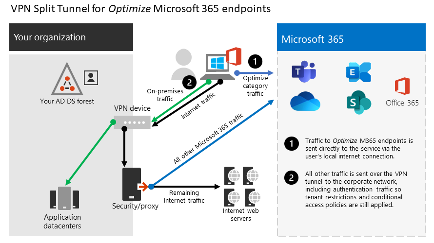

# <a name="implementing-vpn-split-tunneling-for-office-365"></a><span data-ttu-id="63e85-103">VPN splits tunneling implementeren voor Office 365</span><span class="sxs-lookup"><span data-stu-id="63e85-103">Implementing VPN split tunneling for Office 365</span></span>

>[!NOTE]
><span data-ttu-id="63e85-104">Dit onderwerp maakt deel uit van een reeks onderwerpen die betrekking hebben op Office 365 optimalisatie voor externe gebruikers.</span><span class="sxs-lookup"><span data-stu-id="63e85-104">This topic is part of a set of topics that address Office 365 optimization for remote users.</span></span>
>- <span data-ttu-id="63e85-105">Zie [Overzicht: VPN split tunneling](microsoft-365-vpn-split-tunnel.md)for Office 365 voor een overzicht van het gebruik van VPN split tunneling om de verbinding Office 365 externe gebruikers te optimaliseren.</span><span class="sxs-lookup"><span data-stu-id="63e85-105">For an overview of using VPN split tunneling to optimize Office 365 connectivity for remote users, see [Overview: VPN split tunneling for Office 365](microsoft-365-vpn-split-tunnel.md).</span></span>
>- <span data-ttu-id="63e85-106">Zie voor meer informatie over het optimaliseren Office 365 wereldwijde tenantprestaties voor gebruikers in China [Office 365 prestatieoptimalisatie voor Gebruikers van China.](microsoft-365-networking-china.md)</span><span class="sxs-lookup"><span data-stu-id="63e85-106">For information about optimizing Office 365 worldwide tenant performance for users in China, see [Office 365 performance optimization for China users](microsoft-365-networking-china.md).</span></span>

<span data-ttu-id="63e85-107">Al vele jaren gebruiken ondernemingen VPN's om externe ervaringen voor hun gebruikers te ondersteunen.</span><span class="sxs-lookup"><span data-stu-id="63e85-107">For many years, enterprises have been using VPNs to support remote experiences for their users.</span></span> <span data-ttu-id="63e85-108">Hoewel de kernbelasting on-premises bleef, was een VPN van de externe client die via een datacenter in het bedrijfsnetwerk werd gerouteerd, de primaire methode voor externe gebruikers om toegang te krijgen tot bedrijfsresources.</span><span class="sxs-lookup"><span data-stu-id="63e85-108">Whilst core workloads remained on-premises, a VPN from the remote client routed through a datacenter on the corporate network was the primary method for remote users to access corporate resources.</span></span> <span data-ttu-id="63e85-109">Om deze verbindingen te beschermen, bouwen ondernemingen lagen met netwerkbeveiligingsoplossingen langs de VPN-paden.</span><span class="sxs-lookup"><span data-stu-id="63e85-109">To safeguard these connections, enterprises build layers of network security solutions along the VPN paths.</span></span> <span data-ttu-id="63e85-110">Deze beveiliging is gemaakt om de interne infrastructuur te beschermen en mobiel browsen van externe websites te beschermen door verkeer om te zetten in de VPN en vervolgens via de on-premises internetperimeter.</span><span class="sxs-lookup"><span data-stu-id="63e85-110">This security was built to protect internal infrastructure and to safeguard mobile browsing of external web sites by rerouting traffic into the VPN and then out through the on-premises Internet perimeter.</span></span> <span data-ttu-id="63e85-111">VPN's, netwerkperimeters en bijbehorende beveiligingsinfrastructuur zijn vaak speciaal ontworpen en geschaald voor een gedefinieerde hoeveelheid verkeer, meestal met de meeste connectiviteit die binnen het bedrijfsnetwerk wordt gestart en het grootste deel binnen de interne netwerkgrenzen blijft.</span><span class="sxs-lookup"><span data-stu-id="63e85-111">VPNs, network perimeters, and associated security infrastructure were often purpose-built and scaled for a defined volume of traffic, typically with most connectivity being initiated from within the corporate network, and most of it staying within the internal network boundaries.</span></span>

<span data-ttu-id="63e85-112">Vpn-modellen waarbij alle verbindingen vanaf het externe gebruikersapparaat terug worden gerouteerd naar het on-premises netwerk (ook wel geforceerd **tunnelen** genoemd) waren lange tijd grotendeels houdbaar, zolang de gelijktijdige schaal van externe gebruikers bescheiden was en de verkeersvolumes voor VPN laag waren.</span><span class="sxs-lookup"><span data-stu-id="63e85-112">For quite some time, VPN models where all connections from the remote user device are routed back into the on-premises network (known as **forced tunneling**) were largely sustainable as long as the concurrent scale of remote users was modest and the traffic volumes traversing VPN were low.</span></span>  <span data-ttu-id="63e85-113">Sommige klanten blijven VPN-force tunneling gebruiken als status-quo, zelfs nadat hun toepassingen van binnen de bedrijfsperimeter naar openbare SaaS-clouds zijn verplaatst, Office 365 een goed voorbeeld.</span><span class="sxs-lookup"><span data-stu-id="63e85-113">Some customers continued to use VPN force tunneling as the status quo even after their applications moved from inside the corporate perimeter to public SaaS clouds, Office 365 being a prime example.</span></span>

<span data-ttu-id="63e85-114">Het gebruik van geforceerd ge tunnelde VPN's voor het maken van verbinding met gedistribueerde en prestatiegevoelige cloudtoepassingen is suboptimaal, maar het negatieve effect ervan kan door sommige ondernemingen zijn geaccepteerd om de status-status-status te behouden vanuit een beveiligingsperspectief.</span><span class="sxs-lookup"><span data-stu-id="63e85-114">The use of forced tunneled VPNs for connecting to distributed and performance-sensitive cloud applications is suboptimal, but the negative effect of that may have been accepted by some enterprises so as to maintain the status quo from a security perspective.</span></span> <span data-ttu-id="63e85-115">Hieronder ziet u een voorbeelddiagram van dit scenario:</span><span class="sxs-lookup"><span data-stu-id="63e85-115">An example diagram of this scenario can be seen below:</span></span>


<span data-ttu-id="63e85-117">Dit probleem neemt al jaren toe, met veel klanten die een aanzienlijke verschuiving van netwerkverkeerspatronen melden.</span><span class="sxs-lookup"><span data-stu-id="63e85-117">This problem has been growing for many years, with many customers reporting a significant shift of network traffic patterns.</span></span> <span data-ttu-id="63e85-118">Verkeer dat vroeger on-premises was, maakt nu verbinding met externe cloud-eindpunten.</span><span class="sxs-lookup"><span data-stu-id="63e85-118">Traffic that used to stay on premises now connects to external cloud endpoints.</span></span> <span data-ttu-id="63e85-119">Talloze Microsoft-klanten melden dat voorheen ongeveer 80% van het netwerkverkeer naar een interne bron was (vertegenwoordigd door de stippellijn in het bovenstaande diagram).</span><span class="sxs-lookup"><span data-stu-id="63e85-119">Numerous Microsoft customers report that previously, around 80% of their network traffic was to some internal source (represented by the dotted line in the above diagram).</span></span> <span data-ttu-id="63e85-120">In 2020 is dat aantal nu ongeveer 20% of lager omdat ze grote werkbelastingen naar de cloud hebben verplaatst, deze trends zijn niet ongebruikelijk in andere ondernemingen.</span><span class="sxs-lookup"><span data-stu-id="63e85-120">In 2020 that number is now around 20% or lower as they have shifted major workloads to the cloud, these trends are not uncommon with other enterprises.</span></span> <span data-ttu-id="63e85-121">Naarmate de cloud vordert, wordt het bovenstaande model steeds omslachtiger en onhoudbaar, waardoor een organisatie niet agile kan zijn wanneer ze naar een cloud first-wereld gaan.</span><span class="sxs-lookup"><span data-stu-id="63e85-121">Over time, as the cloud journey progresses, the above model becomes increasingly cumbersome and unsustainable, preventing an organization from being agile as they move into a cloud first world.</span></span>

<span data-ttu-id="63e85-122">De wereldwijde COVID-19-crisis heeft dit probleem geëscaleerd om onmiddellijk herstel te vereisen.</span><span class="sxs-lookup"><span data-stu-id="63e85-122">The worldwide COVID-19 crisis has escalated this problem to require immediate remediation.</span></span> <span data-ttu-id="63e85-123">De noodzaak om de veiligheid van werknemers te waarborgen, heeft een ongeëvenaarde vraag gegenereerd naar IT van ondernemingen om de productiviteit van werk van thuis uit op grote schaal te ondersteunen.</span><span class="sxs-lookup"><span data-stu-id="63e85-123">The need to ensure employee safety has generated unprecedented demands on enterprise IT to support work-from-home productivity at a massive scale.</span></span> <span data-ttu-id="63e85-124">Microsoft Office 365 is goed gepositioneerd om klanten te helpen aan die vraag te voldoen, maar een hoge gelijktijdigheid van gebruikers die thuis werken, genereert een groot volume van Office 365-verkeer dat, indien gerouteerd door gedwongen tunnel VPN en on-premises netwerkperimeters, snelle verzadiging veroorzaakt en VPN-infrastructuur zonder capaciteit wordt uitgevoerd.</span><span class="sxs-lookup"><span data-stu-id="63e85-124">Microsoft Office 365 is well positioned to help customers fulfill that demand, but high concurrency of users working from home generates a large volume of Office 365 traffic which, if routed through forced tunnel VPN and on-premises network perimeters, causes rapid saturation and runs VPN infrastructure out of capacity.</span></span> <span data-ttu-id="63e85-125">In deze nieuwe realiteit is het gebruik van VPN voor toegang tot Office 365 niet langer alleen een prestatiebeleed, maar een harde wand die niet alleen van invloed is op Office 365, maar ook op kritieke bedrijfsactiviteiten die nog steeds afhankelijk zijn van de VPN om te kunnen werken.</span><span class="sxs-lookup"><span data-stu-id="63e85-125">In this new reality, using VPN to access Office 365 is no longer just a performance impediment, but a hard wall that not only impacts Office 365 but critical business operations that still have to rely on the VPN to operate.</span></span>

<span data-ttu-id="63e85-126">Microsoft werkt al jaren nauw samen met klanten en de bredere industrie om effectieve, moderne oplossingen te bieden voor deze problemen vanuit onze eigen services en om af te stemmen op de beste praktijken in de branche.</span><span class="sxs-lookup"><span data-stu-id="63e85-126">Microsoft has been working closely with customers and the wider industry for many years to provide effective, modern solutions to these problems from within our own services, and to align with industry best practice.</span></span> <span data-ttu-id="63e85-127">[Connectiviteitsprincipes](./microsoft-365-network-connectivity-principles.md) voor Office 365 service zijn ontworpen om efficiënt te werken voor externe gebruikers, terwijl een organisatie toch de beveiliging en controle over hun connectiviteit kan behouden.</span><span class="sxs-lookup"><span data-stu-id="63e85-127">[Connectivity principles](./microsoft-365-network-connectivity-principles.md) for the Office 365 service have been designed to work efficiently for remote users whilst still allowing an organization to maintain security and control over their connectivity.</span></span> <span data-ttu-id="63e85-128">Deze oplossingen kunnen ook snel worden geïmplementeerd met beperkte hoeveelheid werk, maar hebben een aanzienlijk positief effect op de hierboven beschreven problemen.</span><span class="sxs-lookup"><span data-stu-id="63e85-128">These solutions can also be implemented quickly with limited work yet achieve a significant positive impact on the problems outlined above.</span></span>

<span data-ttu-id="63e85-129">De aanbevolen strategie van Microsoft voor het optimaliseren van de connectiviteit van externe werknemers is gericht op het snel oplossen van de problemen met de traditionele benadering en het leveren van hoge prestaties met een paar eenvoudige stappen.</span><span class="sxs-lookup"><span data-stu-id="63e85-129">Microsoft's recommended strategy for optimizing remote worker's connectivity is focused on rapidly alleviating the problems with the traditional approach and also providing high performance with a few simple steps.</span></span> <span data-ttu-id="63e85-130">Met deze stappen past u de oudere VPN-benadering aan voor een paar gedefinieerde eindpunten die de bottlenecks van VPN-servers omzeilen.</span><span class="sxs-lookup"><span data-stu-id="63e85-130">These steps adjust the legacy VPN approach for a few defined endpoints that bypass bottlenecked VPN servers.</span></span> <span data-ttu-id="63e85-131">Een gelijkwaardig of zelfs superieur beveiligingsmodel kan op verschillende lagen worden toegepast om de noodzaak te verwijderen om al het verkeer aan het begin van het bedrijfsnetwerk te beveiligen.</span><span class="sxs-lookup"><span data-stu-id="63e85-131">An equivalent or even superior security model can be applied at different layers to remove the need to secure all traffic at the egress of the corporate network.</span></span> <span data-ttu-id="63e85-132">In de meeste gevallen kan dit effectief binnen enkele uren worden bereikt en kan het vervolgens worden schaalbaar voor andere werkbelastingen, zoals de vraag en tijd van de vereisten toestaat.</span><span class="sxs-lookup"><span data-stu-id="63e85-132">In most cases this can be effectively achieved within hours and is then scalable to other workloads as requirements demand and time allows.</span></span>

## <a name="common-vpn-scenarios"></a><span data-ttu-id="63e85-133">Veelvoorkomende VPN-scenario's</span><span class="sxs-lookup"><span data-stu-id="63e85-133">Common VPN scenarios</span></span>

<span data-ttu-id="63e85-134">In de onderstaande lijst ziet u de meest voorkomende VPN-scenario's in bedrijfsomgevingen.</span><span class="sxs-lookup"><span data-stu-id="63e85-134">In the list below you'll see the most common VPN scenarios seen in enterprise environments.</span></span> <span data-ttu-id="63e85-135">De meeste klanten werken traditioneel met model 1 (VPN Forced Tunnel).</span><span class="sxs-lookup"><span data-stu-id="63e85-135">Most customers traditionally operate model 1 (VPN Forced Tunnel).</span></span> <span data-ttu-id="63e85-136">In deze sectie kunt u snel en veilig overstappen op **model 2,** dat met relatief weinig moeite kan worden bereikt en enorme voordelen heeft voor netwerkprestaties en gebruikerservaring.</span><span class="sxs-lookup"><span data-stu-id="63e85-136">This section will help you to quickly and securely transition to **model 2**, which is achievable with relatively little effort, and has enormous benefits to network performance and user experience.</span></span>

| <span data-ttu-id="63e85-137">Model</span><span class="sxs-lookup"><span data-stu-id="63e85-137">Model</span></span> | <span data-ttu-id="63e85-138">Beschrijving</span><span class="sxs-lookup"><span data-stu-id="63e85-138">Description</span></span> |
| --- | --- |
| [<span data-ttu-id="63e85-139">1. VPN Gedwongen Tunnel</span><span class="sxs-lookup"><span data-stu-id="63e85-139">1. VPN Forced Tunnel</span></span>](#1-vpn-forced-tunnel) | <span data-ttu-id="63e85-140">100% van het verkeer gaat naar de VPN-tunnel, inclusief on-premises, internet en alle O365/M365</span><span class="sxs-lookup"><span data-stu-id="63e85-140">100% of traffic goes into VPN tunnel, including on-premise, Internet, and all O365/M365</span></span> |
| [<span data-ttu-id="63e85-141">2. VPN Gedwongen Tunnel met enkele uitzonderingen</span><span class="sxs-lookup"><span data-stu-id="63e85-141">2. VPN Forced Tunnel with few exceptions</span></span>](#2-vpn-forced-tunnel-with-a-small-number-of-trusted-exceptions) | <span data-ttu-id="63e85-142">VPN-tunnel wordt standaard gebruikt (standaardroutepunten naar VPN), met weinig, belangrijkste vrijgestelde scenario's die rechtstreeks mogen worden gebruikt</span><span class="sxs-lookup"><span data-stu-id="63e85-142">VPN tunnel is used by default (default route points to VPN), with few, most important exempt scenarios that are allowed to go direct</span></span> |
| [<span data-ttu-id="63e85-143">3. VPN Gedwongen Tunnel uitzonderingen</span><span class="sxs-lookup"><span data-stu-id="63e85-143">3. VPN Forced Tunnel with broad exceptions</span></span>](#3-vpn-forced-tunnel-with-broad-exceptions) | <span data-ttu-id="63e85-144">VPN-tunnel wordt standaard gebruikt (standaardroutepunten naar VPN), met brede uitzonderingen die direct mogen gaan (zoals alle Office 365, Alle Salesforce, Alle zoomen)</span><span class="sxs-lookup"><span data-stu-id="63e85-144">VPN tunnel is used by default (default route points to VPN), with broad exceptions that are allowed to go direct (such as all Office 365, All Salesforce, All Zoom)</span></span> |
| [<span data-ttu-id="63e85-145">4. VPN Selectief Tunnel</span><span class="sxs-lookup"><span data-stu-id="63e85-145">4. VPN Selective Tunnel</span></span>](#4-vpn-selective-tunnel) | <span data-ttu-id="63e85-146">VPN-tunnel wordt alleen gebruikt voor op corpnet gebaseerde services.</span><span class="sxs-lookup"><span data-stu-id="63e85-146">VPN tunnel is used only for corpnet-based services.</span></span> <span data-ttu-id="63e85-147">Standaardroute (internet en alle internetservices) gaat rechtstreeks.</span><span class="sxs-lookup"><span data-stu-id="63e85-147">Default route (Internet and all Internet-based services) goes direct.</span></span> |
| [<span data-ttu-id="63e85-148">5. Geen VPN</span><span class="sxs-lookup"><span data-stu-id="63e85-148">5. No VPN</span></span>](#5-no-vpn) | <span data-ttu-id="63e85-149">Een variatie van #2, waarbij in plaats van oudere VPN alle corpnetservices worden gepubliceerd via moderne beveiligingsmethoden (zoals Zscaler ZPA, Azure Active Directory (Azure AD) Proxy/MCAS, enz.)</span><span class="sxs-lookup"><span data-stu-id="63e85-149">A variation of #2, where instead of legacy VPN, all corpnet services are published through modern security approaches (like Zscaler ZPA, Azure Active Directory (Azure AD) Proxy/MCAS, etc.)</span></span> |

### <a name="1-vpn-forced-tunnel"></a><span data-ttu-id="63e85-150">1. VPN Gedwongen Tunnel</span><span class="sxs-lookup"><span data-stu-id="63e85-150">1. VPN Forced Tunnel</span></span>

<span data-ttu-id="63e85-151">Dit is het meest voorkomende beginscenario voor de meeste zakelijke klanten.</span><span class="sxs-lookup"><span data-stu-id="63e85-151">This is the most common starting scenario for most enterprise customers.</span></span> <span data-ttu-id="63e85-152">Er wordt een gedwongen VPN gebruikt, wat betekent dat 100% van het verkeer naar het bedrijfsnetwerk wordt doorgestuurd, ongeacht het feit dat het eindpunt zich al dan niet binnen het bedrijfsnetwerk bevindt.</span><span class="sxs-lookup"><span data-stu-id="63e85-152">A forced VPN is used, which means 100% of traffic is directed into the corporate network regardless of the fact the endpoint resides within the corporate network or not.</span></span> <span data-ttu-id="63e85-153">Extern (internet) afhankelijk verkeer, zoals Office 365 of surfen op internet, wordt vervolgens weer vastgemaakt uit de on-premises beveiligingsapparatuur, zoals proxies.</span><span class="sxs-lookup"><span data-stu-id="63e85-153">Any external (Internet) bound traffic such as Office 365 or Internet browsing is then hair-pinned back out of the on premises security equipment such as proxies.</span></span> <span data-ttu-id="63e85-154">In het huidige klimaat met bijna 100% van de gebruikers die op afstand werken, wordt de VPN-infrastructuur hierdoor belast door dit model en is het waarschijnlijk dat de prestaties van al het bedrijfsverkeer en dus de onderneming in tijden van crisis aanzienlijk worden gehinderd.</span><span class="sxs-lookup"><span data-stu-id="63e85-154">In the current climate with nearly 100% of users working remotely, this model therefore puts high load on the VPN infrastructure and is likely to significantly hinder performance of all corporate traffic and thus the enterprise to operate efficiently at a time of crisis.</span></span>


### <a name="2-vpn-forced-tunnel-with-a-small-number-of-trusted-exceptions"></a><span data-ttu-id="63e85-156">2. VPN Gedwongen Tunnel met een klein aantal vertrouwde uitzonderingen</span><span class="sxs-lookup"><span data-stu-id="63e85-156">2. VPN Forced Tunnel with a small number of trusted exceptions</span></span>

<span data-ttu-id="63e85-157">Dit model is aanzienlijk efficiënter voor een onderneming om onder te werken, omdat het een paar gecontroleerde en gedefinieerde eindpunten toestaat die zeer hoge belasting en latentiegevoelig zijn om de VPN-tunnel te omzeilen en rechtstreeks naar de Office 365-service in dit voorbeeld te gaan.</span><span class="sxs-lookup"><span data-stu-id="63e85-157">This model is significantly more efficient for an enterprise to operate under as it allows a few controlled and defined endpoints that are very high load and latency sensitive to bypass the VPN tunnel and go direct to the Office 365 service in this example.</span></span> <span data-ttu-id="63e85-158">Hierdoor worden de prestaties voor de offloaded services aanzienlijk verbeterd en wordt ook de belasting van de VPN-infrastructuur verminderd, waardoor elementen waarvoor de service nog steeds moet worden gebruikt, minder worden belast voor resources.</span><span class="sxs-lookup"><span data-stu-id="63e85-158">This significantly improves the performance for the offloaded services, and also decreases the load on the VPN infrastructure, thus allowing elements that still require it to operate with lower contention for resources.</span></span> <span data-ttu-id="63e85-159">Dit model richt zich in dit artikel op het helpen bij de overgang naar, omdat eenvoudige, gedefinieerde acties snel kunnen worden ondernomen met talloze positieve resultaten.</span><span class="sxs-lookup"><span data-stu-id="63e85-159">It is this model that this article concentrates on assisting with the transition to as it allows for simple, defined actions to be taken quickly with numerous positive outcomes.</span></span>


### <a name="3-vpn-forced-tunnel-with-broad-exceptions"></a><span data-ttu-id="63e85-161">3. VPN Gedwongen Tunnel uitzonderingen</span><span class="sxs-lookup"><span data-stu-id="63e85-161">3. VPN Forced Tunnel with broad exceptions</span></span>

<span data-ttu-id="63e85-162">Het derde model verbreed het bereik van model twee als in plaats van alleen een kleine groep gedefinieerde eindpunten rechtstreeks te verzenden, maar in plaats daarvan wordt al het verkeer rechtstreeks naar vertrouwde services zoals Office 365 en SalesForce verzonden.</span><span class="sxs-lookup"><span data-stu-id="63e85-162">The third model broadens the scope of model two as rather than just sending a small group of defined endpoints direct, it instead sends all traffic directly to trusted services such Office 365 and SalesForce.</span></span> <span data-ttu-id="63e85-163">Hierdoor wordt de belasting van de BEDRIJFS VPN-infrastructuur verder beperkt en worden de prestaties van de gedefinieerde services verbeterd.</span><span class="sxs-lookup"><span data-stu-id="63e85-163">This further reduces the load on the corporate VPN infrastructure and improves the performance of the services defined.</span></span> <span data-ttu-id="63e85-164">Aangezien het waarschijnlijk meer tijd zal duren om de haalbaarheid van dit model te beoordelen en uit te voeren, is het waarschijnlijk een stap die op een later tijdstip iteratief kan worden uitgevoerd nadat model twee is geïmplementeerd.</span><span class="sxs-lookup"><span data-stu-id="63e85-164">As this model is likely to take more time to assess the feasibility of and implement, it is likely a step that can be taken iteratively at a later date once model two is successfully in place.</span></span>


### <a name="4-vpn-selective-tunnel"></a><span data-ttu-id="63e85-166">4. VPN selectief Tunnel</span><span class="sxs-lookup"><span data-stu-id="63e85-166">4. VPN selective Tunnel</span></span>

<span data-ttu-id="63e85-167">Met dit model wordt het derde model omgekeerd, omdat alleen verkeer dat is geïdentificeerd als het hebben van een bedrijfs-IP-adres, in de VPN-tunnel wordt verzonden en het internetpad dus de standaardroute is voor al het andere.</span><span class="sxs-lookup"><span data-stu-id="63e85-167">This model reverses the third model in that only traffic identified as having a corporate IP address is sent down the VPN tunnel and thus the Internet path is the default route for everything else.</span></span> <span data-ttu-id="63e85-168">Voor dit model moet een organisatie goed op weg zijn naar [Zero Trust](https://www.microsoft.com/security/zero-trust?rtc=1) om dit model veilig te kunnen implementeren.</span><span class="sxs-lookup"><span data-stu-id="63e85-168">This model requires an organization to be well on the path to [Zero Trust](https://www.microsoft.com/security/zero-trust?rtc=1) in able to safely implement this model.</span></span> <span data-ttu-id="63e85-169">Opgemerkt moet worden dat dit model of een bepaalde variatie daarvan waarschijnlijk de vereiste standaard wordt naarmate meer en meer services zich van het bedrijfsnetwerk naar de cloud verplaatsen.</span><span class="sxs-lookup"><span data-stu-id="63e85-169">It should be noted that this model or some variation thereof will likely become the necessary default over time as more and more services move away from the corporate network and into the cloud.</span></span> <span data-ttu-id="63e85-170">Microsoft gebruikt dit model intern. u vindt meer informatie over de implementatie van vpn-splits tunneling door Microsoft bij Lopen [op VPN:](https://www.microsoft.com/itshowcase/blog/running-on-vpn-how-microsoft-is-keeping-its-remote-workforce-connected/?elevate-lv)Hoe Microsoft het externe personeel verbonden houdt.</span><span class="sxs-lookup"><span data-stu-id="63e85-170">Microsoft uses this model internally; you can find more information on Microsoft's implementation of VPN split tunneling at [Running on VPN: How Microsoft is keeping its remote workforce connected](https://www.microsoft.com/itshowcase/blog/running-on-vpn-how-microsoft-is-keeping-its-remote-workforce-connected/?elevate-lv).</span></span>


### <a name="5-no-vpn"></a><span data-ttu-id="63e85-172">5. Geen VPN</span><span class="sxs-lookup"><span data-stu-id="63e85-172">5. No VPN</span></span>

<span data-ttu-id="63e85-173">Een meer geavanceerde versie van model nummer twee, waarbij interne services worden gepubliceerd via een moderne beveiligingsbenadering of SDWAN-oplossing, zoals Azure AD Proxy, MCAS, Zscaler ZPA, enzovoort.</span><span class="sxs-lookup"><span data-stu-id="63e85-173">A more advanced version of model number two, whereby any internal services are published through a modern security approach or SDWAN solution such as Azure AD Proxy, MCAS, Zscaler ZPA, etc.</span></span>


## <a name="implement-vpn-split-tunneling"></a><span data-ttu-id="63e85-175">VPN splits tunneling implementeren</span><span class="sxs-lookup"><span data-stu-id="63e85-175">Implement VPN split tunneling</span></span>

<span data-ttu-id="63e85-176">In deze sectie vindt u de eenvoudige stappen die nodig zijn om uw VPN-clientarchitectuur te migreren van een VPN-geforceerd _tunnel_ naar een VPN-geforceerd _tunnel_ met een klein aantal vertrouwde uitzonderingen [, VPN-gesplitste tunnelmodel #2](#2-vpn-forced-tunnel-with-a-small-number-of-trusted-exceptions) in veelgebruikte VPN-scenario's. [](#common-vpn-scenarios)</span><span class="sxs-lookup"><span data-stu-id="63e85-176">In this section, you'll find the simple steps required to migrate your VPN client architecture from a _VPN forced tunnel_ to a _VPN forced tunnel with a small number of trusted exceptions_, [VPN split tunnel model #2](#2-vpn-forced-tunnel-with-a-small-number-of-trusted-exceptions) in [Common VPN scenarios](#common-vpn-scenarios).</span></span>

<span data-ttu-id="63e85-177">In het onderstaande diagram ziet u hoe de aanbevolen VPN-oplossing voor gesplitste tunnel werkt:</span><span class="sxs-lookup"><span data-stu-id="63e85-177">The diagram below illustrates how the recommended VPN split tunnel solution works:</span></span>



### <a name="1-identify-the-endpoints-to-optimize"></a><span data-ttu-id="63e85-179">1. Identificeer de eindpunten die moeten worden geoptimaliseerd</span><span class="sxs-lookup"><span data-stu-id="63e85-179">1. Identify the endpoints to optimize</span></span>

<span data-ttu-id="63e85-180">In het [onderwerp Office 365 URL's](urls-and-ip-address-ranges.md) en IP-adresbereiken identificeert Microsoft duidelijk de belangrijkste eindpunten die u nodig hebt om ze te optimaliseren en te categoriseren als **Optimaliseren.**</span><span class="sxs-lookup"><span data-stu-id="63e85-180">In the [Office 365 URLs and IP address ranges](urls-and-ip-address-ranges.md) topic, Microsoft clearly identifies the key endpoints you need to optimize and categorizes them as **Optimize**.</span></span> <span data-ttu-id="63e85-181">Er zijn momenteel slechts vier URL's en 20 IP-subnetten die moeten worden geoptimaliseerd.</span><span class="sxs-lookup"><span data-stu-id="63e85-181">There are currently just four URLS and 20 IP subnets that need to be optimized.</span></span> <span data-ttu-id="63e85-182">Deze kleine groep eindpunten is goed voor ongeveer 70% - 80% van het volume van het verkeer naar de Office 365-service, inclusief de latentiegevoelige eindpunten, zoals die voor Teams media.</span><span class="sxs-lookup"><span data-stu-id="63e85-182">This small group of endpoints accounts for around 70% - 80% of the volume of traffic to the Office 365 service including the latency sensitive endpoints such as those for Teams media.</span></span> <span data-ttu-id="63e85-183">Dit is in feite het verkeer waar we speciaal voor moeten zorgen en is ook het verkeer dat enorme druk zal uitoefenen op traditionele netwerkpaden en VPN-infrastructuur.</span><span class="sxs-lookup"><span data-stu-id="63e85-183">Essentially this is the traffic that we need to take special care of and is also the traffic that will put incredible pressure on traditional network paths and VPN infrastructure.</span></span>

<span data-ttu-id="63e85-184">URL's in deze categorie hebben de volgende kenmerken:</span><span class="sxs-lookup"><span data-stu-id="63e85-184">URLs in this category have the following characteristics:</span></span>

- <span data-ttu-id="63e85-185">Zijn Microsoft-eindpunten die eigendom zijn van En beheerd, gehost op Microsoft-infrastructuur</span><span class="sxs-lookup"><span data-stu-id="63e85-185">Are Microsoft owned and managed endpoints, hosted on Microsoft infrastructure</span></span>
- <span data-ttu-id="63e85-186">IPs beschikbaar hebben</span><span class="sxs-lookup"><span data-stu-id="63e85-186">Have IPs provided</span></span>
- <span data-ttu-id="63e85-187">Lage veranderingssnelheid en zal naar verwachting klein blijven (momenteel 20 IP-subnetten)</span><span class="sxs-lookup"><span data-stu-id="63e85-187">Low rate of change and are expected to remain small in number (currently 20 IP subnets)</span></span>
- <span data-ttu-id="63e85-188">Bandbreedte en/of latentiegevoelig zijn</span><span class="sxs-lookup"><span data-stu-id="63e85-188">Are bandwidth and/or latency sensitive</span></span>
- <span data-ttu-id="63e85-189">Kunnen vereiste beveiligingselementen in de service hebben in plaats van inline op het netwerk</span><span class="sxs-lookup"><span data-stu-id="63e85-189">Are able to have required security elements provided in the service rather than inline on the network</span></span>
- <span data-ttu-id="63e85-190">Goed voor ongeveer 70-80% van het volume van het verkeer naar de Office 365 service</span><span class="sxs-lookup"><span data-stu-id="63e85-190">Account for around 70-80% of the volume of traffic to the Office 365 service</span></span>

<span data-ttu-id="63e85-191">Zie het artikel Office 365 eindpunten beheren voor meer informatie over Office 365 eindpunten en hoe ze [worden gecategoriseerd en beheerd.](managing-office-365-endpoints.md)</span><span class="sxs-lookup"><span data-stu-id="63e85-191">For more information about Office 365 endpoints and how they are categorized and managed, see the article [Managing Office 365 endpoints](managing-office-365-endpoints.md).</span></span>

#### <a name="optimize-urls"></a><span data-ttu-id="63e85-192">URL's optimaliseren</span><span class="sxs-lookup"><span data-stu-id="63e85-192">Optimize URLs</span></span>

<span data-ttu-id="63e85-193">De huidige URL's optimaliseren vindt u in de onderstaande tabel.</span><span class="sxs-lookup"><span data-stu-id="63e85-193">The current Optimize URLs can be found in the table below.</span></span> <span data-ttu-id="63e85-194">In de meeste gevallen hoeft u alleen URL-eindpunten te gebruiken in een [PAC-bestand](managing-office-365-endpoints.md#use-a-pac-file-for-direct-routing-of-vital-office-365-traffic) in een browser waarin de eindpunten zijn geconfigureerd om rechtstreeks te worden verzonden, in plaats van naar de proxy.</span><span class="sxs-lookup"><span data-stu-id="63e85-194">Under most circumstances, you should only need to use URL endpoints in a [browser PAC file](managing-office-365-endpoints.md#use-a-pac-file-for-direct-routing-of-vital-office-365-traffic) where the endpoints are configured to be sent direct, rather than to the proxy.</span></span>

| <span data-ttu-id="63e85-195">URL's optimaliseren</span><span class="sxs-lookup"><span data-stu-id="63e85-195">Optimize URLs</span></span> | <span data-ttu-id="63e85-196">Poort/protocol</span><span class="sxs-lookup"><span data-stu-id="63e85-196">Port/Protocol</span></span> | <span data-ttu-id="63e85-197">Doel</span><span class="sxs-lookup"><span data-stu-id="63e85-197">Purpose</span></span> |
| --- | --- | --- |
| <https://outlook.office365.com> | <span data-ttu-id="63e85-198">TCP 443</span><span class="sxs-lookup"><span data-stu-id="63e85-198">TCP 443</span></span> | <span data-ttu-id="63e85-199">Dit is een van de primaire URL's die Outlook gebruikt om verbinding te maken met de Exchange Online server en heeft een hoog bandbreedtegebruik en een hoog aantal verbindingen.</span><span class="sxs-lookup"><span data-stu-id="63e85-199">This is one of the primary URLs Outlook uses to connect to its Exchange Online server and has a high volume of bandwidth usage and connection count.</span></span> <span data-ttu-id="63e85-200">Lage netwerklatentie is vereist voor onlinefuncties, zoals: direct zoeken, andere postvakkalenders, gratis / bezet zoeken, regels en waarschuwingen beheren, Exchange onlinearchief, e-mailberichten die het postvak uit gaan.</span><span class="sxs-lookup"><span data-stu-id="63e85-200">Low network latency is required for online features including: instant search, other mailbox calendars, free / busy lookup, manage rules and alerts, Exchange online archive, emails departing the outbox.</span></span> |
| <https://outlook.office.com> | <span data-ttu-id="63e85-201">TCP 443</span><span class="sxs-lookup"><span data-stu-id="63e85-201">TCP 443</span></span> | <span data-ttu-id="63e85-202">Deze URL wordt gebruikt voor Outlook Online Web Access om verbinding te maken met Exchange Online server en is gevoelig voor netwerklatentie.</span><span class="sxs-lookup"><span data-stu-id="63e85-202">This URL is used for Outlook Online Web Access to connect to Exchange Online server, and is sensitive to network latency.</span></span> <span data-ttu-id="63e85-203">Connectiviteit is met name vereist voor het uploaden en downloaden van grote bestanden met SharePoint Online.</span><span class="sxs-lookup"><span data-stu-id="63e85-203">Connectivity is particularly required for large file upload and download with SharePoint Online.</span></span> |
| <span data-ttu-id="63e85-204"> https:// \<tenant\> .sharepoint.com</span><span class="sxs-lookup"><span data-stu-id="63e85-204">https://\<tenant\>.sharepoint.com</span></span> | <span data-ttu-id="63e85-205">TCP 443</span><span class="sxs-lookup"><span data-stu-id="63e85-205">TCP 443</span></span> | <span data-ttu-id="63e85-206">Dit is de primaire URL voor SharePoint Online en heeft een hoge bandbreedte.</span><span class="sxs-lookup"><span data-stu-id="63e85-206">This is the primary URL for SharePoint Online and has high-bandwidth usage.</span></span> |
| <span data-ttu-id="63e85-207"> https:// \<tenant\> -my.sharepoint.com</span><span class="sxs-lookup"><span data-stu-id="63e85-207">https://\<tenant\>-my.sharepoint.com</span></span> | <span data-ttu-id="63e85-208">TCP 443</span><span class="sxs-lookup"><span data-stu-id="63e85-208">TCP 443</span></span> | <span data-ttu-id="63e85-209">Dit is de primaire URL voor OneDrive voor Bedrijven en heeft een hoog bandbreedtegebruik en mogelijk een hoog aantal verbindingen van het OneDrive voor Bedrijven Synchronisatiehulpmiddel.</span><span class="sxs-lookup"><span data-stu-id="63e85-209">This is the primary URL for OneDrive for Business and has high bandwidth usage and possibly high connection count from the OneDrive for Business Sync tool.</span></span> |
| <span data-ttu-id="63e85-210">Teams Media-IPs (geen URL)</span><span class="sxs-lookup"><span data-stu-id="63e85-210">Teams Media IPs (no URL)</span></span> | <span data-ttu-id="63e85-211">UDP 3478, 3479, 3480 en 3481</span><span class="sxs-lookup"><span data-stu-id="63e85-211">UDP 3478, 3479, 3480, and 3481</span></span> | <span data-ttu-id="63e85-212">Toewijzing van detectie door relay en realtimeverkeer (3478), Audio (3479), Video (3480) en Videoscherm delen (3481).</span><span class="sxs-lookup"><span data-stu-id="63e85-212">Relay Discovery allocation and real-time traffic (3478), Audio (3479), Video (3480), and Video Screen Sharing (3481).</span></span> <span data-ttu-id="63e85-213">Dit zijn de eindpunten die worden gebruikt voor Skype voor Bedrijven en Microsoft Teams mediaverkeer (oproepen, vergaderingen, enzovoort).</span><span class="sxs-lookup"><span data-stu-id="63e85-213">These are the endpoints used for Skype for Business and Microsoft Teams Media traffic (calls, meetings, etc.).</span></span> <span data-ttu-id="63e85-214">De meeste eindpunten worden geleverd wanneer de Microsoft Teams een gesprek tot leven brengt (en zijn opgenomen in de vereiste IPs die voor de service worden vermeld).</span><span class="sxs-lookup"><span data-stu-id="63e85-214">Most endpoints are provided when the Microsoft Teams client establishes a call (and are contained within the required IPs listed for the service).</span></span> <span data-ttu-id="63e85-215">Gebruik van het UDP-protocol is vereist voor optimale mediakwaliteit.</span><span class="sxs-lookup"><span data-stu-id="63e85-215">Use of the UDP protocol is required for optimal media quality.</span></span>   |

<span data-ttu-id="63e85-216">In de bovenstaande voorbeelden moet **tenant** worden vervangen door uw Office 365 tenantnaam.</span><span class="sxs-lookup"><span data-stu-id="63e85-216">In the above examples, **tenant** should be replaced with your Office 365 tenant name.</span></span> <span data-ttu-id="63e85-217">U kunt **bijvoorbeeld contoso.onmicrosoft.com** gebruiken  contoso.sharepoint.com en _constoso-my.sharepoint.com._</span><span class="sxs-lookup"><span data-stu-id="63e85-217">For example, **contoso.onmicrosoft.com** would use _contoso.sharepoint.com_ and _constoso-my.sharepoint.com_.</span></span>

#### <a name="optimize-ip-address-ranges"></a><span data-ttu-id="63e85-218">IP-adresbereiken optimaliseren</span><span class="sxs-lookup"><span data-stu-id="63e85-218">Optimize IP address ranges</span></span>

<span data-ttu-id="63e85-219">Op het moment van schrijven zijn de IP-bereiken waar deze eindpunten mee corresponderen als volgt.</span><span class="sxs-lookup"><span data-stu-id="63e85-219">At the time of writing the IP ranges that these endpoints correspond to are as follows.</span></span> <span data-ttu-id="63e85-220">Het **wordt** ten zeerste aangeraden een [script](https://github.com/microsoft/Office365NetworkTools/tree/master/Scripts/Display%20URL-IPs-Ports%20per%20Category) zoals dit voorbeeld, de Office 365 IP- en [URL-webservice of](microsoft-365-ip-web-service.md) de [URL/IP-pagina](urls-and-ip-address-ranges.md) te gebruiken om te controleren of er updates zijn bij het toepassen van de configuratie en een beleid in te stellen om dit regelmatig te doen.</span><span class="sxs-lookup"><span data-stu-id="63e85-220">It is **very strongly** advised you use a [script such as this](https://github.com/microsoft/Office365NetworkTools/tree/master/Scripts/Display%20URL-IPs-Ports%20per%20Category) example, the [Office 365 IP and URL web service](microsoft-365-ip-web-service.md) or the [URL/IP page](urls-and-ip-address-ranges.md) to check for any updates when applying the configuration, and put a policy in place to do so regularly.</span></span>

```
104.146.128.0/17
13.107.128.0/22
13.107.136.0/22
13.107.18.10/31
13.107.6.152/31
13.107.64.0/18
131.253.33.215/32
132.245.0.0/16
150.171.32.0/22
150.171.40.0/22
191.234.140.0/22
204.79.197.215/32
23.103.160.0/20
40.104.0.0/15
40.108.128.0/17
40.96.0.0/13
52.104.0.0/14
52.112.0.0/14
52.96.0.0/14
52.120.0.0/14
```

### <a name="2-optimize-access-to-these-endpoints-via-the-vpn"></a><span data-ttu-id="63e85-221">2. De toegang tot deze eindpunten optimaliseren via de VPN</span><span class="sxs-lookup"><span data-stu-id="63e85-221">2. Optimize access to these endpoints via the VPN</span></span>

<span data-ttu-id="63e85-222">Nu we deze kritieke eindpunten hebben geïdentificeerd, moeten we ze afleiden van de VPN-tunnel en toestaan dat ze de lokale internetverbinding van de gebruiker gebruiken om rechtstreeks verbinding te maken met de service.</span><span class="sxs-lookup"><span data-stu-id="63e85-222">Now that we have identified these critical endpoints, we need to divert them away from the VPN tunnel and allow them to use the user's local Internet connection to connect directly to the service.</span></span> <span data-ttu-id="63e85-223">De manier waarop dit wordt uitgevoerd, is afhankelijk van het gebruikte VPN-product- en machineplatform, maar met de meeste VPN-oplossingen kan deze logica eenvoudig worden toegepast.</span><span class="sxs-lookup"><span data-stu-id="63e85-223">The manner in which this is accomplished will vary depending on the VPN product and machine platform used but most VPN solutions will allow some simple configuration of policy to apply this logic.</span></span> <span data-ttu-id="63e85-224">Zie HOWTO-handleidingen voor veelgebruikte [VPN-platforms](#howto-guides-for-common-vpn-platforms)voor informatie over VPN-platformspecifieke instructies voor gesplitste tunnel.</span><span class="sxs-lookup"><span data-stu-id="63e85-224">For information VPN platform-specific split tunnel guidance, see [HOWTO guides for common VPN platforms](#howto-guides-for-common-vpn-platforms).</span></span>

<span data-ttu-id="63e85-225">Als u de oplossing handmatig wilt testen, kunt u het volgende PowerShell-voorbeeld uitvoeren om de oplossing op het niveau van de routetabel te emuleren.</span><span class="sxs-lookup"><span data-stu-id="63e85-225">If you wish to test the solution manually, you can execute the following PowerShell example to emulate the solution at the route table level.</span></span> <span data-ttu-id="63e85-226">In dit voorbeeld wordt een route voor elk van de Teams Media IP-subnetten toegevoegd aan de routetabel.</span><span class="sxs-lookup"><span data-stu-id="63e85-226">This example adds a route for each of the Teams Media IP subnets into the route table.</span></span> <span data-ttu-id="63e85-227">U kunt de Teams voor en na de mediaprestaties testen en het verschil in routes voor de opgegeven eindpunten zien.</span><span class="sxs-lookup"><span data-stu-id="63e85-227">You can test Teams media performance before and after, and observe the difference in routes for the specified endpoints.</span></span>

#### <a name="example-add-teams-media-ip-subnets-into-the-route-table"></a><span data-ttu-id="63e85-228">Voorbeeld: Voeg Teams Media IP-subnetten toe aan de routetabel</span><span class="sxs-lookup"><span data-stu-id="63e85-228">Example: Add Teams Media IP subnets into the route table</span></span>

```powershell
$intIndex = "" # index of the interface connected to the internet
$gateway = "" # default gateway of that interface
$destPrefix = "52.120.0.0/14", "52.112.0.0/14", "13.107.64.0/18" # Teams Media endpoints
# Add routes to the route table
foreach ($prefix in $destPrefix) {New-NetRoute -DestinationPrefix $prefix -InterfaceIndex $intIndex -NextHop $gateway}
```

<span data-ttu-id="63e85-229">In het bovenstaande script _is $intIndex_ de index van de interface die is verbonden met internet (zoeken door **get-netadapter** uit te voeren in PowerShell; de waarde van _ifIndex_ zoeken) en _$gateway_ is de standaardgateway van die interface (zoeken door **ipconfig** uit te voeren in een opdrachtprompt of **(Get-NetIPConfiguration | Foreach IPv4DefaultGateway). NextHop** in PowerShell).</span><span class="sxs-lookup"><span data-stu-id="63e85-229">In the above script, _$intIndex_ is the index of the interface connected to the internet (find by running **get-netadapter** in PowerShell; look for the value of _ifIndex_) and _$gateway_ is the default gateway of that interface (find by running **ipconfig** in a command prompt or **(Get-NetIPConfiguration | Foreach IPv4DefaultGateway).NextHop** in PowerShell).</span></span>

<span data-ttu-id="63e85-230">Nadat u de routes hebt toegevoegd, kunt u bevestigen dat de routetabel juist is door **routeafdruk** uit te voeren in een opdrachtprompt of PowerShell.</span><span class="sxs-lookup"><span data-stu-id="63e85-230">Once you have added the routes, you can confirm that the route table is correct by running **route print** in a command prompt or PowerShell.</span></span> <span data-ttu-id="63e85-231">De uitvoer moet de routes bevatten die u hebt toegevoegd, met de interface-index _(22_ in dit voorbeeld) en de gateway voor die interface (_192.168.1.1_ in dit voorbeeld):</span><span class="sxs-lookup"><span data-stu-id="63e85-231">The output should contain the routes you added, showing the interface index (_22_ in this example) and the gateway for that interface (_192.168.1.1_ in this example):</span></span>


<span data-ttu-id="63e85-233">Als u  routes wilt toevoegen voor alle huidige IP-adresbereiken in de categorie Optimaliseren, kunt u de volgende scriptvariatie gebruiken om een query uit te voeren op de Office 365 IP- en [URL-webservice](microsoft-365-ip-web-service.md) voor de huidige set IP-subnetten optimaliseren en deze aan de routetabel toe te voegen.</span><span class="sxs-lookup"><span data-stu-id="63e85-233">To add routes for **all** current IP address ranges in the Optimize category, you can use the following script variation to query the [Office 365 IP and URL web service](microsoft-365-ip-web-service.md) for the current set of Optimize IP subnets and add them to the route table.</span></span>

#### <a name="example-add-all-optimize-subnets-into-the-route-table"></a><span data-ttu-id="63e85-234">Voorbeeld: Alle subnetten optimaliseren toevoegen aan de routetabel</span><span class="sxs-lookup"><span data-stu-id="63e85-234">Example: Add all Optimize subnets into the route table</span></span>

```powershell
$intIndex = "" # index of the interface connected to the internet
$gateway = "" # default gateway of that interface
# Query the web service for IPs in the Optimize category
$ep = Invoke-RestMethod ("https://endpoints.office.com/endpoints/worldwide?clientrequestid=" + ([GUID]::NewGuid()).Guid)
# Output only IPv4 Optimize IPs to $optimizeIps
$destPrefix = $ep | where {$_.category -eq "Optimize"} | Select-Object -ExpandProperty ips | Where-Object { $_ -like '*.*' }
# Add routes to the route table
foreach ($prefix in $destPrefix) {New-NetRoute -DestinationPrefix $prefix -InterfaceIndex $intIndex -NextHop $gateway}
```

<span data-ttu-id="63e85-235">Als u per ongeluk routes met onjuiste parameters hebt toegevoegd of alleen de wijzigingen wilt terugdraaien, kunt u de routes verwijderen die u zojuist hebt toegevoegd met de volgende opdracht:</span><span class="sxs-lookup"><span data-stu-id="63e85-235">If you inadvertently added routes with incorrect parameters or simply wish to revert your changes, you can remove the routes you just added with the following command:</span></span>

```powershell
foreach ($prefix in $destPrefix) {Remove-NetRoute -DestinationPrefix $prefix -InterfaceIndex $intIndex -NextHop $gateway}
```

<!--- remmed until we add more reliable interface selection logic
#### Example script to add Teams Media subnets to the route table

```powershell
$adapter = get-netadapter | ? {$_.Status -eq "Up"}
$adapterIndex = $adapter.ifIndex
$gateway = (Get-NetIPConfiguration | Foreach IPv4DefaultGateway).NextHop

$destPrefix = "52.120.0.0/14", "52.112.0.0/14", "13.107.64.0/18"
foreach ($prefix in $destPrefix) {New-NetRoute -DestinationPrefix $prefix -InterfaceIndex $intIndex -NextHop $gateway}
```
-->

<span data-ttu-id="63e85-236">De VPN-client moet zo zijn geconfigureerd dat het verkeer naar de **IPs** optimaliseren op deze manier wordt gerouteerd.</span><span class="sxs-lookup"><span data-stu-id="63e85-236">The VPN client should be configured so that traffic to the **Optimize** IPs are routed in this way.</span></span> <span data-ttu-id="63e85-237">Hierdoor kan het verkeer gebruikmaken van lokale Microsoft-bronnen, zoals Office 365 Service Front Doors, zoals de [Azure Front Door](https://azure.microsoft.com/blog/azure-front-door-service-is-now-generally-available/) die Office 365-services en connectiviteits-eindpunten zo dicht mogelijk bij uw gebruikers leveren.</span><span class="sxs-lookup"><span data-stu-id="63e85-237">This allows the traffic to utilize local Microsoft resources such as Office 365 Service Front Doors [such as the Azure Front Door](https://azure.microsoft.com/blog/azure-front-door-service-is-now-generally-available/) that deliver Office 365 services and connectivity endpoints as close to your users as possible.</span></span> <span data-ttu-id="63e85-238">Hierdoor kunnen we hoge prestatieniveaus leveren aan gebruikers waar ze ook ter wereld zijn en profiteren we optimaal van het wereldwijde netwerk van [Microsoft](https://azure.microsoft.com/blog/how-microsoft-builds-its-fast-and-reliable-global-network/)van wereldklasse, dat waarschijnlijk binnen enkele milliseconden na het directe egressie van uw gebruikers is.</span><span class="sxs-lookup"><span data-stu-id="63e85-238">This allows us to deliver high performance levels to users wherever they are in the world and takes full advantage of [Microsoft's world class global network](https://azure.microsoft.com/blog/how-microsoft-builds-its-fast-and-reliable-global-network/), which is likely within a few milliseconds of your users' direct egress.</span></span>

## <a name="configuring-and-securing-teams-media-traffic"></a><span data-ttu-id="63e85-239">Mediaverkeer configureren en Teams beveiligen</span><span class="sxs-lookup"><span data-stu-id="63e85-239">Configuring and securing Teams media traffic</span></span>

<span data-ttu-id="63e85-240">Sommige beheerders hebben mogelijk meer gedetailleerde informatie nodig over de werking van oproepstromen in Teams met behulp van een gesplitst tunnelingsmodel en hoe verbindingen worden beveiligd.</span><span class="sxs-lookup"><span data-stu-id="63e85-240">Some administrators may require more detailed information on how call flows operate in Teams using a split tunneling model and how connections are secured.</span></span>

### <a name="configuration"></a><span data-ttu-id="63e85-241">Configuratie</span><span class="sxs-lookup"><span data-stu-id="63e85-241">Configuration</span></span>

<span data-ttu-id="63e85-242">Zolang de vereiste IP-subnetten optimaliseren voor Teams-media correct aanwezig zijn in de Teams routetabel, wordt de [](/windows/win32/api/iphlpapi/nf-iphlpapi-getbestroute) lokale interface geretourneerd voor Microsoft-bestemmingen in de bovenstaande Microsoft-IP-blokken, zolang de vereiste IP-subnetten optimaliseren voor Teams-media correct aanwezig zijn in de routetabel.</span><span class="sxs-lookup"><span data-stu-id="63e85-242">For both calls and meetings, as long as the required Optimize IP subnets for Teams media are correctly in place in the route table, when Teams calls the [GetBestRoute](/windows/win32/api/iphlpapi/nf-iphlpapi-getbestroute) function to determine which local interface corresponds to the route it should use for a particular destination, the local interface will be returned for Microsoft destinations in the Microsoft IP blocks listed above.</span></span>

<span data-ttu-id="63e85-243">Sommige VPN-clientsoftware maakt routeringsmanipulatie mogelijk op basis van URL.</span><span class="sxs-lookup"><span data-stu-id="63e85-243">Some VPN client software allows routing manipulation based on URL.</span></span> <span data-ttu-id="63e85-244">Voor Teams mediaverkeer is er echter geen URL aan gekoppeld, dus de besturing van routering voor dit verkeer moet worden uitgevoerd met IP-subnetten.</span><span class="sxs-lookup"><span data-stu-id="63e85-244">However, Teams media traffic has no URL associated with it, so control of routing for this traffic must be done using IP subnets.</span></span>

<span data-ttu-id="63e85-245">In bepaalde scenario's, vaak niet gerelateerd aan Teams clientconfiguratie, loopt het mediaverkeer nog steeds door de VPN-tunnel, zelfs met de juiste routes.</span><span class="sxs-lookup"><span data-stu-id="63e85-245">In certain scenarios, often unrelated to Teams client configuration, media traffic still traverses the VPN tunnel even with the correct routes in place.</span></span> <span data-ttu-id="63e85-246">Als u dit scenario tegenkomt, is het voldoende om een firewallregel te gebruiken om te Teams ip-subnetten of poorten om de VPN te gebruiken.</span><span class="sxs-lookup"><span data-stu-id="63e85-246">If you encounter this scenario, then using a firewall rule to block the Teams IP subnets or ports from using the VPN should suffice.</span></span>

>[!IMPORTANT]
><span data-ttu-id="63e85-247">Als u Teams wilt dat mediaverkeer via de gewenste methode wordt gerouteerd in alle VPN-scenario's, moet u ervoor zorgen dat gebruikers Microsoft Teams clientversie **1.3.00.13565** of hoger uitvoeren.</span><span class="sxs-lookup"><span data-stu-id="63e85-247">To ensure Teams media traffic is routed via the desired method in all VPN scenarios, please ensure users are running Microsoft Teams client version **1.3.00.13565** or greater.</span></span> <span data-ttu-id="63e85-248">Deze versie bevat verbeteringen in de manier waarop de client beschikbare netwerkpaden detecteert.</span><span class="sxs-lookup"><span data-stu-id="63e85-248">This version includes improvements in how the client detects available network paths.</span></span>

<span data-ttu-id="63e85-249">Signaleringsverkeer wordt uitgevoerd via HTTPS en is niet zo latentiegevoelig als het mediaverkeer en is gemarkeerd als Toestaan **in** de URL/IP-gegevens en kan zo nodig veilig via de VPN-client worden gerouteerd.</span><span class="sxs-lookup"><span data-stu-id="63e85-249">Signaling traffic is performed over HTTPS and is not as latency sensitive as the media traffic and is marked as **Allow** in the URL/IP data and thus can safely be routed through the VPN client if desired.</span></span>

### <a name="security"></a><span data-ttu-id="63e85-250">Beveiliging</span><span class="sxs-lookup"><span data-stu-id="63e85-250">Security</span></span>

<span data-ttu-id="63e85-251">Een veelvoorkomende reden voor het vermijden van gesplitste tunnels is dat het minder veilig is om dit te doen, dat wil zeggen</span><span class="sxs-lookup"><span data-stu-id="63e85-251">One common argument for avoiding split tunnels is that it is less secure to do so, i.e</span></span> <span data-ttu-id="63e85-252">Alle verkeer dat niet door de VPN-tunnel gaat, heeft geen baat bij het versleutelingsschema dat wordt toegepast op de VPN-tunnel en is daarom minder veilig.</span><span class="sxs-lookup"><span data-stu-id="63e85-252">any traffic that does not go through the VPN tunnel will not benefit from whatever encryption scheme is applied to the VPN tunnel, and is therefore less secure.</span></span>

<span data-ttu-id="63e85-253">Het belangrijkste tegenargument hiervoor is dat mediaverkeer al is versleuteld via _Secure Real-Time Transport Protocol (SRTP),_ een profiel van Real-Time Transport Protocol (RTP) dat vertrouwelijkheid, verificatie en replay-aanvalsbeveiliging biedt voor RTP-verkeer.</span><span class="sxs-lookup"><span data-stu-id="63e85-253">The main counter-argument to this is that media traffic is already encrypted via _Secure Real-Time Transport Protocol (SRTP)_, a profile of Real-Time Transport Protocol (RTP) that provides confidentiality, authentication, and replay attack protection to RTP traffic.</span></span> <span data-ttu-id="63e85-254">SRTP zelf is afhankelijk van een willekeurig gegenereerde sessiesleutel, die wordt uitgewisseld via het beveiligde TLS-signaleringskanaal.</span><span class="sxs-lookup"><span data-stu-id="63e85-254">SRTP itself relies on a randomly generated session key, which is exchanged via the TLS secured signaling channel.</span></span> <span data-ttu-id="63e85-255">Dit wordt uitgebreid besproken [](/skypeforbusiness/optimizing-your-network/security-guide-for-skype-for-business-online)in deze beveiligingshandleiding, maar het primaire gedeelte van belang is mediaversleuteling.</span><span class="sxs-lookup"><span data-stu-id="63e85-255">This is covered in great detail within [this security guide](/skypeforbusiness/optimizing-your-network/security-guide-for-skype-for-business-online), but the primary section of interest is media encryption.</span></span>

<span data-ttu-id="63e85-256">Mediaverkeer wordt versleuteld met SRTP, waarbij een sessiesleutel wordt gebruikt die wordt gegenereerd door een veilige generator voor willekeurige getallen en die wordt uitgewisseld via het TLS-kanaal voor signalering.</span><span class="sxs-lookup"><span data-stu-id="63e85-256">Media traffic is encrypted using SRTP, which uses a session key generated by a secure random number generator and exchanged using the signaling TLS channel.</span></span> <span data-ttu-id="63e85-257">Daarnaast worden media die in beide richtingen tussen de Mediation Server en de interne volgende hop stromen, ook versleuteld met SRTP.</span><span class="sxs-lookup"><span data-stu-id="63e85-257">In addition, media flowing in both directions between the Mediation Server and its internal next hop is also encrypted using SRTP.</span></span>

<span data-ttu-id="63e85-258">Skype voor Bedrijven Online genereert gebruikersnaam/wachtwoorden voor veilige toegang tot media relays via _Traversal Using Relays around NAT (TURN)_.</span><span class="sxs-lookup"><span data-stu-id="63e85-258">Skype for Business Online generates username/passwords for secure access to media relays over _Traversal Using Relays around NAT (TURN)_.</span></span> <span data-ttu-id="63e85-259">Media relays exchange the username/password over a TLS-secured SIP channel.</span><span class="sxs-lookup"><span data-stu-id="63e85-259">Media relays exchange the username/password over a TLS-secured SIP channel.</span></span> <span data-ttu-id="63e85-260">Het is vermeldenswaard dat hoewel een VPN-tunnel kan worden gebruikt om de client te verbinden met het bedrijfsnetwerk, het verkeer nog steeds moet stromen in het SRTP-formulier wanneer het het bedrijfsnetwerk verlaat om de service te bereiken.</span><span class="sxs-lookup"><span data-stu-id="63e85-260">It is worth noting that even though a VPN tunnel may be used to connect the client to the corporate network, the traffic still needs to flow in its SRTP form when it leaves the corporate network to reach the service.</span></span>

<span data-ttu-id="63e85-261">Informatie over hoe Teams veelvoorkomende beveiligingsproblemen, zoals spraak- of _Session Traversal Utilities voor NAT-amplificatieaanvallen (STUN)_ beperkt, vindt u in [5.1](/openspecs/office_protocols/ms-ice2/69525351-8c68-4864-b8a6-04bfbc87785c)Beveiligingsoverwegingen voor implementers.</span><span class="sxs-lookup"><span data-stu-id="63e85-261">Information on how Teams mitigates common security concerns such as voice or _Session Traversal Utilities for NAT (STUN)_ amplification attacks can be found in [5.1 Security Considerations for Implementers](/openspecs/office_protocols/ms-ice2/69525351-8c68-4864-b8a6-04bfbc87785c).</span></span>

<span data-ttu-id="63e85-262">U kunt ook lezen over moderne beveiligingsbesturingselementen in scenario's voor extern werk op Alternatieve manieren voor beveiligingsprofessionals en IT om moderne beveiligingsbesturingselementen te bereiken in de unieke scenario's voor extern werk van vandaag [(Microsoft Security Team blog)](https://www.microsoft.com/security/blog/2020/03/26/alternative-security-professionals-it-achieve-modern-security-controls-todays-unique-remote-work-scenarios/).</span><span class="sxs-lookup"><span data-stu-id="63e85-262">You can also read about modern security controls in remote work scenarios at [Alternative ways for security professionals and IT to achieve modern security controls in today's unique remote work scenarios (Microsoft Security Team blog)](https://www.microsoft.com/security/blog/2020/03/26/alternative-security-professionals-it-achieve-modern-security-controls-todays-unique-remote-work-scenarios/).</span></span>

## <a name="testing"></a><span data-ttu-id="63e85-263">Testen</span><span class="sxs-lookup"><span data-stu-id="63e85-263">Testing</span></span>

<span data-ttu-id="63e85-264">Zodra het beleid is aan de orde, moet u bevestigen dat het werkt zoals verwacht.</span><span class="sxs-lookup"><span data-stu-id="63e85-264">Once the policy is in place, you should confirm it is working as expected.</span></span> <span data-ttu-id="63e85-265">Er zijn meerdere manieren om het pad correct te testen en de lokale internetverbinding te gebruiken:</span><span class="sxs-lookup"><span data-stu-id="63e85-265">There are multiple ways of testing the path is correctly set to use the local Internet connection:</span></span>

- <span data-ttu-id="63e85-266">Voer de [Microsoft 365 connectiviteitstest uit](https://aka.ms/netonboard) die connectiviteitstests voor u zal uitvoeren, inclusief trace routes zoals hierboven.</span><span class="sxs-lookup"><span data-stu-id="63e85-266">Run the [Microsoft 365 connectivity test](https://aka.ms/netonboard) that will run connectivity tests for you including trace routes as above.</span></span> <span data-ttu-id="63e85-267">We voegen ook VPN-tests toe aan deze hulpprogramma's die ook extra inzichten moeten bieden.</span><span class="sxs-lookup"><span data-stu-id="63e85-267">We're also adding in VPN tests into this tooling that should also provide additional insights.</span></span>

- <span data-ttu-id="63e85-268">Een eenvoudige tracert naar een eindpunt binnen het bereik van de gesplitste tunnel moet het pad laten zien dat is genomen, bijvoorbeeld:</span><span class="sxs-lookup"><span data-stu-id="63e85-268">A simple tracert to an endpoint within scope of the split tunnel should show the path taken, for example:</span></span>

  ```powershell
  tracert worldaz.tr.teams.microsoft.com
  ```

  <span data-ttu-id="63e85-269">Vervolgens ziet u een pad via de lokale internetprovider naar dit eindpunt dat moet worden opgelost naar een IP in de Teams bereiken die we hebben geconfigureerd voor gesplitste tunneling.</span><span class="sxs-lookup"><span data-stu-id="63e85-269">You should then see a path via the local ISP to this endpoint that should resolve to an IP in the Teams ranges we have configured for split tunneling.</span></span>

- <span data-ttu-id="63e85-270">Maak een netwerkopname met een hulpprogramma zoals Wireshark.</span><span class="sxs-lookup"><span data-stu-id="63e85-270">Take a network capture using a tool such as Wireshark.</span></span> <span data-ttu-id="63e85-271">Filter tijdens een gesprek op UDP en u ziet verkeer dat naar een IP loopt in het Teams **Bereik** optimaliseren.</span><span class="sxs-lookup"><span data-stu-id="63e85-271">Filter on UDP during a call and you should see traffic flowing to an IP in the Teams **Optimize** range.</span></span> <span data-ttu-id="63e85-272">Als de VPN-tunnel voor dit verkeer wordt gebruikt, is het mediaverkeer niet zichtbaar in de trace.</span><span class="sxs-lookup"><span data-stu-id="63e85-272">If the VPN tunnel is being used for this traffic, then the media traffic will not be visible in the trace.</span></span>

### <a name="additional-support-logs"></a><span data-ttu-id="63e85-273">Aanvullende ondersteuningslogboeken</span><span class="sxs-lookup"><span data-stu-id="63e85-273">Additional support logs</span></span>

<span data-ttu-id="63e85-274">Als u meer gegevens nodig hebt om problemen op te lossen of hulp nodig hebt bij Microsoft-ondersteuning, kunt u sneller een oplossing vinden door de volgende informatie te verkrijgen.</span><span class="sxs-lookup"><span data-stu-id="63e85-274">If you need further data to troubleshoot, or are requesting assistance from Microsoft support, obtaining the following information should allow you to expedite finding a solution.</span></span> <span data-ttu-id="63e85-275">De TSS-Windows op CMD gebaseerde universele **troubleShooting Script-hulpprogramma's** van Microsoft ondersteuning kunnen u helpen om de relevante logboeken op een eenvoudige manier te verzamelen.</span><span class="sxs-lookup"><span data-stu-id="63e85-275">Microsoft support's **TSS Windows CMD-based universal TroubleShooting Script toolset** can help you to collect the relevant logs in a simple manner.</span></span> <span data-ttu-id="63e85-276">Het hulpprogramma en de instructies voor gebruik vindt u op <https://aka.ms/TssTools.></span><span class="sxs-lookup"><span data-stu-id="63e85-276">The tool and instructions on use can be found at <https://aka.ms/TssTools.></span></span>

## <a name="howto-guides-for-common-vpn-platforms"></a><span data-ttu-id="63e85-277">HOWTO-handleidingen voor veelgebruikte VPN-platforms</span><span class="sxs-lookup"><span data-stu-id="63e85-277">HOWTO guides for common VPN platforms</span></span>

<span data-ttu-id="63e85-278">In deze sectie vindt u koppelingen naar gedetailleerde handleidingen voor het implementeren van gesplitste tunneling voor Office 365 van de meest voorkomende partners in deze ruimte.</span><span class="sxs-lookup"><span data-stu-id="63e85-278">This section provides links to detailed guides for implementing split tunneling for Office 365 traffic from the most common partners in this space.</span></span> <span data-ttu-id="63e85-279">We voegen extra handleidingen toe zodra deze beschikbaar zijn.</span><span class="sxs-lookup"><span data-stu-id="63e85-279">We'll add additional guides as they become available.</span></span>

- <span data-ttu-id="63e85-280">**Windows 10 VPN-client:** Het Office 365 voor externe werknemers optimaliseren [met de Windows 10 VPN-client](/windows/security/identity-protection/vpn/vpn-office-365-optimization)</span><span class="sxs-lookup"><span data-stu-id="63e85-280">**Windows 10 VPN client**: [Optimizing Office 365 traffic for remote workers with the native Windows 10 VPN client](/windows/security/identity-protection/vpn/vpn-office-365-optimization)</span></span>
- <span data-ttu-id="63e85-281">**Cisco Anyconnect**: [Anyconnect Split Tunnel voor Office365 optimaliseren](https://www.cisco.com/c/en/us/support/docs/security/anyconnect-secure-mobility-client/215343-optimize-anyconnect-split-tunnel-for-off.html)</span><span class="sxs-lookup"><span data-stu-id="63e85-281">**Cisco Anyconnect**: [Optimize Anyconnect Split Tunnel for Office365](https://www.cisco.com/c/en/us/support/docs/security/anyconnect-secure-mobility-client/215343-optimize-anyconnect-split-tunnel-for-off.html)</span></span>
- <span data-ttu-id="63e85-282">**Palo Alto GlobalProtect:** [Het optimaliseren van Office 365 verkeer via VPN Splits Tunnel Access Route uitsluiten](https://live.paloaltonetworks.com/t5/Prisma-Access-Articles/GlobalProtect-Optimizing-Office-365-Traffic/ta-p/319669)</span><span class="sxs-lookup"><span data-stu-id="63e85-282">**Palo Alto GlobalProtect**: [Optimizing Office 365 Traffic via VPN Split Tunnel Exclude Access Route](https://live.paloaltonetworks.com/t5/Prisma-Access-Articles/GlobalProtect-Optimizing-Office-365-Traffic/ta-p/319669)</span></span>
- <span data-ttu-id="63e85-283">**F5 Networks BIG-IP APM**: Optimaliseren van Office 365 verkeer op externe toegang via VPN's bij het gebruik van [BIG-IP APM](https://devcentral.f5.com/s/articles/SSL-VPN-Split-Tunneling-and-Office-365)</span><span class="sxs-lookup"><span data-stu-id="63e85-283">**F5 Networks BIG-IP APM**: [Optimizing Office 365 traffic on Remote Access through VPNs when using BIG-IP APM](https://devcentral.f5.com/s/articles/SSL-VPN-Split-Tunneling-and-Office-365)</span></span>
- <span data-ttu-id="63e85-284">**Citrix Gateway:** [Citrix Gateway VPN splits tunnel optimaliseren voor Office365](https://docs.citrix.com/en-us/citrix-gateway/13/optimizing-citrix-gateway-vpn-split-tunnel-for-office365.html)</span><span class="sxs-lookup"><span data-stu-id="63e85-284">**Citrix Gateway**: [Optimizing Citrix Gateway VPN split tunnel for Office365](https://docs.citrix.com/en-us/citrix-gateway/13/optimizing-citrix-gateway-vpn-split-tunnel-for-office365.html)</span></span>
- <span data-ttu-id="63e85-285">**Pulse Secure:** [VPN-tunneling: Split Tunneling configureren om Office365-toepassingen](https://kb.pulsesecure.net/articles/Pulse_Secure_Article/KB44417) uit te sluiten</span><span class="sxs-lookup"><span data-stu-id="63e85-285">**Pulse Secure**: [VPN Tunneling: How to configure split tunneling to exclude Office365 applications](https://kb.pulsesecure.net/articles/Pulse_Secure_Article/KB44417)</span></span>
- <span data-ttu-id="63e85-286">**Check Point VPN:** [Split Tunnel configureren voor Office 365 en andere SaaS-toepassingen](https://supportcenter.checkpoint.com/supportcenter/portal?eventSubmit_doGoviewsolutiondetails=&solutionid=sk167000)</span><span class="sxs-lookup"><span data-stu-id="63e85-286">**Check Point VPN**: [How to configure Split Tunnel for Office 365 and other SaaS Applications](https://supportcenter.checkpoint.com/supportcenter/portal?eventSubmit_doGoviewsolutiondetails=&solutionid=sk167000)</span></span>

## <a name="faq"></a><span data-ttu-id="63e85-287">Veelgestelde vragen</span><span class="sxs-lookup"><span data-stu-id="63e85-287">FAQ</span></span>

<span data-ttu-id="63e85-288">Het Microsoft-beveiligingsteam [](https://www.microsoft.com/security/blog/2020/03/26/alternative-security-professionals-it-achieve-modern-security-controls-todays-unique-remote-work-scenarios/) heeft een artikel gepubliceerd met een overzicht van belangrijke manieren voor beveiligingsprofessionals en IT kan moderne beveiligingsbesturingselementen bereiken in de unieke scenario's voor extern werk van vandaag.</span><span class="sxs-lookup"><span data-stu-id="63e85-288">The Microsoft Security Team has published [an article](https://www.microsoft.com/security/blog/2020/03/26/alternative-security-professionals-it-achieve-modern-security-controls-todays-unique-remote-work-scenarios/) that outlines key ways for security professionals and IT can achieve modern security controls in today's unique remote work scenarios.</span></span> <span data-ttu-id="63e85-289">Daarnaast vindt u hieronder enkele veelvoorkomende vragen en antwoorden van klanten over dit onderwerp.</span><span class="sxs-lookup"><span data-stu-id="63e85-289">In addition, below are some of the common customer questions and answers on this subject.</span></span>

### <a name="how-do-i-stop-users-accessing-other-tenants-i-do-not-trust-where-they-could-exfiltrate-data"></a><span data-ttu-id="63e85-290">Hoe kan ik voorkomen dat gebruikers toegang krijgen tot andere tenants die ik niet vertrouw waar ze gegevens kunnen uitfiltreren?</span><span class="sxs-lookup"><span data-stu-id="63e85-290">How do I stop users accessing other tenants I do not trust where they could exfiltrate data?</span></span>

<span data-ttu-id="63e85-291">Het antwoord is een [functie met de naam tenantbeperkingen.](/azure/active-directory/manage-apps/tenant-restrictions)</span><span class="sxs-lookup"><span data-stu-id="63e85-291">The answer is a [feature called tenant restrictions](/azure/active-directory/manage-apps/tenant-restrictions).</span></span> <span data-ttu-id="63e85-292">Verificatieverkeer is niet hoog volume of vooral latentiegevoelig, dus kan via de VPN-oplossing worden verzonden naar de on-premises proxy waar de functie wordt toegepast.</span><span class="sxs-lookup"><span data-stu-id="63e85-292">Authentication traffic is not high volume nor especially latency sensitive so can be sent through the VPN solution to the on-premises proxy where the feature is applied.</span></span> <span data-ttu-id="63e85-293">Een lijst met vertrouwde tenants wordt hier bewaard en als de client een token probeert te verkrijgen voor een tenant die niet wordt vertrouwd, wordt de aanvraag door de proxy gewoon niet toegestaan.</span><span class="sxs-lookup"><span data-stu-id="63e85-293">An allow list of trusted tenants is maintained here and if the client attempts to obtain a token to a tenant that is not trusted, the proxy simply denies the request.</span></span> <span data-ttu-id="63e85-294">Als de tenant wordt vertrouwd, is een token toegankelijk als de gebruiker de juiste referenties en rechten heeft.</span><span class="sxs-lookup"><span data-stu-id="63e85-294">If the tenant is trusted, then a token is accessible if the user has the right credentials and rights.</span></span>

<span data-ttu-id="63e85-295">Dus hoewel een gebruiker een TCP/UDP-verbinding kan maken met de bovenstaande gemarkeerde eindpunten optimaliseren, zonder een geldig token om toegang te krijgen tot de tenant in kwestie, kunnen ze zich niet aanmelden en geen gegevens openen of verplaatsen.</span><span class="sxs-lookup"><span data-stu-id="63e85-295">So even though a user can make a TCP/UDP connection to the Optimize marked endpoints above, without a valid token to access the tenant in question, they simply cannot log in and access/move any data.</span></span>

### <a name="does-this-model-allow-access-to-consumer-services-such-as-personal-onedrive-accounts"></a><span data-ttu-id="63e85-296">Biedt dit model toegang tot consumentenservices, zoals persoonlijke OneDrive accounts?</span><span class="sxs-lookup"><span data-stu-id="63e85-296">Does this model allow access to consumer services such as personal OneDrive accounts?</span></span>

<span data-ttu-id="63e85-297">Nee, dat doet het niet, de Office 365-eindpunten zijn niet hetzelfde als de consumentenservices (Onedrive.live.com als voorbeeld), zodat een gebruiker in de gesplitste tunnel geen rechtstreeks toegang heeft tot consumentenservices.</span><span class="sxs-lookup"><span data-stu-id="63e85-297">No, it does not, the Office 365 endpoints are not the same as the consumer services (Onedrive.live.com as an example) so the split tunnel will not allow a user to directly access consumer services.</span></span> <span data-ttu-id="63e85-298">Verkeer naar consumenten-eindpunten blijft gebruikmaken van de VPN-tunnel en bestaand beleid blijft van toepassing.</span><span class="sxs-lookup"><span data-stu-id="63e85-298">Traffic to consumer endpoints will continue to use the VPN tunnel and existing policies will continue to apply.</span></span>

### <a name="how-do-i-apply-dlp-and-protect-my-sensitive-data-when-the-traffic-no-longer-flows-through-my-on-premises-solution"></a><span data-ttu-id="63e85-299">Hoe kan ik DLP toepassen en mijn gevoelige gegevens beveiligen wanneer het verkeer niet meer door mijn on-premises oplossing loopt?</span><span class="sxs-lookup"><span data-stu-id="63e85-299">How do I apply DLP and protect my sensitive data when the traffic no longer flows through my on-premises solution?</span></span>

<span data-ttu-id="63e85-300">Als u wilt voorkomen dat gevoelige informatie per ongeluk openbaar wordt gemaakt, Office 365 een uitgebreide set [ingebouwde hulpmiddelen.](../compliance/information-protection.md)</span><span class="sxs-lookup"><span data-stu-id="63e85-300">To help you prevent the accidental disclosure of sensitive information, Office 365 has a rich set of [built-in tools](../compliance/information-protection.md).</span></span> <span data-ttu-id="63e85-301">U kunt de ingebouwde [DLP-mogelijkheden](../compliance/dlp-learn-about-dlp.md) van Teams en SharePoint gebruiken om ongepast opgeslagen of gedeelde gevoelige informatie te detecteren.</span><span class="sxs-lookup"><span data-stu-id="63e85-301">You can use the built-in [DLP capabilities](../compliance/dlp-learn-about-dlp.md) of Teams and SharePoint to detect inappropriately stored or shared sensitive information.</span></span> <span data-ttu-id="63e85-302">Als een deel van uw strategie voor extern werk een BYOD-beleid (Bring Your Own Device) inhoudt, kunt u Voorwaardelijke toegang op basis van [apps](/azure/active-directory/conditional-access/app-based-conditional-access) gebruiken om te voorkomen dat gevoelige gegevens worden gedownload naar persoonlijke apparaten van gebruikers</span><span class="sxs-lookup"><span data-stu-id="63e85-302">If part of your remote work strategy involves a bring-your-own-device (BYOD) policy, you can use [app-based Conditional Access](/azure/active-directory/conditional-access/app-based-conditional-access) to prevent sensitive data from being downloaded to users' personal devices</span></span>

### <a name="how-do-i-evaluate-and-maintain-control-of-the-users-authentication-when-they-are-connecting-directly"></a><span data-ttu-id="63e85-303">Hoe evalueer en behoudt ik de controle over de verificatie van de gebruiker wanneer ze rechtstreeks verbinding maken?</span><span class="sxs-lookup"><span data-stu-id="63e85-303">How do I evaluate and maintain control of the user's authentication when they are connecting directly?</span></span>

<span data-ttu-id="63e85-304">Naast de functie tenantbeperkingen die in Q1 wordt [vermeld,](/azure/active-directory/conditional-access/overview) kunnen beleidsregels voor voorwaardelijke toegang worden toegepast om het risico van een verificatieaanvraag dynamisch te beoordelen en op de juiste manier te reageren.</span><span class="sxs-lookup"><span data-stu-id="63e85-304">In addition to the tenant restrictions feature noted in Q1, [conditional access policies](/azure/active-directory/conditional-access/overview) can be applied to dynamically assess the risk of an authentication request and react appropriately.</span></span> <span data-ttu-id="63e85-305">Microsoft raadt aan dat het [Zero Trust-model](https://www.microsoft.com/security/zero-trust?rtc=1) in de tijd wordt geïmplementeerd en we kunnen Beleid voor voorwaardelijke toegang van Azure AD gebruiken om de controle te behouden in een mobiele en cloud-first wereld.</span><span class="sxs-lookup"><span data-stu-id="63e85-305">Microsoft recommends the [Zero Trust model](https://www.microsoft.com/security/zero-trust?rtc=1) is implemented over time and we can use Azure AD conditional access policies to maintain control in a mobile and cloud first world.</span></span> <span data-ttu-id="63e85-306">Beleid voor voorwaardelijke toegang kan worden gebruikt om in realtime te bepalen of een verificatieaanvraag succesvol is op basis van een groot aantal factoren, zoals:</span><span class="sxs-lookup"><span data-stu-id="63e85-306">Conditional access policies can be used to make a real-time decision on whether an authentication request is successful based on numerous factors such as:</span></span>

- <span data-ttu-id="63e85-307">Apparaat, is het apparaat bekend/vertrouwd/Domein samengevoegd?</span><span class="sxs-lookup"><span data-stu-id="63e85-307">Device, is the device known/trusted/Domain joined?</span></span>
- <span data-ttu-id="63e85-308">IP: is de verificatieaanvraag afkomstig van een bekend IP-adres van het bedrijf?</span><span class="sxs-lookup"><span data-stu-id="63e85-308">IP – is the authentication request coming from a known corporate IP address?</span></span> <span data-ttu-id="63e85-309">Of uit een land dat we niet vertrouwen?</span><span class="sxs-lookup"><span data-stu-id="63e85-309">Or from a country we do not trust?</span></span>
- <span data-ttu-id="63e85-310">Toepassing: is de gebruiker gemachtigd om deze toepassing te gebruiken?</span><span class="sxs-lookup"><span data-stu-id="63e85-310">Application – Is the user authorized to use this application?</span></span>

<span data-ttu-id="63e85-311">Vervolgens kunnen we beleid activeren, zoals goedkeuren, MFA activeren of verificatie blokkeren op basis van dit beleid.</span><span class="sxs-lookup"><span data-stu-id="63e85-311">We can then trigger policy such as approve, trigger MFA or block authentication based on these policies.</span></span>

### <a name="how-do-i-protect-against-viruses-and-malware"></a><span data-ttu-id="63e85-312">Hoe bescherm ik me tegen virussen en malware?</span><span class="sxs-lookup"><span data-stu-id="63e85-312">How do I protect against viruses and malware?</span></span>

<span data-ttu-id="63e85-313">Nogmaals, Office 365 biedt bescherming voor de gemarkeerde eindpunten optimaliseren in verschillende lagen in de service zelf, die [in dit document worden beschreven.](/office365/Enterprise/office-365-malware-and-ransomware-protection)</span><span class="sxs-lookup"><span data-stu-id="63e85-313">Again, Office 365 provides protection for the Optimize marked endpoints in various layers in the service itself, [outlined in this document](/office365/Enterprise/office-365-malware-and-ransomware-protection).</span></span> <span data-ttu-id="63e85-314">Zoals vermeld, is het veel efficiënter om deze beveiligingselementen in de service zelf te leveren in plaats van te proberen dit te doen in overeenstemming met apparaten die mogelijk niet volledig inzicht hebben in de protocollen/het verkeer. Standaard scant SharePoint Online [automatisch bestands uploads](../security/office-365-security/virus-detection-in-spo.md) op bekende malware</span><span class="sxs-lookup"><span data-stu-id="63e85-314">As noted, it is vastly more efficient to provide these security elements in the service itself rather than try to do it in line with devices that may not fully understand the protocols/traffic.By default, SharePoint Online [automatically scans file uploads](../security/office-365-security/virus-detection-in-spo.md) for known malware</span></span>

<span data-ttu-id="63e85-315">Voor de Exchange eindpunten die hierboven worden vermeld, [kunnen Exchange Online Protection](/office365/servicedescriptions/exchange-online-protection-service-description/exchange-online-protection-service-description) en Microsoft Defender voor [Office 365](/office365/servicedescriptions/office-365-advanced-threat-protection-service-description) uitstekend werken aan het leveren van beveiliging van het verkeer naar de service.</span><span class="sxs-lookup"><span data-stu-id="63e85-315">For the Exchange endpoints listed above, [Exchange Online Protection](/office365/servicedescriptions/exchange-online-protection-service-description/exchange-online-protection-service-description) and [Microsoft Defender for Office 365](/office365/servicedescriptions/office-365-advanced-threat-protection-service-description) do an excellent job of providing security of the traffic to the service.</span></span>

### <a name="can-i-send-more-than-just-the-optimize-traffic-direct"></a><span data-ttu-id="63e85-316">Kan ik meer verzenden dan alleen het direct verkeer optimaliseren?</span><span class="sxs-lookup"><span data-stu-id="63e85-316">Can I send more than just the Optimize traffic direct?</span></span>

<span data-ttu-id="63e85-317">Prioriteit moet worden gegeven aan de **gemarkeerde** eindpunten optimaliseren, omdat deze maximale voordelen bieden voor een laag werkniveau.</span><span class="sxs-lookup"><span data-stu-id="63e85-317">Priority should be given to the **Optimize** marked endpoints as these will give maximum benefit for a low level of work.</span></span> <span data-ttu-id="63e85-318">Als u echter wilt, zijn de gemarkeerde eindpunten toestaan vereist om de service te laten werken en zijn IP-adressen beschikbaar voor de eindpunten die indien nodig kunnen worden gebruikt.</span><span class="sxs-lookup"><span data-stu-id="63e85-318">However, if you wish, the Allow marked endpoints are required for the service to work and have IP addresses provided for the endpoints that can be used if necessary.</span></span>

<span data-ttu-id="63e85-319">Er zijn ook verschillende leveranciers die cloudgebaseerde proxy-/beveiligingsoplossingen bieden, veilige _webgateways,_ die centrale beveiligings-, beheer- en bedrijfsbeleidstoepassing bieden voor algemene webnavigatie.</span><span class="sxs-lookup"><span data-stu-id="63e85-319">There are also various vendors who offer cloud-based proxy/security solutions called _secure web gateways_ which provide central security, control, and corporate policy application for general web browsing.</span></span> <span data-ttu-id="63e85-320">Deze oplossingen kunnen goed werken in een eerste wereld in de cloud, als deze zeer beschikbaar, performant en ingericht zijn in de buurt van uw gebruikers, doordat beveiligde internettoegang kan worden geleverd vanaf een cloudlocatie dicht bij de gebruiker.</span><span class="sxs-lookup"><span data-stu-id="63e85-320">These solutions can work well in a cloud first world, if highly available, performant, and provisioned close to your users by allowing secure Internet access to be delivered from a cloud-based location close to the user.</span></span> <span data-ttu-id="63e85-321">Hierdoor is er geen haarspeld meer nodig via het VPN-/bedrijfsnetwerk voor algemeen browseverkeer, maar is er nog steeds centrale beveiligingscontrole mogelijk.</span><span class="sxs-lookup"><span data-stu-id="63e85-321">This removes the need for a hairpin through the VPN/corporate network for general browsing traffic, whilst still allowing central security control.</span></span>

<span data-ttu-id="63e85-322">Zelfs met deze oplossingen in de plaats wordt echter nog steeds ten zeerste aangeraden gemarkeerde Office 365 rechtstreeks naar de service wordt verzonden.</span><span class="sxs-lookup"><span data-stu-id="63e85-322">Even with these solutions in place however, Microsoft still strongly recommends that Optimize marked Office 365 traffic is sent direct to the service.</span></span>

<span data-ttu-id="63e85-323">Zie het artikel Extern werk met [Azure VPN Gateway Point-to-site](/azure/vpn-gateway/work-remotely-support)voor informatie over het toestaan van directe toegang tot een Azure Virtual Network.</span><span class="sxs-lookup"><span data-stu-id="63e85-323">For guidance on allowing direct access to an Azure Virtual Network, see the article [Remote work using Azure VPN Gateway Point-to-site](/azure/vpn-gateway/work-remotely-support).</span></span>

### <a name="why-is-port-80-required-is-traffic-sent-in-the-clear"></a><span data-ttu-id="63e85-324">Waarom is poort 80 vereist?</span><span class="sxs-lookup"><span data-stu-id="63e85-324">Why is port 80 required?</span></span> <span data-ttu-id="63e85-325">Wordt het verkeer verzonden in de fout?</span><span class="sxs-lookup"><span data-stu-id="63e85-325">Is traffic sent in the clear?</span></span>

<span data-ttu-id="63e85-326">Poort 80 wordt alleen gebruikt voor zaken zoals omleiden naar een poort 443-sessie, er worden geen klantgegevens verzonden of zijn toegankelijk via poort 80.</span><span class="sxs-lookup"><span data-stu-id="63e85-326">Port 80 is only used for things like redirect to a port 443 session, no customer data is sent or is accessible over port 80.</span></span> <span data-ttu-id="63e85-327">[Versleuteling](../compliance/encryption.md) geeft een overzicht van versleuteling voor [](/microsoftteams/microsoft-teams-online-call-flows#types-of-traffic) gegevens die onderweg en in rust Office 365 en Type verkeer beschrijft hoe we SRTP gebruiken om het mediaverkeer Teams beschermen.</span><span class="sxs-lookup"><span data-stu-id="63e85-327">[Encryption](../compliance/encryption.md) outlines encryption for data in transit and at rest for Office 365, and [Types of traffic](/microsoftteams/microsoft-teams-online-call-flows#types-of-traffic) outlines how we use SRTP to protect Teams media traffic.</span></span>

### <a name="does-this-advice-apply-to-users-in-china-using-a-worldwide-instance-of-office-365"></a><span data-ttu-id="63e85-328">Is dit advies van toepassing op gebruikers in China die een wereldwijd exemplaar van Office 365?</span><span class="sxs-lookup"><span data-stu-id="63e85-328">Does this advice apply to users in China using a worldwide instance of Office 365?</span></span>

<span data-ttu-id="63e85-329">**Nee,** dat doet het niet.</span><span class="sxs-lookup"><span data-stu-id="63e85-329">**No**, it does not.</span></span> <span data-ttu-id="63e85-330">De enige waarschuwing voor het bovenstaande advies is gebruikers in de Volksrepubliek China die verbinding maken met een wereldwijd exemplaar van Office 365.</span><span class="sxs-lookup"><span data-stu-id="63e85-330">The one caveat to the above advice is users in the PRC who are connecting to a worldwide instance of Office 365.</span></span> <span data-ttu-id="63e85-331">Als gevolg van de veelvoorkomende congestie van het grensoverschrijdende netwerk in de regio, kunnen de prestaties van direct internet-uitgang variabel zijn.</span><span class="sxs-lookup"><span data-stu-id="63e85-331">Due to the common occurrence of cross border network congestion in the region, direct Internet egress performance can be variable.</span></span> <span data-ttu-id="63e85-332">De meeste klanten in de regio werken met een VPN om het verkeer naar het bedrijfsnetwerk te brengen en hun geautoriseerde MPLS-circuit te gebruiken of vergelijkbaar met het verlaten van buiten het land via een geoptimaliseerd pad.</span><span class="sxs-lookup"><span data-stu-id="63e85-332">Most customers in the region operate using a VPN to bring the traffic into the corporate network and utilize their authorized MPLS circuit or similar to egress outside the country via an optimized path.</span></span> <span data-ttu-id="63e85-333">Dit wordt verder beschreven in het artikel Office 365 [prestatiesoptimalisatie voor Gebruikers van China.](microsoft-365-networking-china.md)</span><span class="sxs-lookup"><span data-stu-id="63e85-333">This is outlined further in the article [Office 365 performance optimization for China users](microsoft-365-networking-china.md).</span></span>

### <a name="does-split-tunnel-configuration-work-for-teams-running-in-a-browser"></a><span data-ttu-id="63e85-334">Werkt splits tunnelconfiguratie voor Teams in een browser?</span><span class="sxs-lookup"><span data-stu-id="63e85-334">Does split-tunnel configuration work for Teams running in a browser?</span></span>

<span data-ttu-id="63e85-335">Ja, dat doet u via ondersteunde browsers, die worden weergegeven in [Clients voor](/microsoftteams/get-clients#web-client)Microsoft Teams.</span><span class="sxs-lookup"><span data-stu-id="63e85-335">Yes it does, via supported browsers, which are listed in [Get clients for Microsoft Teams](/microsoftteams/get-clients#web-client).</span></span>

## <a name="related-topics"></a><span data-ttu-id="63e85-336">Verwante onderwerpen</span><span class="sxs-lookup"><span data-stu-id="63e85-336">Related topics</span></span>

[<span data-ttu-id="63e85-337">Overzicht: VPN splits tunneling voor Office 365</span><span class="sxs-lookup"><span data-stu-id="63e85-337">Overview: VPN split tunneling for Office 365</span></span>](microsoft-365-vpn-split-tunnel.md)

[<span data-ttu-id="63e85-338">Office 365 prestatieoptimalisatie voor Gebruikers van China</span><span class="sxs-lookup"><span data-stu-id="63e85-338">Office 365 performance optimization for China users</span></span>](microsoft-365-networking-china.md)

[<span data-ttu-id="63e85-339">Alternatieve manieren voor beveiligingsprofessionals en IT om moderne beveiligingsbesturingselementen te bereiken in de unieke scenario's voor extern werk van vandaag (Microsoft Security Team-blog)</span><span class="sxs-lookup"><span data-stu-id="63e85-339">Alternative ways for security professionals and IT to achieve modern security controls in today's unique remote work scenarios (Microsoft Security Team blog)</span></span>](https://www.microsoft.com/security/blog/2020/03/26/alternative-security-professionals-it-achieve-modern-security-controls-todays-unique-remote-work-scenarios/)

[<span data-ttu-id="63e85-340">De VPN-prestaties bij Microsoft verbeteren: het gebruik Windows 10 VPN-profielen om automatische verbindingen toe te staan</span><span class="sxs-lookup"><span data-stu-id="63e85-340">Enhancing VPN performance at Microsoft: using Windows 10 VPN profiles to allow auto-on connections</span></span>](https://www.microsoft.com/itshowcase/enhancing-remote-access-in-windows-10-with-an-automatic-vpn-profile)

[<span data-ttu-id="63e85-341">Werken met VPN: hoe Microsoft zijn externe werknemers verbonden houdt</span><span class="sxs-lookup"><span data-stu-id="63e85-341">Running on VPN: How Microsoft is keeping its remote workforce connected</span></span>](https://www.microsoft.com/itshowcase/blog/running-on-vpn-how-microsoft-is-keeping-its-remote-workforce-connected/?elevate-lv)

[<span data-ttu-id="63e85-342">Beginselen voor Office 365-netwerkverbinding</span><span class="sxs-lookup"><span data-stu-id="63e85-342">Office 365 Network Connectivity Principles</span></span>](microsoft-365-network-connectivity-principles.md)

[<span data-ttu-id="63e85-343">Office 365-netwerkverbinding beoordelen</span><span class="sxs-lookup"><span data-stu-id="63e85-343">Assessing Office 365 network connectivity</span></span>](assessing-network-connectivity.md)

[<span data-ttu-id="63e85-344">Aanpassing van Office 365-netwerk en -prestaties</span><span class="sxs-lookup"><span data-stu-id="63e85-344">Office 365 network and performance tuning</span></span>](network-planning-and-performance.md)
