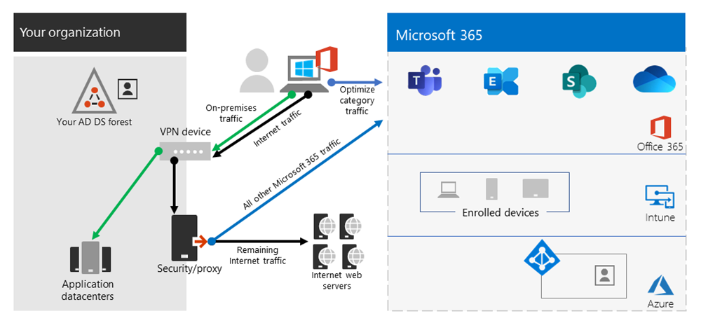
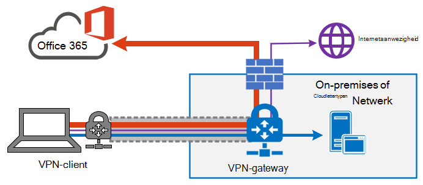

# Office 365-connectiviteit optimaliseren voor externe gebruikers met VPN-split-tunnelingOptimize Office 365 connectivity for remote users using VPN split tunneling
<!---
>[!NOTE]
>This topic is part of a set of topics that address Office 365 optimization for remote users.
>- For VPN split tunnel implementation guidance, see [Implementing VPN split tunneling for Office 365](microsoft-365-vpn-implement-split-tunnel.md).
>- For information about optimizing Office 365 worldwide tenant performance for users in China, see [Office 365 performance optimization for China users](microsoft-365-networking-china.md).
-->

Voor klanten die hun externe werk apparaten verbinden met het bedrijfsnetwerk of de Cloud infrastructuur via VPN, raden Microsoft aan dat de belangrijkste Office 365-scenario's **Microsoft teams**, **SharePoint Online** en **Exchange Online** worden gerouteerd via een _VPN-Splits tunnel_ configuratie.For customers who connect their remote worker devices to the corporate network or cloud infrastructure over VPN, Microsoft recommends that the key Office 365 scenarios **Microsoft Teams**, **SharePoint Online** and **Exchange Online** are routed over a _VPN split tunnel_ configuration. Dit wordt vooral van belang als de eerste regel strategie, zodat u de productiviteit van de werknemers in grote hoeveelheden werk vergemakkelijkt tijdens grootschalige activiteiten van COVID-19-crisis.This becomes especially important as the first line strategy to facilitate continued employee productivity during large scale work-from-home events such as the COVID-19 crisis.

_Afbeelding 1: een gesplitste VPN-oplossing met gedefinieerde Office 365-uitzonderingen die rechtstreeks naar de service zijn verzonden. Alle andere verkeer naar de VPN-tunnel, ongeacht de bestemming.__Figure 1: A VPN split tunnel solution with defined Office 365 exceptions sent directly to the service. All other traffic traverses the VPN tunnel regardless of destination._

De essentie van deze methode is het opzetten van een eenvoudige methode voor ondernemingen om het risico van verzadiging van de VPN-infrastructuur te beperken en de prestaties van Office 365 aanzienlijk te verbeteren.The essence of this approach is to provide a simple method for enterprises to mitigate the risk of VPN infrastructure saturation and dramatically improve Office 365 performance in the shortest timeframe possible. Als VPN-clients worden geconfigureerd zodat het meest kritieke, hoge volume Office 365-verkeer om de VPN-tunnel over te slaan de volgende voordelen opleveren:Configuring VPN clients to allow the most critical, high volume Office 365 traffic to bypass the VPN tunnel achieves the following benefits:

- Dit beperkt de hoofdoorzaak van een meerderheid van de door de klant gerapporteerde prestaties en problemen met de netwerkcapaciteit in Enterprise VPN-architecturen die invloed hebben op de gebruikerservaring van Office 365Immediately mitigates the root cause of a majority of customer-reported performance and network capacity issues in enterprise VPN architectures impacting Office 365 user experience
  
  De aanbevolen oplossing is speciaal bedoeld voor Office 365-service-eindpunten die zijn gecategoriseerd als **geoptimaliseerd** in het onderwerp [Office 365-url's en IP-](https://aka.ms/o365ips)adresbereiken.The recommended solution specifically targets Office 365 service endpoints categorized as **Optimize** in the topic [Office 365 URLs and IP address ranges](https://aka.ms/o365ips). Het verkeer naar deze eindpunten is zeer gevoelig voor latentie en bandbreedte, en zodat het niet mogelijk is om de eindgebruikers ervaring te verbeteren en de bedrijfsnetwerk te verkleinen.Traffic to these endpoints is highly sensitive to latency and bandwidth throttling, and enabling it to bypass the VPN tunnel can dramatically improve the end user experience as well as reduce the corporate network load. Office 365-verbindingen die niet het grootste deel van de bandbreedte of het footprint van gebruikerservaring vormen, kunnen nog steeds worden gerouteerd via de VPN-tunnel, samen met de rest van het Internet-netwerkverkeer.Office 365 connections that do not constitute the majority of bandwidth or user experience footprint can continue to be routed through the VPN tunnel along with the rest of the Internet-bound traffic. Zie [de strategieën voor gesplitste tunnels voor VPN-verbinding](#the-vpn-split-tunnel-strategy)voor meer informatie.For more information, see [The VPN split tunnel strategy](#the-vpn-split-tunnel-strategy).

- Kan met klanten snel worden geconfigureerd, getest en geïmplementeerd, en zonder extra infrastructuur of toepassingsvereistenCan be configured, tested and implemented rapidly by customers and with no additional infrastructure or application requirements

  Afhankelijk van het VPN-platform en de netwerkarchitectuur kan implementatie slechts enkele uren duren.Depending on the VPN platform and network architecture, implementation can take as little as a few hours. Zie voor meer informatie [VPN-Splits tunnel implementeren](microsoft-365-vpn-implement-split-tunnel.md#implement-vpn-split-tunneling).For more information, see [Implement VPN split tunneling](microsoft-365-vpn-implement-split-tunnel.md#implement-vpn-split-tunneling).

- Behoudt de beveiligings Posture van klant VPN-implementaties door niet de manier te wijzigen waarop andere verbindingen worden gerouteerd, waaronder verkeer naar Internet.Preserves the security posture of customer VPN implementations by not changing how other connections are routed, including traffic to the Internet

  Met de aanbevolen configuratie wordt het **minimale bevoegdheids** beginsel gevolgd voor uitzonderingen op VPN-verkeer en kunnen klanten gesplitste tunnel VPN implementeren zonder dat ze gebruikers of infrastructuur te zien krijgen voor extra beveiligingsrisico's.The recommended configuration follows the **least privilege** principle for VPN traffic exceptions and allows customers to implement split tunnel VPN without exposing users or infrastructure to additional security risks. Netwerkverkeer dat rechtstreeks naar Office 365-eindpunten is gerouteerd, is versleuteld, gevalideerd voor integriteit door Office-clienttoepassingen stapels en beperkt tot IP-adressen die zijn gekoppeld aan Office 365-services die worden verholpen op het niveau van de toepassing en het netwerk.Network traffic routed directly to Office 365 endpoints is encrypted, validated for integrity by Office client application stacks and scoped to IP addresses dedicated to Office 365 services which are hardened at both the application and network level. Zie voor meer informatie [alternatieve manieren voor beveiliging en een nieuwe manier om te profiteren van de moderne beveiligingsfuncties in de unieke extern werk van vandaag (Microsoft Security team-blog)](https://www.microsoft.com/security/blog/2020/03/26/alternative-security-professionals-it-achieve-modern-security-controls-todays-unique-remote-work-scenarios/).For more information, see [Alternative ways for security professionals and IT to achieve modern security controls in today's unique remote work scenarios (Microsoft Security Team blog)](https://www.microsoft.com/security/blog/2020/03/26/alternative-security-professionals-it-achieve-modern-security-controls-todays-unique-remote-work-scenarios/).

- Wordt native ondersteund door de meeste bedrijfs VPN-platformsIs natively supported by most enterprise VPN platforms

  Microsoft blijft samenwerken met partners die commerciële VPN-oplossingen produceren, zodat partners gerichte richtlijnen en configuratiesjablonen kunnen ontwikkelen voor hun oplossingen op basis van de bovenstaande aanbevelingen.Microsoft continues to collaborate with industry partners producing commercial VPN solutions to help partners develop targeted guidance and configuration templates for their solutions in alignment with the above recommendations. Ga voor meer informatie naar [handleidingen voor veelgebruikte VPN-platforms](microsoft-365-vpn-implement-split-tunnel.md#howto-guides-for-common-vpn-platforms).For more information, see [HOWTO guides for common VPN platforms](microsoft-365-vpn-implement-split-tunnel.md#howto-guides-for-common-vpn-platforms).

>[!TIP]
>Microsoft raadt aan om gesplitste tunnel VPN-configuraties te benoemen aan gedocumenteerde specifieke IP-bereiken voor Office 365-ServicesMicrosoft recommends focusing split tunnel VPN configuration on documented dedicated IP ranges for Office 365 services. Gesplitste, gesplitste tunnel configuraties op basis van een FQDN-verbinding en mogelijk conflicterende de belangrijkste Office 365-scenario's en een conflict met IP-routeringsregels op basis van een AppID.FQDN or AppID-based split tunnel configurations, while possible on certain VPN client platforms, may not fully cover key Office 365 scenarios and may conflict with IP based VPN routing rules. Daarom adviseren Microsoft de FQDN van Office 365 niet te gebruiken om de gesplitste tunnel VPN te configureren.For this reason, Microsoft does not recommend using Office 365 FQDNs to configure split tunnel VPN. Het gebruik van FQDN-configuratie kan handig zijn in andere gerelateerde scenario's, zoals het aanpassen van het PAC-bestand of voor het implementeren van proxy bypas.The use of FQDN configuration may be useful in other related scenarios, such as .pac file customizations or to implement proxy bypass.

Zie voor meer informatie over de implementatie van een [VPN-gesplitste tunneling voor Office 365](microsoft-365-vpn-implement-split-tunnel.md).For full implementation guidance, see [Implementing VPN split tunneling for Office 365](microsoft-365-vpn-implement-split-tunnel.md).

## Strategie voor gesplitste VPN-tunnelThe VPN split tunnel strategy

Traditionele bedrijfsnetwerken zijn vaak bedoeld om veilig te werken voor een oudere wereld waarbij de belangrijkste gegevens, services en toepassingen worden gehost en rechtstreeks verbonden zijn met het interne bedrijfsnetwerk, zoals het merendeel van de gebruikers.Traditional corporate networks are often designed to work securely for a pre-cloud world where most important data, services, applications are hosted on premises and are directly connected to the internal corporate network, as are the majority of users. Daarom is de netwerkinfrastructuur rondom deze elementen op die filialen verbonden met het hoofdkantoor via _Multiprotocol Label Switching (MPLS)-_ netwerken en moeten externe gebruikers verbinding maken met het bedrijfsnetwerk via een VPN voor toegang tot de on-premises eindpunten en Internet.Thus network infrastructure is built around these elements in that branch offices are connected to the head office via _Multiprotocol Label Switching (MPLS)_ networks, and remote users must connect to the corporate network over a VPN to access both on premises endpoints and the Internet. In dit model worden alle verkeer van externe gebruikers doorgestuurd naar het bedrijfsnetwerk en wordt de cloudservice via een gebruikelijk uitgangspunt gerouteerd.In this model, all traffic from remote users traverses the corporate network and is routed to the cloud service through a common egress point.

_Afbeelding 2: een veelvoorkomende VPN-oplossing voor externe gebruikers waarbij alle verkeer wordt afgedwongen in het bedrijfsnetwerk, ongeacht de bestemming__Figure 2: A common VPN solution for remote users where all traffic is forced back into the corporate network regardless of destination_

Aangezien organisaties gegevens en toepassingen verplaatsen naar de Cloud, is dit model minder effectief, omdat het snel en kostbaar van invloed is op de prestaties van het netwerk en de efficiëntie van gebruikers en de mogelijkheid van de organisatie de mogelijkheid te bieden om wijzigingen aan te brengen in het wijzigen van behoeften.As organizations move data and applications to the cloud, this model has begun to become less effective as it quickly becomes cumbersome, expensive and unscalable, significantly impacting network performance and efficiency of users and restricting the ability of the organization to adapt to changing needs. Diverse Microsoft-klanten hebben gerapporteerd dat een paar jaar geleden 80% van het netwerkverkeer tot een interne bestemming bevonden, maar in 2020 80% Plus van het verkeer maakt verbinding met een externe Cloud op basis van een resource.Numerous Microsoft customers have reported that a few years ago 80% of network traffic was to an internal destination, but in 2020 80% plus of traffic connects to an external cloud based resource.

Dit probleem is door de COVID-19 crisis verergert om direct oplossingen te bieden voor de grote meerderheid van de organisaties.The COVID-19 crisis has aggravated this problem to require immediate solutions for the vast majority of organizations. Veel klanten hebben vastgesteld dat het geforceerde VPN-model niet schaalbaar is en onvoldoende presteert voor 100% Remote werk scenario's, zoals voor zover deze crisis is vereist.Many customers have found that the forced VPN model is not scalable or performant enough for 100% remote work scenarios such as that which this crisis has necessitated. Snelle oplossingen zijn vereist voor deze organisatie om efficiënt te blijven werken.Rapid solutions are required for these organization to continue to operate efficiently.

Voor de Office 365-service is Microsoft de connectiviteits vereisten voor de service met dit probleem in gedachten veranderd, waarbij een gerichte, nauw beheerste en relatief vaste reeks service-eindpunten zeer eenvoudig en snel kunnen worden geoptimaliseerd, zodat gebruikers hoge prestaties kunnen bieden voor het openen van de service en de belasting van de VPN-infrastructuur kunnen reduceren, zodat deze kan worden gebruikt door verkeer waarvoorFor the Office 365 service, Microsoft has designed the connectivity requirements for the service with this problem squarely in mind, where a focused, tightly controlled and relatively static set of service endpoints can be optimized very simply and quickly so as to deliver high performance for users accessing the service, and reducing the burden on the VPN infrastructure so it can be used by traffic which still requires it.

In Office 365 worden de vereiste eindpunten voor Office 365 in drie categorieën ingedeeld: **optimaliseren**, **toestaan**en **standaard**.Office 365 categorizes the required endpoints for Office 365 into three categories: **Optimize**, **Allow**, and **Default**. Eindpunten **optimaliseren** onze focus hier en heeft de volgende kenmerken:**Optimize** endpoints are our focus here and have the following characteristics:

- Microsoft bezit en beheerde eindpunten, gehost op Microsoft-infrastructuurAre Microsoft owned and managed endpoints, hosted on Microsoft infrastructure
- Specifiek zijn voor kern werk365kosten belastingen van Office, zoals Exchange Online, SharePoint Online, Skype voor bedrijven online en Microsoft teamsAre dedicated to core Office 365 workloads such as Exchange Online, SharePoint Online, Skype for Business Online, and Microsoft Teams
- Gebiedt IPsHave IPs provided
- Lage veranderings kosten en ze worden naar behoren genummerd (momenteel 20 IP-subnetten)Low rate of change and are expected to remain small in number (currently 20 IP subnets)
- Een hoog volume en/of een gevoelige latentieAre high volume and/or latency sensitive
- Kan de vereiste beveiligingselementen in de service niet gebruiken in plaats van in de regel op het netwerk.Are able to have required security elements provided in the service rather than inline on the network
- Account rondom 70-80% van het volume verkeer naar de Office 365-serviceAccount for around 70-80% of the volume of traffic to the Office 365 service

Deze straks ingestelde serie eindpunten kunnen in de geforceerde VPN-tunnel worden opgesplitst en veilig en rechtstreeks naar de Office 365-service verzonden via de lokale interface van de gebruiker.This tightly scoped set of endpoints can be split out of the forced VPN tunnel and sent securely and directly to the Office 365 service via the user's local interface. Dit is een zogenaamde **gesplitste tunneling**.This is known as **split tunneling**.

Beveiligingselementen zoals DLP, beveiliging tegen AV, authenticatie en toegangsbeheer kunnen allemaal veel efficiënter voor deze eindpunten op verschillende lagen binnen de service worden geleverd.Security elements such as DLP, AV protection, authentication and access control can all be delivered much more efficiently against these endpoints at different layers within the service. Aangezien we de bulk van het verkeersvolume van de VPN-oplossing van de VPN-oplossing verder aanleidingen, dan wordt er nu de VPN-capaciteit vrijgemaakt voor kritieke activiteiten van het bedrijf, wat er nog steeds wordt gebruikgemaakt.As we also divert the bulk of the traffic volume away from the VPN solution, this frees the VPN capacity up for business critical traffic which still relies on it. Het is ook mogelijk om in veel gevallen de noodzaak te verwijderen om een lang en kosten upgradeprogramma te doorlopen, zodat deze nieuwe manier van werken kan worden verwerkt.It also should remove the need in many cases to go through a lengthy and costly upgrade program to deal with this new way of operating.

_Afbeelding 3: een gesplitste VPN-oplossing met gedefinieerde Office 365-uitzonderingen die rechtstreeks naar de service zijn verzonden. Alle andere verkeer wordt in het bedrijfsnetwerk geforceerd weergeven, ongeacht de bestemming.__Figure 3: A VPN split tunnel solution with defined Office 365 exceptions sent direct to the service. All other traffic is forced back into the corporate network regardless of destination._

Vanuit een beveiligings perspectief heeft Microsoft een reeks beveiligingsfuncties die kan worden gebruikt om vergelijkbaar te zijn, of zelfs een verbeterde beveiliging te leveren dan de inline-inspectie door on-premises beveiligings stacks te bezorgen.From a security perspective, Microsoft has an array of security features which can be used to provide similar, or even enhanced security than that delivered by inline inspection by on premises security stacks. De blogberichten van het Microsoft-beveiligingsteam [en de IT-medewerkers voor een modernere beveiligings regeling in de unieke functies voor extern bewerken van vandaag](https://www.microsoft.com/security/blog/2020/03/26/alternative-security-professionals-it-achieve-modern-security-controls-todays-unique-remote-work-scenarios/) is een duidelijk overzicht van de beschikbare functies en u vindt meer gedetailleerde informatie in dit artikel.The Microsoft Security team's blog post [Alternative ways for security professionals and IT to achieve modern security controls in today's unique remote work scenarios](https://www.microsoft.com/security/blog/2020/03/26/alternative-security-professionals-it-achieve-modern-security-controls-todays-unique-remote-work-scenarios/) has a clear summary of features available and you'll find more detailed guidance within this article. U kunt ook lezen over de implementatie van de VPN-splitsing van Microsoft aan de slag [op een VPN-verbinding](https://www.microsoft.com/itshowcase/blog/running-on-vpn-how-microsoft-is-keeping-its-remote-workforce-connected/?elevate-lv).You can also read about Microsoft's implementation of VPN split tunneling at [Running on VPN: How Microsoft is keeping its remote workforce connected](https://www.microsoft.com/itshowcase/blog/running-on-vpn-how-microsoft-is-keeping-its-remote-workforce-connected/?elevate-lv).

In veel gevallen kan deze implementatie in enkele gevallen worden verwezenlijkt, zodat een van de meest waarschijnlijke problemen met organisaties snel op de hoogte wordt gesteld als ze snel op de volledige schaal werken.In many cases, this implementation can be achieved in a matter of hours, allowing rapid resolution to one of the most pressing problems facing organizations as they rapidly shift to full scale remote working. Zie voor de implementatie van een VPN-gesplitste tunnel [in Office 365](microsoft-365-vpn-implement-split-tunnel.md).For VPN split tunnel implementation guidance, see [Implementing VPN split tunneling for Office 365](microsoft-365-vpn-implement-split-tunnel.md).

>[!NOTE]
>Microsoft heeft vastgelegd dat wijzigingen in de eindpunten van Office 365 worden **geoptimaliseerd** tot ten minste **30 2020**, zodat gebruikers zich kunnen richten op andere uitdagingen dan in plaats van de whitelist na uitvoering.Microsoft has committed to suspending changes to **Optimize** endpoints for Office 365 until at least **June 30 2020**, allowing customers to focus on other challenges rather than maintaining the endpoint whitelist once initially implemented.

## Verwante onderwerpenRelated topics

[Gesplitste VPN-tunneling implementeren voor Office 365Implementing VPN split tunneling for Office 365](microsoft-365-vpn-implement-split-tunnel.md)

[Prestaties van Office 365 optimaliseren voor gebruikers van ChinaOffice 365 performance optimization for China users](microsoft-365-networking-china.md)

[Andere manieren voor beveiliging en een nieuwe manier om te profiteren van de moderne beveiligingsfuncties in de unieke, externe werk scenario's van vandaag (blog van Microsoft Security team)Alternative ways for security professionals and IT to achieve modern security controls in today's unique remote work scenarios (Microsoft Security Team blog)](https://www.microsoft.com/security/blog/2020/03/26/alternative-security-professionals-it-achieve-modern-security-controls-todays-unique-remote-work-scenarios/)

[VPN-prestaties verbeteren bij Microsoft: met Windows 10 VPN-profielen voor het toestaan van automatische verbindingenEnhancing VPN performance at Microsoft: using Windows 10 VPN profiles to allow auto-on connections](https://www.microsoft.com/itshowcase/enhancing-remote-access-in-windows-10-with-an-automatic-vpn-profile)

[Uitvoeren op VPN: hoe Microsoft de werknemers op afstand houdtRunning on VPN: How Microsoft is keeping its remote workforce connected](https://www.microsoft.com/itshowcase/blog/running-on-vpn-how-microsoft-is-keeping-its-remote-workforce-connected/?elevate-lv)

[Methoden voor netwerkverbindingen in Office 365Office 365 Network Connectivity Principles](microsoft-365-network-connectivity-principles.md)

[Een beoordeling van de netwerkverbinding van Office 365Assessing Office 365 network connectivity](assessing-network-connectivity.md)

[Microsoft 365 connectiviteitstestMicrosoft 365 connectivity test](https://aka.ms/netonboard)
