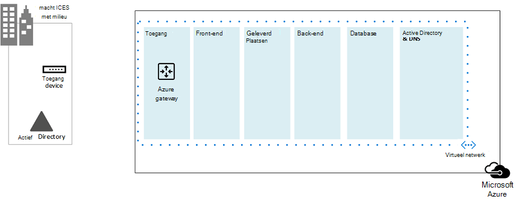
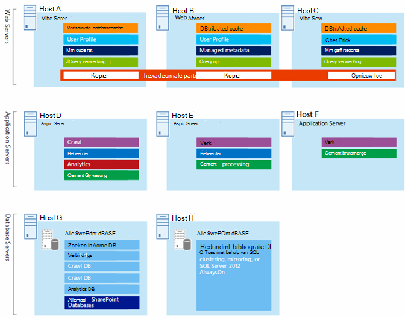
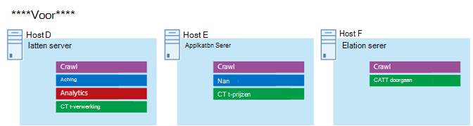
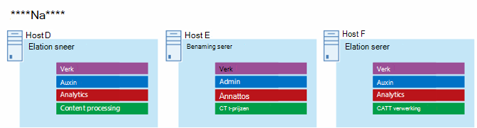
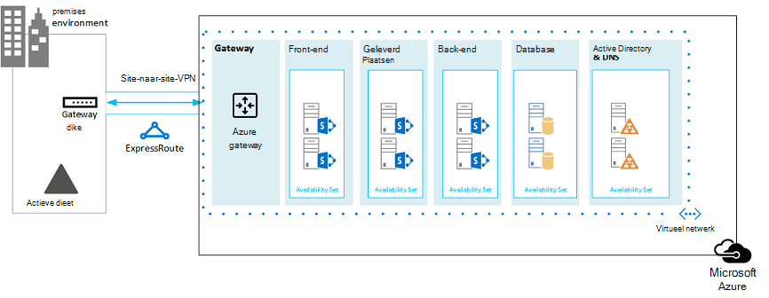

# Microsoft Azure Architectures voor SharePoint 2013

Azure is een goede omgeving voor het hosten van een SharePoint Server 2013-oplossing. In de meeste gevallen raden we Microsoft 365 aan, maar een SharePoint Server-farm die wordt gehost in Azure, kan een goede optie zijn voor specifieke oplossingen. In dit artikel wordt beschreven hoe u SharePoint-oplossingen ontwerpt, zodat deze geschikt zijn voor het Azure-platform. De volgende twee specifieke oplossingen worden als voorbeelden gebruikt:
  
- [Calamiteitenherstel SharePoint Server 2013 in Microsoft Azure](sharepoint-server-2013-disaster-recovery-in-microsoft-azure.md)
    
- [Internetsites in Microsoft Azure met SharePoint Server 2013](internet-sites-in-microsoft-azure-using-sharepoint-server-2013.md)
    
## Aanbevolen SharePoint-oplossingen voor Azure Infrastructure Services

Azure Infrastructure Services is een aantrekkelijke optie voor het hosten van SharePoint-oplossingen. Sommige oplossingen passen beter bij dit platform dan andere. In de volgende tabel ziet u aanbevolen oplossingen.
  
|**Oplossing**|**Waarom deze oplossing wordt aanbevolen voor Azure**|
|:-----|:-----|
|Ontwikkel- en testomgevingen    |U kunt deze omgevingen eenvoudig maken en beheren.    |
|Herstel na nood van on-premises SharePoint-farms naar Azure    |**Gehost secundair datacenter** Gebruik Azure in plaats van te investeren in een secundair datacenter in een andere regio.   **Voordelige omgevingen voor herstel na noodherstel** Onderhoud en betaal voor minder resources dan een on-premises herstelomgeving voor rampen. Het aantal resources is afhankelijk van de omgeving voor noodherstel die u kiest: koud stand-by, warm stand-by of hot standby.   **Meer elastisch platform** In geval van een ramp kunt u eenvoudig de sharePoint-herstelfarm uitschalen om te voldoen aan de belastingsvereisten. Schaal in wanneer u de resources niet meer nodig hebt.   Zie [SharePoint Server 2013 Disaster Recovery in Microsoft Azure](sharepoint-server-2013-disaster-recovery-in-microsoft-azure.md).    |
|Internetsites die gebruikmaken van functies en schaal die niet beschikbaar zijn in Microsoft 365    |**Focus uw inspanningen** Concentreer u op het bouwen van een geweldige site in plaats van op het bouwen van infrastructuur.   **Profiteer van elasticiteit in Azure** De farm groot maken voor de vraag door nieuwe servers toe te voegen en alleen te betalen voor resources die u nodig hebt. Dynamische machinetoewijzing wordt niet ondersteund (automatische schaal).   **Azure Active Directory (AD) gebruiken** Profiteer van Azure AD voor klantaccounts.   **SharePoint-functionaliteit toevoegen die niet beschikbaar is in Microsoft 365** Voeg diepgaande rapportage en webanalyse toe.   Zie [Internetsites in Microsoft Azure met SharePoint Server 2013](internet-sites-in-microsoft-azure-using-sharepoint-server-2013.md).    |
|App-farms ter ondersteuning van Microsoft 365- of on-premises omgevingen    |**Maak, test en host apps** in Azure om zowel on-premises als cloudomgevingen te ondersteunen.   **Host deze rol** in Azure in plaats van nieuwe hardware te kopen voor on-premises omgevingen.   |
   
Voor intranet- en samenwerkingsoplossingen en werkbelastingen kunt u de volgende opties gebruiken:
  
- Bepaal of Microsoft 365 voldoet aan uw bedrijfsvereisten of deel kan uitmaken van de oplossing. Microsoft 365 biedt een uitgebreide functieset die altijd up-to-date is.
    
- Als Microsoft 365 niet aan alle bedrijfsvereisten voldoet, kunt u een standaard implementatie van SharePoint 2013 on-premises overwegen vanuit Microsoft Consulting Services (MCS). Een standaardarchitectuur kan een snellere, goedkopere en eenvoudigere oplossing zijn die u kunt ondersteunen dan een aangepaste architectuur. 
    
- Als een standaard implementatie niet aan uw bedrijfsvereisten voldoet, kunt u een aangepaste on-premises oplossing overwegen.
    
- Als het gebruik van een cloudplatform belangrijk is voor uw zakelijke vereisten, overweegt u een standaard- of aangepaste implementatie van SharePoint 2013 die wordt gehost in Azure-infrastructuurservices. SharePoint-oplossingen zijn veel gemakkelijker te ondersteunen in Azure dan andere niet-native openbare cloudplatforms van Microsoft.
    
## Voordat u de Azure-omgeving ontwerpt

Hoewel in dit artikel voorbeeld van SharePoint-toologieën wordt gebruikt, kunt u deze ontwerpconcepten gebruiken met elke SharePoint-farmtopologie. Voordat u de Azure-omgeving ontwerpt, gebruikt u de volgende richtlijnen voor topologie, architectuur, capaciteit en prestaties om de SharePoint-farm te ontwerpen:
  
- [Architectuurontwerp voor IT-professionals van SharePoint 2013](/SharePoint/technical-reference/technical-diagrams)
    
- [Plannen voor prestatie- en capaciteitsbeheer in SharePoint Server 2013](/SharePoint/administration/performance-planning-in-sharepoint-server-2013)
    
## Het active directory-domeintype bepalen

Elke SharePoint Server-farm is afhankelijk van Active Directory om beheerdersaccounts te bieden voor de installatie van de farm. Op dit moment zijn er twee opties voor SharePoint-oplossingen in Azure. Deze worden in de volgende tabel beschreven.
  
|**Optie**|**Beschrijving**|
|:-----|:-----|
|Toegewezen domein    |U kunt een speciaal en geïsoleerd Active Directory-domein implementeren naar Azure om uw SharePoint-farm te ondersteunen. Dit is een goede keuze voor openbare internetsites.    |
|Het on-premises domein uitbreiden via een cross-premises verbinding    |Wanneer u het on-premises domein uitbreidt via een lokale verbinding, hebben gebruikers toegang tot de SharePoint-farm via uw intranet alsof het on-premises wordt gehost. U kunt profiteren van uw on-premises Active Directory- en DNS-implementatie.    Er is een cross-premises verbinding vereist voor het bouwen van een omgeving voor herstel na nood in Azure om over te gaan naar uw on-premises farm.    |
   
Dit artikel bevat ontwerpconcepten voor het uitbreiden van het on-premises domein via een cross-premises verbinding. Als uw oplossing een toegewezen domein gebruikt, hebt u geen cross-premises verbinding nodig.
  
## Het virtuele netwerk ontwerpen

Eerst hebt u een virtueel netwerk nodig in Azure, dat subnetten bevat waarop u uw virtuele machines wilt plaatsen. Het virtuele netwerk heeft een persoonlijke IP-adresruimte nodig, waarvan u gedeelten aan de subnetten toewijst.
  
Als u uw on-premises netwerk uitbreidt naar Azure via een cross-premises verbinding (vereist voor een herstelomgeving voor noodscenario's), moet u een privéadresruimte kiezen die nog niet ergens anders in uw organisatienetwerk wordt gebruikt, waaronder uw on-premises omgeving en andere virtuele Azure-netwerken. 
  
**Afbeelding 1: On-premises omgeving met een virtueel netwerk in Azure**

  
In dit diagram:
  
- Een virtueel netwerk in Azure wordt naast de on-premises omgeving geïllustreerd. De twee omgevingen zijn nog niet verbonden via een cross-premises verbinding, wat een SITE-to-site VPN-verbinding of ExpressRoute kan zijn.
    
- Op dit moment bevat het virtuele netwerk alleen de subnetten en geen andere architecturale elementen. Eén subnet host de Azure Gateway en andere subnetten hosten de lagen van de SharePoint-farm, met een extra subnet voor Active Directory en DNS.
    
## Cross-premises connectiviteit toevoegen

De volgende implementatiestap is het maken van de cross-premises verbinding (als dit van toepassing is op uw oplossing). Voor cross-premises verbindingen bevindt een Azure-gateway zich in een afzonderlijk gateway-subnet, dat u een adresruimte moet maken en toewijzen. 
  
Wanneer u een cross-premises verbinding wilt plannen, definieert en maakt u een Azure-gateway en een verbinding met een on-premises gatewayapparaat.
  
**Afbeelding 2: Een Azure-gateway en een on-premises gateway-apparaat gebruiken om site-naar-site-connectiviteit te bieden tussen de on-premises omgeving en Azure**

  
In dit diagram:
  
- Als u het vorige diagram toevoegt, wordt de on-premises omgeving verbonden met het virtuele Azure-netwerk via een cross-premises verbinding, wat een SITE-to-site VPN-verbinding of ExpressRoute kan zijn.
    
- Een Azure-gateway staat op een gateway-subnet.
    
- De on-premises omgeving bevat een gatewayapparaat, zoals een router of VPN-server.
    
Zie Een [on-premises](connect-an-on-premises-network-to-a-microsoft-azure-virtual-network.md)netwerk verbinden met een virtueel Microsoft Azure-netwerk voor meer informatie over het plannen en maken van een lokaal virtueel netwerk.
  
## Active Directory Domain Services (AD DS) en DNS toevoegen

Voor noodherstel in Azure implementeert u Windows Server AD en DNS in een hybride scenario waarin Windows Server AD zowel on-premises als op Azure-virtuele machines wordt geïmplementeerd.
  
**Afbeelding 3: Hybride Active Directory-domeinconfiguratie**

  
Dit diagram bouwt voort op de vorige diagrammen door twee virtuele machines toe te voegen aan een Windows Server AD- en DNS-subnet. Deze virtuele machines zijn replicadomeincontrollers en DNS-servers. Ze zijn een uitbreiding van de on-premises Windows Server AD-omgeving. 
  
De volgende tabel bevat configuratieaanbevelingen voor deze virtuele machines in Azure. Gebruik deze als uitgangspunt voor het ontwerpen van uw eigen omgeving, zelfs voor een specifiek domein waarin uw Azure-omgeving niet communiceert met uw on-premises omgeving.
  
|**Item**|**Configuratie**|
|:-----|:-----|
|Virtuele machinegrootte in Azure    |A1- of A2-grootte in de standaardlaag    |
|Besturingssysteem    |Windows Server 2012 R2    |
|Active Directory-rol    |AD DS-domeincontroller die is aangewezen als een globale catalogusserver. Met deze configuratie wordt het uittredingsverkeer voor de cross-premises verbinding beperkt.    In een omgeving met meerdere domeinen met hoge wijzigingspercentages (dit is niet gebruikelijk) configureert u domeincontrollers on-premises om niet te synchroniseren met de globale catalogusservers in Azure, om het replicatieverkeer te verminderen.    |
|DNS-rol    |Installeer en configureer de DNS Server-service op de domeincontrollers.    |
|Gegevensschijf    |Plaats de Active Directory-database, logboeken en SYSVOL op extra Azure-gegevensschijfjes. Plaats deze niet op de schijf van het besturingssysteem of de tijdelijke schijven die door Azure worden geleverd.    |
|IP-adressen    |Gebruik statische IP-adressen en configureer het virtuele netwerk om deze adressen toe te wijzen aan de virtuele machines in het virtuele netwerk nadat de domeincontrollers zijn geconfigureerd.    |
   
> [!IMPORTANT]
> Lees Richtlijnen voor het implementeren van Windows Server Active Directory op Azure Virtual Machines voordat u Active Directory implementeert in [Azure.](/windows-server/identity/ad-ds/introduction-to-active-directory-domain-services-ad-ds-virtualization-level-100) Op deze manier kunt u bepalen of er een andere architectuur of andere configuratie-instellingen nodig zijn voor uw oplossing. 
  
## De SharePoint-farm toevoegen

Plaats de virtuele machines van de SharePoint-farm in lagen op de juiste subnetten.
  
**Afbeelding 4: Plaatsing van virtuele SharePoint-machines**

  
Dit diagram bouwt voort op de vorige diagrammen door de SharePoint-farmserverrollen toe te voegen aan hun respectieve lagen.
  
- Met twee database virtuele machines met SQL Server wordt de databaselaag gemaakt.
    
- Twee virtuele machines met SharePoint Server 2013 voor elk van de volgende lagen: front-endservers, servers met gedistribueerde cache en back-endservers.
    
## Serverrollen ontwerpen en afstemmen op beschikbaarheidssets en foutdomeinen

Een foutdomein is een groepering van hardware waarin rol-exemplaren worden uitgevoerd. Virtuele machines binnen hetzelfde foutdomein kunnen tegelijkertijd worden bijgewerkt door de Azure-infrastructuur. Of ze kunnen tegelijk mislukken omdat ze hetzelfde rek delen. Om het risico te vermijden dat er twee virtuele machines in hetzelfde foutdomein staan, kunt u uw virtuele machines configureren als een beschikbaarheidsset, waardoor elke virtuele machine zich in een ander foutdomein heeft. Als drie virtuele machines zijn geconfigureerd als een beschikbaarheidsset, garandeert Azure dat niet meer dan twee van de virtuele machines zich in hetzelfde foutdomein bevinden.
  
Wanneer u de Azure-architectuur voor een SharePoint-farm ontwerpt, configureert u identieke serverrollen om deel uit te maken van een beschikbaarheidsset. Dit zorgt ervoor dat uw virtuele machines verspreid zijn over meerdere foutdomeinen.
  
**Afbeelding 5: Azure Availability Sets gebruiken om hoge beschikbaarheid te bieden voor de SharePoint-farmlagen**

  
In dit diagram wordt de configuratie van beschikbaarheidssets binnen de Azure-infrastructuur weergegeven. Elk van de volgende rollen heeft een afzonderlijke beschikbaarheidsset:
  
- Active Directory en DNS
    
- Database
    
- Back-end
    
- Cache distribueren
    
- Front end
    
De SharePoint-farm moet mogelijk worden aangepast in het Azure-platform. Als u een hoge beschikbaarheid van alle onderdelen wilt garanderen, moet u ervoor zorgen dat de serverrollen allemaal identiek zijn geconfigureerd.
  
Hier ziet u een voorbeeld van een standaardarchitectuur voor internetsites die voldoet aan specifieke capaciteits- en prestatiedoelen. Dit voorbeeld wordt vermeld in het volgende architectuurmodel: Zoekarchitectuur voor [internetsites voor SharePoint Server 2013.](https://go.microsoft.com/fwlink/p/?LinkId=261519)
  
**Afbeelding 6: Planningsvoorbeeld voor capaciteits- en prestatiedoelen in een farm met drie niveaus**

  
In dit diagram:
  
- Er wordt een farm met drie niveaus weergegeven: webservers, toepassingsservers en databaseservers.
    
- De drie webservers zijn identiek geconfigureerd met meerdere onderdelen.
    
- De twee databaseservers zijn identiek geconfigureerd.
    
- De drie toepassingsservers zijn niet identiek geconfigureerd. Deze serverrollen moeten worden afgestemd op beschikbaarheidssets in Azure.
    
Laten we de toepassingsserverlaag nader bekijken.
  
**Afbeelding 7: Application Server Tier before fine tuning**

  
In dit diagram:
  
- Er zijn drie servers opgenomen in de toepassingslaag.
    
- De eerste server bevat vier onderdelen.
    
- De tweede server bevat drie onderdelen.
    
- De derde server bevat twee onderdelen.
    
U bepaalt het aantal onderdelen op basis van de prestatie- en capaciteitsdoelen voor de farm. Als u deze architectuur voor Azure wilt aanpassen, repliceren we de vier onderdelen op alle drie servers. Hierdoor wordt het aantal onderdelen groter dan nodig is voor prestaties en capaciteit. De afweging is dat dit ontwerp zorgt voor een hoge beschikbaarheid van alle vier onderdelen in het Azure-platform wanneer deze drie virtuele machines zijn toegewezen aan een beschikbaarheidsset.
  
**Afbeelding 8: Application Server Tier after fine tuning**

  
In dit diagram ziet u alle drie toepassingsservers die identiek zijn geconfigureerd met dezelfde vier onderdelen.
  
Wanneer we beschikbaarheidssets toevoegen aan de lagen van de SharePoint-farm, is de implementatie voltooid.
  
**Afbeelding 9: De voltooide SharePoint-farm in Azure-infrastructuurservices**

  
In dit diagram ziet u de SharePoint-farm die is geïmplementeerd in Azure-infrastructuurservices, met beschikbaarheidssets voor foutdomeinen voor de servers in elke laag.
  
## Zie ook

[Microsoft 365-oplossings- en -architectuurcentrum](../solutions/index.yml)
  
[Internetsites in Microsoft Azure met SharePoint Server 2013](internet-sites-in-microsoft-azure-using-sharepoint-server-2013.md)
  
[Calamiteitenherstel SharePoint Server 2013 in Microsoft Azure](sharepoint-server-2013-disaster-recovery-in-microsoft-azure.md)