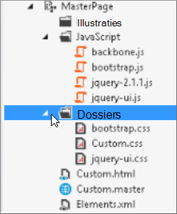
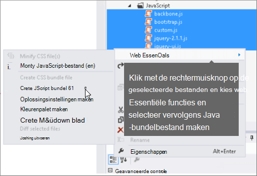
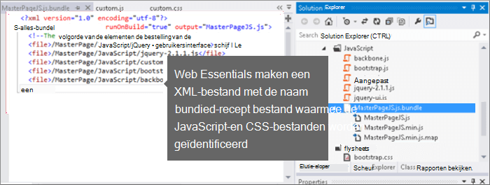
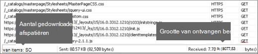
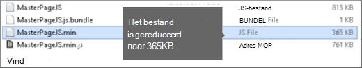
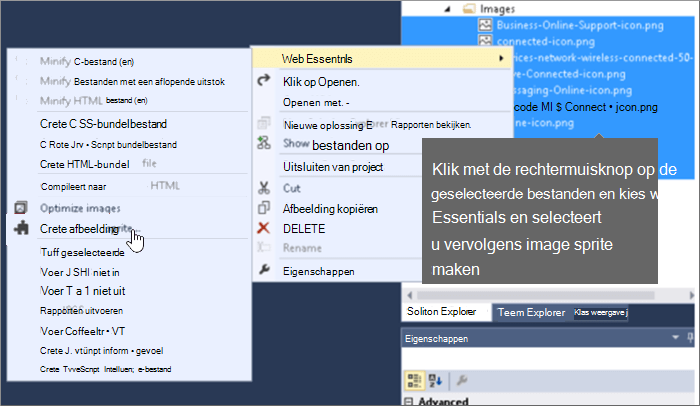

# Minificatie en bundeling in SharePoint Online

In dit artikel wordt beschreven hoe u minificatie- en bundelingstechnieken gebruikt met Web Essentials om het aantal HTTP-aanvragen te verminderen en de tijd te beperken die nodig is om pagina's in SharePoint Online te laden.
  
Wanneer u uw website aanpast, kunt u uiteindelijk een groot aantal extra bestanden toevoegen aan de server ter ondersteuning van de aanpassing. Als u extra JavaScript, CSS en afbeeldingen toevoegt, neemt het aantal HTTP-aanvragen toe aan de server, waardoor de weergave van een webpagina langer duurt. Als u meerdere bestanden van hetzelfde type hebt, kunt u deze bestanden bundelen, zodat u deze bestanden sneller kunt downloaden.
  
Voor JavaScript- en CSS-bestanden kunt u ook een methode genaamd minification gebruiken, waarbij u de totale grootte van bestanden verkleint door whitespace en andere tekens te verwijderen die niet nodig zijn.
  
## JavaScript- en CSS-bestanden minification en bundelen met Web Essentials

U kunt software van derden, zoals Web Essentials, gebruiken om CSS- en JavaScript-bestanden te bundelen.
  
> [!IMPORTANT]
> Web Essentials is een project van derden, open-source, community-based. De software is een uitbreiding naar Visual Studio 2012 en Visual Studio 2013 en wordt niet ondersteund door Microsoft. Als u Web Essentials wilt downloaden, gaat u naar de website op [https://vswebessentials.com/download](https://go.microsoft.com/fwlink/p/?LinkId=525629) . 
  
Web Essentials biedt twee vormen van bundeling:
  
- .bundle: voor CSS- en JavaScript-bestanden
    
- .sprite: voor afbeeldingen (alleen beschikbaar in Visual Studio 2013)
    
U kunt Web Essentials gebruiken als u een bestaande functie hebt met enkele huisstijlelementen waarnaar wordt verwezen op een aangepaste basispagina, zoals:
  

  
 **Een TE000127218- en CSS-bundel maken in Web Essentials**
  
1. Selecteer Visual Studio in Solution Explorer de bestanden die u in de bundel wilt opnemen.
    
2. Klik met de rechtermuisknop op de geselecteerde bestanden en selecteer **vervolgens Web Essentials** \> **JavaScript-bundelbestand maken** in het contextmenu. Bijvoorbeeld: 
    
    
  
## De resultaten van het bundelen van JavaScript- en CSS-bestanden weergeven

Wanneer u een JavaScript- en CSS-bundel maakt, wordt in Web Essentials een XML-bestand gemaakt dat een receptbestand wordt genoemd waarin de JavaScript- en CSS-bestanden worden geïdentificeerd, evenals enkele andere configuratiegegevens: 
  

  
Als de minify-vlag is ingesteld op waar in het bundelingsrecept, worden de bestanden bovendien verkleind en gebundeld. Dit betekent dat er nieuwe, minified versies van de JavaScript-bestanden zijn gemaakt waarnaar u op de basispagina kunt verwijzen.
  

  
Wanneer u een pagina laadt vanaf uw website, kunt u de hulpprogramma's voor ontwikkelaars vanuit uw webbrowser, zoals Internet Explorer 11, gebruiken om het aantal aanvragen te bekijken dat naar de server is verzonden en hoe lang het laden van elk bestand duurde.
  
De volgende afbeelding is het resultaat van het laden van de JavaScript- en CSS-bestanden vóór minificatie.
  

  
Na het bundelen van de CSS- en JavaScript-bestanden is het aantal aanvragen gedaald tot 74 en duurde het downloaden van elk bestand iets langer dan de oorspronkelijke bestanden afzonderlijk:
  

  
Na bundeling wordt het JavaScript-bundelbestand aanzienlijk teruggebracht van 815 KB naar 365 KB:
  

  
## Afbeeldingen bundelen door een afbeeldingsspite te maken

Net zoals u JavaScript- en CSS-bestanden bundelt, kunt u veel kleine pictogrammen en andere veelgebruikte afbeeldingen combineren tot een groter spriteblad en vervolgens CSS gebruiken om de afzonderlijke afbeeldingen weer te geven. In plaats van elke afzonderlijke afbeelding te downloaden, downloadt de webbrowser van de gebruiker het spriteblad eenmaal en cachet deze vervolgens op de lokale computer. Dit verbetert de laadprestaties van pagina's door het aantal downloads en retouren naar de webserver te beperken.
  
 **Een afbeeldingsspite maken in Web Essentials**
  
1. Selecteer Visual Studio in Solution Explorer de bestanden die u in de bundel wilt opnemen.
    
2. Klik met de rechtermuisknop op de geselecteerde bestanden en selecteer **vervolgens Web Essentials** \> **Afbeelding maken sprite** in het contextmenu. Bijvoorbeeld: 
    
    
  
3. Kies een locatie om het sprite-bestand op te slaan. Het SPRITE-bestand is een XML-bestand waarin de instellingen en bestanden in de sprite worden beschreven. In de volgende cijfers wordt een voorbeeld van een sprite PNG-bestand en het bijbehorende .sprite XML-bestand ervan becijferd.
    
    
  
    
  

