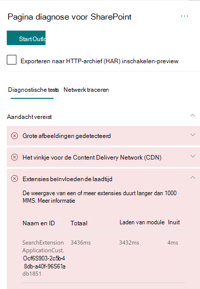

# De prestaties van aangepaste uitbreidingen op sites met moderne SharePoint Online optimaliserenOptimize custom extension performance in SharePoint Online modern site pages

In dit artikel wordt uitgelegd hoe u kunt bepalen hoe aangepaste extensies van invloed zijn op de beschikbare latentie van de gebruiker en hoe u veelvoorkomende problemen kunt oplossen.This article will help you understand how to determine how custom extensions affect user perceived latency, and how to remediate common issues.

## Het hulpprogramma pagina diagnose voor SharePoint gebruiken om aangepaste extensies te analyserenUse the Page Diagnostics for SharePoint tool to analyze custom extensions

Het hulpprogramma pagina diagnose voor SharePoint is een browser extensie voor de nieuwe Microsoft Edge- https://www.microsoft.com/edge) en Chrome-browsers die zowel SharePoint Online modern portal als de klassieke publicatiesite pagina's analyseren.The Page Diagnostics for SharePoint tool is a browser extension for the new Microsoft Edge (https://www.microsoft.com/edge) and Chrome browsers that analyzes both SharePoint Online modern portal and classic publishing site pages. Het hulpmiddel biedt een rapport voor elke geanalyseerde pagina op basis van een gedefinieerde set prestatiecriteria.The tool provides a report for each analyzed page showing how the page performs against a defined set of performance criteria. Ga voor meer informatie over het hulpprogramma pagina diagnose voor SharePoint naar [het hulpprogramma pagina diagnose voor SharePoint Online](page-diagnostics-for-spo.md).To install and learn about the Page Diagnostics for SharePoint tool, visit [Use the Page Diagnostics tool for SharePoint Online](page-diagnostics-for-spo.md).

>[!NOTE]
>Het hulpmiddel voor het automatisch toevoegen van pagina's werkt alleen voor SharePoint Online en kan niet worden gebruikt op een SharePoint-systeempagina.The Page Diagnostics tool only works for SharePoint Online, and cannot be used on a SharePoint system page.

Wanneer u een pagina van een SharePoint-site wilt analyseren met het hulpprogramma pagina diagnose voor SharePoint, kunt u informatie weergeven over aangepaste extensies die de metric-Metric van de **uitbreidingen beïnvloeden** en/of het resultaat van **te veel uitbreidingen** in het deelvenster _diagnostische tests_ .When you analyze a SharePoint site page with the Page Diagnostics for SharePoint tool, you can see information about custom extensions that exceed the baseline metric in the **Extensions are impacting load time** and/or the **Too many extensions used** result in the _Diagnostic tests_ pane 

Mogelijke resultaten zijn onder meer:Possible results include:

- **Aandacht vereist** (rood): elke _aangepaste_ extensie die langer dan **één** seconde duurt om te worden geladen.**Attention required** (red): Any _custom_ extension that takes longer than **one** second to load. Totale laadtijd, zoals weergegeven in testresultaten, wordt opgesplitst via module laden en init.Total load time as displayed in test results is broken down by module load and init. Ook als er te veel extensies zijn op een pagina, kunnen ze de laadtijd van de pagina beïnvloeden en worden deze gemarkeerd als er **zeven** of meer extensies worden gebruikt op de pagina.Additionally, if there are too many extensions on a page they can impact the page load time and this will be highlighted if **seven** or more extensions are used on the page.
- **Verbeterings mogelijkheden** (geel) als er **vijf** of meer uitbreidingen worden gebruikt, worden deze gemarkeerd in deze sectie als een waarschuwing totdat zeven of meer worden gebruikt die vervolgens worden gemarkeerd als aandacht vereist.**Improvement Opportunities** (yellow) If **five** or more extensions are used they will be highlighted in this section as a warning until seven or more are used which will then be highlighted as Attention Required.
- **Geen actie vereist** (groen): geen enkele uitbreiding duurt langer dan één seconde voor de belasting.**No action required** (green): No extension is taking longer than one second to load.

Als een extensie van invloed is op de laadtijd van pagina's of er te veel extsnions op de pagina staan, wordt het resultaat weergegeven in de sectie **aandacht vereist** van de resultaten.If an extension is impacting page load time or there are too many extsnions on the page, the result appears in the **Attention required** section of the results. Klik op het resultaat om de details te bekijken van de module die langzaam wordt geladen of te veel extensies is gemarkeerd.Click the result to see details about which extension is loading slowly or too many extensions has been highlighted. Toekomstige updates voor het hulpprogramma pagina diagnose voor SharePoint bevatten mogelijk updates voor analyseregels, dus zorg ervoor dat u altijd de nieuwste versie van het hulpmiddel hebt.Future updates to the Page Diagnostics for SharePoint tool may include updates to analysis rules, so please ensure you always have the latest version of the tool.

Gegevens die in de resultaten worden weergegeven zijn onder meer:Information available in the results includes:

- **Naam en id** toont identificatiegegevens waarmee u de uitbreiding op de pagina kunt vinden**Name and ID** shows identifying information that can help you find the extension on the page
- **Totale hoeveelheid** de totale tijd voor het initialiseren en laden van de uitbreiding**Total** shows the total time for the extension to initialize and load
- **Module belasting** toont de tijd die is besteed aan het ophalen en laden van de uitbreiding**Module Load** shows the time taken to fetch and load the extension
- **Init** toont de tijd die wordt besteed aan de extensie voor initialisatie**Init** shows the time taken for the extension to initialize

Deze informatie wordt verschaft om ontwerpers en ontwikkelaars te helpen problemen op te lossen.This information is provided to help designers and developers troubleshoot issues. U dient deze informatie te verstrekken aan uw ontwerp-en ontwikkelingsteam.This information should be provided to your design and development team.

## Overzicht van extensiesOverview of extensions

U kunt SharePoint Framework (SPFx)-extensies gebruiken om de SharePoint-gebruikerservaring uit te breiden.SharePoint Framework (SPFx) Extensions can be used to extend the SharePoint user experience. Met SharePoint Framework-uitbreidingen kunt u meer facetten van de SharePoint-ervaring aanpassen, met inbegrip van de gebieden, werkbalken en lijstgegevens weergaven.With SharePoint Framework Extensions, you can customize more facets of the SharePoint experience, including notification areas, toolbars, and list data views.

Uitbreidingen kunnen een onjuiste invloed hebben op de prestaties van een SharePoint-pagina, aangezien dit de processor-en netwerkbronnen voor het uitvoeren van vereiste werk mogelijk maakt.Extensions can have a bad influence on the performance of a SharePoint page as it also takes CPU and network resources to do required work.

Er zijn vier typen extensies:There are four types of extensions:

- Met **toepassingen** kunnen scripts worden toegevoegd aan de pagina, en worden tijdelijke aanduidingen voor HTML-elementen met een aangepaste weergave uitgebreid.**Application Customizers** adds scripts to the page, and accesses well-known HTML element placeholders and extends them with custom renderings.
- **Veld** weergaven biedt gewijzigde weergaven voor gegevens voor velden in een lijst.**Field Customizers** provides modified views to data for fields within a list.
- Met de **opdracht sets** breidt u de opdracht vlakken van SharePoint uit om nieuwe acties toe te voegen, en de code aan de clientzijde die u kunt gebruiken om gedrag te implementeren.**Command Sets** extend the SharePoint command surfaces to add new actions, and provides client-side code that you can use to implement behaviors.
- **Wijziging van de zoekopdracht (alleen voorbeeld)** wordt aangeroepen net voordat de zoek query wordt uitgevoerd.**Search Query Modifier (preview only)** are invoked just before the search query is executed.

## Problemen met de snelheid van de toestel herstelRemediate extension performance issues

Volg de richtlijnen in deze sectie voor het identificeren en herstellen van prestatieproblemen met extensies die worden weergegeven in de **uitbreidingen voor het laden van pagina's van invloed zijn** op het laden van pagina's.Follow the guidance in this section to identify and remediate performance issues with extensions listed in the **Extensions are impacting page load time** results.

>[!NOTE]
>Toepassingen in het stadium voor het in de loop van de levenscyclus van een pagina kunnen worden aangepast, wat van invloed kan zijn op de prestaties van andere extensies op de pagina.Application customizers may be executed in the early stage during the lifecycle of a page and it may influence the performance of other extensions on the page.

Met de controleresultaten in het hulpmiddel voor het beheer van pagina's worden twee fasen voor het uitvoeren van een uitbreiding weergegeven om de mogelijke prestatie gevolgen te identificeren.The audit results in the Page Diagnostic Tool will display two stages of executing an extension in order to help identify the potential performance impact.

- **Laden van modules** is hoe lang het duurt voordat de extensie wordt geladen, wat van invloed is op de grootte van een uitbreiding, zodat het een goed idee is om alleen de gewenste bibliotheken in de extensie te bundelen en ook om lichtere bibliotheken te kiezen.**Module load** is how long it takes to load the extension, which is impacted by the size of an extension so it is a good idea to only bundle the necessary libraries in the extension and to also choose lighter libraries.
- **Init** is de initialisatie tijd van de ontwikkelaars voor extensies en extensies om na te gaan of de extensie niet langer werk moet werken of te veel opdrachten uitvoert tijdens de Initialisatiefase.**Init** is the initialization time of the extension and extension developers should consider whether the extension is doing unnecessary work or executing too many commands during the initializing stage.

Auteurs van pagina's kunnen ook het controleresultaat gebruiken om te zien of een pagina te veel extensies bevat voor te veel extensies, wat de prestaties van een pagina negatief beïnvloeden.Page authors can also use the audit result to see whether a page has too many extensions as too many extensions will negatively impact the performance of a page.

- **Grootte en afhankelijkheden van de extensie****Extension size and dependencies**
  - Het gebruik van het Office 365 CDN is vereist voor optimale statische Download bronnen.Use of the Office 365 CDN is required for optimal static resource download. Openbare CDN-oorsprong zijn de voorkeur voor _js-en CSS-_ bestanden.Public CDN origins are preferable for _js/css_ files. Zie [het office 365 Content Delivery Network (CDN) gebruiken met SharePoint Online](use-microsoft-365-cdn-with-spo.md)voor meer informatie over het gebruik van Office 365 CDN.For more information about using the Office 365 CDN, see [Use the Office 365 Content Delivery Network (CDN) with SharePoint Online](use-microsoft-365-cdn-with-spo.md).
  - U kunt onder andere kaders gebruiken, zoals _reageren_ en de invoer van de _infrastructuur_ , die deel uitmaken van de SharePoint Framework (SPFx).Reuse frameworks like _React_ and _Fabric imports_ that come as part of the SharePoint Framework (SPFx). Voor meer informatie raadpleegt u [overzicht van SharePoint Framework](https://docs.microsoft.com/sharepoint/dev/spfx/sharepoint-framework-overview).For more information, see [Overview of the SharePoint Framework](https://docs.microsoft.com/sharepoint/dev/spfx/sharepoint-framework-overview).
  - Zorg ervoor dat u de meest recente versie van het SharePoint-Framework gebruikt en een upgrade uitvoert naar nieuwe versies zodra deze beschikbaar komen.Ensure that you are using the latest version of the SharePoint Framework, and upgrade to new versions as they become available.
- **Gegevens ophalen/in cache opslaan****Data fetching/caching**
  - Als de uitbreiding gebruikmaakt van extra server oproepen voor het ophalen van gegevens voor weergave, moet u ervoor zorgen dat deze server-Api's snel en/of de cache van de client gebruiken (zoals het gebruik van _localStorage_ of _IndexDB_ voor grotere sets).If the extension relies on extra server calls to fetch data for display, ensure those server APIs are fast and/or implement client side caching (such as using _localStorage_ or _IndexDB_ for larger sets).
  - Als er meerdere oproepen vereist zijn om cruciale gegevens weer te geven, kunt u overwegen om batches op de server of andere methoden voor het samenvoegen van aanvragen in één gesprek.If multiple calls are required to render critical data, consider batching on the server or other methods of consolidating requests to a single call.
  - Als voor sommige elementen met gegevens een langzamere API is vereist, maar niet essentieel is voor het maken van de rendering, ontkoppelt u deze naar een afzonderlijke oproep die wordt uitgevoerd nadat de kritieke gegevens zijn weergegeven.Alternatively, if some elements of data require a slower API, but are not critical to initial rendering, decouple these to a separate call that is executed after critical data is rendered.
  - Als in meerdere delen dezelfde gegevens worden gebruikt, gebruikt u een gemeenschappelijke Gegevenstoegangslaag om dubbele oproepen te voorkomen.If multiple parts use the same data, utilize a common data layer to avoid duplicate calls.
- **Tijdstip van rendering****Rendering time**
  - De grootte van de container, het apparaat en/of netwerk dient te worden aangepast om te voorkomen dat u onnodige grote activa kunt downloaden.Any media sources like images and videos should be sized to the limits of the container, device and/or network to avoid downloading unnecessary large assets. Zie [het Office 365 Content Delivery Network (CDN) gebruiken met SharePoint Online](use-microsoft-365-cdn-with-spo.md)voor meer informatie over inhouds afhankelijkheden.For more information about content dependencies, see [Use the Office 365 Content Delivery Network (CDN) with SharePoint Online](use-microsoft-365-cdn-with-spo.md).
  - Vermijd API-oproepen die een nieuwe, complexe CSS-regels of complexe animaties veroorzaken.Avoid API calls that cause re-flow, complex CSS rules or complicated animations. Zie voor meer informatie [browser heruitvoering minimaliseren](https://developers.google.com/speed/docs/insights/browser-reflow).For more information, see [Minimizing browser reflow](https://developers.google.com/speed/docs/insights/browser-reflow).
  - Vermijd het gebruik van gekoppelde langdurige taken.Avoid use of chained long running tasks. In plaats daarvan kunt u langere taken met een onderbrekingspunt verdelen.Instead, break long running tasks apart into separate queues. Zie [JavaScript Execution optimaliseren](https://developers.google.com/web/fundamentals/performance/rendering/optimize-javascript-execution)voor meer informatie.For more information, see [Optimize JavaScript Execution](https://developers.google.com/web/fundamentals/performance/rendering/optimize-javascript-execution).
  - Plaats een juiste ruimte voor asynchrone rendering van media of visuele elementen om overgeslagen frames en hapert (ook wel _JanK_) te voorkomen.Reserve corresponding space for asynchronously rendering media or visual elements to avoid skipped frames and stuttering (also known as _jank_).
  - Als een bepaalde browser geen ondersteuning biedt voor een functie die wordt gebruikt in de rendering, laadt u een polyfill of niet-uitgevoerde afhankelijke code.If a certain browser doesn't support a feature used in rendering, either load a polyfill or exclude running dependent code. Als de functie niet essentieel is, kunt u resources verwijderen, zoals gebeurtenis-handlers om geheugenlekkages te vermijden.If the feature is not critical, dispose resources such as event handlers to avoid memory leaks.

Voordat u de revisies van pagina's aanbrengt om prestatieproblemen te verhelpen, kunt u de laadtijd van de pagina in de analyseresultaten noteren.Before you make page revisions to remediate performance issues, make a note of the page load time in the analysis results. Voer het hulpprogramma opnieuw uit na de wijziging om te zien of het nieuwe resultaat binnen de basislijn standaard valt en de nieuwe laadtijd voor pagina's te controleren om te zien of er een verbetering was.Run the tool again after your revision to see if the new result is within the baseline standard, and check the new page load time to see if there was an improvement.

>[!NOTE]
>De laadtijd van de pagina kan variëren, afhankelijk van diverse factoren, zoals netwerkbelasting, tijdstip van de dag en andere tijdelijke voorwaarden.Page load time can vary based on a variety of factors such as network load, time of day, and other transient conditions. U moet de laadtijd voor pagina's enkele keren vóór en na het aanbrengen van wijzigingen aanbrengen om de resultaten te berekenen.You should test page load time a few times before and after making changes to help you average the results.

## Verwante onderwerpenRelated topics

[Prestaties van SharePoint Online afstemmenTune SharePoint Online performance](tune-sharepoint-online-performance.md)

[Prestaties van Office 365 afstemmenTune Office 365 performance](tune-microsoft-365-performance.md)

[Prestaties in de moderne SharePoint-ervaringPerformance in the modern SharePoint experience](https://docs.microsoft.com/sharepoint/modern-experience-performance)

[Netwerken voor content leveringContent delivery networks](content-delivery-networks.md)

[Het Office 365 Content Delivery Network (CDN) gebruiken met SharePoint OnlineUse the Office 365 Content Delivery Network (CDN) with SharePoint Online](use-microsoft-365-cdn-with-spo.md)
