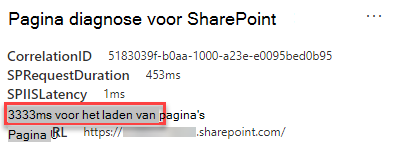

# IFrames optimaliseren in SharePoint Online-pagina's van de publicerende siteOptimize iFrames in SharePoint Online modern and classic publishing site pages

iFrames kunnen handig zijn voor het weergeven van inhouds rijke inhoud, zoals Video's of andere media.iFrames can be useful for previewing rich content such as videos or other media. Aangezien iFrames wel een aparte pagina op de pagina van de SharePoint-site laadt, kan de inhoud die in het iFrame wordt geladen grote afbeeldingen, Video's of andere elementen bevatten die kunnen bijdragen aan de totale laadtijden van pagina's en die u niet kunt beheren op de pagina.However, because iFrames load a separate page within the SharePoint site page, content loaded in the iFrame could contain large images, videos or other elements that can contribute to overall page load times and that you cannot control on the page. In dit artikel vindt u informatie over hoe u kunt bepalen hoe iFrames in uw pagina's van invloed zijn op de beschikbare latentie en hoe u veelvoorkomende problemen kunt oplossen.This article will help you understand how to determine how iFrames in your pages affect user perceived latency, and how to remediate common issues.

>[!NOTE]
>Ga voor meer informatie over de prestaties van moderne SharePoint Online-sites naar [prestaties in de moderne SharePoint-ervaring](https://docs.microsoft.com/sharepoint/modern-experience-performance).For more information about performance in SharePoint Online modern sites, see [Performance in the modern SharePoint experience](https://docs.microsoft.com/sharepoint/modern-experience-performance).

## Het hulpprogramma voor het analyseren van webonderdelen met behulp van het hulpprogramma pagina diagnose voor SharePoint gebruikenUse the Page Diagnostics for SharePoint tool to analyze web parts using iFrames

Het hulpprogramma pagina diagnose voor SharePoint is een browser extensie voor de nieuwe Microsoft Edge- https://www.microsoft.com/edge) en Chrome-browsers die zowel SharePoint Online modern portal als de klassieke publicatiesite pagina's analyseren.The Page Diagnostics for SharePoint tool is a browser extension for the new Microsoft Edge (https://www.microsoft.com/edge) and Chrome browsers that analyzes both SharePoint Online modern portal and classic publishing site pages. Het hulpmiddel biedt een rapport voor elke geanalyseerde pagina op basis van een gedefinieerde set prestatiecriteria.The tool provides a report for each analyzed page showing how the page performs against a defined set of performance criteria. Ga voor meer informatie over het hulpprogramma pagina diagnose voor SharePoint naar [het hulpprogramma pagina diagnose voor SharePoint Online](page-diagnostics-for-spo.md).To install and learn about the Page Diagnostics for SharePoint tool, visit [Use the Page Diagnostics tool for SharePoint Online](page-diagnostics-for-spo.md).

>[!NOTE]
>Het hulpmiddel voor het automatisch toevoegen van pagina's werkt alleen voor SharePoint Online en kan niet worden gebruikt op een SharePoint-systeempagina.The Page Diagnostics tool only works for SharePoint Online, and cannot be used on a SharePoint system page.

Wanneer u een SharePoint-sitepagina wilt analyseren met het hulpprogramma pagina diagnose voor SharePoint, kunt u informatie weergeven over webonderdelen met iFrames in het deelvenster _diagnostische tests_ .When you analyze a SharePoint site page with the Page Diagnostics for SharePoint tool, you can see information about web parts containing iFrames in the _Diagnostic tests_ pane. De metric van basislijn is hetzelfde voor moderne en klassieke pagina's.The baseline metric is the same for modern and classic pages.

Mogelijke resultaten zijn onder meer:Possible results include:

- **Aandacht vereist** (rood): de pagina bevat **drie of meer** webonderdelen met IFRAME-instellingen**Attention required** (red): The page contains **three or more** web parts using iFrames
- **Verbeterings mogelijkheden** (geel): de pagina bevat **een of twee** webonderdelen met behulp van iframes**Improvement opportunities** (yellow): The page contains **one or two** web parts using iFrames
- **Geen actie vereist** (groen): de pagina bevat geen webonderdelen die gebruikmaken van iframe-instellingen**No action required** (green): The page contains no web parts using iFrames

Als het resultaat van de **webonderdelen die gebruikmaken van iframe-detectie** worden weergegeven in de sectie **verbeterings mogelijkheden** of **aandacht vereist)** , kunt u op het resultaat klikken om de webonderdelen te zien die iframes bevatten.If the **Web parts using iFrames detected** result appears in either the **Improvement opportunities** or **Attention required)** section of the results, you can click the result to see the web parts that contain iFrames.

## Prestatieproblemen met iFrame oplossenRemediate iFrame performance issues

Het resultaat van de **webonderdelen met iframes gedetecteerd** in het hulpprogramma voor het controleren van pagina's gebruiken om te bepalen welke webonderdelen iframes bevatten en mogelijk worden gelaadd voor trage pagina's.Use the **Web parts using iFrames detected** result in the Page Diagnostic tool to determine which web parts contain iFrames and may be contributing to slow page load times.

iFrames zijn inherent aan een traag feit omdat ze een afzonderlijke externe pagina laden, waaronder alle bijbehorende inhoud, zoals JavaScript, CSS-en Framework-elementen, waardoor de overhead van de sitepagina door een factor van twee of meer kan toenemen.iFrames are inherently slow because they load a separate external page including all associated content such as javascript, CSS and framework elements, potentially increasing the overhead of the site page by a factor of two or more.

Volg de onderstaande richtlijnen om te zorgen voor optimaal gebruik van iFrames.Follow the guidance below to ensure optimal use of iFrames.

- Gebruik afbeeldingen in plaats van iFrames, indien mogelijk, en als het voorbeeld klein is om te beginnen met of niet-interactief.When possible, use images instead of iFrames if the preview is small to begin with or non-interactive.
- Als iFrames moeten worden gebruikt, minimaliseert u het nummer en/of verplaatst u ze uit de viewport.If iFrames must be used, minimize the number and/or move them out of the viewport.
- Ingesloten Office-bestanden zoals Word, Excel en PowerPoint zijn interactief, maar zijn langzaam te laden.Embedded Office files like Word, Excel and PowerPoint are interactive, but are slow to load. Afbeeldingen met miniaturen met een koppeling naar het volledige document worden vaak beter.Image thumbnails with a link to the full document will often perform better.
- Ingesloten YouTube-Video's en Twitter-feeds worden meestal beter in iFrames opgenomen, maar u kunt wel gebruikmaken van deze soorten ingesloten bestanden.Embedded YouTube videos and Twitter feeds tend to perform better in iFrames, but use these kinds of embeds judiciously.
- Geïsoleerde webonderdelen vormen een redelijke uitzondering, maar beperken hun nummer en plaats in de viewport View.Isolated web parts are a reasonable exception, but minimize their number and placement in the viewport.
- Als een iFrame zich in de viewport bevindt, kunt u een _IntersectionObserver_ gebruiken om de weergave van de iframe te vertragen totdat deze in beeld komt.If an iFrame is located out of the viewport, consider using an _IntersectionObserver_ to delay rendering the iFrame until it comes into view.

Voordat u de revisies van pagina's aanbrengt om prestatieproblemen te verhelpen, kunt u de laadtijd van de pagina in de analyseresultaten noteren.Before you make page revisions to remediate performance issues, make a note of the page load time in the analysis results. Voer het hulpprogramma opnieuw uit na de wijziging om te zien of het nieuwe resultaat binnen de basislijn standaard valt en de nieuwe laadtijd voor pagina's te controleren om te zien of er een verbetering was.Run the tool again after your revision to see if the new result is within the baseline standard, and check the new page load time to see if there was an improvement.

>[!NOTE]
>De laadtijd van de pagina kan variëren, afhankelijk van diverse factoren, zoals netwerkbelasting, tijdstip van de dag en andere tijdelijke voorwaarden.Page load time can vary based on a variety of factors such as network load, time of day, and other transient conditions. U moet de laadtijd voor pagina's enkele keren vóór en na het aanbrengen van wijzigingen aanbrengen om de resultaten te berekenen.You should test page load time a few times before and after making changes to help you average the results.

## Verwante onderwerpenRelated topics

[Prestaties van SharePoint Online afstemmenTune SharePoint Online performance](tune-sharepoint-online-performance.md)

[Prestaties van Office 365 afstemmenTune Office 365 performance](tune-microsoft-365-performance.md)

[Prestaties in de moderne SharePoint-ervaringPerformance in the modern SharePoint experience](https://docs.microsoft.com/sharepoint/modern-experience-performance)
