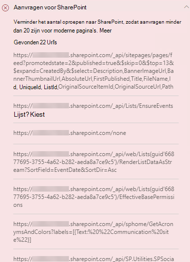

# Pagina-oproepen optimaliseren in de pagina's modern en Classic Publishing site in SharePoint Online

De sites van SharePoint Online modern en Classic bevatten koppelingen waarmee u SharePoint-functies en-Cdn's kunt laden. Hoe meer oproepen worden gedaan door een pagina, hoe langer de pagina wordt geladen. Dit is een bekend merk wanneer een **eindgebruiker latentie heeft waargenomen** of **EUPL**.

In dit artikel vindt u informatie over hoe u het aantal en de gevolgen van oproepen voor externe eindpunten op de moderne en klassieke pagina's voor publicerende sites bepaalt

>[!NOTE]
>Zie [prestaties in de moderne SharePoint-ervaring](https://docs.microsoft.com/sharepoint/modern-experience-performance)voor meer informatie over prestaties in moderne portals voor SharePoint Online.

## Het hulpprogramma pagina diagnose voor SharePoint gebruiken om pagina oproepen te analyseren

Het hulpprogramma pagina diagnose voor SharePoint is een browser extensie voor de nieuwe Microsoft Edge- https://www.microsoft.com/edge) en Chrome-browsers die zowel SharePoint Online modern portal als de klassieke publicatiesite pagina's analyseren. Het hulpmiddel biedt een rapport voor elke geanalyseerde pagina op basis van een gedefinieerde set prestatiecriteria. Ga voor meer informatie over het hulpprogramma pagina diagnose voor SharePoint naar [het hulpprogramma pagina diagnose voor SharePoint Online](page-diagnostics-for-spo.md).

>[!NOTE]
>Het hulpmiddel voor het automatisch toevoegen van pagina's werkt alleen voor SharePoint Online en kan niet worden gebruikt op een SharePoint-systeempagina.

Wanneer u een SharePoint-sitepagina wilt analyseren met het hulpprogramma pagina diagnose voor SharePoint, kunt u in het deelvenster _diagnostische tests_ informatie vinden over externe oproepen in het resultaat van de **verzoeken tot SharePoint** . De lijn wordt in groen weergegeven als de sitepagina minder is dan het basislijn aantal gesprekken, en rood als de pagina het basislijn nummer overschrijdt. Het nummer van de basislijn is verschillend voor moderne pagina's en de klassieke pagina's, aangezien de klassieke sitepagina's gebruikmaken van http 1.1 en moderne pagina's gebruikmaken van HTTP 2.0:

- Pagina's op een moderne site mogen niet meer dan **25** oproepen bevatten
- Klassieke publicatiepagina's mogen niet meer dan **zes** oproepen bevatten

Mogelijke resultaten zijn onder meer:

- **Aandacht vereist** (rood): de pagina overschrijdt het basislijn aantal oproepen
- **Geen actie vereist** (groen): de pagina bevat minder dan het basislijn aantal oproepen

Als het resultaat van de **verzoeken tot SharePoint** wordt weergegeven in de sectie **aandacht vereist** , kunt u op het resultaat klikken voor details, waaronder het totale aantal oproepen op de pagina en een lijst met de url's.

## Prestatieproblemen met betrekking tot een groot aantal oproepen herstellen op een pagina

Als een pagina te veel oproepen bevat, kunt u deze gebruiken in de lijst met Url's in de resultaten van de **SharePoint-** resultaten om te bepalen of er herhaaldelijke oproepen plaatsvinden, oproepen die moeten worden opgenomen of gesprekken die gegevens bevatten die moeten worden opgeslagen.

Met **reste gesprekken** kunt u de prestaties van de kosten verminderen. Zie voor meer informatie over het uitvoeren van API-oproepen batch [aanvragen indienen met de rest-api's](https://docs.microsoft.com/sharepoint/dev/sp-add-ins/make-batch-requests-with-the-rest-apis).

**Met behulp van een cache** voor het opslaan van de resultaten van een API-oproep kunt u de prestaties van een verzoek verbeteren door de client gebruik te maken van de in de cache geplaatste gegevens in plaats van een extra oproep te voeren voor elke volgende pagina belasting. U kunt op verschillende manieren deze oplossing volgen, afhankelijk van de zakelijke eis. Meestal als de gegevens hetzelfde zijn voor alle gebruikers, is het gebruik van een cacheservice voor middelste lagen, zoals [ _Azure redis_ cache](https://azure.microsoft.com/services/cache/) , een uitstekende optie om het API-verkeer van een site aanzienlijk te reduceren, aangezien de gebruikers de gegevens van de cacheservice aanvragen via de cacheservice, in plaats van rechtstreeks vanuit SPO. De enige SPOs die nodig zijn, zijn de cache van de middelste laag vernieuwd. Als de gegevens voor afzonderlijke gebruikers schommelen, kunt u het beste een cache voor de clientcache, zoals LocalStorage of zelfs een cookie, implementeren. Dit beperkt de oproepen van de oproep en verlaagt de volgende aanvragen van dezelfde gebruiker voor de cacheduur, maar is minder efficiënt dan een specifieke cacheservice. Met PnP kunt u LocalStorage gebruiken met een beetje extra ontwikkeling vereist.

Voordat u de revisies van pagina's aanbrengt om prestatieproblemen te verhelpen, kunt u de laadtijd van de pagina in de analyseresultaten noteren. Voer het hulpprogramma opnieuw uit na de wijziging om te zien of het nieuwe resultaat binnen de basislijn standaard valt en de nieuwe laadtijd voor pagina's te controleren om te zien of er een verbetering was.

>[!NOTE]
>De laadtijd van de pagina kan variëren, afhankelijk van diverse factoren, zoals netwerkbelasting, tijdstip van de dag en andere tijdelijke voorwaarden. U moet de laadtijd voor pagina's enkele keren vóór en na het aanbrengen van wijzigingen aanbrengen om de resultaten te berekenen.

## Verwante onderwerpen

[Prestaties van SharePoint Online afstemmen](tune-sharepoint-online-performance.md)

[Prestaties van Office 365 afstemmen](tune-microsoft-365-performance.md)

[Prestaties in de moderne SharePoint-ervaring](https://docs.microsoft.com/sharepoint/modern-experience-performance)

[Netwerken voor content levering](content-delivery-networks.md)

[Het Office 365 Content Delivery Network (CDN) gebruiken met SharePoint Online](use-microsoft-365-cdn-with-spo.md)
