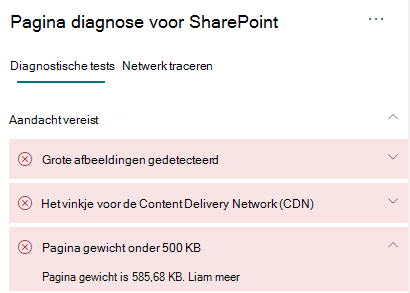

# Paginagewicht optimaliseren in moderne sitepagina's van SharePoint OnlineOptimize page weight in SharePoint Online modern site pages

Moderne SharePoint Online-sitepagina's bevatten seriële code die is vereist om pagina-inhoud van de pagina weer te geven, inclusief afbeeldingen, tekst, objecten in het inhoudsgebied onder navigatie-/opdrachtbalken en andere HTML-code die het kader van de pagina vormt.SharePoint Online modern site pages contain serialized code that is required to render page content of the page, including images, text, objects in the content area underneath navigation/command bars and other HTML code that forms the framework of the page. Paginagewicht is een meting van deze HTML-code en moet worden beperkt om optimale laadtijden voor pagina's te garanderen.Page weight is a measurement of this HTML code, and should be limited to ensure optimal page load times.

In dit artikel wordt beschreven hoe u het paginagewicht op uw moderne sitepagina's kunt verminderen.This article will help you understand how to reduce page weight in your modern site pages.

>[!NOTE]
>Zie Prestaties in de [moderne SharePoint-ervaring](/sharepoint/modern-experience-performance)voor meer informatie over de prestaties in moderne SharePoint Online-portals.For more information about performance in SharePoint Online modern portals, see [Performance in the modern SharePoint experience](/sharepoint/modern-experience-performance).

## Het hulpprogramma Paginadiagnose voor SharePoint gebruiken om het paginagewicht te analyserenUse the Page Diagnostics for SharePoint tool to analyze page weight

Het hulpprogramma Paginadiagnose voor SharePoint is een browserextensie voor de nieuwe Microsoft Edge - en Chrome-browsers waarmee zowel moderne portals van SharePoint Online als klassieke https://www.microsoft.com/edge) publicerende sitepagina's worden geanalyseerd.The Page Diagnostics for SharePoint tool is a browser extension for the new Microsoft Edge (https://www.microsoft.com/edge) and Chrome browsers that analyzes both SharePoint Online modern portal and classic publishing site pages. Het hulpprogramma bevat een rapport voor elke geanalyseerde pagina die laat zien hoe de pagina presteert op basis van een gedefinieerde set prestatiecriteria.The tool provides a report for each analyzed page showing how the page performs against a defined set of performance criteria. Als u het hulpprogramma Paginadiagnose voor SharePoint wilt installeren en meer wilt weten, gaat u naar Het hulpprogramma [Paginadiagnose gebruiken voor SharePoint Online.](page-diagnostics-for-spo.md)To install and learn about the Page Diagnostics for SharePoint tool, visit [Use the Page Diagnostics tool for SharePoint Online](page-diagnostics-for-spo.md).

>[!NOTE]
>Het hulpprogramma Paginadiagnose werkt alleen voor SharePoint Online en kan niet worden gebruikt op een SharePoint-systeempagina.The Page Diagnostics tool only works for SharePoint Online, and cannot be used on a SharePoint system page.

Wanneer u een SharePoint-sitepagina analyseert met het hulpprogramma Paginadiagnose voor SharePoint, ziet u informatie over de pagina in het pagina-gewicht onder **500 KB-resultaat** van het deelvenster _Diagnostische tests._When you analyze a SharePoint site page with the Page Diagnostics for SharePoint tool, you can see information about page in the **Page weight under 500KB** result of the _Diagnostic tests_ pane. Het resultaat wordt groen weergegeven als het paginagewicht onder de basislijnwaarde valt en rood als het paginagewicht de basislijnwaarde overschrijdt.The result will appear in green if the page weight is under the baseline value, and red if the page weight exceeds the baseline value.

Mogelijke resultaten zijn:Possible results include:

- **Aandacht vereist** (rood): Paginagewicht groter dan 500 KB**Attention required** (red): Page weight exceeds 500KB
- **Geen actie vereist** (groen): Paginagewicht is minder dan 500 KB**No action required** (green): Page weight is under 500KB

Als het  **paginagewicht onder 500 KB** wordt weergegeven in de sectie Aandacht vereist, kunt u op het resultaat klikken voor meer informatie.If the **Page weight under 500KB** result appears in the **Attention required** section, you can click the result for details.

## Problemen met het gewicht van pagina's oplossenRemediate page weight issues

Als het paginagewicht meer dan 500 KB bedraagt, kunt u de totale laadtijd van pagina's verbeteren door het aantal webonderdelen te verminderen en de pagina-inhoud in de juiste mate te beperken.If page weight exceeds 500KB, you can improve overall page load time by reducing the number of web parts and limiting page content to an appropriate degree.

Algemene richtlijnen voor het verminderen van het paginagewicht zijn:General guidance for reducing page weight includes:

- Beperk de pagina-inhoud tot een redelijk bedrag en gebruik meerdere pagina's voor gerelateerde inhoud.Limit the page content to a reasonable amount and use multiple pages for related content.
- Minimaliseer het gebruik van webonderdelen met grote eigenschappentassen.Minimize the use of web parts that have large property bags.
- Gebruik indien mogelijk niet-interactieve rollupweergaven.Use non-interactive rollup views when possible.
- Optimaliseer de grootte van afbeeldingen door afbeeldingen op de juiste manier te formaatken, gecomprimeerde afbeeldingsindelingen te gebruiken en ervoor te zorgen dat ze worden gedownload van een CDN.Optimize image sizes by sizing images appropriately, using compressed image formats and ensuring that they are downloaded from a CDN.

In het volgende artikel vindt u aanvullende richtlijnen voor het beperken van het paginagewicht:You can find additional guidance for limiting page weight in the following article:

- [Paginaprestaties optimaliseren in SharePointOptimize page performance in SharePoint](/sharepoint/dev/general-development/optimize-page-performance-in-sharepoint)

Voordat u paginaherzieningen maakt om prestatieproblemen op te lossen, noteert u de laadtijd van de pagina in de analyseresultaten.Before you make page revisions to remediate performance issues, make a note of the page load time in the analysis results. Voer het hulpprogramma na de revisie opnieuw uit om te zien of het nieuwe resultaat binnen de basislijnstandaard valt en controleer de laadtijd van de nieuwe pagina om te zien of er een verbetering is.Run the tool again after your revision to see if the new result is within the baseline standard, and check the new page load time to see if there was an improvement.

>[!NOTE]
>De laadtijd van pagina's kan variëren op basis van verschillende factoren, zoals de netwerkbelasting, de tijd van de dag en andere tijdelijke omstandigheden.Page load time can vary based on a variety of factors such as network load, time of day, and other transient conditions. U moet de laadtijd van pagina's een paar keer voor en na het aanbrengen van wijzigingen testen, zodat u de resultaten kunt gemiddelden.You should test page load time a few times before and after making changes to help you average the results.

## Verwante onderwerpenRelated topics

[Prestaties van SharePoint Online afstemmenTune SharePoint Online performance](tune-sharepoint-online-performance.md)

[Prestaties van Office 365 afstemmenTune Office 365 performance](tune-microsoft-365-performance.md)

[Prestaties in de moderne SharePoint-ervaringPerformance in the modern SharePoint experience](/sharepoint/modern-experience-performance)

[Netwerken voor contentleveringContent delivery networks](content-delivery-networks.md)

[Het Office 365 Content Delivery Network (CDN) gebruiken met SharePoint OnlineUse the Office 365 Content Delivery Network (CDN) with SharePoint Online](use-microsoft-365-cdn-with-spo.md)