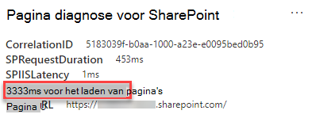

# Prestaties van webonderdeel optimaliseren in SharePoint moderne onlinesitepagina's

SharePoint Online moderne sitepagina's bevatten webonderdelen die kunnen bijdragen aan de totale laadtijden van pagina's. In dit artikel wordt beschreven hoe u kunt bepalen hoe webonderdelen op uw pagina's van invloed zijn op de door de gebruiker waargenomen latentie en hoe u veelvoorkomende problemen kunt oplossen.

> [!NOTE]
> Zie Prestaties in de moderne SharePoint voor meer informatie over prestaties in SharePoint moderne [onlineportalen.](/sharepoint/modern-experience-performance)

## Het hulpprogramma Paginadiagnose voor SharePoint gebruiken om webonderdelen te analyseren

Het hulpprogramma Paginadiagnose voor SharePoint is een browserextensie voor de nieuwe Microsoft Edge ( en Chrome-browsers die zowel SharePoint Moderne portal online als klassieke https://www.microsoft.com/edge) publicerende sitepagina's analyseren. Het hulpprogramma bevat een rapport voor elke geanalyseerde pagina die laat zien hoe de pagina presteert op basis van een gedefinieerde set prestatiecriteria. Als u het hulpprogramma Paginadiagnose voor SharePoint wilt installeren en meer wilt weten, gaat u naar Het hulpprogramma [Paginadiagnose gebruiken](page-diagnostics-for-spo.md)voor SharePoint Online.

> [!NOTE]
> Het hulpprogramma Paginadiagnose werkt alleen SharePoint Online en kan niet worden gebruikt op een SharePoint systeempagina.

Wanneer u een SharePoint-sitepagina analyseert met het hulpprogramma Paginadiagnose voor SharePoint, ziet u informatie  over webonderdelen die de basislijnmetriek in de webonderdelen overschrijden, waardoor de laadtijd van pagina's wordt beïnvloed in het deelvenster Diagnostische tests. 

Mogelijke resultaten zijn:

- **Aandacht vereist** (rood): Elk aangepast _webonderdeel_ dat zichtbaar is in de viewport (scherm zichtbaar gedeelte van de pagina dat eerst wordt geladen) die langer dan **twee** seconden duurt om te laden. Aangepaste _webonderdelen_ buiten de viewport die langer dan **vier** seconden duren om te laden. De totale laadtijd wordt weergegeven in testresultaten en wordt uitgesplitsd naar modulebelasting, luie belasting, init en render.
- **Verbeterkansen** (geel): Items die van invloed kunnen zijn op de laadtijd van pagina's, worden weergegeven in deze sectie en moeten worden gecontroleerd en gecontroleerd. Dit kunnen 'out of the box' (OOTB) Microsoft-webonderdelen zijn. Resultaten voor microsoft-webonderdelen die in deze sectie worden weergegeven, worden automatisch gerapporteerd aan Microsoft, dus **er is geen actie vereist.** U moet alleen een ondersteuningsticket voor onderzoek aanmelden als de prestaties op de pagina erg traag zijn en alle **Microsoft-webonderdelen** op de pagina worden weergegeven in de resultaten in de sectie **Verbeterkansen.** Houd er rekening mee dat bij een toekomstige update van SharePoint paginadiagnose de resultaten verder worden opgedeeld op basis van de specifieke configuratie van het Microsoft-webonderdeel.
- **Geen actie vereist** (groen): Het retourneren van gegevens duurt niet langer dan **twee** seconden.

Als de **webonderdelen** van invloed zijn op het  resultaat  van de laadtijd van de pagina, wordt het resultaat weergegeven in de sectie Aandacht vereist of Verbeterkansen van de resultaten, klikt u op het resultaat om details te zien over welke webonderdelen langzaam worden geladen. Toekomstige updates voor het hulpprogramma Paginadiagnose voor SharePoint kunnen updates van analyseregels bevatten, dus zorg ervoor dat u altijd de nieuwste versie van het hulpprogramma hebt.

De beschikbare informatie in de resultaten omvat:

- **Gemaakt door** laat zien of het webonderdeel aangepast is of Microsoft OOTB.
- **Met naam en id** worden identificerende gegevens weergegeven die u kunnen helpen het webonderdeel op de pagina te vinden.
- **Totaal** geeft de totale tijd weer voor het webonderdeel om module laden, initialiseren en renderen. Het is de totale relatieve tijd die door het webonderdeel wordt gebruikt om op de pagina weer te geven, van begin tot einde.
- **Module laden** toont de tijd die nodig is voor het downloaden, evalueren en laden van de extensies JavaScript- en CSS-bestanden. Vervolgens wordt het Init-proces begonnen.
- **Lui laden** toont de tijd voor uitgesteld laden van webonderdelen die niet worden weergegeven in het hoofdgedeelte van de pagina. Er zijn bepaalde voorwaarden waarin er te veel webonderdelen zijn om weer te geven en ze worden in de wachtrij weergegeven om de laadtijd van de pagina te minimaliseren.
- **Init toont** de tijd die nodig is voor het webonderdeel om de gegevens te initialiseren.

  Het is een asynchrone oproep en init time is de berekening van de tijd voor de functie onInit wanneer de geretourneerde belofte is opgelost.

- **In Render** wordt de tijd weergegeven die nodig is om de gebruikersinterface (gebruikersinterface) weer te geven zodra de module is geladen en Init is voltooid.

  Het is de JavaScript-uitvoeringstijd om de DOM in het document (pagina) te plaatsen.
  Het weergeven van asynchrone resources, bijvoorbeeld afbeeldingen, kan extra tijd in beslag nemen.

Deze informatie wordt verstrekt om ontwerpers en ontwikkelaars te helpen bij het oplossen van problemen. Deze informatie moet worden verstrekt aan uw ontwerp- en ontwikkelingsteam.

## Problemen met de prestaties van webonderdeel herstellen

Volg de richtlijnen in deze sectie om prestatieproblemen met webonderdelen in de **webonderdelen** te identificeren en te verhelpen, die van invloed zijn op de laadtijd van pagina's.

Er zijn drie categorieën met mogelijke oorzaken voor slechte prestaties van webonderdeel. Gebruik de onderstaande informatie om te bepalen welke problemen van toepassing zijn op uw scenario en deze te corrigeren.

- Scriptgrootte en afhankelijkheden van webonderdeel
  - Het eerste script optimaliseren dat alleen het hoofdlijnscenario voor _de weergavemodus wekt._
  - Verplaats de minder frequente scenario's en de bewerkingsmoduscode (zoals het eigenschappenvenster) om segmenten te scheiden met behulp van de _instructie importeren()._
  - Controleer de afhankelijkheden van het _package.jsbestand_ om eventuele code volledig te verwijderen. Verplaats alleen test-/buildafhankelijkheden naar devDependencies.
  - Gebruik van de Office 365 CDN is vereist voor een optimale statische resource downloaden. Openbare CDN origins hebben de voorkeur voor _js/css-bestanden._ Zie De Office 365 CDN Office 365 Content Delivery Network [(CDN)](use-microsoft-365-cdn-with-spo.md)gebruiken met SharePoint Online voor meer informatie over het gebruik van de SharePoint.
  - Gebruik frameworks zoals _React_ _en import van_ stof die deel uitmaken van de SharePoint Framework (SPFx). Zie Overzicht van de [SharePoint Framework.](/sharepoint/dev/spfx/sharepoint-framework-overview)
  - Zorg ervoor dat u de nieuwste versie van de SharePoint Framework en upgrade naar nieuwe versies zodra deze beschikbaar zijn.
- Gegevens ophalen/caching
  - Als het webonderdeel afhankelijk is van extra serveroproepen om gegevens op te halen voor weergave, zorgt u ervoor dat deze server-API's snel zijn en/of client caching implementeren (zoals _localStorage_ of _IndexedDB_ voor grotere sets).
  - Als meerdere oproepen nodig zijn om kritieke gegevens weer te geven, kunt u overwegen batching op de server of andere methoden voor het samenvoegen van aanvragen tot één gesprek.
  - Als sommige gegevenselementen een tragere API vereisen, maar niet essentieel zijn voor de eerste weergave, kunt u deze ook loskoppelen van een afzonderlijk gesprek dat wordt uitgevoerd nadat kritieke gegevens zijn weergegeven.
  - Als meerdere onderdelen dezelfde gegevens gebruiken, gebruikt u een veelgebruikte gegevenslaag om dubbele oproepen te voorkomen.
- Weergavetijd
  - Mediabronnen zoals afbeeldingen en video's moeten worden uitgebreid tot de limieten van de container, het apparaat en/of het netwerk om te voorkomen dat onnodige grote assets worden gedownload. Zie De Office 365 Content Delivery Network (CDN) gebruiken met [SharePoint Online voor meer informatie over inhoudsafhankelijkheden.](use-microsoft-365-cdn-with-spo.md)
  - Vermijd API-oproepen die leiden tot herstroom, complexe CSS-regels of ingewikkelde animaties. Zie Browserreflow minimaliseren voor [meer informatie.](https://developers.google.com/speed/docs/insights/browser-reflow)
  - Vermijd het gebruik van geketende, langlopende taken. In plaats daarvan kunt u langlopende taken uit elkaar halen in afzonderlijke wachtrijen. Zie [JavaScript-uitvoering optimaliseren voor meer informatie.](https://developers.google.com/web/fundamentals/performance/rendering/optimize-javascript-execution)
  - Reserveer de bijbehorende ruimte voor asynchrone weergave van media of visuele elementen om overgeslagen frames en stotteren (ook wel jank genoemd) _te voorkomen._
  - Als een bepaalde browser geen ondersteuning biedt voor een functie die wordt gebruikt bij het weergeven, laadt u een polyfill of sluit u het uitvoeren van afhankelijke code uit. Als de functie niet kritiek is, moet u resources, zoals gebeurtenis-handlers, verwijderen om geheugenlekken te voorkomen.

Voordat u paginaherzieningen maakt om prestatieproblemen op te lossen, noteert u de laadtijd van de pagina in de analyseresultaten. Voer het hulpprogramma na de revisie opnieuw uit om te zien of het nieuwe resultaat binnen de basislijnstandaard valt en controleer de laadtijd van de nieuwe pagina om te zien of er een verbetering is.

>[!NOTE]
>De laadtijd van pagina's kan variëren op basis van verschillende factoren, zoals de netwerkbelasting, de tijd van de dag en andere tijdelijke omstandigheden. U moet de laadtijd van pagina's een paar keer voor en na het aanbrengen van wijzigingen testen, zodat u de resultaten kunt gemiddelden.

## Gerelateerde onderwerpen

[Prestaties SharePoint online afstemmen](tune-sharepoint-online-performance.md)

[Prestaties Office 365 afstemmen](tune-microsoft-365-performance.md)

[Prestaties in de moderne SharePoint ervaring](/sharepoint/modern-experience-performance)

[Netwerken voor contentlevering](content-delivery-networks.md)

[De Office 365 Content Delivery Network (CDN) gebruiken met SharePoint Online](use-microsoft-365-cdn-with-spo.md)
