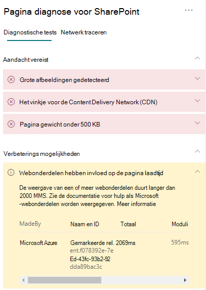

# Prestaties van webonderdeel optimaliseren op moderne SharePoint Online-sitepagina'sOptimize web part performance in SharePoint Online modern site pages

Moderne SharePoint Online-sitepagina's bevatten webonderdelen die kunnen bijdragen aan de totale laadtijden van pagina's.SharePoint Online modern site pages contain web parts that can contribute to overall page load times. In dit artikel wordt beschreven hoe u kunt bepalen hoe webonderdelen op uw pagina's van invloed zijn op de door de gebruiker waargenomen latentie en hoe u veelvoorkomende problemen kunt oplossen.This article will help you understand how to determine how web parts in your pages affect user perceived latency, and how to remediate common issues.

>[!NOTE]
>Zie Prestaties in de moderne SharePoint-ervaring voor meer informatie over de prestaties in moderne [SharePoint Online-portals.](https://docs.microsoft.com/sharepoint/modern-experience-performance)For more information about performance in SharePoint Online modern portals, see [Performance in the modern SharePoint experience](https://docs.microsoft.com/sharepoint/modern-experience-performance).

## Het hulpprogramma Paginadiagnose voor SharePoint gebruiken om webonderdelen te analyserenUse the Page Diagnostics for SharePoint tool to analyze web parts

Het hulpprogramma Paginadiagnose voor SharePoint is een browseruitbreiding voor de nieuwe versie van Microsoft Edge (en Chrome-browsers die zowel moderne Portal- als klassieke publicerende sitepagina's van https://www.microsoft.com/edge) SharePoint Online analyseren.The Page Diagnostics for SharePoint tool is a browser extension for the new Microsoft Edge (https://www.microsoft.com/edge) and Chrome browsers that analyzes both SharePoint Online modern portal and classic publishing site pages. Het hulpmiddel bevat een rapport voor elke geanalyseerde pagina, waarin u kunt zien hoe de pagina presteert ten opzichte van een gedefinieerde set prestatiecriteria.The tool provides a report for each analyzed page showing how the page performs against a defined set of performance criteria. Ga naar Het hulpprogramma Paginadiagnose voor SharePoint Online gebruiken voor meer informatie over het hulpprogramma [Paginadiagnose voor SharePoint Online.](page-diagnostics-for-spo.md)To install and learn about the Page Diagnostics for SharePoint tool, visit [Use the Page Diagnostics tool for SharePoint Online](page-diagnostics-for-spo.md).

>[!NOTE]
>Het hulpprogramma Paginadiagnose werkt alleen voor SharePoint Online en kan niet worden gebruikt op een SharePoint-systeempagina.The Page Diagnostics tool only works for SharePoint Online, and cannot be used on a SharePoint system page.

Wanneer u een SharePoint-sitepagina analyseert met het hulpprogramma Paginadiagnose voor SharePoint, kunt u in het deelvenster Diagnostische tests informatie zien over webonderdelen die de basislijnmeting overschrijden in de **webonderdelen.** When you analyze a SharePoint site page with the Page Diagnostics for SharePoint tool, you can see information about web parts that exceed the baseline metric in the **Web parts are impacting page load time** result in the _Diagnostic tests_ pane.

Mogelijke resultaten zijn:Possible results include:

- **Aandacht vereist** (rood): Elk aangepast _webonderdeel_ dat wordt weergegeven in de viewport (het zichtbare  gedeelte van de pagina dat als eerste wordt geladen) duurt langer dan twee seconden.**Attention required** (red): Any _custom_ web part that is visible in the viewport (screen visible portion of the page which is loaded first) that takes longer than **two** seconds to load. Aangepaste _webonderdelen_ buiten de viewport die langer dan **vier** seconden in beslag nemen.Any _custom_ web parts outside of the viewport that take longer than **four** seconds to load. De totale laadtijd wordt weergegeven in de testresultaten en wordt onderverdeeld per modulebelasting, één voor één laden, init en weergeven.Total load time is displayed in test results and is broken down by module load, lazy load, init and render.
- **Verkoopkansen voor** kwaliteitsverbetering (geel): Items die van invloed kunnen zijn op de laadtijd van pagina's worden in deze sectie weergegeven en moeten worden gecontroleerd en gecontroleerd.**Improvement opportunities** (yellow): Items that may be impacting page load time are shown in this section and should be reviewed and monitored. Dit kunnen 'out of the box' (OOTB) Microsoft-webonderdelen zijn.This may include "out of the box" (OOTB) Microsoft web parts. De resultaten voor Microsoft-webonderdelen die in deze sectie worden weergegeven, worden automatisch aan Microsoft gerapporteerd, **dus u hoeft niets te doen.**Results for any Microsoft web parts shown in this section are automatically reported to Microsoft, so **no action is required**. Meld alleen een ondersteuningsticket aan voor onderzoek als de pagina erg traag **werkt** en alle **Microsoft-webonderdelen** op de pagina worden weergegeven in de resultaten in de sectie Verkoopkansen voor kwaliteitsverbetering.You should only log a support ticket for investigation if you are experiencing very slow performance on the page and **all Microsoft web parts** on the page appear in the results in the **Improvement opportunities** section. Houd er rekening mee dat de resultaten na een toekomstige update van het hulpprogramma Page Diagnostics voor SharePoint verder worden opgedeeld op basis van de specifieke configuratie van het Microsoft-webonderdeel.Note that a future Page Diagnostics for SharePoint tool update will further break down the results based on the specific configuration of the Microsoft web part.
- **Geen actie vereist** (groen): Het duurt  langer dan twee seconden voordat gegevens worden retourneren door een webonderdeel.**No action required** (green): No web part is taking longer than **two** seconds to return data.

Als de **webonderdelen** van invloed zijn op de  laadtijd  van een pagina, wordt het resultaat weergegeven in de sectie Aandacht vereist of Verkoopkansen voor verbetering van de resultaten, klikt u op het resultaat om te zien welke webonderdelen langzaam worden geladen.If the **Web parts are impacting page load time** result appears in either the **Attention required** or **Improvement opportunities** section of the results, click the result to see details about which web parts are loading slowly. Toekomstige updates van het hulpprogramma Paginadiagnose voor SharePoint kunnen updates van analyseregels bevatten, dus zorg ervoor dat u altijd de meest recente versie van het hulpprogramma hebt.Future updates to the Page Diagnostics for SharePoint tool may include updates to analysis rules, so please ensure you always have the latest version of the tool.

De beschikbare informatie in de resultaten omvat:Information available in the results includes:

- **Gemaakt door** laat zien of het webonderdeel aangepast is of Microsoft OOTB.**Made by** shows whether the web part is custom or Microsoft OOTB.
- **Met de naam en** id worden identificerende gegevens weergegeven die u kunnen helpen het webonderdeel op de pagina te vinden.**Name and ID** shows identifying information that can help you find the web part on the page.
- **Totaal** van de totale tijd die het webonderdeel nodig heeft om een module te laden, te initialiseren en weer te geven.**Total** shows the total time for the web part to module load, initialize and render. Het is de totale relatieve tijd die door het webonderdeel wordt genomen om weer te geven op de pagina, van begin tot einde.It is the total relative time taken by the web part to render on the page, from beginning to the end.
- **Bij het laden** van een module ziet u de tijd die nodig is om de javaScript- en CSS-bestanden te downloaden, te evalueren en te laden.**Module Load** shows the time taken to download, evaluate and load the extensions JavaScript and CSS files. Vervolgens wordt het Init-proces begonnen.It will then start the Init process.
- **In dit artikel** wordt de tijd weergegeven voor het uitgesteld laden van webonderdelen die niet zichtbaar zijn in het hoofdgedeelte van de pagina.**Lazy Load** shows the time for deferred loading of web parts not seen in the main section of the page. Er zijn bepaalde voorwaarden waarbij er te veel webonderdelen zijn om weer te geven en ze worden in de wachtrij geplaatst om weer te geven om de laadtijd van de pagina te minimaliseren.There are certain conditions where there are too many web parts to render, and they are queued to render to minimize the page load time.
- **Init** laat de tijd zien die het webonderdeel nodig heeft om de gegevens te initialiseren.**Init** shows the time taken for the web part to initialize the data.
    Het is een asynchrone oproep en tijdin voeren de berekening van de tijd voor de on-Init-functie uit wanneer de geretourneerde belofte wordt opgelost.It is an asynchronous call and init time is the calculation of time for the onInit function when the returned promise is resolved.
- **In het** weergeven ziet u de tijd die nodig is om de gebruikersinterface (gebruikersinterface) weer te geven nadat de module is geladen en Init is voltooid.**Render** shows the time taken to render the UI (user interface) once the module load and Init are complete.
    Het is de JavaScript-uitvoeringstijd om de DOM in het document (pagina) te plaatsen.It is the JavaScript execution time to mount the DOM in the document (page).
    Het weergeven van asynchrone resources, zoals afbeeldingen, kan extra tijd in beslag nemen.Rendering of asynchronous resources, for example, images, might take additional time to complete.

Deze informatie wordt verstrekt om ontwerpers en ontwikkelaars te helpen bij het oplossen van problemen.This information is provided to help designers and developers troubleshoot issues. Deze informatie moet u verstrekken aan uw ontwerp- en ontwikkelteam.This information should be provided to your design and development team.

## Problemen met de prestaties van webonderdeel herstellenRemediate web part performance issues

Volg de richtlijnen in deze sectie om prestatieproblemen te identificeren  en te verhelpen die van invloed zijn op de laadtijd van pagina's als webonderdelen in de webonderdelen.Follow the guidance in this section to identify and remediate performance issues with web parts listed in the **Web parts are impacting page load time** results.

Er zijn drie categorieën mogelijke oorzaken voor slechte prestaties van webonderdeel.There are three categories of possible causes for poor web part performance. Gebruik de onderstaande informatie om te bepalen welke problemen van toepassing zijn op uw scenario en deze te verhelpen.Use the information below to determine which issues apply to your scenario and remediate them.

- Scriptgrootte en afhankelijkheden van webonderdeelWeb part script size and dependencies
  - Optimaliseer het initiële script om het hoofdlijnscenario alleen voor de _weergavemodus weer te geven._Optimize the initial script that renders the mainline scenario for _view mode only_.
  - Verplaats de minder frequente scenario's en bewerk moduscode (zoals het eigenschappenvenster) om segmenten te scheiden met behulp van de _instructie import()._Move the less frequent scenarios and edit mode code (like the property pane) to separate chunks using the _import()_ statement.
  - Controleer afhankelijkheden van de _package.jsin_ het bestand om alle doodscodes volledig te verwijderen.Review dependencies of the _package.json_ file to remove any dead code completely. Verplaats alleen test-/buildafhankelijkheden naar devDependencies.Move any test/build only dependencies to devDependencies.
  - Het Office 365-CDN is vereist voor het optimaal statisch downloaden van statische bronnen.Use of the Office 365 CDN is required for optimal static resource download. Openbare CDN-origins hebben de voorkeur boven _js-/css-bestanden._Public CDN origins are preferable for _js/css_ files. Zie Het Office 365 Content Delivery Network (CDN) gebruiken met SharePoint Online voor meer informatie over het gebruik van het [Office 365-CDN.](use-microsoft-365-cdn-with-spo.md)For more information about using the Office 365 CDN, see [Use the Office 365 Content Delivery Network (CDN) with SharePoint Online](use-microsoft-365-cdn-with-spo.md).
  - Gebruik frameworks zoals _React_ en _Fabric-importen_ die deel uitmaken van het SharePoint Framework (SPFX).Reuse frameworks like _React_ and _Fabric imports_ that come as part of the SharePoint Framework (SPFx). Zie Overzicht van SharePoint Framework voor [meer informatie.](https://docs.microsoft.com/sharepoint/dev/spfx/sharepoint-framework-overview)For more information, see [Overview of the SharePoint Framework](https://docs.microsoft.com/sharepoint/dev/spfx/sharepoint-framework-overview).
  - Zorg ervoor dat u de nieuwste versie van SharePoint Framework gebruikt en upgrade naar nieuwe versies zodra deze beschikbaar zijn.Ensure that you are using the latest version of the SharePoint Framework, and upgrade to new versions as they become available.
- Gegevens ophalen/cachingData fetching/caching
  - Als het webonderdeel afhankelijk is van extra serveroproepen om gegevens op te halen voor weergave, zorgt u ervoor dat deze server-API's snel zijn en/of client caching (zoals het gebruik van _localStorage_ of _IndexedDB_ voor grotere sets) implementeren.If the web part relies on extra server calls to fetch data for display, ensure those server APIs are fast and/or implement client side caching (such as using _localStorage_ or _IndexedDB_ for larger sets).
  - Als er meerdere oproepen nodig zijn om kritieke gegevens weer te geven, kunt u overwegen om een batch te maken op de server of op andere manieren om aanvragen samen tevoegen tot één oproep.If multiple calls are required to render critical data, consider batching on the server or other methods of consolidating requests to a single call.
  - Als voor sommige gegevenselementen een tragere API is vereist, maar die niet essentieel zijn voor de eerste weergave, ontkoppelt u deze tot een afzonderlijke oproep die wordt uitgevoerd nadat essentiële gegevens zijn weergegeven.Alternatively, if some elements of data require a slower API, but are not critical to initial rendering, decouple these to a separate call that is executed after critical data is rendered.
  - Als meerdere onderdelen dezelfde gegevens gebruiken, gebruik dan een algemene gegevenslaag om dubbele aanroepen te voorkomen.If multiple parts use the same data, utilize a common data layer to avoid duplicate calls.
- WeergavetijdRendering time
  - Mediabronnen zoals afbeeldingen en video's moeten worden beperkt tot de limieten van de container, het apparaat en/of het netwerk om te voorkomen dat onnodige grote assets worden gedownload.Any media sources like images and videos should be sized to the limits of the container, device and/or network to avoid downloading unnecessary large assets. Zie Het [Office 365 Content Delivery Network (CDN)](use-microsoft-365-cdn-with-spo.md)gebruiken met SharePoint Online voor meer informatie over inhoudsafhankelijkheden.For more information about content dependencies, see [Use the Office 365 Content Delivery Network (CDN) with SharePoint Online](use-microsoft-365-cdn-with-spo.md).
  - Voorkom API-aanroepen die zorgen voor nieuwe stroom, complexe CSS-regels of ingewikkelde animaties.Avoid API calls that cause re-flow, complex CSS rules or complicated animations. Zie Het minimaliseren van de [browserreflow voor meer informatie.](https://developers.google.com/speed/docs/insights/browser-reflow)For more information, see [Minimizing browser reflow](https://developers.google.com/speed/docs/insights/browser-reflow).
  - Vermijd het gebruik van geketende, langlopende taken.Avoid use of chained long running tasks. Verbreed taken daarom in afzonderlijke wachtrijen.Instead, break long running tasks apart into separate queues. Zie [JavaScript-uitvoering optimaliseren voor meer informatie.](https://developers.google.com/web/fundamentals/performance/rendering/optimize-javascript-execution)For more information, see [Optimize JavaScript Execution](https://developers.google.com/web/fundamentals/performance/rendering/optimize-javascript-execution).
  - Reserveer overeenkomstige ruimte voor asynchrone weergave van media of visuele elementen om te voorkomen dat frames worden overgeslagen en rug ruggoot (ook wel _jank genoemd)._Reserve corresponding space for asynchronously rendering media or visual elements to avoid skipped frames and stuttering (also known as _jank_).
  - Als een bepaalde browser geen ondersteuning biedt voor een functie die wordt gebruikt in weergave, laadt u een polyfillfunctie of sluit u het uitvoeren van afhankelijke code uit.If a certain browser doesn't support a feature used in rendering, either load a polyfill or exclude running dependent code. Als de functie niet kritiek is, moet u resources verwijderen, zoals gebeurtenis-handlers, om geheugenlekken te voorkomen.If the feature is not critical, dispose resources such as event handlers to avoid memory leaks.

Voordat u paginarevisies maakt om prestatieproblemen te verhelpen, noteert u de laadtijd van de pagina in de analyseresultaten.Before you make page revisions to remediate performance issues, make a note of the page load time in the analysis results. Voer het hulpprogramma na de revisie opnieuw uit om te zien of het nieuwe resultaat binnen de basislijnstandaard valt en controleer de nieuwe laadtijd van de pagina om te zien of er een verbetering is.Run the tool again after your revision to see if the new result is within the baseline standard, and check the new page load time to see if there was an improvement.

>[!NOTE]
>De laadtijd van pagina's kan variëren afhankelijk van een aantal factoren, zoals de laadtijd van het netwerk, de tijd van de dag en andere tijdelijke voorwaarden.Page load time can vary based on a variety of factors such as network load, time of day, and other transient conditions. Test het laden van pagina's een paar keer voor en na het aanbrengen van wijzigingen om het gemiddelde van de resultaten te kunnen bekijken.You should test page load time a few times before and after making changes to help you average the results.

## Verwante onderwerpenRelated topics

[Prestaties van SharePoint Online afstemmenTune SharePoint Online performance](tune-sharepoint-online-performance.md)

[De prestaties van Office 365 afstemmenTune Office 365 performance](tune-microsoft-365-performance.md)

[Prestaties in de moderne SharePoint-ervaringPerformance in the modern SharePoint experience](https://docs.microsoft.com/sharepoint/modern-experience-performance)

[Netwerken voor contentleveringContent delivery networks](content-delivery-networks.md)

[Het Office 365 Content Delivery Network (CDN) gebruiken met SharePoint OnlineUse the Office 365 Content Delivery Network (CDN) with SharePoint Online](use-microsoft-365-cdn-with-spo.md)
