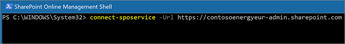

# Een site OneDrive naar een andere geografische locatie verplaatsen 

Met OneDrive geo-move kunt u de gegevens van een gebruiker OneDrive naar een andere geografische locatie verplaatsen. OneDrive geo-move wordt uitgevoerd door de SharePoint onlinebeheerder of de Microsoft 365 globale beheerder. Voordat u een geo-OneDrive start, moet u de gebruiker op de hoogte stellen van wie de OneDrive wordt verplaatst en raden ze aan alle bestanden te sluiten gedurende de duur van de verhuizing. (Als de gebruiker een document heeft geopend met de Office client tijdens de verhuizing, moet het document na het verplaatsen worden opgeslagen op de nieuwe locatie.) De verhuizing kan desgewenst voor een toekomstige periode worden gepland.

De OneDrive-service gebruikt Azure Blob Storage om inhoud op te slaan. De Storage blob die is gekoppeld aan de OneDrive van de gebruiker, wordt binnen 40 dagen na de OneDrive voor de gebruiker van de bron naar de doellocatie verplaatst. De toegang tot de OneDrive van de gebruiker wordt hersteld zodra de OneDrive beschikbaar is.

Tijdens OneDrive geoverhuisvenster (ongeveer 2-6 uur) is de OneDrive van de gebruiker ingesteld op alleen-lezen. De gebruiker heeft nog steeds toegang tot zijn of haar bestanden via OneDrive-synchronisatie app of via OneDrive site in SharePoint Online. Nadat OneDrive geoverplaatsing is voltooid, wordt de gebruiker automatisch verbonden met zijn of haar OneDrive op de geografische locatie van de bestemming wanneer hij of zij naar OneDrive in het start startstation voor Microsoft 365 app navigeert. De synchronisatie-app wordt automatisch vanaf de nieuwe locatie gesynchroniseerd.

Voor de procedures in dit artikel is Microsoft Office SharePoint Online [PowerShell-module vereist.](https://www.microsoft.com/download/details.aspx?id=35588)

## Communiceren met uw gebruikers

Wanneer u OneDrive sites verplaatst tussen geografische locaties, is het belangrijk om uw gebruikers te laten weten wat ze kunnen verwachten. Dit kan gebruikersverwarring en oproepen naar uw helpdesk helpen verminderen. E-mail uw gebruikers vóór de verhuizing en laat ze de volgende informatie weten:

- Wanneer de overstap wordt verwacht en hoe lang deze naar verwachting zal duren
- Naar welke geografische locatie de OneDrive wordt verplaatst en de URL voor toegang tot de nieuwe locatie
- Ze moeten hun bestanden sluiten en geen wijzigingen maken tijdens het verplaatsen.
- Bestandsmachtigingen en delen worden niet gewijzigd als gevolg van de verhuizing.
- Wat u kunt verwachten van [de gebruikerservaring in een multi-geo-omgeving](multi-geo-user-experience.md)

Zorg ervoor dat u uw gebruikers een e-mail stuurt wanneer de overstap is voltooid, zodat ze kunnen zien dat ze weer kunnen werken in OneDrive.

## Site-OneDrive plannen

U kunt de OneDrive van tevoren plannen (verder in dit artikel beschreven). Het is raadzaam om te beginnen met een klein aantal gebruikers om uw werkstromen en communicatiestrategieën te valideren. Zodra u vertrouwd bent met het proces, kunt u de volgende stappen plannen:

- U kunt maximaal 4.000 bewegingen tegelijk plannen.
- Wanneer de bewegingen beginnen, kunt u meer plannen, met een maximum van 4.000 in behandeling zijnde bewegingen in de wachtrij en een bepaalde tijd.
- De maximale grootte van een OneDrive die kan worden verplaatst, is 1 terabyte (1 TB).

## Een site OneDrive verplaatsen

Als u een OneDrive geo-move wilt uitvoeren, moet de tenantbeheerder eerst de voorkeurslocatie voor gegevens (PDL) van de gebruiker instellen op de juiste geografische locatie. Wanneer de PDL is ingesteld, wacht u ten minste 24 uur totdat de PDL-update wordt gesynchroniseerd over de geografische locaties voordat u de OneDrive geo-move.

Wanneer u de geoverplaatsings cmdlets gebruikt, maakt u verbinding met SPO Service op de huidige locatie OneDrive gebruiker, met de volgende syntaxis:

`Connect-SPOService -url https://<tenantName>-admin.sharepoint.com`

Bijvoorbeeld: Als u OneDrive gebruikers 'Matt@contosoenergy.onmicrosoft.com' wilt verplaatsen, maakt u verbinding met het EUR SharePoint-beheercentrum terwijl de OneDrive van de gebruiker zich op de geografische locatie van EUR bevindt:

`Connect-SPOSservice -url https://contosoenergyeur-admin.sharepoint.com`

## De omgeving valideren

Voordat u een geo-OneDrive start, raden we u aan de omgeving te valideren.

Voer het volgende uit om ervoor te zorgen dat alle geografische locaties compatibel zijn:

`Get-SPOGeoMoveCrossCompatibilityStatus`

U ziet een lijst met uw geografische locaties en of inhoud kan worden verplaatst, wordt aangeduid als 'Compatibel'. Als de opdracht 'Niet compatibel' retourneert, kunt u proberen de status op een later tijdstip te valideren.

Als een OneDrive bijvoorbeeld een subsite bevat, kan deze niet worden verplaatst. U kunt de cmdlet Start-SPOUserAndContentMove -ValidationOnly gebruiken om te valideren of de OneDrive kan worden verplaatst:

`Start-SPOUserAndContentMove -UserPrincipalName <UPN> -DestinationDataLocation <DestinationDataLocation> -ValidationOnly`

Dit geeft succes als de OneDrive gereed is om te worden verplaatst of Mislukken als er een wettelijke wacht- of subsite is die de overstap verhindert. Nadat u hebt gevalideerd dat de OneDrive klaar is om te worden verplaatst, kunt u de overstap starten.

## Een geo-OneDrive starten

Als u de move wilt starten, gaat u als volgende te werk:  

`Start-SPOUserAndContentMove -UserPrincipalName <UserPrincipalName> -DestinationDataLocation <DestinationDataLocation>`

Deze parameters gebruiken:

-   _UserPrincipalName:_ UPN van de gebruiker van wie OneDrive wordt verplaatst.

-   _DestinationDataLocation:_ Geo-Location waar de OneDrive moet worden verplaatst. Dit moet hetzelfde zijn als de gewenste gegevenslocatie van de gebruiker.

Als u bijvoorbeeld de OneDrive van matt@contosoenergy.onmicrosoft.com van EUR naar AUS wilt verplaatsen, gaat u als volgende te werk:

`Start-SPOUserAndContentMove -UserPrincipalName matt@contosoenergy.onmicrosoft.com -DestinationDataLocation AUS`

Als u een geografische beweging voor een later tijdstip wilt plannen, gebruikt u een van de volgende parameters:

-   _PreferredMoveBeginDate:_ de move begint waarschijnlijk op deze opgegeven tijd. Tijd moet worden opgegeven in Coordinated Universal Time (UTC).

-   _PreferredMoveEndDate:_ de move wordt waarschijnlijk voltooid op deze opgegeven tijd, op basis van de beste inspanning. Tijd moet worden opgegeven in Coordinated Universal Time (UTC). 

## Een geo-OneDrive annuleren 

U kunt de geografische beweging van de OneDrive van een gebruiker stoppen, mits de beweging niet wordt uitgevoerd of voltooid met behulp van de cmdlet:

`Stop-SPOUserAndContentMove – UserPrincipalName <UserPrincipalName>`

Waarbij _UserPrincipalName_ de UPN is van de gebruiker van wie OneDrive u wilt stoppen.

## Huidige status bepalen

U kunt de status van een OneDrive geo verplaatsen in of uit de geo die u hebt verbonden met de Get-SPOUserAndContentMoveState cmdlet.

De statussen voor verplaatsen worden in de volgende tabel beschreven.

<table>
<thead>
<tr class="header">
<th align="left">Status</th>
<th align="left">Omschrijving</th>
</tr>
</thead>
<tbody>
<tr class="odd">
<td align="left">NotStarted</td>
<td align="left">De move is nog niet gestart.</td>
</tr>
<tr class="even">
<td align="left">InProgress (<em>n</em>/4)</td>
<td align="left">De move wordt uitgevoerd in een van de volgende staten: Validatie (1/4), Back-up (2/4), Herstellen (3/4), Opschoning (4-4).</td>
</tr>
<tr class="odd">
<td align="left">Geslaagd</td>
<td align="left">De verhuizing is voltooid.</td>
</tr>
<tr class="even">
<td align="left">Mislukt</td>
<td align="left">De beweging is mislukt.</td>
</tr>
</tbody>
</table>

Gebruik de parameter UserPrincipalName om de status van de move van een specifieke gebruiker te vinden:

`Get-SPOUserAndContentMoveState -UserPrincipalName <UPN>`

Gebruik de parameter MoveState met een van de volgende waarden om de status van alle bewegingen in of uit de geografische locatie te vinden die u hebt verbonden: NotStarted, InProgress, Success, Failed, All.

`Get-SPOUserAndContentMoveState -MoveState <value>`

U kunt ook de `-Verbose` parameter toevoegen voor uitgebreidere beschrijvingen van de status verplaatsen.

## Gebruikerservaring

Gebruikers van OneDrive moeten minimale onderbrekingen zien als hun OneDrive naar een andere geografische locatie wordt verplaatst. Afgezien van een korte status alleen-lezen tijdens het verplaatsen, blijven bestaande koppelingen en machtigingen werken zoals verwacht wanneer de verhuizing is voltooid.

### Gebruikersgegevens OneDrive

Terwijl de move wordt uitgevoerd, is de OneDrive van de gebruiker ingesteld op alleen-lezen. Wanneer de overstap is voltooid, wordt de gebruiker doorgestuurd naar zijn of haar OneDrive in de nieuwe geografische locatie wanneer hij of zij naar OneDrive het start- Microsoft 365 app of een webbrowser navigeert.

### Machtigingen voor OneDrive inhoud

Gebruikers met machtigingen voor het OneDrive inhoud hebben nog steeds toegang tot de inhoud tijdens de verhuizing en nadat deze is voltooid.

### OneDrive-synchronisatie app 

De OneDrive-synchronisatie app detecteert automatisch en schakelt naadloos synchronisatie over naar de nieuwe OneDrive locatie zodra de OneDrive geoverplaatsing is voltooid. De gebruiker hoeft zich niet opnieuw aan te melden of een andere actie uit te voeren.  (Versie 17.3.6943.0625 of hoger van de synchronisatie-app vereist.)

Als een gebruiker een bestand bij werkt terwijl de OneDrive geo-move wordt uitgevoerd, ontvangt de synchronisatie-app een melding dat er een bestand wordt geüpload terwijl de overstap wordt uitgevoerd.

### Koppelingen voor delen 

Wanneer OneDrive geoverplaatsing hebt voltooid, worden de bestaande gedeelde koppelingen voor de bestanden die zijn verplaatst, automatisch omgeleid naar de nieuwe geografische locatie.

### OneNote Ervaring 

OneNote win32-client en uwp-app (Universal) worden notitieblokken automatisch gedetecteerd en naadloos gesynchroniseerd naar de nieuwe OneDrive-locatie wanneer OneDrive geo-move is voltooid. De gebruiker hoeft zich niet opnieuw aan te melden of een andere actie uit te voeren. De enige zichtbare indicator voor de gebruiker is dat de synchronisatie van notitieblokken mislukt wanneer OneDrive geo-move wordt uitgevoerd. Deze ervaring is beschikbaar in de volgende OneNote clientversies:

-   OneNote win32 – Versie 16.0.8326.2096 (en hoger)

-   OneNote UWP – Versie 16.0.8431.1006 (en hoger)

-   OneNote Mobiele app : versie 16.0.8431.1011 (en hoger)

### Teams app

Wanneer OneDrive geo-move hebt voltooid, hebben gebruikers toegang tot hun OneDrive bestanden in de Teams app. Bovendien blijven bestanden die worden gedeeld via Teams chat vanaf hun OneDrive voordat de geo-beweging wordt verplaatst, werken nadat de beweging is voltooid.

### OneDrive Mobiele app (iOS) 

Wanneer OneDrive geo-move voltooid is, moet de gebruiker zich aanmelden en zich opnieuw aanmelden in de mobiele iOS-app om te synchroniseren met de nieuwe OneDrive locatie.

### Bestaande gevolgde groepen en sites

Gevolgde sites en groepen worden in de OneDrive van de gebruiker, ongeacht hun geografische locatie. Sites en groepen die op een andere geografische locatie worden gehost, worden geopend op een apart tabblad.

### Delve Geo-URL-updates

Gebruikers worden alleen naar de Delve geo verzonden die overeenkomt met hun PDL nadat hun OneDrive is verplaatst naar de nieuwe geo.
