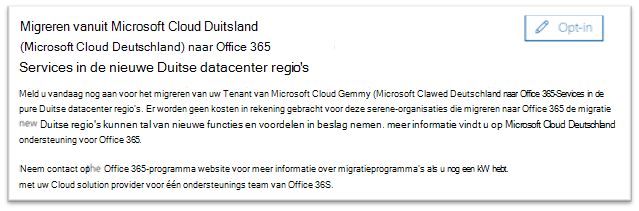

# Opt-in voor migratie van Microsoft Cloud Duitsland (Microsoft Cloud Deutschland) naar Office 365-Services in de nieuwe Duitse datacenter regio's

>[!Note]
>Dit artikel is alleen van toepassing op klanten met Microsoft Cloud Deutschland.
>

## Migratie aanvragen

In aanmerking komende klanten met dienstverlening in Microsoft Cloud Duitsland (Microsoft Cloud Deutschland) wordt een pagina weergegeven in het Microsoft 365-Beheercentrum zodat een tenantbeheerder van de klant zich kan aanmelden voor migratie.

Als u de pagina wilt openen in het Microsoft 365-Beheercentrum, vouwt u in het navigatiedeelvenster links de optie **instellingen** uit en klikt u vervolgens op **organisatieprofiel**.

Schuif op de profielpagina van **organisatie** omlaag naar het **migratie onderdeel van Microsoft Cloud Duitsland (Microsoft Cloud Deutschland) naar Office 365-Services in de sectie nieuwe Duitse datacenter regio's** .

Als uw organisatie de service wil migreren van Microsoft Cloud Duitsland (Microsoft Cloud Deutschland) naar Office 365-Services in de nieuwe Duitse datacenter gebieden, klikt u op **Aanmelden**.
 

Er verschijnt een nieuwe sectie aan de rechterkant van het scherm om de bevestiging te accepteren. Selecteer de wisselknop naast **Ja** en klik vervolgens op **Opslaan**.
 

Nadat een beheerder namens de Tenant heeft gemeldd, zien alle beheerders de bevestiging in de **migratie van Microsoft Cloud Duitsland (Microsoft Cloud Deutschland) naar Office 365-Services in de sectie nieuwe Duitse datacenter gebieden** , waaronder de datum van aanmelden. Beheerders ontvangen ook een bevestiging in het berichtencentrum van het Microsoft 365-Beheercentrum. 
 

## Wat gebeurt er nadat u bent aangemeld voor de migratie?

De migraties gaan in eerste 2021 voor organisaties die zich aanmelden bij de door Microsoft gerichte aanpak en worden voltooid vóór de einddatum van de einddatum van Microsoft Cloud Duitsland (Microsoft Cloud Deutschland) op 29 oktober 2021.  Als gevolg van de migratie worden de kerngegevens en abonnementen van klanten naar de nieuwe Duitse regio's verplaatst.  Microsoft stuurt updates tijdens het migratieproces in het berichtencentrum.  Zie onderstaande artikelen voor meer informatie.

## Wat gebeurt er als de tenantbeheerder van de klant niet aanmeldt voor migratie in het Beheercentrum?

De Online Services-voorwaarden zijn gewijzigd zodat ze ook Microsoft kunnen gebruiken voor het migreren van Microsoft 365, Dynamics 365 en Power BI-gegevens en abonnementen van Microsoft Cloud Deutschland naar een nieuw datacenter. Deze voorwaarden worden toegepast op een Microsoft Cloud Deutschland-abonnement dat is verlengd sinds 1 mei 2020.  De klant tenantbeheerder ontvangt een melding in het e-mailbericht en het berichtencentrum waarin u wordt gevraagd om automatisch aan te melden bij een Microsoft-migratie. Deze kennisgeving ontvangt minstens 30 dagen vóór de automatische opt-in.  Na de migratie wordt u deel gemaakt met alle communicatie-en statusupdates die zijn verzonden naar de tenantbeheerders van klanten in het berichtencentrum.

Tenantbeheerders van klanten en partners worden aangemoedigd om u aan te melden voor migratie in het Beheercentrum, zodat het migratieproces zo snel mogelijk kan beginnen.

## Volgende stap

[Inzicht in de ervaring van de klanten tijdens de migratie](ms-cloud-germany-transition-experience.md)

## Meer informatie

Aan de slag:

- [Migratie van Microsoft Cloud Deutschland naar Office 365-Services in de nieuwe Duitse datacenter gebieden](ms-cloud-germany-transition.md)
- [Migratie ondersteuning voor Microsoft Cloud Deutschland](https://aka.ms/germanymigrateassist)
- [Gebruikerservaring tijdens de migratie](ms-cloud-germany-transition-experience.md)

Door de overgang navigeren:

- [Acties en effecten voor de migratiefasen](ms-cloud-germany-transition-phases.md)
- [Extra vooraf werken](ms-cloud-germany-transition-add-pre-work.md)
- Aanvullende informatie over [Azure AD](ms-cloud-germany-transition-azure-ad.md), [apparaten](ms-cloud-germany-transition-add-devices.md), [ervaringen](ms-cloud-germany-transition-add-experience.md)en [AD FS](ms-cloud-germany-transition-add-adfs.md).

Cloud-apps:

- [Dynamics 365-migratieprogramma gegevens](https://aka.ms/d365ceoptin)
- [Informatie over migratieprogramma's voor Power BI](https://aka.ms/pbioptin)
- [Aan de slag met uw upgrade naar Microsoft teams](https://aka.ms/SkypeToTeams-Home)
