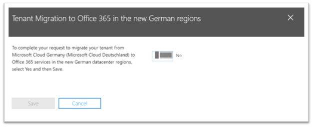

# Opt-in voor nieuwe migratie van Microsoft Cloud Germany (Microsoft Cloud Deutschland) naar Office 365 in de nieuwe Duitse datacenterregio'sHow to opt-in for new migration from Microsoft Cloud Germany (Microsoft Cloud Deutschland) to Office 365 services in the new German datacenter regions

> [!NOTE]
> Dit artikel is alleen van toepassing op klanten van Microsoft Cloud Germany (Microsoft Cloud Deutschland).This article only applies to Microsoft Cloud Germany (Microsoft Cloud Deutschland) customers.
>

## Migratie aanvragenHow to request migration

Als u een in aanmerking komende klant bent met uw service die is ingericht in Microsoft Cloud Germany (Microsoft Cloud Deutschland) en u zich hebt aangemeld als tenantbeheerder (globale) beheerder, kunt u zich op een pagina in het Microsoft 365-beheercentrum voor migratie kiezen.If you are an eligible customer with your service provisioned in Microsoft Cloud Germany (Microsoft Cloud Deutschland) and you have signed in as a tenant (global) administrator, a page in the Microsoft 365 admin center allows you to opt-in for migration.

Als u de pagina wilt openen, **vouwt u Instellingen** uit in het navigatiedeelvenster aan de linkerkant en klikt u vervolgens op **Organisatieprofiel.**To access the page, expand **Settings** in the navigation pane on the left, and then click **Organization Profile**.

Schuif op **de pagina Organisatieprofiel** omlaag naar de sectie Migreren van **Microsoft Cloud Germany (Microsoft Cloud Deutschland)** naar Office 365 services in de nieuwe duitse datacenterregio's.On the **Organization Profile** page, scroll down to the **Migrate from Microsoft Cloud Germany (Microsoft Cloud Deutschland) to Office 365 services in the new German datacenter regions** section.

Als u uw service wilt migreren van Microsoft Cloud Germany (Microsoft Cloud Deutschland) naar Office 365 services in de nieuwe Duitse datacenterregio's, klikt u op **Opt-in.**If you want to migrate your service from Microsoft Cloud Germany (Microsoft Cloud Deutschland) to Office 365 services in the new German datacenter regions, click **Opt-in**.
 

Aan de rechterkant van het scherm wordt een nieuwe sectie weergegeven om uw bevestiging te accepteren.A new section appears on the right side of your screen to accept your confirmation. Selecteer **Ja** en klik vervolgens op **Opslaan.**Select **Yes**, and then click **Save**.
 

Wanneer u zich hebt opgeslagen namens uw tenant, zien alle beheerders de bevestiging in Migreren van **Microsoft Cloud Germany (Microsoft Cloud Deutschland) naar Office 365-services in** de sectie nieuwe Duitse datacenterregio's, inclusief de datum van opt-in.Once you have opted-in on behalf of your tenant, all administrators will see the confirmation in **Migrate from Microsoft Cloud Germany (Microsoft Cloud Deutschland) to Office 365 services in the new German datacenter regions** section, including the date of opt-in. Beheerders ontvangen ook een bevestiging in het Berichtencentrum van het Microsoft 365 beheercentrum.Administrators will also receive a confirmation in the Message Center of the Microsoft 365 admin center. 
 

## Wat gebeurt er na het kiezen voor migratie?What happens after opting in for migration?

Migraties beginnen begin 2021 voor organisaties die zich hebben voor de microsoft-aanpak en zijn voltooid vóór de pensioendatum van Microsoft Cloud Germany (Microsoft Cloud Deutschland) op 29 oktober 2021.Migrations will begin in early 2021 for organizations that opt-in to the Microsoft-driven approach and will be complete before the Microsoft Cloud Germany (Microsoft Cloud Deutschland) retirement date on October 29, 2021.  Als gevolg van de migratie worden de belangrijkste klantgegevens en -abonnementen verplaatst naar de nieuwe Duitse regio's.As a result of the migration, core customer data and subscriptions are moved to the new German regions.  Microsoft plaatst updates tijdens het migratieproces in het Berichtencentrum.Microsoft will post updates throughout the migration process in the Message Center. Zie [deze artikelen voor](#more-information) meer informatie.See [these articles](#more-information) to learn more.

## Wat gebeurt er als u zich niet opt-in voor migratie in het beheercentrum?What happens if you do not opt-in for migration in Admin Center?

De Voorwaarden voor onlineservices zijn gewijzigd in termen waarmee Microsoft uw Microsoft 365, Dynamics 365 en Power BI-gegevens en -abonnementen van Microsoft Cloud Deutschland kan migreren naar een nieuw datacenter.The Online Services Terms have changed to include terms that will enable Microsoft to migrate your Microsoft 365, Dynamics 365, and Power BI data and subscriptions from Microsoft Cloud Deutschland to a new data center. Deze voorwaarden worden van kracht op elk Microsoft Cloud Germany -abonnement (Microsoft Cloud Deutschland) dat is verlengd met ingang van 1 mei 2020.These terms take effect on any Microsoft Cloud Germany (Microsoft Cloud Deutschland) subscription renewed since May 1, 2020. 

De beheerder van de klanttender ontvangt een melding in e-mail en het Berichtencentrum adviseert dat de aanmelding voor migratie automatisch zal plaatsvinden voor een migratie die door Microsoft wordt ondersteund.The customer tenant administrator will receive a notice in e-mail and the Message Center advising that opt-in to migration will happen automatically for a Microsoft-assisted migration. Deze melding wordt ten minste 30 dagen vóór de automatische opt-in verzonden.This notice will be sent at least 30 days prior to the automatic opt-in. Na de migratieopt-in worden alle communicatie- en statusupdates verzonden naar tenantbeheerders van klanten in het Berichtencentrum.After migration opt-in, all communications and status updates are sent to customer tenant administrators in the Message Center.

Beheerders van klant- en partnerten tenants worden aangeraden zich aan te geven voor migratie in het Microsoft 365-beheercentrum, zodat het migratieproces zo snel mogelijk kan beginnen.Customer and partner tenant administrators are encouraged to opt-in for migration in the Microsoft 365 admin center so the migration process can begin as soon as possible.

## Volgende stapNext step

[De klantervaring tijdens de migratie begrijpenUnderstand the customer experience during the migration](ms-cloud-germany-transition-experience.md)

## Meer informatieMore information

Aan de slag:Getting started:

- [Migratie van Microsoft Cloud Deutschland naar Office 365 services in de nieuwe Duitse datacenterregio'sMigration from Microsoft Cloud Deutschland to Office 365 services in the new German datacenter regions](ms-cloud-germany-transition.md)
- [Microsoft Cloud Deutschland-migratiehulpMicrosoft Cloud Deutschland Migration Assistance](https://aka.ms/germanymigrateassist)
- [Klantervaring tijdens de migratieCustomer experience during the migration](ms-cloud-germany-transition-experience.md)

Door de overgang lopen:Moving through the transition:

- [Acties en effecten voor de migratiefasenMigration phases actions and impacts](ms-cloud-germany-transition-phases.md)
- [Extra pre-workAdditional pre-work](ms-cloud-germany-transition-add-pre-work.md)
- Aanvullende informatie voor [Azure AD,](ms-cloud-germany-transition-azure-ad.md) [apparaten,](ms-cloud-germany-transition-add-devices.md) [ervaringen](ms-cloud-germany-transition-add-experience.md)en [AD FS.](ms-cloud-germany-transition-add-adfs.md)Additional information for [Azure AD](ms-cloud-germany-transition-azure-ad.md), [devices](ms-cloud-germany-transition-add-devices.md), [experiences](ms-cloud-germany-transition-add-experience.md), and [AD FS](ms-cloud-germany-transition-add-adfs.md).

Cloud-apps:Cloud apps:

- [Dynamics 365-migratieprogrammagegevensDynamics 365 migration program information](/dynamics365/get-started/migrate-data-german-region)
- [Power BI migratieprogrammagegevensPower BI migration program information](/power-bi/admin/service-admin-migrate-data-germany)
- [Aan de slag met uw Microsoft Teams upgradeGetting started with your Microsoft Teams upgrade](/microsoftteams/upgrade-start-here)
