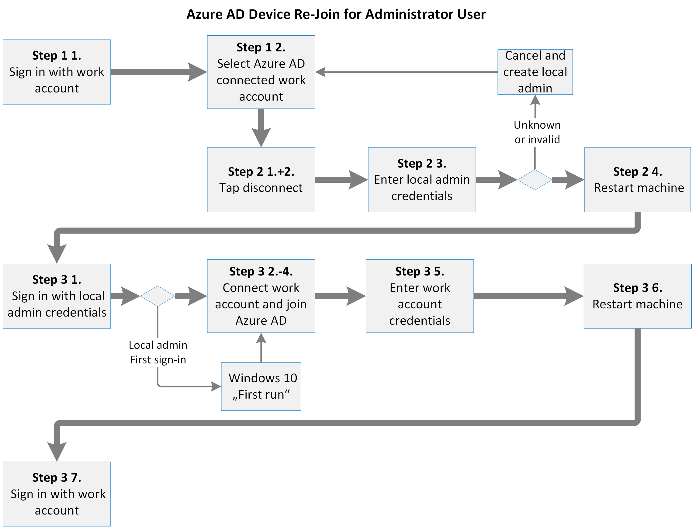

# <a name="additional-device-information-for-the-migration-from-microsoft-cloud-deutschland"></a>Aanvullende apparaatgegevens voor de migratie van Microsoft Cloud Deutschland

Verbonden en geregistreerde Azure AD-apparaten die zijn verbonden met Microsoft Cloud Deutschland, moeten worden gemigreerd na fase 9 en vóór fase 10. De migratie van een apparaat is afhankelijk van het type apparaat, het besturingssysteem en de Azure AD-relatie.

## <a name="azure-ad-joined-windows-10-devices"></a>Azure AD Joined Windows 10 apparaten
Als een Windows 10 Azure AD is gekoppeld, moet de verbinding met Azure AD zijn verbroken en opnieuw worden verbonden.

[](../media/ms-cloud-germany-migration-opt-in/AAD-ReJoin-flow.png#lightbox)


Als de gebruiker een beheerder is op het Windows 10 apparaat, kan de gebruiker de registratie van het apparaat uit Azure AD ongedaan maken en in drie stappen opnieuw deelnemen.

### <a name="step-1-determine-if-the-device-is-azure-id-joined"></a>Stap 1: bepalen of het apparaat is verbonden met Azure-id

1. Meld u aan met uw werkaccount.
2. Ga naar **Instellingen**  >  **Accounts**  >  **Access Work Or School**.
3. Zoek naar een account in de lijst met **verbonden met [...]' s Azure AD**.
4. Als er een verbonden account bestaat, gaat u verder met stap 2.

### <a name="step-2-disconnect-the-device-from-azure-ad"></a>Stap 2: Het apparaat loskoppelen van Azure AD

1. Klik **op Loskoppelen** op het verbonden werk- of schoolaccount.
2. Bevestig de verbinding tweemaal.
3. Voer een gebruikersnaam en wachtwoord van een lokale beheerder in. Het apparaat is losgekoppeld.
4. Start het apparaat opnieuw op.

### <a name="step-3-join-the-device-to-azure-ad"></a>Stap 3: Deelnemen aan het apparaat aan Azure AD

1. Meld u aan met de referenties van de lokale beheerder.
2. Ga naar **Instellingen**  >  **Accounts**  >  **Access Work Or School**.
3. Klik op **Verbinding maken**.
4. **BELANGRIJK:** Klik op **Deelnemen aan Azure AD.**
5. Voer het e-mailadres en wachtwoord van uw werkaccount in. Het apparaat is verbonden.
6. Start het apparaat opnieuw op.
7. Meld u aan met het e-mailadres en wachtwoord van uw werkaccount.

Als de gebruiker geen beheerder van het apparaat is, kan een globale beheerder van Azure AD het lokale beheerdersaccount op het apparaat maken na dit configuratiepad en het apparaat ontvoegen:

*Instellingen > Accounts > Andere accounts > referenties onbekend > Gebruiker toevoegen zonder Microsoft-account*

Als u opnieuw wilt deelnemen, kunnen de referenties van een werkaccount van uw organisatie in deze stap worden gebruikt.

Houd er rekening mee dat het werkaccount dat wordt gebruikt om deel te nemen aan het apparaat automatisch wordt gepromoveerd als beheerder van het apparaat.
Elk ander werkaccount van de organisatie kan zich aanmelden bij het apparaat, maar heeft geen beheerdersbevoegdheden.

## <a name="azure-ad-registered-workplace-joined-windows-10-devices"></a>Azure AD-geregistreerde (werkplek-verbonden) Windows 10 apparaten

Als een Windows 10 Azure AD is geregistreerd, moet dit worden losgekoppeld van de Azure AD en opnieuw worden verbonden.

[](../media/ms-cloud-germany-migration-opt-in/AAD-ReJoin-flow.png#lightbox)

### <a name="step-1-determine-if-the-device-is-azure-id-registered"></a>Stap 1: bepalen of het apparaat is geregistreerd als Azure-id

1. Meld u aan met uw gebruiker.
2. Ga naar **Instellingen**  >  **Accounts**  >  **Access Work Or School**.
3. Ontdek uw werkaccount in de lijst en controleer of het is **verbonden met [...]' s Azure AD**.

    Als uw werkaccount in de lijst staat, maar niet is verbonden met een Azure AD, gaat u verder met stap 2.

    Anders is uw apparaat een apparaat dat deel uit maakt van Azure AD en moet u verwijzen naar [Azure AD Joined Windows 10 apparaten.](#azure-ad-joined-windows-10-devices)

### <a name="step-2-disconnect-the-device-from-azure-ad"></a>Stap 2: Het apparaat loskoppelen van Azure AD

1. Klik op uw werkaccount. De knoppen *Info* en *Loskoppelen worden* weergegeven.
2. Klik **op Loskoppelen.**
3. Bevestig accountverwijdering van het apparaat door op Ja **te klikken.**

### <a name="step-3-connect-the-device-to-azure-ad"></a>Stap 3: Verbinding maken naar Azure AD

1. Klik op **Verbinding maken**.
2. Voer het e-mailadres van uw werkaccount in en klik op **Volgende.**
3. Voer het wachtwoord van uw werkaccount in en klik **op Aanmelden.**
4. Bevestig door op Klaar **te klikken.** Uw werkaccount wordt opnieuw weergegeven.

## <a name="android"></a>Android

Voor Android moeten gebruikers de registratie van hun apparaten ongedaan maken en opnieuw registreren. Dit kan via de Microsoft Authenticator app of de Bedrijfsportal app.

- Vanuit de Microsoft Authenticator app kunnen gebruikers naar Instellingen > **Apparaatregistratie** gaan. Van hieruit kunnen gebruikers hun registratie ongedaan maken en hun apparaat opnieuw registreren.

- Vanuit de Bedrijfsportal kunnen gebruikers naar het **tabblad** Apparaten gaan en het apparaat verwijderen. Daarna kunt u het apparaat opnieuw registreren met behulp van Bedrijfsportal.

- Gebruikers kunnen zich ook afmelden en opnieuw registreren door het account te verwijderen van de pagina accountinstellingen en vervolgens het werkaccount opnieuw toe te voegen.

U kunt de registratie van het apparaat op Android ongedaan maken en opnieuw registreren met de Microsoft Authenticator app:

1. Open de Microsoft Authenticator app en ga naar **Instellingen.**
2. Selecteer **Apparaatregistratie.**
3. De registratie van het apparaat ongedaan maken door **Afmelden te selecteren.**
4. Voor **apparaatregistratie,** moet u het apparaat opnieuw registreren door uw e-mailadres te typen en vervolgens **Registreren te selecteren.**

Een Android-apparaat op de pagina Android-Instellingen opnieuw registreren:

1. Open **Apparaat Instellingen** en ga naar **Accounts.**
2. Selecteer het werkaccount dat u opnieuw wilt registreren en selecteer **Account verwijderen.**
3. Nadat het account is verwijderd, selecteert u op de **pagina Accounts** de optie Account toevoegen **> werkaccount.**
4. Voor **Workplace Join** typt u uw e-mailadres en **selecteert** u Deelnemen om de registratie van het apparaat te voltooien.

U kunt de registratie van het apparaat op Android ongedaan maken en opnieuw registreren Bedrijfsportal:

1. Start Bedrijfsportal en ga naar **het tabblad** Apparaten.
2. Selecteer het apparaat om de apparaatdetails te bekijken.
3. Selecteer apparaat verwijderen in het menu drie puntjes (drie puntjes) en voltooi de verwijdering door dit te bevestigen in het dialoogvenster.
4. U moet nu zijn afgemeld bij de Bedrijfsportal app. Selecteer **Aanmelden om** het apparaat opnieuw te registreren.

Bekijk de informatie over Azure Active Directory (Azure AD) in Aanvullende Azure AD-informatie voor de migratie van [Microsoft Cloud Deutschland](ms-cloud-germany-transition-azure-ad.md)voor meer informatie over acties die nodig zijn tijdens de migratiefase van deze werkbelasting of de gevolgen voor beheer of gebruik.

## <a name="ios"></a>iOS

Op iOS-apparaten moet een gebruiker accounts in de cache handmatig verwijderen uit de Microsoft Authenticator, het apparaat uitschrijven en zich afmelden bij native apps op het apparaat.

### <a name="step-1-if-present-remove-the-account-from-the-microsoft-authenticator-app"></a>Stap 1: Als u aanwezig bent, verwijdert u het account uit de Microsoft Authenticator app

1. Tik op het account in de Microsoft Authenticator app.
2. Tik op **Instellingen** in de rechterbovenhoek. Als u het pictogram  Instellingen niet ziet, gebruikt u mogelijk niet de nieuwste versie van Microsoft Authenticator.
3. Tik op **de knop Account** verwijderen.
4. Tik **op Alle apps op dit apparaat.**

### <a name="step-2-unregister-the-device-from-the-microsoft-authenticator-app"></a>Stap 2: Het apparaat uit de app Microsoft Authenticator verwijderen

1. Tik op het menupictogram in de rechterbovenhoek.
2. Tik **Instellingen** en vervolgens **op Apparaatregistratie.**
3. Als uw account wordt weergegeven, tikt u **op Apparaat afmelden** en **doorgaan** in het dialoogvenster. Daarna ziet u geen account meer.

### <a name="step-3-sign-out-from-individual-apps-if-necessary"></a>Stap 3: Meld u indien nodig af bij afzonderlijke apps

Gebruikers kunnen naar afzonderlijke apps gaan, zoals Outlook, Teams en OneDrive en accounts uit die apps verwijderen.

## <a name="frequently-asked-questions"></a>Veelgestelde vragen

**Hoe weet ik of mijn organisatie is beïnvloed?**

Beheerders moeten controleren of ze azure AD-geregistreerde of `https://portal.microsoftazure.de` Azure AD-apparaten hebben. Als uw organisatie azure AD-geregistreerde of Azure AD-apparaten heeft, moet uw organisatie de instructies op deze pagina volgen.

**Wanneer registreren mijn gebruikers hun apparaten opnieuw?**

Het is essentieel voor uw succes dat u uw apparaten alleen uitschrijft en opnieuw registreert nadat [fase 9](ms-cloud-germany-transition-phases.md#phase-9--10-azure-ad-finalization) is voltooid. U moet de herregistratie voltooien voordat fase 10 wordt gestart, anders hebt u geen toegang meer tot uw apparaat.

**Hoe weet ik dat al mijn apparaten zijn geregistreerd in de openbare cloud?**

Als u wilt controleren of uw apparaten zijn geregistreerd in de openbare cloud, moet u de lijst met apparaten exporteren en downloaden van de Azure AD-portal naar een Excel spreadsheet. Filter vervolgens de apparaten die zijn geregistreerd (met behulp van de kolom _registeredTime)_ na de datum waarop uw organisatie fase 9 van het [migratieproces heeft doorlopen.](ms-cloud-germany-transition-phases.md#phase-9--10-azure-ad-finalization)

## <a name="additional-considerations"></a>Aanvullende overwegingen

> [!IMPORTANT]
> De Intune-service principal wordt ingeschakeld na [fase 3 van](ms-cloud-germany-transition-phases.md#phase-3-subscription-transfer)het migratieproces, wat de activering van Azure AD Device Registration impliceert. Als u Azure AD Device Registration vóór de migratie hebt geblokkeerd, moet u de Intune-service principal met PowerShell uitschakelen om Azure AD Device Registration weer uit te schakelen met de Azure AD-portal. U kunt de Intune-service principal uitschakelen met deze opdracht in Azure Active Directory PowerShell voor Graph module.

```powershell
Get-AzureADServicePrincipal -All:$true |Where-object -Property AppId -eq "0000000a-0000-0000-c000-000000000000" | Set-AzureADServicePrincipal -AccountEnabled:$false
```

## <a name="more-information"></a>Meer informatie

Aan de slag:

- [Migratie van Microsoft Cloud Deutschland naar Office 365 services in de nieuwe Duitse datacenterregio's](ms-cloud-germany-transition.md)
- [Microsoft Cloud Deutschland-migratiehulp](https://aka.ms/germanymigrateassist)
- [Opt-in voor migratie](ms-cloud-germany-migration-opt-in.md)
- [Klantervaring tijdens de migratie](ms-cloud-germany-transition-experience.md)

Door de overgang lopen:

- [Acties en effecten voor de migratiefasen](ms-cloud-germany-transition-phases.md)
- [Extra pre-work](ms-cloud-germany-transition-add-pre-work.md)
- Aanvullende informatie voor [Azure AD,](ms-cloud-germany-transition-azure-ad.md) [apparaten,](ms-cloud-germany-transition-add-devices.md) [ervaringen](ms-cloud-germany-transition-add-experience.md)en [AD FS.](ms-cloud-germany-transition-add-adfs.md)

Cloud-apps:

- [Dynamics 365-migratieprogrammagegevens](/dynamics365/get-started/migrate-data-german-region)
- [Power BI migratieprogrammagegevens](/power-bi/admin/service-admin-migrate-data-germany)
- [Aan de slag met uw Microsoft Teams upgrade](/microsoftteams/upgrade-start-here)
