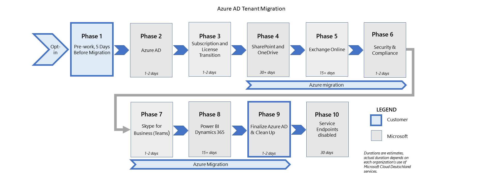

# Acties voor migratie fasen en effecten voor de migratie van Microsoft Cloud Deutschland (algemeen)Migration phases actions and impacts for the migration from Microsoft Cloud Deutschland (general)

Tenant migraties van Microsoft Cloud Deutschland naar de Duitse regio van de Office 365-services van Microsoft worden uitgevoerd als een reeks fasen en de bijbehorende geconfigureerde acties voor elke werkbelasting.Tenant migrations from Microsoft Cloud Deutschland to the Germany region of Microsoft's Office 365 services are executed as a set of phases and their configured actions for each workload. In deze afbeelding ziet u de negen fasen van de migratie naar de nieuwe Duitse datacenters.This figure shows the nine phases of migration to the new German datacenters.

De fasen en de bijbehorende acties zorgen ervoor dat essentiële gegevens en ervaringen worden gemigreerd naar de Office 365-Services.The phases and their actions ensure that critical data and experiences are migrated to the Office 365 services. Nadat u de Tenant hebt toegevoegd aan de migratie wachtrij, wordt elke werkbelasting voltooid als een reeks stappen die worden uitgevoerd op de backend-service.After your tenant is added to the migration queue, each workload will be completed as a set of steps that are executed on the backend service. Voor sommige belastingen zijn mogelijk acties vereist door de beheerder (of gebruiker), of de migratie kan van invloed zijn op het gebruik voor de fasen die worden uitgevoerd en besproken in [de manier waarop de migratie wordt georganiseerd.](ms-cloud-germany-transition.md#how-is-the-migration-organized)Some workloads may require actions by the administrator (or user), or the migration may affect usage for the phases that are executed and discussed in [How is the migration organized?](ms-cloud-germany-transition.md#how-is-the-migration-organized)

De volgende secties bevatten acties en effecten voor werkbelastingen wanneer ze worden uitgevoerd in verschillende fasen van de migratie.The following sections contain actions and effects for workloads as they progress through various phases of the migration. Bekijk de tabellen en bepaal welke acties of effecten van toepassing zijn op uw organisatie.Review the tables and determine which actions or effects are applicable to your organization. Zorg ervoor dat u ervoor hebt gezorgd dat u de stappen in de juiste fasen gaat uitvoeren.Ensure that you're prepared to execute the steps in the respective phases as required. Als u de noodzakelijke stappen niet kunt voltooien, kunnen de service storing oplopen en kan de migratie naar Office 365-Services vertraging veroorzaken.Failure to complete necessary steps may result in service outage and might delay completion of the migration to the Office 365 services.

## Exchange Online (fase 5 van 9)Exchange Online (Phase 5 of 9)

| Stap (s)Step(s) | BeschrijvingDescription | Van toepassing opApplies to | GevolgImpact |
|:-------|:-----|:-------|:-------|
| Nieuwe Duitse regio wordt toegevoegd aan de bestaande organisatie-instelling, en postvakken worden verplaatst naar Office 365-Services.New Germany region is added to existing organization setup, and mailboxes are moved to Office 365 services. | Exchange Online-configuratie voegt de nieuwe Go-Local Duitse regio toe aan de overgangs organisatie.Exchange Online configuration adds the new go-local German region to the transitioning organization. Deze regio van Office 365-Services wordt ingesteld als standaard, zodat de interne taakverdelingsservice postvakken opnieuw kan distribueren naar het juiste standaardgebied in Office 365-Services.This Office 365 services region is set as default, which enables the internal load-balancing service to redistribute mailboxes to the appropriate default region in Office 365 services. In deze overgang bevinden gebruikers aan de kant (Duitsland of Office 365-Services) zich in dezelfde organisatie en kunnen beide URL-eindpunten gebruiken.In this transition, users on either side (Germany or Office 365 services) are in the same organization and can use either URL endpoint. | Exchange OnlineExchange Online | -Migreer gebruikers en services van Duitsland Url's naar Office 365-Services Url's ( `https://outlook.office365.com` ).- Transition users and services from Germany URLs to Office 365 services URLs (`https://outlook.office365.com`).    -Gebruikers blijven de service via oudere Duitsland-Url's tijdens de migratie verder raadplegen.- Users will continue to access the service via legacy Germany URLs during the migration. U hoeft geen directe actie te ondernemen.No immediate action needed.    -Gebruikers moeten beginnen met de functies office.com Portal for Office Online (agenda, E-mail, personen).- Users should begin to use the office.com portal for Office Online features (Calendar, Mail, People). Navigatie naar services die nog niet zijn gemigreerd naar Office 365-Services, werkt pas na migratie.Navigation to services that aren't yet migrated to Office 365 services won't function until migrated.    -Outlook Web App biedt geen ondersteuning voor het maken van openbare mappen tijdens migraties.- Outlook Web App won't provide the public folder experience during migration. |
|||||

Aanvullende overwegingen:Additional considerations:

- `myaccount.msft.com` functioneert alleen na de cutover van Office 365.`myaccount.msft.com` will only work after the cutover of Office 365. Koppelingen maken een foutmelding ' er is een fout opgetreden ' wordt weergegeven tot die tijd.Links will produce "something went wrong" error messages until that time.

- Gebruikers van Outlook Web app die toegang krijgen tot een gedeeld postvak in de andere omgeving (bijvoorbeeld een gebruiker in de Duitse omgeving opent een gedeeld postvak in de algemene omgeving), wordt u gevraagd om een tweede keer te verifiëren.Users of Outlook Web App that access a shared mailbox in the other environment (for example, a user in the Germany environment accesses a shared mailbox in the global environment) will be prompted to authenticate a second time. De gebruiker moet zich eerst verifiëren en toegang tot zijn postvak in `outlook.office.de` , en dan het gedeelde postvak openen `outlook.office365.com` .The user must first authenticate and access their mailbox in `outlook.office.de`, then open the shared mailbox that is in `outlook.office365.com`. De persoon moet een tweede keer verifiëren wanneer ze toegang krijgen tot gedeelde bronnen die worden gehost in de andere service.They'll need to authenticate a second time when accessing the shared resources that are hosted in the other service.

- Voor bestaande klanten van Microsoft Cloud Deutschland of deze in overgang, wanneer een gedeeld postvak wordt toegevoegd aan Outlook met behulp van **bestand > informatie > account toevoegen**, mislukt het weergeven van Agendamachtigingen (de Outlook-client probeert de rest-API te gebruiken `https://outlook.office.de/api/v2.0/Me/Calendars` ). Klanten die een account willen toevoegen om Agendamachtigingen weer te geven, kunnen de registersleutel toevoegen, zoals beschreven in [wijzigingen in de gebruikerservaring voor het delen van een agenda in Outlook](https://support.microsoft.com/office/user-experience-changes-for-sharing-a-calendar-in-outlook-5978620a-fe6c-422a-93b2-8f80e488fdec) om ervoor te zorgen dat deze actie mislukt.For existing Microsoft Cloud Deutschland customers or those in transition, when a shared mailbox is added to Outlook by using **File > Info > Add Account**, viewing calendar permissions may fail (the Outlook client attempts to use the Rest API `https://outlook.office.de/api/v2.0/Me/Calendars`.) Customers who want to add an account to view calendar permissions can add the registry key as described in [User experience changes for sharing a calendar in Outlook](https://support.microsoft.com/office/user-experience-changes-for-sharing-a-calendar-in-outlook-5978620a-fe6c-422a-93b2-8f80e488fdec) to ensure this action will succeed. Met deze registersleutel kunt u de hele organisatie implementeren met behulp van Groepsbeleid.This registry key can be deployed organization-wide by using Group Policy.

- Tijdens de migratie fase, met behulp van de PowerShell-cmdlets **New-migrationEndpoint**, **set-migrationEndpoint** en **test-MigrationsServerAvailability** kunnen fouten veroorzaken (fout op proxy).During the migration phase, using the PowerShell cmdlets **New-migrationEndpoint**, **Set-MigrationEndpoint**, and **Test-MigrationsServerAvailability** can result in errors (error on proxy). Dit gebeurt wanneer het arbitrage postvak naar de wereld is gemigreerd, maar het postvak van de beheerder niet al dan niet is omgekeerd.This happens when the arbitration mailbox has migrated to worldwide but the admin mailbox hasn't or vice-versa. U kunt dit oplossen door tijdens het maken van de Tenant PowerShell-sessie het arbitrage postvak als de routerings Hint in de **ConnectionUri** te gebruiken.To resolve this, while creating the tenant PowerShell session, use the arbitration mailbox as the routing hint in the **ConnectionUri**. Voorbeeld: `New-PSSession -ConfigurationName Microsoft.Exchange -ConnectionUri "https://outlook.office365.com/powershell-liveid?email=Migration.8f3e7716-2011-43e4-96b1-aba62d229136@TENANT.onmicrosoft.de" -Credential $UserCredential -Authentication Basic -AllowRedirection`For example: `New-PSSession -ConfigurationName Microsoft.Exchange -ConnectionUri "https://outlook.office365.com/powershell-liveid?email=Migration.8f3e7716-2011-43e4-96b1-aba62d229136@TENANT.onmicrosoft.de" -Credential $UserCredential -Authentication Basic -AllowRedirection`

- Als u Exchange Online hybride gebruikt:If you're using Exchange Online hybrid:

    - U moet de wizard hybride configuratie (HCW) opnieuw uitvoeren om on-premises configuratie bij te werken bij Microsoft Cloud Deutschland vóór de overgang, en de HCW opnieuw te uitvoeren bij het opschonen van Office 365-Services.You must rerun the Hybrid Configuration wizard (HCW) to update on-premises configuration against Microsoft Cloud Deutschland before the transition, and rerun the HCW upon cleanup against the Office 365 services. Als u aangepaste domeinen gebruikt, zijn er mogelijk extra DNS-updates vereist.Additional DNS updates may be required if you use custom domains.

Als u meer wilt weten over de verschillen voor organisaties in migratie en nadat Exchange Online-bronnen zijn gemigreerd, bekijkt u de informatie in de gebruikers [ervaring tijdens de migratie naar Office 365-Services in de nieuwe Duitse datacenter regio's](ms-cloud-germany-transition-experience.md).To find out more about the differences for organizations in migration and after Exchange Online resources are migrated, review the information in [Customer experience during the migration to Office 365 services in the new German datacenter regions](ms-cloud-germany-transition-experience.md).

## Exchange Online Protection (fase 6 van 9)Exchange Online Protection (Phase 6 of 9)

De back-end Exchange Online Protection (EOP)-functies worden gekopieerd naar de nieuwe Duitse regio.Back-end Exchange Online Protection (EOP) features are copied to new Germany region. 

| Stap (s)Step(s) | BeschrijvingDescription | Van toepassing opApplies to | GevolgImpact |
|:-------|:-----|:-------|:-------|
| Migratie van Exchange Online Routering en historisch berichtdetail.Migration of Exchange Online routing and historical message detail. | Met Exchange Online kunt u de routering van externe hosts naar Office 365.Exchange Online enables routing from external hosts to Office 365. De externe MX-records worden overgezet naar routering naar de EOP-service.The external MX records are transitioned to route to the EOP service. Tenant configuratie en historische gegevens worden gemigreerd.Tenant configuration and historical details are migrated. | Exchange Online-klantenExchange Online customers | -Microsoft – beheerde DNS-vermeldingen worden bijgewerkt van Office 365 Duitsland EOP naar Office 365-Services.- Microsoft–managed DNS entries are updated from Office 365 Germany EOP to Office 365 services.    -Klanten moeten dertig dagen na EOP Dual write voor EOP-migratie wachten.- Customers should wait for 30 days after EOP dual write for EOP migration. Anders zijn er mogelijk verlies van gegevens.Otherwise, there may be data loss. |
|||||

## SharePoint Online (fase 4 van 9)SharePoint Online (Phase 4 of 9)

| Stap (s)Step(s) | BeschrijvingDescription | Van toepassing opApplies to | GevolgImpact |
|:-------|:-----|:-------|:-------|
| SharePoint en OneDrive worden doorgeschakeld.SharePoint and OneDrive are transitioned. | SharePoint en OneDrive worden gemigreerd van Microsoft Cloud Deutschland naar Office 365-Services in deze fase.SharePoint and OneDrive are migrated from Microsoft Cloud Deutschland to Office 365 services in this phase. Bestaande Url's voor Microsoft Cloud Deutschland blijven behouden (bijvoorbeeld `contoso.sharepoint.de` ).Existing Microsoft Cloud Deutschland URLs are preserved (for example, `contoso.sharepoint.de`). Tokens die zijn uitgegeven door Microsoft Cloud Deutschland of Office 365-Services, zijn geldig tijdens de overgang.Tokens that were issued by Microsoft Cloud Deutschland or Office 365 services are valid during the transition. | SharePoint-klantenSharePoint customers | -De inhoud is gedurende twee korte perioden tijdens de migratie alleen-lezen.- Content will be read-only for two brief periods during migration. U krijgt een melding dat u tijdens deze periode de banner ' u kunt de inhoud niet bewerken ' kunt verwachten in SharePoint.During this time, expect a "you can't edit content" banner in SharePoint.    -De zoekindex wordt niet bewaard en kan tot 10 dagen duren.- The search index won't be preserved, and may take up to 10 days to be rebuilt.    -SharePoint/OneDrive-inhoud wordt voor twee korte perioden tijdens de migratie alleen-lezen.- SharePoint/OneDrive content will be read-only for two brief periods during migration. Gebruikers zien een vaandel met de tekst ' u kunt de banner niet kort bewerken ' tijdens deze periode.Users will see a "you can't edit content" banner briefly during this time.    -De zoekindex is mogelijk niet beschikbaar terwijl de index opnieuw wordt opgebouwd.- The search index may be unavailable while the index is rebuilt. Tijdens deze periode kunnen zoekquery's geen volledige resultaten opleveren.During this period, search queries might not return complete results.    -Bestaande sites blijven behouden.- Existing sites are preserved. |
|||||

Aanvullende overwegingen:Additional considerations:

- Na voltooiing van de SharePoint Online-migratie naar de Duitse regio, worden gegevens indexen opnieuw opgebouwd.Upon completion of the SharePoint Online migration to the German region, data indexes are rebuilt. Functies die afhankelijk zijn van zoekindexen, kunnen worden beïnvloed wanneer u de indexering opnieuw uitvoert.Features that are dependent on search indexes may be affected while reindexing completes.

- Als in uw organisatie nog steeds SharePoint 2010-werkstromen worden gebruikt, werken ze niet meer na 31 december 2021.If your organization still uses SharePoint 2010 workflows, they'll no longer function after December 31, 2021. SharePoint 2013-werkstromen blijven ondersteund, alhoewel dit standaard is uitgeschakeld voor nieuwe tenants vanaf 1 november 2020.SharePoint 2013 workflows will remain supported, although turned off by default for new tenants starting on November 1, 2020. Na de migratie naar de SharePoint Online-service is het raadzaam om over te stappen op geautomatiseerde of andere ondersteunde oplossingen.After migration to the SharePoint Online service is complete, we recommend that you to move to Power Automate or other supported solutions.

- Na voltooiing van de OneDrive-migratie naar de Duitse regio, worden gegevens indexen opnieuw opgebouwd.Upon completion of the OneDrive migration to the German region, data indexes are rebuilt. Functies die afhankelijk zijn van zoekindexen, kunnen worden beïnvloed wanneer opnieuw indexeren wordt uitgevoerd.Features that depend on search indexes may be affected while reindexing is in progress.

- Klanten van Microsoft Cloud Deutschland wiens SharePoint Online-exemplaar nog niet is gemigreerd, hoeven niet te worden gemigreerd naar SharePoint Online PowerShell-module/Microsoft. SharePoint Online. CSOM versie 16.0.20616.12000 of lager.Microsoft Cloud Deutschland customers whose SharePoint Online instance is not yet migrated need to stay on SharePoint Online PowerShell module/Microsoft.SharePointOnline.CSOM version 16.0.20616.12000 or below. Anders kunnen verbindingen met SharePoint Online via PowerShell of het object model aan de clientzijde niet worden uitgevoerd.Otherwise, connections to SharePoint Online via PowerShell or the client-side object model will fail.

- Klanten van Microsoft Cloud Deutschland wiens SharePoint Online-exemplaar is gemigreerd, moeten SharePoint Online PowerShell-module/Microsoft. SharePoint Online. CSOM bijwerken naar versie 16.0.20717.12000 of hoger.Microsoft Cloud Deutschland customers whose SharePoint Online instance is migrated must update SharePoint Online PowerShell module/Microsoft.SharePointOnline.CSOM to version 16.0.20717.12000 or above. Anders kunnen verbindingen met SharePoint Online via PowerShell of het object model aan de clientzijde niet worden uitgevoerd.Otherwise, connections to SharePoint Online via PowerShell or the client-side object model will fail.

## Skype voor bedrijven online (fase 7 van 9)Skype for Business Online (Phase 7 of 9)

| Stap (s)Step(s) | BeschrijvingDescription | Van toepassing opApplies to | GevolgImpact |
|:-------|:-----|:-------|:-------|
| Migratie van Skype voor bedrijven naar teams.Migration of Skype for Business to Teams. | Bestaande Skype voor bedrijven-klanten worden gemigreerd naar Office 365-Services in Europa en worden vervolgens overgezet naar Microsoft teams in de Duitse regio van Office 365-Services.Existing Skype for Business customers are migrated to Office 365 services in Europe and then transitioned to Microsoft Teams in the Germany region of Office 365 services. | Skype voor bedrijven-klantenSkype for Business customers | -Gebruikers kunnen zich niet aanmelden bij Skype voor bedrijven op de migratiedatum.- Users won't be able to sign in to Skype for Business on the migration date. Tien dagen voorafgaand aan de migratie plaatsen we een bericht naar het Beheercentrum om u te laten weten wanneer de migratie plaatsvindt en opnieuw wanneer de migratie wordt gestart.Ten days before migration, we'll post to the Admin center to let you know about when the migration will take place, and again when we begin the migration.    -Beleidsconfiguratie wordt gemigreerd.- Policy configuration is migrated.    -Gebruikers worden gemigreerd naar teams en zullen na de migratie niet langer Skype voor bedrijven.- Users will be migrated to Teams and will no longer have Skype for Business after migration.    -Voor gebruikers moet de bureaubladtoepassing teams zijn geïnstalleerd.- Users must have the Teams desktop client installed. De installatie zal plaatsvinden gedurende de tien dagen via het beleid voor de Skype voor bedrijven-infrastructuur, maar als dit mislukt, moeten gebruikers de client downloaden of verbinding maken met een ondersteunde browser.Installation will happen during the 10 days via policy on the Skype for Business infrastructure, but if this fails, users will still need to download the client or connect with a supported browser.    -Contactpersonen en vergaderingen worden gemigreerd naar teams.- Contacts and meetings will be migrated to Teams.    -Gebruikers kunnen zich niet aanmelden bij Skype voor bedrijven tussen tijdsservice overgangen naar Office 365-Services en niet totdat de DNS-gegevens van de klant zijn voltooid.- Users won't be able to sign in to Skype for Business between time service transitions to Office 365 services, and not until customer DNS entries are completed.    -Contactpersonen en bestaande vergaderingen blijven werken als vergaderingen in Skype voor bedrijven.- Contacts and existing meetings will continue to function as Skype for Business meetings. |
|||||

## Office-servicesOffice Services

De MRU-service (most recently used) in Office is een cutover van de Duitse service voor Office 365-Services, geen migratie.The most recently used (MRU) service in Office is a cutover from the Germany service to Office 365 services, not a migration. Alleen MRU-koppelingen uit de kant van Office 365-Services zijn zichtbaar na de migratie van de portal van Office.com.Only MRU links from the Office 365 services side will be visible after migration from the Office.com portal. MRU-koppelingen uit de Duitsland-service zijn niet zichtbaar als MRU-koppelingen in Office 365-Services.MRU links from the Germany service aren't visible as MRU links in Office 365 services. In Office 365 zijn de MRU-koppelingen alleen toegankelijk nadat de Tenant migratie is voltooid.In Office 365, MRU links are accessible only after the tenant migration is complete.

## LedenSubscription

| Stap (s)Step(s) | BeschrijvingDescription | Van toepassing opApplies to | GevolgImpact |
|:-------|:-----|:-------|:-------|
| We kunnen geen klanten zonder toestemming migreren.We can't migrate customers without consent. | Microsoft verkrijgt het recht om te migreren op een van de volgende twee manieren, zodat Microsoft de overgang van gegevens en services kan overdragen aan het exemplaar van Office 365 Services.Microsoft gains the right to migrate in one of two ways, which enables Microsoft to orchestrate the transition of data and services to the Office 365 services instance.   De beheerder-inzoomen op de door Microsoft gerichte migratie.The admin opts-in to the Microsoft-driven migration.   Klanten vernieuwen een abonnement op hun Microsoft Cloud Deutschland-Tenant na 1 mei 2020.Customers renew any subscriptions in their Microsoft Cloud Deutschland tenant after May 1, 2020. We sturen u elke maand een melding van deze klanten van de migratie, wacht 30 dagen om klanten een mogelijkheid te bieden een mogelijkheid te bieden om te annuleren en klik vervolgens rechtstreeks aanmelden, bijgehouden in ICM.We'll notify these customers of the migration right each month, wait 30 days to give customers a chance to cancel, and then directly opt-in, tracked in ICM. | Alle Office-klantenAll Office Customers | -De Tenant is gemarkeerd als afgestemd op de migratie, en de bevestiging wordt in het Beheercentrum weergegeven.- Tenant is marked as consented for migration, and Admin Center displays confirmation.    -Bevestiging wordt gepubliceerd naar Cloud Duitsland-berichtencentrum Tenant.- Acknowledgment is posted to Cloud Germany Message Center Tenant. Service configuratie gaat door van Microsoft Cloud Deutschland-eindpunten.Service configuration continues from Microsoft Cloud Deutschland endpoints.    -Bewaak berichtencentrum voor updates over de status van de migratie fase.- Monitor Message Center for updates on Migration phase status. |
| Abonnementen worden overgebracht en licenties worden opnieuw toegewezen.Subscriptions are transferred, and licenses are reassigned. | Nadat de Tenant is overgezet naar Office 365-Services, worden bijbehorende Office 365-Serviceabonnementen aangeschaft voor de overgezette Microsoft Cloud Deutschland-abonnementen.After the tenant is transitioned to Office 365 services, corresponding Office 365 services subscriptions are purchased for the transferred Microsoft Cloud Deutschland subscriptions. Gebruikers met toegewezen Microsoft Cloud Deutschland-licenties worden toegewezen Office 365-Services-licenties.Users with assigned Microsoft Cloud Deutschland licenses will be assigned Office 365 services licenses. Oudere Microsoft Cloud Deutschland-abonnementen worden na voltooiing van de Office 365 service-Tenant verwijderd.Legacy Microsoft Cloud Deutschland subscriptions are removed from the Office 365 services tenant on completion. | Alle Office-klantenAll Office customers | Wijzigingen in bestaande abonnementen worden geblokkeerd (bijvoorbeeld: geen nieuwe abonnements aankopen of het wijzigen van het aantal seats) tijdens deze fase.- Changes to existing subscriptions will be blocked (for example, no new subscription purchases or seat count changes) during this phase.    -Wijzigingen van licentietoewijzingen worden geblokkeerd.- License assignment changes will be blocked.    -Het Microsoft Cloud Deutschland-abonnement wordt gemigreerd naar het bijbehorende Office 365 Services-abonnement.- The Microsoft Cloud Deutschland subscription will be migrated to corresponding Office 365 services subscription. De aanbiedingen van dit abonnement voor Office 365 services worden gedefinieerd door Microsoft (ook wel bekend als de _aanbiedings toewijzingen_).The Office 365 services offer of that subscription is defined by Microsoft (also known as _Offer mapping_).    -Het aantal functies (Serviceabonnementen) dat wordt aangeboden door Office 365-Services kan groter zijn dan de aanbieding in de oorspronkelijke Microsoft Cloud Deutschland.- The number of features (service plans) offered by Office 365 services can be larger than in the original Microsoft Cloud Deutschland offer. Gebruikerslicenties in Office 365-Services zijn gelijk aan soortgelijke Microsoft Cloud Deutschland-functies (serviceplannen).User licenses in Office 365 services will be equivalently assigned to similar Microsoft Cloud Deutschland features (service plans). Gebruikerslicenties voor alle gebruikers worden automatisch toegewezen aan de nieuwe functies.User licenses of all users will be automatically assigned to the new features. De beheerder moet, indien nodig, expliciete actie ondernemen om deze licenties uit te schakelen.The admin needs to take an explicit action to disable those licenses, if needed.    -Wanneer de abonnements migratie is voltooid, zijn zowel Office 365-Services als Duitsland-abonnementen zichtbaar in de Office 365-beheer Portal, met de status van Duitsland- _abonnementen._- When subscription migration is complete, both Office 365 services and Germany subscriptions will be visible in the Office 365 Admin Portal, with the status of Germany subscriptions as _deprovisioned_.    -Gebruikers krijgen opnieuw een licentie toegewezen die zijn gekoppeld aan de nieuwe Office 365-service-abonnementen.- Users will be reassigned licenses that are tied to the new Office 365 services subscriptions. Klant processen met afhankelijkheden van Duitsland-abonnementen of SKU-GUID'S worden verbroken en moeten worden herzien met de aanbieding van Office 365 Services.Any customer processes that have dependencies on Germany subscriptions or SKU GUIDs will be broken and need to be revised with the Office 365 services offering.    -Nieuwe abonnementen in de Office 365-services worden gekocht met de nieuwe periode (per maand/kwartaal) en de klant ontvangt een betaald bedrag voor het ongebruikte saldo van het Microsoft Cloud Deutschland-abonnement.- New subscriptions in the Office 365 services will be purchased with the new term (monthly/quarterly/yearly), and the customer will receive a prorated refund for the unused balance of the Microsoft Cloud Deutschland subscription.    -Partners Microsoft Cloud Deutschland-tenants worden niet gemigreerd.- Partner Microsoft Cloud Deutschland tenants won't be migrated. CSP-klanten worden gemigreerd naar Office 365-Services onder de nieuwe Office 365 service-Tenant van dezelfde partner.CSP customers will be migrated to Office 365 services under the new Office 365 services tenant of the same partner. Na de klant migratie kan de partner deze klant alleen beheren vanuit de Office 365 service-Tenant.After customer migration, the partner can manage this customer only from the Office 365 services tenant.    -Er is extra functionaliteit beschikbaar (bijvoorbeeld Microsoft planner en Microsoft flow), tenzij dit door de tenantbeheerder is uitgeschakeld. Voor informatie over het uitschakelen van service-abonnementen die aan gebruikerslicenties zijn toegewezen, raadpleegt [u de toegang tot Microsoft 365-Services uitschakelen terwijl u gebruikerslicenties toewijst](disable-access-to-services-while-assigning-user-licenses.md).- Additional functionality is available (for example, Microsoft Planner and Microsoft Flow), unless disabled by tenant admin. For information about how to disable service plans that are assigned to users' licenses, see [Disable access to Microsoft 365 services while assigning user licenses](disable-access-to-services-while-assigning-user-licenses.md).  |
|||||

## Volgende stapNext step

[Extra voor werk uitvoerenPerform additional pre-work](ms-cloud-germany-transition-add-pre-work.md)

## Meer informatieMore information

Aan de slag:Getting started:

- [Migratie van Microsoft Cloud Deutschland naar Office 365-Services in de nieuwe Duitse datacenter gebiedenMigration from Microsoft Cloud Deutschland to Office 365 services in the new German datacenter regions](ms-cloud-germany-transition.md)
- [Migratie ondersteuning voor Microsoft Cloud DeutschlandMicrosoft Cloud Deutschland Migration Assistance](https://aka.ms/germanymigrateassist)
- [Hoe kan ik me aanmelden voor migratie?How to opt-in for migration](ms-cloud-germany-migration-opt-in.md)
- [Gebruikerservaring tijdens de migratieCustomer experience during the migration](ms-cloud-germany-transition-experience.md)

Door de overgang navigeren:Moving through the transition:

- [Extra vooraf werkenAdditional pre-work](ms-cloud-germany-transition-add-pre-work.md)
- Aanvullende informatie over [Azure AD](ms-cloud-germany-transition-azure-ad.md), [apparaten](ms-cloud-germany-transition-add-devices.md), [ervaringen](ms-cloud-germany-transition-add-experience.md)en [AD FS](ms-cloud-germany-transition-add-adfs.md).Additional information for [Azure AD](ms-cloud-germany-transition-azure-ad.md), [devices](ms-cloud-germany-transition-add-devices.md), [experiences](ms-cloud-germany-transition-add-experience.md), and [AD FS](ms-cloud-germany-transition-add-adfs.md).

Cloud-apps:Cloud apps:

- [Dynamics 365-migratieprogramma gegevensDynamics 365 migration program information](https://aka.ms/d365ceoptin)
- [Informatie over migratieprogramma's voor Power BIPower BI migration program information](https://aka.ms/pbioptin)
- [Aan de slag met uw upgrade naar Microsoft teamsGetting started with your Microsoft Teams upgrade](https://aka.ms/SkypeToTeams-Home)
