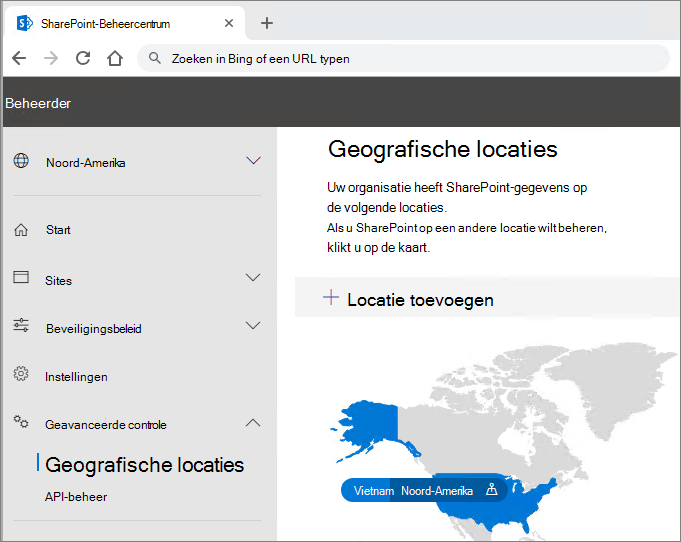

# Mogelijkheden voor meervoudige geo in OneDrive en SharePoint Online

Met mogelijkheden voor meervoudige geo in OneDrive en SharePoint Online kunt u de besturing van het land of de regio met gedeelde bronnen zoals SharePoint-Team sites en Microsoft 365-groeps postvakken bewaren.

Voor elke gebruiker, groeps postvak en SharePoint-site is een voorkeurs gegevenslocatie (PDL) beschikbaar waarmee de geografische locatie wordt aangegeven waar gerelateerde gegevens moeten worden opgeslagen. De persoonsgegevens (Exchange-postvak en OneDrive) van gebruikers en de Microsoft 365-groepen of SharePoint-sites die ze maken, kunnen op de opgegeven geo-locatie worden opgeslagen om te voldoen aan de vereisten voor data-woonplaats. U kunt [verschillende beheerders opgeven voor elke geografische locatie](add-a-sharepoint-geo-admin.md).

Gebruikers krijgen een naadloze ervaring wanneer ze Microsoft 365-Services gebruiken, waaronder Office-toepassingen, OneDrive en Search. Zie [de gebruikerservaring in een omgeving met meerdere geografische gebruikers](multi-geo-user-experience.md) voor meer informatie.

## OneDrive

U kunt de OneDrive van elke gebruiker op de site van een beheerder richten of [verplaatsen](move-onedrive-between-geo-locations.md) naar een locatie op de locatie van de gebruiker op basis van de PDL van de gebruiker. Persoonlijke bestanden worden vervolgens bewaard op die geografische locatie, maar ze kunnen worden gedeeld met gebruikers in andere geografische locaties.

## SharePoint-sites en-groepen

Het beheer van de functie voor meervoudige geo is beschikbaar via het SharePoint-Beheercentrum. Meer informatie vindt u in het [bijbehorende blogbericht](https://techcommunity.microsoft.com/t5/Office-365-Blog/Now-available-Multi-Geo-in-SharePoint-and-Office-365-Groups/ba-p/263302).

Wanneer een gebruiker een SharePoint-groepssite maakt die is verbonden met een SharePoint-site in een omgeving met meerdere geo-geografische omgevingen, wordt de persoonlijke locatie gebruikt om de locatie te bepalen waar de site en het bijbehorende groeps postvak worden gemaakt. (Als de waarde voor PDL PDL van de gebruiker niet is ingesteld of is ingesteld op geo-locatie die niet is geconfigureerd als een satelliet locatie, worden de site en het postvak in de centrale locatie gemaakt.)

Microsoft 365-Services, behalve Exchange, OneDrive en SharePoint, zijn niet meerdere geo. Microsoft 365-groepen die zijn gemaakt door deze services, worden echter vastgelegd met de PDL van de auteur en via hun Exchange-groeps postvak en de site van de Office 365-groep die is ingericht in de bijbehorende geo. 

## De omgeving voor meerdere geografische gebieden beheren

Het instellen en beheren van uw omgeving met meerdere geografische omgevingen doet u door het SharePoint-Beheercentrum. 

(Voor sommige acties, zoals het verplaatsen van een SharePoint-site of een OneDrive-site is Microsoft PowerShell vereist.)

## Zie ook

[Meerdere geografische groepen in SharePoint-en Microsoft 365-groepen](https://techcommunity.microsoft.com/t5/Office-365-Blog/Now-available-Multi-Geo-in-SharePoint-and-Office-365-Groups/ba-p/263302)

[Een multi-geo-omgeving beheren](administering-a-multi-geo-environment.md)

[SharePoint-opslag quota's in meerdere geografische omgevingen](sharepoint-multi-geo-storage-quota.md)

[Postvakken van Exchange Online in een omgeving met meerdere geografische gebieden beheren](administering-exchange-online-multi-geo.md)
