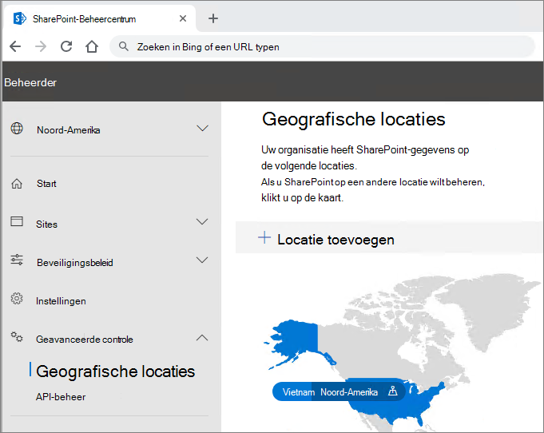

# Microsoft 365 Multi-Geo tenantconfiguratieMicrosoft 365 Multi-Geo tenant configuration

Voordat u uw tenant configureert voor Microsoft 365 [Multi-Geo, moet u Plan voor Microsoft 365 Multi-Geo hebben gelezen.](plan-for-multi-geo.md)Before you configure your tenant for Microsoft 365 Multi-Geo, be sure you have read [Plan for Microsoft 365 Multi-Geo](plan-for-multi-geo.md). Als u de stappen in dit artikel wilt volgen, hebt u een lijst nodig met de geografische locaties die u wilt inschakelen als satellietlocaties en de testgebruikers die u wilt inrichten voor die locaties.To follow the steps in this article, you'll need a list of the geo locations that you want to enable as satellite locations, and the test users that you want to provision for those locations.

## De multi-geo-mogelijkheden in uw Microsoft 365-abonnement toevoegen aan uw tenantAdd the Multi-Geo Capabilities in your Microsoft 365 plan to your tenant

Als u Microsoft 365 Multi-Geo wilt gebruiken, hebt u de _Multi-Geo-mogelijkheden in microsoft 365-abonnement_ nodig.To use Microsoft 365 Multi-Geo, you need the _Multi-Geo Capabilities in Microsoft 365_ plan. Werk samen met uw accountteam om dit plan toe te voegen aan uw tenant.Work with your account team to add this plan to your tenant. Uw accountteam verbindt u met de juiste licentiespecialist en laat uw tenant configureren.Your account team will connect you with the appropriate licensing specialist and get your tenant configured.

Houd er rekening _mee dat de Multi-Geo Capabilities in Microsoft 365-abonnement_ een serviceplan op gebruikersniveau zijn.Note that the _Multi-Geo Capabilities in Microsoft 365_ plan are a user-level service plan. U hebt een licentie nodig voor elke gebruiker die u wilt hosten op een satellietlocatie.You need a license for each user that you want to host in a satellite location. U kunt in de tijd meer licenties toevoegen als u gebruikers toevoegt op satellietlocaties.You can add more licenses over time as you add users in satellite locations.

Zodra uw tenant is ingericht met de  _multi-geo-mogelijkheden in microsoft 365-abonnement,_ wordt het tabblad Geolocaties beschikbaar in de OneDrive- en SharePoint-beheercentra.Once your tenant has been provisioned with the  _Multi-Geo Capabilities in Microsoft 365_ plan, the **Geo locations** tab will become available in the OneDrive and SharePoint admin centers.

## Satellietlocaties toevoegen aan uw tenantAdd satellite locations to your tenant

U moet een satellietlocatie toevoegen voor elke geografische locatie waar u gegevens wilt opslaan.You must add a satellite location for each geo location where you want to store data. Beschikbare geografische locaties worden weergegeven in de volgende tabel:Available geo locations are shown in the following table:

[!INCLUDE [Microsoft 365 Multi-Geo locations](../includes/microsoft-365-multi-geo-locations.md)]

Een satellietlocatie toevoegenTo add a satellite location

1. Open het SharePoint-beheercentrum.Open the SharePoint admin center.

2. Ga naar het **tabblad Geolocaties.**Navigate to the **Geo locations** tab.

3. Klik **op Locatie toevoegen.**Click **Add location**.

4. Selecteer de locatie die u wilt toevoegen en klik vervolgens op **Volgende.**Select the location that you want to add, and then click **Next**.

5. Typ het domein dat u wilt gebruiken met de geografische locatie en klik vervolgens op **Toevoegen.**Type the domain that you want to use with the geo location, and then click **Add**.

6. Klik op **Sluiten**.Click **Close**.

Inrichting kan enkele uren tot 72 uur duren, afhankelijk van de grootte van uw tenant.Provisioning may take from a few hours up to 72 hours, depending on the size of your tenant. Wanneer de inrichting van een satellietlocatie is voltooid, ontvangt u een bevestiging per e-mail.Once provisioning of a satellite location has completed, you will receive an email confirmation. Wanneer de nieuwe geografische locatie blauw wordt  weergegeven op de kaart op het tabblad Geolocaties in het OneDrive-beheercentrum, kunt u doorgaan met het instellen van de gewenste gegevenslocatie van gebruikers op die geografische locatie.When the new geo location appears in blue on the map on the **Geo locations** tab in the OneDrive admin center, you can proceed to set users' preferred data location to that geo location. 

> [!IMPORTANT]
> Uw nieuwe satellietlocatie wordt ingesteld met standaardinstellingen.Your new satellite location will be set up with default settings. Op deze manier kunt u die satellietlocatie zo configureren dat deze geschikt is voor uw lokale nalevingsbehoeften.This will allow you to configure that satellite location as appropriate for your local compliance needs.

## De gewenste gegevenslocatie van gebruikers instellenSetting users' preferred data location
 

Nadat u de benodigde satellietlocaties hebt ingeschakeld, kunt u uw gebruikersaccounts bijwerken om de gewenste gegevenslocatie te gebruiken.Once you enable the needed satellite locations, you can update your user accounts to use the appropriate preferred data location. We raden u aan een voorkeurslocatie voor gegevens in te stellen voor elke gebruiker, zelfs als deze gebruiker zich op de centrale locatie bevindt.We recommend that you set a preferred data location for every user, even if that user is staying in the central location.

> [!IMPORTANT]
> Als de gewenste gegevenslocatie van een gebruiker is ingesteld op een locatie die niet is geconfigureerd als een satellietlocatie of de centrale locatie, wordt het systeem standaard op de centrale locatie ingesteld bij het inrichten van OneDrive- en SharePoint-sites en Groepspostvakken.If a user's preferred data location is set to a location that has not been configured as a satellite location or the central location, the system will default to the central location when provisioning OneDrive and SharePoint sites and Group mailboxes.

> [!TIP]
> U wordt aangeraden validaties te starten met een testgebruiker of een kleine groep gebruikers voordat u multi-geo uitrolt naar uw bredere organisatie.We recommend that you begin validations with a test user or small group of users before rolling out multi-geo to your broader organization.

In Azure Active Directory (Azure AD) zijn er twee typen gebruikersobjecten: alleen cloudgebruikers en gesynchroniseerde gebruikers.In Azure Active Directory (Azure AD) there are two types of user objects: cloud only users and synchronized users. Volg de juiste instructies voor uw type gebruiker.Please follow the appropriate instructions for your type of user.

### De voorkeurslocatie voor gegevens van de gebruiker synchroniseren met Azure AD ConnectSynchronize user's Preferred Data Location using Azure AD Connect 

Als de gebruikers van uw bedrijf worden gesynchroniseerd van een on-premises Active Directory-systeem naar Azure AD, moet hun PreferredDataLocation worden ingevuld in AD en worden gesynchroniseerd met Azure AD.If your company's users are synchronized from an on-premises Active Directory system to Azure AD, their PreferredDataLocation must be populated in AD and synchronized to Azure AD.

Volg het proces in Azure Active Directory Connect-synchronisatie: Configureer voorkeursgegevenslocatie voor [Microsoft 365-resources](/azure/active-directory/hybrid/how-to-connect-sync-feature-preferreddatalocation) om synchronisatie van voorkeursgegevenslocatie te configureren van uw on-premises Active Directory Domain Services (AD DS) naar Azure AD.Follow the process in [Azure Active Directory Connect sync: Configure preferred data location for Microsoft 365 resources](/azure/active-directory/hybrid/how-to-connect-sync-feature-preferreddatalocation) to configure Preferred Data Location sync from your on-premises Active Directory Domain Services (AD DS) to Azure AD.

U wordt aangeraden de voorkeurslocatie voor gegevens van de gebruiker in te stellen als onderdeel van uw standaardwerkstroom voor het maken van gebruikers.We recommend that you include setting the user's Preferred Data Location as a part of your standard user creation workflow.

> [!IMPORTANT]
> Voor nieuwe gebruikers zonder OneDrive-inrichting moet u ten minste 24 uur wachten nadat de PDL van een gebruiker is gesynchroniseerd met Azure AD voordat de gebruiker zich aanmeldt bij OneDrive voor Bedrijven.For new users with no OneDrive provisioned, wait at least 24 hours after a user's PDL is synchronized to Azure AD for the changes to propagate before the user logs in to OneDrive for Business. (Als u de gewenste gegevenslocatie instelt voordat de gebruiker zich aanmeldt om zijn of haar OneDrive voor Bedrijven in te delen, zorgt u ervoor dat de nieuwe OneDrive van de gebruiker op de juiste locatie wordt ingericht.)(Setting the preferred data location before the user logs in to provision their OneDrive for Business ensures that the user's new OneDrive will be provisioned in the correct location.)

### Voorkeursgegevenslocatie instellen voor alleen gebruikers in de cloudSetting Preferred Data Location for cloud only users 

Als de gebruikers van uw bedrijf niet worden gesynchroniseerd van een on-premises Active Directory-systeem naar Azure AD, wat betekent dat ze worden gemaakt in Microsoft 365 of Azure AD, moet de PDL worden ingesteld met de Microsoft Azure Active Directory-module voor Windows PowerShell.If your company's users are not synchronized from an on-premises Active Directory system to Azure AD, meaning they are created in Microsoft 365 or Azure AD, then the PDL must be set using the Microsoft Azure Active Directory Module for Windows PowerShell.

Voor de procedures in deze sectie is de [Microsoft Azure Active Directory-module voor Windows PowerShell-module vereist.](https://www.powershellgallery.com/packages/MSOnline/1.1.166.0)The procedures in this section require the [Microsoft Azure Active Directory Module for Windows PowerShell Module](https://www.powershellgallery.com/packages/MSOnline/1.1.166.0). Als u deze module al hebt geïnstalleerd, controleert u of u de nieuwste versie hebt bijgewerkt.If you already have this module installed, please ensure you update to the latest version.

1.  [Maak verbinding en meld u aan](/powershell/connect-to-microsoft-365-powershell.md#connect-with-the-microsoft-azure-active-directory-module-for-windows-powershell) met een set globale beheerdersreferenties voor uw tenant.[Connect and sign in](/powershell/connect-to-microsoft-365-powershell.md#connect-with-the-microsoft-azure-active-directory-module-for-windows-powershell) with a set of global administrator credentials for your tenant.

2.  Gebruik de [cmdlet Set-MsolUser](/powershell/msonline/v1/set-msoluser) om de gewenste gegevenslocatie in te stellen voor elk van uw gebruikers.Use the [Set-MsolUser](/powershell/msonline/v1/set-msoluser) cmdlet to set the preferred data location for each of your users. Bijvoorbeeld:For example:

    `Set-MsolUser -userprincipalName Robyn.Buckley@Contoso.com -PreferredDatalocation EUR`

    U kunt controleren of de gewenste gegevenslocatie correct is bijgewerkt met de Get-MsolUser cmdlet.You can check to confirm that the preferred data location was updated properly by using the Get-MsolUser cmdlet. Bijvoorbeeld:For example:

    `(Get-MsolUser -userprincipalName Robyn.Buckley@Contoso.com).PreferredDatalocation`

U wordt aangeraden de voorkeurslocatie voor gegevens van de gebruiker in te stellen als onderdeel van uw standaardwerkstroom voor het maken van gebruikers.We recommend that you include setting the user's Preferred Data Location as a part of your standard user creation workflow.

> [!IMPORTANT]
> Voor nieuwe gebruikers zonder OneDrive-inrichting moet u ten minste 24 uur wachten nadat de PDL van een gebruiker is ingesteld om de wijzigingen door te voeren voordat de gebruiker zich aanmeldt bij OneDrive.For new users with no OneDrive provisioned, wait at least 24 hours after a user's PDL is set for the changes to propagate before the user logs in to OneDrive. (Als u de gewenste gegevenslocatie instelt voordat de gebruiker zich aanmeldt om zijn of haar OneDrive voor Bedrijven in te delen, zorgt u ervoor dat de nieuwe OneDrive van de gebruiker op de juiste locatie wordt ingericht.)(Setting the preferred data location before the user logs in to provision their OneDrive for Business ensures that the user's new OneDrive will be provisioned in the correct location.)

## OneDrive-inrichting en het effect van PDLOneDrive Provisioning and the effect of PDL

Als de gebruiker al een OneDrive-site heeft gemaakt in de tenant, wordt de bestaande OneDrive niet automatisch verplaatst door de PDL in te stellen.If the user already has a OneDrive site created in the tenant, setting their PDL will not automatically move their existing OneDrive. Zie OneDrive voor Bedrijven Geo Move als u oneDrive van een gebruiker [wilt verplaatsen.](move-onedrive-between-geo-locations.md)To move a user's OneDrive, see [OneDrive for Business Geo Move](move-onedrive-between-geo-locations.md).

> [!NOTE]
> Exchange Online verplaatst automatisch het postvak van de gebruiker als de PLD wordt gewijzigd en de Postvakregio niet meer overeenkomt met de geolocatiecode van de postvakdatabase.Exchange Online automatically relocates the user's mailbox if the PLD changes and the MailboxRegion no longer matches the Mailbox Database Geo Location code. Zie Exchange Online-postvakken beheren in een [multi-geoomgeving](./administering-exchange-online-multi-geo.md)voor meer informatie.For more information, see [Administering Exchange Online mailboxes in a multi-geo environment](./administering-exchange-online-multi-geo.md).

Als de gebruiker geen OneDrive-site binnen de tenant heeft, wordt OneDrive voor de gebruiker ingericht op basis van de PDL-waarde, ervan uitgaande dat de PDL voor de gebruiker overeenkomt met een van de satellietlocaties van het bedrijf.If the user does not have a OneDrive site within the tenant, OneDrive will be provisioned for them in accordance to their PDL value, assuming the PDL for the user matches one of the company's satellite locations.

## Zoeken met meerdere geografische gegevens configurerenConfiguring Multi-Geo search

Uw multi-geoten tenant heeft statistische zoekmogelijkheden waarmee een zoekquery resultaten kan retourneren vanaf elke locatie in de tenant.Your multi-geo tenant will have aggregate search capabilities allowing a search query to return results from anywhere within the tenant.

Zoekopdrachten op deze invoerpunten leveren standaard statistische resultaten op, ook al bevindt elke zoekindex zich op de relevante geografische locatie:By default, searches from these entry points will return aggregate results, even though each search index is located within its relevant geo location:

- OneDrive voor BedrijvenOneDrive for Business

- DelveDelve

- SharePoint HomeSharePoint Home

- ZoekcentrumSearch Center

Bovendien kunnen zoekmogelijkheden met meerdere geografische functies worden geconfigureerd voor uw aangepaste zoektoepassingen die gebruikmaken van de SharePoint-zoek-API.Additionally, multi-geo search capabilities can be configured for your custom search applications that use the SharePoint search API.

Raadpleeg [Zoeken naar OneDrive voor Bedrijven Multi-Geo](configure-search-for-multi-geo.md) configureren voor instructies, inclusief eventuele beperkingen en verschillen.Please review [Configure Search for OneDrive for Business Multi-Geo](configure-search-for-multi-geo.md) for instructions including any limitations and differences.

## De Configuratie van Microsoft 365 Multi-Geo validerenValidating the Microsoft 365 Multi-Geo configuration

Hieronder vindt u enkele basisgebruiksgevallen die u mogelijk wilt opnemen in uw validatieplan voordat u Microsoft 365 Multi-Geo breed uitrolt naar uw bedrijf.Below are some basic use cases you may wish to include in your validation plan before broadly rolling out Microsoft 365 Multi-Geo to your company. Nadat u deze tests en eventuele aanvullende gebruiksgevallen hebt voltooid die relevant zijn voor uw bedrijf, kunt u ervoor kiezen om door te gaan met het toevoegen van de gebruikers in uw eerste testgroep.Once you have completed these tests and any additional use cases that are relevant to your company, you may choose to move on to adding the users in your initial pilot group.

**OneDrive voor Bedrijven****OneDrive for Business**

Selecteer OneDrive in het start programma voor apps van Microsoft 365 en bevestig dat u automatisch wordt doorgestuurd naar de juiste geografische locatie voor de gebruiker, op basis van de PDL van de gebruiker.Select OneDrive from the Microsoft 365 app launcher and confirm that you are automatically directed to the appropriate geo location for the user, based on the user's PDL. OneDrive voor Bedrijven moet nu beginnen met de inrichting op die locatie.OneDrive for Business should now begin provisioning at that location. Wanneer u deze hebt ingericht, kunt u proberen om bepaalde documenten te uploaden en te downloaden.Once provisioned, try uploading and downloading some documents.

**OneDrive Mobile App****OneDrive Mobile App**

Meld u aan bij uw mobiele OneDrive-app met uw testaccountreferenties.Log into your OneDrive mobile App with your test account credentials. Bevestig dat u uw OneDrive voor Bedrijven-bestanden kunt zien en dat u er vanaf uw mobiele apparaat mee kunt werken.Confirm that you can see your OneDrive for Business files and can interact with them from your mobile device.

**OneDrive-synchronisatieclient****OneDrive sync client**

Controleer of de OneDrive-synchronisatieclient automatisch uw oneDrive voor Bedrijven-geografische locatie detecteert wanneer u zich aanmeldt.Confirm that the OneDrive sync client automatically detects your OneDrive for Business geo location upon login. Als u de synchronisatieclient wilt downloaden, klikt u op **Synchroniseren** in de OneDrive-bibliotheek.If you need to download the sync client, you can click **Sync** in the OneDrive library.

**Office-toepassingen****Office applications**

Bevestig dat u toegang hebt tot OneDrive voor Bedrijven door u aan te melden vanuit een Office-toepassing, zoals Word.Confirm that you can access OneDrive for Business by logging in from an Office application, such as Word. Open de Office-toepassing en selecteer 'OneDrive – <TenantName> '.Open the Office application and select "OneDrive – <TenantName>". Office detecteert uw OneDrive-locatie en toont u de bestanden die u kunt openen.Office will detect your OneDrive location and show you the files that you can open.

**Delen****Sharing**

Probeer OneDrive-bestanden te delen.Try sharing OneDrive files. Controleer of de personen picker u al uw SharePoint Online-gebruikers laat zien, ongeacht hun geografische locatie.Confirm that the people picker shows you all your SharePoint online users regardless of their geo location.