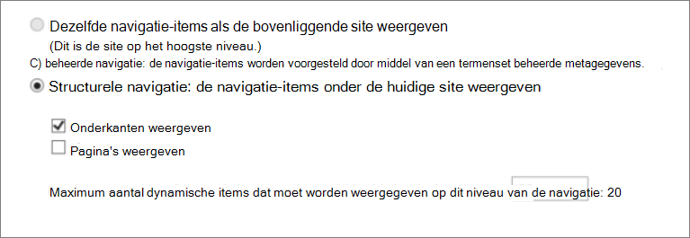
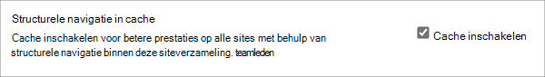
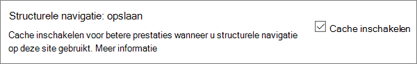

# <a name="navigation-options-for-sharepoint-online"></a><span data-ttu-id="06688-103">Navigatieopties voor SharePoint Online</span><span class="sxs-lookup"><span data-stu-id="06688-103">Navigation options for SharePoint Online</span></span>

<span data-ttu-id="06688-104">In dit artikel worden sites met navigatieopties beschreven SharePoint Publiceren is ingeschakeld in SharePoint Online.</span><span class="sxs-lookup"><span data-stu-id="06688-104">This article describes navigation options sites with SharePoint Publishing enabled in SharePoint Online.</span></span> <span data-ttu-id="06688-105">De keuze en configuratie van navigatie zijn aanzienlijk van invloed op de prestaties en schaalbaarheid van sites in SharePoint Online.</span><span class="sxs-lookup"><span data-stu-id="06688-105">The choice and configuration of navigation significantly impacts the performance and scalability of sites in SharePoint Online.</span></span> <span data-ttu-id="06688-106">De SharePoint Publicerende sitesjabloon mag alleen worden gebruikt als dit vereist is voor een gecentraliseerde portal en de publicatiefunctie mag alleen worden ingeschakeld op specifieke sites en alleen wanneer dit absoluut vereist is, omdat deze van invloed kan zijn op de prestaties wanneer deze onjuist worden gebruikt.</span><span class="sxs-lookup"><span data-stu-id="06688-106">The SharePoint Publishing site template should only be used if required for a centralized portal and the publishing feature should only be enabled on specific sites and only when absolutely required as it can impact performance when used incorrectly.</span></span>

>[!NOTE]
><span data-ttu-id="06688-107">Als u moderne navigatieopties SharePoint, zoals megamenu, trapsgevatte navigatie of hubnavigatie, is dit artikel niet van toepassing op uw site.</span><span class="sxs-lookup"><span data-stu-id="06688-107">If you're using modern SharePoint navigation options like mega menu, cascading navigation, or hub navigation, this article does not apply to your site.</span></span> <span data-ttu-id="06688-108">Moderne SharePoint sitearchitectuur maken gebruik van een meer afgeplatte sitehiërarchie en een hub- en spaakmodel.</span><span class="sxs-lookup"><span data-stu-id="06688-108">Modern SharePoint site architectures leverage a more flattened site hierarchy and a hub-and-spoke model.</span></span> <span data-ttu-id="06688-109">Hierdoor kunnen veel scenario's worden bereikt waarvoor geen gebruik hoeft te worden SharePoint publicatiefunctie.</span><span class="sxs-lookup"><span data-stu-id="06688-109">This allows many scenarios to be achieved that do NOT require use of the SharePoint Publishing feature.</span></span>

## <a name="overview-of-navigation-options"></a><span data-ttu-id="06688-110">Overzicht van navigatieopties</span><span class="sxs-lookup"><span data-stu-id="06688-110">Overview of navigation options</span></span>

<span data-ttu-id="06688-111">De configuratie van navigatieproviders kan aanzienlijk van invloed zijn op de prestaties van de hele site en er moet zorgvuldig rekening mee worden gehouden om een navigatieprovider en configuratie te kiezen die effectief wordt geschaald voor de vereisten van een SharePoint site.</span><span class="sxs-lookup"><span data-stu-id="06688-111">Navigation provider configuration can significantly impact performance for the entire site, and careful consideration must be taken to pick a navigation provider and configuration that scales effectively for the requirements of a SharePoint site.</span></span> <span data-ttu-id="06688-112">Er zijn twee out-of-the-box navigatieproviders, evenals aangepaste navigatie-implementaties.</span><span class="sxs-lookup"><span data-stu-id="06688-112">There are two out-of-the-box navigation providers, as well as custom navigation implementations.</span></span>

<span data-ttu-id="06688-113">De eerste optie, [**Structurele navigatie,**](#using-structural-navigation-in-sharepoint-online)is de aanbevolen navigatieoptie in SharePoint Online voor klassieke Sharepoint-sites, als u structurele **navigatie-caching** voor uw site in- of uitkeert.</span><span class="sxs-lookup"><span data-stu-id="06688-113">The first option, [**Structural navigation**](#using-structural-navigation-in-sharepoint-online), is the recommended navigation option in SharePoint Online for classic Sharepoint sites, **if you turn on structural navigation caching for your site**.</span></span> <span data-ttu-id="06688-114">Deze navigatieprovider geeft de navigatie-items weer onder de huidige site, en eventueel de huidige site en de huidige locatie.</span><span class="sxs-lookup"><span data-stu-id="06688-114">This navigation provider displays the navigation items below the current site, and optionally the current site and its siblings.</span></span> <span data-ttu-id="06688-115">Het biedt extra mogelijkheden, zoals beveiliging bijsnijden en het opsnoemen van sitestructuur.</span><span class="sxs-lookup"><span data-stu-id="06688-115">It provides additional capabilities such as security trimming and site structure enumeration.</span></span> <span data-ttu-id="06688-116">Als caching is uitgeschakeld, heeft dit een negatieve invloed op de prestaties en schaalbaarheid en kan de beperking van de caching van invloed zijn.</span><span class="sxs-lookup"><span data-stu-id="06688-116">If caching is disabled, this will negatively impact performance and scalability, and may be subject to throttling.</span></span>

<span data-ttu-id="06688-117">De tweede optie, [**Beheerde navigatie (metagegevens),**](#using-managed-navigation-and-metadata-in-sharepoint-online)vertegenwoordigt navigatie-items met behulp van een termset beheerde metagegevens.</span><span class="sxs-lookup"><span data-stu-id="06688-117">The second option, [**Managed (Metadata) navigation**](#using-managed-navigation-and-metadata-in-sharepoint-online), represents navigation items using a Managed Metadata term set.</span></span> <span data-ttu-id="06688-118">U wordt aangeraden beveiligingssnijding uit te staan, tenzij dit vereist is.</span><span class="sxs-lookup"><span data-stu-id="06688-118">We recommend that security trimming be disabled unless required.</span></span> <span data-ttu-id="06688-119">Beveiligingssnijding is ingeschakeld als een standaardinstelling voor deze navigatieprovider. Voor veel sites hoeft echter niet de beveiliging te worden bijgesneden, omdat navigatie-elementen vaak consistent zijn voor alle gebruikers van de site.</span><span class="sxs-lookup"><span data-stu-id="06688-119">Security trimming is enabled as a secure-by-default setting for this navigation provider; however, many sites do not require the overhead of security trimming since navigation elements often are consistent for all users of the site.</span></span> <span data-ttu-id="06688-120">Met de aanbevolen configuratie om beveiligingsscheiding uit te schakelen, hoeft deze navigatieprovider geen sitestructuur op te geven en is deze zeer schaalbaar met acceptabele prestatie-effecten.</span><span class="sxs-lookup"><span data-stu-id="06688-120">With the recommended configuration to disable security trimming, this navigation provider does not require enumerating site structure and is highly scalable with acceptable performance impact.</span></span>

<span data-ttu-id="06688-121">Naast de out-of-the-box navigatieproviders hebben veel klanten ook alternatieve aangepaste navigatie-implementaties geïmplementeerd.</span><span class="sxs-lookup"><span data-stu-id="06688-121">In addition to the out-of-the-box navigation providers, many customers have successfully implemented alternative custom navigation implementations.</span></span> <span data-ttu-id="06688-122">Zie [Op zoek gebaseerde clientscripting](#using-search-driven-client-side-scripting) in dit artikel.</span><span class="sxs-lookup"><span data-stu-id="06688-122">See [Search-driven client-side scripting](#using-search-driven-client-side-scripting) in this article.</span></span>
  
## <a name="pros-and-cons-of-sharepoint-online-navigation-options"></a><span data-ttu-id="06688-123">Voor- en nadelen van SharePoint onlinenavigatieopties</span><span class="sxs-lookup"><span data-stu-id="06688-123">Pros and Cons of SharePoint Online navigation options</span></span>

<span data-ttu-id="06688-124">In de volgende tabel worden de voor- en nadelen van elke optie samengevat.</span><span class="sxs-lookup"><span data-stu-id="06688-124">The following table summarizes the pros and cons of each option.</span></span>

|<span data-ttu-id="06688-125">Structurele navigatie</span><span class="sxs-lookup"><span data-stu-id="06688-125">Structural navigation</span></span>  |<span data-ttu-id="06688-126">Beheerde navigatie</span><span class="sxs-lookup"><span data-stu-id="06688-126">Managed navigation</span></span>  |<span data-ttu-id="06688-127">Navigatie op zoek</span><span class="sxs-lookup"><span data-stu-id="06688-127">Search-driven navigation</span></span>  |<span data-ttu-id="06688-128">Provider voor aangepaste navigatie</span><span class="sxs-lookup"><span data-stu-id="06688-128">Custom-navigation provider</span></span>  |
|---------|---------|---------|---------|
|<span data-ttu-id="06688-129">Professionals:</span><span class="sxs-lookup"><span data-stu-id="06688-129">Pros:</span></span><br/><br/><span data-ttu-id="06688-130">Eenvoudig te onderhouden</span><span class="sxs-lookup"><span data-stu-id="06688-130">Easy to maintain</span></span><br/><span data-ttu-id="06688-131">Beveiliging bijgesneden</span><span class="sxs-lookup"><span data-stu-id="06688-131">Security trimmed</span></span><br/><span data-ttu-id="06688-132">Automatisch updates binnen 24 uur wanneer inhoud wordt gewijzigd</span><span class="sxs-lookup"><span data-stu-id="06688-132">Automatically updates within 24 hours when content is changed</span></span><br/>     |<span data-ttu-id="06688-133">Professionals:</span><span class="sxs-lookup"><span data-stu-id="06688-133">Pros:</span></span><br/><br/><span data-ttu-id="06688-134">Eenvoudig te onderhouden</span><span class="sxs-lookup"><span data-stu-id="06688-134">Easy to maintain</span></span><br/>|<span data-ttu-id="06688-135">Professionals:</span><span class="sxs-lookup"><span data-stu-id="06688-135">Pros:</span></span><br/><br/><span data-ttu-id="06688-136">Beveiliging bijgesneden</span><span class="sxs-lookup"><span data-stu-id="06688-136">Security trimmed</span></span><br/><span data-ttu-id="06688-137">Automatisch updates wanneer sites worden toegevoegd</span><span class="sxs-lookup"><span data-stu-id="06688-137">Automatically updates as sites are added</span></span><br/><span data-ttu-id="06688-138">Snelle laadtijd en navigatiestructuur met lokaal cachegeheugen</span><span class="sxs-lookup"><span data-stu-id="06688-138">Fast loading time and locally cached navigation structure</span></span><br/>|<span data-ttu-id="06688-139">Professionals:</span><span class="sxs-lookup"><span data-stu-id="06688-139">Pros:</span></span><br/><br/><span data-ttu-id="06688-140">Bredere keuze aan beschikbare opties</span><span class="sxs-lookup"><span data-stu-id="06688-140">Wider choice of options available</span></span><br/><span data-ttu-id="06688-141">Snel laden wanneer caching correct wordt gebruikt</span><span class="sxs-lookup"><span data-stu-id="06688-141">Fast loading when caching is used correctly</span></span><br/><span data-ttu-id="06688-142">Veel opties werken goed met het snel reagerende paginaontwerp</span><span class="sxs-lookup"><span data-stu-id="06688-142">Many options work well with responsive page design</span></span><br/>|
|<span data-ttu-id="06688-143">Nadelen:</span><span class="sxs-lookup"><span data-stu-id="06688-143">Cons:</span></span><br/><br/><span data-ttu-id="06688-144">**Invloed op de prestaties als caching is uitgeschakeld**</span><span class="sxs-lookup"><span data-stu-id="06688-144">**Impacts performance if caching is disabled**</span></span><br/><span data-ttu-id="06688-145">Afhankelijk van beperking</span><span class="sxs-lookup"><span data-stu-id="06688-145">Subject to throttling</span></span><br/>|<span data-ttu-id="06688-146">Nadelen:</span><span class="sxs-lookup"><span data-stu-id="06688-146">Cons:</span></span><br/><br/><span data-ttu-id="06688-147">Niet automatisch bijgewerkt om de sitestructuur weer te geven</span><span class="sxs-lookup"><span data-stu-id="06688-147">Not automatically updated to reflect site structure</span></span><br/><span data-ttu-id="06688-148">**Beïnvloedt de prestaties als beveiligingsmaatregelen zijn ingeschakeld of** als de navigatiestructuur complex is</span><span class="sxs-lookup"><span data-stu-id="06688-148">**Impacts performance if security trimming is enabled** or when navigation structure is complex</span></span><br/>|<span data-ttu-id="06688-149">Nadelen:</span><span class="sxs-lookup"><span data-stu-id="06688-149">Cons:</span></span><br/><br/><span data-ttu-id="06688-150">Geen mogelijkheid om eenvoudig sites te bestellen</span><span class="sxs-lookup"><span data-stu-id="06688-150">No ability to easily order sites</span></span><br/><span data-ttu-id="06688-151">Vereist aanpassing van de basispagina (technische vaardigheden vereist)</span><span class="sxs-lookup"><span data-stu-id="06688-151">Requires customization of the master page (technical skills required)</span></span><br/>|<span data-ttu-id="06688-152">Nadelen:</span><span class="sxs-lookup"><span data-stu-id="06688-152">Cons:</span></span><br/><br/><span data-ttu-id="06688-153">Aangepaste ontwikkeling is vereist</span><span class="sxs-lookup"><span data-stu-id="06688-153">Custom development is required</span></span><br/><span data-ttu-id="06688-154">Externe gegevensbron/cache die is opgeslagen, is nodig, bijvoorbeeld Azure</span><span class="sxs-lookup"><span data-stu-id="06688-154">External data source / cache stored is needed e.g. Azure</span></span><br/>|

<span data-ttu-id="06688-155">De meest geschikte optie voor uw site is afhankelijk van uw sitevereisten en van uw technische mogelijkheden.</span><span class="sxs-lookup"><span data-stu-id="06688-155">The most appropriate option for your site will depend on your site requirements and on your technical capability.</span></span> <span data-ttu-id="06688-156">Als u een eenvoudig te configureren navigatieprovider wilt die automatisch wordt bijgewerkt wanneer inhoud wordt gewijzigd, is structurele navigatie met [ingeschakelde caching](https://support.office.com/article/structural-navigation-and-performance-f163053f-8eca-4b9c-b973-36b395093b43) een goede optie.</span><span class="sxs-lookup"><span data-stu-id="06688-156">If you want an easy-to-configure navigation provider that automatically updates when content is changed, then structural navigation [with caching enabled](https://support.office.com/article/structural-navigation-and-performance-f163053f-8eca-4b9c-b973-36b395093b43) is a good option.</span></span>

>[!NOTE]
><span data-ttu-id="06688-157">Het toepassen van hetzelfde principe als moderne SharePoint sites door de algehele sitestructuur te vereenvoudigen naar een vlakkere, niet-hiërarchische structuur, verbetert de prestaties en vereenvoudigt het verplaatsen naar moderne SharePoint sites.</span><span class="sxs-lookup"><span data-stu-id="06688-157">Applying the same principle as modern SharePoint sites by simplifying the overall site structure to a flatter, non-hierarchical structure improves performance and simplifies moving to modern SharePoint sites.</span></span> <span data-ttu-id="06688-158">Dit betekent dat in plaats van één siteverzameling met honderden sites (subwebs) veel siteverzamelingen met zeer weinig subsites (subwebs) te hebben.</span><span class="sxs-lookup"><span data-stu-id="06688-158">What this means is that instead of having a single site collection with hundreds of sites (subwebs), a better approach is to have many site collections with very few subsites (subwebs).</span></span>

## <a name="analyzing-navigation-performance-in-sharepoint-online"></a><span data-ttu-id="06688-159">Navigatieprestaties analyseren in SharePoint Online</span><span class="sxs-lookup"><span data-stu-id="06688-159">Analyzing navigation performance in SharePoint Online</span></span>

<span data-ttu-id="06688-160">Het [hulpprogramma Paginadiagnose voor SharePoint](./page-diagnostics-for-spo.md) is een browserextensie voor Microsoft Edge- en Chrome-browsers die zowel SharePoint moderne portal van Online als klassieke publicerende sitepagina's analyseert.</span><span class="sxs-lookup"><span data-stu-id="06688-160">The [Page Diagnostics for SharePoint tool](./page-diagnostics-for-spo.md) is a browser extension for Microsoft Edge and Chrome browsers that analyzes both SharePoint Online modern portal and classic publishing site pages.</span></span> <span data-ttu-id="06688-161">Dit hulpprogramma werkt alleen voor SharePoint Online en kan niet worden gebruikt op een SharePoint systeempagina.</span><span class="sxs-lookup"><span data-stu-id="06688-161">This tool only works for SharePoint Online, and cannot be used on a SharePoint system page.</span></span>

<span data-ttu-id="06688-162">Het hulpprogramma genereert een rapport voor elke geanalyseerde pagina waarin wordt weergegeven hoe de pagina presteert ten opzichte van een vooraf gedefinieerde set regels en gedetailleerde informatie wekt wanneer de resultaten voor een test buiten de basislijnwaarde vallen.</span><span class="sxs-lookup"><span data-stu-id="06688-162">The tool generates a report for each analyzed page showing how the page performs against a pre-defined set of rules and displays detailed information when results for a test fall outside the baseline value.</span></span> <span data-ttu-id="06688-163">SharePoint Onlinebeheerders en ontwerpers kunnen het hulpprogramma gebruiken om prestatieproblemen op te lossen om ervoor te zorgen dat nieuwe pagina's worden geoptimaliseerd voordat ze worden gepubliceerd.</span><span class="sxs-lookup"><span data-stu-id="06688-163">SharePoint Online administrators and designers can use the tool to troubleshoot performance issues to ensure that new pages are optimized prior to publishing.</span></span>

<span data-ttu-id="06688-164">**SPRequestDuration** is met name de tijd die nodig is om de SharePoint te verwerken.</span><span class="sxs-lookup"><span data-stu-id="06688-164">**SPRequestDuration** in particular is the time it takes for SharePoint to process the page.</span></span> <span data-ttu-id="06688-165">Zware navigatie (zoals pagina's in navigatie), complexe sitehiërarchieën en andere configuratie- en topologieopties kunnen allemaal aanzienlijk bijdragen aan langere duur.</span><span class="sxs-lookup"><span data-stu-id="06688-165">Heavy navigation (like including pages in navigation), complex site hierarchies, and other configuration and topology options can all dramatically contribute to longer durations.</span></span>

## <a name="using-structural-navigation-in-sharepoint-online"></a><span data-ttu-id="06688-166">Structurele navigatie gebruiken in SharePoint Online</span><span class="sxs-lookup"><span data-stu-id="06688-166">Using structural navigation in SharePoint Online</span></span>

<span data-ttu-id="06688-167">Dit is de standaard gebruikte standaardnavigatie en is de meest eenvoudige oplossing.</span><span class="sxs-lookup"><span data-stu-id="06688-167">This is the out-of-the-box navigation used by default and is the most straightforward solution.</span></span> <span data-ttu-id="06688-168">Er is geen aanpassing vereist en een niet-technische gebruiker kan ook eenvoudig items toevoegen, items verbergen en de navigatie beheren vanaf de pagina Instellingen.</span><span class="sxs-lookup"><span data-stu-id="06688-168">It does not require any customization and a non-technical user can also easily add items, hide items, and manage the navigation from the settings page.</span></span> <span data-ttu-id="06688-169">Het is [raadzaam om caching in te](https://support.office.com/article/structural-navigation-and-performance-f163053f-8eca-4b9c-b973-36b395093b43)schakelen, anders is er sprake van een dure prestatie-trade-off.</span><span class="sxs-lookup"><span data-stu-id="06688-169">We recommend [enabling caching](https://support.office.com/article/structural-navigation-and-performance-f163053f-8eca-4b9c-b973-36b395093b43), otherwise there is an expensive performance trade-off.</span></span>

### <a name="how-to-implement-structural-navigation-caching"></a><span data-ttu-id="06688-170">Structurele navigatie caching implementeren</span><span class="sxs-lookup"><span data-stu-id="06688-170">How to implement structural navigation caching</span></span>

<span data-ttu-id="06688-171">Onder **Site Instellingen** Navigatie zoeken en voelen kunt u valideren of structurele navigatie is geselecteerd voor globale navigatie of huidige  >    >  navigatie.</span><span class="sxs-lookup"><span data-stu-id="06688-171">Under **Site Settings** > **Look and Feel** > **Navigation**, you can validate if structural navigation is selected for either global navigation or current navigation.</span></span> <span data-ttu-id="06688-172">Als **u Pagina's** tonen selecteert, heeft dit een negatief effect op de prestaties.</span><span class="sxs-lookup"><span data-stu-id="06688-172">Selecting **Show pages** will have negative impact on performance.</span></span>



<span data-ttu-id="06688-174">Caching kan worden ingeschakeld of uitgeschakeld op siteverzamelingsniveau en op siteniveau en is standaard ingeschakeld voor beide.</span><span class="sxs-lookup"><span data-stu-id="06688-174">Caching can be enabled or disabled at the site collection level and at the site level, and is enabled for both by default.</span></span> <span data-ttu-id="06688-175">Als u op het niveau van de siteverzameling wilt inschakelen, schakel Instellingen Siteverzamelingsbeheersiteverzamelingsnavigatie het selectievakje  >    >   **Caching inschakelen in.**</span><span class="sxs-lookup"><span data-stu-id="06688-175">To enable at the site collection level, under **Site Settings** > **Site Collection Administration** > **Site Collection Navigation**, check the box for **Enable caching**.</span></span>



<span data-ttu-id="06688-177">Schakel onder Site-Instellingen Navigatie het selectievakje  >   **Caching inschakelen** in als u het siteniveau wilt inschakelen.</span><span class="sxs-lookup"><span data-stu-id="06688-177">To enable at the site level, under **Site Settings** > **Navigation**, check the box for **Enable caching**.</span></span>



## <a name="using-managed-navigation-and-metadata-in-sharepoint-online"></a><span data-ttu-id="06688-179">Beheerde navigatie en metagegevens gebruiken in SharePoint Online</span><span class="sxs-lookup"><span data-stu-id="06688-179">Using managed navigation and metadata in SharePoint Online</span></span>

<span data-ttu-id="06688-180">Beheerde navigatie is een andere out-of-the-box-optie die u kunt gebruiken om de meeste van dezelfde functionaliteit opnieuw te maken als structurele navigatie.</span><span class="sxs-lookup"><span data-stu-id="06688-180">Managed navigation is another out-of-the-box option that you can use to recreate most of the same functionality as structural navigation.</span></span> <span data-ttu-id="06688-181">Beheerde metagegevens kunnen zo worden geconfigureerd dat beveiligingssnijding is ingeschakeld of uitgeschakeld.</span><span class="sxs-lookup"><span data-stu-id="06688-181">Managed metadata can be configured to have security trimming enabled or disabled.</span></span> <span data-ttu-id="06688-182">Wanneer het beveiligingsbeheer is uitgeschakeld, is beheerde navigatie redelijk efficiënt omdat alle navigatiekoppelingen worden geladen met een constant aantal serveroproepen.</span><span class="sxs-lookup"><span data-stu-id="06688-182">When configured with security trimming disabled, managed navigation is fairly efficient as it loads all the navigation links with a constant number of server calls.</span></span> <span data-ttu-id="06688-183">Als u beveiligingsmaatregelen inschakelen, worden enkele prestatievoordelen van beheerde navigatie echter niet bespreekbaar.</span><span class="sxs-lookup"><span data-stu-id="06688-183">Enabling security trimming, however, negates some of the performance advantages of managed navigation.</span></span>

<span data-ttu-id="06688-184">Als u beveiliging wilt inschakelen, raden we u aan het volgende te doen:</span><span class="sxs-lookup"><span data-stu-id="06688-184">If you need to enable security trimming, we recommend that you:</span></span>

- <span data-ttu-id="06688-185">Alle vriendelijke URL-koppelingen naar eenvoudige koppelingen bijwerken</span><span class="sxs-lookup"><span data-stu-id="06688-185">Update all friendly URL links to simple links</span></span>
- <span data-ttu-id="06688-186">Vereiste beveiligingsknooppunten toevoegen als vriendelijke URL's</span><span class="sxs-lookup"><span data-stu-id="06688-186">Add required security trimming nodes as friendly URLs</span></span>
- <span data-ttu-id="06688-187">Het aantal navigatie-items beperken tot maximaal 100 en maximaal 3 niveaus diep</span><span class="sxs-lookup"><span data-stu-id="06688-187">Limit the number of navigation items to no more than 100 and no more than 3 levels deep</span></span>

<span data-ttu-id="06688-188">Voor veel sites is geen beveiliging nodig, omdat de navigatiestructuur vaak consistent is voor alle gebruikers van de site.</span><span class="sxs-lookup"><span data-stu-id="06688-188">Many sites do not require security trimming, as the navigation structure is often consistent for all users of the site.</span></span> <span data-ttu-id="06688-189">Als beveiligingsbeveiligingsbeveiliging is uitgeschakeld en er een koppeling wordt toegevoegd aan navigatie waar niet alle gebruikers toegang toe hebben, wordt de koppeling nog steeds weergegeven, maar wordt een bericht met toegang geweigerd weergegeven.</span><span class="sxs-lookup"><span data-stu-id="06688-189">If security trimming is disabled and a link is added to navigation that not all users have access to, the link will still show but will lead to an access denied message.</span></span> <span data-ttu-id="06688-190">Er bestaat geen risico op onbedoelde toegang tot de inhoud.</span><span class="sxs-lookup"><span data-stu-id="06688-190">There is no risk of inadvertent access to the content.</span></span>

### <a name="how-to-implement-managed-navigation-and-the-results"></a><span data-ttu-id="06688-191">Beheerde navigatie en de resultaten implementeren</span><span class="sxs-lookup"><span data-stu-id="06688-191">How to implement managed navigation and the results</span></span>

<span data-ttu-id="06688-192">Er zijn verschillende artikelen over docs.microsoft.com over de details van beheerde navigatie.</span><span class="sxs-lookup"><span data-stu-id="06688-192">There are several articles on docs.microsoft.com about the details of managed navigation.</span></span> <span data-ttu-id="06688-193">Zie Bijvoorbeeld Overzicht van [beheerde navigatie in SharePoint Server.](/sharepoint/administration/overview-of-managed-navigation)</span><span class="sxs-lookup"><span data-stu-id="06688-193">For example, see [Overview of managed navigation in SharePoint Server](/sharepoint/administration/overview-of-managed-navigation).</span></span>

<span data-ttu-id="06688-194">Als u beheerde navigatie wilt implementeren, stelt u voorwaarden in met URL's die overeenkomen met de navigatiestructuur van de site.</span><span class="sxs-lookup"><span data-stu-id="06688-194">In order to implement managed navigation, you set up terms with URLs corresponding to the navigation structure of the site.</span></span> <span data-ttu-id="06688-195">Beheerde navigatie kan zelfs handmatig worden samengesteld om structurele navigatie in veel gevallen te vervangen.</span><span class="sxs-lookup"><span data-stu-id="06688-195">Managed navigation can even be manually curated to replace structural navigation in many cases.</span></span> <span data-ttu-id="06688-196">Bijvoorbeeld:</span><span class="sxs-lookup"><span data-stu-id="06688-196">For example:</span></span>

<span data-ttu-id="06688-198">)</span><span class="sxs-lookup"><span data-stu-id="06688-198">)</span></span>

## <a name="using-search-driven-client-side-scripting"></a><span data-ttu-id="06688-199">Scripting op basis van zoekgestuurde client</span><span class="sxs-lookup"><span data-stu-id="06688-199">Using Search-driven client-side scripting</span></span>

<span data-ttu-id="06688-200">Een veelgebruikte klasse van aangepaste navigatie-implementaties omvat door de client gerenderde ontwerppatronen die een lokale cache met navigatieknooppunten opslaan.</span><span class="sxs-lookup"><span data-stu-id="06688-200">One common class of custom navigation implementations embraces client-rendered design patterns that store a local cache of navigation nodes.</span></span>

<span data-ttu-id="06688-201">Deze navigatieproviders hebben een paar belangrijke voordelen:</span><span class="sxs-lookup"><span data-stu-id="06688-201">These navigation providers have a couple of key advantages:</span></span>

- <span data-ttu-id="06688-202">Ze werken over het algemeen goed met snel reagerende paginaontwerpen.</span><span class="sxs-lookup"><span data-stu-id="06688-202">They generally work well with responsive page designs.</span></span>
- <span data-ttu-id="06688-203">Ze zijn zeer schaalbaar en performant omdat ze zonder resourcekosten kunnen worden weergegeven (en vernieuwen op de achtergrond na een time-out).</span><span class="sxs-lookup"><span data-stu-id="06688-203">They are extremely scalable and performant because they can render with no resource cost (and refresh in the background after a timeout).</span></span>
- <span data-ttu-id="06688-204">Deze navigatieproviders kunnen navigatiegegevens ophalen met behulp van verschillende strategieën, variërend van eenvoudige statische configuraties tot verschillende dynamische gegevensproviders.</span><span class="sxs-lookup"><span data-stu-id="06688-204">These navigation providers can retrieve navigation data using various strategies, ranging from simple static configurations to various dynamic data providers.</span></span>

<span data-ttu-id="06688-205">Een voorbeeld van een gegevensprovider is het gebruik van een op zoeken gebaseerde **navigatie,** waarmee u flexibel navigatieknooppunten kunt opsnoemen en beveiliging efficiënt kunt inkorten.</span><span class="sxs-lookup"><span data-stu-id="06688-205">An example of a data provider is to use a **Search-driven navigation**, which allows flexibility for enumerating navigation nodes and handling security trimming efficiently.</span></span>

<span data-ttu-id="06688-206">Er zijn andere populaire opties voor het maken **van aangepaste navigatieproviders.**</span><span class="sxs-lookup"><span data-stu-id="06688-206">There are other popular options to build **Custom navigation providers**.</span></span> <span data-ttu-id="06688-207">Bekijk [navigatieoplossingen voor SharePoint Online-portals](/sharepoint/dev/solution-guidance/portal-navigation) voor meer informatie over het bouwen van een aangepaste navigatieprovider.</span><span class="sxs-lookup"><span data-stu-id="06688-207">Please review [Navigation solutions for SharePoint Online portals](/sharepoint/dev/solution-guidance/portal-navigation) for further guidance on building a Custom navigation provider.</span></span>

<span data-ttu-id="06688-208">Met behulp van zoeken kunt u gebruikmaken van de indexen die op de achtergrond zijn opgebouwd met behulp van continue verkenning.</span><span class="sxs-lookup"><span data-stu-id="06688-208">Using search you can leverage the indexes that are built up in the background using continuous crawl.</span></span> <span data-ttu-id="06688-209">De zoekresultaten worden uit de zoekindex gehaald en de resultaten worden met beveiliging bijgesneden.</span><span class="sxs-lookup"><span data-stu-id="06688-209">The search results are pulled from the search index and the results are security-trimmed.</span></span> <span data-ttu-id="06688-210">Dit is over het algemeen sneller dan out-of-the-box navigatieproviders wanneer beveiliging moet worden bijgesneden.</span><span class="sxs-lookup"><span data-stu-id="06688-210">This is generally faster than out-of-the-box navigation providers when security trimming is required.</span></span> <span data-ttu-id="06688-211">Als u zoekt naar structurele navigatie, met name als u een complexe sitestructuur hebt, wordt het laden van pagina's aanzienlijk sneller.</span><span class="sxs-lookup"><span data-stu-id="06688-211">Using search for structural navigation, especially if you have a complex site structure, will speed up page loading time considerably.</span></span> <span data-ttu-id="06688-212">Het belangrijkste voordeel hiervan ten opzichte van beheerde navigatie is dat u profiteert van beveiliging.</span><span class="sxs-lookup"><span data-stu-id="06688-212">The main advantage of this over managed navigation is that you benefit from security trimming.</span></span>

<span data-ttu-id="06688-213">Bij deze benadering moet u een aangepaste basispagina maken en de out-of-the-box-navigatiecode vervangen door aangepaste HTML.</span><span class="sxs-lookup"><span data-stu-id="06688-213">This approach involves creating a custom master page and replacing the out-of-the-box navigation code with custom HTML.</span></span> <span data-ttu-id="06688-214">Volg deze procedure die in het volgende voorbeeld wordt beschreven om de navigatiecode in het bestand te `seattle.html` vervangen.</span><span class="sxs-lookup"><span data-stu-id="06688-214">Follow this procedure outlined in the following example to replace the navigation code in the file `seattle.html`.</span></span> <span data-ttu-id="06688-215">In dit voorbeeld opent u het `seattle.html` bestand en vervangt u het hele element door aangepaste `id="DeltaTopNavigation"` HTML-code.</span><span class="sxs-lookup"><span data-stu-id="06688-215">In this example, you will open the `seattle.html` file and replace the whole element `id="DeltaTopNavigation"` with custom HTML code.</span></span>

### <a name="example-replace-the-out-of-the-box-navigation-code-in-a-master-page"></a><span data-ttu-id="06688-216">Voorbeeld: De out-of-the-box-navigatiecode op een basispagina vervangen</span><span class="sxs-lookup"><span data-stu-id="06688-216">Example: Replace the out-of-the-box navigation code in a master page</span></span>

1. <span data-ttu-id="06688-217">Ga naar de pagina Site Instellingen site.</span><span class="sxs-lookup"><span data-stu-id="06688-217">Navigate to the Site Settings page.</span></span>
2. <span data-ttu-id="06688-218">Open de galerie met basispagina's door op **Basispagina's te klikken.**</span><span class="sxs-lookup"><span data-stu-id="06688-218">Open the master page gallery by clicking **Master Pages**.</span></span>
3. <span data-ttu-id="06688-219">Vanaf hier kunt u door de bibliotheek navigeren en het bestand `seattle.master` downloaden.</span><span class="sxs-lookup"><span data-stu-id="06688-219">From here you can navigate through the library and download the file `seattle.master`.</span></span>
4. <span data-ttu-id="06688-220">Bewerk de code met een teksteditor en verwijder het codeblok in de volgende schermafbeelding.</span><span class="sxs-lookup"><span data-stu-id="06688-220">Edit the code using a text editor and delete the code block in the following screen shot.</span></span><br/><br/>
5. <span data-ttu-id="06688-222">Verwijder de code tussen de `<SharePoint:AjaxDelta id="DeltaTopNavigation">` tags en vervang deze door het volgende `<\SharePoint:AjaxDelta>` fragment:</span><span class="sxs-lookup"><span data-stu-id="06688-222">Remove the code between the `<SharePoint:AjaxDelta id="DeltaTopNavigation">` and `<\SharePoint:AjaxDelta>` tags and replace it with the following snippet:</span></span><br/>

```javascript
<div id="loading">
  <!--Replace with path to loading image.-->
  <div style="background-image: url(''); height: 22px; width: 22px; ">
  </div>
</div>
<!-- Main Content-->
<div id="navContainer" style="display:none">
    <div data-bind="foreach: hierarchy" class="noindex ms-core-listMenu-horizontalBox">
        <a class="dynamic menu-item ms-core-listMenu-item ms-displayInline ms-navedit-linkNode" data-bind="attr: { href: item.Url, title: item.Title }">
            <span class="menu-item-text" data-bind="text: item.Title">
            </span>
        </a>
        <ul id="menu" data-bind="foreach: $data.children" style="padding-left:20px">
            <li class="static dynamic-children level1">
                <a class="static dynamic-children menu-item ms-core-listMenu-item ms-displayInline ms-navedit-linkNode" data-bind="attr: { href: item.Url, title: item.Title }">

                 <!-- ko if: children.length > 0-->
                    <span aria-haspopup="true" class="additional-background ms-navedit-flyoutArrow dynamic-children">
                        <span class="menu-item-text" data-bind="text: item.Title">
                        </span>
                    </span>
                <!-- /ko -->
                <!-- ko if: children.length == 0-->
                    <span aria-haspopup="true" class="ms-navedit-flyoutArrow dynamic-children">
                        <span class="menu-item-text" data-bind="text: item.Title">
                        </span>
                    </span>
                <!-- /ko -->
                </a>

                <!-- ko if: children.length > 0-->
                <ul id="menu"  data-bind="foreach: children;" class="dynamic  level2" >
                    <li class="dynamic level2">
                        <a class="dynamic menu-item ms-core-listMenu-item ms-displayInline  ms-navedit-linkNode" data-bind="attr: { href: item.Url, title: item.Title }">

          <!-- ko if: children.length > 0-->
          <span aria-haspopup="true" class="additional-background ms-navedit-flyoutArrow dynamic-children">
           <span class="menu-item-text" data-bind="text: item.Title">
           </span>
          </span>
           <!-- /ko -->
          <!-- ko if: children.length == 0-->
          <span aria-haspopup="true" class="ms-navedit-flyoutArrow dynamic-children">
           <span class="menu-item-text" data-bind="text: item.Title">
           </span>
          </span>
          <!-- /ko -->
                        </a>
          <!-- ko if: children.length > 0-->
         <ul id="menu" data-bind="foreach: children;" class="dynamic level3" >
          <li class="dynamic level3">
           <a class="dynamic menu-item ms-core-listMenu-item ms-displayInline ms-navedit-linkNode" data-bind="attr: { href: item.Url, title: item.Title }">
            <span class="menu-item-text" data-bind="text: item.Title">
            </span>
           </a>
          </li>
         </ul>
           <!-- /ko -->
                    </li>
                </ul>
                <!-- /ko -->
            </li>
        </ul>
    </div>
</div>
```

<br/>
6. <span data-ttu-id="06688-223">Vervang de URL in het ankerlabel voor het laden van de afbeelding aan het begin, door een koppeling naar een laadafbeelding in uw siteverzameling.</span><span class="sxs-lookup"><span data-stu-id="06688-223">Replace the URL in the loading image anchor tag at the beginning, with a link to a loading image in your site collection.</span></span> <span data-ttu-id="06688-224">Nadat u de wijzigingen hebt aangebracht, wijzigt u de naam van het bestand en uploadt u het naar de galerie met basispagina's.</span><span class="sxs-lookup"><span data-stu-id="06688-224">After you have made the changes, rename the file and then upload it to the master page gallery.</span></span> <span data-ttu-id="06688-225">Hiermee wordt een nieuw .master-bestand gegenereerd.</span><span class="sxs-lookup"><span data-stu-id="06688-225">This generates a new .master file.</span></span><br/>
7. <span data-ttu-id="06688-226">Deze HTML is de basisopmerking die wordt ingevuld door de zoekresultaten die worden geretourneerd uit JavaScript-code.</span><span class="sxs-lookup"><span data-stu-id="06688-226">This HTML is the basic markup that will be populated by the search results returned from JavaScript code.</span></span> <span data-ttu-id="06688-227">U moet de code bewerken om de waarde voor var-hoofdmap = 'URL van de siteverzameling' te wijzigen, zoals wordt gedemonstreerd in het volgende fragment:</span><span class="sxs-lookup"><span data-stu-id="06688-227">You will need to edit the code to change the value for var root = "site collection URL" as demonstrated in the following snippet:</span></span><br/>

```javascript
var root = "https://spperformance.sharepoint.com/sites/NavigationBySearch";
```

<br/>
8. <span data-ttu-id="06688-228">De resultaten worden toegewezen aan de matrix self.nodes en een hiërarchie is opgebouwd uit de objecten met behulp van linq.js de uitvoer toe te wijzen aan een zelfhiërarchie van een matrix.</span><span class="sxs-lookup"><span data-stu-id="06688-228">The results are assigned to the self.nodes array and a hierarchy is built out of the objects using linq.js assigning the output to an array self.hierarchy.</span></span> <span data-ttu-id="06688-229">Deze matrix is het object dat is gebonden aan de HTML.</span><span class="sxs-lookup"><span data-stu-id="06688-229">This array is the object that is bound to the HTML.</span></span> <span data-ttu-id="06688-230">Dit gebeurt in de functie Beeld() door het zelfobject door te geven aan de functie ko.applyBinding().</span><span class="sxs-lookup"><span data-stu-id="06688-230">This is done in the toggleView() function by passing the self object to the ko.applyBinding() function.</span></span><br/><span data-ttu-id="06688-231">Hierdoor wordt de hiërarchiearray gebonden aan de volgende HTML:</span><span class="sxs-lookup"><span data-stu-id="06688-231">This then causes the hierarchy array to be bound to the following HTML:</span></span><br/>

```javascript
<div data-bind="foreach: hierarchy" class="noindex ms-core-listMenu-horizontalBox">
```

<span data-ttu-id="06688-232">De gebeurtenis handlers voor en worden toegevoegd aan de navigatie op het hoogste niveau om de vervolgkeuzemenu's van de subsite te verwerken die `mouseenter` in de functie worden `mouseexit` `addEventsToElements()` uitgevoerd.</span><span class="sxs-lookup"><span data-stu-id="06688-232">The event handlers for `mouseenter` and `mouseexit` are added to the top-level navigation to handle the subsite drop-down menus which is done in the `addEventsToElements()` function.</span></span>

<span data-ttu-id="06688-233">In ons complexe navigatievoorbeeld wordt met een nieuwe paginabelasting zonder de lokale caching de tijd die aan de server is besteed, afgesneden van de structurele navigatie voor benchmarks om een vergelijkbaar resultaat te krijgen als de beheerde navigatieaanpak.</span><span class="sxs-lookup"><span data-stu-id="06688-233">In our complex navigation example, a fresh page load without the local caching shows the time spent on the server has been cut down from the benchmark structural navigation to get a similar result as the managed navigation approach.</span></span>

### <a name="about-the-javascript-file"></a><span data-ttu-id="06688-234">Over het JavaScript-bestand...</span><span class="sxs-lookup"><span data-stu-id="06688-234">About the JavaScript file...</span></span>

>[!NOTE]
><span data-ttu-id="06688-235">Als u aangepaste JavaScript gebruikt, controleert u of openbare CDN is ingeschakeld en dat het bestand zich op een CDN bevindt.</span><span class="sxs-lookup"><span data-stu-id="06688-235">If using custom JavaScript, ensure that public CDN is enabled and the file is in a CDN location.</span></span>

<span data-ttu-id="06688-236">Het hele JavaScript-bestand is als volgt:</span><span class="sxs-lookup"><span data-stu-id="06688-236">The entire JavaScript file is as follows:</span></span>

```javascript
//Models and Namespaces
var SPOCustom = SPOCustom || {};
SPOCustom.Models = SPOCustom.Models || {}
SPOCustom.Models.NavigationNode = function () {

    this.Url = ko.observable("");
    this.Title = ko.observable("");
    this.Parent = ko.observable("");

};

var root = "https://spperformance.sharepoint.com/sites/NavigationBySearch";
var baseUrl = root + "/_api/search/query?querytext=";
var query = baseUrl + "'contentClass=\"STS_Web\"+path:" + root + "'&trimduplicates=false&rowlimit=300";

var baseRequest = {
    url: "",
    type: ""
};


//Parses a local object from JSON search result.
function getNavigationFromDto(dto) {
    var item = new SPOCustom.Models.NavigationNode();
    if (dto != undefined) {

        var webTemplate = getSearchResultsValue(dto.Cells.results, 'WebTemplate');

        if (webTemplate != "APP") {
            item.Title(getSearchResultsValue(dto.Cells.results, 'Title')); //Key = Title
            item.Url(getSearchResultsValue(dto.Cells.results, 'Path')); //Key = Path
            item.Parent(getSearchResultsValue(dto.Cells.results, 'ParentLink')); //Key = ParentLink
        }

    }
    return item;
}

function getSearchResultsValue(results, key) {

    for (i = 0; i < results.length; i++) {
        if (results[i].Key == key) {
            return results[i].Value;
        }
    }
    return null;
}

//Parse a local object from the serialized cache.
function getNavigationFromCache(dto) {
    var item = new SPOCustom.Models.NavigationNode();

    if (dto != undefined) {

        item.Title(dto.Title);
        item.Url(dto.Url);
        item.Parent(dto.Parent);
    }

    return item;
}

/* create a new OData request for JSON response */
function getRequest(endpoint) {
    var request = baseRequest;
    request.type = "GET";
    request.url = endpoint;
    request.headers = { ACCEPT: "application/json;odata=verbose" };
    return request;
};

/* Navigation Module*/
function NavigationViewModel() {
    "use strict";
    var self = this;
    self.nodes = ko.observableArray([]);
    self.hierarchy = ko.observableArray([]);;
    self.loadNavigatioNodes = function () {
        //Check local storage for cached navigation datasource.
        var fromStorage = localStorage["nodesCache"];
        if (false) {
            var cachedNodes = JSON.parse(localStorage["nodesCache"]);

            if (cachedNodes && timeStamp) {
                //Check for cache expiration. Currently set to 3 hrs.
                var now = new Date();
                var diff = now.getTime() - timeStamp;
                if (Math.round(diff / (1000 * 60 * 60)) < 3) {

                    //return from cache.
                    var cacheResults = [];
                    $.each(cachedNodes, function (i, item) {
                        var nodeitem = getNavigationFromCache(item, true);
                        cacheResults.push(nodeitem);
                    });

                    self.buildHierarchy(cacheResults);
                    self.toggleView();
                    addEventsToElements();
                    return;
                }
            }
        }
        //No cache hit, REST call required.
        self.queryRemoteInterface();
    };

    //Executes a REST call and builds the navigation hierarchy.
    self.queryRemoteInterface = function () {
        var oDataRequest = getRequest(query);
        $.ajax(oDataRequest).done(function (data) {
            var results = [];
            $.each(data.d.query.PrimaryQueryResult.RelevantResults.Table.Rows.results, function (i, item) {

                if (i == 0) {
                    //Add root element.
                    var rootItem = new SPOCustom.Models.NavigationNode();
                    rootItem.Title("Root");
                    rootItem.Url(root);
                    rootItem.Parent(null);
                    results.push(rootItem);
                }
                var navItem = getNavigationFromDto(item);
                results.push(navItem);
            });
            //Add to local cache
            localStorage["nodesCache"] = ko.toJSON(results);

            localStorage["nodesCachedAt"] = new Date().getTime();
            self.nodes(results);
            if (self.nodes().length > 0) {
                var unsortedArray = self.nodes();
                var sortedArray = unsortedArray.sort(self.sortObjectsInArray);

                self.buildHierarchy(sortedArray);
                self.toggleView();
                addEventsToElements();
            }
        }).fail(function () {
            //Handle error here!!
            $("#loading").hide();
            $("#error").show();
        });
    };
    self.toggleView = function () {
        var navContainer = document.getElementById("navContainer");
        ko.applyBindings(self, navContainer);
        $("#loading").hide();
        $("#navContainer").show();

    };
    //Uses linq.js to build the navigation tree.
    self.buildHierarchy = function (enumerable) {
        self.hierarchy(Enumerable.From(enumerable).ByHierarchy(function (d) {
            return d.Parent() == null;
        }, function (parent, child) {
            if (parent.Url() == null || child.Parent() == null)
                return false;
            return parent.Url().toUpperCase() == child.Parent().toUpperCase();
        }).ToArray());

        self.sortChildren(self.hierarchy()[0]);
    };


    self.sortChildren = function (parent) {

        // sjip processing if no children
        if (!parent || !parent.children || parent.children.length === 0) {
            return;
        }

        parent.children = parent.children.sort(self.sortObjectsInArray2);

        for (var i = 0; i < parent.children.length; i++) {
            var elem = parent.children[i];

            if (elem.children && elem.children.length > 0) {
                self.sortChildren(elem);
            }
        }
    };

    // ByHierarchy method breaks the sorting in chrome and firefox
    // we need to resort  as ascending
    self.sortObjectsInArray2 = function (a, b) {
        if (a.item.Title() > b.item.Title())
            return 1;
        if (a.item.Title() < b.item.Title())
            return -1;
        return 0;
    };


    self.sortObjectsInArray = function (a, b) {
        if (a.Title() > b.Title())
            return -1;
        if (a.Title() < b.Title())
            return 1;
        return 0;
    }
}

//Loads the navigation on load and binds the event handlers for mouse interaction.
function InitCustomNav() {
    var viewModel = new NavigationViewModel();
    viewModel.loadNavigatioNodes();
}

function addEventsToElements() {
    //events.
      $("li.level1").mouseover(function () {
          var position = $(this).position();
          $(this).find("ul.level2").css({ width: 100, left: position.left + 10, top: 50 });
      })
   .mouseout(function () {
     $(this).find("ul.level2").css({  left: -99999, top: 0 });
   
    });
   
     $("li.level2").mouseover(function () {
          var position = $(this).position();
          console.log(JSON.stringify(position));
          $(this).find("ul.level3").css({ width: 100, left: position.left + 95, top:  position.top});
      })
   .mouseout(function () {
     $(this).find("ul.level3").css({  left: -99999, top: 0 });
    });
} _spBodyOnLoadFunctionNames.push("InitCustomNav");

```

<span data-ttu-id="06688-237">Als u de code wilt samenvatten die hierboven wordt weergegeven in de functie, wordt er een gemaakt en wordt de `jQuery $(document).ready` functie op dat object `viewModel object` `loadNavigationNodes()` aangeroepen.</span><span class="sxs-lookup"><span data-stu-id="06688-237">To summarize the code shown above in the `jQuery $(document).ready` function there is a `viewModel object` created and then the `loadNavigationNodes()` function on that object is called.</span></span> <span data-ttu-id="06688-238">Met deze functie wordt de eerder gebouwde navigatiehiërarchie geladen die is opgeslagen in de lokale HTML5-opslag van de clientbrowser of wordt de functie `queryRemoteInterface()` aanroepen.</span><span class="sxs-lookup"><span data-stu-id="06688-238">This function either loads the previously built navigation hierarchy stored in the HTML5 local storage of the client browser or it calls the function `queryRemoteInterface()`.</span></span>

<span data-ttu-id="06688-239">`QueryRemoteInterface()` maakt een aanvraag met behulp van de functie met de queryparameter die eerder in het script is gedefinieerd en retourneert vervolgens `getRequest()` gegevens van de server.</span><span class="sxs-lookup"><span data-stu-id="06688-239">`QueryRemoteInterface()` builds a request using the `getRequest()` function with the query parameter defined earlier in the script and then returns data from the server.</span></span> <span data-ttu-id="06688-240">Deze gegevens zijn in feite een matrix van alle sites in de siteverzameling die worden weergegeven als objecten voor gegevensoverdracht met verschillende eigenschappen.</span><span class="sxs-lookup"><span data-stu-id="06688-240">This data is essentially an array of all the sites in the site collection represented as data transfer objects with various properties.</span></span>

<span data-ttu-id="06688-241">Deze gegevens worden vervolgens geparseerd in de eerder gedefinieerde objecten die worden gebruikt om waarneembare eigenschappen te maken voor gebruik door gegevens die de waarden binden aan de HTML die we eerder `SPO.Models.NavigationNode` `Knockout.js` hebben gedefinieerd.</span><span class="sxs-lookup"><span data-stu-id="06688-241">This data is then parsed into the previously defined `SPO.Models.NavigationNode` objects which use `Knockout.js` to create observable properties for use by data binding the values into the HTML that we defined earlier.</span></span>

<span data-ttu-id="06688-242">De objecten worden vervolgens in een resultatenarray gezet.</span><span class="sxs-lookup"><span data-stu-id="06688-242">The objects are then put into a results array.</span></span> <span data-ttu-id="06688-243">Deze matrix wordt geparseerd in JSON met Behulp van Knockout en opgeslagen in de lokale browseropslag voor verbeterde prestaties bij toekomstige paginabelastingen.</span><span class="sxs-lookup"><span data-stu-id="06688-243">This array is parsed into JSON using Knockout and stored in the local browser storage for improved performance on future page loads.</span></span>

### <a name="benefits-of-this-approach"></a><span data-ttu-id="06688-244">Voordelen van deze benadering</span><span class="sxs-lookup"><span data-stu-id="06688-244">Benefits of this approach</span></span>

<span data-ttu-id="06688-245">Een belangrijk voordeel van [deze benadering](#example-replace-the-out-of-the-box-navigation-code-in-a-master-page) is dat de navigatie lokaal wordt opgeslagen door html5-opslag, zodat de gebruiker de volgende keer dat de pagina wordt geladen, lokaal wordt opgeslagen.</span><span class="sxs-lookup"><span data-stu-id="06688-245">One major benefit of [this approach](#example-replace-the-out-of-the-box-navigation-code-in-a-master-page) is that by using HTML5 local storage, the navigation is stored locally for the user the next time they load the page.</span></span> <span data-ttu-id="06688-246">We krijgen belangrijke prestatieverbeteringen van het gebruik van de zoek-API voor structurele navigatie. Er is echter enige technische mogelijkheid nodig om deze functionaliteit uit te voeren en aan te passen.</span><span class="sxs-lookup"><span data-stu-id="06688-246">We get major performance improvements from using the search API for structural navigation; however, it takes some technical capability to execute and customize this functionality.</span></span>

<span data-ttu-id="06688-247">In de [voorbeelduitvoering](#example-replace-the-out-of-the-box-navigation-code-in-a-master-page)worden de sites op dezelfde manier geordend als de kant-en-zover structurele navigatie. alfabetische volgorde.</span><span class="sxs-lookup"><span data-stu-id="06688-247">In the [example implementation](#example-replace-the-out-of-the-box-navigation-code-in-a-master-page), the sites are ordered in the same way as the out-of-the-box structural navigation; alphabetical order.</span></span> <span data-ttu-id="06688-248">Als u van deze volgorde wilt afwijken, is het ingewikkelder om deze te ontwikkelen en te onderhouden.</span><span class="sxs-lookup"><span data-stu-id="06688-248">If you wanted to deviate from this order, it would be more complicated to develop and maintain.</span></span> <span data-ttu-id="06688-249">Voor deze benadering moet u ook afwijken van de ondersteunde basispagina's.</span><span class="sxs-lookup"><span data-stu-id="06688-249">Also, this approach requires you to deviate from the supported master pages.</span></span> <span data-ttu-id="06688-250">Als de aangepaste basispagina niet wordt onderhouden, mist uw site updates en verbeteringen die Microsoft aan de basispagina's aanbreed.</span><span class="sxs-lookup"><span data-stu-id="06688-250">If the custom master page is not maintained, your site will miss out on updates and improvements that Microsoft makes to the master pages.</span></span>

<span data-ttu-id="06688-251">De [bovenstaande code](#about-the-javascript-file) heeft de volgende afhankelijkheden:</span><span class="sxs-lookup"><span data-stu-id="06688-251">The [above code](#about-the-javascript-file) has the following dependencies:</span></span>

- <span data-ttu-id="06688-252">jQuery - https://jquery.com/</span><span class="sxs-lookup"><span data-stu-id="06688-252">jQuery - https://jquery.com/</span></span>
- <span data-ttu-id="06688-253">KnockoutJS - https://knockoutjs.com/</span><span class="sxs-lookup"><span data-stu-id="06688-253">KnockoutJS - https://knockoutjs.com/</span></span>
- <span data-ttu-id="06688-254">Linq.js - https://linqjs.codeplex.com/ of github.com/neuecc/linq.js</span><span class="sxs-lookup"><span data-stu-id="06688-254">Linq.js - https://linqjs.codeplex.com/, or github.com/neuecc/linq.js</span></span>

<span data-ttu-id="06688-255">De huidige versie van LinqJS bevat niet de methode ByHierarchy die in de bovenstaande code wordt gebruikt en zal de navigatiecode breken.</span><span class="sxs-lookup"><span data-stu-id="06688-255">The current version of LinqJS does not contain the ByHierarchy method used in the above code and will break the navigation code.</span></span> <span data-ttu-id="06688-256">Als u dit wilt oplossen, voegt u de volgende methode toe aan het Linq.js vóór de `Flatten: function ()` regel.</span><span class="sxs-lookup"><span data-stu-id="06688-256">To fix this, add the following method to the Linq.js file before the line `Flatten: function ()`.</span></span>

```javascript
ByHierarchy: function(firstLevel, connectBy, orderBy, ascending, parent) {
     ascending = ascending == undefined ? true : ascending;
     var orderMethod = ascending == true ? 'OrderBy' : 'OrderByDescending';
     var source = this;
     firstLevel = Utils.CreateLambda(firstLevel);
     connectBy = Utils.CreateLambda(connectBy);
     orderBy = Utils.CreateLambda(orderBy);

     //Initiate or increase level
     var level = parent === undefined ? 1 : parent.level + 1;

    return new Enumerable(function() {
         var enumerator;
         var index = 0;

        var createLevel = function() {
                 var obj = {
                     item: enumerator.Current(),
                     level : level
                 };
                 obj.children = Enumerable.From(source).ByHierarchy(firstLevel, connectBy, orderBy, ascending, obj);
                 if (orderBy !== undefined) {
                     obj.children = obj.children[orderMethod](function(d) {
                         return orderBy(d.item); //unwrap the actual item for sort to work
                     });
                 }
                 obj.children = obj.children.ToArray();
                 Enumerable.From(obj.children).ForEach(function(child) {
                     child.getParent = function() {
                         return obj;
                     };
                 });
                 return obj;
             };

        return new IEnumerator(

        function() {
             enumerator = source.GetEnumerator();
         }, function() {
             while (enumerator.MoveNext()) {
                 var returnArr;
                 if (!parent) {
                     if (firstLevel(enumerator.Current(), index++)) {
                         return this.Yield(createLevel());
                     }

                } else {
                     if (connectBy(parent.item, enumerator.Current(), index++)) {
                         return this.Yield(createLevel());
                     }
                 }
             }
             return false;
         }, function() {
             Utils.Dispose(enumerator);
         })
     });
 },

```
  
## <a name="related-topics"></a><span data-ttu-id="06688-257">Verwante onderwerpen</span><span class="sxs-lookup"><span data-stu-id="06688-257">Related topics</span></span>

[<span data-ttu-id="06688-258">Overzicht van beheerde navigatie in SharePoint Server</span><span class="sxs-lookup"><span data-stu-id="06688-258">Overview of managed navigation in SharePoint Server</span></span>](/sharepoint/administration/overview-of-managed-navigation)

[<span data-ttu-id="06688-259">Structurele navigatie caching en prestaties</span><span class="sxs-lookup"><span data-stu-id="06688-259">Structural navigation caching and performance</span></span>](https://support.office.com/article/structural-navigation-and-performance-f163053f-8eca-4b9c-b973-36b395093b43)