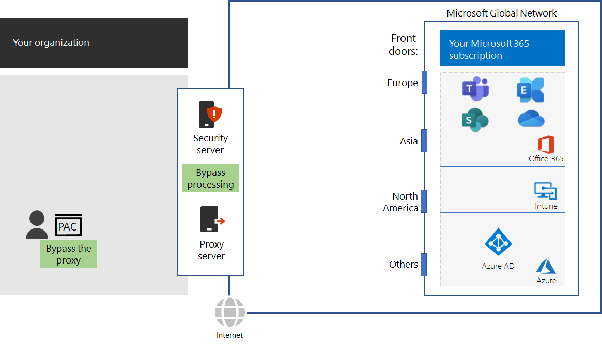

# Stap 4: Omleiden van verkeer configureren

*Deze stap is optioneel en geldt voor zowel E3- als E5-versies van Microsoft 365 Enterprise*

Aangezien algemeen internetverkeer riskant kan zijn, wordt doorgaans de beveiliging in organisatienetwerken afgedwongen door de edge-apparaten, zoals proxyservers, SSL-onderbreking en inspectie, pakketinspectie-apparaten en preventie van gegevensverlies. Lees over enkele problemen met de netwerkinterceptie-apparaten op [Het gebruik van netwerkapparaten van derden of oplossingen voor Office 365-verkeer](https://support.microsoft.com/help/2690045/using-third-party-network-devices-or-solutions-with-office-365).

De DNS-domeinnamen en IP-adressen die worden gebruikt door de cloudservices van Microsoft 365, zijn echter algemeen bekend. Bovendien worden het verkeer en de services met veel beveiligingsfuncties beschermd. Omdat deze beveiliging en bescherming al aanwezig zijn, hoeven uw edge-apparaten het niet te dupliceren. Tussenliggende bestemmingen en dubbele beveiligingsprocessen voor Microsoft 365-verkeer kunnen de prestaties aanzienlijk verminderen.

De eerste stap bij het elimineren van tussenliggende bestemmingen en gedupliceerde beveiligingsprocessen is om Microsoft 365-verkeer te identificeren. Microsoft heeft de volgende typen DNS-domeinnamen en IP-adresbereiken in de zogenaamde eindpunten gedefinieerd:

- **Optimaliseer**- Vereist voor verbinding met elke Office 365-service en vertegenwoordigt 75% van de Microsoft 365-bandbreedte, verbindingen en een gegevensvolume. Deze eindpunten vertegenwoordigen Microsoft 365-scenario's die het gevoeligst zijn voor netwerkprestaties, latentie en beschikbaarheid.
- **Toestaan**- Vereist voor verbindingen met specifieke services en functies van Microsoft 365, maar zijn niet zo gevoelig voor netwerkprestaties en latentie als in de categorie Optimaliseer.
 - **Standaard**- Vertegenwoordigt Microsoft 365-services en afhankelijkheden waarvoor geen optimalisering nodig is. U kunt Standaardeindpunten voor categorieën beschouwen als normaal internetverkeer.

U vindt de DNS-domeinnamen en IP-adresbereiken op [https://aka.ms/o365endpoints](https://aka.ms/o365endpoints).

Microsoft beveelt het volgende aan:

- Gebruik de Proxy Automatic Configuration (PAC)-scripts voor de internetbrowsers van uw on-premises computers om uw proxyservers te omzeilen voor de DNS-domeinnamen van de cloudservices van Microsoft 365. Zie de [Get-Pacfile PowerShell script](https://docs.microsoft.com/office365/enterprise/managing-office-365-endpoints#use-a-pac-file-for-direct-routing-of-vital-office-365-traffic) voor het nieuwste Microsoft 365-PAC-script.

- Analyseer uw edge-apparaten om de dubbele verwerking te bepalen en vervolgens te configureren voor het doorsturen van verkeer om eindpunten te optimaliseren en toe te staan zonder te verwerken. Dit wordt ook wel omleiden van netwerkverkeer genoemd. 

Hier volgen deze aanbevelingen in de netwerkinfrastructuur.

Edge-apparaten bevatten firewalls, SSL Break and Inspect, apparaten voor pakketinspectie en preventie van gegevensverlies. Als u de configuratie van edge-apparaten wilt configureren en bijwerken, kunt u een script of een REST-oproep gebruiken om een gestructureerde lijst met eindpunten te gebruiken uit de Office 365 Eindpoints webservice. Zie [URL's en IP-adressen voor Office 365](https://docs.microsoft.com/office365/enterprise/office-365-ip-web-service) voor meer informatie.

U hoeft alleen de normale proxy- en netwerkbeveilingsverwerking voor verkeer naar Microsoft 365 optimaliseren en toestaan van eindpunt-categorieën. Al het andere algemene internetverkeer wordt via een proxy verzonden en zijn onderhevig aan de bestaande netwerkbeveiligingsverwerking.

## Verkeer optimaliseren voor externe werknemers die gebruikmaken van een VPN-verbinding

VPN-verbindingen (virtual private network) worden meestal door externe werknemers gebruikt om toegang te krijgen tot informatiebronnen op het intranet van een organisatie. Een conventionele VPN-verbinding stuurt ALLE verkeer, inclusief internetverkeer, naar het intranet van de organisatie. Het internetverkeer wordt doorgestuurd naar het randnetwerk en de apparaten voor pakketverwerking van de organisatie. Dit verkeer is onderhevig aan reis- en verwerkingsvertragingen waardoor de prestaties van uw externe werknemers aanzienlijk kunnen worden gehinderd. 

Split tunneling is de mogelijkheid die een VPN-verbinding heeft om specifiek verkeer via het internet te sturen in plaats van via de VPN-verbinding naar uw intranet. Configureer uw VPN-verbindingen die aan split tunneling doen om verkeer naar Office 365-eindpunten in de categorie Optimaliseren rechtstreeks over het internet te sturen. Zo krijgen externe medewerkers de beste prestaties voor essentiële services van Microsoft 365 zoals Teams, SharePoint Online en Exchange Online. 

Bekijk [Office 365-connectiviteit optimaliseren voor externe gebruikers met VPN-split-tunneling](https://docs.microsoft.com/office365/enterprise/office-365-vpn-split-tunnel) voor meer informatie.

Als tussentijds controlepunt kunt u de [afsluitcriteria](networking-exit-criteria.md#crit-networking-step4) voor deze stap bekijken.

## Volgende stap

|||
|:-------|:-----|
||[Prestaties van client en Office 365-service optimaliseren](networking-optimize-tcp-performance.md) |

