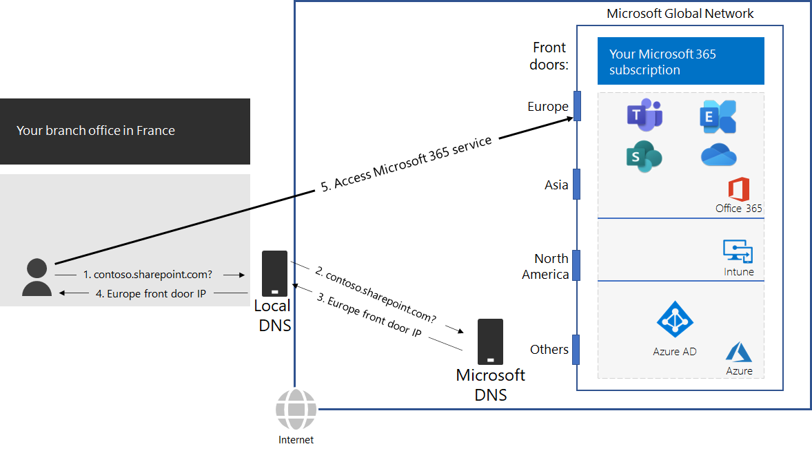

# Stap 2: lokale internetverbindingen configureren voor elk kantoorStep 2: Configure local Internet connections for each office

*Deze stap is vereist en is van toepassing op zowel de E3- als de E5-versie van Microsoft 365 Enterprise**This step is required and applies to both the E3 and E5 versions of Microsoft 365 Enterprise*

In stap 2 zorgt u ervoor dat elk van uw kantoren lokale internetverbindingen heeft en lokale DNS-servers gebruikt.In Step 2, you ensure that each of your offices have local Internet connections and use local DNS servers. Beide elementen zijn vereist om de latentie van verbindingen te verminderen en ervoor te zorgen dat lokale client-computers verbindingen maken met het dichtstbijzijnde toegangspunt tot cloudservices van Microsoft 365.Both of these elements are required to reduce connection latency and ensure that on-premises client computers make connections to the nearest point of entry to Microsoft 365 cloud-based services.

In traditionele netwerken voor grote organisaties gaat internetverkeer via de netwerk-backbone naar een centrale internetverbinding.In traditional networks for large organizations, Internet traffic travels across the network backbone to a central Internet connection. Dit werkt niet goed voor het optimaliseren van de prestaties voor een wereldwijd gedistribueerde Software-as-a-Service (SaaS)-infrastructuur, waaronder de Office 365- en Intune-producten in Microsoft 365.This does not work well for optimizing performance to a globally distributed Software-as-a-Service (SaaS) infrastructure, which includes the Office 365 and Intune products in Microsoft 365.

Het Microsoft Global Network omvat een *Distributed Service Front Door*-infrastructuur, een zeer beschikbare en schaalbare netwerkrand met geografisch verspreide locaties.The Microsoft Global Network includes a *Distributed Service Front Door* infrastructure, a highly available and scalable network edge with geographically distributed locations. Het verbreekt verbindingen van eindgebruikers op een voordeurserver en routeert het verkeer van eindgebruikers op efficiënte wijze binnen het Microsoft Global Network.It terminates end user connections at a front door server and efficiently routes end user traffic within the Microsoft Global Network.

Voor de beste prestaties moeten klanten op locatie toegang hebben tot een voordeurlocatie die zich geografisch het dichtst bij hen bevindt, in plaats van het verkeer via een netwerkbackbone te sturen naar de voordeur die het dichtst bij de centrale internetverbinding van de organisatie ligt.For the best performance, on-premises clients should access a front door location that is geographically closest to them, rather than sending the traffic over a network backbone and to the front door that is closest to the organization’s central Internet connection.

Hier ziet u een voorbeeld.Here’s an example.

Wanneer een gebruiker in het filiaal in Parijs toegang wil krijgen tot een SharePoint Online-site:When a user in the Paris branch office wants to access a SharePoint Online site:

1. Er wordt een DNS-query verstuurd om een naam om te zetten, zoals contoso.sharepoint.com.It sends a DNS query to resolve a name, such as contoso.sharepoint.com. 
2. De DNS-server van de internetprovider stuurt die query door naar een Microsoft DNS-server.The DNS server provided by the ISP forwards that query to a Microsoft DNS server.
3. De DNS-servers van Microsoft stemmen het bron-IP-adres van de doorgestuurde DNS-query af op de regio van de wereld waaraan dat adres is toegewezen.Microsoft’s DNS servers match the source IP address of the forwarded DNS query to the region of the world assigned that address. De Microsoft DNS-server reageert met het IP-adres van de dichtstbijzijnde Microsoft Network-voordeur in Europa.The Microsoft DNS server responds with the IP address of the nearest Microsoft Network front door in Europe.
4. De DNS-server van de internetprovider stuurt dit IP-adres naar de gebruiker.The ISP DNS server sends that IP address to the user.
5. De gebruiker brengt via de voordeur van Europa een verbinding tot stand met de SharePoint-server.The user initiates a connection to the SharePoint server through the Europe front door.

De DNS-servers van Microsoft gebruiken de DNS-query's die overeenkomen met de oorspronkelijke verbindingsaanvragen van de client om een clientaanvraag naar de geografisch dichtstbijzijnde voordeur te sturen.To direct a client request to the geographically nearest front door, Microsoft’s DNS servers use the DNS queries corresponding the client’s initial connection request. Voor de laagste netwerklatentie is het volgende van belang:Therefore, for the lowest network latency:

- Alle kantoren van uw organisatie moeten lokale internetverbindingen hebben voor netwerkverkeer in de categorie [optimaliseren](https://docs.microsoft.com/office365/enterprise/office-365-network-connectivity-principles#new-office-365-endpoint-categories).All offices of your organization should have local Internet connections for [Optimize](https://docs.microsoft.com/office365/enterprise/office-365-network-connectivity-principles#new-office-365-endpoint-categories) category network traffic.
- Elke lokale internetverbinding moet een regionale, lokale DNS-server gebruiken voor uitgaand internetverkeer vanaf die locatie.Each local Internet connection should be using a regionally local DNS server for outbound Internet traffic from that location.

Zie [uitgaande netwerkverbindingen lokaal instellen](https://docs.microsoft.com/office365/enterprise/office-365-network-connectivity-principles#egress-network-connections-locally)voor meer informatie.For more information, see [Egress network connections locally](https://docs.microsoft.com/office365/enterprise/office-365-network-connectivity-principles#egress-network-connections-locally). 

Als tussentijds controlepunt kunt u de [afsluitcriteria](networking-exit-criteria.md#crit-networking-step2) voor deze stap bekijken.As an interim checkpoint, you can see the [exit criteria](networking-exit-criteria.md#crit-networking-step2) for this step.

## Volgende stapNext step

|||
|:-------|:-----|
||[Netwerk-hairpins vermijdenAvoid network hairpins](networking-avoid-network-hairpins.md)|
