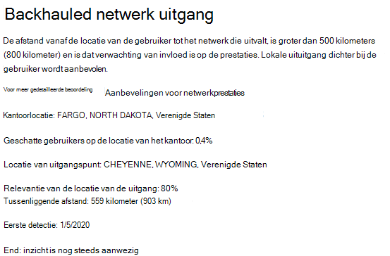
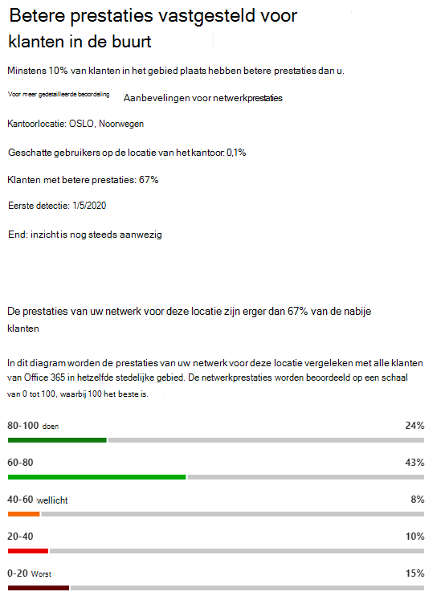
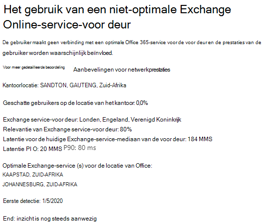
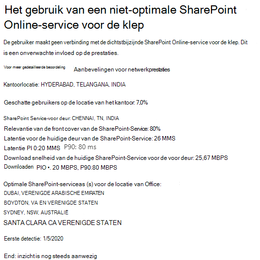

# Microsoft 365 Network Insights (preview)Microsoft 365 Network Insights (preview)

**Netwerk inzichten** zijn prestatiegegevens die worden verzameld uit uw microsoft 365-Tenant en zijn alleen beschikbaar voor weergave door beheerders gebruikers in uw Tenant.**Network insights** are performance metrics collected from your Microsoft 365 tenant, and available to view only by administrative users in your tenant. Inzichten worden weergegeven in het Microsoft 365-Beheercentrum op <https://portal.microsoft.com/adminportal/home#/networkperformance> .Insights are displayed in the Microsoft 365 Admin Center at <https://portal.microsoft.com/adminportal/home#/networkperformance>.

Inzichten zijn bedoeld voor hulp bij het ontwerpen van netwerkverbindingen voor uw Office-locaties.Insights are intended to help in designing network perimeters for your office locations. Elk inzicht biedt u actuele informatie over de prestatie-eigenschappen voor een specifiek gemeenschappelijke probleem waarbij gebruikers toegang krijgen tot uw Tenant.Each insight provides live details about the performance characteristics for a specific common issue for each geographic location where users are accessing your tenant.

Er bestaan zes specifieke netwerk inzichten die voor elke kantoorlocatie kunnen worden weergegeven:There are six specific network insights that may be shown for each office location:

- [Backhauled netwerk uitgangBackhauled network egress](#backhauled-network-egress)
- [Betere prestaties vastgesteld voor klanten in de buurtBetter performance detected for customers near you](#better-performance-detected-for-customers-near-you)
- [Het gebruik van een niet-optimale Exchange Online-service-voor deurUse of a non-optimal Exchange Online service front door](#use-of-a-non-optimal-exchange-online-service-front-door)
- [Het gebruik van een niet-optimale SharePoint Online-service front deurUse of a non-optimal SharePoint Online service front door](#use-of-a-non-optimal-sharepoint-online-service-front-door)
- [Lage downloadsnelheid van SharePoint-voor deurLow download speed from SharePoint front door](#low-download-speed-from-sharepoint-front-door)
- [Gebruikers van China optimale netwerk uitgangChina user optimal network egress](#china-user-optimal-network-egress)

Er zijn twee netwerk inzichten op tenantniveau die kunnen worden weergegeven voor de Tenant.There are two tenant level network insights that may be shown for the tenant. Deze worden ook weergegeven op de Score pagina's van producvitivy:These also appear in the producvitivy score pages:

- [Gesamplinge verbindingen van Exchange beïnvloed door verbindingsproblemenExchange sampled connections impacted by connectivity issues](#exchange-sampled-connections-impacted-by-connectivity-issues)
- [Gepipetteerde SharePoint-verbindingen beïnvloed door verbindingsproblemenSharePoint sampled connections impacted by connectivity issues](#sharepoint-sampled-connections-impacted-by-connectivity-issues)

>[!IMPORTANT]
>Netwerk inzichten, prestatie aanbevelingen en beoordelingen in het Microsoft 365-Beheercentrum is momenteel in de preview-versie en is alleen beschikbaar voor Microsoft 365-tenants die zijn geregistreerd in het functie voorbeeldprogramma.Network insights, performance recommendations and assessments in the Microsoft 365 Admin Center is currently in preview status, and is only available for Microsoft 365 tenants that have been enrolled in the feature preview program.

## Backhauled netwerk uitgangBackhauled network egress

Dit inzicht wordt weergegeven als de Network Insights-service opspoort dat de afstand van een bepaalde gebruikerslocatie van de netwerk uitgang groter is dan 500 kilometers (800 kilometer), om aan te geven dat Microsoft 365-verkeer wordt backhauled naar een veelvoorkomende apparaat of proxy voor Internet Edge.This insight will be displayed if the network insights service detects that the distance from a given user location to the network egress is greater than 500 miles (800 kilometers), indicating that Microsoft 365 traffic is being backhauled to a common Internet edge device or proxy.

Dit inzicht wordt kort weergegeven als ' uitgaand ' in sommige samenvattings weergaven.This insight is abbreviated as "Egress" in some summary views.

### Wat betekent dit?What does this mean?

Hiermee wordt aangegeven dat de afstand tussen de kantoorlocatie en de uitgang van het netwerk langer is dan 500 km (800 kilometer).This identifies that the distance between the office location and the network egress is more than 500 miles (800 kilometers). De locatie van Office wordt aangeduid door een bemerkte locatie van de clientcomputer en de locatie van het netwerk.The office location is identified by an obfuscated client machine location and the network egress location is identified by using reverse IP Address to location databases. De kantoorlocatie is mogelijk onnauwkeurig als de Windows-locatie Services is uitgeschakeld op machines.The office location may be inaccurate if Windows Location Services is disabled on machines. De locatie van de netwerk uitgang is mogelijk onnauwkeurig als de informatie over de omgekeerde IP-adresdatabase onnauwkeurig is.The network egress location may be inaccurate if the reverse IP Address database information is inaccurate.

Details voor dit inzicht zijn de kantoorlocatie, het geschatte percentage van de totale Tenant gebruiker op de locatie, de huidige locatie van het netwerk, de relevantie van de uitzonderingslocatie, de afstand tussen de locatie en het huidige uitgangspunt, de datum waarop de voorwaarde voor het eerst is vastgesteld en de datum waarop de voorwaarde is opgelost.Details for this insight include the office location, estimated percentage of total tenant user at the location, the current network egress location, relevance of the egress location, the distance between the location and the current egress point, the date the condition was first detected, and the date the condition was resolved.

### Wat moet ik doen?What should I do?

Om dit inzicht in te stellen, kunnen we de netwerk uitgang dichter bij de kantoorlocatie aanbevelen, zodat de verbinding optimaal kan worden gerouteerd naar het globale netwerk van Microsoft en de dichtstbijzijnde Microsoft 365-service.For this insight, we would recommend network egress closer to the office location so that connectivity can route optimally to Microsoft's global network and to the nearest Microsoft 365 service front door. Als u de netwerkverbinding met de gebruikers uitsluitte, kunnen de prestaties in de toekomst ook toenemen omdat Microsoft beide netwerk punten van aanwezigheid en de Microsoft 365-service voor de toekomst uitbreidt.Having close network egress to users office locations also allows for improved performance in the future as Microsoft expands both network points of presence and Microsoft 365 service front doors in the future.

Voor meer informatie over het oplossen van dit probleem, raadpleegt u [Netwerkverbindingen lokaal](microsoft-365-network-connectivity-principles.md#egress-network-connections-locally) uitzetten in de [netwerk verbindings beginselen van Office 365](microsoft-365-network-connectivity-principles.md).For more information about how to resolve this issue, see [Egress network connections locally](microsoft-365-network-connectivity-principles.md#egress-network-connections-locally) in [Office 365 Network Connectivity Principles](microsoft-365-network-connectivity-principles.md).

## Betere prestaties vastgesteld voor klanten in de buurtBetter performance detected for customers near you

Dit inzicht wordt weergegeven als de Network Insights-service vaststelt dat een groot aantal klanten in uw metro gebied betere prestaties heeft dan de gebruikers in uw organisatie op deze locatie van Office.This insight will be displayed if the network insights service detects that a significant number of customers in your metro area have better performance than users in your organization at this office location.

Dit inzicht wordt afgekort als ' collega's ' in sommige samenvattings weergaven.This insight is abbreviated as "Peers" in some summary views.

### Wat betekent dit?What does this mean?

Dit inzicht bestudeert de totale prestaties van Microsoft 365-klanten in dezelfde stad als deze locatie van Office.This insight examines the aggregate performance of Microsoft 365 customers in the same city as this office location. Dit inzicht wordt weergegeven als de gemiddelde latentie van uw gebruikers 10% groter is dan de gemiddelde latentie van naburige tenants.This insight is displayed if the average latency of your users is 10% greater than the average latency of neighboring tenants.

### Wat moet ik doen?What should I do?

Er kunnen verschillende redenen zijn voor deze voorwaarde, zoals latentie in uw bedrijfsnetwerk of INTERNETPROVIDER, knelpunten of architectuurontwerp problemen.There could be many reasons for this condition, including latency in your corporate network or ISP, bottlenecks, or architecture design issues. Bekijk de latentie tussen elke hop in de route tussen uw Office-netwerk en de huidige Microsoft 365-voor deur.Examine the latency between each hop in the route between your office network and the current Microsoft 365 front door. Zie voor meer informatie de [beginselen voor de netwerkverbindingen van Office 365](microsoft-365-network-connectivity-principles.md).For more information, see [Office 365 Network Connectivity Principles](microsoft-365-network-connectivity-principles.md).

## Het gebruik van een niet-optimale Exchange Online-service-voor deurUse of a non-optimal Exchange Online service front door

Dit inzicht wordt weergegeven als de Network Insights-service detecteert dat gebruikers op een specifieke locatie geen verbinding maken met een optimale Exchange Online-service voor de voor deur.This insight will be displayed if the network insights service detects that users in a specific location are not connecting to an optimal Exchange Online service front door.

Dit inzicht wordt verkort weergegeven als ' omleiding ' in sommige samenvattings weergaven.This insight is abbreviated as "Routing" in some summary views.

### Wat betekent dit?What does this mean?

De omruilservice voor Exchange Online-Services die geschikt zijn voor gebruik vanaf de locatie van Office-locaties, biedt goede prestaties.We list Exchange Online service front doors which are suitable for use from the office location city with good performance. Als op de huidige test de front cover van de Exchange Online-service wordt gebruikt die niet in deze lijst voorkomt, dan noemen we deze aanbeveling.If the current test shows use of an Exchange Online service front door not on this list, then we call out this recommendation.

### Wat moet ik doen?What should I do?

Het gebruik van een niet-optimale omruil bare Exchange Online-service kan worden veroorzaakt door netwerk backhaul voordat het bedrijfsnetwerk wordt uitgevoerd, zodat het een lokale en rechtstreekse netwerk uitgang voor u aanbeveelt.Use of a non-optimal Exchange Online service front door could be caused by network backhaul before the corporate network egress in which case we recommend local and direct network egress. Dit kan ook worden veroorzaakt door het gebruik van een externe DNS recursieve resolver-server, maar het is raadzaam de DNS recursieve resolver server uit te lijnen met het netwerk uitgang.It could also be caused by use of a remote DNS Recursive Resolver server in which case we recommend aligning the DNS Recursive Resolver server with the network egress.

## Het gebruik van een niet-optimale SharePoint Online-service front deurUse of a non-optimal SharePoint Online service front door

Dit inzicht wordt weergegeven als de Network Insights-service detecteert dat gebruikers op een specifieke locatie geen verbinding maken met de dichtstbijzijnde SharePoint Online-service-deur.This insight will be displayed if the network insights service detects that users in a specific location are not connecting to the closest SharePoint Online service front door.

Dit inzicht wordt afgekort als ' afd ' in sommige samenvattings weergaven.This insight is abbreviated as "Afd" in some summary views.

### Wat betekent dit?What does this mean?

We identificeren de front cover van de SharePoint Online-service waarmee de test client verbinding maakt.We identify the SharePoint Online service front door that the test client is connecting to. Vervolgens gaan we naar de locatie van Office-locaties om te zien dat de front cover van de SharePoint Online-service voor die stad werd verwacht.Then for the office location city we compare that to the expected SharePoint Online service front door for that city. Als ze niet overeenkomen, maakt u hiervan een aanbeveling.If it doesn't match, then we make this recommendation.

### Wat moet ik doen?What should I do?

Het gebruik van een niet-optimale SharePoint Online-service voor de voor deur kan worden veroorzaakt door de netwerk backhaul voordat het bedrijfsnetwerk wordt uitgevoerd, zodat het lokale en rechtstreekse netwerk uitgang voor u adviseert.Use of a non-optimal SharePoint Online service front door could be caused by network backhaul before the corporate network egress in which case we recommend local and direct network egress. Dit kan ook worden veroorzaakt door het gebruik van een externe DNS recursieve resolver-server, maar het is raadzaam de DNS recursieve resolver server uit te lijnen met het netwerk uitgang.It could also be caused by use of a remote DNS Recursive Resolver server in which case we recommend aligning the DNS Recursive Resolver server with the network egress.

## Lage downloadsnelheid van SharePoint-voor deurLow download speed from SharePoint front door

Dit inzicht wordt weergegeven als de Network Insights-service de bandbreedte tussen de specifieke kantoorlocatie en SharePoint Online lager is dan 1 MBps.This insight will be displayed if the network insights service detects that bandwidth between the specific office location and SharePoint Online is less than 1 MBps.

Dit inzicht wordt afgekort als ' doorvoer ' in sommige samenvattings weergaven.This insight is abbreviated as "Throughput" in some summary views.

### Wat betekent dit?What does this mean?

De downloadsnelheid die een gebruiker uit de front-deur van SharePoint Online en de OneDrive voor bedrijven-service bevindt, wordt gemeten in megabytes per seconde (MBps).The download speed that a user can get from SharePoint Online and OneDrive for Business service front doors is measured in megabytes per second (MBps). Als deze waarde lager is dan 1 MBps, bieden we deze inzichten.If this value is less than 1 MBps then we provide this insight.

### Wat moet ik doen?What should I do?

Om de downloadsnelheid te verbeteren, moet de bandbreedte wellicht toenemen.To improve download speeds, bandwidth may need to be increased. Het kan ook zijn dat de netwerkcongestie tussen gebruikers computers op de kantoorlocatie en de SharePoint Online-service-klep.Alternatively, there may be network congestion between user machines at the office location and the SharePoint Online service front door. Dit wordt ook wel congestie verlies genoemd en de beschikbare downloadsnelheid voor gebruikers wordt beperkt, zelfs als de voldoende bandbreedte beschikbaar is.This is sometimes called congestive loss and it restricts the download speed available to users even if sufficient bandwidth is available.

## Gebruikers van China optimale netwerk uitgangChina user optimal network egress

Dit inzicht wordt weergegeven als uw organisatie gebruikers heeft in China die verbinding maken met uw Microsoft 365-Tenant in andere geografische locaties.This insight will be displayed if your organization has users in China connecting to your Microsoft 365 tenant in other geographic locations. 

### Wat betekent dit?What does this mean?

Als uw organisatie beschikt over een persoonlijke WAN-verbinding, wordt u aangeraden een netwerkwan-circuit te configureren op uw kantoorlocaties in China met een netwerk uitgang op Internet op een van de volgende locaties:If your organization has private WAN connectivity, we recommend configuring a network WAN circuit from your office locations in China that has network egress to the Internet in any of the following locations:

- HongkongHong Kong
- Japan Japan
- TaiwanTaiwan
- Zuid-KoreaSouth Korea
- SingaporeSingapore
- Maleisië Malaysia

Verder wegteren van gebruikers van gebruikers van deze locaties reduceren de prestaties en het uitgangs niveau in China kan leiden tot hoge latentie en connectiviteitsproblemen vanwege een oplopende verbinding.Internet egress further away from users than these locations will reduce performance, and egress in China may cause high latency and connectivity issues due to cross-border congestion.

### Wat moet ik doen?What should I do?

Zie voor meer informatie over het beperken van de prestaties van dit inzicht de prestatie [optimalisering van Office 365 voor gebruikers van China](microsoft-365-networking-china.md).For more information about how to mitigate performance issues related to this insight, see [Office 365 global tenant performance optimization for China users](microsoft-365-networking-china.md).

## Gesamplinge verbindingen van Exchange beïnvloed door verbindingsproblemenExchange sampled connections impacted by connectivity issues

Dit inzicht zal aangeven wanneer 50% of meer van de bemonsterde verbindingen worden beïnvloed.This insight will show when 50% or more of the sampled connections are impacted. Het effect wordt bepaald door de proef van Exchange onder 60% voor elk voorbeeld.The impact is defined by the Exchange assessment being below 60% for each sample.

### Wat betekent dit?What does this mean?

Het is een aanwijzing dat het merendeel van de gebruikers problemen met de gebruikerservaring opneemt met Outlook waarmee verbinding wordt gemaakt met Exchange Online.It is an indication that the majority of your users are likely to be experiencing user experience issues with Outlook connecting to Exchange Online. Het percentage van de gepaarde steekproeven staat voor het percentage van gebruikers dat onder 60 punten wordt weergegeven.The percentage of samples likely represents the percentage of users who show below 60 points.  

### Wat moet ik doen?What should I do?

De netwerklocatie van de Office-locatie voor netwerktoegang inschakelen als u dit nog niet hebt gedaan.Enable office location network connectivity visibility if you have not already done so. U wilt weten welke kantoren zijn impactred door slechte netwerkconnectiviteit, wat van invloed is op Exchange en manieren om de netwerkverbinding te verbeteren, zodat de netwerkverbindingen van de gebruikers met de gebruikers van het Microsoft-netwerk zijn verbonden.You want to identify which offices are impactred by poor network connectivity that is impacting Exchange and find ways to improve the network perimeter at each that connects the users to Microsoft's network.

## Gepipetteerde SharePoint-verbindingen beïnvloed door verbindingsproblemenSharePoint sampled connections impacted by connectivity issues

Dit inzicht zal aangeven wanneer 50% of meer van de bemonsterde verbindingen worden beïnvloed.This insight will show when 50% or more of the sampled connections are impacted. Het effect wordt bepaald door de SharePoint-beoordeling onder 40% voor elk voorbeeld.The impact is defined by the SharePoint assessment being below 40% for each sample.

### Wat betekent dit?What does this mean?

Het is een aanwijzing dat het merendeel van de gebruikers problemen met de gebruikerservaring met SharePoint en OneDrive ondervindt.It is an indication that the majority of your users are likely to be experiencing user experience issues with SharePoint and OneDrive. Het percentage van de gepaarde steekproeven staat voor het percentage van gebruikers dat onder 40 punten wordt weergegeven.The percentage of samples likely represents the percentage of users who show below 40 points.  

### Wat moet ik doen?What should I do?

De netwerklocatie van de Office-locatie voor netwerktoegang inschakelen als u dit nog niet hebt gedaan.Enable office location network connectivity visibility if you have not already done so. U wilt weten welke kantoren zijn impactred door slechte netwerkconnectiviteit, wat van invloed is op SharePoint en manieren om de netwerkverbinding te verbeteren waarmee de gebruikers worden verbonden met de gebruikers van het Microsoft-netwerk.You want to identify which offices are impactred by poor network connectivity that is impacting SharePoint and find ways to improve the network perimeter at each that connects the users to Microsoft's network.

## Verwante onderwerpenRelated topics

[Netwerkverbinding in het Microsoft 365-Beheercentrum (preview)Network connectivity in the Microsoft 365 Admin Center (preview)](office-365-network-mac-perf-overview.md)

[Microsoft 365-netwerk beoordeling (preview)Microsoft 365 network assessment (preview)](office-365-network-mac-perf-score.md)

[Microsoft 365 connectiviteitstest in het M365-Beheercentrum (preview)Microsoft 365 connectivity test in the M365 Admin Center (preview)](office-365-network-mac-perf-onboarding-tool.md)

[Locatie Services voor Microsoft 365-netwerkconnectiviteitMicrosoft 365 Network Connectivity Location Services (preview)](office-365-network-mac-location-services.md)
