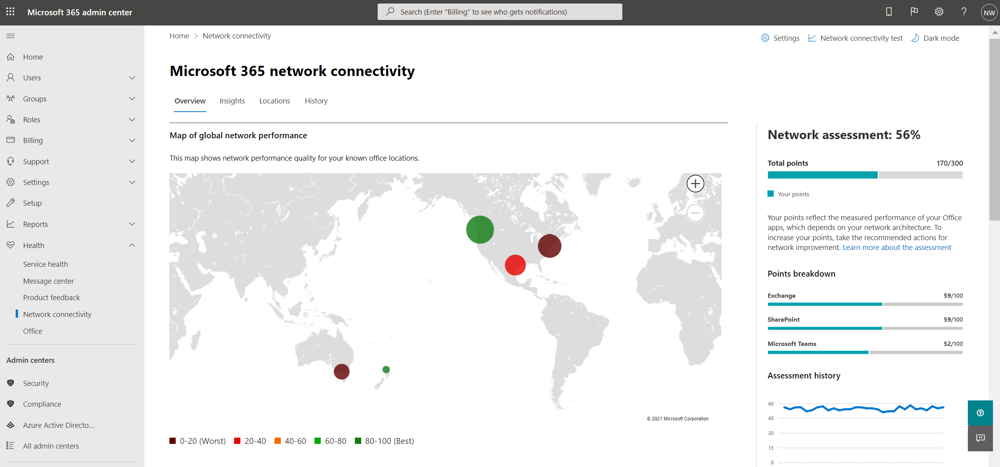
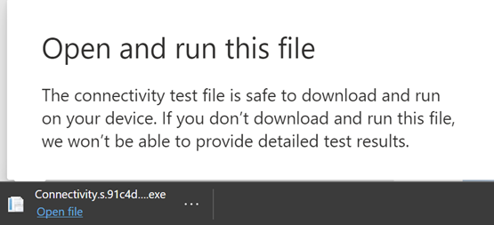
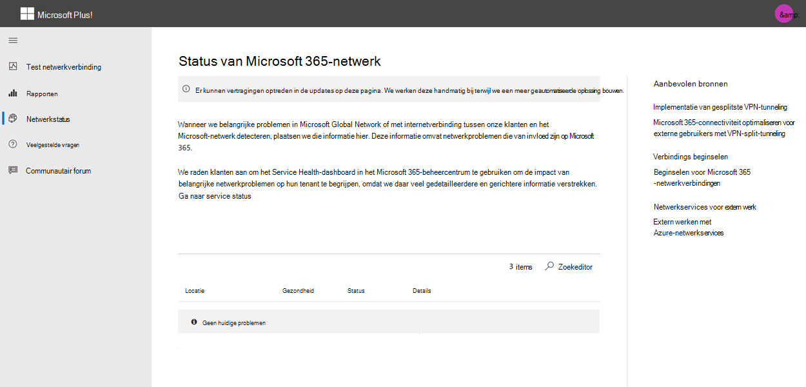

# Test voor Microsoft 365-netwerkverbindingen (preview)

Het testprogramma voor Microsoft 365-netwerkconnectiviteit bevindt zich op <https://connectivity.office.com> . Het is een adjunct-hulpmiddel voor de netwerkanalyse-en netwerk inzichten-informatie die beschikbaar is in het Microsoft 365-Beheercentrum, onder de **status | Verbindings** menu.

>[!NOTE]
>Het testprogramma voor Netwerkverbindingen ondersteunt tenants in de Duitse commerciële versie en Duitsland, maar niet GCC, GCC High, DoD of China.

De netwerk inzichten in het Microsoft 365-Beheercentrum op basis van regelmatige productafmetingen voor uw Microsoft 365-Tenant, die elke dag worden geaggregeerd. In vergelijking worden de netwerk inzichten van de test voor netwerkverbindingen van Microsoft 365 lokaal en met één keer via het hulpprogramma uitgevoerd. Tests die in het product kunnen worden uitgevoerd, zijn beperkt en door tests te voeren die voor de gebruiker toegankelijk zijn, kunnen de gegevens worden verzameld met een betere inzichten. Houd er rekening mee dat de netwerk inzichten in het Microsoft 365-Beheercentrum op een specifieke locatie van Office een netwerkprobleem voor gebruik van Microsoft 365. Met behulp van de Microsoft 365 Connectivity test kunt u de hoofdoorzaak van dit probleem achterhalen en de aanbevolen actie voor netwerk prestatieverbetering.

We raden u aan dat ze samen gebruiken waar de status van netwerkkwaliteit kan worden geëvalueerd voor elke Office-locatie in het Microsoft 365-Beheercentrum en dat specifiekere informatie kan worden gevonden na de implementatie van de test op basis van de Microsoft 365-connectiviteitstest.

>[!IMPORTANT]
>Netwerk inzichten, prestatie aanbevelingen en beoordelingen in het Microsoft 365-Beheercentrum is momenteel in de preview-versie en is alleen beschikbaar voor Microsoft 365-tenants die zijn geregistreerd in het functie voorbeeldprogramma.

## De clienttoepassing geavanceerde tests

Er zijn twee onderdelen voor het testen van de netwerkverbinding van Microsoft 365. de website <https://connectivity.office.com> en een downloadbare Windows-clienttoepassing die geavanceerde netwerk connectiviteitstests uitvoert. Voor de meeste tests moet de toepassing worden uitgevoerd. De zoekresultaten worden weergegeven op de webpagina wanneer deze wordt uitgevoerd.

U wordt gevraagd om de geavanceerde client testtoepassing van de website te downloaden na voltooiing van de webbrowser tests. Open het bestand en voer het uit wanneer hierom wordt gevraagd.

## Uw testrapport delen

Voor het testrapport is aanmelding met uw Office 365-account vereist. De beheerder selecteert de manier waarop u uw testrapport kunt delen.

### Uw rapport delen met uw beheerder

Alle testrapporten terwijl u bent aangemeld, worden gedeeld met de beheerder.

### Delen met uw Microsoft-accountteam, ondersteunings-of andere medewerkers

Test rapporten met uitzondering van persoonlijke identificatie worden gedeeld met Microsoft-werknemers. Dit is standaard ingeschakeld en kan door uw beheerder worden uitgeschakeld in de **status | Pagina netwerkverbinding** in het Microsoft 365-Beheercentrum.

### Delen met andere gebruikers die zich aanmelden bij dezelfde Office 365-Tenant

U kunt gebruikers selecteren met wie u het rapport wilt delen en dit is standaard ingeschakeld. De beheerder kan ook worden uitgeschakeld door de beheerder.

### Delen met iedereen die een koppeling naar ReportID gebruikt

U kunt uw testverslag delen met iedereen door toegang te bieden tot een ReportID-koppeling. Hiermee wordt een URL gegenereerd die u naar iemand kunt verzenden, zodat ze het testrapport kunnen weergeven zonder dat ze zich hoeven aan te melden. Deze functie is standaard uitgeschakeld en moet worden ingeschakeld door de beheerder.

## Resultaten van netwerk verbindings test

De resultaten worden weergegeven op de tabbladen **overzicht** en **Details** . Het tabblad Overzicht bevat een overzicht van de gedetecteerde netwerkverbinding en een vergelijking van de netwerk beoordeling met andere klanten van Office 365 in de buurt. Het biedt ook ondersteuning voordelen van het testrapport. Zo ziet de weergave overzichtsresultaten eruit.

Hier ziet u een voorbeeld van de uitvoer van het tabblad Details dat bij het hulpmiddel wordt weergegeven. Op het tabblad Details wordt een groene cirkel vinkje weergegeven als het resultaat de nadruk met een drempel is. We tonen een rood uitroepteken met een rode driehoek als het resultaat een drempelwaarde heeft overschreden die een netwerk inzicht aangeeft. In de volgende secties worden de resultaten rijen van het tabblad Details beschreven en worden de drempelwaarden voor netwerk inzichten beschreven.

### De locatiegegevens

In deze sectie worden de testresultaten met betrekking tot uw locatie weergegeven.

#### Uw locatie

De locatie van de gebruiker wordt gedetecteerd in de gebruikers browser of de gebruikersnaam kan worden getypt bij de optie gebruikers. Dit wordt gebruikt voor het identificeren van de afstand van een netwerk tot bepaalde delen van de netwerkverbinding van het bedrijf. Alleen de plaats van deze locatie detectie en de afstand tot andere netwerk punten worden in het rapport opgeslagen.

De werklocatie van de gebruiker wordt weergegeven in de kaartweergave.

#### Locatie van netwerk uitgang (de locatie waar uw netwerkverbinding maakt met uw INTERNETPROVIDER)

We identificeren het IP-adres van het IP-adres van uw netwerk aan de serverzijde. Location-databases worden gebruikt voor het opzoeken van de geschatte locatie van de netwerk uitgang. Deze databases hebben meestal de juiste nauwkeurigheid van 90% van IP-adressen. Als de locatie die u hebt opgezocht van het IP-adres van het netwerk, niet nauwkeurig is, zou dit leiden tot een Onwaar resultaat van deze toets. Als u wilt controleren of deze fout optreedt voor een specifiek IP-adres, kunt u op websites met algemeen toegankelijke netwerklocaties voor IP-adressen werken om deze te vergelijken met uw werkelijke locatie.

#### Uw afstand vanaf de locatie van de netwerk uitgang

We bepalen de afstand vanaf die locatie naar de kantoorlocatie. Dit wordt weergegeven als een netwerk inzicht als de afstand groter is dan **500 kilometer** (800 kilometer), omdat dit de TCP-latentie waarschijnlijk hoger is dan 25ms en kan de gebruikerservaring beïnvloeden.

De locatie van netwerk uitgang wordt weergegeven in de kaartweergave en verbonden met de kantoorlocatie van de gebruiker, die aangeeft dat de netwerk-backhaul in de Enterprise-WAN.

Het implementeren van lokale en rechtstreekse netwerk uitgang van gebruikers Office-locaties op Internet wordt aangeraden voor de Microsoft 365-netwerkverbinding. Verbeteringen aan lokale en direct aflossing zijn de beste manier om dit netwerk inzicht te verhelpen.

#### Gegevens van de proxy server

We identificeren welke proxyserver (s) zijn geconfigureerd op de lokale computer. We identificeren of een van deze zijn geconfigureerd in het netwerkpad voor de categorie Microsoft 365-netwerkverkeer optimaliseren. We identificeren de afstand van de werklocatie van de gebruiker naar de proxyservers. De afstand wordt eerst getest door ICMP ping en als dit niet lukt, testen met TCP ping en ten slotte als dit niet lukt, het IP-adres van de proxyserver wordt opgezocht in een database voor een IP-adreslocatie. We tonen een netwerk inzicht als de proxyserver verder is dan **500 km** (800 kilometer) buiten de kantoorlocatie van de gebruiker.

#### VPN (Virtual Private Network) dat u gebruikt om verbinding te maken met uw organisatie

Hiermee wordt vastgesteld of u een VPN gebruikt om verbinding te maken met Office 365. Een doorgegeven resultaat wordt weergegeven als u geen VPN hebt, of als u een VPN hebt met de aanbevolen gesplitste tunnelconfiguratie voor Office 365.

#### Gesplitste VPN-tunnel

Elke categorie route optimaliseren voor Exchange Online, SharePoint Online en Microsoft teams wordt getest om te zien of deze tunnelled is op het VPN of niet. Een uitgesplitste werkbelasting vermijdt de VPN-verbinding geheel. Er wordt een tunnelled-werkbelasting verzonden via de VPN. Een selectief tunnelled-werkbelasting bevat enkele routes die via de VPN-verbinding zijn verzonden en een deel van de gesplitste. Een doorgegeven resultaat wordt weergegeven als alle werkbelastingen zijn uitgesplitst of selectief tunnelled.

#### Klanten in uw stedelijke regio, met betere prestaties

De TCP-latentie van de gebruiker in de gebruikerslocatie van de Exchange Online-service wordt vergeleken met andere klanten van Microsoft 365 in hetzelfde metro gebied. Een netwerk inzicht wordt weergegeven als 10% of meer van klanten in hetzelfde metro gebied betere prestaties hebben. Dit betekent dat hun gebruikers betere prestaties kunnen hebben in de gebruikersinterface van Microsoft 365.

Dit netwerk inzicht wordt gegenereerd op basis van de voorwaarden dat alle gebruikers in een stad toegang hebben tot dezelfde telecommunicatie infrastructuur en dezelfde dicht bij Internet circuits en van het Microsoft-netwerk.

#### Tijd voor het maken van een DNS-aanvraag op uw netwerk

Hier ziet u de DNS-server die is geconfigureerd op de clientcomputer waarmee de tests worden uitgevoerd. Het kan een DNS recursieve resolver server zijn, maar dit is niet gebruikelijk. Het is waarschijnlijk een DNS-doorstuurserver waarmee DNS-resultaten worden gecached en DNS-aanvragen worden doorgestuurd naar een andere DNS-server.

Dit wordt uitsluitend ter informatie verstrekt en geen bijdrage aan een netwerk inzicht.

#### Uw afstand van en/of tijd om verbinding te maken met een DNS recursieve resolver

De DNS recursieve resolver in gebruik wordt aangegeven door een specifieke DNS-aanvraag in te stellen en vervolgens de DNS-naam server te vragen voor het IP-adres waarvan het dezelfde aanvraag heeft ontvangen. Dit IP-adres is de recursieve resolver DNS en wordt weergegeven in databases van IP-adres locaties om de locatie te vinden. De afstand van de locatie van de werkplek van de gebruiker naar de locatie van de DNS recursieve resolver server wordt vervolgens berekend. Dit wordt weergegeven als een netwerk inzicht als de afstand groter is dan **500 km** (800 kilometer).

De locatie die is opgezocht vanuit het IP-adres van het netwerk, is mogelijk niet nauwkeurig en resulteert in een foutmelding. Als u wilt controleren of deze fout optreedt voor een specifiek IP-adres, kunt u weblocaties voor algemeen toegankelijke netwerklocaties gebruiken.

Dit netwerk inzicht is specifiek van invloed op de selectie van de Exchange Online-service-voor deur. Als u dit inzicht lokaal en direct netwerk uitgang wilt verhelpen, moet u eerst een vereiste zijn en moet DNS recursieve resolver bevinden bij het afsluiten van de netwerkverbinding.

### Exchange Online

In deze sectie worden testresultaten met betrekking tot Exchange Online weergegeven.

#### Locatie van Exchange service-voor deur

De gebruikersinterface voor Exchange service wordt op dezelfde manier aangeduid als in Outlook en de TCP-latentie van de netwerk wordt gemeten. De TCP-latentie wordt weergegeven en de front-updeur van de Exchange-service wordt vergeleken met de lijst met de beste deuren voor de huidige locatie. Dit wordt weergegeven als een netwerk inzicht wanneer een van de beste Exchange-Servicevoorwaarden niet wordt gebruikt.

Het niet gebruiken van een van de best mogelijke Exchange-Servicevoorwaarden kon worden veroorzaakt door de netwerk backhaul voordat het bedrijfsnetwerk wordt uitgewerkt, zodat het een lokale en rechtstreekse netwerk uitgang is. Dit kan ook worden veroorzaakt door het gebruik van een externe DNS recursieve resolver-server, maar het is raadzaam de DNS recursieve resolver server uit te lijnen met het netwerk uitgang.

U berekent een potentiële verbetering van de TCP-latentie (MS) met de front cover voor de Exchange-service. Dit doet u door de netwerklatentie van de geteste gebruikerslocatie van de gebruiker te bekijken en de netwerklatentie af te trekken van de huidige locatie naar de de front deur van de Exchange-service. Het verschil vertegenwoordigt de potentiële verkoopkans voor verbetering.

#### Best preexchange service-voorkeuren voor uw locatie

Hier vindt u een overzicht van de beste locaties voor de Exchange-service voor uw locatie.

#### Service-voor deur vastgelegd in de client-DNS

Hier ziet u de DNS-naam en het IP-adres van de Exchange service-Server voor de front-server waarnaar u bent doorgestuurd. Het wordt alleen ter informatie verstrekt en er is geen netwerk inzicht.

### SharePoint Online

In deze sectie ziet u de testresultaten met betrekking tot SharePoint Online en OneDrive.

#### De locatie van de service-voor deur

De SharePoint-Service voor de SharePoint-site wordt op dezelfde manier geïdentificeerd als de OneDrive-client, en de TCP-latentie van de gebruiker wordt gemeten van de werkplek in de client.

#### Download snelheid

We waarderen de downloadsnelheid van een 15Mb-bestand vanuit de front cover van de SharePoint-service. Het resultaat wordt in megabytes per seconde weergegeven om aan te geven welk bestandsgrootte in megabytes van SharePoint of OneDrive binnen **één seconde**kan worden gedownload. Het cijfer moet gelijk zijn aan één tiende van de minimale bandbreedte in megabits per seconde. Als u bijvoorbeeld een 100 Mbps internetverbinding hebt, verwacht u mogelijk 10 megabytes per seconde (10MBps).

#### Buffer groter

Tijdens de 15Mb-Download waarderen we de TCP-latentie naar de SharePoint-Service-voor deur. Dit is de latentie onder laden en wordt vergeleken met de latentie wanneer dit niet onder belasting valt. De verlengen van de latentie indien vaak wordt verrekend aan de buffers van het consumenten netwerkapparaat dat wordt geladen (of gestegen). Een netwerk inzicht wordt weergegeven voor alle andere 1.000.

#### Service-voor deur vastgelegd in de client-DNS

Hier ziet u de DNS-naam en het IP-adres van de front wiel-server van de SharePoint-Service waarnaar u bent doorgestuurd. Het wordt alleen ter informatie verstrekt en er is geen netwerk inzicht.

### Microsoft Teams

In deze sectie worden testresultaten met betrekking tot Microsoft teams weergegeven.

#### Media verbinding (audio, video en toepassingen delen)

Deze tests voor UDP-connectiviteit met de Microsoft teams-service-voor deur. Als dit wordt geblokkeerd, werkt Microsoft teams mogelijk nog steeds via TCP, maar het geluid en de video worden met verminderde kwaliteit weergegeven. Meer informatie over deze UDP-netwerk metingen die ook van toepassing zijn op Microsoft teams op [Media kwaliteit en prestaties van de netwerkverbinding in Skype voor bedrijven online](https://docs.microsoft.com/skypeforbusiness/optimizing-your-network/media-quality-and-network-connectivity-performance)

#### Pakketverlies

Het UDP-pakketverlies gemeten in een 10 seconden test audio oproep van de client naar de Microsoft teams-service voor de klep. Dit moet lager zijn dan **1,00%** voor een doorgifte.

### Tijd

Geeft de gemeten UDP-latentie weer, wat lager moet zijn dan **100 MS**.

#### Jitter

Geeft de gemeten UDP-jitter weer, wat lager moet zijn dan **30ms**.

#### Connectivity

We testen for HTTP Connectivity van de gebruikerslocatie van de gebruiker op alle vereiste Microsoft 365-netwerkeindpunten. Deze worden gepubliceerd op [https://aka.ms/o365ip](https://aka.ms/o365ip) . Er wordt een netwerk inzicht weergegeven voor alle vereiste netwerkeindpunten waarop geen verbinding kan worden gemaakt.

Connectiviteits ay worden geblokkeerd door een proxyserver, firewall of een ander netwerk beveiligingsapparaat in het netwerk van het bedrijf of wordt gebruikt als Cloud proxy.

We testen het SSL-certificaat op elk vereist Microsoft 365-netwerk eindpunt in de categorie optimaliseren of toestaan zoals gedefinieerd [https://aka.ms/o365ip](https://aka.ms/o365ip) . Als een van de tests een Microsoft SSL-certificaat niet vindt, moet het versleutelde netwerk zijn onderschept door een tussenliggend netwerkapparaat. Een netwerk inzicht wordt weergegeven op een geintercepteerde, versleutelde netwerkeindpunten.

Wanneer er een SSL-certificaat wordt gevonden dat niet wordt geleverd door Microsoft, wordt de FQDN getoond voor de test en de eigenaar van het SSL-certificaat. Dit SSL-certificaat mag de leveranciers van een proxyserver zijn, of dit is een zelf ondertekend certificaat van een onderneming.

#### Netwerkpad

In deze sectie ziet u de resultaten van een ICMP-traceroute naar de front-van de Exchange Online-service, de front-service van de SharePoint Online-service en de front-service van Microsoft teams. Het wordt alleen ter informatie verstrekt en er is geen netwerk inzicht. Er zijn drie traceroutes. Een traceroute naar _Outlook.office365.com_, een traceroute van de SharePoint-front-end voor klanten of voor _Microsoft.SharePoint.com_ als deze niet is opgegeven en een traceroute aan _World.tr.teams.Microsoft.com_.

## Wat gebeurt er bij elke test stap

### Identificatie van Office-locatie

Wanneer u op de knop test uitvoeren klikt, wordt de pagina Running test weergegeven en wordt de locatie van de Office aangegeven. U kunt uw locatie typen op plaats, provincie en land, of u kunt de locatie van de webbrowser laten detecteren. Als u dit detecteert, vragen we de Latitude en lengte van de webbrowser aan en beperkt u de nauwkeurigheid van 300m door 300m vóór gebruik. We doen dit omdat het niet noodzakelijk is de locatie nauwkeuriger te identificeren dan het gebouw van de netwerkprestaties. 

### JavaScript-tests

Nadat de Office-locatie is geïdentificeerd, voert u een TCP-latentie test uit in JavaScript en wij verzoeken u om gegevens van de service over in gebruik en aanbevolen Office 365-service voor voor deur servers. Wanneer deze zijn voltooid, worden deze weergegeven op de kaart en op het tabblad Details, waar ze vóór de volgende stap kunnen worden weergegeven.

### Download de clienttoepassing Advanced tests

Vervolgens beginnen we met het downloaden van de clienttoepassing Advanced tests. We vertrouwen op de gebruiker om de clienttoepassing te starten en ze moeten ook .NET core hebben geïnstalleerd.

### De clienttoepassing geavanceerde tests starten

Wanneer de clienttoepassing start, wordt de webpagina bijgewerkt en worden de gegevens die worden weergegeven op de webpagina weergegeven. De update wordt telkens bijgewerkt wanneer er nieuwe gegevens worden ontvangen en u kunt de gegevens bekijken terwijl deze binnenkomen.

### Geavanceerde tests voltooid en testrapport uploaden

Nadat de tests zijn voltooid, geven de client en de Advanced tests-client beide het volgende aan en als de gebruiker wordt aangemeld bij het testrapport, wordt deze geüpload naar de Tenant van de klant.

## Verbindings rapporten

Wanneer u bent aangemeld, kunt u vorige rapporten die u hebt uitgevoerd, bekijken. U kunt ze ook delen of uit de lijst verwijderen.

## Netwerkstatus

Dit toont eventuele belangrijke problemen met het wereldwijde netwerk van Microsoft, wat van invloed kan zijn op Microsoft 365-klanten.

## Veelgestelde vragen

Hier vindt u antwoorden op enkele van onze veelgestelde vragen.

### Is dit hulpprogramma vrijgegeven en ondersteund door Microsoft?

Dit is momenteel een preview en we gaan updates regelmatig aanbrengen totdat we de algemene beschikbaarheid van de beschikbaarheid met ondersteuning van Microsoft bereiken. Geef feedback om ons te helpen verbeteren. Er is een overzicht van de introductiehandleiding voor Office 365 voor het netwerk als onderdeel van dit hulpprogramma dat voor de organisatie is aangepast door de testresultaten.

### Wat is er nodig om de geavanceerde test client uit te voeren?

Voor de geavanceerde proefversie is .NET Core 3,1-bureaublad runtime vereist. Als u de geavanceerde test client uitvoert zonder dat u de versie hebt geïnstalleerd, wordt u doorgestuurd naar [de installatiepagina van de .net Core 3,1](https://dotnet.microsoft.com/download/dotnet-core/3.1). Zorg ervoor dat u de versie van het bureaublad installeert en niet de SDK, of de kern-runtime van ASP.NET, die hoger is op de pagina. Beheerdersmachtigingen voor de computer reuqired de .NET core te installeren. 

### Wat is de front cover van de Microsoft 365-service?

De Microsoft 365-service front deur is een toegangspunt voor het globale netwerk van Microsoft waar Office-clients en-services hun netwerkverbinding beëindigen. Voor een optimale netwerkverbinding met Microsoft 365 wordt u aangeraden uw netwerkverbinding te beëindigen met de dichtstbijzijnde Microsoft 365-voor deur in uw stad of metro.

Opmerking: de front cover van de Microsoft 365-service heeft geen directe relatie met het serviceproduct van **Azure voor de voor deur** dat beschikbaar is in azure Marketplace.

### Wat is de beste Front Cover-service van Microsoft 365.

Een Best preversie van de Microsoft 365-service (voorheen een optimale service-voor deur) is een optie die het meest geschikt is voor uw netwerk uitgang, in het algemeen in het gebied plaats of metro. Gebruik het hulpprogramma voor prestatiehulpprogramma's van Microsoft 365 om de locatie te bepalen van uw computer met het Microsoft-programma voor Microsoft 365 en de best presterende dienst (s). Als het hulpprogramma bepaalt dat de front deur van uw voorkeur wordt gebruikt, kunt u het beste een fantastische verbinding verwachten van het globale netwerk van Microsoft.

### Wat is een locatie voor uitgaand Internet?

De locatie voor het uittreden van Internet is de locatie waar uw netwerkverkeer uw Enterprise-netwerk verlaat en verbinding maakt met internet. Dit wordt ook herkend als de locatie waar u een NAT-apparaat (Network Address Translation) hebt en meestal waarbij u verbinding maakt met een internetprovider (ISP). Als u de locatie van uw locatie en de locatie van uw internetverbinding lang ziet, kan dit een belangrijke WAN-backhaul.

## Verwante onderwerpen

[Aanbevelingen voor netwerkprestaties in het Microsoft 365-Beheercentrum (preview)](office-365-network-mac-perf-overview.md)

[Microsoft 365 Network Performance Insights (preview)](office-365-network-mac-perf-insights.md)

[Microsoft 365-netwerk beoordeling (preview)](office-365-network-mac-perf-score.md)

[Locatie Services voor Microsoft 365-netwerkconnectiviteit](office-365-network-mac-location-services.md)
