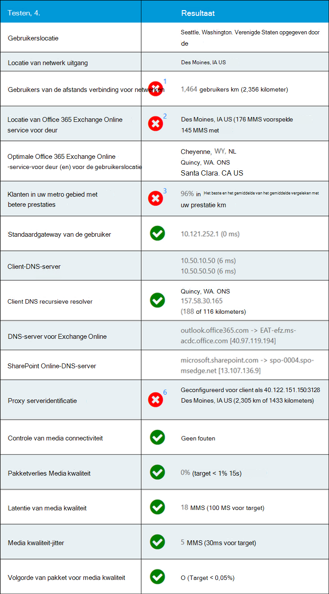

# Microsoft 365-connectiviteitstest in het Microsoft 365-Beheercentrum (preview)Microsoft 365 connectivity test in the Microsoft 365 admin center (preview)

De Microsoft 365 connectiviteitstest bevindt zich op <https://connectivity.office.com> .The Microsoft 365 connectivity test is located at <https://connectivity.office.com>. Het is een adjunct-hulpmiddel voor de netwerk inzichten en de netwerk Score informatie die beschikbaar is in het Microsoft 365-Beheercentrum, onder de **status | Menu netwerkprestaties** .It is an adjunct tool to the network insights and network score information available in the Microsoft 365 admin center under the **Health | Network Performance** menu.

>[!NOTE]
>Het hulpprogramma voor onboarding ondersteunt tenants in de Duitse commerciële versie en GCC matig, maar niet GCC High, DoD, Duitsland of China.The onboarding tool supports tenants in WW Commercial and GCC Moderate but not GCC High, DoD, Germany or China.

De netwerk inzichten in het Microsoft 365-Beheercentrum zijn gebaseerd op de maateenheden van het product voor uw Microsoft 365-Tenant.The network insights in the Microsoft 365 Admin Center are based on in-product measurements for your Microsoft 365 tenant. In vergelijking worden de netwerk inzichten van de Microsoft 365 connectiviteitstest lokaal uitgevoerd in het hulpprogramma.In comparison, the network insights from the Microsoft 365 connectivity test are run locally in the tool. Tests die in het product kunnen worden uitgevoerd, zijn beperkt en door tests te voeren die voor de gebruiker toegankelijk zijn, kunnen de gegevens worden verzameld met een betere inzichten.Testing that can be done in-product is limited and by running tests local to the user more data can be gathered resulting in deeper insights. Houd er rekening mee dat de netwerk inzichten in het Microsoft 365-Beheercentrum op een specifieke locatie van Office een netwerkprobleem voor gebruik van Microsoft 365.Consider then that the network insights in the Microsoft 365 Admin Center will show that there is a networking problem for use of Microsoft 365 at a specific office location. Met behulp van de Microsoft 365 Connectivity test kunt u de hoofdoorzaak van dit probleem achterhalen en de aanbevolen actie voor netwerk prestatieverbetering.The Microsoft 365 connectivity test can help to identify the root cause of that problem leading to a recommended network performance improvement action.

We raden u aan dat ze samen gebruiken waar de status van netwerkkwaliteit kan worden geëvalueerd voor elke Office-locatie in het Microsoft 365-Beheercentrum en dat specifiekere informatie kan worden gevonden na de implementatie van de test op basis van de Microsoft 365-connectiviteitstest.We recommend that these be used together where networking quality status can be assessed for each office location in the Microsoft 365 Admin Center and more specifics can be found after deployment of testing based on the Microsoft 365 connectivity test.

>[!IMPORTANT]
>Netwerk inzichten, prestatie aanbevelingen en beoordelingen in het Microsoft 365-Beheercentrum is momenteel in de preview-versie en is alleen beschikbaar voor Microsoft 365-tenants die zijn geregistreerd in het functie voorbeeldprogramma.Network insights, performance recommendations and assessments in the Microsoft 365 Admin Center is currently in preview status, and is only available for Microsoft 365 tenants that have been enrolled in the feature preview program.

## De clienttoepassing geavanceerde testsThe advanced tests client application

Er zijn twee gedeelten voor de Microsoft 365-connectiviteitstest.There are two parts to the Microsoft 365 connectivity test. Er is <https://connectivity.office.com> een website en er is een downloadbare Windows-clienttoepassing.There is the web site <https://connectivity.office.com> and there is a downloadable Windows client application. De downloadbare client voert geavanceerde aansluitingen voor de netwerkverbinding uit, en de meeste van de tests vereisen dat deze worden uitgevoerd.The downloadable client runs advanced network connectivity tests and most of the tests require this to be run.

U kunt de geavanceerde client test uitvoeren via de website en de resultaten worden weergegeven op de webpagina wanneer deze wordt uitgevoerd.You can run the advanced client test from the web site, and it will populate results back into the web page as it runs.

## Locatie van gebruikerUser office location

De locatie van de gebruikers Office wordt gedetecteerd in de browser van de gebruikers.The user office location is detected from the users web browser. Dit wordt gebruikt voor het identificeren van de afstand van een netwerk tot bepaalde delen van de netwerkverbinding van het bedrijf.It is used to identify network distances to specific parts of the enterprise network perimeter.

De werklocatie van de gebruiker wordt weergegeven in de kaartweergave.The user office location is shown on the map view.

## Afstand tot de locatie van de netwerk uitgangDistance to the network egress location

We identificeren het IP-adres van het IP-adres van uw netwerk aan de serverzijde.We identify the network egress IP Address on the server side. Location-databases worden gebruikt voor het opzoeken van de geschatte locatie van de netwerk uitgang en het bepalen van de afstand tot de kantoorlocatie.Location databases are used to look up the approximate location for the network egress and determine the distance from that location to the office location. Dit wordt weergegeven als een netwerk inzicht als de afstand groter is dan 500 km (800 kilometer).This is shown as a network insight if the distance is greater than 500 miles (800 kilometers).

De locatie van netwerk uitgang wordt weergegeven in de kaartweergave en verbonden met de kantoorlocatie van de gebruiker, die aangeeft dat de netwerk-backhaul in de Enterprise-WAN.The network egress location is shown on the map view and connected to the user office location indicating the network backhaul inside of the enterprise WAN.

De locatie die is opgezocht vanuit het IP-adres van het netwerk, is mogelijk niet nauwkeurig en resulteert in een foutmelding.The location looked up from the network egress IP Address may not be accurate and this would lead to a false result from this test. Als u wilt controleren of deze fout optreedt voor een specifiek IP-adres, kunt u weblocaties voor algemeen toegankelijke netwerklocaties gebruiken.To validate if this error is occurring for a specific IP Address you can use publicly accessible network IP Address location web sites.

Het implementeren van lokale en rechtstreekse netwerk uitgang van gebruikers Office-locaties op Internet wordt aangeraden voor de Microsoft 365-netwerkverbinding.Implementing local and direct network egress from user office locations to the Internet is recommended for Microsoft 365 network connectivity. Verbeteringen aan lokale en direct aflossing zijn de beste manier om dit netwerk inzicht te verhelpen.Improvements to local and direct egress are the best way to address this network insight.

## Voor deur van Exchange Online serviceExchange Online service front door

De Exchange Online-service voor Exchange Online wordt aangegeven op dezelfde manier als in Outlook dit doet, en de TCP-latentie van de gebruiker wordt gemeten van de werkplek in de netwerklocatie.The in-use Exchange Online service front door is identified in the same way that Outlook does this and we measure the network TCP latency from the user office location to it. Deze worden weergegeven en de Exchange Online-serviceas van Exchange wordt vergeleken met de lijst met aanbevolen optimale service voor de huidige locatie.These are both shown and the in-use Exchange Online service front door is compared to the list of recommended optimal service front doors for the current location. Dit wordt weergegeven als een netwerk inzicht als een niet-optimale Exchange Online-service de front deur gebruikt.This is shown as a network insight if a non-optimal Exchange Online service front door is in use.

Het gebruik van een niet-optimale omruil bare Exchange Online-service kan worden veroorzaakt door netwerk backhaul voordat het bedrijfsnetwerk wordt uitgevoerd, zodat het een lokale en rechtstreekse netwerk uitgang voor u aanbeveelt.Use of a non-optimal Exchange Online service front door could be caused by network backhaul before the corporate network egress in which case we recommend local and direct network egress. Dit kan ook worden veroorzaakt door het gebruik van een externe DNS recursieve resolver-server, maar het is raadzaam de DNS recursieve resolver server uit te lijnen met het netwerk uitgang.It could also be caused by use of a remote DNS Recursive Resolver server in which case we recommend aligning the DNS Recursive Resolver server with the network egress.

De TCP-latentie van de Exchange Online-service voor de front-deur wordt mogelijk verbeterd.We calculate a potential improvement in TCP latency to the Exchange Online service front door. Dit houdt in dat u de geteste netwerklatentie van de geteste gebruikerslocatie en de netwerklatentie aftrekt van de huidige locatie naar de vertrekken Exchange Online-service voor de klep.This is done by looking at the tested user office location network latency and subtracting the network latency from the current location to the closets Exchange Online service front door. Het verschil vertegenwoordigt de potentiële verkoopkans voor verbetering.The difference represents the potential opportunity for improvement.

## Vergelijking van de prestaties van klanten in het gebiedComparison of performance of customers in the area

De TCP-latentie van de gebruiker in de gebruikerslocatie van de Exchange Online-service wordt vergeleken met andere klanten van Microsoft 365 in hetzelfde metro gebied.The network TCP latency of the user office location to the Exchange Online service front door is compared to other Microsoft 365 customers in the same metro area. Een netwerk inzicht wordt weergegeven als 10% of meer van klanten in hetzelfde metro gebied betere prestaties hebben.A network insight is shown if 10% or more of customers in the same metro area have better performance.

Dit netwerk inzicht wordt gegenereerd op basis van de voorwaarden dat alle gebruikers in een stad toegang hebben tot dezelfde telecommunicatie infrastructuur en dezelfde dicht bij Internet circuits en van het Microsoft-netwerk.This network insight is generated on the basis that all users in a city have access to the same telecommunications infrastructure and the same proximity to Internet circuits and Microsoft's network.

## Bij standaardgateway gebruikenIn use default gateway

De standaardgateway in gebruik is de router die de test-client heeft geconfigureerd voor routerings-TCP/IP-netwerkverbindingen.The in-use default gateway is the router that the test client has configured for routing TCP/IP network connections.

Dit wordt uitsluitend ter informatie verstrekt en geen bijdrage aan een netwerk inzicht.This is provided for information only and does not contribute to any network insight.

## DNS-servers gebruikenIn use DNS server(s)

Hier ziet u de DNS-server die is geconfigureerd op de clientcomputer waarmee de tests worden uitgevoerd.This shows the DNS server configured on the client machine that ran the tests. Het kan een DNS recursieve resolver server zijn, maar dit is niet gebruikelijk.It might be a DNS Recursive Resolver server however this is uncommon. Het is waarschijnlijk een DNS-doorstuurserver waarmee DNS-resultaten worden gecached en DNS-aanvragen worden doorgestuurd naar een andere DNS-server.It is more likely to be a DNS forwarder server which caches DNS results and forwards any uncached DNS requests to another DNS server.

Dit wordt uitsluitend ter informatie verstrekt en geen bijdrage aan een netwerk inzicht.This is provided for information only and does not contribute to any network insight.

## Aangegeven DNS recursieve resolver serverIdentified DNS Recursive Resolver server

De DNS recursieve resolver in gebruik wordt aangegeven door een specifieke DNS-aanvraag in te stellen en vervolgens de DNS-naam server te vragen voor het IP-adres waarvan het dezelfde aanvraag heeft ontvangen.The in-use DNS Recursive Resolver is identified by making a specific DNS request and then asking the DNS Name Server for the IP Address that it received the same request from. Dit IP-adres is de recursieve resolver DNS en wordt weergegeven in databases van IP-adres locaties om de locatie te vinden.This IP Address is the DNS Recursive Resolver and it will be looked up in IP Address location databases to find the location. De afstand van de locatie van de werkplek van de gebruiker naar de locatie van de DNS recursieve resolver server wordt vervolgens berekend.The distance from the user office location to the DNS Recursive Resolver server location is then calculated. Dit wordt weergegeven als een netwerk inzicht als de afstand groter is dan 500 km (800 kilometer).This is shown as a network insight if the distance is greater than 500 miles (800 kilometers).

De locatie die is opgezocht vanuit het IP-adres van het netwerk, is mogelijk niet nauwkeurig en resulteert in een foutmelding.The location looked up from the network egress IP Address may not be accurate and this would lead to a false result from this test. Als u wilt controleren of deze fout optreedt voor een specifiek IP-adres, kunt u weblocaties voor algemeen toegankelijke netwerklocaties gebruiken.To validate if this error is occurring for a specific IP Address you can use publicly accessible network IP Address location web sites.

Dit netwerk inzicht is specifiek van invloed op de selectie van de Exchange Online-service-voor deur.This network insight will specifically impact the selection of the Exchange Online service front door. Als u dit inzicht lokaal en direct netwerk uitgang wilt verhelpen, moet u eerst een vereiste zijn en moet DNS recursieve resolver bevinden bij het afsluiten van de netwerkverbinding.To address this insight local and direct network egress should be a pre-requisite and then DNS Recursive Resolver should be located close to that network egress.

## DNS-lookup van Exchange Online front end server en SharePoint Online front end serverDNS lookup of Exchange Online front end server and SharePoint Online front end server

De DNS-record voor de front cover van de service wordt weergegeven voor deze twee workloads van Microsoft 365.These show the DNS record for the service front door for these two Microsoft 365 workloads. Ze worden uitsluitend ter informatie verstrekt en er is geen bijbehorend netwerk inzicht.They are provided for information only and there is no associated network insight.

## Proxy serveridentificatieProxy server identification

We identificeren welke proxyserver (s) zijn geconfigureerd op de lokale computer.We identify proxy server(s) configured on the local machine. We identificeren of een van deze zijn geconfigureerd in het netwerkpad voor de categorie Microsoft 365-netwerkverkeer optimaliseren.We identify if any of these are configured in the network path for optimize category Microsoft 365 network traffic. We identificeren de afstand van de werklocatie van de gebruiker naar de proxyservers.We identify the distance from the user office location to the proxy servers. De afstand wordt eerst getest door ICMP ping en als dit niet lukt, testen met TCP ping en ten slotte als dit niet lukt, het IP-adres van de proxyserver wordt opgezocht in een database voor een IP-adreslocatie.The distance is tested first by ICMP ping and if that fails we test with TCP ping and finally if that fails we look up the proxy server IP Address in an IP Address location database. We tonen een netwerk inzicht als de proxyserver verder is dan 500 km (800 kilometer) buiten de kantoorlocatie van de gebruiker.We show a network insight if the proxy server is further than 500 miles (800 kilometers) away from the user office location.

## Controles van media kwaliteitMedia quality checks

Met deze toets wordt het hulpprogramma voor het uitvoeren van de Skype voor bedrijven-netwerk beoordeling geïnstalleerd en wordt de resultaten interpreteert.This test installs and runs the Skype for Business network assessment tool and interprets the results. Het hulpmiddel is te vinden op [https://www.microsoft.com/download/details.aspx?id=53885](https://www.microsoft.com/download/details.aspx?id=53885) .The tool can be found at [https://www.microsoft.com/download/details.aspx?id=53885](https://www.microsoft.com/download/details.aspx?id=53885).

Dit zijn UDP-protocol tests die worden gebruikt door Microsoft teams-functies voor audio-en videogesprekken en vergaderingen.These are UDP protocol tests as is used by Microsoft Teams audio and video call and conferencing functionality. We testen voor UDP-pakketverlies, UDP-netwerklatentie, UDP-jitter en UDP pakket opnieuw ordenen.We test for UDP packet loss, UDP network latency, UDP jitter, and UDP packet reorder. Een netwerk inzicht wordt weergegeven als een van deze voor het toegestane bereik valt.A network insight is shown if any of these are over the allowable range.

## TCP-connectiviteitstestsTCP Connectivity tests

We testen for HTTP Connectivity van de gebruikerslocatie van de gebruiker op alle vereiste Microsoft 365-netwerkeindpunten.We test for HTTP connectivity from the user office location to all of the required Microsoft 365 network endpoints. Deze worden gepubliceerd op [https://aka.ms/o365ip](https://aka.ms/o365ip) .These are published at [https://aka.ms/o365ip](https://aka.ms/o365ip). Er wordt een netwerk inzicht weergegeven voor alle vereiste netwerkeindpunten waarop geen verbinding kan worden gemaakt.A network insight is shown for any required network endpoints which cannot be connected to.

Connectiviteits ay worden geblokkeerd door een proxyserver, firewall of een ander netwerk beveiligingsapparaat in het netwerk van het bedrijf of wordt gebruikt als Cloud proxy.Connectivity ay be blocked by a proxy server, a firewall, or another network security device on the enterprise network perimeter or in use as a cloud proxy.

## SSL-onderschepings testsSSL interception tests

We testen het SSL-certificaat op elk vereist Microsoft 365-netwerk eindpunt in de categorie optimaliseren of toestaan zoals gedefinieerd [https://aka.ms/o365ip](https://aka.ms/o365ip) .We test the SSL certificate at each required Microsoft 365 network endpoint that is in the optimize or allow category as defined at [https://aka.ms/o365ip](https://aka.ms/o365ip). Als een van de tests een Microsoft SSL-certificaat niet vindt, moet het versleutelde netwerk zijn onderschept door een tussenliggend netwerkapparaat.If any tests do not find a Microsoft SSL certificate, then the encrypted network connected must have been intercepted by an intermediary network device. Een netwerk inzicht wordt weergegeven op een geintercepteerde, versleutelde netwerkeindpunten.A network insight is shown on any intercepted encrypted network endpoints.

Wanneer er een SSL-certificaat wordt gevonden dat niet wordt geleverd door Microsoft, wordt de FQDN getoond voor de test en de eigenaar van het SSL-certificaat.Where an SSL certificate is found that isn't provided by Microsoft, we show the FQDN for the test and the in-use SSL certificate owner. Dit SSL-certificaat mag de leveranciers van een proxyserver zijn, of dit is een zelf ondertekend certificaat van een onderneming.This SSL certificate owner may be a proxy server vendor, or it may be an enterprise self-signed certificate.

## Diagnostische gegevens voor netwerkNetwork path diagnostics

In deze sectie ziet u de resultaten van een ICMP-traceroute naar de front-van de Exchange Online-service, de front-service van de SharePoint Online-service en de front-service van Microsoft teams.This section shows the results of an ICMP traceroute to the Exchange Online service front door, the SharePoint Online service front door, and the Microsoft Teams service front door. Het wordt alleen ter informatie verstrekt en er is geen netwerk inzicht.It is provided for information only and there is no associated network insight.

## Veelgestelde vragenFAQ

Hier vindt u antwoorden op enkele van onze veelgestelde vragen.Here are answers to some of our frequently asked questions.

### Is dit hulpprogramma vrijgegeven en ondersteund door Microsoft?Is this tool released and supported by Microsoft?

Het is momenteel een proefversie van het concept en we gaan updates regelmatig leveren totdat we de algemene beschikbaarheid van de versie met ondersteuning van Microsoft bereiken.It is currently a proof of concept and we plan to provide updates regularly until we reach general availability release status with support from Microsoft. Geef feedback om ons te helpen verbeteren.Please provide feedback to help us improve. Er is een overzicht van de introductiehandleiding voor Office 365 voor het netwerk als onderdeel van dit hulpprogramma dat voor de organisatie is aangepast door de testresultaten.We are planning to publish a more detailed Office 365 Network Onboarding guide as part of this tool which is customized for the organization by its test results.

### Wat is de front cover van de Microsoft 365-service?What is Microsoft 365 service front door?

De Microsoft 365-service front deur is een toegangspunt voor het globale netwerk van Microsoft waar Office-clients en-services hun netwerkverbinding beëindigen.The Microsoft 365 service front door is an entry point on Microsoft's global network where Office clients and services terminate their network connection. Voor een optimale netwerkverbinding met Microsoft 365 wordt u aangeraden uw netwerkverbinding te beëindigen met de dichtstbijzijnde Microsoft 365-voor deur in uw stad of metro.For an optimal network connection to Microsoft 365, it is recommended that your network connection is terminated into the closest Microsoft 365 front door in your city or metro.

Opmerking: de front cover van de Microsoft 365-service heeft geen directe relatie met de ' Azure-service voor de front-deur ', die beschikbaar is in azure Marketplace.Note: Microsoft 365 service front door has no direct relationship to the "Azure Front Door Service" product available in the Azure marketplace.

### Wat is een optimale front cover-service van Microsoft 365.What is an optimal Microsoft 365 service front door?

Een optimale front-service van Microsoft 365 is een service die het meest geschikt is voor uw netwerk uitgang, in het algemeen in het gebied plaats of metro.An optimal Microsoft 365 service front door is one that is closest to your network egress, generally in your city or metro area. Gebruik het hulpprogramma voor prestatiehulpprogramma's van Microsoft 365 om te bepalen waar u de Microsoft 365-service voor de voor deur en de optimale service klep kunt gebruiken.Use the Microsoft 365 network performance tool to determine location of your in-use Microsoft 365 service front door and optimal service front door. Als het hulpprogramma bepaalt dat de front-in-de voorgrond van uw gebruik optimaal is, maakt u optimaal verbinding met het wereldwijde netwerk van Microsoft.If the tool determines your in-use front door is optimal, then you are optimally connecting into Microsoft's global network.

### Wat is een locatie voor uitgaand Internet?What is an internet egress location?

De locatie voor het uittreden van Internet is de locatie waar uw netwerkverkeer uw Enterprise-netwerk verlaat en verbinding maakt met internet.The internet egress Location is the location where your network traffic exits your enterprise network and connects to the Internet. Dit wordt ook herkend als de locatie waar u een NAT-apparaat (Network Address Translation) hebt en meestal waarbij u verbinding maakt met een internetprovider (ISP).This is also identified as the location where you have a Network Address Translation (NAT) device and usually where you connect with an Internet Service Provider (ISP). Als u de locatie van uw locatie en de locatie van uw internetverbinding lang ziet, kan dit een belangrijke WAN-backhaul.If you see a long distance between your location and your internet egress Location, then this may identify a significant WAN backhaul.

## Verwante onderwerpenRelated topics

[Aanbevelingen voor netwerkprestaties in het Microsoft 365-Beheercentrum (preview)Network performance recommendations in the Microsoft 365 Admin Center (preview)](office-365-network-mac-perf-overview.md)

[Microsoft 365 Network Performance Insights (preview)Microsoft 365 network performance insights (preview)](office-365-network-mac-perf-insights.md)

[Microsoft 365-netwerk beoordeling (preview)Microsoft 365 network assessment (preview)](office-365-network-mac-perf-score.md)

[Locatie Services voor Microsoft 365-netwerkconnectiviteitMicrosoft 365 Network Connectivity Location Services (preview)](office-365-network-mac-location-services.md)
