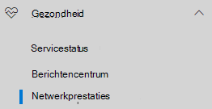
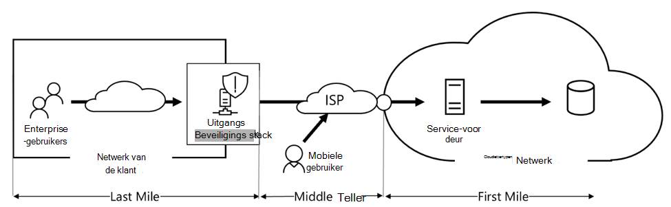
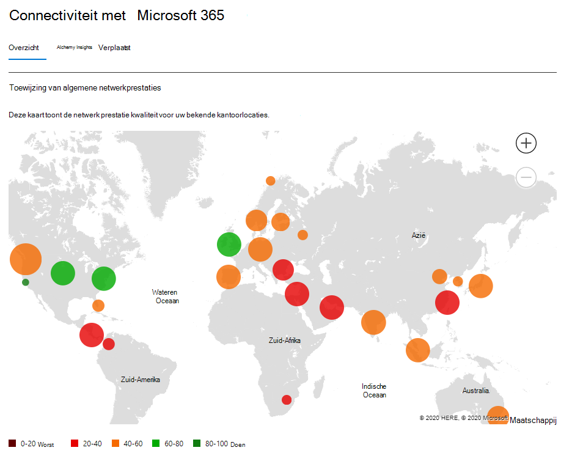
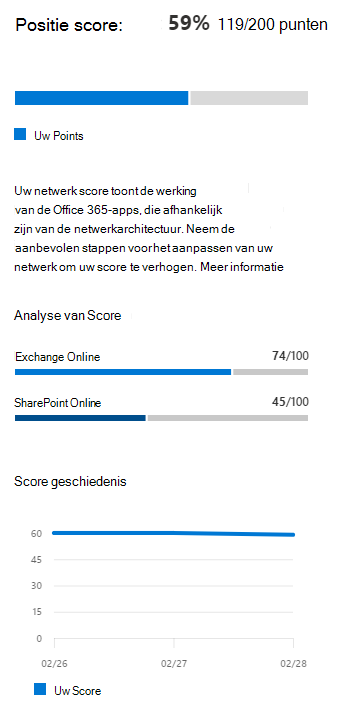
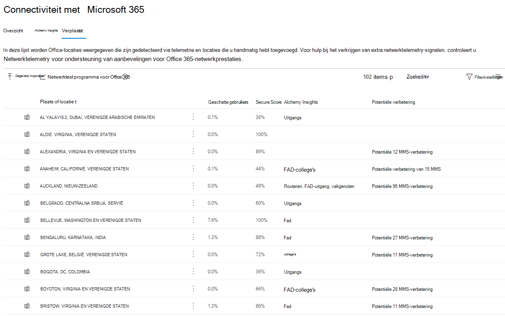
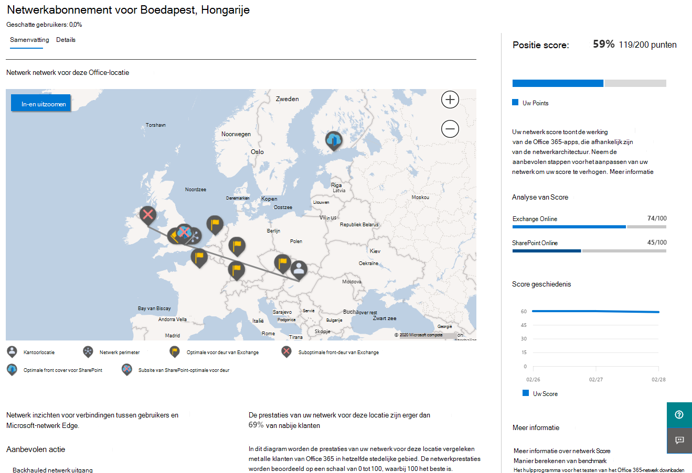
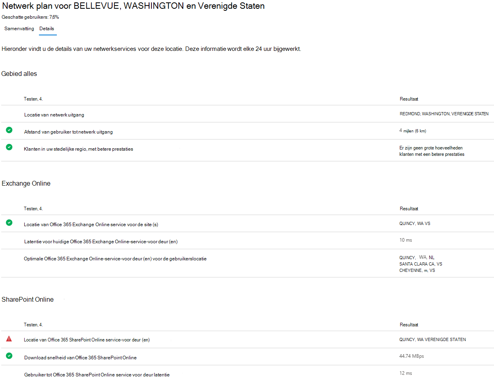
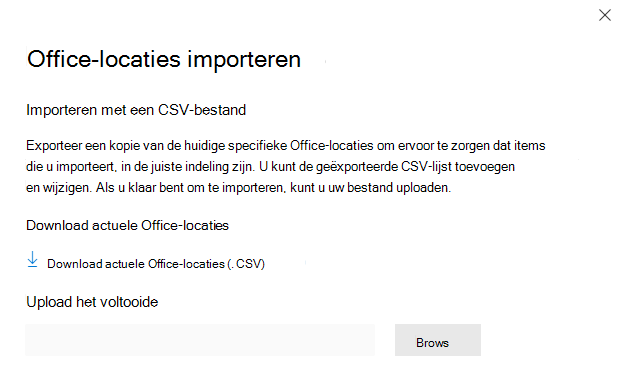
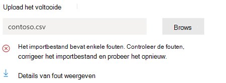
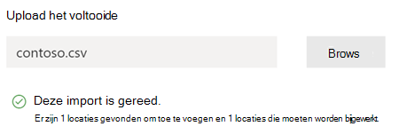

# Netwerkconnectiviteit in het Microsoft 365-beheercentrum (preview)

Het Microsoft 365-beheercentrum bevat nu statistieken voor geaggregeerde netwerkconnectiviteit die zijn verzameld van uw Microsoft 365-tenant en is alleen beschikbaar voor beheerders in uw tenant.

> [!div class="mx-imgBorder"]
> 

**Netwerkbeoordelingen** en **netwerkinzichten** worden weergegeven in het Microsoft 365-beheercentrum onder **| Connectiviteit.**

> [!div class="mx-imgBorder"]
> 

>[!NOTE]
>Het testhulpmiddel voor netwerkconnectiviteit ondersteunt tenants in WW Commercial en Germany, maar niet GCC Moderate, GCC High, DoD of China.

Wanneer u voor het eerst naar de pagina met netwerkprestaties navigeert, ziet u een overzichtsvenster met een overzicht van de globale netwerkprestaties, een netwerkbeoordelingsbereik voor de volledige tenant en een lijst met huidige problemen. Vanuit het overzicht kunt u inzoomen om specifieke metrische netwerkprestaties en problemen per locatie weer te geven. Zie netwerkprestatiesoverzicht in het [Microsoft 365-beheercentrum voor meer informatie.](#network-connectivity-overview-in-the-microsoft-365-admin-center)

U wordt mogelijk gevraagd namens uw organisatie deel te nemen aan de openbare preview-versie van deze functie. Acceptatie is meestal direct gebeurd, waarna u de pagina voor netwerkconnectiviteit ziet. 

Wanneer u naar de pagina voor netwerkconnectiviteit navigeert, ziet u een overzichtsvenster met een overzicht van de globale netwerkprestaties, een netwerkbeoordeling die is beperkt tot de volledige tenant en een lijst met huidige problemen. Voor toegang tot deze pagina moet u een beheerder van de organisatie binnen Microsoft 365 zijn. De beheerdersrol Rapportlezer heeft leestoegang tot deze gegevens. Als u locaties en andere elementen van de netwerkverbinding wilt configureren, moet een beheerder deel uitmaken van een serverbeheerder, zoals de rol van serviceondersteuningsbeheerder. Vanuit het overzicht kunt u inzoomen om specifieke metrische netwerkprestaties en problemen per locatie te bekijken. Zie netwerkconnectiviteitsoverzicht [in het Microsoft 365-beheercentrum voor meer informatie.](#network-connectivity-overview-in-the-microsoft-365-admin-center)

## Vereisten voor het maken van netwerkconnectiviteitsbeoordelingen

Als u wilt beginnen, schakelt u de opt-in-instelling voor uw locatie in om automatisch gegevens te verzamelen van apparaten met Behulp van Windows Location Services, gaat u naar de lijst locaties om locatiegegevens toe te voegen of te uploaden, of voer de test van de Microsoft 365-netwerkconnectiviteit uit vanaf uw kantoorlocaties. Hoewel netwerkconnectiviteit in de hele organisatie kan worden geëvalueerd, moet elk verbeteringen in het netwerkontwerp worden uitgevoerd voor specifieke kantoorlocaties. U vindt informatie over de netwerkverbinding voor elke kantoorlocatie zodra deze locaties zijn vastgesteld. Er zijn drie opties voor het verkrijgen van netwerkbeoordelingen vanaf uw kantoorlocaties:

### 1. Windows Locatieservices inschakelen

Voor deze optie moet er ten minste twee computers worden uitgevoerd op elke kantoorlocatie die de vereisten ondersteunen. OneDrive voor Windows versie **19.232** of hoger moet op elke computer zijn geïnstalleerd. Zie de opmerkingen bij de release van OneDrive voor meer informatie over [OneDrive-versies.](https://support.office.com/article/onedrive-release-notes-845dcf18-f921-435e-bf28-4e24b95e5fc0) Netwerkmaateenheden worden in de nabije toekomst toegevoegd aan andere Office 365-clienttoepassingen.

De Windows-locatieservice moet worden toestemming gegeven op de computers. U kunt dit testen door de app Kaarten uit **te** proberen en de locatie van de app te vinden. De functie kan worden ingeschakeld op één computer met **instellingen | Privacyverklaring | De** locatie waar de instelling _Apps toegang geven tot uw locatie_ moet zijn ingeschakeld. Toestemming voor Windows Location Services kan worden geïmplementeerd op pc's met behulp van MDM- of groepsbeleid met de instelling _LetAppsAccessLocation._

U hoeft met deze methode geen locaties toe te voegen in het beheercentrum, omdat deze automatisch worden geïdentificeerd bij de oplossing van de plaats. U kunt niet meerdere kantoorlocaties binnen een stad tonen met behulp van Windows Locatieservices. Locatiegegevens worden ook afgerond op de dichtstbijzijnde 300 meter bij 300 meter voordat deze worden geüpload, zodat er geen nauwkeurige locatiegegevens beschikbaar zijn.

De computers moeten over een Wi-Fi netwerk in plaats van een Ethernet-kabel. Computers met een Ethernet-kabel hebben geen nauwkeurige locatiegegevens.

24 uur nadat aan deze vereisten is voldaan, worden maatvoorbeelden en kantoorlocaties weergegeven.

### 2. Locaties toevoegen en LAN-subnetinformatie verstrekken

Voor deze optie zijn Windows Location Services en Wi-Fi niet vereist. OneDrive voor Windows versie **20.161** of hoger moet op elke computer op de locatie zijn geïnstalleerd.

U moet ook locaties toevoegen op de netwerkconnectiviteitspagina van het beheercentrum of deze importeren uit een CSV-bestand. De toegevoegde locaties moeten de informatie van uw office LAN-subnet bevatten.

Omdat u de locaties toevoegt, kunt u meerdere kantoren binnen een stad hebben gedefinieerd.

Alle testmetingen van clientapparaten bevatten de LAN-subnetgegevens, die is gerelateerd aan de kantoorlocatiedetails die u hebt ingevoerd. 24 uur nadat aan deze vereisten is voldaan, worden maatvoorbeelden en kantoorlocaties weergegeven.

### 3. Testrapporten handmatig verzamelen met het testhulpmiddel voor Microsoft 365-netwerkconnectiviteit

Voor deze optie moet u op elke locatie een persoon identificeren. Vraag hem of haar om te bladeren naar de netwerkconnectiviteitstest van [Microsoft 365](https://connectivity.office.com) op een Windows-computer waarvoor ze beheerdersmachtigingen hebben. Op de website moeten ze zich aanmelden bij hun Office 365-account voor dezelfde organisatie die u de resultaten wilt laten zien. Vervolgens moeten ze op **Test uitvoeren klikken.** Tijdens de test is er een gedownloade connectiviteitstest EXE. Ze moeten die ook openen en uitvoeren. Nadat de tests zijn voltooid, wordt het testresultaat geüpload naar Office 365.

Testrapporten zijn gekoppeld aan een locatie als deze is toegevoegd met LAN-subnetgegevens, anders worden ze alleen weergegeven op de locatie van de stad.

Maatvoorbeelden en kantoorlocaties worden 2-3 minuten na het maken van een testrapport weergegeven. Zie de Test voor [Microsoft 365-netwerkconnectiviteit (preview) voor meer informatie.](office-365-network-mac-perf-onboarding-tool.md)

## Hoe gebruik ik deze gegevens?

**Netwerkinzichten,** gerelateerde prestatieaanbevelingen en netwerkbeoordelingen zijn bedoeld om te helpen bij het ontwerpen van netwerkperimeters voor uw kantoorlocaties. Elk inzicht biedt informatie over de prestatiekenmerken voor een specifiek algemeen probleem voor elke geografische locatie waar gebruikers toegang hebben tot uw tenant. **Prestatieaanbevelingen voor** elk netwerkinzicht bieden specifieke wijzigingen in de netwerkarchitectuur die u kunt aanbrengen om de gebruikerservaring met betrekking tot Microsoft 365-netwerkconnectiviteit te verbeteren. De netwerkanalyse laat zien hoe netwerkconnectiviteit van invloed is op de gebruikerservaring, zodat verschillende netwerkverbindingen voor gebruikerslocatie kunnen worden vergeleken.

**Netwerkbeoordelingen** verbeteren een aggregatie van vele metrische netwerkprestaties tot een momentopname van de status van uw bedrijfsnetwerk, voorgesteld door een puntenwaarde van 0 - 100. Netwerkbeoordelingen zijn beperkt tot zowel de volledige tenant als voor elke geografische locatie waar gebruikers verbinding met uw tenant maken, zodat Microsoft 365-beheerders gemakkelijk een gestalt van de netwerktoestand van het bedrijf direct kunnen begrijpen en snel kunnen inzoomen op een gedetailleerd rapport voor een globale kantoorlocatie.

Complexe ondernemingen met meerdere kantoorlocaties en niet-onbelangrijke netwerkperimeterarchitectuur kunnen van deze informatie profiteren tijdens de eerste onboarding naar Microsoft 365 of om netwerkprestatieproblemen te verhelpen die tijdens de toename van het gebruik optreden. Dit is meestal niet nodig voor kleine bedrijven die Microsoft 365 gebruiken, of ondernemingen die al eenvoudige en directe netwerkconnectiviteit hebben. Ondernemingen met meer dan 500 gebruikers en meerdere kantoorlocaties profiteren naar verwachting het meest.

>[!IMPORTANT]
>Netwerkinzichten, prestatieaanbevelingen en beoordelingen in het Microsoft 365-beheercentrum hebben momenteel de preview-status en zijn alleen beschikbaar voor Microsoft 365-tenants die zijn ingeschreven voor het feature preview-programma.

## Uitdagingen met bedrijfsnetwerkconnectiviteit

> [!div class="mx-imgBorder"]
> 

Veel ondernemingen hebben netwerkperimeterconfiguraties die in de tijd zijn uitgebreid en hoofdzakelijk ontworpen zijn voor toegang tot internetsites van werknemers, waar de meeste websites van tevoren niet bekend zijn en niet worden vertrouwd. De doorslaggevende en noodzakelijke focus is het vermijden van malware- en visaanvallen van deze onbekende websites. Deze netwerkconfiguratiestrategie, die nuttig is voor beveiligingsdoeleinden, kan leiden tot een degradatie van de gebruikersprestaties en gebruikerservaring in Microsoft 365.

## Hoe kunnen we deze uitdagingen oplossen?

Ondernemingen kunnen de algemene gebruikerservaring verbeteren en hun omgeving beveiligen door de [Office 365-connectiviteitsprincipes](https://aka.ms/pnc) te volgen en de netwerkconnectiviteitsfunctie van het Microsoft 365-beheercentrum te gebruiken. In de meeste gevallen hebben het volgen van deze algemene principes een aanzienlijke positieve invloed op de latentie van eindgebruikers, servicebetrouwbaarheid en algehele prestaties van Microsoft 365.

Microsoft wordt soms gevraagd om netwerkprestatieproblemen met Microsoft 365 voor grote ondernemingen te onderzoeken en deze hebben vaak een hoofdoorzaak met betrekking tot de netwerkperimeterinfrastructuur van de klanten. Wanneer een veelvoorkomende oorzaak van een probleem met de perimeter van het klantnetwerk wordt gevonden, wordt ernaar op zoek gegaan naar eenvoudige testmetingen die het probleem identificeren. Een test met een meet drempelwaarde voor het identificeren van een specifiek probleem is waardevol omdat we dezelfde meting op elke locatie kunnen testen, kunnen zien of deze hoofdoorzaak zich daar bevindt en deze delen als netwerkinzicht met de beheerder.

Sommige netwerkinzichten geven alleen aan dat een probleem nader moet worden onderzocht. Een netwerkinzicht waarin er voldoende tests zijn om een specifieke herstelactie weer te geven om de hoofdoorzaak te corrigeren, wordt weergegeven als **een aanbevolen actie.** Deze aanbevelingen, die zijn gebaseerd op live-statistieken die waarden onthullen die buiten een vooraf bepaalde drempel vallen, zijn veel waardevoller dan het advies in de algemene aanbevolen praktijk, omdat ze specifiek zijn voor uw omgeving en de werkelijke verbetering zullen zien nadat de aanbevolen wijzigingen zijn aangebracht.

## Overzicht van netwerkconnectiviteit in het Microsoft 365-beheercentrum

Microsoft beschikt over bestaande netwerkmaats van verschillende Office-desktop- en webcl clients die ondersteuning bieden voor de werking van Microsoft 365. Deze metingen worden nu gebruikt om ontwerpinzichten voor de netwerkarchitectuur  en een netwerkbeoordeling te bieden die worden weergegeven op de netwerkconnectiviteitspagina in het Microsoft 365-beheercentrum.

Bij benadering van de locatiegegevens die zijn gekoppeld aan de netwerkmaat, wordt standaard de plaats waar clientapparaten zich bevinden, weergegeven. De netwerkbeoordeling op elke locatie wordt weergegeven met kleur en het relatieve aantal gebruikers op elke locatie wordt aangegeven door de grootte van de cirkel.

> [!div class="mx-imgBorder"]
> 

Op de overzichtspagina ziet u ook de netwerkbeoordeling voor de klant als een gewogen gemiddelde voor alle kantoorlocaties.

> [!div class="mx-imgBorder"]
> 

U kunt een tabelweergave bekijken van de locaties waarop ze kunnen worden gefilterd, gesorteerd en bewerkt op het tabblad Locaties. Locaties met specifieke aanbevelingen kunnen ook een geschatte potentiële latentieverbetering omvatten. Dit wordt berekend door de mediaanlatentie van de gebruikers van uw organisatie op de locatie te nemen en de mediaanlatentie af te trekken voor alle organisaties in dezelfde plaats.

> [!div class="mx-imgBorder"]
> 

## Specifieke netwerkprestatiesamenvatting en inzichten op kantoorlocatie

Wanneer u een kantoorlocatie selecteert, wordt er een locatiespecifieke overzichtspagina geopend met details van het netwerkuiterf dat is vastgesteld aan de de basis van meetgegevens voor die kantoorlocatie.

> [!div class="mx-imgBorder"]
> 

Een kaart van het perimeternetwerk voor de gebruikers van uw organisatie op de locatie wordt weergegeven met sommige of alle van deze elementen:

- **Office-locatie** : de kantoorlocatie van de pagina die u ziet
- **Netwerkperimeter:** de locatie van het BRON-IP-adres voor verbindingen vanaf de kantoorlocatie. Dit hangt af van de nauwkeurigheid van geo-IP-locatiedatabases
- **Exchange-optimale serviceaan voorzijde** - een van de aanbevolen Exchange-serviceverleningsdeuren waar gebruikers op deze kantoorlocatie verbinding mee moeten maken
- **Exchange-sub-optimale front door** - Een Exchange-service front door die gebruikers zijn verbonden, maar wordt niet aanbevolen
- **SharePoint optimal service front door** - Een van de aanbevolen SharePoint-service fronts doors waar gebruikers op deze kantoorlocatie verbinding mee moeten maken
- **SharePoint sub-optimal service front door** - A SharePoint service front door that users are connected to, but is not recommended
- **Recursieve DNS-resolverserver:** de locatie van een geografische IP-database van de gedetecteerde DNS recursieve resolver die wordt gebruikt voor Exchange Online (indien beschikbaar)
- **Uw proxyserver:** de locatie van een geografische IP-database van de gedetecteerde proxyserver (indien beschikbaar) 

Op de overzichtspagina van de kantoorlocatie ziet u bovendien de netwerkbeoordeling, de netwerkbeoordelingsgeschiedenis, een vergelijking van de beoordeling van deze locatie met andere klanten in dezelfde plaats en een lijst met specifieke inzichten en aanbevelingen die u kunt uitvoeren om de netwerkprestaties en betrouwbaarheid te verbeteren.

Vergelijkingen tussen klanten in dezelfde plaats zijn gebaseerd op de verwachting dat alle klanten gelijke toegang hebben tot netwerkserviceproviders, telecommunicatie-infrastructuur en aanwezigheidspunten van het Microsoft-netwerk in de buurt.

Op het detailtabblad op de pagina met kantoorlocatie ziet u de specifieke meetresultaten die zijn gebruikt voor inzichten, aanbevelingen en de netwerkevaluatie. Deze voorwaarde is beschikbaar zodat netwerkingenieurs de aanbevelingen kunnen valideren en de factor voor beperkingen of specifieke beperkingen in hun omgeving kunnen valideren.

> [!div class="mx-imgBorder"]
> 

## CSV-import voor LAN-subnet office-locaties

Voor identificatie van een LAN-subnetlocatie moet u van tevoren elke locatie toevoegen. In plaats van afzonderlijke kantoorlocaties toe te voegen op **het tabblad** Locaties, kunt u ze importeren uit een CSV-bestand. U kunt deze gegevens mogelijk verkrijgen op andere plaatsen waar u deze hebt opgeslagen, zoals het dashboard Oproepkwaliteit of Active Directory-sites en -services

In het CSV-bestand wordt een gevonden locatie als leeg in de kolom userEntered en een handmatig toegevoegde kantoorlocatie als 1.

1. Klik in het _hoofdvenster Connectiviteit met Microsoft 365_ op het **tabblad** Locaties.

1. Klik op **de knop** Importeren net boven de lijst met locaties. De **flyout Office-locaties** importeren wordt weergegeven.

   > [!div class="mx-imgBorder"]
   > 

1. Klik op **de koppeling Huidige office-locaties downloaden (.csv)** om de lijst met huidige locaties te exporteren naar een CSV-bestand en deze op uw lokale harde schijf op te slaan. Hierdoor krijgt u een correct opgemaakt CSV-bestand met kolomkoppen waaraan u locaties kunt toevoegen. U kunt de bestaande geëxporteerde locaties zo laten; ze worden niet gedupliceerd wanneer u het bijgewerkte CSV-bestand importeert. Als u het adres van een bestaande locatie wilt wijzigen, wordt dit bijgewerkt wanneer u de CSV-bestandsgegevens importeert. U kunt het adres van een gevonden plaats niet wijzigen.

1. Open het CSV-bestand en voeg uw locaties toe door de volgende velden in te vullen op een nieuwe regel voor elke locatie die u wilt toevoegen. Alle andere velden leeg laten; waarden die u in andere velden opteert, worden genegeerd.

   1. **userEntered** (vereist): Moet 1 zijn voor een nieuwe LAN Subnet-kantoorlocatie
   1. **Adres** (vereist): Het fysieke adres van het kantoor
   1. **Breedtegraad** (optioneel): Ingevuld vanuit Bing Kaarten- zoekactie naar het adres indien leeg
   1. **Lengtegraad (optioneel):** Ingevuld vanuit Bing Kaarten- zoekactie naar het adres als dit leeg is
   1. **Uitgangs-IP-adresbereiken 1-5** (optioneel): Voer voor elk bereik de naam van het circuit in, gevolgd door een spatielijst met geldige IPv4- of IPv6 CIDR-adressen. Deze waarden worden gebruikt om verschillende kantoorlocaties te onderscheiden waar u dezelfde LAN-subnet-IP-adressen gebruikt. Uitgangs-IP-adresbereiken moeten allemaal /24 netwerkgrootte hebben en de /24 wordt niet in de invoer opgenomen.
   1. **LanIps** (vereist): Vermeld de LAN-subnetbereiken die op deze kantoorlocatie worden gebruikt. Lan-subnet-ID's moeten een CIDR-netwerkgrootte hebben, waarbij de netwerkgrootte tussen /8 en /29 kan zijn. Meerdere LAN-subnetbereiken kunnen worden gescheiden door een komma of een puntkomma.
   
1. Wanneer u uw kantoorlocaties hebt toegevoegd en  het bestand  hebt opgeslagen, klikt u op de knop Bladeren naast het veld Voltooid uploaden en selecteert u het opgeslagen CSV-bestand.

1. Het bestand wordt automatisch gevalideerd. Als er validatiefouten zijn, ziet u het foutbericht _Er zijn enkele fouten in het importbestand. Controleer de fouten, corrigeer het importbestand en probeer het opnieuw._ Klik op de **koppeling Details van fout openen** voor een lijst met specifieke veldvalidatiefouten.

   > [!div class="mx-imgBorder"]
   > 

1. Als het bestand geen fouten bevat, ziet u het bericht _Dat het rapport gereed is. X-locaties gevonden om toe te voegen en x-locaties die moeten worden bijgewerkt._ Klik op **de knop** Importeren om het CSV-bestand te uploaden.

   > [!div class="mx-imgBorder"]
   > 

## Veelgestelde vragen

### Wat is een microsoft 365-service voor de deur?

De voorzijde van de Microsoft 365-service is een invoerpunt op het wereldwijde netwerk van Microsoft, waar office-clients en -services de netwerkverbinding beëindigen. Voor een optimale netwerkverbinding met Microsoft 365 wordt u aangeraden uw netwerkverbinding te beëindigen naar de dichtstbijzijnde Microsoft 365-front door.

>[!NOTE]
>De microsoft 365-serviceaan voorzijde heeft geen rechtstreekse relatie met het Azure Front Door Service-product dat beschikbaar is in de Azure Marketplace.

### Wat is een optimale service voor Microsoft 365?

Een optimale service voor Microsoft 365 is er een die zich het dichtst bij het netwerkverkeer, meestal in uw stad of metrogebied, het dichtst bij uw netwerk ligt. Gebruik het [hulpprogramma voor Microsoft 365-connectiviteitstest (preview)](office-365-network-mac-perf-onboarding-tool.md) om de locatie te bepalen van uw in-use Microsoft 365-service front door en optimale serviceaan voorzijde. Als het hulpmiddel bepaalt dat de front door in gebruik optimaal is, maakt u optimaal verbinding met het wereldwijde netwerk van Microsoft.

### Wat is een internetingressielocatie?

De internetuitgangslocatie is de locatie waar uw netwerkverkeer uw bedrijfsnetwerk verlaat en verbinding maakt met internet. Dit wordt ook geïdentificeerd als de locatie waar u een NAT-apparaat (Network Address Translation) hebt en meestal waar u verbinding maakt met een internetprovider. Als u een lange afstand ziet tussen uw locatie en uw internetuitlijningslocatie, kan dit duiden op een belangrijke WAN-backhaul.

## Verwante onderwerpen

[Microsoft 365 network insights (preview)](office-365-network-mac-perf-insights.md)

[Evaluatie van het Microsoft 365-netwerk (preview)](office-365-network-mac-perf-score.md)

[Microsoft 365-connectiviteitstestprogramma (preview)](office-365-network-mac-perf-onboarding-tool.md)

[Microsoft 365 Network Connectivity Location Services (preview)](office-365-network-mac-location-services.md)
