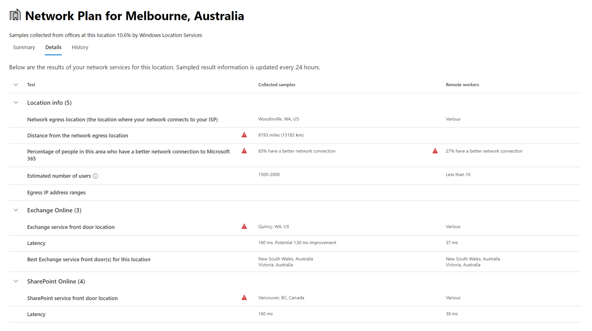

# Netwerkverbinding in het Microsoft 365-Beheercentrum (preview)Network connectivity in the Microsoft 365 Admin Center (preview)

Het Microsoft 365-Beheercentrum bevat nu de geaggregeerde metrische netwerk verbindings metriek van uw Microsoft 365-Tenant en kan alleen worden weergegeven door beheerders gebruikers in uw Tenant.The Microsoft 365 Admin Center now includes aggregated network connectivity metrics collected from your Microsoft 365 tenant and available to view only by administrative users in your tenant.

**Netwerk beoordelingen** en **netwerk inzichten** worden weergegeven in het Microsoft 365-Beheercentrum onder **gezondheidszorg | Connectiviteit**.**Network assessments** and **network insights** are displayed in the Microsoft 365 Admin Center under **Health | Connectivity**.

>[!NOTE]
>Het testprogramma voor Netwerkverbindingen ondersteunt tenants in de Duitse commerciële versie en Duitsland, maar niet GCC, GCC High, DoD of China.The network connectivity test tool supports tenants in WW Commercial and Germany but not GCC Moderate, GCC High, DoD or China.

Wanneer u naar de pagina netwerkprestaties gaat, ziet u het deelvenster Overzicht met een overzicht van de algemene netwerkprestaties, een netwerkbeoordelings bereik voor de volledige Tenant en een lijst met actuele problemen.When you first navigate to the network performance page, you will see an overview pane containing a map of global network performance, a network assessment scoped to the entire tenant, and a list of current issues. In het overzicht kunt u in-en uitzoomen om bepaalde metrische gegevens voor netwerkprestaties en-problemen weer te geven op locatie.From the overview, you can drill down to view specific network performance metrics and issues by location. Zie [het overzicht van netwerkprestaties in het Microsoft 365-Beheercentrum](#network-connectivity-overview-in-the-microsoft-365-admin-center)voor meer informatie.For more information, see [Network performance overview in the Microsoft 365 Admin Center](#network-connectivity-overview-in-the-microsoft-365-admin-center).

U wordt mogelijk gevraagd om deel te nemen aan de openbare preview voor deze functie namens uw organisatie.You may be asked to join the public preview for this feature on behalf of your organization. Accepteren meestal doet zich meestal direct voor, dan wordt de pagina netwerkconnectiviteit weergegeven.Acceptance usually happened immediately and then you will see the network connectivity page. 

Wanneer u naar de pagina netwerkconnectiviteit gaat, wordt een Overzichtsvenster weergegeven met een overzicht van de algemene netwerkprestaties, een netwerkbeoordelings bereik voor de volledige Tenant en een lijst met actuele problemen.On navigating to the network connectivity page, you will see an overview pane containing a map of global network performance, a network assessment scoped to the entire tenant, and a list of current issues. Voor toegang tot deze pagina moet u een beheerder van de organisatie binnen Microsoft 365 zijn.To access this page you must be an administrator for the organization within Microsoft 365. De beheerdersrol van de Rapportlezer heeft leestoegang tot deze informatie.The Report Reader administrative role will have read access to this information. Als u locaties en andere onderdelen van netwerkconnectiviteit wilt configureren, moet een beheerder deel uitmaken van een beheerder van de server, zoals de rol van beheerder voor service ondersteuning.To configure locations and other elements of network connectivity an administrator must be part of a server administrator role such as the Service support admin role. In het overzicht kunt u in-en uitzoomen om bepaalde metrische gegevens voor netwerkprestaties en-problemen weer te geven op locatie.From the overview, you can drill down to view specific network performance metrics and issues by location. Zie [Netwerkverbindingen-overzicht in het Microsoft 365-Beheercentrum](#network-connectivity-overview-in-the-microsoft-365-admin-center)voor meer informatie.For more information, see [Network connectivity overview in the Microsoft 365 Admin Center](#network-connectivity-overview-in-the-microsoft-365-admin-center).

## Vereisten voor het weergeven van proefversies voor netwerkverbindingenPre-requisites for network connectivity assessments to appear

Hoewel netwerkconnectiviteit binnen de organisatie kan worden geëvalueerd, moeten verbeteringen in het netwerkontwerp voor specifieke Office-locaties worden uitgevoerd.Whilst network connectivity can be evaluated across the organization, any network design improvements will need to be done for specific office locations. U kunt gegevens over netwerkverbindingen weergeven voor elke kantoorlocatie zodra u deze locaties kunt bepalen.Network connectivity information is provided for each office location once those locations can be determined. U hebt drie opties voor het verkrijgen van netwerk beoordelingen vanaf uw kantoorlocaties:There are three options for getting network assessments from your office locations:

### 1. Windows-locatie Services inschakelen1. Enable Windows Location Services

Voor deze optie moet u minimaal twee computers uitvoeren op elke locatie in Office waarop de vereisten worden ondersteund.For this option you must have at least two computers running at each office location that support the pre-requisites. OneDrive voor Windows versie **19,232** of hoger moet zijn geïnstalleerd op elke computer.OneDrive for Windows version **19.232** or above must be installed on each computer. Zie de opmerkingen bij de [onedrive-release](https://support.office.com/article/onedrive-release-notes-845dcf18-f921-435e-bf28-4e24b95e5fc0)voor meer informatie over onedrive-versies.For more information on OneDrive versions, see the [OneDrive release notes](https://support.office.com/article/onedrive-release-notes-845dcf18-f921-435e-bf28-4e24b95e5fc0). Netwerk metingen kunnen in de nabije toekomst worden toegevoegd in andere clienttoepassingen van Office 365.Network measurements are planned to be added in other Office 365 client applications in the near future.

Windows-locatie service moet zijn doorgestuurd op de computers.Windows Location Service must be consented on the machines. U kunt dit testen door de app **kaarten** uit te voeren en te zoeken.You can test this by running the **Maps** app and locating yourself. U kunt deze optie inschakelen op één computer met **instellingen | Privacy | De locatie** waar de instelling _apps mag toegang hebben tot uw locatie_ , moet zijn ingeschakeld.It can be enabled on a single machine with **Settings | Privacy | Location** where the setting _Allow apps to access your location_ must be enabled. De Windows Location Service instemming kan worden geïmplementeerd op Pc's met behulp van MDM of Groepsbeleid met de instelling _LetAppsAccessLocation_.Windows Location Services consent can be deployed to PCs using MDM or Group Policy with the setting _LetAppsAccessLocation_.

U hoeft geen locaties in het Beheercentrum toe te voegen, zoals ze automatisch worden aangeduid met de resolutie van stad.You do not need to add locations in the Admin Center with this method as they are automatically identified at the city resolution. U kunt niet meerdere Office-locaties binnen een stad weergeven met behulp van Windows-locatie Services.You cannot show multiple office locations within a city using Windows Location Services. Locatie-informatie wordt ook afgerond op de dichtstbijzijnde 300 meter door 300 meters voordat deze worden geüpload, zodat het niet mogelijk is om meer informatie over de locatie te krijgen.Location information is also rounded to the nearest 300 meters by 300 meters before being uploaded so that more precise location information is not possible to access.

De computers moeten Wi-Fi netwerk hebben in plaats van een Ethernet-kabel.The machines should have Wi-Fi networking rather than an ethernet cable. Machines met een Ethernet-kabel hebben geen nauwkeurige informatie over de locatie.Machines with an ethernet cable do not have accurate location information.

De maat monsters en de kantoorlocaties moeten 24 uur worden weergegeven nadat aan deze vereisten is voldaan.Measurement samples and office locations should start to appear 24 hours after these pre-requisites have been met.

### 2. locaties toevoegen en informatie over LAN-subnetten2. Add locations and provide LAN subnet information

Voor deze optie zijn geen Windows-locatie Services en Wi-Fi vereist.For this option neither Windows Location Services nor Wi-Fi are required. U moet OneDrive voor Windows versie **20,161** of hoger installeren op elke computer.You need OneDrive for Windows version **20.161** or above installed on each computer at the location.

U moet ook locaties toevoegen op de pagina met netwerkverbindingen van het Beheercentrum of deze importeren uit een CSV-bestand.You also need to add locations in the Admin Center network connectivity page or to import those from a CSV file. De toegevoegde locaties moeten de subnetgegevens van Office LAN bevatten.The locations added must include your office LAN subnet information.

Aangezien u de locaties toevoegt, kunt u in een stad meerdere kantoren definiëren.Because you are adding the locations, you can have multiple offices defined within a city.

De maat monsters en de kantoorlocaties moeten 24 uur worden weergegeven nadat aan deze vereisten is voldaan.Measurement samples and office locations should start to appear 24 hours after these pre-requisites have been met.

### 3. testrapporten handmatig verzamelen met het hulpprogramma voor het testen van het Microsoft 365-netwerkconnectiviteit3. Manually gather test reports with the Microsoft 365 network connectivity test tool

Voor deze optie moet u een persoon op elke locatie identificeren.For this option you need to identify a person at each location. Vraag de persoon om [365](https://connectivity.office.com) te browsen op een Windows-computer waarop ze beheerdersmachtigingen hebben.Ask them to browse to [Microsoft 365 network connectivity test](https://connectivity.office.com) on a Windows machine on which they have administrative permissions. Op de website dienen ze zich aan te melden bij het Office 365-account voor dezelfde organisatie waarvan u de resultaten wilt bekijken.On the web site, they need to sign-in to their Office 365 account for the same organization that you want to see the results. Vervolgens klikken ze op **test uitvoeren**.Then they should click **Run test**. Tijdens de test is een gedownloade connectiviteitstest EXE.During the test there is a downloaded Connectivity test EXE. De persoon moet dit ook openen en uitvoeren.They need to open and execute that also. Wanneer de tests zijn voltooid, wordt het testresultaat geüpload naar Office 365.Once the tests are completed, the test result is uploaded to Office 365.

Test rapporten worden gekoppeld aan een locatie als deze is toegevoegd met LAN-subnetgegevens, anders worden ze alleen weergegeven op de locatie van de stad.Test reports are linked to a location if it was added with LAN subnet information, otherwise they are shown at the city location only.

De maat voorbeelden en de Office-locaties moeten eerst 2-3 minuten worden weergegeven na voltooiing van een testrapport.Measurement samples and office locations should start to appear 2-3 minutes after a test report is completed. Zie voor meer informatie [Microsoft 365 Network Connectivity test (preview)](office-365-network-mac-perf-onboarding-tool.md).For more information, see [Microsoft 365 network connectivity test (preview)](office-365-network-mac-perf-onboarding-tool.md).

## Hoe gebruik ik deze informatie?How do I use this information?

**Netwerk inzichten**, de bijbehorende prestatie aanbevelingen en netwerk beoordelingen zijn bedoeld voor het ontwerpen van netwerkverbindingen voor uw Office-locaties.**Network insights**, their related performance recommendations and network assessments are intended to help in designing network perimeters for your office locations. Elk inzicht biedt informatie over de prestatie-eigenschappen voor een specifiek veelvoorkomend probleem voor elke geografische locatie waar gebruikers toegang hebben tot uw Tenant.Each insight provides details about the performance characteristics for a specific common issue for each geographic location where users are accessing your tenant. **Aanbevelingen** voor de prestaties van elk netwerk voor inzicht in de vereisten voor het ontwerp van de netwerkarchitectuur kunt u een betere gebruikerservaring met de microsoft 365-netwerkconnectiviteit maken.**Performance recommendations** for each network insight offer specific network architecture design changes you can make to improve user experience related to Microsoft 365 network connectivity. De netwerk beoordeling laat zien hoe de gebruikerservaring invloed heeft op de gebruikerservaring, zodat de netwerkverbindingen van de verschillende gebruikerslocatie kunnen worden vergeleken.The network assessment shows how network connectivity impacts user experience, allowing for comparison of different user location network connections.

**Netwerk beoordelingen** : een samenvatting van de gegevens van de netwerkprestaties in een momentopname van de status van uw bedrijfsnetwerk, aangeduid met een punten waarde uit 0-100.**Network assessments** distill an aggregate of many network performance metrics into a snapshot of your enterprise network health, represented by a points value from 0 - 100. Netwerk beoordelingen zijn beperkt tot de gehele Tenant en voor elke geografische locatie van de gebruikers die verbinding maken met uw Tenant, zodat Microsoft 365-beheerders een eenvoudige manier is om een Gestalt van de netwerkstatus van de onderneming te begrijpt en snel een uitzoomen op een gedetailleerd overzicht van een wereldwijd kantoor.Network assessments are scoped to both the entire tenant and for each geographic location from which users connect to your tenant, providing Microsoft 365 administrators with an easy way to instantly grasp a gestalt of the enterprise's network health and quickly drill down into a detailed report for any global office location.

Complexe ondernemingen met meerdere kantoorlocaties en niet-triviale netwerk perimeter architecturen kunnen met deze informatie profiteren van de voordelen van Microsoft 365 of voor het oplossen van problemen met de netwerkprestaties die zijn ontdekt bij gebruiks groei.Complex enterprises with multiple office locations and non-trivial network perimeter architectures can benefit from this information either during their initial onboarding to Microsoft 365 or to remediate network performance issues discovered with usage growth. Dit is doorgaans niet nodig voor kleine bedrijven die gebruikmaken van Microsoft 365, of ondernemingen die al eenvoudige en rechtstreekse netwerkconnectiviteit hebben.This is usually not necessary for small businesses using Microsoft 365, or any enterprises who already have simple and direct network connectivity. Voor bedrijven met meer dan 500 gebruikers en meerdere Office-locaties wordt naar verwachting geprofiteerd.Enterprises with over 500 users and multiple office locations are expected to benefit the most.

>[!IMPORTANT]
>Netwerk inzichten, prestatie aanbevelingen en beoordelingen in het Microsoft 365-Beheercentrum is momenteel in de preview-versie en is alleen beschikbaar voor Microsoft 365-tenants die zijn geregistreerd in het functie voorbeeldprogramma.Network insights, performance recommendations and assessments in the Microsoft 365 Admin Center is currently in preview status, and is only available for Microsoft 365 tenants that have been enrolled in the feature preview program.

## Netwerkconnectiviteitsproblemen voor ondernemingenEnterprise network connectivity challenges

Veel bedrijven hebben configuraties voor netwerkverbindingen die in de loop van de tijd zijn gekweekt en die hoofdzakelijk zijn ontworpen om toegang te krijgen tot de Internet site van werknemers waar de meeste websites niet vooraf bekend zijn en waarvan niet wordt vertrouwd.Many enterprises have network perimeter configurations which have grown over time and are primarily designed to accommodate employee Internet web site access where most web sites are not known in advance and are untrusted. De heersende en de benodigde focus verlegt geen malware en verzorgt geen aanvallen van deze onbekende websites.The prevailing and necessary focus is avoiding malware and fishing attacks from these unknown web sites. Deze strategie voor de netwerkconfiguratie kan leiden tot degradatie van de prestaties van Microsoft 365 User en de gebruikerservaring.This network configuration strategy, while helpful for security purposes, can lead to degradation of Microsoft 365 user performance and user experience.

## Hoe we deze uitdagingen kunnen oplossenHow we can solve these challenges

Ondernemingen kunnen de algemene gebruikerservaring verbeteren en hun omgeving beschermen aan de hand van de basis [principes van Office 365](https://aka.ms/pnc) en door gebruik te maken van de functie voor netwerkverbindingen van microsoft 365.Enterprises can improve general user experience and secure their environment by following [Office 365 connectivity principles](https://aka.ms/pnc) and by using the Microsoft 365 Admin Center network connectivity feature. In de meeste gevallen is het raadzaam om de latentie, de betrouwbaarheid van de dienst en de algehele prestaties van Microsoft 365 te verbeteren.In most cases, following these general principles will have a significant positive impact on end user latency, service reliability and overall performance of Microsoft 365.

Microsoft vraagt soms om problemen met de netwerkprestaties met Microsoft 365 voor grote Enterprise-klanten en bevat vaak de basis oorzaak van de netwerkinfrastructuur van de klant.Microsoft is sometimes asked to investigate network performance issues with Microsoft 365 for large enterprise customers, and these frequently have a root cause related to the customers network perimeter infrastructure. Wanneer een veelvoorkomende hoofdoorzaak van een probleem met de netwerkverbinding van de klant wordt gevonden, willen we eenvoudige test metingen identificeren waarmee de basis oorzaak wordt aangegeven.When a common root cause of a customer network perimeter issue is found we seek to identify simple test measurements that identifies it. Een test met een maateenheid die een specifiek probleem identificeert, is waardevol omdat u dezelfde afmeting op elke locatie kunt testen, aangeven of deze hoofdoorzaak op een willekeurige plaats aanwezig is en de beheerder als netwerk inzicht deelt.A test with a measurement threshold that identifies a specific problem is valuable because we can test the same measurement at any location, tell whether this root cause is present there and share it as a network insight with the administrator.

Sommige netwerk inzichten geven slechts een probleem aan dat verder moet worden onderzocht.Some network insights will merely indicate a problem that needs further investigation. Een netwerk inzicht waarbij er voldoende tests zijn voor het weergeven van een specifieke herstelactie om de hoofdoorzaak te corrigeren, wordt weergegeven als **Aanbevolen actie**.A network insight where we have enough tests to show a specific remediation action to correct the root cause is listed as a **recommended action**. Deze aanbevelingen op basis van Live metrische waarden die waarden weergeven die buiten een vooraf ingestelde drempel vallen, zijn veel waardevoler dan algemeen best practices adviseren, aangezien ze specifiek zijn voor uw omgeving, en zullen de daadwerkelijke verbetering aangeven wanneer de aanbevolen wijzigingen zijn aangebracht.These recommendations, based on live metrics that reveal values that fall outside a predetermined threshold, are much more valuable than general best practice advice since they are specific to your environment and will show the actual improvement once the recommended changes have been made.

## Overzicht netwerkverbinding in het Microsoft 365-BeheercentrumNetwork connectivity overview in the Microsoft 365 Admin Center

Microsoft beschikt over bestaande netwerk metingen van diverse bureaublad-en webclients van Office die de werking van Microsoft 365 ondersteunen.Microsoft has existing network measurements from several Office desktop and web clients which support the operation of Microsoft 365. Deze metingen worden nu gebruikt voor het verschaffen van inzichten van de netwerkarchitectuur en een netwerk beoordeling die wordt weergegeven op de pagina met **Netwerkverbindingen** in het microsoft 365-Beheercentrum.These measurements are now being used to provide network architecture design insights and a network assessment which are shown in the **Network connectivity** page in the Microsoft 365 Admin Center.

Standaard wordt de plaats aangegeven waar de client apparatuur zich bevindt, de locatiegegevens die bij de netwerk metingen horen.By default, approximate location information associated with the network measurements identify the city where client devices are located. De beoordeling van het netwerk op elke locatie wordt weergegeven met kleur en het relatieve aantal gebruikers op elke locatie wordt aangegeven met de grootte van de cirkel.The network assessment at each location is shown with color and the relative number of users at each location is represented by the size of the circle.

Op de pagina Overview wordt ook de netwerkassessment voor de klant weergegeven als een gewogen gemiddelde voor alle kantoorlocaties.The overview page also shows the network assessment for the customer as a weighted average across all office locations.

U kunt een tabel weergave bekijken van de locaties waarop ze kunnen worden gefilterd, gesorteerd en bewerkt op het tabblad locaties. Bij locaties met specifieke aanbevelingen kan ook een geschatte potentiële latentie verbetering worden opgenomen.You can view a table view of the locations where they can be filtered, sorted, and edited in the locations tab. Locations with specific recommendations may also include an estimated potential latency improvement. Dit wordt berekend door de mediaan latentie van de gebruikers van uw organisatie op de locatie te nemen en de mediaan latentie af te trekken voor alle organisaties in dezelfde plaats.This is calculated by taking the median latency of your organization users at the location and subtracting the median latency for all organizations in the same city.

## Specifieke Office-locatie netwerk prestatie samenvatting en inzichtenSpecific office location network performance summary and insights

Wanneer u een Office-locatie selecteert, wordt er een overzichtspagina weergegeven met details van de uittreding van het netwerk die is geïdentificeerd op basis van metingen voor die kantoorlocatie.Selecting an office location opens a location-specific summary page showing details of the network egress that has been identified from measurements for that office location.

Een kaart van het perimeternetwerk voor de gebruikers van uw organisatie op de locatie wordt weergegeven met een of meer van deze elementen:A map of the perimeter network for your organization users at the location is shown with some or all of these elements:

- **Kantoorlocatie** -de kantoorlocatie van de pagina die u bekijkt**Office location** - The office location for the page you are looking at
- **Netwerk perimeter** : de locatie van het bron-IP-adres voor verbindingen vanaf de kantoorlocatie.**Network perimeter** - The location of the source IP Address for connections from the office location. Dit hangt af van de nauwkeurigheid van Geo-IP Location-databases.This depends on the accuracy of geo-IP location databases
- **Voor uitbesteende service van Exchange** : een van de aanbevolen Exchange-service-deuren waarmee gebruikers op deze locatie van Office verbinding kunnen maken**Exchange optimal service front door** - One of the recommended Exchange service front doors that users in this office location should connect to
- **Suboptimale front deur van Exchange** : een Exchange-service die aan de kant van de gebruiker is gekoppeld, maar wordt niet aanbevolen**Exchange sub-optimal front door** - An Exchange service front door that users are connected to, but is not recommended
- Optimale bezorgings **service van SharePoint** : een van de aanbevolen SharePoint-Service-deuras waarmee gebruikers op deze Office-locatie verbinding kunnen maken**SharePoint optimal service front door** - One of the recommended SharePoint service front doors that users in this office location should connect to
- **Voor de front-site van de SharePoint** -service: een SharePoint-Service-voor deur waarbij gebruikers zijn verbonden, maar niet wordt aanbevolen**SharePoint sub-optimal service front door** - A SharePoint service front door that users are connected to, but is not recommended
- **DNS recursieve resolver server** -de locatie van een Geo IP-database van de GEDETECTEERDe DNS recursieve resolver die wordt gebruikt voor Exchange Online (indien beschikbaar).**DNS recursive resolver server** - The location from a geo IP database of the detected DNS recursive resolver used for Exchange Online (if available)
- **Uw proxyserver** -de locatie van een Geo IP-database van de gedetecteerde proxyserver (indien beschikbaar)**Your proxy server** - The location from a geo IP database of the detected proxy server (if available) 

Op de pagina Office-locatie overzicht ziet u ook de netwerk beoordeling van de vestiging, de netwerkbeoordelings geschiedenis, een vergelijking van de beoordeling van deze locatie en een lijst met specifieke inzichten en aanbevelingen die u kunt ondernemen om de prestaties van het netwerk en de betrouwbaarheid te verbeteren.The office location summary page additionally shows the location's network assessment, network assessment history, a comparison of this location's assessment to other customers in the same city, and a list of specific insights and recommendations that you can undertake to improve network performance and reliability.

Voor vergelijkingen tussen klanten in dezelfde stad wordt uitgegaan van de verwachting dat alle klanten gelijke toegang hebben tot netwerkservice providers, telecommunicatie infrastructuur en nabijgelegen Microsoft-netwerk punten van aanwezigheid.Comparisons between customers in the same city are based on the expectation that all customers have equal access to network service providers, telecommunications infrastructure, and nearby Microsoft network points of presence.

Op het tabblad Details op de pagina Office-locatie ziet u de specifieke meetresultaten die zijn gebruikt voor inzichten, aanbevelingen en de netwerk beoordeling.The details tab on the office location page shows the specific measurement results that were used to come up with any insights, recommendations, and the network assessment. Dit wordt geboden, zodat netwerk technici de aanbevelingen en de factoren in de desbetreffende omgeving kunnen valideren.This is provided so that network engineers can validate the recommendations and factor in any constraints or specifics in their environment.

## CSV-Import voor LAN-subnetten Office-locatiesCSV Import for LAN subnet office locations

Voor Office-identificatie voor het subnet Office moet u elke locatie vooraf toevoegen.For LAN subnet office identification, you need to add each location in advance. In plaats van de afzonderlijke Office-locaties op het tabblad **locaties** toe te voegen, kunt u ze importeren uit een CSV-bestand.Instead of adding individual office locations in the **Locations** tab you can import them from a CSV file. U kunt deze gegevens mogelijk verkrijgen via andere locaties die u hebt opgeslagen, zoals het dashboard oproep kwaliteit of Active Directory-sites en-services.You may be able to obtain this data from other places you have stored it such as the Call Quality Dashboard or Active Directory Sites and Services

In het CSV-bestand wordt een gedetecteerde locatie van de stad weergegeven in de kolom userEntered als leeg, en een handmatig toegevoegde locatie van Office wordt als 1 weergegeven.In the CSV file a discovered city location shows in the userEntered column as blank, and a manually added office location shows as 1.

1. Klik in het venster belangrijkste _verbindingen met Microsoft 365_ op het tabblad **locaties** .In the main _Connectivity to Microsoft 365_ window, click the **Locations** tab.
1. Klik op de knop **importeren** net boven de lijst met locaties.Click the **Import** button just above the locations list. De flyout **Office-locaties importeren** wordt weergegeven.The **Import office locations** flyout will appear.

   

1. Klik op de koppeling **huidige Office-locaties (. CSV) downloaden** om de lijst huidige locaties te exporteren naar een CSV-bestand en sla het op in de lokale harde schijf.Click the **Download current office locations (.csv)** link to export the current locations list to a CSV file, and save it to your local hard disk. U beschikt nu over een juist opgemaakt CSV met kolomkoppen waarop u locaties kunt toevoegen.This will provide you with a correctly formatted CSV with column headings to which you can add locations. U kunt de bestaande geëxporteerde locaties sluiten. ze worden niet gedupliceerd wanneer u de bijgewerkte CSV-bestanden importeert.You can leave the existing exported locations as they are; they will not be duplicated when you import the updated CSV. Als u het adres van een bestaande locatie wilt wijzigen, wordt dit bijgewerkt wanneer u het CSV-bestand importeert.If you wish to change the address of an existing location, it will be updated when you import the CSV. U kunt het adres van een gevonden stad niet wijzigen.You cannot change the address of a discovered city.
1. Open het CSV-bestand en voeg uw locaties toe door de volgende velden in te vullen op een nieuwe regel voor elke locatie die u wilt toevoegen.Open the CSV and add your locations by filling out the following fields on a new line for each location you want to add. Laat alle andere velden leeg; waarden die u invoert in andere velden, worden genegeerd.Leave all other fields blank; values you enter in other fields will be ignored.
   1. **userEntered** (vereist): moet 1 zijn voor een nieuw LAN-subnet Office-locatie**userEntered** (required): Must be 1 for a new LAN Subnet office location
   1. **Adres** (vereist): het fysieke adres van het kantoor**Address** (required): The physical address of the office
   1. **Breedtegraad** (optioneel): gevuld met Bing Maps lookup van het adres indien leeg**Latitude** (optional): Populated from Bing maps lookup of the address if blank
   1. **Lengtegraad** (optioneel): gevuld met Bing Maps lookup van het adres indien leeg**Longitude** (optional): Populated from Bing maps lookup of the address if blank
   1. **IP-adresbereiken voor IP-** adresbereiken 1-5 (optioneel): voor elk bereik voert u de naam van het circuit in gevolgd door een lijst met geldige IPv4-of IPv6-adressen die door een spatie zijn gescheiden.**Egress IP Address ranges 1-5** (optional): For each range, enter the circuit name followed by a space separated list of valid IPv4 or IPv6 CIDR addresses. Deze waarden worden gebruikt om meerdere kantoorlocaties te onderscheiden waarop u dezelfde IP-adressen voor het LAN-subnet gebruikt.These values are used to differentiate multiple office locations where you use the same LAN subnet IP Addresses. IP-adresbereiken voor IP-adresbereiken moeten allemaal/24 netwerk formaat zijn en de/24 niet is opgenomen in de invoer.Egress IP Address ranges all must be /24 network size and the /24 is not included in the input.
   1. **LanIps** (vereist): Hiermee kunt u de subnet-bereiken voor LAN weergeven die op deze locatie van Office worden gebruikt.**LanIps** (required): List the LAN subnet ranges in use at this office location. De subnet-Id's van het LAN moeten beschikken over een CIDR-netwerk formaat, waarbij de netwerkgrootte tussen/8 en/29 kan liggen.LAN subnet IDs need to have a CIDR network size included where the network size can be between /8 and /29. Meerdere LAN-subnetmasks kunnen worden gescheiden door een komma of een puntkomma.Multiple LAN subnet ranges can be separated by a comma or a semicolon.
1. Wanneer u uw Office-locaties hebt toegevoegd en het bestand hebt opgeslagen, klikt u op de knop **Bladeren** naast het veld **voltooid uploaden** en selecteert u het opgeslagen CSV-bestand.When you have added your office locations and saved the file, click the **Browse** button next to the **Upload the completed** field and select the saved CSV file.
1. Het bestand wordt automatisch gevalideerd.The file will be automatically validated. Als er validatiefouten zijn, wordt het foutbericht weergegeven _in het importbestand. Controleer de fouten, corrigeer het importbestand en probeer het opnieuw._If there are validation errors, you will see the error message _There are some errors in the import file. Review the errors, correct the import file, and then try again._ Klik op de koppeling **Open foutgegevens** voor een lijst met specifieke veld validatiefouten.Click the link **Open error details** for a list of specific field validation errors.

   

1. Als het bestand geen fouten bevat, wordt het bericht weergegeven dat _het rapport klaar is. Er zijn x-locaties gevonden om bij te werken en toe te voegen op x locaties._If there are no errors in the file, you will see the message _The report is ready. Found x locations to add and x locations to update._ Klik op de knop **importeren** om het CSV-bestand te uploaden.Click the **Import** button to upload the CSV.

   

## Veelgestelde vragenFAQ

### Wat is de front cover van de Microsoft 365-service?What is a Microsoft 365 service front door?

De Microsoft 365-service front deur is een toegangspunt voor het globale netwerk van Microsoft waar Office-clients en-services hun netwerkverbinding beëindigen.The Microsoft 365 service front door is an entry point on Microsoft's global network where Office clients and services terminate their network connection. Voor een optimale netwerkverbinding met Microsoft 365 wordt u aangeraden uw netwerkverbinding te beëindigen met de dichtstbijzijnde Microsoft 365-voor deur.For an optimal network connection to Microsoft 365, it is recommended that your network connection is terminated into the closest Microsoft 365 front door.

>[!NOTE]
>De Microsoft 365-service voor de voorgrond heeft geen directe relatie met het Azure-service-product voor de voor deur, dat beschikbaar is in de Azure Marketplace.Microsoft 365 service front door has no direct relationship to the Azure Front Door Service product available in the Azure marketplace.

### Wat is een optimale front cover-service van Microsoft 365.What is an optimal Microsoft 365 service front door?

Een optimale front-service van Microsoft 365 is een service die het meest geschikt is voor uw netwerk uitgang, in het algemeen in het gebied plaats of metro.An optimal Microsoft 365 service front door is one that is closest to your network egress, generally in your city or metro area. Met het [Microsoft 365 Connectivity test tool (preview)](office-365-network-mac-perf-onboarding-tool.md) kunt u de locatie van de microsoft 365-service voor de voorkeur en de optimale service-deur bepalen.Use the [Microsoft 365 connectivity test tool (preview)](office-365-network-mac-perf-onboarding-tool.md) to determine location of your in-use Microsoft 365 service front door and optimal service front door. Als het hulpprogramma bepaalt dat de front-in-de voorgrond van uw gebruik optimaal is, maakt u optimaal verbinding met het wereldwijde netwerk van Microsoft.If the tool determines your in-use front door is optimal, then you are optimally connecting into Microsoft's global network.

### Wat is een locatie voor uitgaand Internet?What is an internet egress location?

De locatie voor het uittreden van Internet is de locatie waar uw netwerkverkeer uw Enterprise-netwerk verlaat en verbinding maakt met internet.The internet egress location is the location where your network traffic exits your enterprise network and connects to the Internet. Dit wordt ook herkend als de locatie waar u een NAT-apparaat (Network Address Translation) hebt en meestal waarbij u verbinding maakt met een internetprovider (ISP).This is also identified as the location where you have a Network Address Translation (NAT) device and usually where you connect with an Internet Service Provider (ISP). Als u de locatie van uw locatie en de locatie van uw internetverbinding lang ziet, kan dit duiden op een aanzienlijke WAN-backhaul.If you see a long distance between your location and your internet egress location, then this may indicate a significant WAN backhaul.

## Verwante onderwerpenRelated topics

[Microsoft 365 Network Insights (preview)Microsoft 365 network insights (preview)](office-365-network-mac-perf-insights.md)

[Microsoft 365-netwerk beoordeling (preview)Microsoft 365 network assessment (preview)](office-365-network-mac-perf-score.md)

[Microsoft 365-verbindingstest programma (preview)Microsoft 365 connectivity test tool (preview)](office-365-network-mac-perf-onboarding-tool.md)

[Locatie Services voor Microsoft 365-netwerkconnectiviteitMicrosoft 365 Network Connectivity Location Services (preview)](office-365-network-mac-location-services.md)
