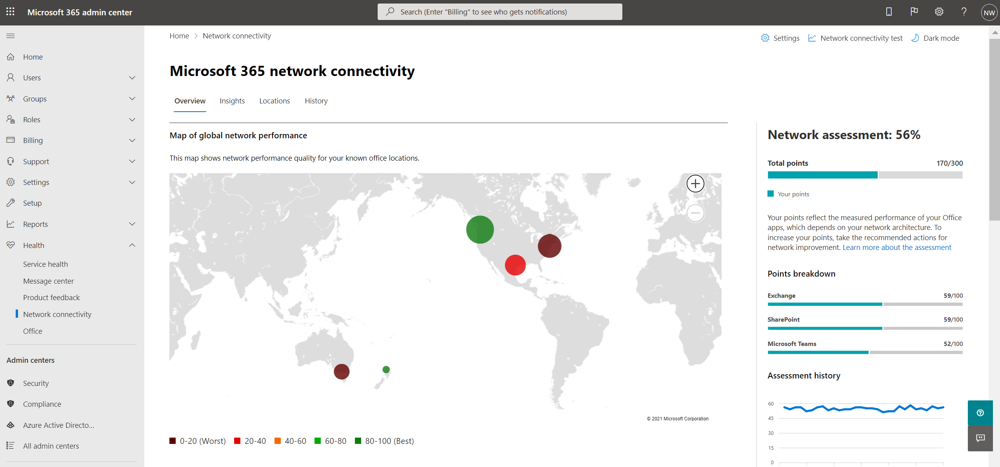

# Netwerkconnectiviteit in het Microsoft 365-beheercentrum (preview)Network connectivity in the Microsoft 365 Admin Center (preview)

Het Microsoft 365-beheercentrum bevat nu statistische meetgegevens voor netwerkconnectiviteit die zijn verzameld vanuit uw Microsoft 365-tenant en die alleen kunnen worden bekeken door beheerders in uw tenant.The Microsoft 365 Admin Center now includes aggregated network connectivity metrics collected from your Microsoft 365 tenant and available to view only by administrative users in your tenant.

> [!div class="mx-imgBorder"]
> 

**Netwerkbeoordelingen** en **netwerkinzichten** worden weergegeven in het Microsoft 365-beheercentrum onder **| Connectiviteit**.**Network assessments** and **network insights** are displayed in the Microsoft 365 Admin Center under **Health | Connectivity**.

> [!div class="mx-imgBorder"]
> 

>[!NOTE]
>Het testprogramma voor netwerkconnectiviteit ondersteunt tenants in WW Commercial en Duitsland, maar niet GCC Moderate, GCC High, DoD of China.The network connectivity test tool supports tenants in WW Commercial and Germany but not GCC Moderate, GCC High, DoD or China.

Wanneer u voor het eerst naar de netwerkprestatiepagina navigeert, ziet u een overzichtsvenster met een kaart van de globale netwerkprestaties, een netwerkbeoordelingsbereik voor de hele tenant en een lijst met actuele problemen.When you first navigate to the network performance page, you will see an overview pane containing a map of global network performance, a network assessment scoped to the entire tenant, and a list of current issues. In het overzicht kunt u inzoomen op specifieke netwerkprestatiegegevens en problemen per locatie.From the overview, you can drill down to view specific network performance metrics and issues by location. Zie Netwerkprestatieoverzicht in het [Microsoft 365-beheercentrum](#network-connectivity-overview-in-the-microsoft-365-admin-center)voor meer informatie.For more information, see [Network performance overview in the Microsoft 365 Admin Center](#network-connectivity-overview-in-the-microsoft-365-admin-center).

Mogelijk wordt u gevraagd namens uw organisatie deel te nemen aan de openbare preview voor deze functie.You may be asked to join the public preview for this feature on behalf of your organization. Acceptatie is meestal direct gebeurd en dan ziet u de pagina netwerkconnectiviteit.Acceptance usually happened immediately and then you will see the network connectivity page. 

Wanneer u naar de pagina netwerkconnectiviteit navigeert, ziet u een overzichtsvenster met een kaart van globale netwerkprestaties, een netwerkbeoordelingsbereik voor de hele tenant en een lijst met actuele problemen.On navigating to the network connectivity page, you will see an overview pane containing a map of global network performance, a network assessment scoped to the entire tenant, and a list of current issues. Als u deze pagina wilt openen, moet u een beheerder voor de organisatie zijn binnen Microsoft 365.To access this page you must be an administrator for the organization within Microsoft 365. De beheerrol Rapportlezer heeft leestoegang tot deze informatie.The Report Reader administrative role will have read access to this information. Als u locaties en andere elementen van netwerkconnectiviteit wilt configureren, moet een beheerder deel uitmaken van een serverbeheerderrol, zoals de rol serviceondersteuningsbeheerder.To configure locations and other elements of network connectivity an administrator must be part of a server administrator role such as the Service support admin role. In het overzicht kunt u inzoomen op specifieke netwerkprestatiegegevens en problemen per locatie.From the overview, you can drill down to view specific network performance metrics and issues by location. Zie Netwerkconnectiviteitsoverzicht in het [Microsoft 365-beheercentrum](#network-connectivity-overview-in-the-microsoft-365-admin-center)voor meer informatie.For more information, see [Network connectivity overview in the Microsoft 365 Admin Center](#network-connectivity-overview-in-the-microsoft-365-admin-center).

## Vereisten voor het verschijnen van netwerkconnectiviteitsbeoordelingenPre-requisites for network connectivity assessments to appear

Als u wilt beginnen, schakelt u de instelling voor de opt-in voor uw locatie in om automatisch gegevens te verzamelen van apparaten met Windows Location Services, naar de lijst Locaties te gaan om locatiegegevens toe te voegen of te uploaden of de Microsoft 365-netwerkconnectiviteitstest uit te voeren vanaf uw kantoorlocaties.To get started, turn on your location opt-in setting to automatically collect data from devices using Windows Location Services, go to your Locations list to add or upload location data, or run the Microsoft 365 network connectivity test from your office locations. Hoewel netwerkconnectiviteit in de hele organisatie kan worden geëvalueerd, moeten er verbeteringen in het netwerkontwerp worden aangebracht voor specifieke kantoorlocaties.Whilst network connectivity can be evaluated across the organization, any network design improvements will need to be done for specific office locations. Netwerkconnectiviteitsgegevens worden verstrekt voor elke kantoorlocatie zodra deze locaties kunnen worden bepaald.Network connectivity information is provided for each office location once those locations can be determined. Er zijn drie opties voor het verkrijgen van netwerkbeoordelingen vanaf uw kantoorlocaties:There are three options for getting network assessments from your office locations:

### 1. Windows Location Services inschakelen1. Enable Windows Location Services

Voor deze optie moet op elke kantoorlocatie ten minste twee computers worden uitgevoerd die de vereisten ondersteunen.For this option, you must have at least two computers running at each office location that support the pre-requisites. OneDrive voor Windows-versie moet up-to-date zijn en op elke computer zijn geïnstalleerd.OneDrive for Windows version must be up-to-date and installed on each computer. Zie de releasenotities van OneDrive voor meer informatie over [OneDrive-versies.](https://support.office.com/article/onedrive-release-notes-845dcf18-f921-435e-bf28-4e24b95e5fc0)For more information on OneDrive versions, see the [OneDrive release notes](https://support.office.com/article/onedrive-release-notes-845dcf18-f921-435e-bf28-4e24b95e5fc0). Netwerkmetingen worden in de nabije toekomst toegevoegd in andere Office 365-clienttoepassingen.Network measurements are planned to be added in other Office 365 client applications in the near future.

Windows Location Service moet worden ingestemd met de machines.Windows Location Service must be consented on the machines. U kunt dit testen door de app **Kaarten uit te** proberen en uzelf te lokaliseren.You can test this by running the **Maps** app and locating yourself. Het kan worden ingeschakeld op één computer met **instellingen | Privacy | Locatie** waar de instelling _Apps toegang verlenen tot uw locatie_ moet zijn ingeschakeld.It can be enabled on a single machine with **Settings | Privacy | Location** where the setting _Allow apps to access your location_ must be enabled. Windows Location Services-toestemming kan worden geïmplementeerd op pc's met MDM of Groepsbeleid met de instelling _LetAppsAccessLocation_.Windows Location Services consent can be deployed to PCs using MDM or Group Policy with the setting _LetAppsAccessLocation_.

U hoeft met deze methode geen locaties in het beheercentrum toe te voegen, omdat deze automatisch worden geïdentificeerd bij de oplossing van de plaats.You do not need to add locations in the Admin Center with this method as they are automatically identified at the city resolution. U kunt niet meerdere kantoorlocaties in een plaats laten zien met Windows Location Services.You cannot show multiple office locations within a city using Windows Location Services. Locatiegegevens worden ook afgerond op de dichtstbijzijnde 300 meter bij 300 meter voordat ze worden geüpload, zodat er geen nauwkeurigere locatiegegevens beschikbaar zijn.Location information is also rounded to the nearest 300 meters by 300 meters before being uploaded so that more precise location information is not possible to access.

De machines moeten een Wi-Fi hebben in plaats van een ethernetkabel.The machines should have Wi-Fi networking rather than an ethernet cable. Machines met een ethernetkabel hebben geen nauwkeurige locatiegegevens.Machines with an ethernet cable do not have accurate location information.

Maatvoorbeelden en kantoorlocaties worden 24 uur nadat aan deze vereisten is voldaan, weergegeven.Measurement samples and office locations should start to appear 24 hours after these pre-requisites have been met.

### 2. Locaties toevoegen en LAN-subnetgegevens verstrekken2. Add locations and provide LAN subnet information

Voor deze optie zijn Windows Location Services noch Wi-Fi vereist.For this option, neither Windows Location Services nor Wi-Fi are required. Uw OneDrive voor Windows-versie moet up-to-date zijn en op elke computer op de locatie zijn geïnstalleerd.Your OneDrive for Windows version must be up-to-date and installed on each computer at the location.

U moet ook locaties toevoegen op de pagina Netwerkconnectiviteit van het beheercentrum of om deze te importeren uit een CSV-bestand.You also need to add locations in the Admin Center network connectivity page or to import those from a CSV file. De locaties die zijn toegevoegd, moeten uw office LAN-subnetgegevens bevatten.The locations added must include your office LAN subnet information.

Aangezien u de locaties toevoegt, kunt u meerdere kantoren in een plaats laten definiëren.Since you are adding the locations, you can have multiple offices defined within a city.

Alle testmetingen van clientapparaten bevatten de LAN-subnetgegevens, die zijn gecorreleerd met de kantoorlocatiegegevens die u hebt ingevoerd.All test measurements from client machines include the LAN subnet information, which is correlated with the office location details that you have entered. Maatvoorbeelden en kantoorlocaties worden 24 uur nadat aan deze vereisten is voldaan, weergegeven.Measurement samples and office locations should start to appear 24 hours after these pre-requisites have been met.

### 3. Testrapporten handmatig verzamelen met het testprogramma voor microsoft 365-netwerkconnectiviteit3. Manually gather test reports with the Microsoft 365 network connectivity test tool

Voor deze optie moet u een persoon op elke locatie identificeren.For this option, you need to identify a person at each location. Vraag ze te bladeren naar [de microsoft 365-netwerkconnectiviteitstest](https://connectivity.office.com) op een Windows-computer waarop ze beheerdersmachtigingen hebben.Ask them to browse to [Microsoft 365 network connectivity test](https://connectivity.office.com) on a Windows machine on which they have administrative permissions. Op de website moeten ze zich aanmelden bij hun Office 365-account voor dezelfde organisatie die u de resultaten wilt zien.On the web site, they need to sign-in to their Office 365 account for the same organization that you want to see the results. Klik vervolgens op **Test uitvoeren.**Then they should click **Run test**. Tijdens de test is er een gedownloade Connectiviteitstest EXE.During the test there is a downloaded Connectivity test EXE. Ze moeten dat ook openen en uitvoeren.They need to open and execute that also. Wanneer de tests zijn voltooid, wordt het testresultaat geüpload naar Office 365.Once the tests are completed, the test result is uploaded to Office 365.

Testrapporten worden gekoppeld aan een locatie als deze is toegevoegd met LAN-subnetgegevens, anders worden ze alleen weergegeven op de locatie van de plaats.Test reports are linked to a location if it was added with LAN subnet information, otherwise they are shown at the city location only.

Maatvoorbeelden en kantoorlocaties worden 2-3 minuten nadat een testrapport is voltooid, weergegeven.Measurement samples and office locations should start to appear 2-3 minutes after a test report is completed. Zie Microsoft [365 Network Connectivity Test (preview) voor meer informatie.](office-365-network-mac-perf-onboarding-tool.md)For more information, see [Microsoft 365 network connectivity test (preview)](office-365-network-mac-perf-onboarding-tool.md).

## Hoe gebruik ik deze gegevens?How do I use this information?

**Netwerkinzichten,** bijbehorende prestatieaanbevelingen en netwerkbeoordelingen zijn bedoeld om te helpen bij het ontwerpen van netwerkperimeters voor uw kantoorlocaties.**Network insights**, their related performance recommendations and network assessments are intended to help in designing network perimeters for your office locations. Elk inzicht bevat details over de prestatiekenmerken voor een specifiek veelvoorkomende probleem voor elke geografische locatie waar gebruikers toegang hebben tot uw tenant.Each insight provides details about the performance characteristics for a specific common issue for each geographic location where users are accessing your tenant. **Prestatieaanbevelingen voor** elk netwerkinzicht bieden specifieke wijzigingen in het ontwerp van de netwerkarchitectuur die u kunt aanbrengen om de gebruikerservaring met betrekking tot microsoft 365-netwerkconnectiviteit te verbeteren.**Performance recommendations** for each network insight offer specific network architecture design changes you can make to improve user experience related to Microsoft 365 network connectivity. De netwerkbeoordeling laat zien hoe netwerkconnectiviteit van invloed is op de gebruikerservaring, zodat verschillende netwerkverbindingen van gebruikerslocatie kunnen worden vergeleken.The network assessment shows how network connectivity impacts user experience, allowing for comparison of different user location network connections.

**Netwerkbeoordelingen** destilleren een aggregatie van veel meetwaarden voor netwerkprestaties in een momentopname van de netwerktoestand van uw bedrijf, vertegenwoordigd door een puntenwaarde van 0 tot 100.**Network assessments** distill an aggregate of many network performance metrics into a snapshot of your enterprise network health, represented by a points value from 0 - 100. Netwerkbeoordelingen zijn van toepassing op zowel de hele tenant als voor elke geografische locatie waaruit gebruikers verbinding maken met uw tenant, zodat Microsoft 365-beheerders een eenvoudige manier hebben om direct inzicht te krijgen in de netwerktoestand van de onderneming en snel in te zoomen op een gedetailleerd rapport voor een globale kantoorlocatie.Network assessments are scoped to both the entire tenant and for each geographic location from which users connect to your tenant, providing Microsoft 365 administrators with an easy way to instantly grasp a gestalt of the enterprise's network health and quickly drill down into a detailed report for any global office location.

Complexe ondernemingen met meerdere kantoorlocaties en niet-onbelangrijke netwerkperimeterarchitectuur kunnen van deze informatie profiteren tijdens de eerste onboarding bij Microsoft 365 of om problemen met netwerkprestaties te verhelpen die zijn ontdekt met de groei van het gebruik.Complex enterprises with multiple office locations and non-trivial network perimeter architectures can benefit from this information either during their initial onboarding to Microsoft 365 or to remediate network performance issues discovered with usage growth. Dit is meestal niet nodig voor kleine bedrijven die Microsoft 365 gebruiken of ondernemingen die al eenvoudige en directe netwerkconnectiviteit hebben.This is usually not necessary for small businesses using Microsoft 365, or any enterprises who already have simple and direct network connectivity. Ondernemingen met meer dan 500 gebruikers en meerdere kantoorlocaties zullen naar verwachting het meest profiteren.Enterprises with over 500 users and multiple office locations are expected to benefit the most.

>[!IMPORTANT]
>Netwerkinzichten, prestatieaanbevelingen en evaluaties in het Microsoft 365-beheercentrum hebben momenteel de preview-status en zijn alleen beschikbaar voor Microsoft 365-tenants die zijn geregistreerd voor het functievoorbeeldprogramma.Network insights, performance recommendations and assessments in the Microsoft 365 Admin Center is currently in preview status, and is only available for Microsoft 365 tenants that have been enrolled in the feature preview program.

## Uitdagingen op het gebied van netwerkconnectiviteit voor ondernemingenEnterprise network connectivity challenges

> [!div class="mx-imgBorder"]
> 

Veel ondernemingen hebben netwerkperimeterconfiguraties die in de afgelopen tijd zijn uitgebreid en die voornamelijk zijn ontworpen voor toegang tot internetsites van werknemers, waar de meeste websites niet van tevoren bekend zijn en niet worden vertrouwd.Many enterprises have network perimeter configurations which have grown over time and are primarily designed to accommodate employee Internet web site access where most web sites are not known in advance and are untrusted. De overheersende en noodzakelijke focus is het voorkomen van malware- en visaanvallen van deze onbekende websites.The prevailing and necessary focus is avoiding malware and fishing attacks from these unknown web sites. Deze netwerkconfiguratiestrategie kan, hoewel nuttig voor beveiligingsdoeleinden, leiden tot een verslechtering van de gebruikersprestaties en gebruikerservaring van Microsoft 365.This network configuration strategy, while helpful for security purposes, can lead to degradation of Microsoft 365 user performance and user experience.

## Hoe we deze uitdagingen kunnen oplossenHow we can solve these challenges

Ondernemingen kunnen de algemene gebruikerservaring verbeteren en hun omgeving beveiligen door de connectiviteitsprincipes van [Office 365](./microsoft-365-network-connectivity-principles.md) te volgen en de netwerkconnectiviteitsfunctie van het Microsoft 365-beheercentrum te gebruiken.Enterprises can improve general user experience and secure their environment by following [Office 365 connectivity principles](./microsoft-365-network-connectivity-principles.md) and by using the Microsoft 365 Admin Center network connectivity feature. In de meeste gevallen heeft het volgen van deze algemene principes een aanzienlijk positief effect op de latentie van eindgebruikers, de betrouwbaarheid van de service en de algehele prestaties van Microsoft 365.In most cases, following these general principles will have a significant positive impact on end user latency, service reliability and overall performance of Microsoft 365.

Microsoft wordt soms gevraagd om netwerkprestatieproblemen met Microsoft 365 voor grote ondernemingen te onderzoeken, en deze hebben vaak een hoofdoorzaak met betrekking tot de netwerkperimeterinfrastructuur van klanten.Microsoft is sometimes asked to investigate network performance issues with Microsoft 365 for large enterprise customers, and these frequently have a root cause related to the customers network perimeter infrastructure. Wanneer een veelvoorkomende hoofdoorzaak van een probleem met de perimeter van een klantnetwerk wordt gevonden, proberen we eenvoudige testmetingen te identificeren die het probleem identificeren.When a common root cause of a customer network perimeter issue is found we seek to identify simple test measurements that identifies it. Een test met een meetdrempel die een specifiek probleem identificeert, is waardevol omdat we dezelfde meting op elke locatie kunnen testen, kunnen zien of deze hoofdoorzaak daar aanwezig is en deze delen als een netwerkinzicht met de beheerder.A test with a measurement threshold that identifies a specific problem is valuable because we can test the same measurement at any location, tell whether this root cause is present there and share it as a network insight with the administrator.

Sommige netwerkinzichten geven alleen een probleem aan dat nader onderzoek nodig heeft.Some network insights will merely indicate a problem that needs further investigation. Een netwerkinzicht waarin we voldoende tests hebben om een specifieke herstelactie weer te geven om de hoofdoorzaak te corrigeren, wordt weergegeven als een **aanbevolen actie.**A network insight where we have enough tests to show a specific remediation action to correct the root cause is listed as a **recommended action**. Deze aanbevelingen, gebaseerd op live metrische gegevens die waarden onthullen die buiten een vooraf bepaalde drempel vallen, zijn veel waardevoller dan advies over algemene aanbevolen praktijken, omdat ze specifiek zijn voor uw omgeving en de werkelijke verbetering zullen zien wanneer de aanbevolen wijzigingen zijn aangebracht.These recommendations, based on live metrics that reveal values that fall outside a predetermined threshold, are much more valuable than general best practice advice since they are specific to your environment and will show the actual improvement once the recommended changes have been made.

## Overzicht van netwerkconnectiviteit in het Microsoft 365-beheercentrumNetwork connectivity overview in the Microsoft 365 Admin Center

Microsoft heeft bestaande netwerkmetingen van verschillende Office-bureaublad- en webcl clients die de werking van Microsoft 365 ondersteunen.Microsoft has existing network measurements from several Office desktop and web clients which support the operation of Microsoft 365. Deze metingen worden nu gebruikt om inzicht te krijgen in het ontwerp  van de netwerkarchitectuur en een netwerkbeoordeling die worden weergegeven op de pagina Netwerkconnectiviteit in het Microsoft 365-beheercentrum.These measurements are now being used to provide network architecture design insights and a network assessment which are shown in the **Network connectivity** page in the Microsoft 365 Admin Center.

Standaard wordt met geschatte locatiegegevens die zijn gekoppeld aan de netwerkmetingen, de plaats waar clientapparaten zich bevinden, weergegeven.By default, approximate location information associated with the network measurements identify the city where client devices are located. De netwerkbeoordeling op elke locatie wordt weergegeven met kleur en het relatieve aantal gebruikers op elke locatie wordt aangegeven door de grootte van de cirkel.The network assessment at each location is shown with color and the relative number of users at each location is represented by the size of the circle.

> [!div class="mx-imgBorder"]
> 

Op de overzichtspagina ziet u ook de netwerkbeoordeling voor de klant als een gewogen gemiddelde voor alle kantoorlocaties.The overview page also shows the network assessment for the customer as a weighted average across all office locations.

> [!div class="mx-imgBorder"]
> 

U kunt een tabelweergave weergeven van de locaties waar ze kunnen worden gefilterd, gesorteerd en bewerkt op het tabblad Locaties. Locaties met specifieke aanbevelingen kunnen ook een geschatte potentiële latentieverbetering bevatten.You can view a table view of the locations where they can be filtered, sorted, and edited in the locations tab. Locations with specific recommendations may also include an estimated potential latency improvement. Dit wordt berekend door de mediaanlatentie van uw organisatiegebruikers op de locatie te nemen en de mediaanlatentie af te trekken voor alle organisaties in dezelfde plaats.This is calculated by taking the median latency of your organization users at the location and subtracting the median latency for all organizations in the same city.

> [!div class="mx-imgBorder"]
> 

## Specifieke prestatiesoverzicht en inzichten van het officelocatienetwerkSpecific office location network performance summary and insights

Als u een kantoorlocatie selecteert, wordt een locatiespecifieke overzichtspagina geopend met details van het netwerkuitje dat is geïdentificeerd op basis van metingen voor die kantoorlocatie.Selecting an office location opens a location-specific summary page showing details of the network egress that has been identified from measurements for that office location.

> [!div class="mx-imgBorder"]
> 

Een kaart van het perimeternetwerk voor uw organisatiegebruikers op de locatie wordt weergegeven met enkele of al deze elementen:A map of the perimeter network for your organization users at the location is shown with some or all of these elements:

- **Office-locatie** : de kantoorlocatie voor de pagina die u zoekt**Office location** - The office location for the page you are looking at
- **Netwerkperimeter:** de locatie van het bron-IP-adres voor verbindingen vanaf de kantoorlocatie.**Network perimeter** - The location of the source IP Address for connections from the office location. Dit is afhankelijk van de nauwkeurigheid van geo-IP-locatiedatabasesThis depends on the accuracy of geo-IP location databases
- **Exchange optimal service front door** - One of the recommended Exchange service front doors that users in this office location should connect to**Exchange optimal service front door** - One of the recommended Exchange service front doors that users in this office location should connect to
- **Exchange sub-optimal front door-** An Exchange service front door that users are connected to, but is not recommended**Exchange sub-optimal front door** - An Exchange service front door that users are connected to, but is not recommended
- **SharePoint optimal service front door** - One of the recommended SharePoint service front doors that users in this office location should connect to**SharePoint optimal service front door** - One of the recommended SharePoint service front doors that users in this office location should connect to
- **SharePoint sub-optimal service front door** - A SharePoint service front door that users are connected to, but is not recommended**SharePoint sub-optimal service front door** - A SharePoint service front door that users are connected to, but is not recommended
- **DNS-recursieve resolverserver** : de locatie uit een geo-IP-database van de gedetecteerde DNS-recursieve resolver die wordt gebruikt voor Exchange Online (indien beschikbaar)**DNS recursive resolver server** - The location from a geo IP database of the detected DNS recursive resolver used for Exchange Online (if available)
- **Uw proxyserver:** de locatie van een geo-IP-database van de gedetecteerde proxyserver (indien beschikbaar)**Your proxy server** - The location from a geo IP database of the detected proxy server (if available) 

De overzichtspagina van de kantoorlocatie toont bovendien de netwerkbeoordeling van de locatie, de netwerkbeoordelingsgeschiedenis, een vergelijking van de beoordeling van deze locatie met andere klanten in dezelfde plaats, en een lijst met specifieke inzichten en aanbevelingen die u kunt ondernemen om de netwerkprestaties en betrouwbaarheid te verbeteren.The office location summary page additionally shows the location's network assessment, network assessment history, a comparison of this location's assessment to other customers in the same city, and a list of specific insights and recommendations that you can undertake to improve network performance and reliability.

Vergelijkingen tussen klanten in dezelfde plaats zijn gebaseerd op de verwachting dat alle klanten gelijke toegang hebben tot netwerkserviceproviders, telecommunicatie-infrastructuur en aanwezigheidspunten van Microsoft in de buurt.Comparisons between customers in the same city are based on the expectation that all customers have equal access to network service providers, telecommunications infrastructure, and nearby Microsoft network points of presence.

Op het tabblad Details op de pagina kantoorlocatie ziet u de specifieke meetresultaten die zijn gebruikt om inzichten, aanbevelingen en de netwerkbeoordeling op te leveren.The details tab on the office location page shows the specific measurement results that were used to come up with any insights, recommendations, and the network assessment. Dit wordt verstrekt zodat netwerkingenieurs de aanbevelingen en factor in eventuele beperkingen of specifieke factoren in hun omgeving kunnen valideren.This is provided so that network engineers can validate the recommendations and factor in any constraints or specifics in their environment.

> [!div class="mx-imgBorder"]
> 

## Netwerkbeoordelingsgegevens delen met MicrosoftSharing network assessment data with Microsoft

Standaard worden de netwerkbeoordelingen voor uw organisatie en de netwerkinzichten gedeeld met Microsoft-werknemers.By default, the network assessments for your organization and the network insights are shared with Microsoft employees. Dit omvat geen persoonlijke gegevens van uw personeel, maar alleen de specifieke meetgegevens voor netwerkbeoordelingen en netwerkinzichten die worden weergegeven in het beheercentrum voor uw kantoorlocaties.This does not include any personal data from your staff but only the specific network assessment metrics and network insights shown in the admin center for your office locations. Het bevat ook geen namen van uw kantoorlocatie of straatadressen, dus u moet ze de plaats en ondersteunings-id van het kantoor vertellen dat u wilt bespreken.It also does not include your office location names or street addresses so you would need to tell them the city and support ID of the office you want to discuss. Als dit is uitgeschakeld, kunnen de Microsoft-technici met wie u uw netwerkverbinding bespreekt, deze gegevens niet bekijken.If this is turned off, the Microsoft engineers that you are discussing your network connectivity with cannot view any of this information. Als u deze instelling inschakelen, worden alleen toekomstige gegevens gedeeld vanaf de dag nadat u deze hebt ingeschakeld.Enabling this setting only shares future data starting the day after you enable it.

## CSV-import voor LAN-subnet office-locatiesCSV Import for LAN subnet office locations

Voor lan subnet office-identificatie moet u elke locatie vooraf toevoegen.For LAN subnet office identification, you need to add each location in advance. In plaats van afzonderlijke kantoorlocaties toe te voegen op **het** tabblad Locaties, kunt u ze importeren uit een CSV-bestand.Instead of adding individual office locations in the **Locations** tab you can import them from a CSV file. Mogelijk kunt u deze gegevens verkrijgen op andere locaties die u hebt opgeslagen, zoals het Dashboard Gesprekskwaliteit of Active Directory-sites en -servicesYou may be able to obtain this data from other places you have stored it such as the Call Quality Dashboard or Active Directory Sites and Services

In het CSV-bestand wordt een gevonden plaats in de kolom userEntered als leeg en een handmatig toegevoegde kantoorlocatie als 1.In the CSV file a discovered city location shows in the userEntered column as blank, and a manually added office location shows as 1.

1. Klik in het hoofdvenster Connectiviteit met _Microsoft 365_ op **het tabblad** Locaties.In the main _Connectivity to Microsoft 365_ window, click the **Locations** tab.

1. Klik op **de knop** Importeren net boven de lijst met locaties.Click the **Import** button just above the locations list. De **flyout Office-locaties** importeren wordt weergegeven.The **Import office locations** flyout will appear.

   > [!div class="mx-imgBorder"]
   > 

1. Klik op de koppeling Huidige **officelocaties downloaden (.csv)** om de lijst met huidige locaties te exporteren naar een CSV-bestand en sla deze op uw lokale harde schijf op.Click the **Download current office locations (.csv)** link to export the current locations list to a CSV file, and save it to your local hard disk. Hierdoor krijgt u een correct opgemaakte CSV met kolomkoppen waaraan u locaties kunt toevoegen.This will provide you with a correctly formatted CSV with column headings to which you can add locations. U kunt de bestaande geëxporteerde locaties laten zoals ze zijn. ze worden niet gedupliceerd wanneer u de bijgewerkte CSV importeert.You can leave the existing exported locations as they are; they will not be duplicated when you import the updated CSV. Als u het adres van een bestaande locatie wilt wijzigen, wordt dit bijgewerkt wanneer u de CSV importeert.If you wish to change the address of an existing location, it will be updated when you import the CSV. U kunt het adres van een gevonden plaats niet wijzigen.You cannot change the address of a discovered city.

1. Open de CSV en voeg uw locaties toe door de volgende velden in te vullen op een nieuwe regel voor elke locatie die u wilt toevoegen.Open the CSV and add your locations by filling out the following fields on a new line for each location you want to add. Alle andere velden leeg laten; waarden die u in andere velden op geeft, worden genegeerd.Leave all other fields blank; values you enter in other fields will be ignored.

   1. **userEntered** (vereist): Moet 1 zijn voor een nieuwe LAN Subnet-kantoorlocatie**userEntered** (required): Must be 1 for a new LAN Subnet office location
   1. **Adres** (vereist): Het fysieke adres van het kantoor**Address** (required): The physical address of the office
   1. **Latitude** (optioneel): Ingevuld vanuit Bing kaarten zoeken van het adres als het leeg is**Latitude** (optional): Populated from Bing maps lookup of the address if blank
   1. **Lengte (optioneel):** Ingevuld vanuit Bing kaarten zoeken naar het adres als het leeg is**Longitude** (optional): Populated from Bing maps lookup of the address if blank
   1. **Ip-adresbereiken 1-5** (optioneel): Voer voor elk bereik de circuitnaam in, gevolgd door een spatie gescheiden lijst met geldige IPv4- of IPv6-CIDR-adressen.**Egress IP Address ranges 1-5** (optional): For each range, enter the circuit name followed by a space separated list of valid IPv4 or IPv6 CIDR addresses. Deze waarden worden gebruikt om onderscheid te maken tussen meerdere kantoorlocaties waar u dezelfde LAN-subnet-IP-adressen gebruikt.These values are used to differentiate multiple office locations where you use the same LAN subnet IP Addresses. Ip-adresbereiken moeten allemaal /24 netwerkgrootte hebben en de /24 is niet opgenomen in de invoer.Egress IP Address ranges all must be /24 network size and the /24 is not included in the input.
   1. **LanIps** (vereist): Vermeld de LAN-subnetbereiken die op deze kantoorlocatie worden gebruikt.**LanIps** (required): List the LAN subnet ranges in use at this office location. LAN-subnet-ID's moeten een CIDR-netwerkgrootte hebben, waarbij de netwerkgrootte tussen /8 en /29 kan zijn.LAN subnet IDs need to have a CIDR network size included where the network size can be between /8 and /29. Meerdere LAN-subnetbereiken kunnen worden gescheiden door een komma of een puntkomma.Multiple LAN subnet ranges can be separated by a comma or a semicolon.
   
1. Wanneer u uw kantoorlocaties hebt toegevoegd en  het bestand  hebt opgeslagen, klikt u op de knop Bladeren naast het veld Voltooid uploaden en selecteert u het opgeslagen CSV-bestand.When you have added your office locations and saved the file, click the **Browse** button next to the **Upload the completed** field and select the saved CSV file.

1. Het bestand wordt automatisch gevalideerd.The file will be automatically validated. Als er validatiefouten zijn, ziet u het foutbericht _Er zijn enkele fouten in het importbestand. Controleer de fouten, corrigeer het importbestand en probeer het opnieuw._If there are validation errors, you will see the error message _There are some errors in the import file. Review the errors, correct the import file, and then try again._ Klik op de koppeling **Foutdetails openen** voor een lijst met specifieke veldvalidatiefouten.Click the link **Open error details** for a list of specific field validation errors.

   > [!div class="mx-imgBorder"]
   > 

1. Als het bestand geen fouten bevat, ziet u het bericht _Het rapport is gereed. X-locaties gevonden om toe te voegen en x-locaties die moeten worden bijgewerkt._If there are no errors in the file, you will see the message _The report is ready. Found x locations to add and x locations to update._ Klik op **de knop** Importeren om de CSV te uploaden.Click the **Import** button to upload the CSV.

   > [!div class="mx-imgBorder"]
   > 

## Veelgestelde vragenFAQ

### Wat is een Microsoft 365-service voorde deur?What is a Microsoft 365 service front door?

De microsoft 365-servicedeuren zijn een toegangspunt op het globale netwerk van Microsoft, waar Office-clients en -services hun netwerkverbinding beëindigen.The Microsoft 365 service front door is an entry point on Microsoft's global network where Office clients and services terminate their network connection. Voor een optimale netwerkverbinding met Microsoft 365 wordt aanbevolen dat uw netwerkverbinding wordt beëindigd in de dichtstbijzijnde Microsoft 365-voordeur.For an optimal network connection to Microsoft 365, it is recommended that your network connection is terminated into the closest Microsoft 365 front door.

>[!NOTE]
>De microsoft 365-servicedeuren hebben geen directe relatie met het Azure Front Door Service-product dat beschikbaar is in de Azure Marketplace.Microsoft 365 service front door has no direct relationship to the Azure Front Door Service product available in the Azure marketplace.

### Wat is een optimale Microsoft 365-servicedeuren?What is an optimal Microsoft 365 service front door?

Een optimale Microsoft 365-service voorde deur is er een die het dichtst bij uw netwerk komt, meestal in uw stad of metrogebied.An optimal Microsoft 365 service front door is one that is closest to your network egress, generally in your city or metro area. Gebruik het [microsoft 365-connectiviteitstestprogramma (preview)](office-365-network-mac-perf-onboarding-tool.md) om de locatie van uw in gebruik genomen Microsoft 365-servicedeuren en optimale servicedeuren te bepalen.Use the [Microsoft 365 connectivity test tool (preview)](office-365-network-mac-perf-onboarding-tool.md) to determine location of your in-use Microsoft 365 service front door and optimal service front door. Als het hulpprogramma bepaalt dat uw in gebruik geopende deur optimaal is, maakt u optimaal verbinding met het globale netwerk van Microsoft.If the tool determines your in-use front door is optimal, then you are optimally connecting into Microsoft's global network.

### Wat is een internetlocatie?What is an internet egress location?

De internetlocatie is de locatie waar uw netwerkverkeer uw bedrijfsnetwerk verlaat en verbinding maakt met internet.The internet egress location is the location where your network traffic exits your enterprise network and connects to the Internet. Dit wordt ook geïdentificeerd als de locatie waar u een NAT-apparaat (Network Address Translation) hebt en meestal waar u verbinding maakt met een internetprovider .This is also identified as the location where you have a Network Address Translation (NAT) device and usually where you connect with an Internet Service Provider (ISP). Als u een lange afstand ziet tussen uw locatie en uw internetlocatie, kan dit een significante WAN-backhaul aangeven.If you see a long distance between your location and your internet egress location, then this may indicate a significant WAN backhaul.

### Welke licentie is nodig voor deze mogelijkheid?What license is needed for this capability?

U hebt een licentie nodig die toegang biedt tot het Microsoft 365-beheercentrum.You require a  license that provides access to the Microsoft 365 admin center.

## Verwante onderwerpenRelated topics

[Microsoft 365-netwerkinzichten (preview)Microsoft 365 network insights (preview)](office-365-network-mac-perf-insights.md)

[Microsoft 365-netwerkbeoordeling (preview)Microsoft 365 network assessment (preview)](office-365-network-mac-perf-score.md)

[Testprogramma voor Microsoft 365-connectiviteit (preview)Microsoft 365 connectivity test tool (preview)](office-365-network-mac-perf-onboarding-tool.md)

[Microsoft 365 Network Connectivity Location Services (preview)Microsoft 365 Network Connectivity Location Services (preview)](office-365-network-mac-location-services.md)