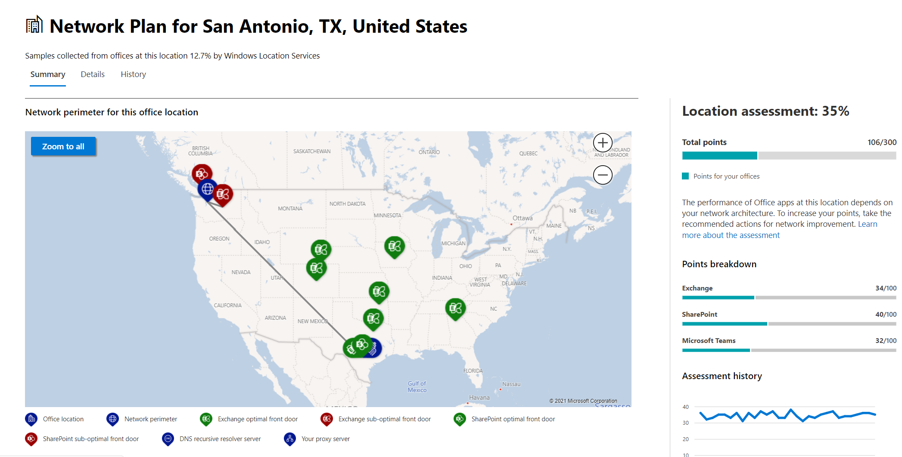

# Netwerkconnectiviteit in het Microsoft 365-beheercentrum (preview)Network connectivity in the Microsoft 365 Admin Center (preview)

Het Microsoft 365-beheercentrum bevat nu statistieken voor geaggregeerde netwerkconnectiviteit die zijn verzameld van uw Microsoft 365-tenant en is alleen beschikbaar voor beheerders in uw tenant.The Microsoft 365 Admin Center now includes aggregated network connectivity metrics collected from your Microsoft 365 tenant and available to view only by administrative users in your tenant.

> [!div class="mx-imgBorder"]
> 

**Netwerkbeoordelingen** en **netwerkinzichten** worden weergegeven in het Microsoft 365-beheercentrum **onder | Connectiviteit.****Network assessments** and **network insights** are displayed in the Microsoft 365 Admin Center under **Health | Connectivity**.

> [!div class="mx-imgBorder"]
> 

>[!NOTE]
>Het testhulpmiddel voor netwerkconnectiviteit ondersteunt tenants in WW Commercial en Germany, maar niet GCC Moderate, GCC High, DoD of China.The network connectivity test tool supports tenants in WW Commercial and Germany but not GCC Moderate, GCC High, DoD or China.

Wanneer u voor het eerst naar de pagina met netwerkprestaties navigeert, ziet u een overzichtsvenster met een overzicht van de globale netwerkprestaties, een netwerkbeoordelingsbereik voor de volledige tenant en een lijst met huidige problemen.When you first navigate to the network performance page, you will see an overview pane containing a map of global network performance, a network assessment scoped to the entire tenant, and a list of current issues. Vanuit het overzicht kunt u inzoomen om specifieke metrische netwerkprestaties en problemen per locatie weer te geven.From the overview, you can drill down to view specific network performance metrics and issues by location. Zie netwerkprestatiesoverzicht in het [Microsoft 365-beheercentrum voor meer informatie.](#network-connectivity-overview-in-the-microsoft-365-admin-center)For more information, see [Network performance overview in the Microsoft 365 Admin Center](#network-connectivity-overview-in-the-microsoft-365-admin-center).

U wordt mogelijk gevraagd namens uw organisatie deel te nemen aan de openbare preview-versie van deze functie.You may be asked to join the public preview for this feature on behalf of your organization. Acceptatie is meestal direct gebeurd, waarna u de pagina voor netwerkconnectiviteit ziet.Acceptance usually happened immediately and then you will see the network connectivity page. 

Wanneer u naar de pagina voor netwerkconnectiviteit navigeert, ziet u een overzichtsvenster met een overzicht van de globale netwerkprestaties, een netwerkbeoordeling die is beperkt tot de volledige tenant en een lijst met huidige problemen.On navigating to the network connectivity page, you will see an overview pane containing a map of global network performance, a network assessment scoped to the entire tenant, and a list of current issues. Als u deze pagina wilt openen, moet u een beheerder zijn van de organisatie binnen Microsoft 365.To access this page you must be an administrator for the organization within Microsoft 365. De beheerdersrol Rapportlezer heeft leestoegang tot deze gegevens.The Report Reader administrative role will have read access to this information. Als u locaties en andere elementen van de netwerkverbinding wilt configureren, moet een beheerder deel uitmaken van een serverbeheerder, zoals de rol van serviceondersteuningsbeheerder.To configure locations and other elements of network connectivity an administrator must be part of a server administrator role such as the Service support admin role. Vanuit het overzicht kunt u inzoomen om specifieke metrische netwerkprestaties en problemen per locatie weer te geven.From the overview, you can drill down to view specific network performance metrics and issues by location. Zie netwerkconnectiviteitsoverzicht [in het Microsoft 365-beheercentrum voor meer informatie.](#network-connectivity-overview-in-the-microsoft-365-admin-center)For more information, see [Network connectivity overview in the Microsoft 365 Admin Center](#network-connectivity-overview-in-the-microsoft-365-admin-center).

## Vereisten voor het maken van netwerkconnectiviteitsbeoordelingenPre-requisites for network connectivity assessments to appear

Als u wilt beginnen, schakelt u de opt-in-instelling voor uw locatie in om automatisch gegevens te verzamelen van apparaten met Behulp van Windows Location Services, gaat u naar de lijst locaties om locatiegegevens toe te voegen of te uploaden, of voer de test van de Microsoft 365-netwerkconnectiviteit uit vanaf uw kantoorlocaties.To get started, turn on your location opt-in setting to automatically collect data from devices using Windows Location Services, go to your Locations list to add or upload location data, or run the Microsoft 365 network connectivity test from your office locations. Hoewel netwerkconnectiviteit in de hele organisatie kan worden geëvalueerd, moet elk verbeteringen in het netwerkontwerp worden uitgevoerd voor specifieke kantoorlocaties.Whilst network connectivity can be evaluated across the organization, any network design improvements will need to be done for specific office locations. U vindt informatie over de netwerkverbinding voor elke kantoorlocatie zodra deze locaties zijn vastgesteld.Network connectivity information is provided for each office location once those locations can be determined. Er zijn drie opties voor het verkrijgen van netwerkbeoordelingen vanaf uw kantoorlocaties:There are three options for getting network assessments from your office locations:

### 1. Windows Locatieservices inschakelen1. Enable Windows Location Services

Voor deze optie moet er ten minste twee computers worden uitgevoerd op elke kantoorlocatie die de vereisten ondersteunen.For this option, you must have at least two computers running at each office location that support the pre-requisites. OneDrive voor Windows-versie moet zijn bijgewerkt en op elke computer zijn geïnstalleerd.OneDrive for Windows version must be up-to-date and installed on each computer. Zie de opmerkingen bij de release van OneDrive voor meer informatie over [OneDrive-versies.](https://support.office.com/article/onedrive-release-notes-845dcf18-f921-435e-bf28-4e24b95e5fc0)For more information on OneDrive versions, see the [OneDrive release notes](https://support.office.com/article/onedrive-release-notes-845dcf18-f921-435e-bf28-4e24b95e5fc0). Netwerkmaateenheden worden in de nabije toekomst toegevoegd aan andere Office 365-clienttoepassingen.Network measurements are planned to be added in other Office 365 client applications in the near future.

De Windows-locatieservice moet worden toestemming gegeven op de computers.Windows Location Service must be consented on the machines. U kunt dit testen door de app Kaarten uit **te** proberen en de locatie van de app te vinden.You can test this by running the **Maps** app and locating yourself. De functie kan worden ingeschakeld op één computer met **instellingen | Privacyverklaring | De** locatie waar de instelling _Apps toegang geven tot uw locatie_ moet zijn ingeschakeld.It can be enabled on a single machine with **Settings | Privacy | Location** where the setting _Allow apps to access your location_ must be enabled. Toestemming voor Windows-locatieservices kan worden geïmplementeerd op pc's met behulp van MDM- of groepsbeleid met de instelling _LetAppsAccessLocation._Windows Location Services consent can be deployed to PCs using MDM or Group Policy with the setting _LetAppsAccessLocation_.

U hoeft met deze methode geen locaties toe te voegen in het beheercentrum, omdat deze automatisch worden geïdentificeerd in de oplossing van de plaats.You do not need to add locations in the Admin Center with this method as they are automatically identified at the city resolution. U kunt niet meerdere kantoorlocaties binnen een stad tonen met behulp van Windows Locatieservices.You cannot show multiple office locations within a city using Windows Location Services. Locatiegegevens worden ook afgerond op de dichtstbijzijnde 300 meter bij 300 meter voordat deze worden geüpload, zodat er geen nauwkeurige locatiegegevens beschikbaar zijn.Location information is also rounded to the nearest 300 meters by 300 meters before being uploaded so that more precise location information is not possible to access.

De computers moeten over een Wi-Fi netwerk in plaats van een Ethernet-kabel.The machines should have Wi-Fi networking rather than an ethernet cable. Computers met een Ethernet-kabel hebben geen nauwkeurige locatiegegevens.Machines with an ethernet cable do not have accurate location information.

24 uur nadat aan deze vereisten is voldaan, worden maatvoorbeelden en kantoorlocaties weergegeven.Measurement samples and office locations should start to appear 24 hours after these pre-requisites have been met.

### 2. Locaties toevoegen en LAN-subnetinformatie verstrekken2. Add locations and provide LAN subnet information

Voor deze optie zijn Windows Location Services en Wi-Fi niet vereist.For this option, neither Windows Location Services nor Wi-Fi are required. Uw versie van OneDrive voor Windows moet zijn bijgewerkt en op elke computer op de locatie zijn geïnstalleerd.Your OneDrive for Windows version must be up-to-date and installed on each computer at the location.

U moet ook locaties toevoegen op de netwerkconnectiviteitspagina van het beheercentrum of deze importeren uit een CSV-bestand.You also need to add locations in the Admin Center network connectivity page or to import those from a CSV file. De toegevoegde locaties moeten de informatie van uw office LAN-subnet bevatten.The locations added must include your office LAN subnet information.

Aangezien u de locaties toevoegt, kunt u meerdere kantoren binnen een stad hebben gedefinieerd.Since you are adding the locations, you can have multiple offices defined within a city.

Alle testmetingen van clientapparaten bevatten de LAN-subnetgegevens, die is gerelateerd aan de kantoorlocatiedetails die u hebt ingevoerd.All test measurements from client machines include the LAN subnet information, which is correlated with the office location details that you have entered. 24 uur nadat aan deze vereisten is voldaan, worden maatvoorbeelden en kantoorlocaties weergegeven.Measurement samples and office locations should start to appear 24 hours after these pre-requisites have been met.

### 3. Testrapporten handmatig verzamelen met het testhulpmiddel voor Microsoft 365-netwerkconnectiviteit3. Manually gather test reports with the Microsoft 365 network connectivity test tool

Voor deze optie moet u een persoon op elke locatie identificeren.For this option, you need to identify a person at each location. Vraag hem of haar om te bladeren naar de netwerkconnectiviteitstest van [Microsoft 365](https://connectivity.office.com) op een Windows-computer waarvoor ze beheerdersmachtigingen hebben.Ask them to browse to [Microsoft 365 network connectivity test](https://connectivity.office.com) on a Windows machine on which they have administrative permissions. Op de website moeten ze zich aanmelden bij hun Office 365-account voor dezelfde organisatie die u de resultaten wilt laten zien.On the web site, they need to sign-in to their Office 365 account for the same organization that you want to see the results. Vervolgens moeten ze op **Test uitvoeren klikken.**Then they should click **Run test**. Tijdens de test is er een gedownloade connectiviteitstest EXE.During the test there is a downloaded Connectivity test EXE. Ze moeten die ook openen en uitvoeren.They need to open and execute that also. Nadat de tests zijn voltooid, wordt het testresultaat geüpload naar Office 365.Once the tests are completed, the test result is uploaded to Office 365.

Testrapporten zijn gekoppeld aan een locatie als deze is toegevoegd met LAN-subnetgegevens, anders worden ze alleen weergegeven op de locatie van de stad.Test reports are linked to a location if it was added with LAN subnet information, otherwise they are shown at the city location only.

Maatvoorbeelden en kantoorlocaties worden 2-3 minuten na het maken van een testrapport weergegeven.Measurement samples and office locations should start to appear 2-3 minutes after a test report is completed. Zie de Test voor [Microsoft 365-netwerkconnectiviteit (preview) voor meer informatie.](office-365-network-mac-perf-onboarding-tool.md)For more information, see [Microsoft 365 network connectivity test (preview)](office-365-network-mac-perf-onboarding-tool.md).

## Hoe gebruik ik deze gegevens?How do I use this information?

**Netwerkinzichten,** gerelateerde prestatieaanbevelingen en netwerkbeoordelingen zijn bedoeld om te helpen bij het ontwerpen van netwerkperimeters voor uw kantoorlocaties.**Network insights**, their related performance recommendations and network assessments are intended to help in designing network perimeters for your office locations. Elk inzicht biedt informatie over de prestatiekenmerken voor een specifiek algemeen probleem voor elke geografische locatie waar gebruikers toegang hebben tot uw tenant.Each insight provides details about the performance characteristics for a specific common issue for each geographic location where users are accessing your tenant. **Prestatieaanbevelingen voor** elk netwerkinzicht bieden specifieke wijzigingen in de netwerkarchitectuur die u kunt aanbrengen om de gebruikerservaring met betrekking tot Microsoft 365-netwerkconnectiviteit te verbeteren.**Performance recommendations** for each network insight offer specific network architecture design changes you can make to improve user experience related to Microsoft 365 network connectivity. De netwerkevaluatie toont de invloed van netwerkconnectiviteit op de gebruikerservaring, zodat verschillende netwerkverbindingen voor gebruikerslocatie kunnen worden vergeleken.The network assessment shows how network connectivity impacts user experience, allowing for comparison of different user location network connections.

**Netwerkbeoordelingen** verbeteren een aggregatie van vele metrische netwerkprestaties tot een momentopname van de status van uw bedrijfsnetwerk, voorgesteld door een puntenwaarde van 0 - 100.**Network assessments** distill an aggregate of many network performance metrics into a snapshot of your enterprise network health, represented by a points value from 0 - 100. Netwerkbeoordelingen zijn beperkt tot zowel de volledige tenant als voor elke geografische locatie waar gebruikers verbinding met uw tenant maken, zodat Microsoft 365-beheerders gemakkelijk een gestalt van de netwerktoestand van het bedrijf direct kunnen begrijpen en snel kunnen inzoomen op een gedetailleerd rapport voor een globale kantoorlocatie.Network assessments are scoped to both the entire tenant and for each geographic location from which users connect to your tenant, providing Microsoft 365 administrators with an easy way to instantly grasp a gestalt of the enterprise's network health and quickly drill down into a detailed report for any global office location.

Complexe ondernemingen met meerdere kantoorlocaties en niet-onbelangrijke netwerkperimeterarchitectuur kunnen van deze informatie profiteren tijdens de eerste onboarding naar Microsoft 365 of om problemen met de netwerkprestaties te verhelpen die tijdens de toename van het gebruik zijn aangetroffen.Complex enterprises with multiple office locations and non-trivial network perimeter architectures can benefit from this information either during their initial onboarding to Microsoft 365 or to remediate network performance issues discovered with usage growth. Dit is meestal niet nodig voor kleine bedrijven die Microsoft 365 gebruiken, of ondernemingen die al eenvoudige en directe netwerkconnectiviteit hebben.This is usually not necessary for small businesses using Microsoft 365, or any enterprises who already have simple and direct network connectivity. Ondernemingen met meer dan 500 gebruikers en meerdere kantoorlocaties profiteren naar verwachting het meest.Enterprises with over 500 users and multiple office locations are expected to benefit the most.

>[!IMPORTANT]
>Netwerkinzichten, prestatieaanbevelingen en beoordelingen in het Microsoft 365-beheercentrum hebben momenteel de preview-status en zijn alleen beschikbaar voor Microsoft 365-tenants die zijn ingeschreven voor het feature preview-programma.Network insights, performance recommendations and assessments in the Microsoft 365 Admin Center is currently in preview status, and is only available for Microsoft 365 tenants that have been enrolled in the feature preview program.

## Uitdagingen met bedrijfsnetwerkconnectiviteitEnterprise network connectivity challenges

> [!div class="mx-imgBorder"]
> 

Veel ondernemingen hebben netwerkperimeterconfiguraties die in de tijd zijn uitgebreid en hoofdzakelijk ontworpen zijn voor toegang tot internetsites van werknemers, waar de meeste websites van tevoren niet bekend zijn en niet worden vertrouwd.Many enterprises have network perimeter configurations which have grown over time and are primarily designed to accommodate employee Internet web site access where most web sites are not known in advance and are untrusted. De doorslaggevende en noodzakelijke focus is het vermijden van malware- en visaanvallen van deze onbekende websites.The prevailing and necessary focus is avoiding malware and fishing attacks from these unknown web sites. Deze netwerkconfiguratiestrategie, die nuttig is voor beveiligingsdoeleinden, kan leiden tot een degradatie van de gebruikersprestaties en gebruikerservaring in Microsoft 365.This network configuration strategy, while helpful for security purposes, can lead to degradation of Microsoft 365 user performance and user experience.

## Hoe kunnen we deze uitdagingen oplossen?How we can solve these challenges

Ondernemingen kunnen de algemene gebruikerservaring verbeteren en hun omgeving beveiligen door de [Office 365-connectiviteitsprincipes](https://aka.ms/pnc) te volgen en de netwerkconnectiviteitsfunctie van het Microsoft 365-beheercentrum te gebruiken.Enterprises can improve general user experience and secure their environment by following [Office 365 connectivity principles](https://aka.ms/pnc) and by using the Microsoft 365 Admin Center network connectivity feature. In de meeste gevallen zullen het volgen van deze algemene principes een aanzienlijke positieve invloed hebben op de latentie van eindgebruikers, servicebetrouwbaarheid en algehele prestaties van Microsoft 365.In most cases, following these general principles will have a significant positive impact on end user latency, service reliability and overall performance of Microsoft 365.

Microsoft wordt soms gevraagd om netwerkprestatieproblemen met Microsoft 365 voor grote ondernemingen te onderzoeken en deze hebben vaak een hoofdoorzaak met betrekking tot de netwerkperimeterinfrastructuur van de klanten.Microsoft is sometimes asked to investigate network performance issues with Microsoft 365 for large enterprise customers, and these frequently have a root cause related to the customers network perimeter infrastructure. Wanneer een veelvoorkomende oorzaak van een probleem met de perimeter van het klantnetwerk wordt gevonden, wordt ernaar op zoek gegaan naar eenvoudige testmetingen die het probleem identificeren.When a common root cause of a customer network perimeter issue is found we seek to identify simple test measurements that identifies it. Een test met een maateenheidsdrempel die een specifiek probleem identificeert, is waardevol omdat we dezelfde meting op elke locatie kunnen testen, kunnen zien of deze hoofdoorzaak zich daar bevindt en deze delen als netwerkinzicht met de beheerder.A test with a measurement threshold that identifies a specific problem is valuable because we can test the same measurement at any location, tell whether this root cause is present there and share it as a network insight with the administrator.

Sommige netwerkinzichten geven alleen aan dat een probleem nader moet worden onderzocht.Some network insights will merely indicate a problem that needs further investigation. Een netwerkinzicht waarin er voldoende tests zijn om een specifieke herstelactie weer te geven om de hoofdoorzaak te corrigeren, wordt weergegeven als **een aanbevolen actie.**A network insight where we have enough tests to show a specific remediation action to correct the root cause is listed as a **recommended action**. Deze aanbevelingen, die zijn gebaseerd op live-statistieken die waarden onthullen die buiten een vooraf bepaalde drempel vallen, zijn veel waardevoller dan het advies in de algemene aanbevolen praktijk, omdat ze specifiek zijn voor uw omgeving en de werkelijke verbetering zullen zien zodra de aanbevolen wijzigingen zijn aangebracht.These recommendations, based on live metrics that reveal values that fall outside a predetermined threshold, are much more valuable than general best practice advice since they are specific to your environment and will show the actual improvement once the recommended changes have been made.

## Overzicht van netwerkconnectiviteit in het Microsoft 365-beheercentrumNetwork connectivity overview in the Microsoft 365 Admin Center

Microsoft beschikt over bestaande netwerkmaats van verschillende Office-desktop- en webcl clients die ondersteuning bieden voor de werking van Microsoft 365.Microsoft has existing network measurements from several Office desktop and web clients which support the operation of Microsoft 365. Deze metingen worden nu gebruikt om ontwerpinzichten voor de netwerkarchitectuur  en een netwerkbeoordeling te bieden die worden weergegeven op de netwerkconnectiviteitspagina in het Microsoft 365-beheercentrum.These measurements are now being used to provide network architecture design insights and a network assessment which are shown in the **Network connectivity** page in the Microsoft 365 Admin Center.

Standaard wordt bij benadering de locatiegegevens die zijn gekoppeld aan de netwerkmaat, de plaats waar clientapparaten zich bevinden, weergegeven.By default, approximate location information associated with the network measurements identify the city where client devices are located. De netwerkbeoordeling op elke locatie wordt weergegeven met kleur en het relatieve aantal gebruikers op elke locatie wordt aangegeven door de grootte van de cirkel.The network assessment at each location is shown with color and the relative number of users at each location is represented by the size of the circle.

> [!div class="mx-imgBorder"]
> 

Op de overzichtspagina ziet u ook de netwerkbeoordeling voor de klant als een gewogen gemiddelde voor alle kantoorlocaties.The overview page also shows the network assessment for the customer as a weighted average across all office locations.

> [!div class="mx-imgBorder"]
> 

U kunt een tabelweergave bekijken van de locaties waarop ze kunnen worden gefilterd, gesorteerd en bewerkt op het tabblad Locaties. Locaties met specifieke aanbevelingen kunnen ook een geschatte potentiële latentieverbetering omvatten.You can view a table view of the locations where they can be filtered, sorted, and edited in the locations tab. Locations with specific recommendations may also include an estimated potential latency improvement. Dit wordt berekend door de mediaanlatentie van de gebruikers van uw organisatie op de locatie te nemen en de mediaanlatentie af te trekken voor alle organisaties in dezelfde plaats.This is calculated by taking the median latency of your organization users at the location and subtracting the median latency for all organizations in the same city.

> [!div class="mx-imgBorder"]
> 

## Specifieke netwerkprestatiesamenvatting en inzichten op kantoorlocatieSpecific office location network performance summary and insights

Wanneer u een kantoorlocatie selecteert, wordt er een locatiespecifieke overzichtspagina geopend met details van het netwerkuiterf dat is vastgesteld aan de de basis van meetgegevens voor die kantoorlocatie.Selecting an office location opens a location-specific summary page showing details of the network egress that has been identified from measurements for that office location.

> [!div class="mx-imgBorder"]
> 

Een kaart van het perimeternetwerk voor de gebruikers van uw organisatie op de locatie wordt weergegeven met sommige of alle van deze elementen:A map of the perimeter network for your organization users at the location is shown with some or all of these elements:

- **Office-locatie** : de kantoorlocatie van de pagina die u ziet**Office location** - The office location for the page you are looking at
- **Netwerkperimeter:** de locatie van het bron-IP-adres voor verbindingen vanaf de kantoorlocatie.**Network perimeter** - The location of the source IP Address for connections from the office location. Dit hangt af van de nauwkeurigheid van geo-IP-locatiedatabasesThis depends on the accuracy of geo-IP location databases
- **Exchange optimale serviceaan voorzijde** - een van de aanbevolen Exchange-serviceverleningsdeuren die gebruikers op deze kantoorlocatie moeten verbinden**Exchange optimal service front door** - One of the recommended Exchange service front doors that users in this office location should connect to
- **Exchange-sub-optimale front door** - Een Exchange-service front door die gebruikers zijn verbonden, maar wordt niet aanbevolen**Exchange sub-optimal front door** - An Exchange service front door that users are connected to, but is not recommended
- **SharePoint optimal service front door** - Een van de aanbevolen SharePoint-service fronts doors waar gebruikers op deze kantoorlocatie verbinding mee moeten maken**SharePoint optimal service front door** - One of the recommended SharePoint service front doors that users in this office location should connect to
- **SharePoint sub-optimal service front door** - A SharePoint service front door that users are connected to, but is not recommended**SharePoint sub-optimal service front door** - A SharePoint service front door that users are connected to, but is not recommended
- **Recursieve DNS-resolverserver:** de locatie van een geografische IP-database van de gedetecteerde DNS recursieve resolver die wordt gebruikt voor Exchange Online (indien beschikbaar)**DNS recursive resolver server** - The location from a geo IP database of the detected DNS recursive resolver used for Exchange Online (if available)
- **Uw proxyserver:** de locatie van een geografische IP-database van de gedetecteerde proxyserver (indien beschikbaar)**Your proxy server** - The location from a geo IP database of the detected proxy server (if available) 

Op de overzichtspagina van de kantoorlocatie ziet u bovendien de netwerkbeoordeling, de netwerkbeoordelingsgeschiedenis, een vergelijking van de beoordeling van deze locatie met andere klanten in dezelfde plaats en een lijst met specifieke inzichten en aanbevelingen die u kunt uitvoeren om de netwerkprestaties en betrouwbaarheid te verbeteren.The office location summary page additionally shows the location's network assessment, network assessment history, a comparison of this location's assessment to other customers in the same city, and a list of specific insights and recommendations that you can undertake to improve network performance and reliability.

Vergelijkingen tussen klanten in dezelfde plaats zijn gebaseerd op de verwachting dat alle klanten gelijke toegang hebben tot netwerkserviceproviders, telecommunicatie-infrastructuur en aanwezigheidspunten van het Microsoft-netwerk in de buurt.Comparisons between customers in the same city are based on the expectation that all customers have equal access to network service providers, telecommunications infrastructure, and nearby Microsoft network points of presence.

Op het detailtabblad op de pagina met kantoorlocatie ziet u de specifieke meetresultaten die zijn gebruikt voor inzichten, aanbevelingen en de netwerkevaluatie.The details tab on the office location page shows the specific measurement results that were used to come up with any insights, recommendations, and the network assessment. Deze voorwaarde is beschikbaar zodat netwerkingenieurs de aanbevelingen kunnen valideren en de factor voor beperkingen of specifieke beperkingen in hun omgeving kunnen valideren.This is provided so that network engineers can validate the recommendations and factor in any constraints or specifics in their environment.

> [!div class="mx-imgBorder"]
> 

## CSV-import voor LAN-subnet office-locatiesCSV Import for LAN subnet office locations

Voor identificatie van een LAN-subnetkantoor moet u van tevoren elke locatie toevoegen.For LAN subnet office identification, you need to add each location in advance. In plaats van afzonderlijke kantoorlocaties toe te voegen op **het tabblad** Locaties, kunt u ze importeren uit een CSV-bestand.Instead of adding individual office locations in the **Locations** tab you can import them from a CSV file. U kunt deze gegevens mogelijk verkrijgen op andere plaatsen waar u deze hebt opgeslagen, zoals het dashboard Oproepkwaliteit of Active Directory-sites en -servicesYou may be able to obtain this data from other places you have stored it such as the Call Quality Dashboard or Active Directory Sites and Services

In het CSV-bestand wordt een gevonden locatie als leeg in de kolom userEntered en een handmatig toegevoegde kantoorlocatie als 1.In the CSV file a discovered city location shows in the userEntered column as blank, and a manually added office location shows as 1.

1. Klik in het _hoofdvenster Connectiviteit met Microsoft 365_ op het **tabblad** Locaties.In the main _Connectivity to Microsoft 365_ window, click the **Locations** tab.

1. Klik op **de knop** Importeren net boven de lijst met locaties.Click the **Import** button just above the locations list. De **flyout Office-locaties** importeren wordt weergegeven.The **Import office locations** flyout will appear.

   > [!div class="mx-imgBorder"]
   > 

1. Klik op **de koppeling Huidige office-locaties downloaden (.csv)** om de lijst met huidige locaties te exporteren naar een CSV-bestand en deze op uw lokale harde schijf op te slaan.Click the **Download current office locations (.csv)** link to export the current locations list to a CSV file, and save it to your local hard disk. Hierdoor krijgt u een correct opgemaakt CSV-bestand met kolomkoppen waaraan u locaties kunt toevoegen.This will provide you with a correctly formatted CSV with column headings to which you can add locations. U kunt de bestaande geëxporteerde locaties zo laten; ze worden niet gedupliceerd wanneer u het bijgewerkte CSV-bestand importeert.You can leave the existing exported locations as they are; they will not be duplicated when you import the updated CSV. Als u het adres van een bestaande locatie wilt wijzigen, wordt dit bijgewerkt wanneer u de CSV-bestandsgegevens importeert.If you wish to change the address of an existing location, it will be updated when you import the CSV. U kunt het adres van een gevonden plaats niet wijzigen.You cannot change the address of a discovered city.

1. Open het CSV-bestand en voeg uw locaties toe door de volgende velden in te vullen op een nieuwe regel voor elke locatie die u wilt toevoegen.Open the CSV and add your locations by filling out the following fields on a new line for each location you want to add. Alle andere velden leeg laten; waarden die u in andere velden opteert, worden genegeerd.Leave all other fields blank; values you enter in other fields will be ignored.

   1. **userEntered** (vereist): Moet 1 zijn voor een nieuwe LAN Subnet-kantoorlocatie**userEntered** (required): Must be 1 for a new LAN Subnet office location
   1. **Adres** (vereist): Het fysieke adres van het kantoor**Address** (required): The physical address of the office
   1. **Breedtegraad** (optioneel): Ingevuld vanuit Bing Kaarten- zoekactie naar het adres indien leeg**Latitude** (optional): Populated from Bing maps lookup of the address if blank
   1. **Lengtegraad (optioneel):** Ingevuld vanuit Bing Kaarten- zoekactie naar het adres als dit leeg is**Longitude** (optional): Populated from Bing maps lookup of the address if blank
   1. **Uitgangs-IP-adresbereiken 1-5** (optioneel): Voer voor elk bereik de circuitnaam in, gevolgd door een spatielijst met geldige IPv4- of IPv6 CIDR-adressen.**Egress IP Address ranges 1-5** (optional): For each range, enter the circuit name followed by a space separated list of valid IPv4 or IPv6 CIDR addresses. Deze waarden worden gebruikt om verschillende kantoorlocaties te onderscheiden waar u dezelfde LAN-subnet-IP-adressen gebruikt.These values are used to differentiate multiple office locations where you use the same LAN subnet IP Addresses. Uitgangs-IP-adresbereiken moeten allemaal /24 netwerkgrootte hebben en de /24 wordt niet in de invoer opgenomen.Egress IP Address ranges all must be /24 network size and the /24 is not included in the input.
   1. **LanIps** (vereist): Vermeld de LAN-subnetbereiken die op deze kantoorlocatie worden gebruikt.**LanIps** (required): List the LAN subnet ranges in use at this office location. Lan-subnet-ID's moeten een CIDR-netwerkgrootte hebben, waarbij de netwerkgrootte tussen /8 en /29 kan zijn.LAN subnet IDs need to have a CIDR network size included where the network size can be between /8 and /29. Meerdere LAN-subnetbereiken kunnen worden gescheiden door een komma of een puntkomma.Multiple LAN subnet ranges can be separated by a comma or a semicolon.
   
1. Wanneer u uw kantoorlocaties hebt toegevoegd en  het bestand  hebt opgeslagen, klikt u op de knop Bladeren naast het veld Voltooid uploaden en selecteert u het opgeslagen CSV-bestand.When you have added your office locations and saved the file, click the **Browse** button next to the **Upload the completed** field and select the saved CSV file.

1. Het bestand wordt automatisch gevalideerd.The file will be automatically validated. Als er validatiefouten zijn, ziet u het foutbericht _Er zijn enkele fouten in het importbestand. Controleer de fouten, corrigeer het importbestand en probeer het opnieuw._If there are validation errors, you will see the error message _There are some errors in the import file. Review the errors, correct the import file, and then try again._ Klik op de **koppeling Details van fout openen** voor een lijst met specifieke veldvalidatiefouten.Click the link **Open error details** for a list of specific field validation errors.

   > [!div class="mx-imgBorder"]
   > 

1. Als het bestand geen fouten bevat, ziet u het bericht _Dat het rapport gereed is. X-locaties gevonden om toe te voegen en x-locaties die moeten worden bijgewerkt._If there are no errors in the file, you will see the message _The report is ready. Found x locations to add and x locations to update._ Klik op **de knop** Importeren om het CSV-bestand te uploaden.Click the **Import** button to upload the CSV.

   > [!div class="mx-imgBorder"]
   > 

## Veelgestelde vragenFAQ

### Wat is een microsoft 365-service voor de deur?What is a Microsoft 365 service front door?

De voorzijde van de Microsoft 365-service is een invoerpunt op het wereldwijde netwerk van Microsoft, waar office-clients en -services de netwerkverbinding beëindigen.The Microsoft 365 service front door is an entry point on Microsoft's global network where Office clients and services terminate their network connection. Voor een optimale netwerkverbinding met Microsoft 365 wordt u aangeraden uw netwerkverbinding te beëindigen naar de dichtstbijzijnde Microsoft 365-front door.For an optimal network connection to Microsoft 365, it is recommended that your network connection is terminated into the closest Microsoft 365 front door.

>[!NOTE]
>De microsoft 365-serviceaan voorzijde heeft geen rechtstreekse relatie met het Azure Front Door Service-product dat beschikbaar is in de Azure Marketplace.Microsoft 365 service front door has no direct relationship to the Azure Front Door Service product available in the Azure marketplace.

### Wat is een optimale service voor Microsoft 365?What is an optimal Microsoft 365 service front door?

Een optimale service voor Microsoft 365 is er een die zich het dichtst bij het netwerkverkeer, meestal in uw stad of metrogebied, het dichtst bij uw netwerk ligt.An optimal Microsoft 365 service front door is one that is closest to your network egress, generally in your city or metro area. Gebruik het [hulpprogramma voor Microsoft 365-connectiviteitstest (preview)](office-365-network-mac-perf-onboarding-tool.md) om de locatie te bepalen van uw in-use Microsoft 365-service front door en optimale service front door.Use the [Microsoft 365 connectivity test tool (preview)](office-365-network-mac-perf-onboarding-tool.md) to determine location of your in-use Microsoft 365 service front door and optimal service front door. Als het hulpmiddel bepaalt dat de front door in gebruik optimaal is, maakt u optimaal verbinding met het wereldwijde netwerk van Microsoft.If the tool determines your in-use front door is optimal, then you are optimally connecting into Microsoft's global network.

### Wat is een internetingressielocatie?What is an internet egress location?

De internetuitgangslocatie is de locatie waar uw netwerkverkeer uw bedrijfsnetwerk verlaat en verbinding maakt met internet.The internet egress location is the location where your network traffic exits your enterprise network and connects to the Internet. Dit wordt ook geïdentificeerd als de locatie waar u een NAT-apparaat (Network Address Translation) hebt en meestal waar u verbinding maakt met een internetprovider.This is also identified as the location where you have a Network Address Translation (NAT) device and usually where you connect with an Internet Service Provider (ISP). Als u een lange afstand ziet tussen uw locatie en uw internetuitlijningslocatie, kan dit duiden op een belangrijke WAN-backhaul.If you see a long distance between your location and your internet egress location, then this may indicate a significant WAN backhaul.

## Verwante onderwerpenRelated topics

[Microsoft 365 network insights (preview)Microsoft 365 network insights (preview)](office-365-network-mac-perf-insights.md)

[Evaluatie van het Microsoft 365-netwerk (preview)Microsoft 365 network assessment (preview)](office-365-network-mac-perf-score.md)

[Microsoft 365-connectiviteitstestprogramma (preview)Microsoft 365 connectivity test tool (preview)](office-365-network-mac-perf-onboarding-tool.md)

[Microsoft 365 Network Connectivity Location Services (preview)Microsoft 365 Network Connectivity Location Services (preview)](office-365-network-mac-location-services.md)
