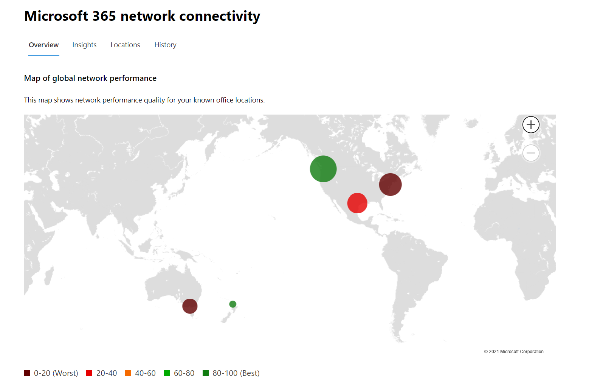

# Netwerkconnectiviteit in het Microsoft 365 beheercentrum

Het Microsoft 365-beheercentrum bevat nu statistische netwerkconnectiviteitsgegevens die zijn verzameld vanuit uw Microsoft 365 tenant en die alleen kunnen worden bekeken door beheerders in uw tenant.

> [!div class="mx-imgBorder"]
> 

**Netwerkbeoordelingen** en **netwerkinzichten** worden weergegeven in het Microsoft 365 beheercentrum onder **| Netwerkconnectiviteit.**

> [!div class="mx-imgBorder"]
> 

>[!NOTE]
>Netwerkconnectiviteit in het beheercentrum ondersteunt tenants in WW Commercial en Duitsland, maar niet GCC Moderate, GCC High, DoD of China.

Wanneer u voor het eerst naar de netwerkprestatiepagina navigeert, moet u uw locaties configureren om de kaart van de globale netwerkprestaties te bekijken, een netwerkbeoordelingsbereik voor de hele tenant, het percentage van uw gebruikers dat op afstand werkt versus op locatie, en een lijst met actuele problemen om actie te ondernemen en/of verder onderzoek te doen. In het overzichtsvenster kunt u inzoomen om specifieke meetwaarden voor netwerkprestaties en problemen per locatie weer te geven. Zie Netwerkprestatieoverzicht [in het Microsoft 365 beheercentrum voor meer informatie.](#network-connectivity-overview-in-the-microsoft-365-admin-center)

Mogelijk wordt u gevraagd namens uw organisatie deel te nemen aan de openbare preview voor deze functie. Acceptatie vindt meestal direct plaats, waarna u de pagina netwerkconnectiviteit ziet.

Als u toegang wilt tot de netwerkconnectiviteitspagina, moet u een beheerder voor de organisatie zijn binnen Microsoft 365. De beheerrol Rapportlezer heeft leestoegang tot deze informatie. Als u locaties en andere elementen van netwerkconnectiviteit wilt configureren, moet een beheerder deel uitmaken van een serverbeheerderrol, zoals de rol serviceondersteuningsbeheerder.

## Vereisten voor het verschijnen van netwerkconnectiviteitsbeoordelingen

Als u wilt beginnen, schakelt u de instelling voor de opt-in voor uw locatie in om automatisch gegevens te verzamelen van apparaten met behulp van Windows Locatieservices, naar de lijst Locaties te gaan om locatiegegevens toe te voegen of te uploaden of de Microsoft 365-netwerkconnectiviteitstest uit te voeren vanaf uw kantoorlocaties. Hoewel netwerkconnectiviteit in de hele organisatie kan worden geëvalueerd, moeten er verbeteringen in het netwerkontwerp worden aangebracht voor specifieke kantoorlocaties. Netwerkconnectiviteitsgegevens worden verstrekt voor elke kantoorlocatie zodra deze locaties kunnen worden bepaald. Er zijn drie opties voor het verkrijgen van netwerkbeoordelingen vanaf uw kantoorlocaties:

### 1. Locatieservices Windows inschakelen

Voor deze optie moet op elke kantoorlocatie ten minste twee computers worden uitgevoerd die de vereisten ondersteunen. OneDrive voor Windows versie moet up-to-date zijn en op elke computer zijn geïnstalleerd. Voor meer informatie over OneDrive versies, zie [de OneDrive releasenotities.](https://support.office.com/article/onedrive-release-notes-845dcf18-f921-435e-bf28-4e24b95e5fc0) Netwerkmetingen worden in de nabije toekomst toegevoegd aan andere Office 365 clienttoepassingen.

Windows Locatieservice moet worden ingestemd met de machines. U kunt dit testen door de app Kaarten **uit** te Kaarten en uzelf te lokaliseren. Het kan worden ingeschakeld op één computer met **Instellingen | Privacy | Locatie** waar de instelling _Apps toegang verlenen tot uw locatie_ moet zijn ingeschakeld. Windows Toestemming voor locatieservices kan worden geïmplementeerd op pc's met MDM of Groepsbeleid met de instelling _LetAppsAccessLocation_.

U hoeft met deze methode geen locaties in het beheercentrum toe te voegen, omdat deze automatisch worden geïdentificeerd bij de oplossing van de plaats. Meerdere kantoorlocaties in dezelfde plaats worden niet weergegeven wanneer u Windows Locatieservices gebruikt. Locatiegegevens worden afgerond op de dichtstbijzijnde 300 meter bij 300 meter, zodat nauwkeurigere locatiegegevens niet worden gebruikt.

De machines moeten een Wi-Fi hebben in plaats van een ethernetkabel. Machines met een ethernetkabel hebben geen nauwkeurige locatiegegevens.

Maatvoorbeelden en kantoorlocaties worden 24 uur nadat aan deze vereisten is voldaan, weergegeven.

### 2. Locaties toevoegen en LAN-subnetgegevens verstrekken

Voor deze optie zijn geen Windows locatieservices of Wi-Fi vereist. Uw OneDrive voor Windows versie moet up-to-date zijn en op ten minste één computer op de locatie zijn geïnstalleerd.

U moet ook locaties toevoegen op de pagina Locaties **of** ze importeren uit een CSV-bestand. De locaties die zijn toegevoegd, moeten uw office LAN-subnetgegevens bevatten.

Met deze optie kunt u meerdere kantoren in een plaats laten definiëren.

Alle testmetingen van clientapparaten bevatten de LAN-subnetgegevens, die zijn gecorreleerd met de kantoorlocatiegegevens die u hebt ingevoerd. Maatvoorbeelden en kantoorlocaties worden 24 uur nadat aan deze vereisten is voldaan, weergegeven.

### 3. Testrapporten handmatig verzamelen met het Microsoft 365 testprogramma voor netwerkconnectiviteit

Voor deze optie moet u een persoon op elke locatie identificeren. Vraag ze te bladeren naar [Microsoft 365 netwerkconnectiviteitstest](https://connectivity.office.com) op een Windows waarop ze beheerdersmachtigingen hebben. Op de website moeten ze zich aanmelden bij hun Office 365 voor dezelfde organisatie die u de resultaten wilt zien. Klik vervolgens op **Test uitvoeren.** Tijdens de test is er een gedownloade Connectiviteitstest EXE. Ze moeten dat openen en uitvoeren. Wanneer de tests zijn voltooid, wordt het testresultaat geüpload naar het beheercentrum.

Testrapporten worden gekoppeld aan een locatie als deze is toegevoegd met LAN-subnetgegevens, anders worden ze alleen weergegeven op de locatie van de plaats.

Maatvoorbeelden en kantoorlocaties worden 2-3 minuten nadat een testrapport is voltooid, weergegeven. Zie de [netwerkconnectiviteitstest Microsoft 365 (preview) voor meer informatie.](office-365-network-mac-perf-onboarding-tool.md)

## Hoe gebruik ik deze gegevens?

**Netwerkinzichten,** bijbehorende prestatieaanbevelingen en netwerkbeoordelingen zijn bedoeld om te helpen bij het ontwerpen van netwerkperimeters voor uw kantoorlocaties. Elk inzicht bevat details over de prestatiekenmerken voor een specifiek veelvoorkomende netwerkprobleem voor elke geografische locatie waar gebruikers toegang hebben tot uw tenant. **Prestatieaanbevelingen voor** elk netwerkinzicht bieden specifieke wijzigingen in het ontwerp van de netwerkarchitectuur die u kunt aanbrengen om de gebruikerservaring met betrekking tot Microsoft 365 netwerkconnectiviteit te verbeteren. De netwerkbeoordeling laat zien hoe netwerkconnectiviteit van invloed is op de gebruikerservaring, zodat verschillende netwerkverbindingen van gebruikerslocatie kunnen worden vergeleken.

**Netwerkbeoordelingen** destilleren een aggregatie van veel meetwaarden voor netwerkprestaties in een momentopname van de netwerktoestand van uw bedrijf, vertegenwoordigd door een puntenwaarde van 0 tot 100. Netwerkbeoordelingen zijn zowel voor de gehele tenant als voor elke geografische locatie waaruit gebruikers verbinding maken met uw tenant, zodat Microsoft 365-beheerders een eenvoudige manier hebben om direct inzicht te krijgen in de netwerktoestand van de onderneming en snel in te zoomen op een gedetailleerd rapport voor een globale kantoorlocatie.

Complexe ondernemingen met meerdere kantoorlocaties en niet-onbelangrijke netwerkperimeterarchitectuur kunnen van deze informatie profiteren tijdens de eerste onboarding naar Microsoft 365 of om problemen met netwerkprestaties te verhelpen die zijn ontdekt met de groei van het gebruik. Dit is meestal niet nodig voor kleine bedrijven die Microsoft 365 of ondernemingen die al eenvoudige en directe netwerkconnectiviteit hebben. Ondernemingen met meer dan 500 gebruikers en meerdere kantoorlocaties zullen naar verwachting het meest profiteren.

>[!IMPORTANT]
>Netwerkinzichten, prestatieaanbevelingen en evaluaties in het Microsoft 365-beheercentrum hebben momenteel de preview-status en zijn alleen beschikbaar voor Microsoft 365-tenants die zijn geregistreerd voor het functievoorbeeldprogramma.

## Uitdagingen op het gebied van netwerkconnectiviteit voor ondernemingen

> [!div class="mx-imgBorder"]
> 

Veel ondernemingen hebben netwerkperimeterconfiguraties die in de afgelopen tijd zijn uitgebreid en die voornamelijk zijn ontworpen voor toegang tot internetsites van werknemers, waar de meeste websites niet van tevoren bekend zijn en niet worden vertrouwd. De overheersende en noodzakelijke focus is het voorkomen van malware- en phishingaanvallen van deze onbekende websites. Deze netwerkconfiguratiestrategie kan, hoewel nuttig voor beveiligingsdoeleinden, leiden tot een verslechtering van Microsoft 365 gebruikersprestaties en gebruikerservaring.

## Hoe we deze uitdagingen kunnen oplossen

Ondernemingen kunnen de algemene gebruikerservaring verbeteren en hun omgeving beveiligen door de Office 365 [te](./microsoft-365-network-connectivity-principles.md) volgen en de netwerkconnectiviteitsfunctie Microsoft 365 beheercentrum te gebruiken. In de meeste gevallen heeft het volgen van deze algemene principes een aanzienlijk positief effect op de latentie van eindgebruikers, de betrouwbaarheid van de service en de algehele prestaties van Microsoft 365.

Microsoft wordt soms gevraagd om netwerkprestatieproblemen met Microsoft 365 voor grote zakelijke klanten te onderzoeken, en deze hebben vaak een hoofdoorzaak met betrekking tot de netwerkperimeterinfrastructuur van de klant. Wanneer een veelvoorkomende hoofdoorzaak van een probleem met de perimeter van een klantnetwerk wordt gevonden, proberen we eenvoudige testmetingen te identificeren die het probleem identificeren. Een test met een meetdrempel die een specifiek probleem identificeert, is waardevol omdat we dezelfde meting op elke locatie kunnen testen, kunnen zien of deze hoofdoorzaak daar aanwezig is en deze delen als een netwerkinzicht met de beheerder.

Sommige netwerkinzichten geven alleen een probleem aan dat nader onderzoek nodig heeft. Een netwerkinzicht waarin we voldoende tests hebben om een specifieke herstelactie weer te geven om de hoofdoorzaak te corrigeren, wordt weergegeven als een **aanbevolen actie.** Deze aanbevelingen, gebaseerd op live metrische gegevens die waarden onthullen die buiten een vooraf bepaalde drempel vallen, zijn veel waardevoller dan advies over algemene aanbevolen praktijken, omdat ze specifiek zijn voor uw omgeving en de werkelijke verbetering zullen zien wanneer de aanbevolen wijzigingen zijn aangebracht.

## Overzicht van netwerkconnectiviteit in het Microsoft 365 beheercentrum

Microsoft heeft bestaande netwerkmetingen van verschillende Office desktop- en webcl clients die de werking van Microsoft 365. Deze metingen worden nu gebruikt om inzicht te krijgen in het ontwerp  van de netwerkarchitectuur en een netwerkbeoordeling die worden weergegeven op de pagina Netwerkconnectiviteit in het Microsoft 365 beheercentrum.

Standaard wordt met geschatte locatiegegevens die zijn gekoppeld aan de netwerkmetingen, de plaats waar clientapparaten zich bevinden, weergegeven. De netwerkbeoordeling op elke locatie wordt weergegeven met kleur en het relatieve aantal gebruikers op elke locatie wordt aangegeven door de grootte van de cirkel.

> [!div class="mx-imgBorder"]
> 

Op de overzichtspagina ziet u ook de netwerkbeoordeling voor de klant als een gewogen gemiddelde voor alle kantoorlocaties.

> [!div class="mx-imgBorder"]
> 

U kunt een tabelweergave bekijken van de locaties waar ze kunnen worden gefilterd, gesorteerd en bewerkt op het **tabblad** Locaties. Locaties met specifieke aanbevelingen kunnen ook een geschatte potentiële latentieverbetering bevatten. Dit wordt berekend door de mediaanlatentie van uw organisatiegebruikers op de locatie te nemen en de mediaanlatentie af te trekken voor alle organisaties in dezelfde plaats.

> [!div class="mx-imgBorder"]
> 

## Beoordelingsgegevens voor externe werknemers en gebruikersverbindingsgegevens

We classificeren netwerkverkeerslogboeken als externe of on-site gebruikers en geven hun percentages weer in de sectie meetgegevens voor gebruikersverbindingen in het overzichtsvenster. Voor steden waar u externe gebruikers hebt, vindt u de locatiespecifieke evaluatiescore van het externe netwerk wanneer u de pagina van die locatie opent. De lijst met locaties heeft zowel kantoorlocaties als steden voor externe werknemers, die kunnen worden gefilterd en gesorteerd. We bieden de beoordelingsscore voor externe werknemers, met puntenverdeling voor Exchange, SharePoint en Teams.

Inzichten in netwerken voor thuisgebruikers worden samengevoegd en gerapporteerd op stadsniveau en beperkt tot steden met minimaal 5 externe werknemers. We identificeren geen individuele werknemers die thuis werken.

Locaties worden automatisch geclassificeerd als op locatie of op afstand, maar u hebt de optie om al uw ip-adressen handmatig in te voeren om een 100% classificatie te garanderen. Als u besluit om deze route te  volgen, moet u het selectievakje Alle ip-adressen op locatie invoeren handmatig in het flyout Locaties Instellingen controleren nadat u al uw ip-adressen hebt toegevoegd. Wanneer dit is gebeurd, worden alle netwerkverkeerslogboeken van ip-adressen die u hebt gemarkeerd als on-site altijd geclassificeerd als kantoren en worden alle andere ip-adressen van het uitgangsverkeer als extern geclassificeerd.

## Specifieke prestatiesoverzicht en inzichten van het officelocatienetwerk

Als u een kantoorlocatie selecteert, wordt een locatiespecifieke overzichtspagina geopend met details van het netwerkuitje dat is geïdentificeerd op basis van metingen voor die kantoorlocatie.

> [!div class="mx-imgBorder"]
> 

Een kaart van het perimeternetwerk voor uw organisatiegebruikers op de locatie wordt weergegeven met enkele of al deze elementen:

- **Office locatie** - De kantoorlocatie voor de pagina die u zoekt
- **Netwerkperimeter:** de locatie van het bron-IP-adres voor verbindingen vanaf de kantoorlocatie. Dit is afhankelijk van de nauwkeurigheid van geo-IP-locatiedatabases
- **Exchange optimale service voor** de deur - Een van de aanbevolen Exchange voordeuren van de service waar gebruikers op deze kantoorlocatie verbinding mee moeten maken
- **Exchange sub-optimal front door** - Een Exchange service voor deur die gebruikers zijn verbonden, maar wordt niet aanbevolen
- **SharePoint optimale service voor** de deur - Een van de aanbevolen SharePoint servicedeuren waar gebruikers op deze kantoorlocatie verbinding mee moeten maken
- **SharePoint sub-optimal service front door** - Een SharePoint service front door die gebruikers zijn verbonden met, maar wordt niet aanbevolen
- **DNS-recursieve resolverserver** : de locatie uit een geo-IP-database van de gedetecteerde DNS-recursieve resolver die voor Exchange Online (indien beschikbaar)
- **Uw proxyserver:** de locatie van een geo-IP-database van de gedetecteerde proxyserver (indien beschikbaar) 

De overzichtspagina van de kantoorlocatie toont bovendien de netwerkbeoordeling van de locatie, de netwerkbeoordelingsgeschiedenis, een vergelijking van de beoordeling van deze locatie met andere klanten in dezelfde plaats, en een lijst met specifieke inzichten en aanbevelingen die u kunt ondernemen om de netwerkprestaties en betrouwbaarheid te verbeteren.

Vergelijkingen tussen klanten in dezelfde plaats zijn gebaseerd op de verwachting dat alle klanten gelijke toegang hebben tot netwerkserviceproviders, telecommunicatie-infrastructuur en aanwezigheidspunten van Microsoft in de buurt.

Locatienamen kunnen worden aangepast wanneer u een nieuwe locatie toevoegt of een bestaande locatie in de locatie flyout bewerkt. Dit biedt u de flexibiliteit om uw locatienamen op elk moment aan te passen. Wanneer u LAN-subnetten rechtstreeks in de locatie-flyout toevoegt, wordt er ook een vervolgkeuzelijst met zachte LAN-subnetten weergegeven waaruit u kunt kiezen. Circuitnamen voor specifieke IP-adressen voor office-egress kunnen ook worden toegevoegd en bewerkt.

Op het tabblad Details op de pagina kantoorlocatie ziet u de specifieke meetresultaten die zijn gebruikt om inzichten, aanbevelingen en de netwerkbeoordeling op te leveren. Dit wordt verstrekt zodat netwerkingenieurs de aanbevelingen en factor in eventuele beperkingen of specifieke factoren in hun omgeving kunnen valideren. U vindt ook het geschatte aantal gebruikers voor verzamelde steekproeven op die kantoorlocaties en de externe werknemers in die plaats.

> [!div class="mx-imgBorder"]
> 

## Netwerkbeoordelingsgegevens delen met Microsoft

Standaard worden de netwerkbeoordelingen voor uw organisatie en de netwerkinzichten gedeeld met Microsoft-werknemers. Dit omvat geen persoonlijke gegevens van uw personeel, maar alleen de specifieke meetgegevens voor netwerkbeoordelingen en netwerkinzichten die worden weergegeven in het beheercentrum voor uw kantoorlocaties. Het bevat ook geen namen van uw kantoorlocatie of straatadressen, dus u moet ze de plaats en ondersteunings-id van het kantoor vertellen dat u wilt bespreken. Als dit is uitgeschakeld, kunnen de Microsoft-technici met wie u uw netwerkverbinding bespreekt, deze gegevens niet bekijken. Als u deze instelling inschakelen, worden alleen toekomstige gegevens gedeeld vanaf de dag nadat u deze hebt ingeschakeld.

## CSV-import voor LAN-subnet office-locaties

Voor lan subnet office-identificatie moet u elke locatie vooraf toevoegen. In plaats van afzonderlijke kantoorlocaties toe te voegen op **het** tabblad Locaties, kunt u ze importeren uit een CSV-bestand. Mogelijk kunt u deze gegevens verkrijgen op andere locaties die u hebt opgeslagen, zoals het Dashboard Gesprekskwaliteit of Active Directory-sites en -services

In het CSV-bestand wordt een locatie van een gevonden plaats in de kolom userEntered als leeg en een handmatig toegevoegde kantoorlocatie als 1.

1. Klik in het _hoofdvenster Microsoft 365_ op **het tabblad** Locaties.

1. Klik op **de knop** Importeren net boven de lijst met locaties. De **flyout Office-locaties** importeren wordt weergegeven.

   > [!div class="mx-imgBorder"]
   > 

1. Klik op de koppeling Huidige **office-locaties (.csv)** downloaden om de lijst met huidige locaties te exporteren naar een CSV-bestand en sla deze op uw lokale harde schijf op. Hierdoor krijgt u een correct opgemaakte CSV met kolomkoppen waaraan u locaties kunt toevoegen. U kunt de bestaande geëxporteerde locaties laten zoals ze zijn. ze worden niet gedupliceerd wanneer u de bijgewerkte CSV importeert. Als u het adres van een bestaande locatie wilt wijzigen, wordt dit bijgewerkt wanneer u de CSV importeert. U kunt het adres van een gevonden plaats niet wijzigen.

1. Open de CSV en voeg uw locaties toe door de volgende velden in te vullen op een nieuwe regel voor elke locatie die u wilt toevoegen. Alle andere velden leeg laten; waarden die u in andere velden op geeft, worden genegeerd.

   1. **userEntered** (vereist): Moet 1 zijn voor een nieuwe LAN Subnet-kantoorlocatie die wordt toegevoegd
   1. **Naam** (vereist): De naam van de kantoorlocatie
   1. **Adres** (vereist): Het fysieke adres van het kantoor
   1. **Breedtegraad** (optioneel): Ingevuld vanaf Bing kaarten zoeken van het adres als het leeg is
   1. **Lengte (optioneel):** Ingevuld vanaf Bing het adres wordt opzoekt als het leeg is
   1. **Ip-adresbereiken 1-5** (optioneel): Voer voor elk bereik de circuitnaam in, gevolgd door een spatie gescheiden lijst met geldige IPv4- of IPv6-CIDR-adressen. Deze waarden worden gebruikt om onderscheid te maken tussen meerdere kantoorlocaties waar u dezelfde LAN-subnet-IP-adressen gebruikt. Ip-adresbereiken moeten allemaal /24 netwerkgrootte hebben en de /24 is niet opgenomen in de invoer.
   1. **LanIps** (vereist): Vermeld de LAN-subnetbereiken die op deze kantoorlocatie worden gebruikt. LAN-subnet-ID's moeten een CIDR-netwerkgrootte hebben, waarbij de netwerkgrootte tussen /8 en /29 kan zijn. Meerdere LAN-subnetbereiken kunnen worden gescheiden door een komma of een puntkomma.
   
1. Wanneer u uw kantoorlocaties hebt toegevoegd en  het bestand  hebt opgeslagen, klikt u op de knop Bladeren naast het Upload het voltooide veld en selecteert u het opgeslagen CSV-bestand.

1. Het bestand wordt automatisch gevalideerd. Als er validatiefouten zijn, ziet u het foutbericht: _Er zijn enkele fouten in het importbestand. Controleer de fouten, corrigeer het importbestand en probeer het opnieuw._ Klik op de koppeling **Foutdetails openen** voor een lijst met specifieke veldvalidatiefouten.

   > [!div class="mx-imgBorder"]
   > 

1. Als het bestand geen fouten bevat, ziet u het bericht: _Het rapport is gereed. X-locaties gevonden om toe te voegen en x-locaties die moeten worden bijgewerkt._ Klik op **de knop** Importeren om de CSV te uploaden.

   > [!div class="mx-imgBorder"]
   > 

## Veelgestelde vragen

### Wat is een Microsoft 365 servicedeuren?

De Microsoft 365 servicedeuren is een toegangspunt op het wereldwijde netwerk van Microsoft waar Office en services hun netwerkverbinding beëindigen. Voor een optimale netwerkverbinding met Microsoft 365 is het raadzaam dat uw netwerkverbinding wordt beëindigd in de dichtstbijzijnde Microsoft 365 voor deur.

>[!NOTE]
>Microsoft 365 servicedeuren heeft geen directe relatie met het Azure Front Door Service-product dat beschikbaar is in de Azure Marketplace.

### Wat is een optimale Microsoft 365 servicedeuren?

Een optimale Microsoft 365 voor de service is een deur die het dichtst bij uw netwerk komt, meestal in uw stad of metrogebied. Gebruik het [Microsoft 365 (preview)](office-365-network-mac-perf-onboarding-tool.md) om de locatie van uw in-use service-Microsoft 365 en optimale servicedeuren te bepalen. Als het hulpprogramma bepaalt dat uw in gebruik geopende deur optimaal is, maakt u optimaal verbinding met het globale netwerk van Microsoft.

### Wat is een internetlocatie?

De internetlocatie is de locatie waar uw netwerkverkeer uw bedrijfsnetwerk verlaat en verbinding maakt met internet. Dit wordt ook geïdentificeerd als de locatie waar u een NAT-apparaat (Network Address Translation) hebt en meestal waar u verbinding maakt met een internetprovider . Als u een lange afstand ziet tussen uw locatie en uw internetlocatie, kan dit een significante WAN-backhaul aangeven.

### Welke licentie is nodig voor deze mogelijkheid?

U hebt een licentie nodig die toegang biedt tot het Microsoft 365 beheercentrum.

## Verwante onderwerpen

[Microsoft 365 netwerkinzichten (voorbeeld)](office-365-network-mac-perf-insights.md)

[Microsoft 365 netwerkbeoordeling (voorbeeld)](office-365-network-mac-perf-score.md)

[Microsoft 365 connectiviteitstestprogramma (voorbeeld)](office-365-network-mac-perf-onboarding-tool.md)

[Microsoft 365 Network Connectivity Location Services (preview)](office-365-network-mac-location-services.md)
