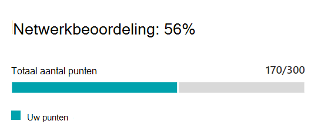

# Microsoft 365-netwerk beoordeling (preview)Microsoft 365 network assessment (preview)

In het Microsoft 365-Beheercentrum 365 kunt u met de **netwerk beoordelingen** een samenvatting van tal van de prestaties van de netwerkprestaties in een momentopname van uw Enterprise-netwerkstatus weergeven die wordt weergegeven door een punten waarde van 1-100.In the Microsoft 365 Admin Center's Connectivity to Microsoft 365 page, **network assessments** distill an aggregate of many network performance metrics into a snapshot of your enterprise network health, represented by a points value from 1 - 100. Netwerk beoordelingen zijn beperkt tot de gehele Tenant en voor elke geografische locatie van de gebruikers die verbinding maken met uw Tenant, zodat Microsoft 365-beheerders een eenvoudige manier is om een Gestalt van de netwerkstatus van de onderneming te begrijpt en snel een uitzoomen op een gedetailleerd overzicht van een wereldwijd kantoor.Network assessments are scoped to both the entire tenant and for each geographic location from which users connect to your tenant, providing Microsoft 365 administrators with an easy way to instantly grasp a gestalt of the enterprise's network health and quickly drill down into a detailed report for any global office location.

De waarde van het netwerkbeoordelings punt is een gemiddelde tijdsinstelling voor latentie, bandbreedte, downloadsnelheid en hoeveelheid verbindingskwaliteit, gecompileerd Live op het moment dat ze worden bekeken.The network assessment points value is an average measurement of latency, bandwidth, download speed and connection quality metrics compiled live at the time they are viewed. Prestatiegegevens voor Microsoft-netwerken zijn uitgesloten van deze waarden, om ervoor te zorgen dat de beoordelings resultaten ondubbelzinnig en specifiek zijn voor het bedrijfsnetwerk.Performance metrics for Microsoft-owned networks are excluded from these measurements to ensure that assessment results are unambiguous and specific to the corporate network.

Een zeer lage waarde voor de beoordeling van een netwerk adviseert dat Microsoft 365-clients grote problemen hebben met de Tenant of de gebruikerservaring van een reactie houdt, terwijl een hoge waarde een correct geconfigureerd netwerk aangeeft met enkele voortdurende prestatieproblemen.A very low network assessment value suggests that Microsoft 365 clients will have significant problems connecting to the tenant or maintaining a responsive user experience, while a high value indicates a properly configured network with few ongoing performance issues. Een waarde van 80% vertegenwoordigt een gezonde basislijn waarbij u geen normale klachten over de Microsoft 365-verbinding of-antwoord moet ontvangen vanwege de netwerkprestaties.A value of 80% represents a healthy baseline where you should not expect to receive regular user complaints about Microsoft 365 connectivity or responsiveness due to network performance. Aangezien er steeds meer verbeteringen in de netwerkverbinding worden aangebracht, zal deze waarde toenemen samen met de gebruikerservaring.As iterative network connectivity improvements are made, this value will increase along with user experience.

>[!IMPORTANT]
>Netwerk inzichten, prestatie aanbevelingen en beoordelingen in het Microsoft 365-Beheercentrum is momenteel in de preview-versie en is alleen beschikbaar voor Microsoft 365-tenants die zijn geregistreerd in het functie voorbeeldprogramma.Network insights, performance recommendations and assessments in the Microsoft 365 Admin Center is currently in preview status, and is only available for Microsoft 365 tenants that have been enrolled in the feature preview program.

## Deelvenster netwerk beoordelingNetwork assessment panel

Elke beoordeling van een netwerk, of het bereik van de Tenant of een specifieke kantoorlocatie, een deelvenster toont met details over de beoordeling.Each network assessment, whether scoped to the tenant or to a specific office location, shows a panel with details about the assessment. Dit deelvenster toont een staafdiagram van de beoordeling, zowel als een percentage, als het totaal aantal punten voor elk onderdeel dat de hoeveelheid werkbelasting omvat, waaronder alleen werkbelastingen waarop meetgegevens zijn ontvangen.This panel shows a bar chart of the assessment both as a percentage and as the total points for each component workload including only workloads where measurement data was received. Voor een netwerklocatie netwerk beoordeling wordt ook een bench type weergegeven dat de mediaan is van alle Microsoft 365-clients die gegevens hebben gerapporteerd in dezelfde plaats als uw kantoorlocatie.For an office location network assessment, we also show a benchmark which is the median of all Microsoft 365 clients that reported data in the same city as your office location.

In **het deelvenster analyse wordt** de beoordeling voor elk van de onderdelen van het onderdeel weergegeven.The **Assessment breakdown** in the panel shows the assessment for each of the component workloads.

De **beoordelings geschiedenis** toont de afgelopen 30 dagen van de beoordeling en de benchte.The **Assessment history** shows the past 30 days of the assessment and the benchmark.

## Inspecties van Tenant netwerkbeoordelingen en netwerk beoordelingen van Office-locatiesTenant network assessments and office location network assessments

Een netwerkbeoordeling meet de opzet van de netwerkverbinding van een kantoorlocatie naar het netwerk van Microsoft.A network assessment measures the design of the network perimeter of an office location to Microsoft's network. De verbeteringen aan de netwerkverbinding kunt u het beste uitvoeren op elke kantoorlocatie, of als de netwerkverbinding is geaggregeerd, zijn er mogelijk verbeteringen die van invloed zijn op meerdere locaties.Improvements to the network perimeter is best done at each office location, or where network connectivity is aggregated there may be improvements that impact multiple locations.

We tonen een netwerkassessmentwaarde voor de gehele Microsoft 365-Tenant op de pagina netwerkprestaties en een specifieke waarde voor elke gedetecteerde Office-locatie op de samenvattings pagina van die locatie.We show a network assessment value for the whole Microsoft 365 tenant on the network performance overview page and a specific value for each detected office location on that location's summary page.

## Exchange OnlineExchange Online

Voor Exchange Online wordt de TCP-latentie van de clientcomputer naar de front-end-server van Exchange gemeten.For Exchange Online the TCP latency from the client machine to the Exchange front end server is measured. Dit kan van invloed zijn op de afstand tussen het netwerk en het LAN en WAN van klanten.This can be impacted by the distance the network travels over the customers LAN and WAN. Het kan ook worden beïnvloed door de netwerk-of bewerkings apparatuur of de service die de verbinding vertraagt of dat pakketten worden verzonden.It can also be impacted by network intermediary devices or services which delay the connectivity or cause packets to be resent.

## SharePoint OnlineSharePoint Online

Voor SharePoint Online is de beschikbare downloadsnelheid voor een gebruiker voor toegang tot een document gemeten.For SharePoint Online the download speed available for a user to access a document is measured. Dit kan van invloed zijn op de bandbreedte voor netwerk circuits van de clientcomputer en van het Microsoft-netwerk.This can be impacted by the bandwidth available on network circuits between the client machine and Microsoft's network. Dit wordt vaak beïnvloed door netwerkcongestie die zich bevindt bij knelpunten in ingewikkelde netwerkapparaten of in de WiFi-gebieden met weinig behoefte.It is also often impacted by network congestion that exists in bottlenecks in complex network devices or in poor coverage Wi-Fi areas.

## Microsoft TeamsMicrosoft Teams

De netwerkkwaliteit voor Microsoft teams wordt gemeten als UDP-latentie, UDP-jitter en UDP-pakketverlies.For Microsoft Teams the Network quality is measured as UDP latency, UDP jitter, and UDP packet loss. UDP wordt gebruikt voor bellen en vergaderen via audio-en videoverbinding voor Microsoft teams.UDP is used for call and conferencing audio and video media connectivity for Microsoft Teams. Dit kan van invloed zijn op het moment dat de latentie en de downloadsnelheid van invloed zijn op de latentie en de downloadsnelheid, aangezien UDP voor de ondersteuning van de UDP apart is geconfigureerd voor het meer gangbare TCP-protocol.This can be impacted by the same factors as for latency and download speed in addition to connectivity gaps in a network's UDP support since UDP is configured separately to the more common TCP protocol.

## Verwante onderwerpenRelated topics

[Aanbevelingen voor netwerkprestaties in het Microsoft 365-Beheercentrum (preview)Network performance recommendations in the Microsoft 365 Admin Center (preview)](office-365-network-mac-perf-overview.md)

[Microsoft 365 Network Performance Insights (preview)Microsoft 365 network performance insights (preview)](office-365-network-mac-perf-insights.md)

[Microsoft 365 connectiviteitstest in het M365-Beheercentrum (preview)Microsoft 365 connectivity test in the M365 Admin Center (preview)](office-365-network-mac-perf-onboarding-tool.md)

[Locatie Services voor Microsoft 365-netwerkconnectiviteitMicrosoft 365 Network Connectivity Location Services (preview)](office-365-network-mac-location-services.md)
