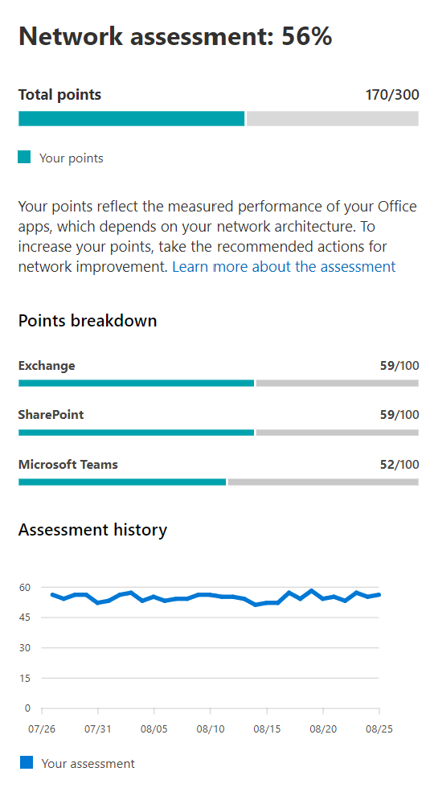

# Microsoft 365-netwerk beoordeling (preview)

In het Microsoft 365-Beheercentrum kunt u **netwerk beoordelingen** een totaal van tal van de prestaties van de netwerkprestaties in een momentopname van de status van de netwerkverbinding van uw onderneming omzetten in een momentopname van de status van een puntwaarde van 0-100. Een netwerkanalyse laat u weten hoeveel het door de klant verantwoordelijke netwerkontwerp van invloed is op de gebruikerservaring van Office 365. Netwerk beoordelingen zijn beperkt tot de gehele Tenant en voor elke geografische locatie van de gebruikers die verbinding maken met uw Tenant, zodat Microsoft 365-beheerders een eenvoudige manier is om een Gestalt van de netwerkstatus van de onderneming te begrijpt en snel een uitzoomen op een gedetailleerd overzicht van een wereldwijd kantoor.

De waarde van het netwerkassessment Points is een gemiddelde TCP-latentie, downloadsnelheid en UDP-verbindingskwaliteit die eenmaal per dag zijn gecompileerd. Prestatiegegevens voor Microsoft-netwerken zijn uitgesloten van deze waarden, om ervoor te zorgen dat de beoordelings resultaten ondubbelzinnig en specifiek zijn voor het bedrijfsnetwerk.

Een zeer lage waarde voor de beoordeling van een netwerk adviseert dat Microsoft 365-clients grote problemen hebben met de Tenant of de gebruikerservaring van een reactie houdt, terwijl een hoge waarde een correct geconfigureerd netwerk aangeeft met enkele voortdurende prestatieproblemen. Een waarde van 80% vertegenwoordigt een gezonde basislijn waarbij u geen normale klachten over de Microsoft 365-verbinding of-antwoord moet ontvangen vanwege de netwerkprestaties. Aangezien er steeds meer verbeteringen in de netwerkverbinding worden aangebracht, zal deze waarde toenemen samen met de gebruikerservaring.

| Netwerk beoordeling | Verwachte gebruikerservaring |
| :----------------- | :----------------------- |
| 100                | Doen                     |
| 80                 | Voldoet aan aanbevelingen    |
| 60                 | Aanvaardbaar               |
| 40                 | Gebruikers ondervinden mogelijk problemen |
| Maxi                 | Gebruikers kunnen klagen       |
| 0                  | Netwerkproblemen met een gemeenschappelijk onderwerp van discussie |

>[!IMPORTANT]
>Netwerk inzichten, prestatie aanbevelingen en beoordelingen in het Microsoft 365-Beheercentrum is momenteel in de preview-versie en is alleen beschikbaar voor Microsoft 365-tenants die zijn geregistreerd in het functie voorbeeldprogramma.

## Deelvenster netwerk beoordeling

Elke beoordeling van een netwerk, of het bereik van de Tenant of een specifieke kantoorlocatie, een deelvenster toont met details over de beoordeling. Dit deelvenster toont een staafdiagram van de beoordeling, zowel als een percentage, als het totaal aantal punten voor elk onderdeel dat de hoeveelheid werkbelasting omvat, waaronder alleen werkbelastingen waarop meetgegevens zijn ontvangen. Voor een Office-locatie netwerk beoordeling geven we ook een vergelijking weer met het percentage Microsoft 365-klanten in elk van de vijf quintiles waarmee gegevens in dezelfde plaats werden gerapporteerd als uw kantoorlocatie.

In **het deelvenster analyse wordt** de beoordeling voor elk van de onderdelen van het onderdeel weergegeven.

De **beoordelings geschiedenis** toont de afgelopen 30 dagen van de beoordeling en de benchte. Met behulp van het tabblad geschiedenis kunt u ook rapporten maken over de metrische geschiedenis van de Office-locaties van maximaal twee jaar. Met het tabblad geschiedenis kunt u de kenmerken selecteren waarmee u wilt rapporteren en de manier waarop u een rapport wilt maken van een rapport, kunt u de invloed van een netwerkupdate-project markeren en de verbeteringen van de netwerkanalyse bekijken.

## Inspecties van Tenant netwerkbeoordelingen en netwerk beoordelingen van Office-locaties

Een netwerkbeoordeling meet de opzet van de netwerkverbinding van een kantoorlocatie naar het netwerk van Microsoft. U kunt op elke kantoorlocatie het beste verbeteringen in de netwerkverbinding uitvoeren.

We tonen een netwerkassessmentwaarde voor de hele Microsoft 365-Tenant op de pagina netwerkprestaties-overzicht, een gewogen gemiddelde van de netwerk Beoordelingen voor alle kantoorlocaties. Er is ook een specifieke waarde voor de netwerkbeoordeling voor elke gedetecteerde Office-locatie op de samenvattings pagina van de locatie.

## Exchange Online

Voor Exchange Online wordt de TCP-latentie van de clientcomputer naar de front deur van de Exchange-service gemeten. Dit kan van invloed zijn op de afstand tussen het netwerk en het LAN en WAN van klanten. Het kan ook worden beïnvloed door de netwerk-of bewerkings apparatuur of de service die de verbinding vertraagt of dat pakketten worden verzonden. Dit is van invloed op de weg van de dichtstbijzijnde Exchange-service voor de front deur. De mediaan (ook wel het 50e percentiel of de P50 maat) wordt voor alle maten van de afgelopen drie dagen genomen.

De analyse van Exchange Online wordt uitgevoerd met behulp van de volgende tabel. Elk TCP-latentie nummer tussen de drempelwaarden wordt in de band lineair toegewezen aan punten.

| TCP-latentie   | Distributiepunten |
| :------------ | :----- |
| 10 MS of minder  | 100    |
| 25ms          | 80     |
| 100 MS         | 60     |
| 200ms         | 40     |
| 300ms         | Maxi     |
| 350ms of meer | 0      |

## SharePoint Online

Voor SharePoint Online is de beschikbare downloadsnelheid voor een gebruiker om toegang te krijgen tot een document via SharePoint of OneDrive gemeten. Dit kan van invloed zijn op de bandbreedte voor netwerk circuits van de clientcomputer en van het Microsoft-netwerk. Dit wordt vaak beïnvloed door netwerkcongestie die zich bevindt bij knelpunten in ingewikkelde netwerkapparaten of in de WiFi-gebieden met weinig behoefte. De downloadsnelheid wordt gemeten in megabytes per seconde en is ongeveer een tiende van een circuits met een classificatie van megabits per seconde. De hoeveelheid MegaByte per seconde is handig omdat u direct kunt zien welk bestandsformaat u kunt downloaden in 1 seconde. Het 25e percentiel (ook wel bekend als P25 meetwaarde) wordt gebruikt voor alle maten van de afgelopen drie dagen. Dit 25e percentiel zorgt voor een vermindering van de invloed van uiteenlopende congestie.

De beoordeling van SharePoint Online wordt uitgevoerd in de volgende tabel. Elk Download snelheids nummer tussen de drempelwaarden wordt in de band lineair toegewezen.

| Download snelheid | Distributiepunten |
| :------------- | :----- |
| 20MBps of meer | 100    |
| 14MBps         | 80     |
| 8MBps          | 60     |
| 4 Mbps          | 40     |
| 2MBps          | Maxi     |
| 0MBps          | 0      |

## Microsoft Teams

De netwerkkwaliteit voor Microsoft teams wordt gemeten als UDP-latentie, UDP-jitter en UDP-pakketverlies. UDP wordt gebruikt voor bellen en vergaderen via audio-en videoverbinding voor Microsoft teams. Dit kan van invloed zijn op het moment dat de latentie en de downloadsnelheid van invloed zijn op de latentie en de downloadsnelheid, aangezien UDP voor de ondersteuning van de UDP apart is geconfigureerd voor het meer gangbare TCP-protocol. De mediaan (ook wel het 50e percentiel of de P50 maat) wordt voor alle maten van de afgelopen drie dagen genomen. 

U berekent een gemiddelde mening van deze UDP-metingen voor een schaal van 1 tot en met 5. Vervolgens gaan we naar de 0-100 punten schaal voor de Microsoft teams-netwerk beoordeling.  Algemeen is een goed idee van 87,5 points en de algehele slechte bevindt zich onder 50 Points.

## Verwante onderwerpen

[Netwerkverbinding in het Microsoft 365-Beheercentrum (preview)](office-365-network-mac-perf-overview.md)

[Microsoft 365 Network Performance Insights (preview)](office-365-network-mac-perf-insights.md)

[Microsoft 365 connectiviteitstest in het M365-Beheercentrum (preview)](office-365-network-mac-perf-onboarding-tool.md)

[Locatie Services voor Microsoft 365-netwerkconnectiviteit](office-365-network-mac-location-services.md)

[Test hulpmiddel voor Microsoft 365-netwerkverbindingen (preview)](office-365-network-mac-perf-onboarding-tool.md)
