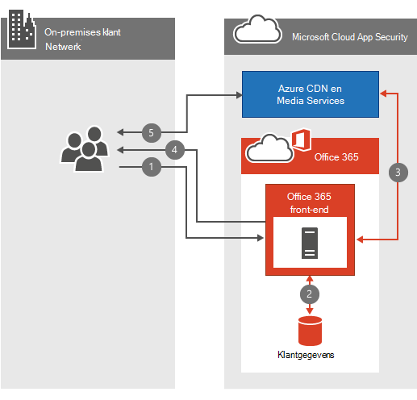

# Office 365 Veelgestelde vragen over videonetwerkenOffice 365 Video networking Frequently Asked Questions

De Office 365 en streamingservices maken het opslaan en streamen van video's binnen uw organisatie eenvoudig.The Office 365 Video repository and streaming services make storing and streaming videos within your organization simple. Er is veel goede informatie over Office 365 [Video;](https://support.office.com/article/Find-help-about-Office-365-Video-b435f99a-f47e-4ebd-a946-f5c965844f50) Deze veelgestelde vragen over netwerken zijn bedoeld om de meest voorkomende vragen over bandbreedteplanning, versleuteling en de manier waarop de service gebruik maakt van CDN's [(Content Delivery Networks)](content-delivery-networks.md) te beantwoorden.There's a lot of great [information about Office 365 Video](https://support.office.com/article/Find-help-about-Office-365-Video-b435f99a-f47e-4ebd-a946-f5c965844f50); this networking FAQ is designed to answer the most common questions around bandwidth planning, encryption, and how the service leverages [Content Delivery Networks](content-delivery-networks.md) (CDNs).
  
Als u nog niet goed weet wat er gebeurt wanneer een video wordt geüpload of afgespeeld, bekijkt u deze video die we hebben gemaakt: Wat gebeurt er met een videobestand wanneer deze wordt geüpload naar [Office 365 Video.](https://www.youtube.com/watch?v=HXSZ0jYBKlM)If you don't already have a thorough understanding of what happens when a video is uploaded or played back, have a look at this video we put together, [What happens to a video file when uploaded to Office 365 Video](https://www.youtube.com/watch?v=HXSZ0jYBKlM).
  
## Wat zijn de vereisten Office 365 videobandbreedte?What are the Office 365 Video bandwidth requirements?

Er zijn een groot aantal [ondersteunde video-indelingen](https://support.office.com/article/dd1af01c-fd8e-4640-b17b-93ee02b9b817) die kunnen worden geüpload naar Office 365.There are a numerous [supported video formats](https://support.office.com/article/dd1af01c-fd8e-4640-b17b-93ee02b9b817) that can be uploaded to Office 365. Elk videobestand wordt vervolgens gecodeerd naar een standaardindeling met verschillende videokwaliteiten voor afspelen.Each video file is then encoded to a standard format with several different video qualities for playback. Office 365 Video gebruikt adaptieve bitratestreaming om de beste afspeelkwaliteit voor video te selecteren op basis van de beschikbare netwerkbandbreedte en de grootte van de videospeler.Office 365 Video uses adaptive bitrate streaming to select the best video playback quality based on the available network bandwidth and size of the video player. Hiervoor vraagt de speler in eerste instantie om de laagste afspeelkwaliteit.To do this, the player initially requests the lowest playback quality. De service begint vervolgens met het verzenden van videosegmenten van 2 seconden naar de videospeler.The service then begins sending 2-second video segments to the video player. De speler kan vervolgens een hogere of lagere afspeelkwaliteit aanvragen op basis van hoe snel elk segment wordt geleverd.The player can then request higher or lower playback quality based on how quickly each segment is delivered.
  
De adaptieve bitratestreaming doet dit alles op de achtergrond terwijl de video wordt afgespeeld met de minste mate van onderbreking of buffering.The adaptive bitrate streaming does all this in the background while the video plays with the least amount of disruption or buffering. Tijdens het afspelen van video's kan de videospeler de automatische afspeelkwaliteit handmatig overschrijven om een specifieke afspeelkwaliteit voor video's te selecteren.During video playback, the video player allows the viewer to manually override the automatic playback quality, to select a specific video playback quality.
  
Hier is een snelle tabel met een overzicht van de netwerkvereisten voor elk van de afspeelkwaliteiten van de video.Here's a quick table that outlines the network requirements for each of the video playback qualities. De minimale bandbreedte per persoon die nodig is om een video af te spelen, is 802 Kbps.The minimum bandwidth per person needed to play a video is 802Kbps.
  
| AfspeelkwaliteitPlayback Quality | NetwerksnelheidNetwork Speed |
|:-----|:-----|
|288p288p    |802 Kbps802Kbps    |
|360p360p    |1,2 Mbps1.2 Mbps    |
|576p576p    |2,5 Mbps2.5 Mbps    |
|720p720p    |3,8 Mbps3.8 Mbps    |

([Terug naar boven](office-365-video-networking-faq.md))([Back to top](office-365-video-networking-faq.md))
  
## Hoe kunnen CDN's (Content Delivery Networks) het afspelen van video's helpen?How do Content Delivery Networks (CDNs) help video playback?

Als meerdere personen van dezelfde organisatie binnen dezelfde geografische locatie dezelfde video(s) streamen, worden in CDN's een kopie van deze video's opgeslagen op een locatie dichter bij die geografische regio.If several people from the same organization within the same geographic location are streaming the same video(s), CDNs will store a copy of these videos in a location closer to that geographic region. Als de video is opgeslagen of in de cache opgeslagen op de dichtstbijzijnde locatie, streamt elke persoon de video vanaf de locatie die het dichtst bij hem of haar staat in plaats van een locatie verderop.With the video stored, or cached at the closest location, each person streams the video from the location closest to them instead of a location further away. Office 365 Video gebruikt Azure Media Services om te beheren wat in de cache is opgeslagen in de Azure CDN's en voor hoelang.Office 365 Video uses Azure Media Services to manage what is cached in the Azure CDNs, and for how long. Azure Media Services kunt een van de Azure CDN [gebruiken](/azure/cdn/cdn-pop-locations) om videofragmenten en manifesten een paar dagen in de cache te plaatsen.Azure Media Services can use any of the [Azure CDN locations](/azure/cdn/cdn-pop-locations) to cache video fragments and manifests for a few days. Als personen in uw organisatie de video's in de cache blijven bekijken, blijven ze in de cache.If people in your organization continue to watch the cached videos they'll stay in the cache. Als er meerdere dagen niemand toegang heeft tot de video, wordt de video uiteindelijk uit de cache verwijderd.If no one accesses the video for several days, the video will eventually drop be dropped from the cache. De volgende keer dat iemand de video probeert te bekijken, wordt deze opnieuw in de cache opgeslagen op de dichtstbijzijnde CDN locatie.The next time someone attempts to watch the video it's once again cached at the nearest CDN location.
  
Iedereen die de video probeert te bekijken terwijl de inhoud in de cache wordt opgeslagen in een nabijgelegen CDN profiteert van de video die dichter bij elkaar staat, en in de meeste gevallen minder hops, weg.Everyone who attempts to watch the video while the content is cached at a nearby CDN benefits from the video being closer, and in most cases less hops, away. Hierdoor wordt de afspeelsnelheid van video verbeterd. De netwerkvereisten voor het afspelen van de video worden echter niet gewijzigd.This improves video playback speed; however, it doesn't change the network requirement to play the video.
  
> [!NOTE]
> Er zijn enkele omstandigheden, zoals het bereiken van de capaciteitslimiet, waarbij de video mogelijk wordt verwijderd voordat de drie dagen zijn bereikt.There are some circumstances, such as our capacity limit being reached, where the video may be removed before the three days has been reached.
  
([Terug naar boven](office-365-video-networking-faq.md))([Back to top](office-365-video-networking-faq.md))
  
## Kan ik de video's lokaal cachen voor een snellere weergave?Can I cache the videos locally for faster playback?

Ja.Yes. Office 365 voorkomt niet dat u een lokale CDN of een caching-proxy gebruikt om video of andere Office 365 inhoud naar uw lokale netwerk te brengen voor snellere toegang.Office 365 won't prevent you from using a local CDN or a caching proxy to bring video or other Office 365 content into your local network for faster access. Er zijn verschillende manieren om een lokale caching-oplossing in uw netwerk te implementeren, de meest voorkomende methode is om een proxyoplossing te gebruiken waarmee inhoud lokaal wordt gecachet.There are several ways to implement a local caching solution on your network, the most common method is to use a proxy solution that caches content locally. Wanneer een proxy of een privé-CDN de videofragmenten en -manifesten in de cache heeft opgeslagen, worden toekomstige aanvragen voor bestanden die via de proxy of privé-CDN worden gerouteerd, uit de lokale cache gehaald en niet van een internetlocatie gehaald.Once a proxy or private CDN has cached the video fragments and manifests, future requests for those files that route through the proxy or private CDN are pulled from the local cache and not pulled from an internet location. Houd rekening met de gelijktijdigheid van netwerkbandbreedte, capaciteit en videoweergave tijdens de planning van een oplossing als deze.Consider network bandwidth, capacity, and video playback concurrency during the planning of a solution like this.
  
([Terug naar boven](office-365-video-networking-faq.md))([Back to top](office-365-video-networking-faq.md))
  
## Hoe worden video's versleuteld en beveiligd?How videos are encrypted and secured?

Office 365 Video weet hoe belangrijk het is om uw gegevens veilig en privé te houden.Office 365 Video knows how important it is to keep your data secure and private. [Microsoft Trust Center beschrijft](https://products.office.com/business/office-365-trust-center-welcome) onze betrokkenheid bij de privacy en beveiliging van uw inhoud.[Microsoft Trust Center](https://products.office.com/business/office-365-trust-center-welcome) describes our commitment to the privacy and security of your content. Bij het afspelen van video is snelheid belangrijk voor een goede ervaring. We brengen echter uw beveiliging of privacy niet in gevaar in ruil voor snelheid.With video playback, speed is important for a good experience; however, we don't compromise your security or privacy in exchange for speed. Hier wordt tegemoet gekomen aan snelheid, beveiliging en privacy.Here's how we accommodate speed, security and privacy.
  
Wanneer u of iemand in uw organisatie een nieuwe video uploadt, wordt deze video gecodeerd, versleuteld met AES-128-versleuteling en opgeslagen in Azure Media Services.When you or someone in your organization uploads a new video, that video is transcoded, encrypted with AES-128 encryption, and stored in Azure Media Services. Dit betekent dat de video's zowel onderweg als in rust zijn versleuteld.This means the videos are encrypted both in transit and at rest.
  
Wanneer iemand in uw organisatie een nieuwe video probeert te bekijken, volgt deze de volgende stappen:When someone in your organization attempts to watch a new video, they follow these steps:
  
1. Vraag SharePoint Online of ze toestemming hebben om de video te bekijken.Ask SharePoint Online if they have permission to view the video.

2. SharePoint Online gebruikt de bestandsmachtigingen om te bepalen of de persoon de video kan bekijken.SharePoint Online uses the file permissions to determine if the person can watch the video.

3. Als dit is toegestaan, SharePoint Online een token uit Azure opgehaald om aan de videospeler te geven.If they're allowed, SharePoint Online retrieves a token from Azure to give to the video player.

4. De videospeler gebruikt vervolgens het token om de ontsleutelingssleutel op te vragen bij Azure.The video player then uses the token to request the decryption key from Azure.

5. Met de ontsleutelingssleutel in de hand kan de videospeler de video streamen.With the decryption key in hand, the video player is able to stream the video.

  
([Terug naar boven](office-365-video-networking-faq.md))([Back to top](office-365-video-networking-faq.md))
  
## Wat zijn de vereisten voor het afspelen Office 365 Video?What are the requirements to playback Office 365 Video?

Office 365 Video ondersteunde besturingssystemen en webbrowsers zijn hetzelfde als de SharePoint onlinevereisten in [Office 365 systeemvereisten.](https://support.office.com/article/Office-365-system-requirements-719254c0-2671-4648-9c84-c6a3d4f3be45)Office 365 Video supported operating systems and web browsers are the same as the SharePoint Online requirements in [Office 365 system requirements](https://support.office.com/article/Office-365-system-requirements-719254c0-2671-4648-9c84-c6a3d4f3be45). Afhankelijk van welk besturingssysteem en welke webbrowserconfiguratie u hebt, bepaalt u de specifieke behoeften van de videospeler.Depending on which operating system and web browser configuration you have will determine the specific needs of the video player. Hier vindt u meer informatie over vereisten voor [het afspelen van video' s.](https://support.office.com/article/ca1cc1a9-a615-46e1-b6a3-40dbd99939a6)Here's more information on [video playback requirements](https://support.office.com/article/ca1cc1a9-a615-46e1-b6a3-40dbd99939a6).
  
([Terug naar boven](office-365-video-networking-faq.md))([Back to top](office-365-video-networking-faq.md))
  
## Ik kan de video niet Office 365 werken, waar moet ik beginnen?I can't get Office 365 video to work, where should I start?

Het oplossen van problemen met Office 365 video gaat gepaard met het oplossen van problemen met uw netwerk, uw internetproviders en uw configuratie van Office 365.Troubleshooting connectivity to Office 365 Video involves troubleshooting your network, your ISP(s), and your configuration of Office 365. De eerste plaats om te beginnen is het dashboard voor service-status.The first place to start is the service health dashboard. Hier ziet u of Office 365 video een probleem heeft of niet.This will tell you of Office 365 Video is having a problem or not. Als alles er goed uitziet, vindt u hier enkele extra informatiebronnen om u te helpen.If everything looks great there, here's some additional resources to help you.
  
- Zorg ervoor dat u verbinding kunt maken met de [netwerk-eindpunten die](https://support.office.com/article/Office-365-URLs-and-IP-address-ranges-8548a211-3fe7-47cb-abb1-355ea5aa88a2)nodig zijn voor Office 365 Video.Make sure you can connect to the [network endpoints required for Office 365 Video](https://support.office.com/article/Office-365-URLs-and-IP-address-ranges-8548a211-3fe7-47cb-abb1-355ea5aa88a2).

- Controleer uw netwerkconnectiviteit met behulp van Office 365 handleiding voor [probleemoplossing van het netwerk.](https://support.office.com/article/Office-365-performance-tuning-and-troubleshooting-Admin-and-IT-Pro-1492cb94-bd62-43e6-b8d0-2a61ed88ebae)Check your network connectivity using our [Office 365 network troubleshooting guide](https://support.office.com/article/Office-365-performance-tuning-and-troubleshooting-Admin-and-IT-Pro-1492cb94-bd62-43e6-b8d0-2a61ed88ebae).

- Bekijk onze [best practices voor het gebruik Office 365 op een traag netwerk.](https://support.office.com/article/Best-practices-for-using-Office-365-on-a-slow-network-fd16c8d2-4799-4c39-8fd7-045f06640166)See our [best practices for using Office 365 on a slow network](https://support.office.com/article/Best-practices-for-using-Office-365-on-a-slow-network-fd16c8d2-4799-4c39-8fd7-045f06640166).

- [Help bij het Office 365 videoconfiguratie](https://support.office.com/article/Find-help-about-Office-365-Video-b435f99a-f47e-4ebd-a946-f5c965844f50).[Find help about Office 365 Video configuration](https://support.office.com/article/Find-help-about-Office-365-Video-b435f99a-f47e-4ebd-a946-f5c965844f50).

([Terug naar boven](office-365-video-networking-faq.md))([Back to top](office-365-video-networking-faq.md))
  
## Office 365 VideobronnenOffice 365 Video resources

Hier vindt u enkele andere bronnen om u te helpen bij het implementeren en gebruiken van Office 365 Video:Here's a few other resources to help you successfully deploy and use Office 365 Video:
  
[Help-informatie over Office 365 videoconfiguratieFind help about Office 365 Video configuration](https://support.office.com/article/Find-help-about-Office-365-Video-b435f99a-f47e-4ebd-a946-f5c965844f50)
  
[Vergaderen Office 365 VideoMeet Office 365 Video](https://support.office.com/article/Meet-Office-365-Video-ca1cc1a9-a615-46e1-b6a3-40dbd99939a6)
  
[Een kanaal maken en beheren in Office 365 VideoCreate and manage a channel in Office 365 Video](https://support.office.com/article/Create-and-manage-a-channel-in-Office-365-Video-1fede4cc-13c0-435a-b585-e7fbf1c83bb2)
  
[Uw videoportal Office 365 beherenManage your Office 365 Video portal](https://support.office.com/article/Manage-your-Office-365-Video-portal-c059465b-eba9-44e1-b8c7-8ff7793ff5da)
  
[Video-indelingen die werken in Office 365 VideoVideo formats that work in Office 365 Video](https://support.office.com/article/Video-formats-that-work-in-Office-365-Video-dd1af01c-fd8e-4640-b17b-93ee02b9b817)
  
([Terug naar boven](office-365-video-networking-faq.md))([Back to top](office-365-video-networking-faq.md))
  
Met deze korte koppeling kunt u teruggaan: [https://aka.ms/video365networkfaq]()Here's a short link you can use to come back: [https://aka.ms/video365networkfaq]()