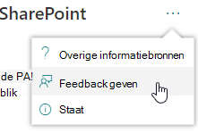
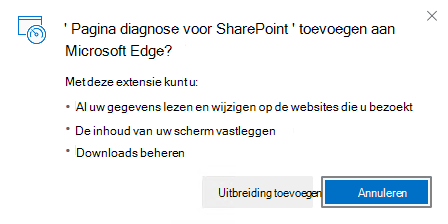
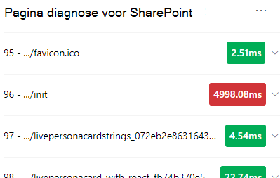
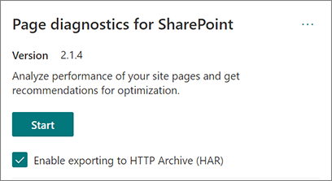
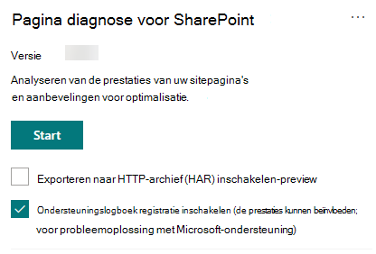

# Het hulpprogramma Paginadiagnose SharePoint gebruikenUse the Page Diagnostics for SharePoint tool

In dit artikel wordt beschreven hoe u het hulpprogramma **Paginadiagnose** voor SharePoint kunt gebruiken om moderne en klassieke sitepagina's van SharePoint Online te analyseren op basis van een vooraf gedefinieerde set prestatiecriteria.This article describes how to use the **Page Diagnostics for SharePoint tool** to analyze SharePoint Online modern and classic site pages against a pre-defined set of performance criteria.

Het hulpprogramma Paginadiagnose voor SharePoint kan worden geïnstalleerd voor:The Page Diagnostics for SharePoint tool can be installed for:

- **Microsoft Edge** [(Edge-extensie)](https://microsoftedge.microsoft.com/addons/detail/ocemkolpnamjcacndljdfmhlpcaoipji)**Microsoft Edge** [(Edge extension)](https://microsoftedge.microsoft.com/addons/detail/ocemkolpnamjcacndljdfmhlpcaoipji)
- **Chrome** [(Chrome-extensie)](https://chrome.google.com/webstore/detail/inahogkhlkbkjkkaleonemeijihmfagi)**Chrome** [(Chrome extension)](https://chrome.google.com/webstore/detail/inahogkhlkbkjkkaleonemeijihmfagi)

>[!TIP]
>Versie **2.0.0** en hoger bevat ondersteuning voor moderne pagina's naast klassieke sitepagina's.Version **2.0.0** and later includes support for modern pages in addition to classic site pages. Als u niet zeker weet welke versie van het hulpprogramma u gebruikt, kunt u de **koppeling** Over of de drie puntjes (...) selecteren om uw versie te verifiëren.If you are unsure which version of the tool you are using, you can select the **About** link or the ellipses (...) to verify your version. **Werk altijd bij naar de nieuwste versie wanneer** u het hulpprogramma gebruikt.**Always update to the latest version** when using the tool.

Het hulpprogramma Paginadiagnose voor SharePoint is een browserextensie voor de nieuwe Microsoft Edge ( en Chrome-browsers die zowel SharePoint Moderne portal online als klassieke https://www.microsoft.com/edge) publicerende sitepagina's analyseren.The Page Diagnostics for SharePoint tool is a browser extension for the new Microsoft Edge (https://www.microsoft.com/edge) and Chrome browsers that analyzes both SharePoint Online modern portal and classic publishing site pages. Dit hulpprogramma werkt alleen voor SharePoint Online en kan niet worden gebruikt op een SharePoint systeempagina.This tool only works for SharePoint Online, and cannot be used on a SharePoint system page.

Het hulpprogramma genereert een rapport voor elke geanalyseerde pagina waarin wordt weergegeven hoe de pagina presteert ten opzichte van een vooraf gedefinieerde set regels en gedetailleerde informatie wekt wanneer de resultaten voor een test buiten de basislijnwaarde vallen.The tool generates a report for each analyzed page showing how the page performs against a pre-defined set of rules and displays detailed information when results for a test fall outside the baseline value. SharePoint Onlinebeheerders en ontwerpers kunnen het hulpprogramma gebruiken om prestatieproblemen op te lossen en ervoor te zorgen dat nieuwe pagina's worden geoptimaliseerd voordat ze worden gepubliceerd.SharePoint Online administrators and designers can use the tool to troubleshoot performance issues and to ensure that new pages are optimized prior to publishing.

Het hulpprogramma Paginadiagnose is ontworpen om alleen SharePoint sitepagina's te analyseren, niet systeempagina's zoals *allitems.aspx* of *sharepoint.aspx.*The Page Diagnostics tool is designed to analyze SharePoint site pages only, not system pages such as *allitems.aspx* or *sharepoint.aspx*. Als u het hulpprogramma probeert uit te voeren op een systeempagina of een andere niet-sitepagina, ontvangt u een foutbericht met de melding dat het hulpprogramma niet kan worden uitgevoerd voor dat type pagina.If you attempt to run the tool on a system page or any other non-site page, you will receive an error message advising that the tool cannot be run for that type of page.

> [!div class="mx-imgBorder"]
> 

Dit is geen fout in het hulpprogramma, omdat het beoordelen van bibliotheken of systeempagina's geen waarde heeft.This is not an error in the tool as there is no value in assessing libraries or system pages. Ga naar een SharePoint sitepagina om het hulpprogramma te gebruiken.Please navigate to a SharePoint site page to use the tool. Als deze fout optreedt op een SharePoint pagina, controleert u de basispagina om te controleren of de SharePoint niet zijn verwijderd.If this error occurs on a SharePoint page, please check the master page to ensure that the SharePoint metatags have not been removed.

Als u feedback wilt geven over het hulpprogramma, selecteert u het beletselteken in de rechterbovenhoek van het hulpprogramma en selecteert u [vervolgens Feedback geven.](https://go.microsoft.com/fwlink/?linkid=874109)To provide feedback about the tool, select the ellipsis at the top right corner of the tool and then select [Give feedback](https://go.microsoft.com/fwlink/?linkid=874109).

> [!div class="mx-imgBorder"]
> 
  
## Het hulpprogramma Paginadiagnose voor SharePoint installerenInstall the Page Diagnostics for SharePoint tool

De installatieprocedure in deze sectie werkt voor zowel chrome als Microsoft Edge browsers.The installation procedure in this section will work for both the Chrome and Microsoft Edge browsers.

> [!IMPORTANT]
> Microsoft leest geen gegevens of pagina-inhoud die wordt geanalyseerd door het hulpprogramma Paginadiagnose voor SharePoint en we leggen geen persoonlijke gegevens, website- of downloadgegevens vast.Microsoft does not read data or page content that is analyzed by the Page Diagnostics for SharePoint tool, and we do not capture any personal information, website or download information. De enige identificeerbare gegevens die door het hulpprogramma bij Microsoft zijn geregistreerd, zijn de tenantnaam, het aantal regels dat is mislukt en de datum en tijd waarop het hulpprogramma is uitgevoerd.The only identifiable information logged to Microsoft by the tool is the tenant name, counts of rules that have failed and the date and time the tool was run. Deze informatie wordt door Microsoft gebruikt om meer inzicht te krijgen in moderne portal- en publicatiesitegebruikstrends en veelvoorkomende prestatieproblemen.This information is used by Microsoft to better understand modern portal and publishing site usage trends and common performance issues.

1. Installeer het hulpprogramma Paginadiagnose **SharePoint voor** Microsoft Edge [(edge-extensie)](https://microsoftedge.microsoft.com/addons/detail/ocemkolpnamjcacndljdfmhlpcaoipji) of **Chrome** [(Chrome-extensie)](https://chrome.google.com/webstore/detail/inahogkhlkbkjkkaleonemeijihmfagi).Install the Page Diagnostics for SharePoint tool for **Microsoft Edge** [(Edge extension)](https://microsoftedge.microsoft.com/addons/detail/ocemkolpnamjcacndljdfmhlpcaoipji) or **Chrome** [(Chrome extension)](https://chrome.google.com/webstore/detail/inahogkhlkbkjkkaleonemeijihmfagi). Bekijk het privacybeleid van de gebruiker op de beschrijvingspagina in de store.Please review the User Privacy Policy provided on the description page in the store. Wanneer u het hulpprogramma toevoegt aan uw browser, ziet u de volgende machtigingen.When adding the tool to your browser, you will see the following permissions notice.

    > [!div class="mx-imgBorder"]
    > 

    Deze melding is op zijn plaats omdat een pagina inhoud kan bevatten van locaties buiten SharePoint, afhankelijk van de webonderdelen en aanpassingen op de pagina.This notice is in place because a page may contain content from locations outside of SharePoint depending on the web parts and customizations on the page. Dit betekent dat het hulpprogramma de aanvragen en antwoorden leest wanneer op de startknop wordt geklikt en alleen voor het actieve tabblad SharePoint waarop het hulpprogramma wordt uitgevoerd.This means that the tool will read the requests and responses when the start button is clicked and only for the active SharePoint tab where the tool is running. Deze gegevens worden lokaal vastgelegd door de webbrowser en zijn beschikbaar via de knop Exporteren  naar **JSON** of Exporteren naar **HAR** op het tabblad Netwerkspoor van het hulpprogramma. De gegevens worden niet verzonden naar of vastgelegd door **Microsoft.**This information is captured locally by the web browser and is available to you via the **Export to JSON** or **Export to HAR** button in the tool's _Network trace_ tab. **The information is not sent to or captured by Microsoft.** (Het hulpprogramma respecteert het privacybeleid van Microsoft dat hier toegankelijk [is](https://go.microsoft.com/fwlink/p/?linkid=857875).)(The tool respects the Microsoft privacy policy accessible [here](https://go.microsoft.com/fwlink/p/?linkid=857875).)

    De _machtiging Uw downloads beheren_ heeft betrekking op het gebruik van de functionaliteit Exporteren naar **JSON van het** hulpprogramma.The _Manage your downloads_ permission covers use of the tool's **Export to JSON** functionality. Volg de eigen privacyrichtlijnen van uw bedrijf voordat u het JSON-bestand buiten uw organisatie deelt, omdat de resultaten URL's bevatten en die kunnen worden geclassificeerd als PII (Persoonlijke identificeerbare gegevens).Please follow your company's own privacy guidelines before sharing the JSON file outside of your organization, as the results contain URLs and that can be classified as PII (Personally Identifiable Information).
1. Als u het hulpprogramma wilt gebruiken in de Incognito- of InPrivate-modus, volgt u de procedure voor uw browser:If you want to use the tool in Incognito or InPrivate mode, follow the procedure for your browser:
    1. Ga Microsoft Edge naar **Extensies** of typ edge://extensions _url-balk_ en selecteer **Details** voor de extensie.In Microsoft Edge, navigate to **Extensions** or type _edge://extensions_ in the URL bar and select **Details** for the extension. Schakel in de extensie-instellingen het selectievakje in voor **toestaan in InPrivate.**In the extension settings, select the checkbox for **allow in InPrivate**.
    1. Ga in Chrome naar **Extensies** of typ _chrome://extensions_ in de URL-balk en selecteer **Details** voor de extensie.In Chrome, navigate to **Extensions** or type _chrome://extensions_ in the URL bar and select **Details** for the extension. Selecteer in de extensie-instellingen de schuifregelaar voor **toestaan in Incognito.**In the extension settings, select the slider for **allow in Incognito**.
1. Ga naar de SharePoint sitepagina op SharePoint Online die u wilt bekijken.Navigate to the SharePoint site page on SharePoint Online that you would like to review. We hebben toegestaan dat items op pagina's worden 'vertraagd geladen'. Daarom wordt het hulpprogramma niet automatisch gestopt (dit is een ontwerp voor alle scenario's voor het laden van pagina's).We have allowed for "delay loading" of items on pages; therefore, the tool will not stop automatically (this is by design to accommodate all page load scenarios). Als u de verzameling wilt stoppen, **selecteert u Stoppen**.To stop collection, select **Stop**. Zorg ervoor dat de paginabelasting is voltooid voordat u de gegevensverzameling stopt of dat u slechts een gedeeltelijke trace vasthoudt.Make sure that the page load has completed before you stop data collection or you will only capture a partial trace.
1. Klik op de werkbalkknop van de extensieClick on the extension's toolbar button  als u het hulpprogramma wilt laden, ziet u het volgende uitbreidingspopupvenster:to load the tool and you will be presented with the following extension popup window:

    

Selecteer **Start** om te beginnen met het verzamelen van gegevens voor analyse.Select **Start** to begin collecting data for analysis.

## Wat u in het hulpprogramma Paginadiagnose voor SharePoint zietWhat you'll see in the Page Diagnostics for SharePoint tool

1. Klik op de drie puntjes (...) in de rechterbovenhoek van het hulpprogramma om de volgende koppelingen te vinden:Click the ellipses (...) in the top right corner of the tool to find the following links:
   1. De **koppeling Aanvullende bronnen** bevat algemene richtlijnen en details over het hulpprogramma, inclusief een koppeling terug naar dit artikel.The **Additional resources** link provides general guidance and details regarding the tool including a link back to this article.
   1. De **koppeling Feedback geven** biedt een koppeling naar de SharePoint sites en de user _voice-site voor_ samenwerking.The **Give feedback** link provides a link to the _SharePoint Sites and Collaboration User Voice_ site.
   1. De **koppeling** Over bevat de momenteel geïnstalleerde versie van het hulpprogramma en een directe koppeling naar de kennisgeving van derden van het hulpprogramma.The **About** link includes the currently installed version of the tool and a direct link to the tool's third party notice.  
1. De **correlatie-id, SPRequestDuration, SPIISLatency,** Laadtijd **voor** pagina's en **URL-gegevens** zijn informatief en kunnen voor een paar doeleinden worden gebruikt.The **Correlation ID, SPRequestDuration, SPIISLatency**, **Page load time**, and **URL** details are informational and can be used for a few purposes.

    > [!div class="mx-imgBorder"]
    > 

   - **CorrelationID** is een belangrijk element bij het werken met Microsoft Support, omdat ze hierdoor aanvullende diagnostische gegevens voor de specifieke pagina kunnen verzamelen.**CorrelationID** is an important element when working with Microsoft Support as it allows them to gather additional diagnostic data for the specific page.
   - **SPRequestDuration** is de tijd die nodig is om SharePoint pagina te verwerken.**SPRequestDuration** is the time taken for SharePoint to process the page. Structurele navigatie, grote afbeeldingen, veel API-oproepen kunnen allemaal bijdragen aan langere duur.Structural navigation, large images, lots of API calls could all contribute to longer durations.
   - **SPIISLatency** is de tijd in milliseconden die is genomen voor SharePoint online de pagina begint te laden.**SPIISLatency** is the time in milliseconds taken for SharePoint Online begin loading the page. Deze waarde omvat niet de tijd die nodig is om de webtoepassing te laten reageren.This value does not include the time taken for the web application to respond.
   - **Laadtijd voor pagina's** is de totale tijd die door de pagina is vastgelegd vanaf het moment van de aanvraag tot het moment dat het antwoord is ontvangen en weergegeven in de browser.**Page load time** is the total time recorded by the page from the time of the request to the time the response was received and rendered in the browser. Deze waarde wordt beïnvloed door verschillende factoren, zoals netwerklatentie, de prestaties van de computer en de tijd die nodig is voor het laden van de pagina door de browser.This value is affected by a variety of factors including network latency, the performance of the computer and the time it takes for the browser to load the page.
   - De **pagina-URL** (Uniform Resource Locator) is het webadres van de huidige pagina.The **Page URL** (Uniform Resource Locator) is the web address of the current page.

1. Op [**het tabblad Diagnostische**](#how-to-use-the-diagnostic-tests-tab) tests worden de analyseresultaten weergegeven in drie categorieën. **Geen actie vereist,** **Verbeterkansen en** **Aandacht vereist.**The [**Diagnostic tests**](#how-to-use-the-diagnostic-tests-tab) tab displays the analysis results in three categories; **No action required**, **Improvement opportunities** and **Attention required**. Elk testresultaat wordt weergegeven door een item in een van deze categorieën, zoals beschreven in de volgende tabel:Each test result is represented by an item in one of these categories as described in the following table:

    |CategorieCategory  |KleurColor  |BeschrijvingDescription  |
    |---------|---------|---------|
    |**Aandacht vereist****Attention required** |RoodRed |Het testresultaat valt buiten de basislijnwaarde en is van invloed op de paginaprestaties.Test result falls outside the baseline value and is affecting page performance. Volg de richtlijnen voor herstel.Follow remediation guidance.|
    |**Verbeterkansen****Improvement opportunities** |GeelYellow |Het testresultaat valt buiten de basislijnwaarde en kan bijdragen aan prestatieproblemen.Test result falls outside the baseline value and could be contributing to performance issues. Testspecifieke criteria kunnen van toepassing zijn.Test-specific criteria may apply.|
    |**Geen actie vereist****No action required** |GroenGreen |Het testresultaat valt binnen de basislijnwaarde van de test.Test result falls within the test's baseline value.|

    > [!div class="mx-imgBorder"]
    > 

1. Een [**tabblad Netwerk trace**](#how-to-use-the-network-trace-tab-and-how-to-export-a-har-file) bevat details over pagina-buildaanvragen en antwoorden.A [**Network trace**](#how-to-use-the-network-trace-tab-and-how-to-export-a-har-file) tab provides details about page build requests and responses.

## Het tabblad Diagnostische tests gebruikenHow to use the Diagnostic tests tab

Wanneer u een SharePoint moderne portalpagina of klassieke publicatiesitepagina analyseert met het hulpprogramma Paginadiagnose voor SharePoint, worden de resultaten geanalyseerd  met vooraf gedefinieerde regels die resultaten vergelijken met basislijnwaarden en worden weergegeven op het tabblad Diagnostische tests. Regels voor bepaalde tests kunnen verschillende basislijnwaarden gebruiken voor moderne portal- en klassieke publicatiesites, afhankelijk van hoe specifieke prestatiekenmerken tussen de twee verschillen.When you analyze a SharePoint modern portal page or classic publishing site page with the Page Diagnostics for SharePoint tool, results are analyzed using pre-defined rules that compare results against baseline values and displayed in the **Diagnostic tests** tab. Rules for certain tests may use different baseline values for modern portal and classic publishing sites depending on how specific performance characteristics differ between the two.

Testresultaten die worden  weergegeven  in de categorieën Verbeterkansen of Vereiste aandacht geven gebieden aan die moeten worden beoordeeld op aanbevolen procedures en kunnen worden geselecteerd om aanvullende informatie over het resultaat weer te geven.Test results that appear in the **Improvement opportunities** or **Attention required** categories indicate areas that should be reviewed against recommended practices, and can be selected to display additional information about the result. Details voor elk item bevatten een koppeling _Meer_ informatie, waarmee u rechtstreeks naar de juiste richtlijnen voor de test gaat.Details for each item include a _Learn more_ link which will take you directly to the appropriate guidance related to the test. Testresultaten die worden weergegeven in de categorie **Geen actie vereist** geven aan dat de relevante regel wordt nageleefd en dat er geen extra details worden weergegeven wanneer deze zijn geselecteerd.Test results that appear in the **No action required** category indicate compliance with the relevant rule and do not display additional details when selected.

De informatie op het tabblad Diagnostische tests geeft niet aan hoe u pagina's ontwerpt, maar markeert factoren die van invloed kunnen zijn op de prestaties van pagina's.The information in the Diagnostics tests tab will not tell you how to design pages, but will highlight factors that may impact page performance. Sommige paginafunctionaliteit en aanpassingen hebben een onvermijdelijke invloed op de paginaprestaties en moeten worden gecontroleerd op mogelijke herstel of weglating van de pagina als de impact aanzienlijk is.Some page functionality and customizations have an unavoidable impact on page performance, and should be reviewed for potential remediation or omission from the page if their impact is substantial.

Rode of gele resultaten kunnen ook webonderdelen aangeven die gegevens te vaak vernieuwen.Red or yellow results may also indicate web parts that refresh data too frequently. Bedrijfsnieuws wordt bijvoorbeeld niet elke seconde bijgewerkt, maar aangepaste webonderdelen zijn vaak gemaakt om elke seconde het laatste nieuws op te halen in plaats van caching-elementen te implementeren die de algehele gebruikerservaring kunnen verbeteren.For example, corporate news is not updated every second but custom web parts are often built to fetch the latest news every second instead of implementing caching elements that could improve the overall user experience. Houd er bij het toevoegen van webonderdelen op een pagina rekening mee dat er vaak eenvoudige manieren zijn om de prestaties te beperken door de waarde van elke beschikbare parameter te evalueren om ervoor te zorgen dat deze geschikt is ingesteld voor het beoogde doel.Keep in mind when including web parts on a page that there are often simple ways to reduce their performance impact by evaluating the value of each available parameter to ensure it is set appropriately for its intended purpose.

>[!NOTE]
>Klassieke teamsites die de publicatiefunctie niet hebben ingeschakeld, kunnen geen gebruik maken van CDN's.Classic team sites that don't have the publishing feature enabled cannot make use of CDNs. Wanneer u het hulpprogramma op deze sites uit te voeren, CDN de test mislukt en kan worden genegeerd, maar alle resterende tests zijn van toepassing.When you run the tool on these sites, the CDN test is expected to fail and can be ignored, but all of the remaining tests are applicable. De extra functionaliteit van de SharePoint publicatiefunctie kan de laadtijden van pagina's verhogen, zodat deze niet alleen moet worden ingeschakeld om de CDN toestaan.The additional functionality of the SharePoint publishing feature can increase page load times, so it should not be enabled just to allow CDN functionality.

>[!IMPORTANT]
>Testregels worden regelmatig toegevoegd en bijgewerkt, dus raadpleeg de nieuwste versie van het hulpprogramma voor meer informatie over de huidige regels en specifieke informatie in testresultaten.Test rules are added and updated regularly so please refer to the latest version of the tool for details about current rules and specific information included in test results. U kunt de versie verifiëren door uw extensies te beheren en de extensie geeft aan of er een update beschikbaar is.You can verify the version by managing your extensions and the extension will advise whether an update is available.

## Het tabblad Netwerk traceren gebruiken en een HAR-bestand exporterenHow to use the Network Trace tab and how to export a HAR file

Op **het tabblad Netwerk** trace vindt u gedetailleerde informatie over beide aanvragen voor het maken van de pagina en de antwoorden die zijn ontvangen van SharePoint.The **Network Trace** tab provides detailed information about both requests to build the page and the responses received from SharePoint.

1. **Zoek naar laadtijden van items die als rood zijn gemarkeerd.****Look for item load times flagged as red**. Elke aanvraag en elk antwoord wordt met een kleurcode weergegeven om de invloed ervan op de algehele paginaprestaties aan te geven met behulp van de volgende latentiemetrische gegevens:Each request and response is color coded to indicate its impact on overall page performance using the following latency metrics:
    - Groen: \< 500 msGreen: \< 500ms
    - Geel: 500-1000 msYellow: 500-1000ms
    - Rood: \> 1000 msRed: \> 1000ms

    > [!div class="mx-imgBorder"]
    > 

    In de bovenstaande afbeelding heeft het rode item betrekking op de standaardpagina.In the image shown above, the red item pertains to the default page. Het wordt altijd rood weergegeven, tenzij de pagina wordt geladen in \< 1000 ms (minder dan 1 seconde).It will always show red unless the page loads in \< 1000ms (less than 1 second).

2. **Laadtijden van items testen.****Test item load times**. In sommige gevallen is er geen tijd- of kleurindicator omdat de items al in de cache zijn opgeslagen door de browser.In some cases there will be no time or color indicator because the items have already been cached by the browser. Als u dit correct wilt testen, opent u de pagina, leegt u de browsercache en klikt u vervolgens op **Start,** omdat hierdoor een 'koude' pagina wordt geladen en een echte weerspiegeling is van de eerste paginabelasting.To test this correctly, open the page, clear browser cache, and then click **Start** as that will force a "cold" page load and be a true reflection of the initial page load. Dit moet dan worden vergeleken met de 'warme' paginabelasting, omdat hiermee ook wordt bepaald welke items op de pagina in de cache worden opgeslagen.This should then be compared to the "warm" page load as that will also help determine what items are being cached on the page.

3. **Deel relevante details met anderen die kunnen helpen bij het onderzoeken van problemen.****Share relevant details with others who can help investigate issues**. Als u de details of informatie in het hulpprogramma wilt delen met uw ontwikkelaars of een technische ondersteuningspersoon, is het gebruik van de HAR **(Enable exporting to HTTP Archive)** de aanbevolen methode.To share the details or information provided in the tool with your developers or a technical support person, using the **Enable exporting to HTTP Archive (HAR)** is the recommended approach. 

   > [!div class="mx-imgBorder"]
   > 

Dit moet zijn ingeschakeld voordat u op Start klikt, zodat de foutopsporingsmodus in uw browser wordt ingeschakeld.That should be enabled prior to clicking Start, which will then enable debug mode in your browser. Er wordt een HTTP-archiefbestand (HAR) gegenereerd dat vervolgens toegankelijk is via het tabblad Netwerk traceren. Klik op 'Exporteren naar HAR' en download het bestand naar uw computer en u kunt het bestand vervolgens dienovereenkomstig delen.It will generate an HTTP Archive file (HAR) which can then be accessed through the "Network Trace" tab. Click the "Export to HAR" and it will download the file to your computer and you can then share it accordingly. Het bestand kan worden geopend in verschillende hulpprogramma's voor foutopsporing, zoals F12 Developer Tools en Fiddler.The file can be opened in a variety of debug tools, like F12 Developer Tools and Fiddler.

> [!div class="mx-imgBorder"]
> 

> [!IMPORTANT]
> Deze resultaten bevatten URL's en kunnen worden geclassificeerd als PII (Persoonsgegevens).These results contain URLs and that can be classified as PII (Personally Identifiable Information). Zorg ervoor dat u de richtlijnen van uw organisatie volgt voordat u deze informatie distribueert.Make sure to follow your organization's guidelines before distributing that information.

## Interactie met Microsoft-ondersteuningEngaging with Microsoft Support

We hebben een **microsoft-ondersteuningsniveaufunctie opgenomen** die alleen moet worden gebruikt wanneer u rechtstreeks aan een ondersteuningscase werkt.We have included a **Microsoft Support level feature** that should only be utilized when working directly on a support case. Als u deze functie gebruikt, hebt u geen baat bij gebruik zonder ondersteuning voor teamafspraak en kan de pagina aanzienlijk trager presteren.Utilizing this feature will provide no benefit to you when used without support team engagement, and can make the page perform significantly slower. Er is geen extra informatie bij het gebruik van deze functie in het hulpprogramma, omdat de aanvullende informatie wordt toegevoegd aan de logboekregistratie in de service.There is no additional information when using this feature in the tool as the additional information is added to the logging in the service.

Er is geen wijziging zichtbaar, behalve dat u een melding krijgt dat u deze hebt ingeschakeld en dat de prestaties van uw pagina aanzienlijk worden afgebroken met 2-3 keer tragere prestaties terwijl deze zijn ingeschakeld.No change is visible except that you will be notified that you have enabled it and your page performance will be significantly degraded by 2-3 times slower performance whilst enabled. Deze is alleen relevant voor de betreffende pagina en die actieve sessie.It will only be relevant for the particular page and that active session. Daarom moet dit spaarzaam en alleen worden gebruikt wanneer u actief bezig bent met ondersteuning.For this reason, this should be used sparingly and only when actively engaged with support.

### De functie Microsoft Support-niveau inschakelenTo enable the Microsoft Support level feature

1. Open het hulpprogramma Paginadiagnose voor SharePoint.Open the Page Diagnostics for SharePoint tool.
2. Druk op het toetsenbord op **Alt-Shift-L.**On your keyboard, press **ALT-Shift-L**. Hiermee wordt het selectievakje **Ondersteuningsregistratie inschakelen** weergegeven.This will display the **Enable support logging** check box.
3. Schakel het selectievakje in en klik vervolgens op **Start** om de pagina opnieuw te laden en uitgebreide logboekregistratie te genereren.Select the check box, and then click **Start** to reload the page and generate verbose logging.

   > [!div class="mx-imgBorder"]
   > 
  
    U moet de Correlatie-informatie (boven aan het hulpprogramma) noteren en deze aan uw ondersteuningsvertegenwoordiger verstrekken, zodat deze aanvullende informatie over de diagnostische sessie kan verzamelen.You should note the CorrelationID (displayed at the top of the tool) and provide it to your support representative to enable them to gather additional information about the diagnostic session.

## Verwante onderwerpenRelated topics

[Prestaties SharePoint online afstemmenTune SharePoint Online performance](tune-sharepoint-online-performance.md)

[Prestaties Office 365 afstemmenTune Office 365 performance](tune-microsoft-365-performance.md)

[Prestaties in de moderne SharePoint ervaringPerformance in the modern SharePoint experience](/sharepoint/modern-experience-performance)

[Netwerken voor contentleveringContent delivery networks](content-delivery-networks.md)

[De Office 365 Content Delivery Network (CDN) gebruiken met SharePoint OnlineUse the Office 365 Content Delivery Network (CDN) with SharePoint Online](use-microsoft-365-cdn-with-spo.md)