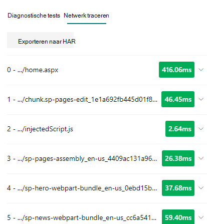

# Het hulpprogramma pagina diagnose voor SharePoint gebruikenUse the Page Diagnostics for SharePoint tool

In dit artikel wordt uitgelegd hoe u het **hulpprogramma pagina diagnose voor SharePoint** online kunt gebruiken voor het analyseren van de modern-en klassieke sitepagina's van SharePoint Online met een vooraf gedefinieerde set prestatiecriteria.This article describes how to use the **Page Diagnostics for SharePoint tool** to analyze SharePoint Online modern and classic site pages against a pre-defined set of performance criteria.

Het hulpprogramma pagina diagnose voor SharePoint kan worden geïnstalleerd voor:The Page Diagnostics for SharePoint tool can be installed for:

- **Microsoft Edge** [(Edge extension)](https://microsoftedge.microsoft.com/addons/detail/ocemkolpnamjcacndljdfmhlpcaoipji)**Microsoft Edge** [(Edge extension)](https://microsoftedge.microsoft.com/addons/detail/ocemkolpnamjcacndljdfmhlpcaoipji)
- **Chrome** [(chroom extensie)](https://chrome.google.com/webstore/detail/inahogkhlkbkjkkaleonemeijihmfagi)**Chrome** [(Chrome extension)](https://chrome.google.com/webstore/detail/inahogkhlkbkjkkaleonemeijihmfagi)

>[!TIP]
>Versie **2.0.0** en hoger biedt ondersteuning voor moderne pagina's, naast de klassieke sitepagina's.Version **2.0.0** and later includes support for modern pages in addition to classic site pages. Als u niet zeker weet welke versie van het hulpprogramma u gebruikt, kunt u de koppeling **info** of het beletselteken (...) selecteren om uw versie te verifiëren.If you are unsure which version of the tool you are using, you can select the **About** link or the ellipses (...) to verify your version. **Altijd bijwerken naar de meest recente versie** wanneer u de functie gebruikt.**Always update to the latest version** when using the tool.

Het hulpprogramma pagina diagnose voor SharePoint is een browser extensie voor de nieuwe Microsoft Edge- https://www.microsoft.com/edge) en Chrome-browsers die zowel SharePoint Online modern portal als de klassieke publicatiesite pagina's analyseren.The Page Diagnostics for SharePoint tool is a browser extension for the new Microsoft Edge (https://www.microsoft.com/edge) and Chrome browsers that analyzes both SharePoint Online modern portal and classic publishing site pages. Dit hulpprogramma werkt alleen voor SharePoint Online en kan niet worden gebruikt op een SharePoint-systeempagina.This tool only works for SharePoint Online, and cannot be used on a SharePoint system page.

Met het hulpprogramma wordt een rapport gegenereerd voor elke geanalyseerde pagina op basis van de manier waarop de pagina wordt uitgevoerd met een vooraf gedefinieerde set regels en gedetailleerde informatie wordt weergegeven wanneer resultaten van een test buiten de waarde van de basislijn vallen.The tool generates a report for each analyzed page showing how the page performs against a pre-defined set of rules and displays detailed information when results for a test fall outside the baseline value. Beheerders van SharePoint Online kunnen het hulpprogramma gebruiken voor het oplossen van prestatieproblemen en om ervoor te zorgen dat nieuwe pagina's worden geoptimaliseerd voordat ze worden gepubliceerd.SharePoint Online administrators and designers can use the tool to troubleshoot performance issues and to ensure that new pages are optimized prior to publishing.

Het hulpprogramma voor het automatisch toevoegen van pagina's is bedoeld voor het analyseren van alleen SharePoint-sitepagina's, niet over systeem pagina's zoals *AllItems. aspx* of *SharePoint. aspx*.The Page Diagnostics tool is designed to analyze SharePoint site pages only, not system pages such as *allitems.aspx* or *sharepoint.aspx*. Als u het hulpprogramma probeert uit te voeren op een systeempagina of een andere niet-sitepagina, wordt een foutbericht weergegeven met de mededeling dat het programma niet kan worden uitgevoerd voor dit type pagina.If you attempt to run the tool on a system page or any other non-site page, you will receive an error message advising that the tool cannot be run for that type of page.

Dit is geen fout in het hulpprogramma omdat er geen waarde is in de beoordeling van bibliotheken of systeem pagina's.This is not an error in the tool as there is no value in assessing libraries or system pages. Ga naar de pagina van een SharePoint-site om het hulpmiddel te gebruiken.Please navigate to a SharePoint site page to use the tool. Als deze fout optreedt op een SharePoint-pagina, raadpleegt u de basispagina om ervoor te zorgen dat de metatags van SharePoint niet zijn verwijderd.If this error occurs on a SharePoint page, please check the master page to ensure that the SharePoint metatags have not been removed.

Als u feedback wilt geven over het hulpmiddel, selecteert u het beletselteken in de rechterbovenhoek van het hulpmiddel en selecteert u [feedback geven](https://go.microsoft.com/fwlink/?linkid=874109).To provide feedback about the tool, select the ellipsis at the top right corner of the tool and then select [Give feedback](https://go.microsoft.com/fwlink/?linkid=874109).

  
## Het hulpprogramma pagina diagnose voor SharePoint installerenInstall the Page Diagnostics for SharePoint tool

De installatieprocedure in deze sectie is geschikt voor de browsers Chrome en Microsoft Edge.The installation procedure in this section will work for both the Chrome and Microsoft Edge browsers.

> [!IMPORTANT]
> Microsoft leest geen gegevens of pagina-inhoud die wordt geanalyseerd via het hulpprogramma pagina diagnose voor SharePoint, en we vastleggen geen persoonlijke gegevens, website of downloadinformatie.Microsoft does not read data or page content that is analyzed by the Page Diagnostics for SharePoint tool, and we do not capture any personal information, website or download information. De enige identificeerbare informatie die bij Microsoft is aangemeld, is de naam van de Tenant, het aantal regels dat mislukt en de datum en tijd waarop het hulpprogramma is uitgevoerd.The only identifiable information logged to Microsoft by the tool is the tenant name, counts of rules that have failed and the date and time the tool was run. Deze informatie wordt door Microsoft gebruikt om beter inzicht te krijgen in de moderne Portal en trends van de publicatie van sites en de meest voorkomende prestatieproblemen.This information is used by Microsoft to better understand modern portal and publishing site usage trends and common performance issues.

1. Installeer het hulpprogramma voor het maken van diagnostische gegevens voor SharePoint voor **Microsoft Edge** [(Edge extension)](https://microsoftedge.microsoft.com/addons/detail/ocemkolpnamjcacndljdfmhlpcaoipji) of **Chrome** [(Chrome)](https://chrome.google.com/webstore/detail/inahogkhlkbkjkkaleonemeijihmfagi).Install the Page Diagnostics for SharePoint tool for **Microsoft Edge** [(Edge extension)](https://microsoftedge.microsoft.com/addons/detail/ocemkolpnamjcacndljdfmhlpcaoipji) or **Chrome** [(Chrome extension)](https://chrome.google.com/webstore/detail/inahogkhlkbkjkkaleonemeijihmfagi). Kijk op de paginabeschrijving van de Store naar het privacybeleid van de gebruiker.Please review the User Privacy Policy provided on the description page in the store. Wanneer u het hulpprogramma toevoegt aan uw browser, ziet u de volgende kennisgeving.When adding the tool to your browser, you will see the following permissions notice.

    

    Deze kennisgeving is bedoeld voor omdat een pagina inhoud kan bevatten van locaties buiten SharePoint, afhankelijk van de webonderdelen en aanpassingen op de pagina.This notice is in place because a page may contain content from locations outside of SharePoint depending on the web parts and customizations on the page. Dit houdt in dat het hulpmiddel de verzoeken en antwoorden leest wanneer op de startknop is geklikt en alleen voor het actieve SharePoint-tabblad waarop het hulpprogramma wordt uitgevoerd.This means that the tool will read the requests and responses when the start button is clicked and only for the active SharePoint tab where the tool is running. Deze informatie wordt lokaal vastgelegd door de webbrowser en is voor u beschikbaar via de knop **exporteren naar JSON** of **exporteren naar har** op het tabblad _netwerktracering_ van het hulp **middel.**This information is captured locally by the web browser and is available to you via the **Export to JSON** or **Export to HAR** button in the tool's _Network trace_ tab. **The information is not sent to or captured by Microsoft.** (Het programma houdt rekening met het door u [toegankelijke micro](https://go.microsoft.com/fwlink/p/?linkid=857875)Soft-privacybeleid.)(The tool respects the Microsoft privacy policy accessible [here](https://go.microsoft.com/fwlink/p/?linkid=857875).)

    De machtiging _uw downloads beheren_ betreft de werking van de **export naar JSON** -functionaliteit van het hulpmiddel.The _Manage your downloads_ permission covers use of the tool's **Export to JSON** functionality. Volg de eigen richtlijnen van uw bedrijf voordat u het JSON-bestand deelt buiten uw organisatie, aangezien het resultaat Url's bevat en dat kan worden geclassificeerd als PII (persoonlijk identificeerbare informatie).Please follow your company's own privacy guidelines before sharing the JSON file outside of your organization, as the results contain URLs and that can be classified as PII (Personally Identifiable Information).
1. Als u het hulpprogramma wilt gebruiken in de Incognito of de InPrivate-modus, volgt u de procedure voor uw browser:If you want to use the tool in Incognito or InPrivate mode, follow the procedure for your browser:
    1. Ga in Microsoft Edge naar **extensies** of typ _Edge://Extensions_ in de URL-balk en selecteer **Details** voor de extensie.In Microsoft Edge, navigate to **Extensions** or type _edge://extensions_ in the URL bar and select **Details** for the extension. Selecteer in de instellingen voor toestel het selectievakje **toestaan in InPrivate**.In the extension settings, select the checkbox for **allow in InPrivate**.
    1. Ga in Chrome naar **extensies** of typ _Chrome://Extensions_ in de URL-balk en selecteer **Details** voor de extensie.In Chrome, navigate to **Extensions** or type _chrome://extensions_ in the URL bar and select **Details** for the extension. Selecteer in de instellingen voor extensies de schuifregelaar voor **toestaan in incognito**.In the extension settings, select the slider for **allow in Incognito**.
1. Ga naar de pagina van de SharePoint-site in SharePoint Online die u wilt beoordelen.Navigate to the SharePoint site page on SharePoint Online that you would like to review. Voor het ' uitstellen ' van items op pagina's is toegestaan. dat betekent dat het hulpmiddel niet automatisch wordt gestopt (dit is door ontwerp geschikt voor het laden van de pagina's).We have allowed for "delay loading" of items on pages; therefore, the tool will not stop automatically (this is by design to accommodate all page load scenarios). Als u wilt stoppen met verzamelen, selecteert u **stoppen**.To stop collection, select **Stop**. Zorg ervoor dat de geladen pagina is voltooid voordat u de gegevensverzameling stopt of dat u alleen een gedeeltelijke tracering gaat vastleggen.Make sure that the page load has completed before you stop data collection or you will only capture a partial trace.
1. Klik op de werkbalk van de uitbreidingClick on the extension's toolbar button  Als u het hulpprogramma wilt laden, wordt dit weergegeven in de volgende pop-upvenster met extensies:to load the tool and you will be presented with the following extension popup window:

    

Selecteer **starten** om te beginnen met het verzamelen van gegevens voor analyse.Select **Start** to begin collecting data for analysis.

## Wat u ziet in het hulpprogramma pagina diagnose voor SharePointWhat you'll see in the Page Diagnostics for SharePoint tool

1. Klik op de drie puntjes (...) in de rechterbovenhoek van het hulpmiddel om de volgende koppelingen te vinden:Click the ellipses (...) in the top right corner of the tool to find the following links:
   1. De koppeling **extra resources** bevat algemene richtlijnen en Details over het hulpmiddel, waaronder een koppeling terug naar dit artikel.The **Additional resources** link provides general guidance and details regarding the tool including a link back to this article.
   1. De koppeling **feedback geven** biedt een koppeling naar de Voice site van de _SharePoint-sites en-samenwerkings gebruikers_ .The **Give feedback** link provides a link to the _SharePoint Sites and Collaboration User Voice_ site.
   1. De koppeling **info** bevat de momenteel geïnstalleerde versie van het hulpprogramma en een directe koppeling naar het programma van derden.The **About** link includes the currently installed version of the tool and a direct link to the tool's third party notice.  
1. De **correlatie-id, SPRequestDuration, SPIISLatency**, **pagina laadtijd**en **URL** -Details zijn informatie en kunnen voor enkele redenen worden gebruikt.The **Correlation ID, SPRequestDuration, SPIISLatency**, **Page load time**, and **URL** details are informational and can be used for a few purposes.

    

   - **CorrelationID** is een belangrijk element wanneer u werkt met Microsoft-ondersteuning, zodat ze extra diagnostische gegevens voor de specifieke pagina kunnen verzamelen.**CorrelationID** is an important element when working with Microsoft Support as it allows them to gather additional diagnostic data for the specific page.
   - **SPRequestDuration** is de tijd die voor SharePoint wordt gebruikt om de pagina te verwerken.**SPRequestDuration** is the time taken for SharePoint to process the page. Met structurele navigatie, grote afbeeldingen en vele API-gesprekken kunnen alle bijdragen langer duren.Structural navigation, large images, lots of API calls could all contribute to longer durations.
   - **SPIISLatency** is de tijd in milliseconden voor SharePoint Online, met het laden van de pagina.**SPIISLatency** is the time in milliseconds taken for SharePoint Online begin loading the page. Met deze waarde wordt het tijdstip niet opgenomen dat de webtoepassing heeft gereageerd.This value does not include the time taken for the web application to respond.
   - **Laadtijd voor pagina's** is de totale tijd die door de pagina wordt weergegeven vanaf het moment dat de aanvraag is ontvangen en weergegeven in de browser.**Page load time** is the total time recorded by the page from the time of the request to the time the response was received and rendered in the browser. Deze waarde is van invloed op diverse factoren, waaronder netwerklatentie, de prestaties van de computer en de tijd die het duurt voor de browser om de pagina te laden.This value is affected by a variety of factors including network latency, the performance of the computer and the time it takes for the browser to load the page.
   - De **pagina-URL** (Uniform Resource Locator) is het webadres van de huidige pagina.The **Page URL** (Uniform Resource Locator) is the web address of the current page.

1. Op het tabblad [**diagnostische tests**](#how-to-use-the-diagnostic-tests-tab) worden de resultaten van de analyse in drie categorieën weergegeven. U hebt **geen actie nodig**, verbeteringen van de **verbeteringen** en de **aandacht vereist**.The [**Diagnostic tests**](#how-to-use-the-diagnostic-tests-tab) tab displays the analysis results in three categories; **No action required**, **Improvement opportunities** and **Attention required**. Elk testresultaat wordt weergegeven door een item in een van deze categorieën, zoals beschreven in de volgende tabel:Each test result is represented by an item in one of these categories as described in the following table:

    |CategorieCategory  |KleurColor  |BeschrijvingDescription  |
    |---------|---------|---------|
    |**Aandacht vereist****Attention required** |RGBRed |Test resultaat valt buiten de waarde van de basislijn en is van invloed op de prestaties van pagina's.Test result falls outside the baseline value and is affecting page performance. Volg de instructies voor herstel.Follow remediation guidance.|
    |**Verbeterings mogelijkheden****Improvement opportunities** |GemarkeerdYellow |Test resultaat valt buiten de waarde van de basislijn en kan bijdragen aan de prestatieproblemen.Test result falls outside the baseline value and could be contributing to performance issues. U kunt criteria van de test toepassen.Test-specific criteria may apply.|
    |**Geen actie vereist****No action required** |GroeneGreen |Testresultaat valt binnen de waarde van de basislijn van de test.Test result falls within the test's baseline value.|

    

1. Het tabblad [**netwerktracering**](#how-to-use-the-network-trace-tab) bevat details over het maken van verzoeken en antwoorden voor pagina's.A [**Network trace**](#how-to-use-the-network-trace-tab) tab provides details about page build requests and responses.

## Het tabblad diagnostische tests gebruikenHow to use the Diagnostic tests tab

Wanneer u een pagina met een moderne SharePoint-Portal pagina of een klassieke publicatiesite controleert met behulp van het hulpprogramma pagina diagnose voor SharePoint, worden de resultaten geanalyseerd met behulp van vooraf gedefinieerde regels waarmee de resultaten worden vergeleken met basislijnwaarden en worden weergegeven op het tabblad **diagnostische tests** . voor regels voor bepaalde tests worden verschillende waarden voor de prestaties gebruikt, afhankelijk van de twee.When you analyze a SharePoint modern portal page or classic publishing site page with the Page Diagnostics for SharePoint tool, results are analyzed using pre-defined rules that compare results against baseline values and displayed in the **Diagnostic tests** tab. Rules for certain tests may use different baseline values for modern portal and classic publishing sites depending on how specific performance characteristics differ between the two.

Test resultaten die worden weergegeven in de categorie verduidelijkings **mogelijkheden** of aandacht voor de **vereiste** categorieën geven gebieden aan die moeten worden gecontroleerd tegen aanbevolen procedures, en kunnen worden geselecteerd om aanvullende informatie over het resultaat weer te geven.Test results that appear in the **Improvement opportunities** or **Attention required** categories indicate areas that should be reviewed against recommended practices, and can be selected to display additional information about the result. Details voor elk item bevat een koppeling voor meer _informatie_ waarmee u rechtstreeks naar de juiste richtlijnen met betrekking tot de test gaat.Details for each item include a _Learn more_ link which will take you directly to the appropriate guidance related to the test. Test resultaten die worden weergegeven in de **vereiste categorie geen actie** aangeven de naleving met de relevante regel aangeven en geen extra details weergeven wanneer deze optie is geselecteerd.Test results that appear in the **No action required** category indicate compliance with the relevant rule and do not display additional details when selected.

Met de gegevens op het tabblad diagnostische tests wordt u niet gewaarschuwd dat u pagina's ontwerpt, maar u kunt ook factoren markeren die van invloed kunnen zijn op de prestaties van pagina's.The information in the Diagnostics tests tab will not tell you how to design pages, but will highlight factors that may impact page performance. De werking van bepaalde pagina's en aanpassingen van pagina's hebben een onvermijdbare impact op de pagina-prestaties en moet worden gecontroleerd op mogelijke herstel of afkeuring van de pagina als de invloed hiervan is.Some page functionality and customizations have an unavoidable impact on page performance, and should be reviewed for potential remediation or omission from the page if their impact is substantial.

Met rode of gele resultaten kunnen ook webonderdelen worden aangegeven die gegevens te vaak vernieuwen.Red or yellow results may also indicate web parts that refresh data too frequently. Bedrijfsnieuws wordt bijvoorbeeld niet elk seconde bijgewerkt, maar aangepaste webonderdelen worden vaak gebouwd om het laatste nieuws van elke seconde te verkrijgen in plaats van de functies voor het opslaan van de algehele gebruikerservaring.For example, corporate news is not updated every second but custom web parts are often built to fetch the latest news every second instead of implementing caching elements that could improve the overall user experience. Houd er rekening mee wanneer u webonderdelen op een pagina opneemt, wat vaak eenvoudige manieren zijn om de gevolgen van de prestaties te verlagen door de waarde van de beschikbare parameters te beoordelen om te zorgen dat deze correct wordt ingesteld voor het beoogde doel.Keep in mind when including web parts on a page that there are often simple ways to reduce their performance impact by evaluating the value of each available parameter to ensure it is set appropriately for its intended purpose.

>[!NOTE]
>Klassieke team sites waarvan de publicatiefunctie niet is ingeschakeld, kunnen gebruikmaken van Cdn's.Classic team sites that don't have the publishing feature enabled cannot make use of CDNs. Wanneer u het hulpprogramma op deze sites uitvoert, wordt de CDN-test naar verwachting mislukt en kan deze worden genegeerd, maar alle resterende tests zijn van toepassing.When you run the tool on these sites, the CDN test is expected to fail and can be ignored, but all of the remaining tests are applicable. De extra functionaliteit van de SharePoint-publicatiefunctie kan het laden van pagina's vergroten, zodat het niet hoeft te worden ingeschakeld om de CDN-functionaliteit toe te staan.The additional functionality of the SharePoint publishing feature can increase page load times, so it should not be enabled just to allow CDN functionality.

>[!IMPORTANT]
>Test regels worden regelmatig toegevoegd en bijgewerkt, zodat u de nieuwste versie van het hulpmiddel kunt raadplegen voor informatie over de huidige regels en specifieke informatie die in testresultaten wordt opgenomen.Test rules are added and updated regularly so please refer to the latest version of the tool for details about current rules and specific information included in test results. U kunt de versie controleren door uw extensies te beheren en de extensie zal u adviseren of er een update beschikbaar is.You can verify the version by managing your extensions and the extension will advise whether an update is available.

## Het tabblad netwerktracering gebruikenHow to use the Network Trace tab

Het tabblad **netwerktracering** bevat gedetailleerde informatie over beide aanvragen om de pagina samen te stellen en de antwoorden te ontvangen van SharePoint.The **Network Trace** tab provides detailed information about both requests to build the page and the responses received from SharePoint.

1. **Let op het aantal laadtijden voor items met een rode vlag**.**Look for item load times flagged as red**. Elke aanvraag en reactie heeft een kleurcode, zodat de invloed op de prestaties van de algemene pagina wordt aangegeven met de volgende latentie gegevens:Each request and response is color coded to indicate its impact on overall page performance using the following latency metrics:
    - Groen: \< 500msGreen: \< 500ms
    - Geel: 500-1000msYellow: 500-1000ms
    - Rood: \> 1000msRed: \> 1000ms

    

    In de afbeelding die hierboven wordt weergegeven, is het rode item betrekking op de standaardpagina.In the image shown above, the red item pertains to the default page. De weergave wordt altijd rood weergegeven, tenzij de pagina wordt geladen in \< 1000ms (minder dan 1 seconde).It will always show red unless the page loads in \< 1000ms (less than 1 second).

2. **Laadtijden van items testen**.**Test item load times**. In sommige gevallen wordt er geen tijd of kleur indicator weergegeven omdat de items al zijn opgeslagen in de cache van de browser.In some cases there will be no time or color indicator because the items have already been cached by the browser. Als u dit correct wilt testen, opent u de pagina, schakelt u de cache van de browser uit en klikt u vervolgens op **Start** als die een ' koud ' pagina laadt, en moet de eerste pagina wordt geladen.To test this correctly, open the page, clear browser cache, and then click **Start** as that will force a "cold" page load and be a true reflection of the initial page load. Vervolgens wordt dit vergeleken met de ' warme ' pagina laden, zodat u kunt bepalen welke items in de cache op de pagina worden opgeslagen.This should then be compared to the "warm" page load as that will also help determine what items are being cached on the page.

3. **Deel relevante gegevens met anderen die u kunnen helpen om problemen te onderzoeken**.**Share relevant details with others who can help investigate issues**. Als u de details of informatie in het hulpprogramma wilt delen met uw ontwikkelaars of een technische ondersteunings persoon, klikt u op **exporteren naar JSON** (zoals weergegeven in de bovenstaande afbeelding).To share the details or information provided in the tool with your developers or a technical support person, click **Export to JSON** (as shown in the image above). U kunt de resultaten ook downloaden met een JSON-bestands viewer.That will enable you to download the results, viewable with a JSON file viewer.

    Als u ervoor hebt gekozen om de functie *exporteren in te schakelen naar har* , wordt het export type weergegeven als **export naar har**.If you have opted to use the preview feature *enable Export to HAR* then the export type will show as **Export to HAR**.

    

> [!IMPORTANT]
> Deze resultaten bevatten Url's en deze kunnen worden geclassificeerd als PII (persoonlijk identificeerbare informatie).These results contain URLs and that can be classified as PII (Personally Identifiable Information). Zorg ervoor dat u de richtlijnen van de organisatie hebt gevolgd voordat u deze informatie distribueert.Make sure to follow your organization's guidelines before distributing that information.

## Oefenen met Microsoft ondersteuningEngaging with Microsoft Support

We hebben een **functie voor ondersteuning van Microsoft-ondersteuningsniveau** opgenomen die alleen mag worden gebruikt wanneer ze rechtstreeks aan een ondersteunings zaak werken.We have included a **Microsoft Support level feature** that should only be utilized when working directly on a support case. Wanneer u deze functie gebruikt, kunt u niet alleen gebruikmaken van de ondersteuning van het team en kunt u de pagina aanzienlijk trager maken.Utilizing this feature will provide no benefit to you when used without support team engagement, and can make the page perform significantly slower. Er is geen extra informatie wanneer u deze functie gebruikt in het hulpmiddel als de aanvullende informatie wordt toegevoegd aan de logboekregistratie in de service.There is no additional information when using this feature in the tool as the additional information is added to the logging in the service.

Er is geen wijziging zichtbaar, behalve dat u een melding krijgt dat u deze hebt ingeschakeld en dat de pagina prestaties aanzienlijk worden verminderd door 2-3 wanneer dit is ingeschakeld.No change is visible except that you will be notified that you have enabled it and your page performance will be significantly degraded by 2-3 times slower performance whilst enabled. Het is alleen van toepassing op de desbetreffende pagina en de actieve sessie.It will only be relevant for the particular page and that active session. Daarom dient dit spaarzaam te worden gebruikt, maar alleen wanneer de ondersteuning actief is.For this reason, this should be used sparingly and only when actively engaged with support.

### De functie Microsoft-ondersteuningsniveau inschakelenTo enable the Microsoft Support level feature

1. Open het hulpprogramma pagina diagnose voor SharePoint.Open the Page Diagnostics for SharePoint tool.
2. Druk op het toetsenbord op **ALT + SHIFT + L**.On your keyboard, press **ALT-Shift-L**. Hiermee wordt het selectievakje **ondersteuning voor logboekregistratie inschakelen** weergegeven.This will display the **Enable support logging** check box.
3. Schakel het selectievakje in en klik op **starten** om de pagina opnieuw te laden en uitgebreide logboekregistratie te genereren.Select the check box, and then click **Start** to reload the page and generate verbose logging.

    
  
    Let op de CorrelationID (weergegeven aan de bovenkant van de tool) en geef deze aan uw ondersteuningsmedewerker zodat ze aanvullende informatie over de diagnostische sessie kunnen verzamelen.You should note the CorrelationID (displayed at the top of the tool) and provide it to your support representative to enable them to gather additional information about the diagnostic session.

## Verwante onderwerpenRelated topics

[Prestaties van SharePoint Online afstemmenTune SharePoint Online performance](tune-sharepoint-online-performance.md)

[Prestaties van Office 365 afstemmenTune Office 365 performance](tune-microsoft-365-performance.md)

[Prestaties in de moderne SharePoint-ervaringPerformance in the modern SharePoint experience](https://docs.microsoft.com/sharepoint/modern-experience-performance)

[Netwerken voor content leveringContent delivery networks](content-delivery-networks.md)

[Het Office 365 Content Delivery Network (CDN) gebruiken met SharePoint OnlineUse the Office 365 Content Delivery Network (CDN) with SharePoint Online](use-microsoft-365-cdn-with-spo.md)
