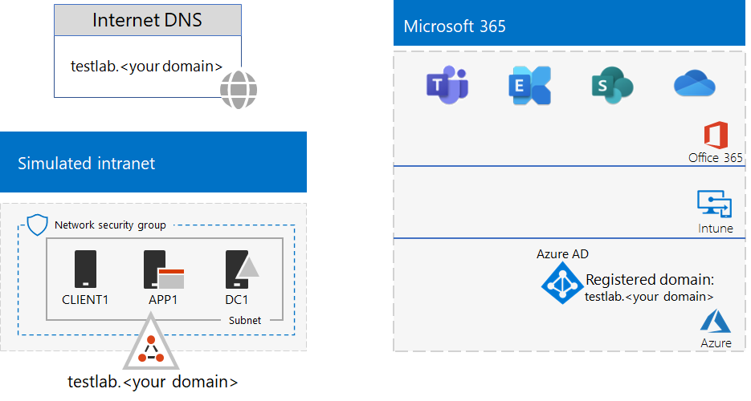

# <a name="password-hash-synchronization-for-your-microsoft-365-test-environment"></a>Wachtwoord-hash-synchronisatie voor uw Microsoft 365-testomgeving

*Deze testlaborator kan worden gebruikt voor zowel Microsoft 365 voor bedrijven als Office 365 Enterprise testomgevingen.*

Veel organisaties maken gebruik van Azure AD Connect en wachtwoord-hash-synchronisatie om de accounts in hun AD DS-forest (Active Directory Domain Services) op locatie te synchroniseren met de accounts in de Azure AD-tenant van hun Microsoft 365-abonnement. 

In dit artikel wordt beschreven hoe u wachtwoordhashsynchronisatie kunt toevoegen aan uw Microsoft 365 testomgeving, wat resulteert in deze configuratie:
  

  
Het instellen van deze testomgeving bestaat uit drie fasen:
- [Fase 1: De Microsoft 365-testomgeving voor een gesimuleerde onderneming maken](#phase-1-create-the-microsoft-365-simulated-enterprise-test-environment)
- [Fase 2: Het testlab-domein maken en registreren](#phase-2-create-and-register-the-testlab-domain)
- [Fase 3: Azure AD Connect op APP1 installeren](#phase-3-install-azure-ad-connect-on-app1)
    
> [!TIP]
> Voor een visuele kaart van alle artikelen in de Microsoft 365 voor enterprise Test Lab Guide stack, gaat u naar Microsoft 365 voor [enterprise Test Lab Guide Stack.](../downloads/Microsoft365EnterpriseTLGStack.pdf)
  
## <a name="phase-1-create-the-microsoft-365-simulated-enterprise-test-environment"></a>Fase 1: De Microsoft 365-testomgeving voor een gesimuleerde onderneming maken

Volg de instructies in [Basisconfiguratie voor gesimuleerde onderneming in Microsoft 365](simulated-ent-base-configuration-microsoft-365-enterprise.md). De resulterende configuratie ziet er als volgende uit:
  

  
Deze configuratie bestaat uit:
  
- Een proef- of betaald abonnement op Microsoft 365 E5.
- Een vereenvoudigd intranet van de organisatie dat is verbonden met internet, bestaande uit de virtuele DC1-, APP1- en CLIENT1-machines in een virtueel Azure-netwerk. DC1 is een domeincontroller voor het testlab.<*uw openbare* domeinnaam> AD DS-domein.

## <a name="phase-2-create-and-register-the-testlab-domain"></a>Fase 2: Het testlab-domein maken en registreren

Voeg in deze fase een openbaar DNS-domein toe en voeg het vervolgens toe aan uw abonnement.

Werk eerst samen met uw openbare DNS-registratieprovider om een nieuwe openbare DNS-domeinnaam te maken die is gebaseerd op uw huidige domeinnaam en voeg deze vervolgens toe aan uw abonnement. Het is raadzaam om de naam **testlab.<*uw openbare domein te gebruiken.* >** Als uw openbare domeinnaam bijvoorbeeld **<span>contoso</span>.com** is, voegt u de openbare domeinnaam toe: **<span>testlab</span>.contoso.com.**
  
Voeg vervolgens het **testlab.< >** uw openbare domeindomein toe aan uw Microsoft 365 proefabonnement of betaald abonnement door het domeinregistratieproces te doorlopen. Dit bestaat uit het toevoegen van extra DNS-records aan het **testlab.<*uw openbare domeindomein.* >** Zie Een domein toevoegen [aan Microsoft 365.](../admin/setup/add-domain.md)

De resulterende configuratie ziet er als volgende uit:
  

  
Deze configuratie bestaat uit:

- Een Microsoft 365 E5 of betaald abonnement met het DNS-domein testlab.<*uw openbare* domeinnaam> geregistreerd.
- Een vereenvoudigd intranet van de organisatie dat is verbonden met internet, bestaande uit de virtuele DC1-, APP1- en CLIENT1-machines op een subnet van een virtueel Azure-netwerk.

U ziet hoe het testlab.<*uw openbare* domeinnaam> nu is:

- Ondersteund wordt door openbare DNS-records.
- Geregistreerd is in de Microsoft 365-abonnementen.
- Het AD DS-domein op uw gesimuleerde intranet is.
     
## <a name="phase-3-install-azure-ad-connect-on-app1"></a>Fase 3: Azure AD Connect op APP1 installeren

In deze fase installeert en configureert u de Azure AD Verbinding maken app1 en controleert u of het werkt.
  
Installeer eerst Azure AD-Verbinding maken op APP1.

1. Ga naar het [Azure-portal](https://portal.azure.com), meld u aan met uw globale beheerdersaccount en maak vervolgens verbinding met APP1 via het TESTLAB\\Gebruiker1-account.
    
2. Open, vanaf het bureaublad van APP1, een Windows PowerShell-opdrachtprompt op beheerdersniveau en voer deze opdrachten uit om verbeterde beveiliging van Internet Explorer uit te schakelen:
    
   ```powershell
   Set-ItemProperty -Path "HKLM:\SOFTWARE\Microsoft\Active Setup\Installed Components\{A509B1A7-37EF-4b3f-8CFC-4F3A74704073}" -Name "IsInstalled" -Value 0
   Set-ItemProperty -Path "HKLM:\SOFTWARE\Microsoft\Active Setup\Installed Components\{A509B1A8-37EF-4b3f-8CFC-4F3A74704073}" -Name "IsInstalled" -Value 0
   Stop-Process -Name Explorer -Force
   ```

3. Selecteer Internet **Explorer** op de taakbalk en ga naar [https://aka.ms/aadconnect](https://aka.ms/aadconnect) .
    
4. Selecteer op Microsoft Azure Active Directory Verbinding maken pagina **Downloaden** en selecteer vervolgens **Uitvoeren.**
    
5. Selecteer op **de pagina Welkom bij Azure AD Verbinding maken** ik ga akkoord en selecteer vervolgens **Doorgaan.** 
    
6. Selecteer op **de Instellingen** Express-instellingen **gebruiken.**
    
7. Voer op **Verbinding maken pagina Naar Azure AD** de naam van uw globale beheerdersaccount in Gebruikersnaam **in,** voer het wachtwoord **in** Wachtwoord in en selecteer **Volgende.**
    
8. Voer op **Verbinding maken pagina NAAR AD DS** **TESTLAB \\ User1** in **Gebruikersnaam in,** voer het wachtwoord **in** Wachtwoord in en selecteer **Volgende.**
    
9. Selecteer installeren **op de pagina** Gereed om te **configureren.**
    
10. Selecteer op **de pagina Configuratie** voltooid de optie **Afsluiten.**
    
11. Ga in Internet Explorer naar het Microsoft 365-beheercentrum ([https://portal.microsoft.com](https://portal.microsoft.com)).
    
12. Selecteer in het linkernavigatiedeelvenster **Gebruikers > Actieve gebruikers.**
    
    Bekijk het account met de naam **Gebruiker1**. Dit account is afkomstig uit het TESTLAB AD DS-domein en is het bewijs dat de adreslijstsynchronisatie heeft gewerkt.
    
13. Selecteer het **User1-account** en selecteer vervolgens **Licenties en apps.**
    
14. In **Productlicenties**, selecteert u uw locatie (indien nodig), schakelt u de **Office 365 E5-licentie** uit en schakelt u de Microsoft 365 E5 **in.** 

15. Selecteer **Opslaan** onder aan de pagina en selecteer **sluiten.**
    
Test vervolgens de mogelijkheid om u aan te melden bij uw abonnement met **user1@testlab.< >** domeinnaam van het Gebruikers1-account:

1. Meld u af bij APP1 en meld u weer aan met een ander account.

2. Wanneer u wordt gevraagd om een gebruikersnaam en wachtwoord, geeft **u user1@testlab.<*domeinnaam* >** en het gebruikers1-wachtwoord op. U moet u nu kunnen aanmelden als Gebruiker1.
 
Zoals u ziet, heeft Gebruiker1 de machtigingen van een domeinbeheerder voor het TESTLAB AD DS-domein, maar Gebruiker1 is geen globale beheerder. Daarom wordt het pictogram van de **Beheerder** niet weergegeven als optie. 

De resulterende configuratie ziet er als volgende uit:


Deze configuratie bestaat uit: 
  
- Microsoft 365 E5 of Office 365 E5-proefabonnement of betaalde abonnementen met het DNS-domein TESTLAB.<*uw* domeinnaam> geregistreerd.
- Een vereenvoudigd intranet van de organisatie dat is verbonden met internet, bestaande uit de virtuele DC1-, APP1- en CLIENT1-machines op een subnet van een virtueel Azure-netwerk. Azure AD Verbinding maken wordt uitgevoerd op APP1 om het TESTLAB AD DS-domein regelmatig te synchroniseren met de Azure AD-tenant van uw Microsoft 365 abonnement.
- Het Gebruiker1-account in het TESTLAB AD DS-domein is gesynchroniseerd met de Azure AD-tenant.

## <a name="next-step"></a>Volgende stap

Verken aanvullende [identiteits](m365-enterprise-test-lab-guides.md#identity)functies en -mogelijkheden in uw testomgeving.

## <a name="see-also"></a>Zie ook

[Microsoft 365 Enterprise-testlabrichtlijnen](m365-enterprise-test-lab-guides.md)

[Overzicht van Microsoft 365 voor ondernemingen](microsoft-365-overview.md)

[Microsoft 365 enterprise-documentatie](/microsoft-365-enterprise/)