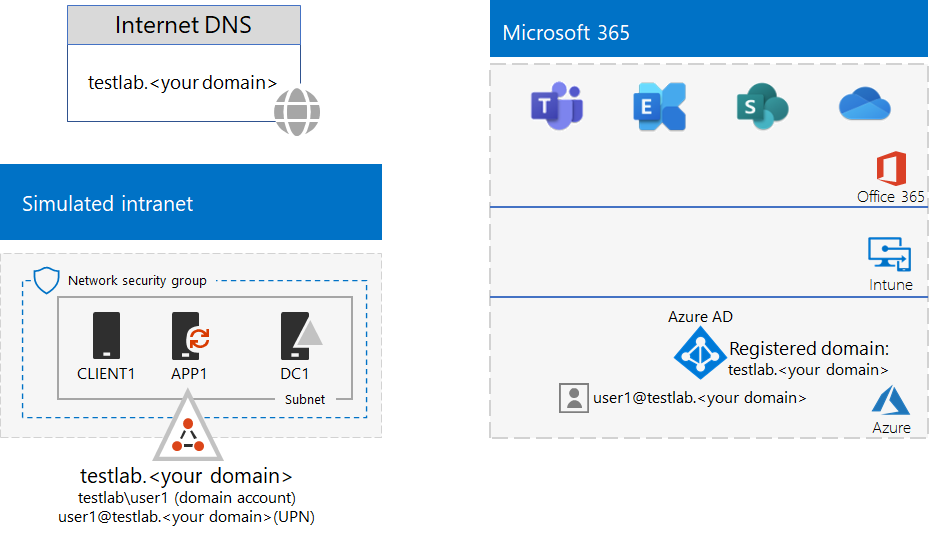

# <a name="password-hash-synchronization-for-your-microsoft-365-test-environment"></a>Wachtwoord-hash-synchronisatie voor uw Microsoft 365-testomgeving

*U kunt deze test lab-handleiding gebruiken voor zowel Microsoft 365 voor Enterprise als Office 365 Enterprise test omgevingen.*

Veel organisaties maken gebruik van Azure AD Connect en wachtwoord-hash-synchronisatie om de accounts in hun AD DS-forest (Active Directory Domain Services) op locatie te synchroniseren met de accounts in de Azure AD-tenant van hun Microsoft 365-abonnement. In dit artikel wordt beschreven hoe u uw Microsoft 365-testomgeving kunt configureren voor wachtwoord-hash-synchronisatie, met de volgende configuratie als resultaat:
  

  
Er zijn twee fasen om deze testomgeving in te stellen:
  
1. De Microsoft 365 Enterprise-testomgeving voor een gesimuleerde onderneming maken.
2. Azure AD Connect op APP1 installeren en configureren.
    
> [!TIP]
> Ga naar [Microsoft 365 for Enterprise test lab Guide](../media/m365-enterprise-test-lab-guides/Microsoft365EnterpriseTLGStack.pdf) for a Visual Maps to the the the microsoft 365 for Enterprise test lab Guide.
  
## <a name="phase-1-create-the-microsoft-365-simulated-enterprise-test-environment"></a>Fase 1: De Microsoft 365-testomgeving voor een gesimuleerde onderneming maken

Volg de instructies in [Basisconfiguratie voor gesimuleerde onderneming in Microsoft 365](simulated-ent-base-configuration-microsoft-365-enterprise.md). Dit is de resulterende configuratie.
  

  
Deze configuratie bestaat uit: 
  
- Een proef- of betaald abonnement op Microsoft 365 E5.
- Een vereenvoudigd intranet van de organisatie verbonden met internet en bestaande uit de virtuele machines DC1, APP1 en CLIENT1 in een virtueel Azure-netwerk. DC1 is een domeincontroller voor het testlab.\<your public domain name> AD DS-domein.

## <a name="phase-2-create-and-register-the-testlab-domain"></a>Fase 2: Het testlab-domein maken en registreren

In deze fase voegt u een openbaar DNS-domein toe en voegt u dit toe aan uw abonnement.

Werk eerst met uw openbare DNS-registratieprovider om een nieuwe openbare DNS-domeinnaam te maken op basis van uw huidige domeinnaam en deze toe te voegen aan uw abonnement. U wordt aangeraden de naam **testlab.**\<your public domain> te gebruiken. Als de naam van uw openbare domein bijvoorbeeld **<span>contoso</span>. com** is, voegt u de openbare domeinnaam **<span>testlab</span>.contoso.com** toe.
  
Vervolgens voegt u het **testlab.**\<your public domain>- domein naar uw proefabonnement voor Microsoft 365 of betaald abonnement door het domeinregistratie proces te passeren. Dit bestaat uit het toevoegen van extra DNS-records aan het **testlab.**\<your public domain>- domein. Zie voor meer informatie [een domein toevoegen aan Microsoft 365](../admin/setup/add-domain.md). 

Dit is de resulterende configuratie.
  

  
Deze configuratie bestaat uit:

- Een Microsoft 365 E5-proefabonnement of een betaald abonnement met de DNS-domein testlab.\<your public domain name> geregistreerd.
- Een vereenvoudigd intranet van de organisatie verbonden met internet en bestaande uit de virtuele machines DC1, APP1 en CLIENT1 op een subnet van een virtueel Azure-netwerk.

U ziet hoe de testlab.\<your public domain name> nu is:

- Ondersteund wordt door openbare DNS-records.
- Geregistreerd is in de Microsoft 365-abonnementen.
- Het AD DS-domein op uw gesimuleerde intranet is.
     
## <a name="phase-3-install-azure-ad-connect-on-app1"></a>Fase 3: Azure AD Connect op APP1 installeren

In deze fase installeert en configureert u het Azure AD Connect-hulpprogramma op APP1, waarna u controleert of dit werkt.
  
Eerst installeert en configureert u Azure AD Connect op APP1.

1. Ga naar het [Azure-portal](https://portal.azure.com), meld u aan met uw globale beheerdersaccount en maak vervolgens verbinding met APP1 via het TESTLAB\\Gebruiker1-account.
    
2. Open, vanaf het bureaublad van APP1, een Windows PowerShell-opdrachtprompt op beheerdersniveau en voer deze opdrachten uit om verbeterde beveiliging van Internet Explorer uit te schakelen:
    
   ```powershell
   Set-ItemProperty -Path "HKLM:\SOFTWARE\Microsoft\Active Setup\Installed Components\{A509B1A7-37EF-4b3f-8CFC-4F3A74704073}" -Name "IsInstalled" -Value 0
   Set-ItemProperty -Path "HKLM:\SOFTWARE\Microsoft\Active Setup\Installed Components\{A509B1A8-37EF-4b3f-8CFC-4F3A74704073}" -Name "IsInstalled" -Value 0
   Stop-Process -Name Explorer -Force
   ```

3. Klik in de taakbalk op **Internet Explorer** en ga naar [https://aka.ms/aadconnect](https://aka.ms/aadconnect).
    
4. Klik op de pagina Microsoft Azure Active Directory Connect op **Download** en klik vervolgens op **Uitvoeren**.
    
5. Klik op de pagina **Welkom bij Azure AD Connect** op **Ik ga akkoord** en vervolgens op **Volgende**.
    
6. Klik op de pagina **Express-instellingen** op **Express-instellingen gebruiken**.
    
7. Typ op de pagina **Verbinding maken met Azure AD** de naam van het globale beheerdersaccount in bij **Gebruikersnaam** en het wachtwoord bij **Wachtwoord** en klik vervolgens op **Volgende**.
    
8. Typ op de pagina **Verbinding maken met AD DS** **TESTLAB\\Gebruiker1** in bij **Gebruikersnaam,** het wachtwoord bij **Wachtwoord** en klik vervolgens op **Volgende**.
    
9. Klik op de pagina **Gereed voor configureren** op **Installeren**.
    
10. Klik op de pagina **Configuratie voltooid** op **Afsluiten**.
    
11. Ga in Internet Explorer naar het Microsoft 365-beheercentrum ([https://portal.microsoft.com](https://portal.microsoft.com)).
    
12. Selecteer **Gebruikers > Actieve gebruikers** op de linkernavigatiebalk.
    
    Bekijk het account met de naam **Gebruiker1**. Dit account is afkomstig uit het TESTLAB AD DS-domein en is het bewijs dat de adreslijstsynchronisatie heeft gewerkt.
    
13. Klik op het **Gebruiker1**-account en klik vervolgens op **Licenties en apps**.
    
14. Selecteer bij **Productlicenties** uw locatie (indien nodig), schakel de **Office 365 E5**-licentie uit en schakel de **Microsoft 365 E5**-licentie in. 

15. Klik onderaan de pagina op **Opslaan** en vervolgens op **Afsluiten**.
    
Test vervolgens of u zich kunt aanmelden bij uw abonnement met de gebruikersnaam <strong>gebruiker1@testlab.</strong>\<your domain name> van het gebruiker1-account.

1. Meld u af bij APP1 en meld u weer aan met een ander account.

2. Wanneer u om een gebruikersnaam en wachtwoord wordt gevraagd, typt u <strong>gebruiker1@testlab.</strong>\<your domain name> en het wachtwoord voor gebruiker1. U moet u nu kunnen aanmelden als Gebruiker1. 
 
Zoals u ziet, heeft Gebruiker1 de machtigingen van een domeinbeheerder voor het TESTLAB AD DS-domein, maar Gebruiker1 is geen globale beheerder. Daarom wordt het pictogram van de **Beheerder** niet weergegeven als optie. 

Dit is de resulterende configuratie.


Deze configuratie bestaat uit: 
  
- Een betaald of proefabonnement op Microsoft 365 E5 of Office 365 E5 met het DNS-domein TESTLAB.\<your domain name> geregistreerd.
- Een vereenvoudigd intranet van de organisatie verbonden met internet en bestaande uit de virtuele machines DC1, APP1 en CLIENT1 op een subnet van een virtueel Azure-netwerk. Azure AD Connect wordt uitgevoerd op APP1 om het AD DS-domein TESTLAB te synchroniseren met de Azure AD-tenant van uw Microsoft 365-abonnement.
- Het Gebruiker1-account in het TESTLAB AD DS-domein is gesynchroniseerd met de Azure AD-tenant.

## <a name="next-step"></a>Volgende stap

Verken aanvullende [identiteits](m365-enterprise-test-lab-guides.md#identity)functies en -mogelijkheden in uw testomgeving.

## <a name="see-also"></a>Zie ook

[Microsoft 365 Enterprise-testlabrichtlijnen](m365-enterprise-test-lab-guides.md)

[Overzicht van Microsoft 365 voor ondernemingen](microsoft-365-overview.md)

[Documentatie voor Microsoft 365 for Enterprise](https://docs.microsoft.com/microsoft-365-enterprise/)


