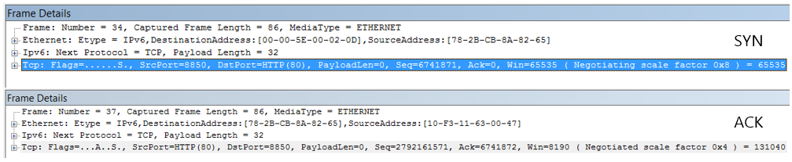

# <a name="performance-troubleshooting-plan-for-office-365"></a>Prestatieproblemen met Office 365 oplossen: planning

Wilt u weten welke stappen u moet ondernemen om vertragingen, vastlopen en trage prestaties tussen SharePoint Online, OneDrive voor Bedrijven, Exchange Online of Skype voor Bedrijven Online en uw clientcomputer te identificeren en op te lossen? Voordat u de ondersteuning belt, kan dit artikel u helpen Office 365 problemen met de prestaties op te lossen en zelfs enkele van de meest voorkomende problemen op te lossen.

Dit artikel is eigenlijk een voorbeeldactieplan dat u kunt gebruiken om waardevolle gegevens over uw prestatieprobleem vast te leggen terwijl dit gebeurt. Enkele belangrijke problemen zijn ook opgenomen in dit artikel.

Als u nieuw bent in netwerkprestaties en een plan voor de lange termijn wilt maken om de prestaties tussen uw clientapparaten en Office 365 te controleren, bekijkt u Office 365 prestatieafstemming en probleemoplossing - Beheerder en [IT-Pro.](performance-tuning-using-baselines-and-history.md)

## <a name="sample-performance-troubleshooting-action-plan"></a>Voorbeeld van een actieplan voor het oplossen van prestatieproblemen

Dit actieplan bevat twee onderdelen. een voorbereidingsfase en een registratiefase. Als u op dit moment een prestatieprobleem hebt en u gegevens moet verzamelen, kunt u dit abonnement meteen gebruiken.

### <a name="prepare-the-client-computer"></a>De clientcomputer voorbereiden

- Zoek een clientcomputer die het prestatieprobleem kan reproduceren. Deze computer wordt gebruikt tijdens het oplossen van problemen.
- Schrijf de stappen op die ervoor zorgen dat het prestatieprobleem zich voordeed, zodat u klaar bent wanneer het tijd is om te testen.
- Hulpprogramma's installeren voor het verzamelen en opnemen van informatie:
  - Installeer [Netmon 3.4](https://www.microsoft.com/download/details.aspx?id=4865) (of gebruik een vergelijkbaar hulpprogramma voor netwerktracing).
  - Installeer de gratis Basic Edition van [HTTPWatch](https://www.httpwatch.com/download/) (of gebruik een vergelijkbaar hulpprogramma voor netwerktracing).
  - Gebruik een schermrecorder of voer de stappenrecorder (PSR.exe) uit die wordt geleverd bij Windows Vista en hoger, om een record te houden van de stappen die u tijdens het testen ondernomen hebt.

### <a name="log-the-performance-issue"></a>Het prestatieprobleem melden

- Sluit alle overbodige internetbrowsers.
- Start de stappenrecorder of een andere schermrecorder.
- Start uw Netmon-opname (of hulpprogramma voor netwerktracing).
- U kunt uw DNS-cache op de clientcomputer wissen vanaf de opdrachtregel door ipconfig /flushdns te typen.
- Start een nieuwe browsersessie en schakel HTTPWatch in.
- Optioneel: Als u een Exchange Online test, kunt u het hulpprogramma Exchange Client Performance Analyzer uitvoeren vanaf de Office 365 beheerconsole.
- Reproduceer de exacte stappen die het prestatieprobleem veroorzaken.
- Stop de trace van uw Netmon of een ander hulpmiddel.
- Voer op de opdrachtregel een traceroute uit naar uw Office 365 door de volgende opdracht te typen en vervolgens op Enter te drukken:

  ``` cmd
  tracert <subscriptionname>.onmicrosoft.com
  ```

- Stop de stappenrecorder en sla de video op. Zorg ervoor dat u de datum en tijd van de opname opeent en of de opname goede of slechte prestaties aantoont.
- Sla de trace-bestanden op. Zorg er nogmaals voor dat u de datum en tijd van de opname op moet nemen en of deze goede of slechte prestaties aantoont.

Als u niet bekend bent met het uitvoeren van de hulpprogramma's die in dit artikel worden genoemd, maakt u zich geen zorgen, want we bieden de volgende stappen. Als u gewend bent om dit soort netwerk vastleggen te doen, kunt u naar Basislijnen verzamelen [gaan,](performance-tuning-using-baselines-and-history.md#how-to-collect-baselines)waarin het filteren en lezen van de logboeken wordt beschreven.

### <a name="flush-the-dns-cache-first"></a>Eerst de DNS-cache leegmaken

Waarom? Door de DNS-cache leeg te spoelen, start u de tests met een schone lei. Door de cache te wissen, kunt u de inhoud van de DNS-resolver opnieuw instellen op de meest recente items. Vergeet niet dat met een flush geen HOST-bestandsgegevens worden verwijderd. Als u hostbestandsgegevens uitgebreid gebruikt, kopieert u deze items naar een bestand in een andere adreslijst en leegt u het HOST-bestand.

#### <a name="flush-your-dns-resolver-cache"></a>Uw DNS-resolvercache leegmaken

1. Open de opdrachtprompt **(cmd starten of** Windows \>  \>   \> **cmd).**
2. Typ de volgende opdracht en druk op Enter:

    ``` cmd
    ipconfig /flushdns
    ```

## <a name="netmon"></a>Netmon

Met het hulpprogramma Netwerkcontrole[(Netmon)](https://www.microsoft.com/download/details.aspx?id=4865)van Microsoft worden pakketten geanalyseerd, dat wil zeggen verkeer, die tussen computers op netwerken worden gebruikt. Door Netmon te gebruiken om verkeer met Office 365 te traceren, kunt u pakketkoppen vastleggen, bekijken en lezen, tussenliggende apparaten identificeren, belangrijke instellingen op netwerkhardware controleren, op gevallen pakketten zoeken en de verkeersstroom tussen computers op uw bedrijfsnetwerk en Office 365. Omdat de werkelijke hoeveelheid verkeer is versleuteld, dat wil zeggen dat het (reist via poort 443 via SSL/TLS, kunt u de verzonden bestanden niet lezen. In plaats daarvan krijgt u een ongefilterd spoor van het pad dat door het pakket wordt gevolgd, zodat u het probleemgedrag kunt opsporen.

Zorg ervoor dat u op dit moment geen filter gebruikt. Voer in plaats daarvan de stappen uit en laat het probleem zien voordat u de trace stopt en opspart.

Nadat u Netmon 3.4 hebt geïnstalleerd, opent u het hulpprogramma en neemt u de volgende stappen:

### <a name="take-a-netmon-trace-and-reproduce-the-issue"></a>Een Netmon-trace nemen en het probleem reproduceren

1. Start Netmon 3.4.
Er zijn drie deelvensters op de **startpagina:** **Recente** **vastleggen,** Netwerken selecteren en aan de slag met Microsoft Network **Monitor 3.4. Let op.** In het deelvenster Netwerken selecteren krijgt u ook een lijst met de standaardnetwerken waaruit u kunt vastleggen. Zorg ervoor dat netwerkkaarten hier zijn geselecteerd.

2. Klik boven aan **de** **startpagina** op Nieuwe opname. Hiermee wordt een nieuw tabblad toegevoegd naast het **tabblad Startpagina** met de naam **Vastleggen 1.**


3. Als u een eenvoudige opname wilt maken, klikt u **op Start** op de werkbalk.

4. Reproduceer de stappen die een prestatieprobleem presenteren.

5. Klik **op Bestand** \> **opslaan** als \> **stoppen.** Vergeet niet om de datum en tijd met de tijdzone op te geven en te vermelden of deze slechte of goede prestaties aantoont.

## <a name="httpwatch"></a>HTTPWatch

[HTTPWatch](https://www.httpwatch.com/download/) wordt in rekening gebracht en er wordt een gratis versie geleverd. De gratis Basic Edition bevat alles wat u nodig hebt voor deze test. HTTPWatch controleert netwerkverkeer en laadtijd van pagina's direct vanuit het browservenster. HTTPWatch is een internetverbinding met Internet Explorer die de prestaties grafisch beschrijft. De analyse kan worden opgeslagen en bekeken in HTTPWatch Studio.

> [!NOTE]
> Als u een andere browser gebruikt, zoals Firefox, Google Chrome of als u HTTPWatch niet kunt installeren in Internet Explorer, opent u een nieuw browservenster en drukt u op F12 op het toetsenbord. U ziet het pop-upprogramma voor ontwikkelaars onder aan uw browser. Als u Opera gebruikt, drukt u op Ctrl+Shift+I voor webcontrole en klikt u vervolgens op het tabblad Netwerk en voltooit u de tests die hieronder worden beschreven.  De informatie is iets anders, maar laadtijden worden nog steeds weergegeven in milliseconden. > HTTPWatch is ook erg handig voor problemen met SharePoint Online pagina laadtijden.

### <a name="run-httpwatch-and-reproduce-the-issue"></a>HTTPWatch uitvoeren en het probleem reproduceren

HTTPWatch is een browser-internetverbinding, dus het weergeven van het hulpprogramma in de browser is iets anders voor elke versie van Internet Explorer. Meestal kunt u HTTPWatch vinden onder de opdrachtenbalk in de internet explorer-browser. Als u de HTTPWatch-internetverbinding niet ziet in het browservenster, controleert u de versie van uw browser door op **Help** Over te klikken of in latere versies van Internet Explorer op het tandwielsymbool en Over Internet Explorer te \>  **klikken.** Als u de **opdrachtenbalk wilt** starten, klikt u met de rechtermuisknop op de menubalk in Internet Explorer en klikt u **op Opdrachtenbalk.**

In het verleden is HTTPWatch gekoppeld aan zowel de opdrachten als de Verkenner-balken, dus als u het pictogram (zelfs na het opnieuw opstarten) niet direct ziet, controleert u Hulpmiddelen en de werkbalken voor het pictogram. Werkbalken kunnen worden aangepast en er kunnen opties aan worden toegevoegd.


1. HTTPWatch starten in een browservenster van Internet Explorer. De browser wordt onder aan dat venster weergegeven. Klik **op Opnemen**.

2. Reproduceer de exacte stappen die betrokken zijn bij het prestatieprobleem. Klik op **de knop Stoppen** in HTTPWatch.

3. **Sla** de HTTPWatch of **Verzenden per e-mail op.** Vergeet niet om het bestand een naam te geven, zodat het datum- en tijdgegevens bevat en een indicatie of uw Horloge een demonstratie van goede of slechte prestaties bevat.


Deze schermafbeelding is afkomstig van de Professional-versie van HTTPWatch. U kunt traceringen die zijn gemaakt in de basisversie openen op een computer met een Professional-versie en deze daar lezen. Mogelijk is er extra informatie beschikbaar via de trace via die methode.

## <a name="problem-steps-recorder"></a>Probleemstappenrecorder

Met Stappenrecorder of PSR.exe kunt u problemen opnemen terwijl deze zich voordoen. Het is een zeer handig hulpmiddel en heel eenvoudig uit te voeren.

### <a name="run-problem-steps-recorder-psrexe-to-record-your-work"></a>Probleemstappenrecorder (PSR.exe) uitvoeren om uw werk op te nemen

1. Gebruik **Type start** uitvoerenPSR.exeOK of klik op Windows type toetsPSR.exe\>  \> en druk  \> vervolgens  \> op  \> Enter.

2. Wanneer het kleine PSR.exe wordt weergegeven, klikt u op **Record starten** en reproduceert u de stappen die het prestatieprobleem reproduceren. U kunt opmerkingen zo nodig toevoegen door op **Opmerkingen toevoegen te klikken.**

3. Klik **op Record stoppen** wanneer u de stappen hebt voltooid. Als het prestatieprobleem een pagina-render is, wacht u totdat de pagina wordt weergegeven voordat u de opname stopt.

4. Klik op **Opslaan**.


De datum en tijd worden voor u vastgelegd. Dit koppelt uw PSR op tijd aan uw Netmon-trace en HTTPWatch en helpt bij het oplossen van precisieproblemen. De datum en tijd in de PSR-record kunnen bijvoorbeeld aantonen dat er een minuut is verstreken tussen het aanmelden en browsen van de URL en de gedeeltelijke render van de beheersite.

## <a name="read-your-traces"></a>Uw sporen lezen

Het is niet mogelijk om alles te leren over probleemoplossing voor netwerken en prestaties die iemand moet weten via een artikel. Om goed in prestaties te komen, hebt u ervaring nodig en kennis van hoe uw netwerk werkt en meestal presteert. Maar het is mogelijk om een lijst met belangrijkste problemen te maken en te laten zien hoe u met hulpprogramma's gemakkelijker de meest voorkomende problemen kunt oplossen.

Als u netwerksporen voor het lezen van vaardigheden wilt oppikken voor uw Office 365 sites, is er geen betere docent dan regelmatig sporen van paginaladingen te maken en ervaring op te doen met het lezen ervan. Als u bijvoorbeeld een kans hebt, laadt u een Office 365 en traceert u het proces. Filter de trace voor DNS-verkeer of zoek in FrameData naar de naam van de service die u hebt doorzocht. Scan de trace om een idee te krijgen van de stappen die worden uitgevoerd wanneer de service wordt geladen. Op deze manier leert u hoe de normale paginabelasting eruit moet zien, en in het geval van probleemoplossing, met name rond prestaties, kan het vergelijken van goede en slechte sporen u veel leren.

Netmon gebruikt Microsoft Intellisense in het veld Weergavefilter. Intellisense, of intelligente code-voltooiing, is die truc waarbij u in een periode typt en alle beschikbare opties worden weergegeven in een vervolgkeuzevak. Als u zich bijvoorbeeld zorgen maakt over de schaal van TCP-vensters, kunt u op deze manier uw weg vinden naar een  `.protocol.tcp.window < 100` filter (zoals).


Netmon-traces kunnen veel verkeer bevatten. Als u geen ervaring hebt met het lezen van de trace, is het waarschijnlijk dat u de trace de eerste keer zult openen. Het eerste wat u moet doen, is het signaal scheiden van het achtergrondgeluid in de trace. U hebt getest Office 365 en dat is het verkeer dat u wilt zien. Als u gewend bent om door traceringen te navigeren, hebt u deze lijst mogelijk niet nodig.

Verkeer tussen uw client en Office 365 via TLS, wat betekent dat de hoofdbestandscondductie van het verkeer wordt versleuteld en niet leesbaar is in een algemene Netmon-trace. Uw prestatieanalyse hoeft niet de details van de gegevens in het pakket te weten. Het is echter zeer geïnteresseerd in pakketkoppen en de informatie die ze bevatten.

### <a name="tips-to-get-a-good-trace"></a>Tips om een goede trace te krijgen

- Weet de waarde van het IPv4- of IPv6-adres van uw clientcomputer. U kunt deze in de opdrachtprompt krijgen door **IPConfig** te typen en vervolgens op Enter te drukken. Als u dit adres kent, kunt u in één oogopslag zien of het verkeer in de trace rechtstreeks betrekking heeft op uw clientcomputer. Als er een bekende proxy is, pingt u deze en krijgt u ook het IP-adres.

- Flush your DNS resolver cache and, if possible, close all browsers except the one in which you are running your tests. Als u dit niet kunt doen, bijvoorbeeld als ondersteuning een browserprogramma gebruikt om het bureaublad van uw clientcomputer te zien, kunt u de trace filteren.

- Zoek in een bezet trace de Office 365 service die u gebruikt. Als u uw verkeer nog nooit of zelden hebt gezien, is dit een handige stap om het prestatieprobleem te scheiden van andere netwerkruis. U kunt dit op een aantal manieren doen. Direct vóór de test kunt u _ping_ of _PsPing_ gebruiken tegen de URL van de specifieke service ( of `ping outlook.office365.com` , `psping -4 microsoft-my.sharepoint.com:443` bijvoorbeeld). U kunt die ping of PsPing ook gemakkelijk vinden in een Netmon-trace (op de procesnaam). Dat geeft u een plek om te zoeken.

Als u alleen Netmon-tracering gebruikt op het moment van het probleem, is dat ook niet erg. Als u zich wilt oriënteren, gebruikt u een filter zoals `ContainsBin(FrameData, ASCII, "office")` of `ContainsBin(FrameData, ASCII, "outlook")` . U kunt uw framenummer opnemen vanuit het trace-bestand. Mogelijk wilt u ook helemaal _naar_ rechts door het deelvenster Overzicht van frame schuiven en de kolom Gespreks-id zoeken. Er is een getal aangegeven voor de id van dit specifieke gesprek dat u later ook afzonderlijk kunt opnemen en bekijken. Vergeet niet dit filter te verwijderen voordat u een ander filter gaat toepassen.

> [!TIP]
> Netmon heeft een groot aantal handige ingebouwde filters. Probeer de **knop Filter laden** boven aan het _filtervenster_ Weergeven.


Maak kennis met uw verkeer en ontdek welke informatie u nodig hebt. Leer bijvoorbeeld om te bepalen welk pakket in de trace de eerste verwijzing heeft naar de Office 365-service die u gebruikt (zoals 'Outlook').

Als Office 365 Outlook Online als voorbeeld neemt, begint het verkeer als het volgende:

- DNS Standard Query en DNS Response voor outlook.office365.com met overeenkomende Query-query's. Het is belangrijk om de tijds verschuiving voor deze omslag te noteren, evenals waar in de wereld de Office 365 Global DNS de aanvraag voor naamresolutie verzendt. Ideaal, zo lokaal mogelijk, in plaats van halverwege de wereld.

- Een HTTP GET-aanvraag waarvan het statusrapport permanent is verplaatst (301)

- RWS-verkeer, inclusief RWS-Verbinding maken aanvragen en Verbinding maken antwoorden. (Dit is Remote Winsock die een verbinding voor u maakt.)

- Een TCP SYN- en TCP SYN/ACK-gesprek. Veel van de instellingen in dit gesprek zijn van invloed op uw prestaties.

- Vervolgens vindt er een reeks TLS:TLS-verkeer plaats waar de TLS-handshake- en TLS-certificaatgesprekken plaatsvinden. (Onthoud dat de gegevens zijn versleuteld via SSL/TLS.)

Alle delen van het verkeer zijn belangrijk en verbonden, maar kleine gedeelten van de trace bevatten informatie die met name belangrijk is voor het oplossen van prestatieproblemen. Daarom richten we ons op deze gebieden. Aangezien we genoeg Office 365 prestatieproblemen bij Microsoft hebben uitgevoerd om een lijst met veelvoorkomende problemen samen te stellen, richten we ons op deze problemen en op het gebruik van de hulpprogramma's die we nodig hebben om ze vervolgens uit te zoeken.

Als u ze nog niet allemaal hebt geïnstalleerd, wordt in de matrix hieronder gebruik gemaakt van verschillende hulpprogramma's. Waar mogelijk. Er worden koppelingen naar de installatiepunten verstrekt. De lijst bevat veelgebruikte hulpprogramma's voor netwerktracing, zoals [Netmon](https://www.microsoft.com/download/details.aspx?id=4865) en [Wireshark,](https://www.wireshark.org/)maar gebruik een traceringshulpmiddel waarmee u vertrouwd bent en waarin u gewend bent netwerkverkeer te filteren. Wanneer u aan het testen bent, onthoudt u:

- *Sluit uw browsers en test met slechts één browser*  die wordt uitgevoerd. Dit vermindert het totale verkeer dat u vast legt. Het zorgt voor een minder drukke trace.
- *Flush your DNS resolver cache on the client computer*  - This will give you a clean slate when you start to take your capture, for a cleaner trace.

## <a name="common-issues"></a>Veelvoorkomende problemen

Enkele veelvoorkomende problemen waar u mee te maken kunt krijgen en hoe u deze kunt vinden in uw netwerkspoor.

### <a name="tcp-windows-scaling"></a>TCP Windows Scaling

Gevonden in de SYN - SYN/ACK. Oudere of oudere hardware maakt mogelijk geen gebruik van de schaal van TCP-vensters.  Zonder de juiste instellingen voor het schalen van TCP-vensters, wordt de standaardbuffer van 16 bits in TCP-kopteksten in milliseconden gevuld.  Verkeer kan niet doorgaan met verzenden totdat de client een bevestiging ontvangt dat de oorspronkelijke gegevens zijn ontvangen, waardoor vertragingen ontstaan.

#### <a name="tools"></a>Hulpprogramma's

- Netmon
- Wireshark

#### <a name="what-to-look-for"></a>Waar moet ik naar zoeken?

Zoek naar het SYN- SYN/ACK-verkeer in uw netwerkspoor.  Gebruik in Netmon een filter zoals  `tcp.flags.syn == 1` . Dit filter is hetzelfde in Wireshark.


Voor elke SYN is er een bronpoortnummer (SrcPort) dat is afgestemd op de doelpoort (DstPort) van de gerelateerde bevestiging (SYN/ACK).

Als u de Windows wilt zien die door uw netwerkverbinding wordt gebruikt, vouwt u eerst de SYN uit en vervolgens de gerelateerde SYN/ACK.



### <a name="tcp-idle-time-settings"></a>TCP Idle Time Instellingen

Historisch gezien zijn de meeste perimeternetwerken geconfigureerd voor tijdelijke verbindingen, wat betekent dat niet-actieve verbindingen over het algemeen worden beëindigd. Inactieve TCP-sessies kunnen worden beëindigd met proxies en firewalls van meer dan 100 tot 300 seconden. Dit is problematisch voor Outlook Online, omdat hiermee langdurige verbindingen worden gemaakt en gebruikt, ongeacht of ze inactief zijn of niet.

Wanneer verbindingen worden beëindigd door proxy- of firewallapparaten, is de client niet op de hoogte en een poging om Outlook Online te gebruiken, betekent dat een clientcomputer herhaaldelijk probeert de verbinding nieuw leven in te blazen voordat u een nieuwe verbinding maakt. Mogelijk ziet u vasthangingen in het product, aanwijzingen of trage prestaties bij het laden van pagina's.

#### <a name="tools"></a>Hulpprogramma's

- Netmon
- Wireshark

#### <a name="what-to-look-for"></a>Waar moet ik naar zoeken?

Bekijk in Netmon het veld Time Offset voor een retourneer. Een retourreis is de tijd tussen het verzenden van een aanvraag door de client naar de server en het ontvangen van een antwoord. Controleer tussen de client en het uitgangspunt (bijvoorbeeld. Client -- \> Proxy) of de client Office 365 (Client -- \> Office 365). U kunt dit in veel soorten pakketten zien.

Het filter in Netmon kan er bijvoorbeeld uitzien  `.Protocol.IPv4.Address == 10.102.14.112 AND .Protocol.IPv4.Address == 10.201.114.12` of, in Wireshark,  `ip.addr == 10.102.14.112 &amp;&amp; ip.addr == 10.201.114.12` .

> [!TIP]
> Weet u niet of het IP-adres in uw trace van uw DNS-server is? Probeer het op te zoeken op de opdrachtregel. Klik **op** \> **Uitvoeren starten** en typ \> **cmd** of druk **op Windows toets** en typ \> **cmd.** Typ bij de prompt  `nslookup <the IP address from the network trace>` . Als u wilt testen, gebruikt u nslookup tegen het IP-adres van uw eigen computer. > Zie URL's en IP-adresbereiken Office 365 een lijst met IP-bereik van [Microsoft.](./urls-and-ip-address-ranges.md)

Als er een probleem is, kunt u verwachten dat er lange tijds verschuivingen worden weergegeven, in dit geval (Outlook Online), met name in TLS:TLS-pakketten waarin de passage van toepassingsgegevens wordt weergegeven (bijvoorbeeld in Netmon kunt u toepassingsgegevenspakketten vinden via `.Protocol.TLS AND Description == "TLS:TLS Rec Layer-1 SSL Application Data"` ). U ziet een vloeiende voortgang in de tijd van de sessie. Als u lange vertragingen ziet bij het vernieuwen van uw Outlook Online, kan dit worden veroorzaakt door een hoge mate van resets die worden verzonden.

### <a name="latencyround-trip-time"></a>Latentie/retourtijd

Latentie is een meting die veel kan veranderen, afhankelijk van een groot aantal variabelen, zoals het upgraden van oudere apparaten, het toevoegen van een groot aantal gebruikers aan een netwerk en het percentage van de totale bandbreedte die door andere taken op een netwerkverbinding wordt verbruikt.

Er zijn bandbreedteberekeningen voor Office 365 beschikbaar op deze [netwerkplanning](network-planning-and-performance.md) en prestatieafstemming voor Office 365 pagina.

Wilt u de snelheid van uw verbinding of de bandbreedte van uw internetprovider meten? Probeer deze site (of sites zoals deze): [Speedtest Official Site,](https://www.speedtest.net/)of bevraag uw favoriete zoekmachine voor de **zinssnelheidstest.**

#### <a name="tools"></a>Hulpprogramma's

- Ping
- PsPing
- Netmon
- Wireshark

#### <a name="what-to-look-for"></a>Waar moet ik naar zoeken?

Als u latentie in een trace wilt bijhouden, hebt u baat bij het hebben van het IP-adres van de clientcomputer en het IP-adres van de DNS-server in Office 365. Dit is voor het eenvoudiger filteren van trace. Als u verbinding maakt via een proxy, hebt u het IP-adres van uw clientcomputer, het proxy-/uitgangs-IP-adres en het Office 365 DNS-IP-adres nodig om het werk gemakkelijker te maken.

Een pingaanvraag die naar outlook.office365.com wordt verzonden, geeft de naam op van het datacenter dat de aanvraag ontvangt, zelfs als  *ping*  mogelijk geen verbinding kan maken om de opeenvolgende ICMP-pakketten met handelsmerken te verzenden. Als u PsPing gebruikt (een gratis hulpmiddel om te downloaden) en specifiek de poort (443) gebruikt en misschien IPv4 (-4) gebruikt, krijgt u een gemiddelde retourtijd voor verzonden pakketten. Dit werkt dit voor andere URL's in de Office 365 services, zoals `psping -4 yourSite.sharepoint.com:443` . In feite kunt u een aantal pings opgeven om een groter voorbeeld voor uw gemiddelde te krijgen, probeer zoiets `psping -4 -n 20 yourSite-my.sharepoint.com:443` als .

> [!NOTE]
> PsPing verzendt geen ICMP-pakketten. Het pingt met TCP-pakketten via een specifieke poort, zodat u alle TCP-pakketten kunt gebruiken die u kent om geopend te zijn. In Office 365, waarbij SSL/TLS wordt gebruikt, kunt u poort :443 aan uw PsPing koppelen.


Als u de traag presterende pagina hebt Office 365 terwijl u een netwerkspoor doet, moet u een Netmon- of Wireshark-trace filteren op `DNS` . Dit is een van de IPs die we zoeken.

Hier volgen de stappen die u moet ondernemen om uw Netmon te filteren om het IP-adres op te halen (en dns-latentie te bekijken). In dit voorbeeld wordt outlook.office365.com gebruikt, maar kan ook de URL van een SharePoint Online-tenant gebruiken (hithere.sharepoint.com bijvoorbeeld).

1. Ping de URL en neem in de resultaten de naam en het IP-adres op van de `ping outlook.office365.com` DNS-server waar de pingaanvraag naar is verzonden.
2. Netwerkspoor dat de pagina opent of de actie doet die u het prestatieprobleem geeft, of, als u een hoge latentie op de ping ziet, zelf, netwerk traceren.
3. Open de trace in Netmon en filter op DNS (dit filter werkt ook in Wireshark, maar is gevoelig voor `-- dns` case). Aangezien u de naam van de DNS-server kent van uw ping, kunt u ook sneller filteren in Netmon als dit: , dat er zo uitziet in Wireshark dns en frame bevat `DNS AND ContainsBin(FrameData, ASCII, "namnorthwest")` 'namnorthwest'.<br/>Open het antwoordpakket en klik in het venster Netmon **Frame Details** op **DNS** om uit te vouwen voor meer informatie. In de DNS-gegevens vindt u het IP-adres van de DNS-server waar de aanvraag naar is gegaan in Office 365. U hebt dit IP-adres nodig voor de volgende stap (het hulpprogramma PsPing). Verwijder het filter, klik met de rechtermuisknop op de DNS-reactie in Netmon **(Frame summary** Find \> **Conversations** DNS) om de DNS-query en antwoord \> naast elkaar te zien.
4. Noteer in Netmon ook de kolom Tijds verschuiving tussen de DNS-aanvraag en het antwoord. In de volgende stap is het eenvoudig te installeren en te gebruiken [hulpprogramma PsPing](/sysinternals/downloads/psping) erg handig, zowel omdat ICMP vaak wordt geblokkeerd op Firewalls en omdat PsPing de latentie elegant bij houdt in milliseconden. PsPing voltooit een TCP-verbinding met een adres en poort (in ons geval poort 443 openen).
5. PsPing installeren.
6. Open een opdrachtprompt (Start \> Run type cmd of Windows Key type cmd) en wijzig de adreslijst in de adreslijst waar u PsPing hebt geïnstalleerd om de opdracht \> \> PsPing uit te voeren. In mijn voorbeelden ziet u dat ik een 'Perf'-map heb gemaakt op de hoofdmap van C. U kunt hetzelfde doen voor snelle toegang.
7. Typ de opdracht zodat u psPing maakt op basis van het IP-adres van de DNS-server Office 365 van uw eerdere Netmon-trace, inclusief het poortnummer, zoals `psping -n 20 132.245.24.82:445` . Hiermee krijgt u een steekproef van 20 pings en wordt de latentie gemiddeld wanneer PsPing stopt.

Als u een proxyserver wilt Office 365, zijn de stappen iets anders. U psping eerst naar uw proxyserver om een gemiddelde latentiewaarde in milliseconden naar proxy/egress en back te krijgen en vervolgens PsPing uit te voeren op de proxy of op een computer met een directe internetverbinding om de ontbrekende waarde te krijgen (de waarde die moet Office 365 en terug).

Als u PsPing wilt uitvoeren vanaf de proxy, hebt u twee millisecondenwaarden: Clientcomputer naar proxyserver of uitgangspunt en proxyserver om te Office 365. En u bent klaar. Hoe dan ook, waarden opnemen.

Als u PsPing op een andere clientcomputer met een directe verbinding met internet gebruikt, dat wil zeggen, zonder proxy, hebt u twee millisecondenwaarden: Clientcomputer naar proxyserver of uitgangspunt en clientcomputer naar Office 365. Trek in dit geval de waarde van de clientcomputer af van de waarde van de clientcomputer naar de proxyserver of het uitgangspunt van de waarde van de clientcomputer naar Office 365 en u hebt de RTT-nummers van uw clientcomputer naar de proxyserver of het uitgangspunt, en van proxyserver of uitgangspunt naar Office 365.

Als u echter een clientcomputer kunt vinden op de locatie die rechtstreeks is verbonden of als u de proxy overbrugt, kunt u ervoor kiezen om te kijken of het probleem zich daar begint te reproduceren en het daarna te testen.

Latentie, zoals wordt gezien in een Netmon-trace, kunnen deze extra milliseconden worden bij elkaar op tellen, als er voldoende zijn in een bepaalde sessie.


> [!NOTE]
> Uw IP-adres kan anders zijn dan de IP-adressen die hier worden weergegeven. Uw ping kan bijvoorbeeld iets meer als 157.56.0.0/16 of een vergelijkbaar bereik retourneren. Voor een lijst met bereiksen die door Office 365 worden gebruikt, bekijkt u [Office 365 URL's en IP-adresbereiken.](./urls-and-ip-address-ranges.md)

Vergeet niet om alle knooppunten uit te vouwen (er is een knop bovenaan) als u wilt zoeken naar bijvoorbeeld 132.245.

### <a name="proxy-authentication"></a>Proxyverificatie

Dit geldt alleen voor u als u een proxyserver gebruikt. Zo niet, dan kunt u deze stappen overslaan. Wanneer u goed werkt, moet proxyverificatie in milliseconden plaatsvinden, consistent. U ziet geen af en toe slechte prestaties tijdens piekuren (bijvoorbeeld).

Als proxyverificatie is aangemaakt, moet u elke keer dat u een nieuwe TCP-verbinding maakt met Office 365 om informatie op te halen, achter de schermen een verificatieproces doorlopen. Wanneer u bijvoorbeeld overschakelt van Agenda naar E-mail in Outlook Online, wordt u geverifieerd. En in SharePoint Online, als op een pagina media of gegevens van meerdere sites of locaties worden weergegeven, verifieert u voor elke verschillende TCP-verbinding die nodig is om de gegevens weer te geven.

In Outlook Online kunt u last hebben van trage laadtijden wanneer u schakelt tussen Agenda en uw postvak, of trage pagina's laden in SharePoint Online. Er worden hier echter geen andere symptomen vermeld.

Proxyverificatie is een instelling op uw uitgangsproxyserver. Als dit een prestatieprobleem veroorzaakt met Office 365, moet u uw netwerkteam raadplegen.

#### <a name="tools"></a>Hulpprogramma's

- Netmon
- Wireshark

#### <a name="what-to-look-for"></a>Waar moet ik naar zoeken?

Proxyverificatie vindt plaats wanneer een nieuwe TCP-sessie moet worden gesponnen, meestal om bestanden of informatie op te vragen van de server of om informatie te leveren. U ziet bijvoorbeeld proxyverificatie rond HTTP GET- of HTTP POST-aanvragen. Als u de frames wilt zien waarin u aanvragen in uw trace wilt authenticeren, voegt u de kolom 'NTLMSSP Summary' toe aan Netmon en filtert u op  `.property.NTLMSSPSummary` . Als u wilt zien hoe lang de verificatie duurt, voegt u de kolom Time Delta toe.

Een kolom toevoegen aan Netmon:

1. Klik met de rechtermuisknop op een kolom, zoals **Beschrijving.**
2. Klik **op Kolommen kiezen.**
3. Zoek _NTLMSSP Summary en_ Time _Delta_ in de lijst en klik op **Toevoegen.**
4. Verplaats de nieuwe kolommen naar de plaats vóór of achter de _kolom_ Beschrijving, zodat u ze naast elkaar kunt lezen.
5. Klik op **OK**.

Zelfs als u de kolom niet toevoegt, werkt het Netmon-filter. Maar het oplossen van problemen is veel gemakkelijker als u kunt zien in welke fase van verificatie u zich in.

Als u naar exemplaren van proxyverificatie zoekt, moet u alle frames bestuderen waar een NTLM-uitdaging is of een verificatiebericht aanwezig is. Klik indien nodig met de rechtermuisknop op het specifieke deel van het verkeer en Zoek gesprekken \> TCP. Let op de Time Delta-waarden in deze gesprekken.


Een vertraging van vier seconden in proxyverificatie, zoals wordt gezien in Wireshark. De **tijddelta van de** vorige weergegeven framekolom is gemaakt door met de rechtermuisknop op het veld met dezelfde naam in de framedetails te klikken en Toevoegen als kolom te selecteren.  <br/> 

### <a name="dns-performance"></a>DNS-prestaties

Naamresolutie werkt het beste en het meest snel wanneer deze zo dicht mogelijk bij het land van de klant plaatsvindt.

Als dns-naamresolutie in het buitenland plaatsvindt, kan deze seconden toevoegen aan paginabelastingen. In het ideale geval vindt naamresolutie plaats onder 100 ms. Zo niet, dan moet u verder onderzoek doen.

> [!TIP]
> Weet u niet zeker hoe clientconnectiviteit werkt in Office 365? Bekijk hier het verwijzingsdocument [clientconnectiviteit.](/previous-versions//dn741250(v=technet.10))

#### <a name="tools"></a>Hulpprogramma's

- Netmon
- Wireshark
- PsPing

#### <a name="what-to-look-for"></a>Waar moet ik naar zoeken?

Het analyseren van DNS-prestaties is meestal een andere taak voor een netwerkspoor. PsPing is echter ook handig bij het uit- of uitspraken over een mogelijke oorzaak.

DNS-verkeer is gebaseerd op TCP- en UDP-aanvragen en antwoorden zijn duidelijk gemarkeerd met een id die helpt om een specifieke aanvraag te matchen met de specifieke reactie. U ziet DNS-verkeer wanneer bijvoorbeeld SharePoint online een netwerknaam of URL op een webpagina gebruikt. Als vuistregel wordt het grootste deel van dit verkeer, behalve bij het overzetten van zones, over UDP uitgevoerd.

In zowel Netmon als Wireshark is het meest eenvoudige filter om DNS-verkeer te `dns` bekijken. Zorg ervoor dat u kleine case gebruikt bij het opgeven van het filter. Vergeet niet om uw DNS-resolvercache leeg te maken voordat u begint met het reproduceren van het probleem op uw clientcomputer. Als u bijvoorbeeld een trage SharePoint Online-pagina voor de startpagina hebt, moet u alle browsers sluiten, een nieuwe browser openen, beginnen met traceren, uw DNS-resolvercache leegmaken en naar uw SharePoint Online-site bladeren. Wanneer de hele pagina is opgelost, moet u de trace stoppen en opslaan.


U wilt de tijds verschuiving hier bekijken. En het kan handig zijn om de **kolom Time Delta** toe te voegen aan Netmon, wat u kunt doen door de volgende stappen uit te voeren:

1. Klik met de rechtermuisknop op een kolom, zoals **Beschrijving.**
2. Klik **op Kolommen kiezen.**
3. Zoek _Time Delta_ in de lijst en klik op **Toevoegen.**
4. Verplaats de nieuwe kolom naar de plaats vóór of achter de _kolom_ Beschrijving, zodat u deze naast elkaar kunt lezen.
5. Klik op **OK**.

Als u een query van belang vindt, kunt u overwegen deze te isoleren door met de rechtermuisknop op die query te klikken in het deelvenster framedetails en De dns van **gesprekken zoeken te** \> **kiezen.** Het deelvenster Netwerkgesprekken springt direct naar het specifieke gesprek in het logboek van het UDP-verkeer.


In Wireshark kunt u een kolom maken voor DNS-tijd. Neem uw trace (of open een trace) in Wireshark en filter op `dns` of, handiger,  `dns.time` . Klik op een DNS-query en vouw in het deelvenster met details de  `Domain Name System (response)` details uit. U ziet een veld voor tijd `[Time: 0.001111100 seconds]` (bijvoorbeeld. Klik met de rechtermuisknop op deze tijd en selecteer **Toepassen als kolom.** Hierdoor krijgt u een **kolom Tijd** om uw trace sneller te sorteren. Klik op de nieuwe kolom om te sorteren op aflopende waarden om te zien welke DNS-oproep het langst is opgelost.

[Een blader van SharePoint Online gefilterd in Wireshark op (kleine letters) dns.time, met de tijd van de details gemaakt in een kolom en gesorteerd oplopend.](../media/1439dcc2-12ff-4ee2-9ef3-1484cf79c384.PNG)

Als u meer onderzoek wilt doen naar de DNS-resolutietijd, probeert u een PsPing tegen de DNS-poort die door TCP wordt gebruikt (bijvoorbeeld  `psping <IP address of DNS server>:53` ) . Ziet u nog steeds een prestatieprobleem? Als u dit doet, is de kans groter dat het probleem een breder netwerkprobleem is dan een specifiek probleem met de DNS-toepassing die u gebruikt om de oplossing te doen. Het is ook de moeite waard om te vermelden dat een ping naar outlook.office365.com u laat zien waar dns-naamresolutie voor Outlook Online plaatsvindt (bijvoorbeeld outlook-namnorthwest.office365.com).

Als het probleem DNS-specifiek lijkt te zijn, kan het nodig zijn om contact op te nemen met uw IT-afdeling om DNS-configuraties en DNS Forwarders te bekijken om dit probleem verder te onderzoeken.

### <a name="proxy-scalability"></a>Schaalbaarheid van proxy

Services zoals Outlook Online in Office 365 klanten meerdere langdurige verbindingen verlenen. Daarom kan elke gebruiker meer verbindingen gebruiken die een langere levensduur vereisen.

#### <a name="tools"></a>Hulpprogramma's

Wiskunde

#### <a name="what-to-look-for"></a>Waar moet ik naar zoeken?

Er is geen specifiek hulpprogramma voor netwerk traceren of probleemoplossing. In plaats daarvan is het gebaseerd op bandbreedteberekeningen, gegeven beperkingen en andere variabelen.

### <a name="tcp-max-segment-size"></a>TCP Max Segment Size

Gevonden in de SYN - SYN/ACK.  Voer deze controle uit in een prestatienetwerkspoor dat u hebt genomen om ervoor te zorgen dat TCP-pakketten zo zijn geconfigureerd dat de maximale hoeveelheid gegevens wordt meegenomen.

Het doel is om een MSS van 1460 bytes te zien voor het verzenden van gegevens. Als u achter een proxy zit of als u een NAT gebruikt, moet u deze test uitvoeren van client naar proxy/egress/NAT en van proxy/egress/NAT naar Office 365 voor de beste resultaten! Dit zijn verschillende TCP-sessies.

#### <a name="tools"></a>Hulpprogramma's

Netmon

#### <a name="what-to-look-for"></a>Waar moet ik naar zoeken?

TCP Max Segment Size (MSS) is een andere parameter van de drieweghanddruk in uw netwerkspoor, wat betekent dat u de gegevens vindt die u nodig hebt in het SYN- SYN/ACK-pakket. MSS is eigenlijk vrij eenvoudig te zien.

Open een prestatienetwerkspoor dat u hebt en zoek de verbinding waar u nieuwsgierig naar bent of die het prestatieprobleem aantoont.

> [!NOTE]
> Als u een trace zoekt en het verkeer wilt vinden dat relevant is voor uw gesprek, filtert u op het IP-adres van de client of het IP van de proxyserver of het uitgangspunt, of beide. Als u rechtstreeks gaat, moet u de URL pingen die u test voor het IP-adres van Office 365 in de trace en erop filteren.

Kijkt u naar de tweede hands trace? Probeer filters te gebruiken om uzelf te oriënteren. Voer in Netmon een zoekopdracht uit op basis van de URL, zoals `Containsbin(framedata, ascii, "sphybridExample")` , noteer het framenummer.

Gebruik in Wireshark zoiets  `frame contains "sphybridExample"` als . Als u extern Winsock-verkeer (RWS) hebt gevonden (dit kan worden weergegeven als een [PSH, ACK] in Wireshark), onthoud dan dat RWS-verbinding kort vóór relevante SYN - SYN/ACK's kan worden gezien, zoals eerder is besproken.

Op dit moment kunt u het framenummer opnemen, het filter neerzetten en op Alle verkeer **in** het venster Netwerkgesprekken in Netmon klikken om de dichtstbijzijnde SYN te bekijken.

Belangrijk is dat als u op het moment van de trace geen ip-adresgegevens hebt ontvangen, de URL in de trace (bijvoorbeeld een deel van) wordt gevonden, dat u IP-adressen hebt om op te `sphybridExample-my.sharepoint.com` filteren.

Zoek de verbinding in de trace die u wilt zien. U kunt dit doen door de trace te scannen, door te filteren op IP-adressen of door specifieke gespreks-ip-adressen te selecteren met behulp van het venster Netwerkgesprekken in Netmon. Wanneer u het SYN-pakket hebt gevonden, vouwt u TCP (in Netmon) of Transmission Control Protocol (in Wireshark) uit in het deelvenster Framedetails. Vouw TCP-opties en MaxSegmentSize uit. Zoek het bijbehorende SYN-ACK-frame en vouw TCP-opties en MaxSegmentSize uit. De kleinste van de twee waarden is de maximale segmentgrootte. In deze afbeelding maak ik gebruik van de ingebouwde kolom in Netmon genaamd TCP Troubleshoot.


De ingebouwde kolom staat boven aan het **deelvenster Framedetails.** (Als u wilt teruggaan naar de normale weergave, klikt u nogmaals **op Kolommen** en kiest u **vervolgens Tijdzone**.)


Hier is een gefilterde trace in Wireshark. Er is een filter specifiek voor de MSS-waarde ( `tcp.options.mss` ). De frames van een SYN-, SYN/ACK-, ACK-handshake zijn onder aan de Wireshark gekoppeld aan Framedetails (dus frame 47 ACK, koppelingen naar 46 SYN/ACK, koppelingen naar 43 SYN) om dit soort werk gemakkelijker te maken.


Als u Selectieve bevestiging **(het volgende** onderwerp in deze matrix) moet controleren, sluit u de trace niet!

### <a name="selective-acknowledgment"></a>Selectieve bevestiging

Gevonden in de SYN - SYN/ACK. Moet worden gerapporteerd als toegestaan in zowel SYN als SYN/ACK. Met Selectieve bevestiging (SACK) kunt u gegevens soepeler doorvertalen wanneer een pakket of pakket ontbreekt. Apparaten kunnen deze functie uitschakelen, wat kan leiden tot prestatieproblemen.

Als u achter een proxy zit of als u een NAT gebruikt, moet u deze test uitvoeren van client naar proxy/egress/NAT en van proxy/egress/NAT naar Office 365 voor de beste resultaten! Dit zijn verschillende TCP-sessies.

#### <a name="tools"></a>Hulpprogramma's

Netmon

#### <a name="what-to-look-for"></a>Waar moet ik naar zoeken?

Selectieve bevestiging (SACK) is een andere parameter in de SYN-SYN/ACK-handshake. U kunt uw trace op vele manieren filteren op SYN - SYN/ACK.

Zoek de verbinding in de trace die u wilt zien door de trace te scannen, te filteren op IP-adressen of door op een gespreks-id te klikken in het venster Netwerkgesprekken in Netmon. Wanneer u het SYN-pakket hebt gevonden, vouwt u TCP uit in Netmon of Transmission Control Protocol in Wireshark in de sectie Framedetails. Vouw TCP-opties uit en vervolgens SACK. Zoek het bijbehorende SYN-ACK-frame en vouw TCP-opties en het SACK-veld uit. Zorg ervoor dat SACK is toegestaan in zowel SYN als SYN/ACK. Hier ziet u SACK-waarden, zoals u ziet in zowel Netmon als Wireshark.


### <a name="dns-geolocation"></a>DNS-geolocatie

Waar ter wereld Office 365 probeert om uw DNS-oproep op te lossen, is de verbindingssnelheid van invloed.

In Outlook Online, nadat de eerste DNS-opzoekactie is voltooid, wordt de locatie van die DNS gebruikt om verbinding te maken met uw dichtstbijzijnde datacenter. U wordt verbonden met een Outlook Online CAS-server, die het backbone-netwerk gebruikt om verbinding te maken met het datacenter (dC) waar uw gegevens zijn opgeslagen. Dit gaat sneller.

Wanneer u SharePoint Online gebruikt, wordt een gebruiker die naar het buitenland reist, doorgestuurd naar zijn of haar actieve datacenter. Dit is de dC waarvan de locatie is gebaseerd op de thuisbasis van de SPO-tenant (dus een dC in de Verenigde Staten als de gebruiker in de VS is gebaseerd).

Lync Online heeft actieve knooppunten in meer dan één dC tegelijk. Wanneer aanvragen worden verzonden voor Lync Online-exemplaren, bepaalt microsofts DNS waar ter wereld de aanvraag vandaan komt en retourneert u IP-adressen van de dichtstbijzijnde regionale dC waar Lync online actief is.

> [!TIP]
> Wilt u meer weten over hoe clients verbinding maken met Office 365? Bekijk het verwijzingsartikel [Clientconnectiviteit](/previous-versions//dn741250(v=technet.10)) (en de nuttige afbeeldingen).

#### <a name="tools"></a>Hulpprogramma's

- Ping
- PsPing

#### <a name="what-to-look-for"></a>Waar moet ik naar zoeken?

Verzoeken om naamsresolutie van de DNS-servers van de client naar de DNS-servers van Microsoft moeten in de meeste gevallen leiden tot het retourneren van het IP-adres van een regionaal datacenter (dC). Wat betekent dit voor u? Als uw hoofdkantoor zich in Bangalore, India, maar u reist in de Verenigde Staten, wanneer uw browser een aanvraag voor Outlook Online doet, moeten de DNS-servers van Microsoft u IP-adressen geven aan datacenters in de Verenigde Staten, een regionaal datacenter. Als e-mail nodig is van Outlook, worden deze gegevens verspreid over het snelle backbonenetwerk van Microsoft tussen de datacenters.

DNS werkt het snelst wanneer naamresolutie zo dicht mogelijk bij de gebruikerslocatie wordt uitgevoerd. Als u zich in Europa bevindt, wilt u naar een Microsoft DNS in Europa gaan en (idealiter) omgaan met een datacenter in Europa. De prestaties van een client in Europa die naar DNS en een datacenter in Amerika gaat, zijn trager.

Voer het hulpmiddel Ping uit outlook.office365.com om te bepalen waar ter wereld uw DNS-aanvraag wordt gerouteerd. Als u in Europa bent, ziet u een antwoord van iets als outlook-emeawest.office365.com. In Amerika verwacht u zoiets als outlook-namnorthwest.office365.com.

Open de opdrachtprompt op de clientcomputer (via Cmd starten of Windows \> \> \> cmd van het type toets). Typ ping outlook.office365.com en druk op Enter. Vergeet niet om -4 op te geven als u wilt opgeven dat u wilt pingen via IPv4. Het kan zijn dat u geen antwoord krijgt van de ICMP-pakketten, maar u moet de naam zien van de DNS waarop de aanvraag is gerouteerd. Als u de latentienummers voor deze verbinding wilt zien, probeert u PsPing naar het IP-adres van de server die wordt geretourneerd via ping.


### <a name="office-365-application-troubleshooting"></a>Office 365 Probleemoplossing voor toepassingen

#### <a name="tools"></a>Hulpprogramma's

- Netmon
- HTTPWatch
- F12 Console in de browser

We hebben geen betrekking op hulpprogramma's die worden gebruikt voor toepassingsspecifieke probleemoplossing in dit netwerkspecifieke artikel. Maar op deze pagina  vindt u bronnen [die u kunt gebruiken.](https://support.office.com/article/Network-planning-and-performance-tuning-for-Office-365-e5f1228c-da3c-4654-bf16-d163daee8848)

## <a name="related-topics"></a>Verwante onderwerpen

[Office 365-eindpunten beheren](https://support.office.com/article/99cab9d4-ef59-4207-9f2b-3728eb46bf9a)

[Veelgestelde vragen over Office 365-eindpunten](https://support.office.com/article/d4088321-1c89-4b96-9c99-54c75cae2e6d)